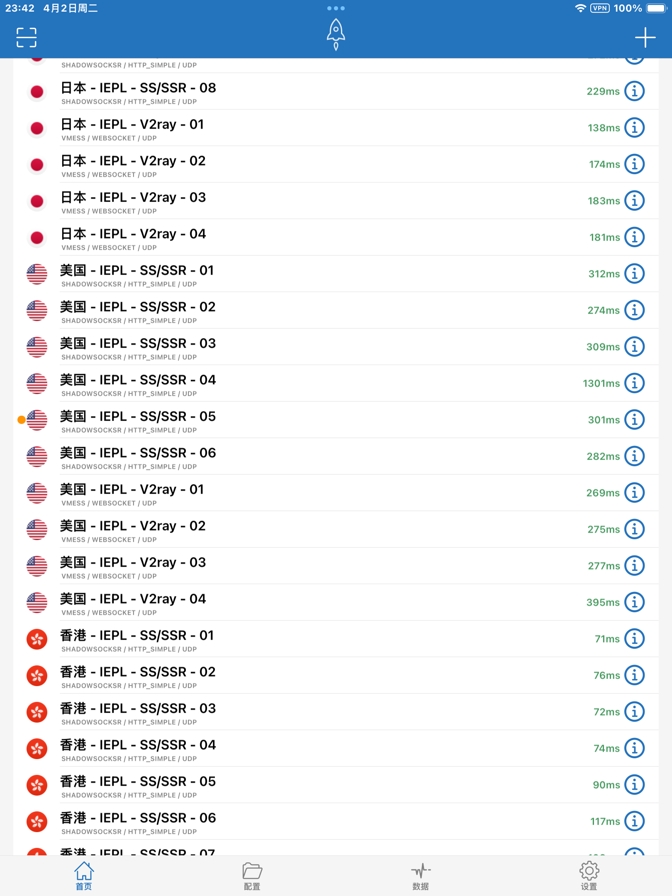

# 苹果过墙

**0、准备工作**

* 一个国内手机号。（即使已经注册过中国区Apple ID的手机号也可以拿来注册美区账号）

* 一个没注册过Apple ID的邮箱。

* 此步骤需==特别注意：选择免税州==：购买App store里的应用时不用交税

    美国有5个州免消费税，分别是：俄勒冈（Oregon）、阿拉斯加（Alaska）、特拉华（Delaware）、蒙大拿（Montana）和新罕布什尔（New Hampshire）。但是因为阿拉斯加允许地方政府征收地方销售税。所以保险起见，建议选择其他几个州。

**1、Windows上注册**

进入美国 Apple ID 注册页面 https://appleid.apple.com/account 

- 国家要填美国。
- 年龄要大于十八岁。
- 邮箱随意，只要没注册过Apple ID就好。
- 密码不需要包含填写的名字、生日、邮箱中的文字或数字。
- 手机号可以直接用中国区手机号，哪怕是已经注册过中国区账号的也没问题。
- 验证方式选择短信。

点击继续会要求输入邮件验证码 + 电话验证码，验证成功即注册完成

**2、ios设备登录**

打开App Store，点击右上角头像，然后滑到底部，退出当前登录的账号。然后输入刚才的注册的美国区账号和密码，点击登录。

登录成功后，商店会自动跳转到美国区商店。随便找一个app，例如我找了TikTok，然后点击获取，这时会弹出提示：`此Apple ID尚未在iTunes商店使用过`，需要*点击检查*，完善资料。

点击检查之后，会需要完善付款方式和账单地址。这里照着下图所示填好，注意：

- ==**付款方式那一栏千万不要选。**==
- 填写资料【==必须写这个，写错州的看下一条==】
    * 街道：2586 Center Street
    * 城市：Albany
    * 州：俄勒冈州
    * 邮政编码：97321
    * 电话：5419174902

以上步骤完成即注册成功！

> 若手滑填错账单地址【==没有选免税州==】，可以使用安卓手机，下载Apple Music的应用，然后使用美区账号登录该应用。接着找到付款信息设置页面，即要修改的账单地址信息页。在付款方式选项中，会多出一个“无”的选项，选择“无”并修改账单地址后保存。

**3、下载Shadowrocket【2.99$】**

淘宝搜索美区礼品卡，此处我推荐【https://m.tb.cn/h.5Bi4inn?tk=raifWpqmJcZ+CZ0015】，购买3$礼品卡后去商店兑换后就可购买应用并安装

**4、寻找机场添加节点即可**

找一个延迟低的节点即可科学上网




# 内网IP段

若域名解析为以下IP段，则域名为内网IP，非公网IP

```perl
10.0.0.0~10.255.255.255
172.16.0.0~172.31.255.255
192.168.0.0~192.168.255.255
```

# JDBC路由方案

JDBC可重写，只需实现java.sql.Driver就可重写jdbc的连接

实现ava.sql.Driver，创建连接时传入info选择的引擎，在底层实现引擎切换

# OSG统一接口调度

所有对外的接口统一为【固定域名】/【id号】

# 接口抓包

有cas认证的页面，cas登陆时的cookie【输错密码才能抓到】就是登录后跳转页面的cookie？

# 接口cookie

登录时会返回set-cookie的请求头，这个在以下需要登录的模块需要使用，不可忽略，在python中可以使用session对象保存这个cookie


# Python

python没有多线程请使用多进程

```python
# _*_coding:utf-8_*_
# @author Nepkisa
# @date 2024/3/23 20:59
from time import sleep
import concurrent.futures
import itertools
import json
import re
import sys
import time
import webbrowser
import requests


# 对于一眼【10s】不能看出的问题需要使用以下步骤【预计5~10分钟】
# 0、提供给程序产线、应用id、问题
#
# 1、生成SQL&AI搜索文档库&搜索confluence【easy】
#
# 2、给出应用信息，直接获取日志链接/监控链接/SQL【normal】
#
# 3、根据生成的SQL获取靠前的五个会话id，打开IM+的链接；打开监控链接【hard？】
#
# 4、以上步骤执行完成依旧不能获取结果，直接请二线【给出对应产线的二线姓名】【easy】
#
# 5、会话内容由hive迁移至ES？每个产线一个库【只为提高搜索效率】【magic】
#
# 6、自动归纳上述内容【pound】


class Solution(object):
    def __init__(self, productLine, *keys):
        self.productLine = productLine
        self.keys = list(keys)
        self.session = requests.session()
        self.debug = True

    def debugX(self, debug=False):
        self.debug = debug

    def print_debug(self, *args, **kwargs):
        if self.debug:
            print(*args, **kwargs)
        else:
            pass

    def icopilot_api(self):
        args = sys.argv
        # 设置请求的URL和数据
        url = 'http://chatgpt.xxxxx/docWiki/docWikiSearch/lines'
        product_line = {
            "captain": ["CAPTAIN", "PAAS"],
            "ck": ["CLICKHOUSE"],
            "db": ["DB", "REDIS"],
            "fx": ["DAL", "QMQ", "QCONFIG", "SOA", "VI"],
            "slb": ["SLB", "GATEWAY"],
            "gjzt": ["GJZT"],
            "gps": ["GPS"],
            "bat": ["HICKWALL"],
            "idev": ["idev"],
            "bigdata": ["MUISE", "ZEUS"],
            "sre": ["JUMP", "SRE"],
            "mom": ["MOM"],
            "nodejs": ["NODEJS"],
            "nova": ["NOVA"],
            "proxy": ["PROXY"],
            "scm": ["SCM"],
            "remedy": ["REMEDY"],
            "galaxy": ["GALAXY"],
            "nepkisa": ["GALAXY", "MOM", "PROXY", "SCM", "CAPTAIN", "PAAS", "SLB", "GATEWAY"]
        }
        # data = {
        #     "productionLine": product_line['nepkisa'],
        #     "source": "ts",
        #     "text": "域名的方式请求对方的接口返404,但是通过直接ip的方式访问是正常返回的"
        # }
        text = ''
        for key in self.keys:
            text += f"{key} "
        text = text[:-1]
        data = {
            "productionLine": product_line[self.productLine],
            "source": "ts",
            "text": text
        }
        # 设置请求头部
        headers = {'Content-Type': 'application/json'}

        self.print_debug(url, "\n", json.dumps(data, indent=4, ensure_ascii=False),
                         "\n--------------------------------------------------------")

        # 发送POST请求
        response = requests.post(url, data=json.dumps(data), headers=headers)

        # 检查响应状态码
        def formatResponse(response_data, isPrint=False):
            requestJson = json.loads(response_data['requestJson'])
            del response_data['requestJson']
            formatted_data = json.dumps(response_data, indent=4, ensure_ascii=False)

            if isPrint:
                self.print_debug(formatted_data.encode('utf-8').decode('utf8'))
            else:
                with open("result.txt", "w", encoding="utf-8") as file:
                    file.write(formatted_data.encode('utf-8').decode('utf-8'))
            requestJson = requestJson[0]['content']
            # 将"\n"替换为换行符
            requestJson = requestJson.replace("\\n", "\n")
            # 将"\r\n"替换为换行符
            requestJson = requestJson.replace("\\r\\n", "\n")
            # 初始化格式化后的字符串
            formatted_string = ""
            # 初始化当前位置和上一个中文标点符号的位置
            current_pos = 0
            last_match_pos = 0
            # 循环处理整个字符串
            while current_pos < len(requestJson):
                # 使用正则表达式找到下一个中文标点符号的索引
                match = re.search(r'[,.，；。<！？]', requestJson[current_pos:])
                if match:
                    # 如果找到了中文标点符号，则计算其在整个字符串中的位置
                    match_pos = current_pos + match.start()
                    # 如果当前位置和上一个中文标点符号的位置之间的距离大于60，则在上一个中文标点符号处进行换行
                    if match_pos - last_match_pos > 60:
                        # 将上一个中文标点符号到当前中文标点符号之间的子字符串添加到格式化后的字符串中，并在末尾添加换行符
                        formatted_string += requestJson[last_match_pos:match_pos + 1] + "\n"
                        # 更新上一个中文标点符号的位置
                        last_match_pos = match_pos + 1
                # 更新当前位置
                current_pos += 1
            # 将最后一个中文标点符号之后的子字符串添加到格式化后的字符串中
            formatted_string += requestJson[last_match_pos:]

            # 打印格式化后的字符串
            if isPrint:
                self.print_debug(formatted_string.encode('utf-8').decode('utf-8'))
            else:
                with open("result.txt", "a", encoding="utf-8") as file:
                    file.write(requestJson.encode('utf-8').decode('utf-8'))
                    file.close()

        if response.status_code == 200:
            # 请求成功
            response_data = response.json()
            webbrowser.open(response_data['url'], new=2)
            # 控制台打印原始内容
            # if len(args) > 3:
            #     self.print_debug(response_data)
            #     exit(0)
            formatResponse(response_data, False)
            # 请求失败
        else:
            self.print_debug('状态码:', response.status_code)
            exit(1)

    def generateSql(self):
        prefix = '''
SELECT DISTINCT URL
FROM (
    SELECT concat('https://xxxxxxxxxxxxx&inputTypeContent=', content_id) AS url
    FROM (
        SELECT 表名.content_id, 表名.recev_date
        FROM `库名`.`表名`
        WHERE 表名.send_user NOT LIKE 'ipub-%'
            AND 表名.send_user != '小橙子'
            AND (regexp(表名.content_id, '^[1-9]') = true)
            AND (1 = 2    
'''
        queryCondition = ' '
        for key in self.keys:
            queryCondition += f"\t\t\t\tOR 表名.content LIKE '%{key}%' \n"
        queryCondition = queryCondition[:-2]

        suffix = f''')
            AND 表名.product_line IN ('{self.productLine.upper()}')
            AND 表名.recev_date > '2023-01-01'
            AND 1 = 1
        GROUP BY 表名.content_id, 表名.recev_date
    ) X
    ORDER BY recev_date DESC
    LIMIT 5
) Y
        '''
        self.print_debug(f"hql generate successfully, hql is {prefix + queryCondition + suffix}")
        return prefix + queryCondition + suffix

    def getUrlForSession(self):
        url_login = "https://cas.xxxx.login/account"
        try:
            response_login = self.session.post(url_login,
                                               data="username=xxxxx&password=xxxxxxxxx",
                                               headers={
                                                   "Content-Type": "application/x-www-form-urlencoded; charset=UTF-8"})
        except requests.exceptions.RequestException as e:
            self.print_debug("login failure, error: {}", format(e))
            exit(1)
        if response_login.status_code == 200:
            self.print_debug("login successfully!")
            url_adhoc_execute_sql = "http://xxxxxxxxxxxxxxxxxxxx/rest/query/submit"
            headers_adhoc_execute_sql = {
                "Accept": "application/json",
                "Content-Type": "application/json",
            }
            data_adhoc_execute_sql = {
                "execMode": "STARROCKS_HIVE",
                "hql": self.generateSql(),
                "roleName": "buadm_cis",
                "rowLimit": 1000000,
                "isPersonal": "true",
                "queryName": "sql-1"
            }
            json_adhoc_execute_sql = json.dumps(data_adhoc_execute_sql)
            try:
                response_adhoc_execute_sql = self.session.post(url_adhoc_execute_sql, data=json_adhoc_execute_sql,
                                                               headers=headers_adhoc_execute_sql)
            except requests.exceptions.RequestException as e:
                self.print_debug("SQL execute failure, error: {}".format(e))
                exit(1)
            if response_adhoc_execute_sql.status_code == 200:
                sql_id = response_adhoc_execute_sql.json()['data']['id']
                self.print_debug("SQL execute successfully, sql_id: {}".format(sql_id))
                url_adhoc_result_query = f"http://xxxxxxxxxxxxxxxxxxxx/rest/query/result/{sql_id}"
                start_time = time.time()
                try:
                    response_adhoc_result_query = self.session.get(url_adhoc_result_query,
                                                                   headers={"Accept": "application/json"})
                    status = response_adhoc_result_query.json()['data']['currentStatus']
                    while status != "FINISHED":
                        sleep(1)
                        self.print_debug(response_adhoc_result_query.json()['data']['queryLog'])
                        response_adhoc_result_query = self.session.get(url_adhoc_result_query,
                                                                       headers={"Accept": "application/json"})
                        status = response_adhoc_result_query.json()['data']['currentStatus']
                        if status == "FAILED":
                            raise Exception("SQL execute failure")
                    end_time = time.time()
                    result = response_adhoc_result_query.json()['data']['data']
                    self.print_debug(
                        "result query successfully, takes: {:.2f}s, count: {}".format((end_time - start_time),
                                                                                      len(result)))
                    return list(itertools.chain(*result))
                except requests.exceptions.RequestException as e:
                    self.print_debug("result query failure, error: {}".format(e))
                    exit(1)

    def getUrlForConfluence(self):
        queryString = ''
        for key in self.keys:
            queryString += f"{key}+"
        queryString = queryString[:-1]
        return ['http://conf.xxxxxxxxxxxxxxxxxxxxxxxxxx/dosearchsite.action?queryString=' + queryString]

    def getUrlForCaptain(self):
        pass

    def getUrlForBat(self):
        pass

    # 默认浏览器
    def open(self, urls):
        # urls = [
        #     'https://www.baidu.com',
        #     'https://www.taobao.com',
        #     'https://www.jd.com'
        # ]
        for url in urls:
            self.print_debug(url)
            # new=2 表示在新的标签页中打开
            webbrowser.open(url, new=2)


if __name__ == '__main__':
    args = sys.argv
    keys = list(args)
    del keys[0]
    del keys[0]
    solution = Solution(args[1], *keys)
    solution.debugX()
    # 创建进程池
    with concurrent.futures.ProcessPoolExecutor() as executor:
        # 提交任务到进程池
        future1 = executor.submit(solution.getUrlForSession)
        future2 = executor.submit(solution.getUrlForConfluence)
        future3 = executor.submit(solution.icopilot_api)
        # 迭代已完成的任务
        for future in concurrent.futures.as_completed([future1, future2]):
            # 获取任务的结果
            urls = future.result()
            # 提交任务到进程池，并异步执行
            executor.submit(solution.open(urls))
    print("All tasks have been submitted to the process pool")

```

# Shell

```bash
#!/bin/bash
# shellcheck disable=SC1073
if [[ $# -eq 0 ]];then
    echo -e "\033[31mPlease input args like [productionLine] [question]\033[0m"
    exit 1
# shellcheck disable=SC1048
fi
if [[ -z $2 ]];then
    productionLine=nepkisa
    question=$1
else
    productionLine=$1
    question=$2
fi
python Solution.py $productionLine $question $3 
if [[ $? == 0 ]];then
    cat result.txt
fi
```

