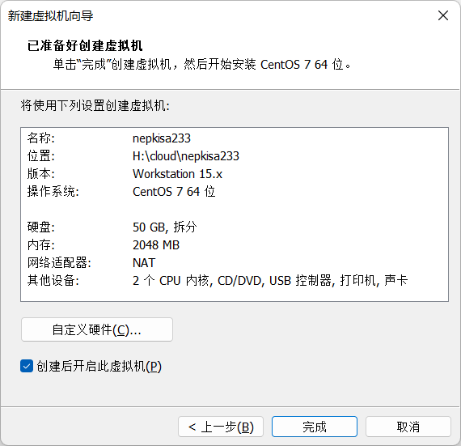
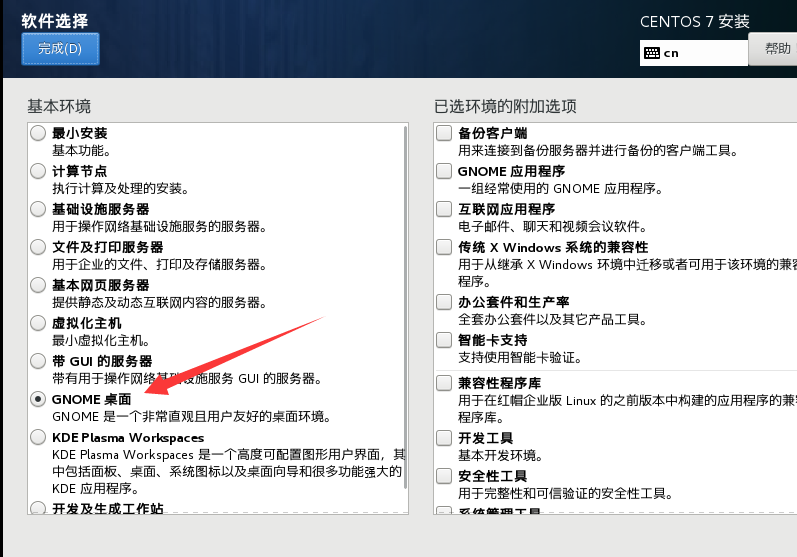
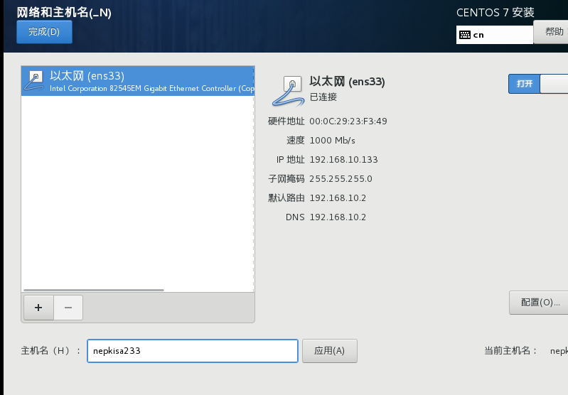
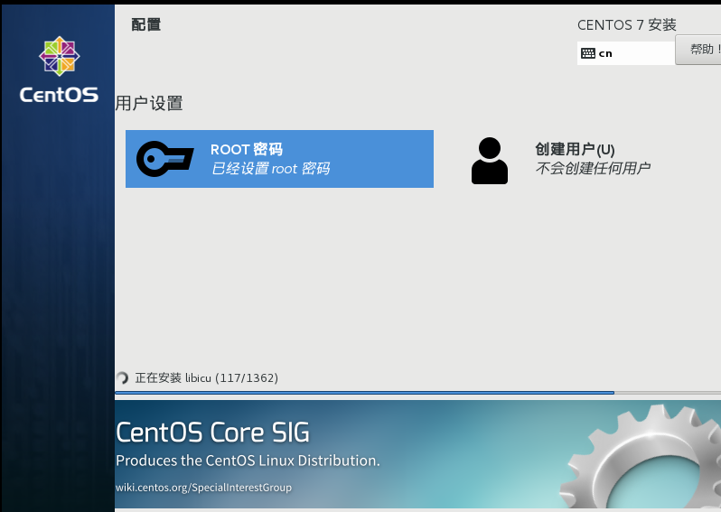
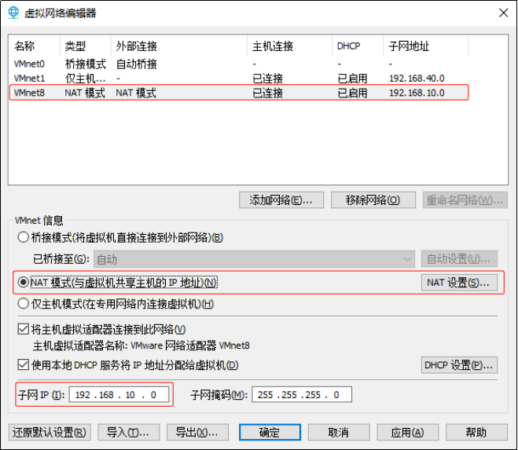
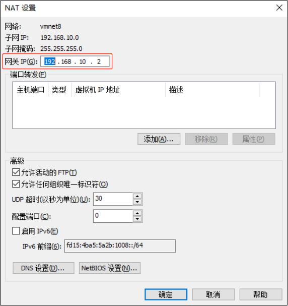
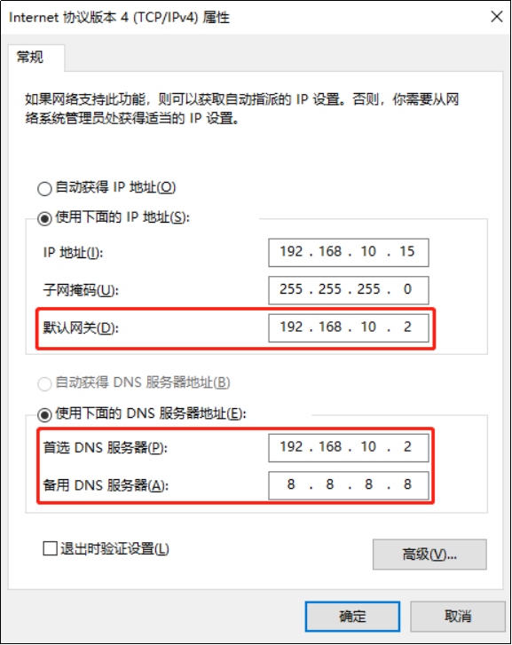

# 创建模板虚拟机

**Linux镜像：CentOS-7.5-x86_64-DVD-1804.iso**

## 模板虚拟机环境准备

**安装模板虚拟机，IP地址`192.168.10.233`、主机名称`nepkisa233`、内存~~4G~~（`2G`）、硬盘`50G`**










**虚拟机配置要求如下**

>使用yum安装需要虚拟机可以正常上网，yum安装前可以先测试下虚拟机联网情况
>
>```bash
>ping www.baidu.com
>```

**安装epel-release**

> 注：Extra Packages for Enterprise Linux是为“红帽系”的操作系统提供额外的软件包，适用于RHEL、CentOS和Scientific Linux。相当于是一个软件仓库，大多数rpm包在官方 repository 中是找不到的）
>
> ```bash
> yum install -y epel-release
> ```

**安装工具包（若安装最小系统版）**

> net-tool：工具包集合，包含ifconfig等命令
>
> ```bash
> yum install -y net-tools
> ```
>
> vim：编辑器
>
> ```bash
> yum install -y vim
> ```

**关闭防火墙，关闭防火墙开机自启**

> 在企业开发时，通常单个服务器的防火墙时关闭的。公司整体对外会设置非常安全的防火墙
>
> ```bash
> systemctl stop firewalld
> systemctl disable firewalld.service
> ```

**创建nepkisa用户，并修改nepkisa用户的密码**

> ```bash
> useradd nepkisa
> echo "123456" | passwd --stdin nepkisa &> /dev/null
> ```

**配置nepkisa用户具有root权限，方便后期加sudo执行root权限的命令**

>```bash
>vim /etc/sudoers
>```
>
>修改/etc/sudoers文件，在%wheel这行下面添加一行，如下所示：
>
>```bash
>## Allow root to run any commands anywhere
>root    ALL=(ALL)     ALL
>
>## Allows people in group wheel to run all commands
>%wheel  ALL=(ALL)       ALL
>nepkisa   ALL=(ALL)     NOPASSWD:ALL
>```
>
>*注意：nepkisa这一行不要直接放到root行下面，因为所有用户都属于wheel组，你先配置了nepkisa具有免密功能，但是程序执行到%wheel行时，该功能又被覆盖回需要密码。所以nepkisa要放到%wheel这行下面。*

**在/opt目录下创建文件夹，并修改所属主和所属组**

>```bash
>mkdir /opt/software /opt/module
>chown nepkisa:nepkisa /opt/module
>chown nepkisa:nepkisa /opt/software
>```

**卸载虚拟机自带的JDK**

> *注意：如果你的虚拟机是最小化安装不需要执行这一步。*
>
> ```bash
> rpm -qa | grep -i java | xargs -n1 rpm -e --nodeps
> ```
>
> * `rpm -qa`：查询所安装的所有rpm软件包
>
> * `grep -i`：忽略大小写
>
> * `xargs -n1`：表示每次只传递一个参数
>
> * `rpm -e –nodeps`：强制卸载软件

**修改虚拟机的静态IP**

>```bash
>vim /etc/sysconfig/network-scripts/ifcfg-ens33
>```
>
>改成
>
>```properties
>#网络类型（通常是Ethemet）
>TYPE="Ethernet"
>PROXY_METHOD="none"
>BROWSER_ONLY="no"
>#IP的配置方法[none|static|bootp|dhcp]
>#（引导时不使用协议|静态分配IP|BOOTP协议|DHCP协议）
>BOOTPROTO="static"
>DEFROUTE="yes"
>IPV4_FAILURE_FATAL="no"
>IPV6INIT="yes"
>IPV6_AUTOCONF="yes"
>IPV6_DEFROUTE="yes"
>IPV6_FAILURE_FATAL="no"
>IPV6_ADDR_GEN_MODE="stable-privacy"
>NAME="ens33"
>#随机id
>UUID="ccd4f48e-1734-4bca-93dd-8862a3907875"
>#接口名（设备，网卡）
>DEVICE="ens33"
>#系统启动的时候网络接口是否有效
>ONBOOT="yes"
>#IP地址
>IPADDR=192.168.10.233
>#网关
>GATEWAY=192.168.10.2
>#域名解析器
>DNS1=192.168.10.2
>```

**查看Linux虚拟机的虚拟网络编辑器，编辑->虚拟网络编辑器->VMnet8**





**查看Windows系统适配器VMware Network Adapter VMnet8的IP地址**



**保证Linux系统ifcfg-ens33文件中IP地址、虚拟网络编辑器地址和Windows系统VM8网络IP地址相同。**

**修改主机名称**

> ```bash
> vim /etc/hostname
> ```

**重启虚拟机**

>```perl
>reboot
>```

## 修改语言环境

### 英文

```perl
# vim /etc/profile.d/locale.sh
export LC_CTYPE=en_US.UTF-8
export LC_ALL=en_US.UTF-8
 
# vim /etc/locale.conf
LANG=en_US.UTF-8
 
# vim /etc/sysconfig/i18n
LANG=en_US.UTF-8
 
# vim /etc/environment
LANG=en_US.UTF-8
LC_ALL=en_US.UTF-8
```

### 中文

```perl
# vim /etc/profile.d/locale.sh
export LC_CTYPE=zh_CN.UTF-8
export LC_ALL=zh_CN.UTF-8
 
# vim /etc/locale.conf
LANG=zh_CN.UTF-8
 
# vim /etc/sysconfig/i18n
LANG=zh_CN.UTF-8
 
# vim /etc/environment
LANG=zh_CN.UTF-8
LC_ALL=zh_CN.UTF-8
```

# 克隆虚拟机

## 安装JDK

> 解压后添加环境变量
>
> ```bash
> #JAVA_HOME
> export JAVA_HOME=/opt/module/jdk1.8.0_212
> export PATH=$PATH:$JAVA_HOME/bin
> ```
>
> 使环境变量生效
>
> ```bash
> source /etc/profile
> ```
>
> 测试是否安装成功
>
> ```bash
> java -version
> ```

## 修改静态IP

**修改虚拟机的静态IP**

>```bash
>vim /etc/sysconfig/network-scripts/ifcfg-ens33
>```
>
>改成
>
>```properties
>#网络类型（通常是Ethemet）
>TYPE="Ethernet"
>PROXY_METHOD="none"
>BROWSER_ONLY="no"
>#IP的配置方法[none|static|bootp|dhcp]
>#（引导时不使用协议|静态分配IP|BOOTP协议|DHCP协议）
>BOOTPROTO="static"
>DEFROUTE="yes"
>IPV4_FAILURE_FATAL="no"
>IPV6INIT="yes"
>IPV6_AUTOCONF="yes"
>IPV6_DEFROUTE="yes"
>IPV6_FAILURE_FATAL="no"
>IPV6_ADDR_GEN_MODE="stable-privacy"
>NAME="ens33"
>#随机id
>UUID="ccd4f48e-1734-4bca-93dd-8862a3907875"
>#接口名（设备，网卡）
>DEVICE="ens33"
>#系统启动的时候网络接口是否有效
>ONBOOT="yes"
>#IP地址
>IPADDR=192.168.10.233
>#网关
>GATEWAY=192.168.10.2
>#域名解析器
>DNS1=192.168.10.2
>```

## 修改hostname

> 修改主机名
>
> ```bash
> vim /etc/hostname
> 
> #改为
> k8s-master
> 
> 或者
> hostnamectl set-hostname k8s-master
> ```
>
> 配置主机名称映射hosts文件
>
> ```bash
> vim /etc/hosts
> 
> #添加
> 192.168.10.233 k8s-master
> ```

## 重启使配置生效

```perl
reboot
```

