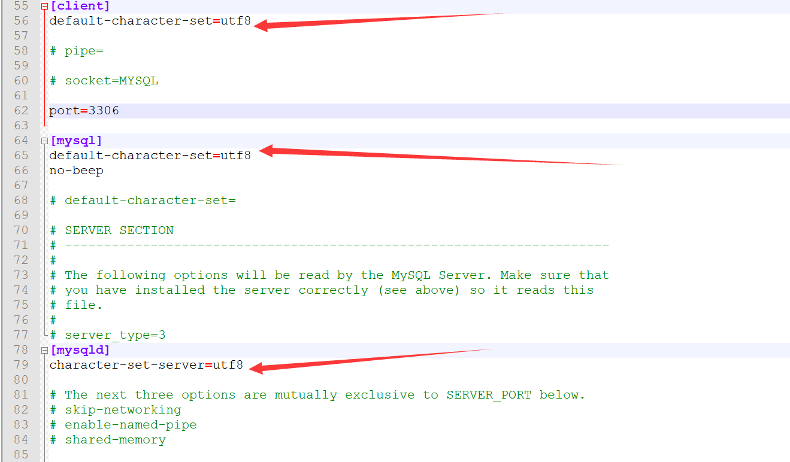
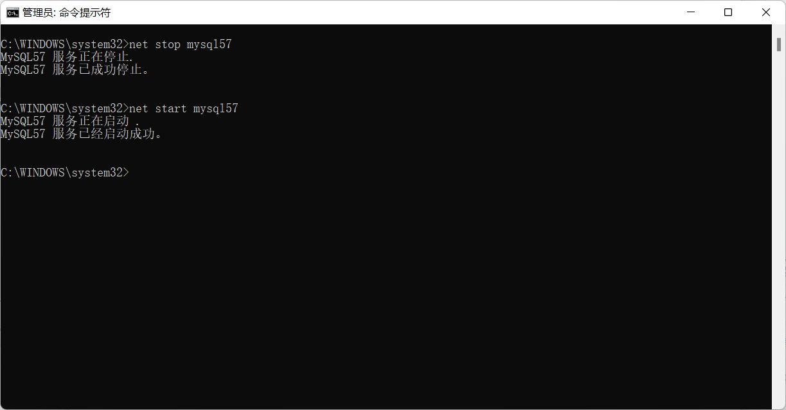
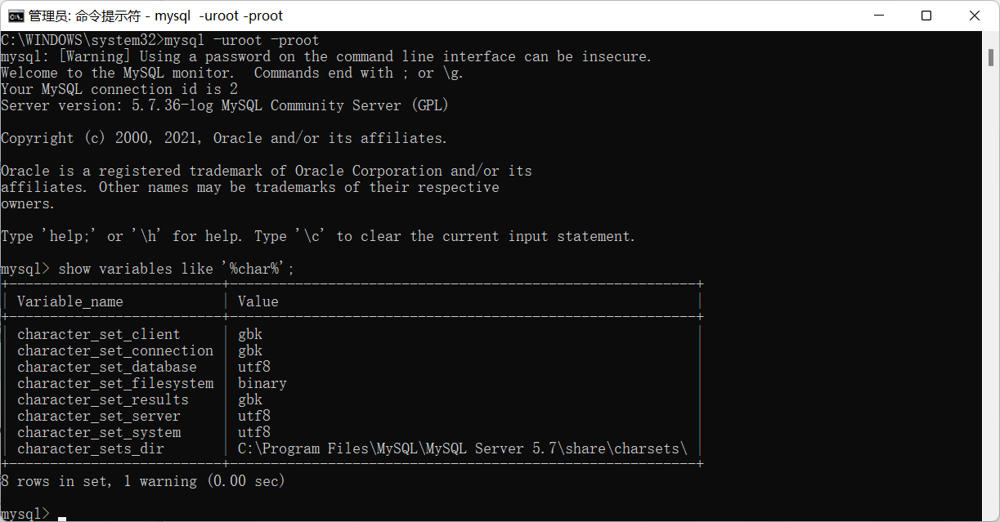
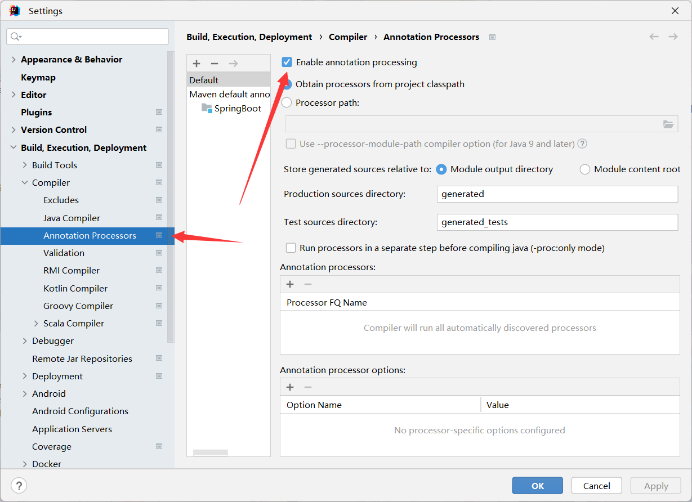
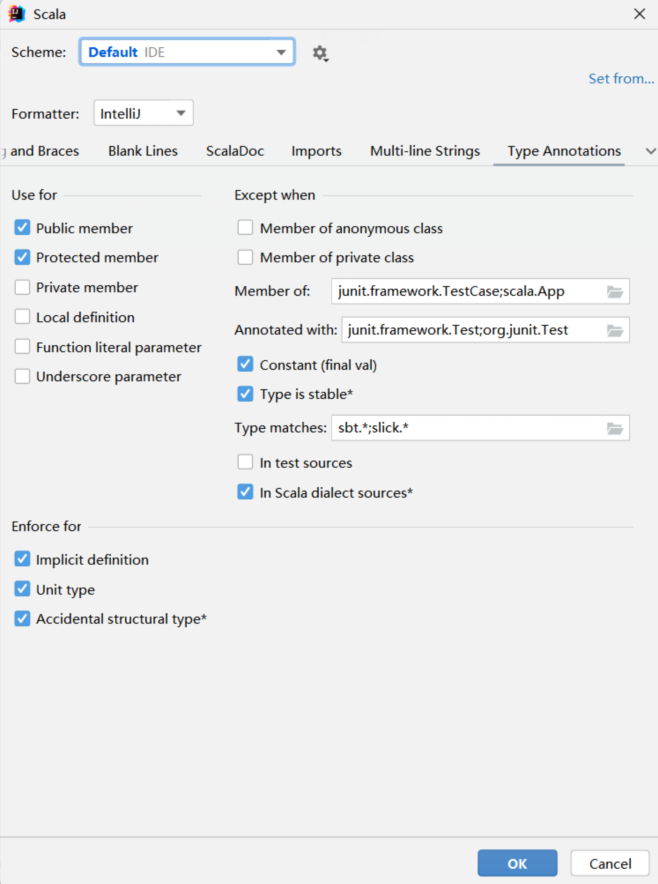
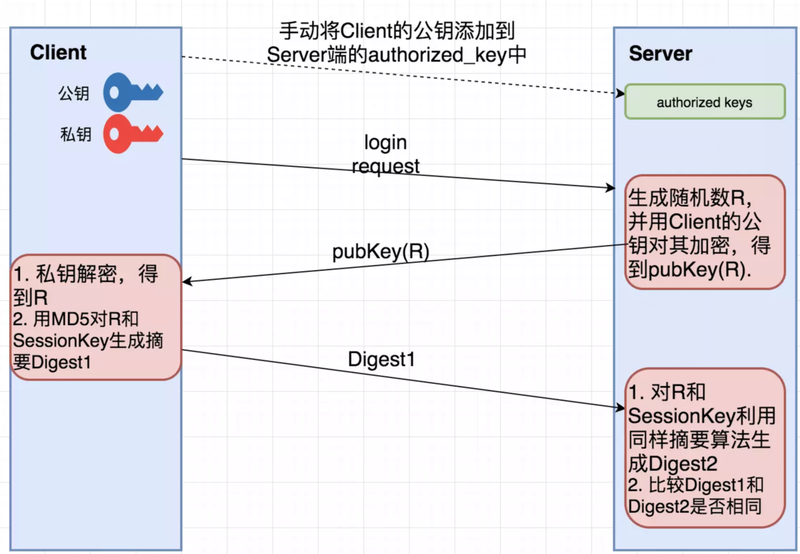

## k8s

### k8s dashboard无法访问

重启全部节点

## chrome

> chrome浏览器打开报错
>
> 您的连接不是私密连接
> 攻击者可能会试图从 x.x.x.x 窃取您的信息（例如：密码、通讯内容或信用卡信息）。了解详情

```perl
解决：就是在当前页面用键盘输入  thisisunsafe  ，不是在地址栏输入，就直接敲键盘就行了，页面即会自动刷新进入网页。
```

## Word

> 页面布局设置上下左右1.5cm，采用A4纸张
>
> 三个减号---代表分割线
>
> 选中文字，点击无框线可去除横线
>
> 
>
> 

## Typora代码块背景

```perl
github.css文件的
.md-fences标签里
	#FFE4E1
	你这不行
```

## Typora无法支持mermaid新语法

现象：显示空白页

```perl
​```mermaid
info
​```
可查看mermaid版本信息
```


### 处理办法（Windows）

#### 下载Mermaid最新版本的js文件

由于Typora本质是一个js实现的Markdown编辑器，Mermaid也是一个js实现的图表库，Typora通过js引用的方式集成了Mermaid。因此，为了集成最新版本的Mermaid，我们首先需要下载Mermaid最新版本的js文件：

1. 寻找mermaid新版的CDN下载地址(https://www.bootcdn.cn/mermaid/)
2. 下载最新版本的 `mermaid.min.js` 文件到本地（例如 `9.3.0` 版本地址：https://cdn.bootcdn.net/ajax/libs/mermaid/9.3.0/mermaid.min.js）

除了官方提供的CDN下载方式，通过其他渠道下载也可以。

#### 打开Typora的window.html文件

假设我们Typora的安装目录在 `D:/Typora`，那么在其中的 `resources/app` 目录下可以找到一个 `window.html` 文件，打开这个文件。

#### 引用Mermaid的js文件

在 `window.html` 文件中的 </body> 前插入以下代码并保存：

```javascript
<script>
	const interval = setInterval(() => {
		console.log('check mermaid...');
		if (window.editor &&
			window.editor.diagrams &&
			window.mermaidAPI) {
			$.getScript('file:///G:/Typora/resources/app/mermaid.min.js')
				.then(() => {
					mermaidAPI = mermaid.mermaidAPI;
					editor.diagrams.refreshDiagram(editor);
					clearInterval(interval);
				});
		}
	}, 100);
</script>
```

上面代码会在Typora窗口打开后定时检查自带的Mermaid是否已集成，如果已集成，那么就通过jQuery从本地加载我们前面下载的js文件。

#### 重新打开Typora

修改并保存 `window.html` 文件后，重新打开Typora

查看Mermaid的版本，也可以看到已经成功替换成了最新版：


## 通过对win10注册表修改来关闭睿频（高性能/已禁用来回切换）

睿频的关闭会使电脑的温度和功耗大大降低起到稳定的作用；但是并不是说关闭睿频就是好的，小伙伴们根据自身需求来选择是关闭还是开启睿频；下面介绍通过修改注册表后在电源选项中来回切换高性能和已禁用来开启和关闭睿频。

1、桌面状态下同时按”Windows+R键“，打开“运行”窗口，输入regedit并按回车进入注册表编辑器；（也可以在”开始“菜单，找到“windows管理工具”并点开找到注册表编辑器点开进入）

注册表编辑器
2、在注册表左边框依次选择如下位置【HKEY_LOCAL_MACHINE\SYSTEM\CurrentControlSet\Control\Power\PowerSettings\54533251-82be-4824-96c1-47b60b740d00\be337238-0d82-4146-a960-4f3749d470c7】

找到注册表位置
3、双击图中的Attributes并且把数值从1改成2，确定后退出重启（如果没有Attributes的情况话只需在左上角点编辑——新建——DWORD（32）后将名字改为Attributes，重复上面步骤，基数设为十六进即可）

数值“1”，改为“2”
4、重启电脑后，进入设置——系统——电源与睡眠——其他电源设置——选中你正在用的电源计划右边的更改计划设置——更改高级电源设置——处理器电源管理，你会发现多了一个处理器性能提升模式；点击加号设置为已禁用即可关闭睿频（在“控制面版”中选额“电源选项”也可到达更改计划设置）


“高性能”为系统默认即开启睿频状态
“已禁用”确定即可关闭睿频


总结：可以根据自己的需要来选择禁用还是开启睿频，通过选择高性能/已禁用来开启/关闭睿频;（也可以在最大处理器状态处把设置100%改为99%来关闭睿频，重新调为100%来开启睿频，这样比较麻烦不如直接在高性能和已禁用来回切换便捷） 

## ElasticSearch

ElasticSearch报错：

```powershell
[TOO_MANY_REQUESTS/12/index read-only / allow delete (api)]
```

==原因：磁盘空间不足，导致Elasticsearch触发磁盘保护，强制将所有索引设置成了只读状态。==

```shell
主要相关参数如下：

cluster.routing.allocation.disk.threshold_enabled：是否启动根据磁盘空间自动分配，默认为true
cluster.routing.allocation.disk.watermark.low：控制磁盘使用率的低水位，默认是85%，当一个节点的磁盘空间使用率超过85%，就不会给该节点分配新的shard
cluster.routing.allocation.disk.watermark.high：控制磁盘使用率的高水位，默认是90%，当一个节点的磁盘空间使用率超过90%，就会将该节点的部分shard转移到其他节点上
cluster.routing.allocation.disk.watermark.flood_stage：洪水水位线，默认为95%，当一个节点的磁盘空间使用率超过95%，就会把所有索引设为只读。这是最后一个保护措施，索引的只读状态必须通过人工手动解除
cluster.info.update.interval：检查磁盘使用率的频率，默认30s
```


```powershell
[2022-12-08T23:06:21,629][WARN ][o.e.c.r.a.DiskThresholdMonitor] [DESKTOP-UA4DJL8] flood stage disk watermark [95%] exceeded on [hOXH96qcRMeWHFMO8peCCw][DESKTOP-UA4DJL8][D:\elasticsearch-7.8.0-windows-x86_64\elasticsearch-7.8.0\data\nodes\0] free: 6.1gb[4.6%], all indices on this node will be marked read-only
```

相关参数见官方文档：[Disk-based Shard Allocation](https://www.elastic.co/guide/en/elasticsearch/reference/6.8/disk-allocator.html)。

**解决： **取消节点的只读模式

```perl
###取消节点的只读模式
PUT http://127.0.0.1:9200/_all/_settings
Content-Type: application/json

{
  "index.blocks.read_only_allow_delete": null
}
```

## Google域名重定向

```perl
原理：告诉Google.com不要进行区域重定向（No Country Redirection，简称NCR）。

具体做法：在网址栏打入http://www.google.com/ncr，然后回车即可。如果清理了Cookies缓存，还是出现自动跳转现象，重新再在网址栏打入http://www.google.com/ncr输入，回车就行。
```


## GitHub

==密码是token==

```shell
Failed to connect to github.com port 443 after 21074 ms: Timed out

使用梯子配置代理

git config --global -l
http.proxy=http://127.0.0.1:1080
https.proxy=http://127.0.0.1:1080
我们把显示结果分为等号前和等号后，先把自己原先（也就是此刻）显示的proxy保存下来，记住此刻的端口号：1080

删除自己的proxy设置
git config --global --unset http.proxy
git config --global --unset https.proxy
这两个命令都要，因为一个是http，一个是https，分两次执行，--unset后面的http.proxy，就是我们说的等号左边的内容。

重新设置自己的proxy
这个时候我们保存的之前的proxy端口号就有作用了

执行：

git config --global http.proxy http://127.0.0.1:1080
git config --global https.proxy http://127.0.0.1:1080
例子的端口号是1080，把1080换成自己的端口号就可以了。

稍微检查一下，就可以了
git config --global -l


==============================================
Github多用户
一个公钥只能绑定一个账号
ssh-keygen 时指定第二个公钥，将第二个公钥添加给第二个Github账号

清除本地缓存（如windows里缓存的凭据)
git config -l|grep credential.helper
git config --system --unset credential.helper
git config --system --unset credential.helperselector.selected

ssh -T git@github.com 验证当前用户

ssh-add -l报错：Could not open a connection to your authentication agent.

ssh-agent bash
eval `ssh-agent -s`
ssh-add -l
ssh-add -d ~/.ssh/id_rsa
ssh-add ~/.ssh/id_rsa_neptune
ssh -T git@github.com

切换用户成功~
```

## BiliBili N倍速

```javascript
//F12 控制台输入
document.querySelector('bwp-video').playbackRate = 4
document.querySelector('video').playbackRate = 4
```

## Windows

```
直接复制 reg add "HKCU\Software\Classes\CLSID\{86ca1aa0-34aa-4e8b-a509-50c905bae2a2}\InprocServer32" /f /ve
然后粘在命令提示符里回车。

后面在加上这一句，重启资源管理器
taskkill /f /im explorer.exe & start explorer.exe
```

### PDF转Word

```
使用office Word打开pdf文件另存为即可
```


```bash
Win11切换旧版右键菜单，把下面的代码保存为bat文件运行：

reg add "HKCU\Software\Classes\CLSID\{86ca1aa0-34aa-4e8b-a509-50c905bae2a2}\InprocServer32" /f /ve
taskkill /f /im explorer.exe & start explorer.exe
```

```bash
Win11恢复回新右键菜单，把下面的代码保存为bat文件运行：

reg delete "HKCU\Software\Classes\CLSID\{86ca1aa0-34aa-4e8b-a509-50c905bae2a2}" /f
taskkill /f /im explorer.exe & start explorer.exe
```

## DataGrip无法下载驱动

设置自动代理

## UTF8

一个字母字符为1字节
一个汉字字符为2字节

utf8为可变长度编码(1-4字节)

在utf8中保存汉字字符
1110开头表示3字节场长度，后续10开头表示是后缀
去掉8位后即是中文的[16位 2字节]


## Mysql

#### 修改用户密码

```
alter user 'root'@'localhost' identified by '123';
```


```sql
时间函数
select datediff('2022-4-26','2022-3-21');

select date_add ('2022-4-26',interval 14 day);
```
#### 根据表名查库
```sql
SELECT table_schema FROM information_schema.TABLES WHERE table_name = '表名';
```
#### 根据字段名查表
```sql
select table_schema,table_name from information_schema.columns where column_name = '字段名'
```
#### 表重命名
```sql
rename table name1 to name2;//将name1改为name2

alter table xntest
    add dbtps double null after options;

```
#### 修改字符集
1. 
```sql
show variables like '%char%';
可以看到有些是latin1、gbk字符集，我们需要将它们都修改为utf8字符集。
```
2. 
```sql
修改my.ini文件
打开目录 C:\ProgramData\Mysql\Mysql Server 5.7\

添加
default-character-set = utf8
character_set_server = utf8


[client]
default-character-set=utf8

# pipe=

# socket=MYSQL

port=3306

[mysql]
default-character-set=utf8
no-beep

# default-character-set=

# SERVER SECTION
# ----------------------------------------------------------------------
#
# The following options will be read by the MySQL Server. Make sure that
# you have installed the server correctly (see above) so it reads this 
# file.
#
# server_type=3
[mysqld]
character-set-server=utf8

```



3. 重启mysql服务
```xml
以管理员权限打开cmd！！！服务名不一定是mysql
net stop mysql
net start mysql
或者
控制面板->管理工具->服务-> 找到mysql服务
```



4. 重新登录mysql查看字符集

```sql
show variables like '%char%';
```



```
character_set_client
character_set_connection
character_set_results
以上三个属性会自动转化
cmd的字符集是gbk，datagrip的字符集是utf8，会根据连接属性自动切换
```


5. 注意：如果执行完上面的操作，字符集修改无效
   请将刚刚修改好的C:\ProgramData\Mysql\Mysql Server 5.7\my.ini文件复制到安装路径下！！！
     重启mysql服务，再登录mysql查看字符集（重复第3、4步）
     这个时候应该是修改成功的，如果还是不行的话，有可能你安装的mysql出问题，请重装试试。

## oracle

#### ORA-01012: not logged on

```perl
lsnrctl stop
shutdonwn abort
ps -ef|grep ora_dbw0_$Oracle_SID
kill -9 进程号
lsnrctl start
startup mount
alter database open;
```


#### 表空间扩容

```sql
alter tablespace tablespace_name 'd:\test\sp01.dbf' resize 20m;

ALTER DATABASE DATAFILE 'c:\SmartDB01.ora' AUTOEXTEND ON;//打开自动增长

ALTER DATABASE DATAFILE 'c:\SmartDB01.ora' AUTOEXTEND ON NEXT 200M ;//每次自动增长200m

ALTER DATABASE DATAFILE 'c:\SmartDB01.ora' AUTOEXTEND ON NEXT 200M MAXSIZE 1024M;//每次自动增长200m，数据表最大不超过1G

增加表空间文件
alter tablespace sysaux add datafile '/arch/sysaux02.dbf’size 2048m autoextend on;

```


### PLSQL

```sql
set serveroutput on;--Oracle输出默认关闭
```

#### clob字段操作

##### SQL

```sql
Create DIRECTORY让我们可以在Oracle数据库中灵活的对文件进行读写操作，极大的提高了Oracle的易用性和可扩展性。
其语法为：
CREATE [OR REPLACE] DIRECTORY directory AS 'pathname';

本案例具体创建如下:
create or replace directory exp_dir as '/tmp';

目录创建以后，就可以把读写权限授予特定用户，具体语法如下:
GRANT READ[,WRITE] ON DIRECTORY directory TO username;
例如:
grant read, write on directory exp_dir to eygle;
此时用户eygle就拥有了对该目录的读写权限。

查询目录
select * from dba_directories;
删除目录
drop directory exp_dir;

让我们看一个简单的测试:
SQL> create or replace directory UTL_FILE_DIR as '/opt/oracle/utl_file';
Directory created.
SQL> declare
  2    fhandle utl_file.file_type;
  3  begin
  4    fhandle := utl_file.fopen('UTL_FILE_DIR', 'example.txt', 'w');
  5    utl_file.put_line(fhandle , 'eygle test write one');
  6    utl_file.put_line(fhandle , 'eygle test write two');
  7    utl_file.fclose(fhandle);
  8  end;
  9  /
PL/SQL procedure successfully completed.
SQL> !
[oracle@jumper 9.2.0]$ more /opt/oracle/utl_file/example.txt
eygle test write one
eygle test write two

```


###### 语句插入

```sql
insert test_table(clobcolumn) values(to_clob('待插入的字符串'));
```

```sql
DECLARE  
 REALLYBIGTEXTSTRING CLOB := '待插入的海量字符串';  
BEGIN  
   INSERT INTO test_table VALUES('test', REALLYBIGTEXTSTRING, '0');  
end ;  
/  
commit; 
```

###### 文件插入
 创建存储过程
```sql
create or replace
procedure UPDATECLOBFORMFILE (TABLENAME varchar2,CLOB_COL_NAME varchar2,P_RID rowid,DIRNAME varchar2,FILENAME varchar2,ISPRINT BOOLEAN)
	--tableName : the table's name which you will be update
	--clob_col_name : the column'name which type is clob and you will be update
	--p_rid : the record 's rowid use for filter 
	--dirName : the dirctory name you create in oracle which mapping the dirctory in your os
	--fileName : the file's name which you want to save 
  --isPrint : is print the file's context or not
is
	P_CLOB clob;
	P_UPDATESQL varchar2(200);
	P_BFILE bfile;
  P_DEST_OFFSET integer:=1;
  P_SRC_OFFSET integer:=1;
  P_CHARSET varchar2(32);
  P_BFILE_CSID number;
  P_LANG_CONTEXT integer :=DBMS_LOB.DEFAULT_LANG_CTX;
  P_WARNING integer;
  P_BUFFER raw(32000);
  P_BUFFER_SIZE integer:=32000;
  P_OFFSET integer:=1;
  
begin
  --get the db charset id use for load file by suitable charset ,otherwise the context read from file will be garbled
  select value into P_CHARSET from V$NLS_PARAMETERS where PARAMETER='NLS_CHARACTERSET';
  select NLS_CHARSET_ID(P_CHARSET) into P_BFILE_CSID from DUAL;
  
	--create the dynamic sql str
	P_UPDATESQL :='update '||TABLENAME||' set '||CLOB_COL_NAME||'=empty_clob() where rowid=:1 return '||CLOB_COL_NAME||' into :2';
	--execute the dynamic sql
	execute immediate P_UPDATESQL using P_RID returning into P_CLOB ;
 	
	P_BFILE := BFILENAME(DIRNAME,FILENAME);
  
	if (DBMS_LOB.FILEEXISTS(P_BFILE)!=0) 
	then
		DBMS_LOB.FILEOPEN(P_BFILE,DBMS_LOB.FILE_READONLY);
		DBMS_LOB.LOADCLOBFROMFILE(P_CLOB,P_BFILE,DBMS_LOB.GETLENGTH(P_BFILE),P_DEST_OFFSET,P_SRC_OFFSET,P_BFILE_CSID,P_LANG_CONTEXT,P_WARNING);
    if ISPRINT then
      --setup the print buffer size
      DBMS_OUTPUT.enable (BUFFER_SIZE=>null);
      WHILE P_OFFSET<DBMS_LOB.GETLENGTH(P_CLOB) LOOP
        DBMS_LOB.read(P_BFILE,P_BUFFER_SIZE,P_OFFSET,P_BUFFER);
        P_OFFSET:=P_OFFSET+P_BUFFER_SIZE;
        DBMS_OUTPUT.PUT_LINE(UTL_RAW.CAST_TO_VARCHAR2(P_BUFFER));
      end LOOP;
    end if;
    DBMS_LOB.FILECLOSE(P_BFILE);--close the file
		commit;
	else--if the specific file is not exist
    	dbms_output.put_line('file not found');
    	rollback;
  	end if;
	--close refcursor;
  	exception when others then
  		DBMS_OUTPUT.PUT_LINE('other exception occur,pls check the trace log!');
      raise;
end;
```
调用存储过程
```sql
DECLARE
  TABLENAME VARCHAR2(200);
  CLOB_COL_NAME VARCHAR2(200);
  P_RID ROWID;
  DIRNAME VARCHAR2(200);
  FILENAME VARCHAR2(200);
  ISDEBUG BOOLEAN;
BEGIN
  TABLENAME := 'tablename';--表名称
  CLOB_COL_NAME := 'columnname';--clob字段名称
  P_RID := 'AAAXKyAAGAAAG72AAK';--需要更新clob的记录的rowid
  DIRNAME := 'BFILE_DIR';--oracle目录名称
  FILENAME := 'aaa.txt';--文件名称
  ISDEBUG:=TRUE;
  UPDATECLOBFORMFILE(
    TABLENAME => TABLENAME,
    CLOB_COL_NAME => CLOB_COL_NAME,
    P_RID => P_RID,
    DIRNAME => DIRNAME,
    FILENAME => FILENAME,
    ISPRINT => ISDEBUG
  );
END;
```

##### jdbc

##### Oracle使用sys用户登录

```java
String user="sys as sysdba";
```

###### CharacterStream方式

```java
 
 
/** 
 * 读取CLOB字段的代码示例 
 */  
public void readClob() {  
    //自定义的数据库连接管理类　  
    Connection conn = DbManager.getInstance().getConnection();  
    try {  
        PreparedStatement stat = conn  
                .prepareStatement("select clobfield from t_clob where id='1'");  
        ResultSet rs = stat.executeQuery();  
        if (rs.next()) {  
            oracle.sql.CLOB clob = (oracle.sql.CLOB) rs  
                    .getClob("clobfield");  
            String value = clob.getSubString(1, (int) clob.length());  
            System.out.println("CLOB字段的值：" + value);  
        }  
        conn.commit();  
    } catch (SQLException e) {  
        e.printStackTrace();  
    }  
 
    DbManager.getInstance().closeConnection(conn);  
}  
 
/** 
 * 写入、更新CLOB字段的代码示例 
 */  
public void writeClob() {  
    //自定义的数据库连接管理类　  
    Connection conn = DbManager.getInstance().getConnection();  
    try {  
        conn.setAutoCommit(false);  
        // 1.这种方法写入CLOB字段可以。  
        PreparedStatement stat = conn  
                .prepareStatement("insert into t_clob (id,clobfield) values(sys_guid(),?)");  
        String clobContent = "This is a very very long string";  
        StringReader reader = new StringReader(clobContent);  
        stat.setCharacterStream(1, reader, clobContent.length());  
        stat.executeUpdate();  
 
        // 2.使用类似的方法进行更新CLOB字段，则不能成功　  
        // stat.close();  
        // stat =null;  
        // stat =  
        // conn.prepareStatement("update t_clob set clobfield=? where id=1");  
        // stat.setCharacterStream(1, reader, clobContent.length());  
        // stat.executeUpdate();  
 
        // 3.需要使用for update方法来进行更新，  
        // 但是，特别需要注意，如果原来CLOB字段有值，需要使用empty_clob()将其清空。  
        // 如果原来是null，也不能更新，必须是empty_clob()返回的结果。  
        stat = conn  
                .prepareStatement("select clobfield from t_clob where id='1' for update");  
        ResultSet rs = stat.executeQuery();  
        if (rs.next()) {  
            oracle.sql.CLOB clob = (oracle.sql.CLOB) rs  
                    .getClob("clobfield");  
            Writer outStream = clob.getCharacterOutputStream();  
            char[] c = clobContent.toCharArray();  
            outStream.write(c, 0, c.length);  
            outStream.flush();  
            outStream.close();  
        }  
        conn.commit();  
    } catch (SQLException | IOException e) {  
        // TODO Auto-generated catch block  
        e.printStackTrace();  
    }  
    DbManager.getInstance().closeConnection(conn);  
}  
```

###### BufferedReader方式

```java
import java.sql.*;  
import java.io.*;  
 
public class ReadClob {  
    public static void main(String[] args) {  
        PreparedStatement pstmt = null;  
        ResultSet rset = null;  
        BufferedReader reader = null;  
        Connection conn = null;  
        String driver = "oracle.jdbc.driver.OracleDriver";  
        String strUrl = "jdbc:oracle:thin@127.0.0.1:1521:ORCL";  
        try {  
            Class.forName(driver);  
            conn = DriverManager.getConnection(strUrl, "scott", "tiger");  
            pstmt = conn  
                    .prepareStatement("select v_clob form ord where ORD_id =?");  
            pstmt.setInt(1, 1);  
            rset = pstmt.executeQuery();  
            while (rset.next()) {  
                Clob clob = rset.getClob(1);// java.sql.Clob类型  
                reader = new BufferedReader(new InputStreamReader(clob  
                        .getAsciiStream()));  
                String line = null;  
                while ((line = reader.readLine()) != null) {  
                    System.out.println(line);  
                }  
            }  
        } catch (ClassNotFoundException e) {  
            e.printStackTrace();  
        } catch (SQLException e) {  
            e.printStackTrace();  
        } catch (IOException e) {  
            e.printStackTrace();  
        }  
    }  
}  
```

```java
//写入操作  
String stmtString = "select v_clob form ord  where ord_id =? for update";  
pstmt = conn.prepareStatement(stmtString);  
pstmt.setInt(1, 2);  
rset = pstmt.executeQuery();  
while(rset.next()){  
    //造型为oracle.sql.CLOB  
    CLOB clob = (CLOB)rset.getClob(1);  
    String newClobDate = new String("NEW CLOOB DATE");  
    Writer writer = clob.getCharacterOutputStream();  java
    //OutStream writer = clob.getAsciiOutputStream();  
    writer.write(newClobDate);  
}  
```

###### 生成一个clob对象，通过预处理的setClob达到插入更新的目的。

 方法一

```java
Connection con = dbl.loadConnection();  
strSql = "insert into table1(id,a) values (1,EMPTY_CLOB())";  
dbl.executeSql(strSql);  
String str2 = "select a from table1 where id=1";  
 
ResultSet rs = dbl.openResultSet(str2);  
if(rs.next()){  
    CLOB c = ((OracleResultSet)rs).getCLOB("a");  
    c.putString(1, "长字符串");  
    String sql = "update table1 set a=? where id=1";  
    PreparedStatement pstmt = con.prepareStatement(sql);  
    pstmt.setClob(1, c);  
    pstmt.executeUpdate();  
    pstmt.close();  
}  
con.commit();  
```

 方法二

```java
Connection con = dbl.loadConnection();  
CLOB clob   = oracle.sql.CLOB.createTemporary(con, false,oracle.sql.CLOB.DURATION_SESSION);  
clob.putString(1,  "长字符串");  
Sql1 = "update table1 set a=? where id=1";  
PreparedStatement pst = con.prepareStatement(Sql1);  
pst.setClob(1, clob);  
pst.executeUpdate();  
pst.close();  
con.commit();  
```


#### 查询前100条记录

```sql
select * from TabName  where rownum < 101
```
#### drop表后恢复
```sql
连接用户
conn 用户名/密码
查询回收站
select * from recyclebin; 
闪回
FLASHBACK TABLE [要恢复的表名] TO BEFORE DROP; 
```

## Informix

#### 导出表结构

```
dbschema命令导出表结构
dbschema -d [dbname] 导出所有表
-t [table]

dbschema -d lsk > lsk.sql
将revoke注释掉替换revoke为--revoke
dbaccess lsk lsk.sql
```


#### 解除replication镜像锁定

```sql
execute function syscdcv1:informix.cdc_set_fullrowlogging( '库名:用户名.表名 ',0)
```
#### informix中文数据库

```
3. 创建中文数据库
在默认情况下，Informix数据库不支持中文的存储和读取。创建中文数据库需要设置环境变量DB_LOCALE和CLIENT_LOCALE。Informix支持多种区域和字符集，以下介绍在不同的区域设置类型下存取中文的方法。
1) en_us.utf8
(1) 创建数据库dbutf8
   $ export DB_LOCALE=en_us.utf8
   $ dbaccess
   建库
(2) jdbc连接
   jdbc:informix-sqli://9.123.147.232:19000/dbutf8:INFORMIXSERVER=demoserver;CLIENT_LOCALE=en_us.utf8;DB_LOCALE=en_us.utf8;
(3) 插入中文数据测试
```

## IDEA

#### 找不到主类

```
删除target目录，重新编译生成
```

#### 配置文件

```
idea只有java source下的类才能识别resource的文件？
fileinputstream可以使用相对路径，当前工程的根目录为起点
```

### 使用lombok插件



#### scala自动补全类型

全部勾上



### 快捷键

```
Ctrl+P查看方法参数

在结束末尾加.var可以补全变量类型fs.get().var

在结束末尾加.while可以while循环filelists.hasnext().while

在结束末尾加.sout可以输出file.getPath().sout

Ctrl+alt+L 格式化

alt+insert 快速生成类方法

ctrl+shift+R 全局查找类/文件

Ctrl+O 查看方法

F4 选中类，查看类的层次结构，alt+7查看方法

crtl+alt+f 升级为成员变量
```


## windows

```
使用按**键ctrl+caps lock**，切换平假名。 使用按键alt+caps lock，切换片假名。 另外： alt+shift 切换中文日文输入。 在输入过程中：F6 转换为平假名，F7 转换为片假名。

fn+ESC锁f1-f12功能键
```

## VScode

```
alt+shift+f格式化

ctrl+shift+p选择功能

打开设置搜索encoding，设置自动转换编码
```

#### VScode可连接Linux运行shell脚本

```
安装xxxx插件
免密登录
windows cmd 执行ssh-keygen命令三次回车生成公钥
到目录C:\Users\用户名\.ssh查看公钥
记事本打开id_rsa.pub，全部复制
在Linux /root下有.ssh文件
vim ~/.ssh/authorized_keys
将公钥粘贴进去
如果没有 cd ~ ;mkdir .ssh
```


## java

#### compare

```java
compare(Object o1, Object o2) {
	return -1;  //返回负数时参数的顺序就是排的顺序即:o1,o2
}

compare(Object o1, Object o2) {
	return 1;  //返回正数时参数的反序就是排的顺序即:o2,o1
}

/**
*假设有个person类，有年龄属性age
*/
compare(Person p1, Person p2) {
	return p1.age - p2.age;  
	//如果p1.age > p2.age 返回正数，排序结果为：p2,p1
	//如果p1.age < p2.age 返回负数，排序结果为：p1,p2
	//即：从小到大排序，升序排序
	//同理，return p2.age - p1.age 为从大到小排序。降序排序。
}

```


### javaweb

web.xml或者WWebServlet注解中一定要写/

Thymeleaf语法变量要在${}内

debug时会请求会被挂起pending，按F8(resume)结束debug模式才能被响应

#### 将数据插入50张表，每张表每秒1500条数据，持续20分钟(每秒75000条)

```java
public class JDBC {
    public static void main(String[] args) throws SQLException {
        //创建JDBC连接
        Oracle oracle = new Oracle("10.7.73.148", "1521", "fpss", "fpss", "123456");
        Connection connection = DBUtil_Oracle.getConnection(oracle);
        //执行不同语句数量
        List<Integer> collect = Stream.iterate(1, t -> t + 1).limit(50).collect(Collectors.toList());
        //生成sql语句
        List<String> sqls = collect.parallelStream().map(x -> "ISET MTOF8S.P5S(ISTI_TRAuS L0C”" + x + "(TBAlSSEaA0NSs_v0Lu) WAU5S (1) ").colet(ollectors.tolist);
        //循环时间(s)
        List<Integer> count = Stream.iterate(1, t -> t + 1).limit(1200).collect(Collectors.toList());
        //取消自动提交
        connection.setAutoCommit(false);
        //创建预编译语句
        PreparedStatement preparedStatement = null;
        //循环时间(s)
        for (Integer integer : count) {
            //遍历语句
            for (String sql : sqls) {
                //将语句加入预编译对象
                preparedStatement = connection.prepareStatement(sql);
                //每条语句执行的次数
                for (int i = 0; i < 1500; i++) {
                    //添加到批处理
                    preparedStatement.addBatch();
                }
                //执行批处理语句
                preparedStatement.executeBatch();
                //关闭预编译对象(必须关，否则游标超出上限)
                preparedStatement.close();
            }
            //手动提交
            connection.commit();
        }
        //关闭连接
        connection.close();
    }
}
```

#### Map集合排序

```java
按添加顺序排序:	 Map map = new LinkedHashMap();
按键排序：		  Map map = new TreeMap();
```

#### springboot

```perl
启动有一个tomcat版本报错

An incompatible version [1.2.14] of the Apache Tomcat Native library is installed,
while Tomcat requires version [1.2.34]

http://archive.apache.org/dist/tomcat/tomcat-connectors/native/1.2.14/binaries/

下载tomcat-native-1.2.14-win32-bin.zip

然后解压文件从里面找到"x64",找到里面的tcnative-1.dll

将其复制到路径下:C:\Windows\System32下，如果有就覆盖，我这里原本是没有的

然后重新启动springboot项目即可
```


## docker 

### 镜像

#### 导出镜像

```
docker save > dbz.tar dbz:latest
或
docker save -o dbz.tar dbz:latest
```

#### 加载镜像

```
docker load < dbz.tar
或 
docker load -i dbz.tar
```

#### 打包容器为镜像

```
docker commit container_id image_name : image_tag
```

#### 获取容器名

```
docker ps --format {{.Names}} -a
docker ps -qa      获取id

拉取zookeeper
docker pull wurstmeister/zookeeper
后台运行zookeeper
docker run -d --restart=always --name kiki-zookeeper -p 2181:2181 wurstmeister/zookeeper

拉取Kafka
docker pull wurstmeister/kafka
后台运行Kafka
docker run --name kiki-kafka -d -p 9092:9092 --restart=always -e KAFKA_BROKER_ID=0 -e KAFKA_ZOOKEEPER_CONNECT=8.131.80.230:2181/kafka -e KAFKA_ADVERTISED_LISTENERS=PLAINTEXT://8.131.80.230:9092 -e KAFKA_LISTENERS=PLAINTEXT://0.0.0.0:9092  wurstmeister/kafka

```

### kafka

#### 删除Kafka数据

```
一、停止所有服务
停止客户端连接
停止所有Kafka节点
停止所有zk节点
二、重置zookeeper
清除所有zookeeper数据，数据目录在zoo.cfg中

# 快照路径（集群下有myid文件，需要保留）
# dataDir=/home/zk/data
# 增量日志路径（默认没有dataLogDir，需要指定）
# dataLogDir=/home/zk/logs
rm -rf /home/zk/data
rm -rf /home/zk/logs

三、重置Kafka
清除所有kafka数据，数据目录在server.properties中

# log.dirs=/tmp/kafka-logs
rm -rf /tmp/kafka-logs
```

#### Kafka无法消费数据

```
1.在启动zookeeper的前提下，打开./zkCli.sh
2.查看要删除的节点 ls /brokers/topics  并用 deleteall /brokers/topics/__consumer_offsets 对其进行删除就可
```

#### 开启Kafka异常

```
kafka.common.InconsistentClusterIdException: The Cluster ID kVSgfurUQFGGpHMTBqBPiw doesn't match stored clusterId Some(0Qftv9yBTAmf2iDPSlIk7g) in meta.properties. The broker is trying to join the wrong cluster. Configured zookeeper.connect may be wrong.

1、在server.properties 找到  log.dirs 配置的路径，
2、进入配置的 log.dirs=/tmp-9092/kafka-logs  路径下面
3、meta.properties，修改里面的cluster.id即可，
修改为错误提示里面的id，然后重启就可以解决问题了！
重新启动运行startup.sh 就会出现启动成功的日志刷出来：
```

## Linux

### ping 百度出现：www.baidu.com: Name or service not known

/etc/resolv.conf文件新增

```perl
nameserver 8.8.8.8
nameserver 114.114.114.114
```

重启网络

```perl
systemctl restart network
```

### curl返回格式化

```perl
curl 192.168.10.130:8083/connectors -s | python -m json.tool

-s 不显示统计信息
python -m json.tool 格式化json
```

#### 网卡失效，无法ssh连接且ping不通百度

```perl
systemctl stop NetworkManager
systemctl disable NetworkManager
#重启network
systemctl start network.service
```

#### 文件大小排序

```perl
du -b * | sort -n 大小单位为b，排序，降序-nr
```

#### 配置多网卡

```perl
第一种方法:
ifconfig eth0:1 192.168.5.129 netmask 255.255.255.0
然后,你用ifconfig,就会发现多了一个ip,但这个ip是暂时的,重启以后就不存在了

第二种方法
cp /etc/sysconfig/network-scripts/ifcfg-eth0 /etc/sysconfig/network-scripts/ifcfg-eth0:2
vi /etc/sysconfig/network-scripts/ifcfg-eth0:2
将DEVICE=eth0  更改为DEVICE=eth0:2
更改一下ip
保存退出并重启网络就ok了.这条新加的ip是永久的,只要你不删掉它.


在linux下配置多个网卡的方法:
cp /etc/sysconfig/network-scripts/ifcfg-eth0 /etc/sysconfig/network-scripts/ifcfg-eth1
vi /etc/sysconfig/network-scripts/ifcfg-eth1
将DEVICE=eth0  更改为DEVICE=eth1
更改一下ip 等
保存退出并重启网络就ok了
```

#### 去除空白行

URL=${URL%$'\r'}-----去掉字符串中看不出的\r

:nohl     取消高亮

#### 引号嵌套

**双引号里双引号需转义，单引号里单引号需转义**

最外层双引号

第二层转义引号并再包一层双引号 `"\""`

第三层可使用单引号

以下两种实例皆可执行

```perl
docker exec -it mysql bash -c "mysql -uroot -proot -e "\"" show variables like 'log_%''; "\"""

docker exec -it mysql-slave bash -c "mysql -uroot -proot -e "\"" show variables like '"log_%"'; "\"""
```

#### 配置免密

SSH提供了另外一种可以免去输入密码过程的登录方式：公钥登录。流程如下：

ssh-keygen 生成公私密钥对
ssh-copy-id 将公钥复制到目标服务器
==拥有私钥的服务器即可免密连接拥有公钥的服务器==



#### << EOF

EOF是END Of File的缩写,表示自定义终止符.既然自定义,那么EOF就不是固定的,可以随意设置别名,在linux按ctrl-d就代表EOF

==注意：最后的”EOF“必须单独占一行。且需要顶格写，前面不能有任何（包括空格）字符==

　　**$a=<< “EOF” 的意思就是说：下一行开始，直到遇见“EOF”为止，所有的字符都按照指定的格式存入变量a中。**

```perl
交互式程序 << EOF
command1
command2
...
EOF
```
”EOF“中间的内容将以标准输入的形式输入到”交互式程序“，当shell看到”<<“知道其后面输入的分界符，当shell再次看到分界符时，两个分界符中间的部分将作为标准输入。

       "EOF"一般常和cat命令连用，通过cat配合重定向能够生成文件并追加操作，在它之前先熟悉几个特殊符号：


```perl
<：输入重定向
>：输出重定向
>>：输出重定向，进行追加，不会覆盖之前的内容
<<：标准输入来自命令行的一对分隔号的中间内容
```


```perl
cat << EOF
> 100
> 200
> 300
> EOF

cat >> filename << EOF
100
200
300
EOF
# cat filename
100
200
300
```

自动新建分区并挂载的脚本：
```perl
#!/bin/bash
fdisk /dev/mmcblk0  <<eof
d
3
n
p 
3


w
eof
```

如果重定向的操作符是<<-，那么分界符（EOF）所在行的开头部分的制表符（Tab）都将被去除。


比如,下面的语句就不会出错
```perl
cat <<EOF  
Hello,world!  
EOF  
```
如果结束分解符EOF前有制表符或者空格，则EOF不会被当做结束分界符，只会继续被当做stdin来输入。
而<<-就是为了解决这一问题：
```perl
cat <<-EOF  
Hello,world!  
      EOF  
```
上面的写法，虽然最后的EOF前面有多个制表符和空格，但仍然会被当做结束分界符，表示stdin的结束。
这就是<<和<<-的区别


#### &>/dev/null 2>&1

```perl
在Linux/Unix中，一般在屏幕上面看到的信息是从stdout (standard output) 或者 stderr (standard error output) 来的。许多人会问，output 就是 output，送到屏幕上不就得了，为什麼还要分成stdout 和 stderr 呢？那是因为通常在 server 的工作环境下，几乎所有的程序都是 run 在 background 的，所以呢，为了方便 debug，一般在设计程序时，就把stdout 送到/存到一个档案，把错误的信息 stderr 存到不同的档案。

哪些是正常的output呢，例如程序开始运行的时间，现在正在上线人数等等。

哪些是错误的output呢，例如无法找到使用者想要去的URL，或者信用卡认证失败等等。
——————————————————————————————————————————————————
有了上面这些认知后，回头来讲什麼是 > /dev/null
这是把 stdout 送到 /dev/null 里面

那什麼是 /dev/null 呢，/dev/null 是 Unix/Linux 里的【无底洞】
任何的 output 送去了【无底洞】就再也没了。相信我，真的没了！

那麼有人问，在什麼情况下要把 output 送去这无底洞呢？这里没有标准答案，不过一般呢，要是你不想看到 output 或者output 太多太大了，有可能把硬碟给挤爆了的时候，程序的设计就会考虑把 output 送到 /dev/null 了。
——————————————————————————————————————————————————
用 /dev/null 2>&1 这样的写法.这条命令的意思是将标准输出和错误输出全部重定向到/dev/null中,也就是将产生的所有信息丢弃.

   下面就为大家来说一下, command > file 2>file  与command > file 2>&1 有什么不同的地方.

      首先 command > file 2>file 的意思是将命令所产生的标准输出信息,和错误的输出信息送到file中 command  > file 2>file 这样的写法,stdout和stderr都直接送到file中, file会被打开两次,这样stdout和stderr会互相覆盖,这样写相当使用了FD1和FD2两个同时去抢占file 的管道.
      而command >file 2>&1 这条命令就将stdout直接送向file, stderr 继承了FD1管道后,再被送往file,此时,file 只被打开了一次,也只使用了一个管道FD1,它包括了stdout和stderr的内容.
      从IO效率上,前一条命令的效率要比后面一条的命令效率要低,所以在编写shell脚本的时候,较多的时候我们会用command > file 2>&1 这样的写法.
 
关于shell中：>/dev/null 2>&1 详解
shell中可能经常能看到：>/dev/null 2>&1

命令的结果可以通过%>的形式来定义输出

分解这个组合：“>/dev/null 2>&1” 为五部分。

1：> 代表重定向到哪里，例如：echo "123" > /home/123.txt
2：/dev/null 代表空设备文件
3：2> 表示stderr标准错误
4：& 表示等同于的意思，2>&1，表示2的输出重定向等同于1
5：1 表示stdout标准输出，系统默认值是1，所以">/dev/null"等同于 "1>/dev/null"

因此，>/dev/null 2>&1也可以写成“1> /dev/null 2> &1”

那么本文标题的语句执行过程为：
1>/dev/null ：首先表示标准输出重定向到空设备文件，也就是不输出任何信息到终端，说白了就是不显示任何信息。
2>&1 ：接着，标准错误输出重定向 到标准输出，因为之前标准输出已经重定向到了空设备文件，所以标准错误输出也重定向到空设备文件。
```


#### 无法ping通外网

```perl
在linux中ping www.baidu.com 无法ping通，可能原因是DNS没配置好

方法一：修改vi /etc/resolv.conf

           增加如下内容:

   nameserver 114.114.114.114 (电信的DNS)

   nameserver 8.8.8.8（googel的DNS）

   就可以实现ping通外网了

方法二：

ip a 或者 ifconfig 查看使用的网卡然后进入/etc/sysconfig/network-scripts找到对应的网卡进行修改

vi /etc/sysconfig/network-scripts/ifcfg-ethx

DEVICE=ethx
TYPE=Ethernet
ONBOOT=yes
BOOTPROTO=static
IPADDR=192.168.1.101
NETMASK=255.255.255.0
DNS1=114.114.114.114
重启网卡 service network restart


方法三:

如果添加了DNS还是无法ping外网，那就要查看路由中的网关设置 netstat -rn

Kernel IP routing table
Destination           Gateway           Genmask            Flags   MSS Window    irtt Iface
192.168.129.0       0.0.0.0            255.255.255.0       U             0 0                 0 eth0

这就表示网关没有设置，添加路由网关

route add  default gw 192.168.129.2（我的路由网关是这个）

再次查看netstat -rn

Kernel IP routing table
Destination         Gateway           Genmask              Flags   MSS Window  irtt Iface
192.168.129.0     0.0.0.0            255.255.255.0        U              0 0               0 eth0

 0.0.0.0           192.168.129.2         0.0.0.0                  UG          0 0          0 eth0

添加成功，但是这种方法不是永久的，重启服务器或者重启网卡后悔失效。

静态路由加到/etc/sysconfig/static-routes 文件中就行了，没有这个文件就新建一个

如 route add  default gw 192.168.129.2

则文件中加入

any net default gw 192.168.129.2

保存退出，重启网卡验证

```


#### 扩容Linux

```
fdisk -l
fdisk /dev/vda
m n p w
reboot
pvcreate /dev/sda4
pvdisplay 可查看  VG Name , 此处为centos 
vgextend centos /dev/sda4
df -h 可查看根目录挂载磁盘，此处为/dev/mapper/centos-root
lvresize -L +40G /dev/mapper/centos-root
重新识别
lvresize -L +40G /dev/mapper/centos-root执行失败
xfs_growfs /dev/mapper/centos-root
df -h查看已增加成功
```

#### 字符问题

```
cat -v 文件名
```

#### Linux分盘

```
lsblk -f				查看磁盘
fdisk /dev/sdb			对磁盘sdb分区
m n p w					m查看详情，n新建分区，p主分区，w写入
mkfs -t ext4 /dev/sdb1	格式化 ext4类型
mkdir /data				创建目录
mount /dev/sdb1 /data	挂载磁盘

partprobe
fdisk -l
```

```
getent passwd Neptune 相当于 cat /etc/passwd|grep Neptune
getent group 相当于 cat /etc/group

mkdir roles/{httpd , mysq1, memcache} -pv
```
#### Linux挂载盘

```perl
1、df -Th
2、fdisk -l
3、pvs查看物理卷
lvs查看逻辑卷
vgs查看卷组（没有则创建）
4、创建vg卷组
vgcreate vgname /dev/sdb2
5、创建逻辑卷
lvcreate -n lvname -L 30G vgname
6、格式化逻辑卷
fdisk -l找到disk信息
mkfs.xfs /disk信息
mkdir目录
mount /disk信息 /目录
7、开机启动挂载
vi /etc/fstab
/disk信息/目录xfs defaults 0 o


======================
lvcreate -n oracle -L 30G datavg
mkfs.xfs /dev/mapper/datavg-oracle
mkdir /oracle
mount /dev/mapper/datavg-oracle /oracle
cat << EOF >> /etc/fstab
/dev/mapper/datavg-oracle	/oracle	xfs	defaults	0	0
EOF
```

#### 去除字符串中的空格

```
URL=${URL%$'\r'} 去掉字符串中看不出的\r
```

#### 批量复制和批量删除

```
xargs
-i 选项告诉 xargs 用每项的名称替换 {}。
-t 选项指示 xargs 先打印命令，然后再执行。

-----批量重命名文件夹下的文件
ls | xargs -t -i mv {} {}.bak

-----批量复制文件
find . -name "*log"|xargs -t -i cp {} /home/hadoop/logs/

-----批量删除文件
find . -name "*log"|xargs rm -rf
```


#### shell获取主机ip

```
ip=$(ifconfig -a|grep inet|grep -v 127.0.0.1|grep -v inet6|awk '{print $2}'|tr -d "addr:")
```

#### shell读取配置文件

```shell
#config.txt 文件内容
FILE_PATH=/root/snoe

FIZE_SIZE=15

```

##### 1.source导入

sh不可运行，需要使用bash运行

bash test.sh

```bash
#!/bin/bash
# 注意点号(.)和文件名中间有一空格
. filename(config.txt,config.sh)
# 或
source filename

echo $FILE_PATH
echo $FIZE_SIZE
```

##### 2.readline获取

```shell
#!/bin/bash

while read line;
do
	eval "$line"
done < config.txt

echo $FILE_PATH
echo $FIZE_SIZE
```

#### 命令打出后按两次Tab会出现提示
```
ansible [Tab Tab] 
```
#### 预览压缩包
```
tar -tvf 文件
```

#### vi模式显示颜色
```
echo export EDITOR=vim >> /etc/profile.d/env.sh
cat /etc/profile.d/env.sh
显示 export EDITOR=vim
```

### Linux-Python

```python
import os
from re import T, sub
import subprocess

from pkg_resources import iter_entry_points
#os.system可直接执行Linux命令
#os.system("cat /root/test/tasks.txt")
#获得命令执行的结果
#taskstr=subprocess.getoutput("cat /root/test/tasks.txt")
command="cat /root/test/tasks.txt"
taskstr=subprocess.Popen(command, shell=True, stdin=subprocess.PIPE, stdout=subprocess.PIPE, stderr=subprocess.PIPE)
tasks=""
for i in taskstr.stdout.readlines():
    tasks+=i.decode()
taskstr=tasks

# tasks.replace('[','').replace(']','')

#eval方法将字符串【(a,b,c),[a,b,c]格式的字符串】转化为元组
tasks = eval(taskstr)
for task in tasks:
    command='echo '+task
    #subprocess.run执行命令
    subprocess.run(command,shell=True)
#删除任务
#     delete="./curl.sh 5 "+task
#     os.system(delete)
# #新建任务
```

#### 检验包

```
rpm -q 包名1 包名2
rpm -ql 包名

yum repolist
```

### AIX

```
查看AXI物理卷组lsvg
查看物理卷lspv
查看卷组剩余空间lsvg | lsvg -i
查看具体物理卷状态lsvg -lp rootvg
mklv -t jfs2 -y lv_oracle rootvg 30G
crfs -v jfs2 -d lv_oracle -m / oracle -A yesmount / oracle
mklv -t jfs2 -y lv_oradata rootvg 50G
crfs -v jfs2 -d lv_oradata -m / oradata -A yesmount /oracle
mklv -t jfs2 -y lv_arch rootvg 100G
crfs -v jfs2 -d lv_arch -m /arch -A yesmount / arch
增加磁盘空间
chfs -a size=+2000000 / home
```

### ansible

#### 获取key，无需输入密码

```
ssh-keygen

ssh-copy-id 10.7.71.184
```


#### ansible 配置文件
```
Ansible 配置文件/etc/ansible/ansible.cfg （一般保持默认）

vim /etc/ansible/ansible.cfg

[defaults]
#inventory     = /etc/ansible/hosts      # 主机列表配置文件
#library       = /usr/share/my_modules/  # 库文件存放目录
#remote_tmp    = $HOME/.ansible/tmp      # 临时py命令文件存放在远程主机目录
#local_tmp     = $HOME/.ansible/tmp      # 本机的临时命令执行目录  
#forks         = 5                       # 默认并发数,同时可以执行5次
#sudo_user     = root                    # 默认sudo 用户
#ask_sudo_pass = True                    # 每次执行ansible命令是否询问ssh密码
#ask_pass      = True                    # 每次执行ansible命令是否询问ssh口令
#remote_port   = 22                      # 远程主机的端口号(默认22)

建议优化项： 
host_key_checking = False               # 检查对应服务器的host_key，建议取消注释
log_path=/var/log/ansible.log           # 日志文件,建议取消注释
module_name   = command                 # 默认模块
```

#### ansible常用模块
```
模块文档：https://docs.ansible.com/ansible/latest/modules/modules_by_category.html
```
##### Command：在远程主机执行命令，默认模块，可忽略-m选项
```
    > ansible srvs -m command -a 'service vsftpd start'
    > ansible srvs -m command -a 'echo adong |passwd --stdin 123456'
    
此命令不支持 $VARNAME < > | ; & 等,用shell模块实现

    chdir:   进入到被管理主机目录
    creates: 如果有一个目录是存在的,步骤将不会运行Command命令
    ansible websrvs -a 'chdir=/data/ ls'
```
##### Shell：和command相似，用shell执行命令
```
    > ansible all -m shell  -a 'getenforce'  查看SELINUX状态
    >  ansible all -m shell  -a "sed -i 's/SELINUX=.*/SELINUX=disabled' /etc/selinux/config"
    > ansible srv -m shell -a 'echo magedu |passwd –stdin wang'
      
    调用bash执行命令 类似 cat /tmp/stanley.md | awk -F'|' '{print $1,$2}' &> /tmp/example.txt     
    这些复杂命令，即使使用shell也可能会失败，
    解决办法：写到脚本时，copy到远程执行，再把需要的结果拉回执行命令的机器

    修改配置文件,使shell作为默认模块    
        vim /etc/ansible/ansible.cfg
        module_name = shell
```
##### Script：在远程主机上运行ansible服务器上的脚本
    > -a "/PATH/TO/SCRIPT_FILE"
    > ansible websrvs -m script -a /data/test.sh

##### Copy：从主控端复制文件到远程主机
```
      src : 源文件  指定拷贝文件的本地路径  (如果有/ 则拷贝目录内容,比拷贝目录本身)
      dest: 指定目标路径
      mode: 设置权限
      backup: 备份源文件
      content: 代替src  指定本机文件内容,生成目标主机文件
      
      > ansible websrvs -m copy -a "src=/root/test1.sh dest=/tmp/test2.showner=wang mode=600 backup=yes"
        如果目标存在，默认覆盖，此处指定先备份
      > ansible websrvs -m copy -a "content='test content\nxxx' dest=/tmp/test.txt"
        指定内容，直接生成目标文件
```

##### Fetch：从远程主机提取文件至主控端，copy相反，目前不支持目录,可以先打包,再提取文件
```
     > ansible websrvs -m fetch -a 'src=/root/test.sh dest=/data/scripts'
     会生成每个被管理主机不同编号的目录,不会发生文件名冲突
     
     > ansible all -m shell -a 'tar jxvf test.tar.gz /root/test.sh'
     > ansible all -m fetch -a 'src=/root/test.tar.gz dest=/data/'
```
##### File：设置文件属性
```
    path: 要管理的文件路径 (强制添加)
    recurse: 递归,文件夹要用递归
    src:  创建硬链接,软链接时,指定源目标,配合'state=link' 'state=hard' 设置软链接,硬链接
    state: 状态
          absent 缺席,删除
          
    > ansible websrvs -m file -a 'path=/app/test.txt state=touch'       创建文件
    > ansible websrvs -m file -a "path=/data/testdir state=directory"   创建目录    
    > ansible websrvs -m file -a "path=/root/test.sh owner=wang mode=755"  设置权限755
    > ansible websrvs -m file -a 'src=/data/testfile dest=/data/testfile-link state=link' 创建软链接
```
##### unarchive：解包解压缩，有两种用法：
```
    1、将ansible主机上的压缩包传到远程主机后解压缩至特定目录，设置copy=yes.
    2、将远程主机上的某个压缩包解压缩到指定路径下，设置copy=no

    常见参数：
        copy：默认为yes，当copy=yes，拷贝的文件是从ansible主机复制到远程主机上，
              如果设置为copy=no，会在远程主机上寻找src源文件
        src： 源路径，可以是ansible主机上的路径，也可以是远程主机上的路径，
              如果是远程主机上的路径，则需要设置copy=no
        dest：远程主机上的目标路径
        mode：设置解压缩后的文件权限
    
    示例：
        ansible websrvs -m unarchive -a 'src=foo.tgz dest=/var/lib/foo'  
          #默认copy为yes ,将本机目录文件解压到目标主机对应目录下
        ansible websrvs -m unarchive -a 'src=/tmp/foo.zip dest=/data copy=no mode=0777'
          # 解压被管理主机的foo.zip到data目录下, 并设置权限777
        ansible websrvs -m unarchive -a 'src=https://example.com/example.zip dest=/data copy=no'
```
##### Archive：打包压缩
    > ansible all -m archive -a 'path=/etc/sysconfig dest=/data/sysconfig.tar.bz2 format=bz2 owner=wang mode=0777'
    将远程主机目录打包 
        path:   指定路径
        dest:   指定目标文件
        format: 指定打包格式
        owner:  指定所属者
        mode:   设置权限

##### Hostname：管理主机名
    ansible appsrvs -m hostname -a "name=app.adong.com"  更改一组的主机名
    ansible 192.168.38.103 -m hostname -a "name=app2.adong.com" 更改单个主机名

##### Cron：计划任务
    支持时间：minute,hour,day,month,weekday
    > ansible websrvs -m cron -a "minute=*/5 job='/usr/sbin/ntpdate 172.16.0.1 &>/dev/null' name=Synctime" 
    创建任务
    > ansible websrvs -m cron -a 'state=absent name=Synctime' 
    删除任务
    > ansible websrvs -m cron -a 'minute=*/10 job='/usr/sbin/ntpdate 172.30.0.100" name=synctime disabled=yes'
    注释任务,不在生效

##### Yum：管理包
```
    ansible websrvs -m yum -a 'list=httpd'  查看程序列表
    
    ansible websrvs -m yum -a 'name=httpd state=present' 安装
    ansible websrvs -m yum -a 'name=httpd state=absent'  删除
    可以同时安装多个程序包
```
##### Service：管理服务
    ansible srv -m service -a 'name=httpd state=stopped'  停止服务
    ansible srv -m service -a 'name=httpd state=started enabled=yes' 启动服务,并设为开机自启
    ansible srv -m service -a 'name=httpd state=reloaded'  重新加载
    ansible srv -m service -a 'name=httpd state=restarted' 重启服务

##### User：管理用户
    home   指定家目录路径
    system 指定系统账号
    group  指定组
    remove 清除账户
    shell  指定shell类型
    
    ansible websrvs -m user -a 'name=user1 comment="test user" uid=2048 home=/app/user1 group=root'
    ansible websrvs -m user -a 'name=sysuser1 system=yes home=/app/sysuser1'
    ansible websrvs -m user -a 'name=user1 state=absent remove=yes'  清空用户所有数据
    ansible websrvs -m user -a 'name=app uid=88 system=yes home=/app groups=root shell=/sbin/nologin password="$1$zfVojmPy$ZILcvxnXljvTI2PhP2Iqv1"'  创建用户
    ansible websrvs -m user -a 'name=app state=absent'  不会删除家目录
    
    安装mkpasswd 
    yum insatll expect 
    mkpasswd 生成口令
    openssl passwd -1  生成加密口令


删除用户及家目录等数据
    Group：管理组
        ansible srv -m group -a "name=testgroup system=yes"   创建组
        ansible srv -m group -a "name=testgroup state=absent" 删除组
```


#### playbook格式

```
---	三横线表开始
- hosts: localhost 一横线表元组，hosts主机清单
  remote_user: root	远程使用root用户执行
  gather_facts: False 是否收集执行主机信息，不收集执行更快
  tasks:	任务列表
   - name: 获取任务信息并删除任务	任务意义
     shell: ls 		模块: 参数[命令]
```

​```yaml
---
- hosts: localhost
  remote_user: root
  gather_facts: False

  tasks:
   - name: 获取任务信息并删除任务
     shell: ls 
    #  script: ./rebuildtask.py
    #  args:
    #   executable: python
     register: containers
   - name: show
    #  command: echo {{containers}}
     debug: var=containers.stdout_lines verbosity=0
```


#### Ansible-console：2.0+新增，可交互执行命令，支持tab  (了解)

    root@test (2)[f:10] $
    执行用户@当前操作的主机组 (当前组的主机数量)[f:并发数]$
    
    设置并发数：         forks n   例如： forks 10
    切换组：             cd 主机组 例如： cd web
    列出当前组主机列表： list
    列出所有的内置命令： ?或help
    示例：
        root@all (2)[f:5]$ list
        root@all (2)[f:5]$ cd appsrvs
        root@appsrvs (2)[f:5]$ list
        root@appsrvs (2)[f:5]$ yum name=httpd state=present
        root@appsrvs (2)[f:5]$ service name=httpd state=started
#### 运行playbook的方式

```
    ansible-playbook <filename.yml> ... [options]

常见选项
    --check -C       只检测可能会发生的改变，但不真正执行操作 
                     (只检查语法,如果执行过程中出现问题,-C无法检测出来)
                     (执行playbook生成的文件不存在,后面的程序如果依赖这些文件,也会导致检测失败)
    --list-hosts     列出运行任务的主机
    --list-tags      列出tag  (列出标签)
    --list-tasks     列出task (列出任务)
    --limit 主机列表 只针对主机列表中的主机执行
    -v -vv -vvv -vvvv 显示过程

示例
    ansible-playbook hello.yml --check 只检测
    ansible-playbook hello.yml --list-hosts  显示运行任务的主机
    ansible-playbook hello.yml --limit websrvs  限制主机
```

####  无视错误继续执行

```yaml
ignore_errors: True  忽略错误
如果命令或脚本的退出码不为零，可以使用如下方式替代
tasks:

  - name: run this command and ignore the result
    shell: /usr/bin/somecommand || /bin/true  
    转错为正  如果命令失败则执行 true

或者使用ignore_errors来忽略错误信息
tasks:

  - name: run this command and ignore the result
    shell: /usr/bin/somecommand
    ignore_errors: True  忽略错误
```

#### tags: 添加标签 
```yaml
可以指定某一个任务添加一个标签,添加标签以后,想执行某个动作可以做出挑选来执行
多个动作可以使用同一个标签

示例：httpd.yml

- hosts: websrvs
  remote_user: root

  tasks:

    - name: Install httpd
      yum: name=httpd state=present
      tags: install 
    - name: Install configure file
      copy: src=files/httpd.conf dest=/etc/httpd/conf/
      tags: conf
    - name: start httpd service
      tags: service
      service: name=httpd state=started enabled=yes

ansible-playbook –t install,conf httpd.yml   指定执行install,conf 两个标签
```

#### Playbook中handlers使用

```yaml
handler，用来执行某些条件下的任务，比如当配置文件发生变化的时候，通过notify触发handler去重启服务。
立即执行handler需要在-name:后加入 -meta: flush_handlers
- hosts: websrvs
  remote_user: root

  tasks:
    - name: Install httpd
      yum: name=httpd state=present
    - name: Install configure file
      copy: src=files/httpd.conf dest=/etc/httpd/conf/
      notify: restart httpd
    - name: ensure apache is running
      service: name=httpd state=started enabled=yes
      #多条
      notify:
       - restart httpd
       - restart nginx
  
  handlers:
    - name: restart httpd
      service: name=httpd state=restarted
    - name: restart nginx
      service: name=nginx state=restarted
```

#### Playbook中变量的使用
```
变量名：仅能由字母、数字和下划线组成，且只能以字母开头
变量来源：
    1> ansible setup facts 远程主机的所有变量都可直接调用 (系统自带变量)
       setup模块可以实现系统中很多系统信息的显示
                可以返回每个主机的系统信息包括:版本、主机名、cpu、内存
       ansible all -m setup -a 'filter="ansible_nodename"'     查询主机名
       ansible all -m setup -a 'filter="ansible_memtotal_mb"'  查询主机内存大小
       ansible all -m setup -a 'filter="ansible_distribution_major_version"'  查询系统版本
       ansible all -m setup -a 'filter="ansible_processor_vcpus"' 查询主机cpu个数
    
    2> 在/etc/ansible/hosts(主机清单)中定义变量
        普通变量：主机组中主机单独定义，优先级高于公共变量(单个主机 )
        公共(组)变量：针对主机组中所有主机定义统一变量(一组主机的同一类别)
    
    3> 通过命令行指定变量，优先级最高
       ansible-playbook –e varname=value
    
    4> 在playbook中定义
       vars:
        - var1: value1
        - var2: value2
    
    5> 在独立的变量YAML文件中定义
    
    6> 在role中定义

变量命名:
    变量名仅能由字母、数字和下划线组成，且只能以字母开头

变量定义：key=value
    示例：http_port=80

变量调用方式：
    1> 通过{{ variable_name }} 调用变量，且变量名前后必须有空格，有时用“{{ variable_name }}”才生效

    2> ansible-playbook –e 选项指定
       ansible-playbook test.yml -e "hosts=www user=magedu"
```
```
在主机清单中定义变量,在ansible中使用变量
vim /etc/ansible/hosts
[appsrvs]
192.168.38.17 http_port=817 name=www
192.168.38.27 http_port=827 name=web

调用变量
ansible appsrvs -m hostname -a'name={{name}}'  更改主机名为各自被定义的变量 

针对一组设置变量
[appsrvs:vars]
make="-"

ansible appsrvs -m hostname -a 'name={{name}}{{mark}}{{http_port}}'  ansible调用变量

```
```
将变量写进单独的配置文件中引用
vim vars.yml
pack: vsftpd
service: vsftpd

引用变量文件
vars_files:
  - vars.yml 
    
```

#### playbook引用输出结果作为变量

```
debug输出如下
TASK [debug] *********************************************
ok: [192.168.100.65] => {
    "say_hi": {
        "changed": true, 
        "cmd": "echo hello world", 
        "delta": "0:00:00.002086", 
        "end": "2017-09-20 21:03:40.484507", 
        "rc": 0, 
        "start": "2017-09-20 21:03:40.482421", 
        "stderr": "", 
        "stderr_lines": [], 
        "stdout": "hello world", 
        "stdout_lines": [
            "hello world"
        ]
    }
}

---
    - hosts: 192.168.100.65
      tasks:
        - shell: echo hello world
          register: say_hi
        - debug: var=say_hi.stdout
        - debug: var=sya_hi['stdout']
访问json
say_hi.stdout【hello world】
访问列表
say_hi.stdout_lines[0]【hello world】

输出结果作为新变量 set_fact
---
    - hosts: 192.168.100.65
      tasks:
        - shell: echo haha
          register: say_hi
        - set_fact: var1="{{say_hi.stdout}}"
        - set_fact: var2="your name is"
        - debug: msg="{{var2}} {{var1}}"
```

#### ansible获取json value（带点号的key)

```yaml
---
- name: Get "Request ID" from JSON
  hosts: all
  connection: local
  gather_facts: no
  vars_files:
    - ./secret.yml
  vars:
    op_content_file: ./files/op_content.json
  tasks:
    - name: Read JSON file
      set_fact:
        op_content: '{{ lookup("file", op_content_file) }}'

    - name: Get RequestID from op_content variable
      set_fact:
        request_id: "{{ op_content | json_query('\"op.content\".entries[0].values.\"Request ID\"') }}"
```

#### ansible循环引用变量元组与when判断语句

```yaml
- hosts: dbzsrv
  remote_user: root
  gather_facts: False
  vars:
  #option: create ord delete or get
    - option: create
    - dbtype : oracle
    - taskname: oracle133_testco10
    - topic : oracle133_testco1ok
    - debezium: 10.7.71.184:8083
    - kafka: 10.7.71.134:9092
  tasks:
    - name: mysql task
      uri:
        url: http: // {{debezium} }/connectors
        method: POST
        headers:
          content-Type: application/json
        body_format: json
        body: {"name":"{{topic}}","config":{"connector.class":"{{mysql}}","tasks.max" :"1","database.server.name"}"
        status_code: 201
      when: dbtype == "mysql" and option == "create"
    - name: delete task
      uri:
        url: http:// i{debezium} } /connectors/{{taskname}}
        method: DELETE
        status_code: 204
      when: option == "delete"
    - name: get task
      uri:
        url: http:/l { {debezium} }/connectors/
        method: GET
      when: option == "get"
      register: tasks
    - name: output info
      vars:
        task_name: "{{tasks}}”
      debug:
        msg: "{task_name.json}}"
    - name: create files
      file: name=./{{item} }.log state=touch
      with_items: "{itasks.json}}"
```

#### 循环注册变量

```yaml
- hosts: localhost
  gather_facts: no
  vars:
    images:
      - foo
      - bar
  tasks:
    - shell: "echo result-{{item}}"
      register: "r"
      with_items: "{{ images }}"

    - debug: var=r

    - debug: msg="item.item={{item.item}}, item.stdout={{item.stdout}}, item.changed={{item.changed}}"
      with_items: "{{r.results}}"

    - debug: msg="Gets printed only if this item changed - {{item}}"
      when: item.changed == true
      with_items: "{{r.results}}"
```


#### 引用hosts文件

```
ansible-playbook test.yaml -i hosts
```
host文件
```
[websrv]
192.168.241.129
```
#### copy模块
```
一、概述
copy 模块的作用就是拷贝文件，它与之前介绍过的 fetch 模块类似，不过，fetch 模块是从远程主机中拉取文件到 ansible 管理主机，而 copy 模块是将 ansible 管理主机上的文件拷贝到远程主机中。

二、常用参数
src参数 ：用于指定需要copy的文件或目录。

dest参数 ：用于指定文件将被拷贝到远程主机的哪个目录中，dest为必须参数。

content参数 ：当不使用src指定拷贝的文件时，可以使用content直接指定文件内容，src与content两个参数必有其一，否则会报错。

force参数 : 当远程主机的目标路径中已经存在同名文件，并且与ansible主机中的文件内容不同时，是否强制覆盖，可选值有yes和no，默认值为yes，表示覆盖，如果设置为no，则不会执行覆盖拷贝操作，远程主机中的文件保持不变。

backup参数 : 当远程主机的目标路径中已经存在同名文件，并且与ansible主机中的文件内容不同时，是否对远程主机的文件进行备份，可选值有yes和no，当设置为yes时，会先备份远程主机中的文件，然后再将ansible主机中的文件拷贝到远程主机。

owner参数 : 指定文件拷贝到远程主机后的属主，但是远程主机上必须有对应的用户，否则会报错。

group参数 : 指定文件拷贝到远程主机后的属组，但是远程主机上必须有对应的组，否则会报错。

mode参数 : 指定文件拷贝到远程主机后的权限，如果你想将权限设置为”rw-r--r--“，则可以使用mode=0644表示，如果你想要在user对应的权限位上添加执行权限，则可以使用mode=u+x表示。
```

### Hadoop
#### ==HDFS的路径确定后切勿修改，否则Hbase、Hive会读取不到(初始化时已确定)==

```perl
非要改的话也把Hbase【配置文件】、Hive【metastore(MySQL)】修改了
hive.CTLGS.LOCATION_URI，
hive.DBS.DB_LOCATION_URI，
hive.SDS.LOCATION字段的hdfs路径，修改为与core-site.xml，hdfs-site.xml一致
```

