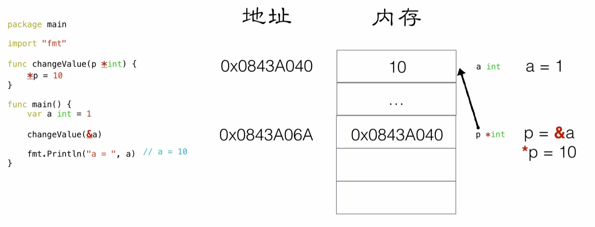

# 环境变量

 **必要配置**

```perl
GOROOT=D:\Code\IDE\Environment\Golang\go1.22.4
GOPATH=D:\Code\IDE\Environment\Golang\gopath
```

**可选配置**

* 配置公司的私有仓库地址
* 公司的依赖不走代理下载
* 不使用 Go 模块的 sum 数据库进行包的验证
* 配置国内公共加速代理以及公司的代理

```perl
go env -w GOPRIVATE="git.dev.sh.sakura.com"
go env -w GONOPROXY="git.dev.sh.sakura.com"
go env -w GONOSUMDB="git.dev.sh.sakura.com"
go env -w GOPROXY="https://goproxy.cn,http://goproxy.release.sakura.com,direct"

#若使用git拉去依赖建议使用ssh替换http
git config --global url."ssh://git@git.dev.sh.sakura.com/".insteadOf "http://git.dev.sh.sakura.com/"
```


# Hello World

**控制台执行**

golang是先编译后执行，直接run执行源码文件时会比较慢，先build编译再执行可执行文件会比较快

```perl
cat > main.go <<!
package main

func main(){
    println(123)
}
!

#直接执行（比较慢）
go run main.go

#编译（会产生main.exe可执行文件）
go build main.go

#执行编译后的文件（比较快）
./main.exe
```


**IDE执行**

使用Goland

# 变量

## 单变量常用写法

```go
//函数体内定义
a: = "hello world"

//类中定义
var b = 233
```

## 多变量常用写法

```go
//函数体内定义
x,y := 1,"value"

//类中定义
var (
m int
n bool
)

var(
p=7
q=true
)
```

## 示例

```go
package main

import "fmt"

// 多变量声明
var x, y int

// 这种分解的写法,一般用于声明全局变量
var (
	m int
	n bool
)

var (
	p = 99
	q = true
)

var s, t int = 4, 5

var z, w = 6, "2333"

//这种不带声明格式的只能在函数体内声明
//j,k:="hello",5  需要在func函数体内实现"

func main() {
	//单变量声明
	var a int
	var b int = 1
	var c = 2
	d := 3                  //最常用（只可写在方法体内，不可写在类，且只可初始化声明一次，后续改变值直接用等号）
	fmt.Println(a, b, c, d) //0 1 2 3

	//多变量声明
	j, k := "hello", 7
	_, v := 8, 9                                       // _的值无法被读出，不可作为变量，当不需要某个值时可以用_接收
	fmt.Println(x, y, m, n, p, q, s, t, z, w, j, k, v) //0 0 0 false 99 true 4 5 6 2333 hello 7 9
}
```

# 常量

常量中的数据类型只可以是布尔型、数字型（整数型、浮点型和复数）和字符串型。

**常量定义**

你可以省略类型说明符 [type]，因为编译器可以根据变量的值来推断其类型。

```perl
const identifier [type] = value
```

常量可以用len(), cap(), unsafe.Sizeof()常量计算表达式的值。==常量表达式中，函数必须是内置函数，否则编译不过==

```go
const (
    a1       = 0
    nameSize = unsafe.Sizeof(name)
    nameLen  = len(name2)
)
```

> unsafe.Sizeof(name)输出的结果是16 。
>
> 字符串类型在 go 里是个结构, 包含指向底层数组的指针和长度,这两部分每部分都是 8 个字节，所以字符串类型大小为 16 个字节。

**示例**

```go
package main

import (
    "fmt"
    "unsafe"
)

// 常量定义
const name = "sakura"

const name2 string = "sakura2"

// 可作为枚举
const (
    female = 0
    male   = 1
    other  = 2
)

// 常量可以用len(), cap(), unsafe.Sizeof()常量计算表达式的值。常量表达式中，函数必须是内置函数，否则编译不过
const (
    a1       = 0
    nameSize = unsafe.Sizeof(name)
    nameLen  = len(name2)
)

func main() {
    fmt.Println(name, name2, female, male, other, a1, nameSize, nameLen)
    //字符串类型在 go 里是个结构, 包含指向底层数组的指针和长度,这两部分每部分都是 8 个字节，所以字符串类型大小为 16 个字节。
    //sakura sakura2 0 1 2 0 16 7
}
```

## 优雅的常量 iota

==iota 只能够配合const() 一起使用， iota只有在const进行累加效果，从0开始自增，每行+1，若想从1开始可以在最开始使用”_“接收==

```go
// const 来定义枚举类型
const (
	//可以在const() 添加一个关键字 iota， 每行的iota都会累加1, 第一行的iota的默认值是0
	BEIJING  = 10 * iota //iota = 0
	SHANGHAI             //iota = 1
	SHENZHEN             //iota = 2
)

const (
	a, b = iota + 1, iota + 2 // iota = 0, a = iota + 1, b = iota + 2, a = 1, b = 2
	c, d                      // iota = 1, c = iota + 1, d = iota + 2, c = 2, d = 3
	e, f                      // iota = 2, e = iota + 1, f = iota + 2, e = 3, f = 4

	g, h = iota * 2, iota * 3 // iota = 3, g = iota * 2, h = iota * 3, g = 6, h = 9
	i, j                      // iota = 4, i = iota * 2, j = iota * 3 , i = 8, j = 12
)
```

# 函数

## 函数声明

==注意:定义函数的时候，‘{’  必须和函数名在同一行，不能另起一行。==

==注意：对外提供的方法，必须要大写！！！否则会引用不了！！！==

函数可以返回多个值，形参类型相同时，可在最后声明类型

```go
// 多个返回值，返回值形参有名称
func foo3(a string, b string) (ra int, rb int) {
	fmt.Println("---- foo3 ----")
	fmt.Println("a = ", a)
	fmt.Println("b = ", b)

	//ra rb 属于foo3的形参,初始化默认的值为0
	//ra rb 作用域空间 是foo3 整个函数体的{}空间
	fmt.Println("ra = ", ra)
	fmt.Println("rb = ", rb)

	//给有名称的返回值变量赋值
	ra = 2333
	rb = 3332

	return
}

// 形参类型相同时，可在最后声明类型
func foo4(x, y string, a, b int) (r4x, r4y string, r4a, r4b int) {
	r4x, r4y, r4a, r4b = x, y, a, b
	return
}
```

**示例**

```go
package main

import "fmt"

func main() {
	println("foo1：", foo1(1, 3))

	foo2a, foo2b := foo2(1, false)
	println("foo2：", foo2a, foo2b)

	foo3ra, foo3rb := foo3("666", "777")
	println("foo3：", foo3ra, foo3rb)

	foo4rx, foo4ry, foo4ra, foo4rb := foo4("hello", "function", 1, 2)
	println("foo4：", foo4rx, foo4ry, foo4ra, foo4rb)
}

func foo1(a int, b int) int {
	return a + b
}

// 多个返回值，返回值形参匿名
func foo2(a int, b bool) (int, bool) {
	return a, !b
}

// 多个返回值，返回值形参有名称，最常用，一步到位定义返回值
func foo3(a string, b string) (ra int, rb int) {
	fmt.Println("---- foo3 ----")
	fmt.Println("a = ", a)
	fmt.Println("b = ", b)

	//ra rb 属于foo3的形参,初始化默认的值为0
	//ra rb 作用域空间 是foo3 整个函数体的{}空间
	fmt.Println("ra = ", ra)
	fmt.Println("rb = ", rb)

	//给有名称的返回值变量赋值
	ra = 2333
	rb = 3332

	return
}

// 形参类型相同时，可在最后声明类型
func foo4(x, y string, a, b int) (r4x, r4y string, r4a, r4b int) {
	r4x, r4y, r4a, r4b = x, y, a, b
	return
}
```

## init函数

==init函数只会执行一次==

**golang 导入包不使用时编译不通过，若想使用导入包的init方法，可使用下划线**

```go
import (
    "fmt"
    _ "GolangTraining/InitLib2"
)
```

等所有被导入的包都加载完毕了，就会开始对main包中的包级常量和变量进行初始化，然后执行main包中的init函数（如果存在的话），最后执行main函数。下图详细地解释了整个执行过程：


## 值传递

```go
package main

import "fmt"

func main() {
	a, b := 1, 2
	swap2(a, b)
	fmt.Println(a, b)//1,2
}

func swap2(a, b int) {
	temp := a
	a = b
	b = temp
}
```


## 引用传递（指针）

==取址符为&，取值符号为*，指针类型为 \*Type（如\*int  \*string）==

```go
package main

import "fmt"

func main() {
    a, b := 1, 2
    /* 调用 swap() 函数
     * &a 指向 a 指针，a 变量的地址
     * &b 指向 b 指针，b 变量的地址
     */
    swap(&a, &b)
    fmt.Println(a, b) //1,2

}

func swap(x, y *int) {
    temp := *x /* 保存 x 地址上的值 */
    *x = *y    /* 将 y 值赋给 x */
    *y = temp  /* 将 temp 值赋给 y */
}
```



**二级指针比较少见，但是支持**

```go
var a = 10
var p *int = &a
var pp **int //二级指针
pp = &p
```

# defer（常用）

