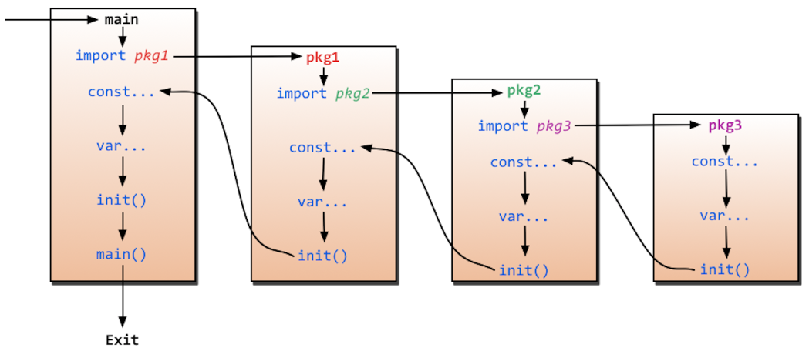
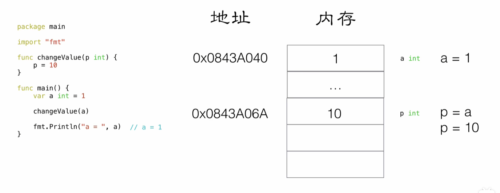

# 环境变量

 **必要配置**

```perl
GOROOT=D:\Code\IDE\Environment\Golang\go1.22.4
GOPATH=D:\Code\IDE\Environment\Golang\gopath
```

**可选配置**

* 配置公司的私有仓库地址
* 公司的依赖不走代理下载
* 不使用 Go 模块的 sum 数据库进行包的验证
* 配置国内公共加速代理以及公司的代理

```perl
go env -w GOPRIVATE="git.dev.sh.sakura.com"
go env -w GONOPROXY="git.dev.sh.sakura.com"
go env -w GONOSUMDB="git.dev.sh.sakura.com"
go env -w GOPROXY="https://goproxy.cn,http://goproxy.release.sakura.com,direct"

#若使用git拉去依赖建议使用ssh替换http
git config --global url."ssh://git@git.dev.sh.sakura.com/".insteadOf "http://git.dev.sh.sakura.com/"
```


# Hello World

**控制台执行**

golang是先编译后执行，直接run执行源码文件时会比较慢，先build编译再执行可执行文件会比较快

```perl
cat > main.go <<!
package main

func main(){
    println(123)
}
!

#直接执行（比较慢）
go run main.go

#编译（会产生main.exe可执行文件）
go build main.go

#执行编译后的文件（比较快）
./main.exe
```


**IDE执行**

使用Goland

# 变量

## 单变量常用写法

==:对变量声明时 至少有一个变量是新的==

```go
//函数体内定义
a: = "hello world"

//类中定义
var b = 233
```

## 多变量常用写法

```go
//函数体内定义
x,y := 1,"value"

//类中定义
var (
m int
n bool
)

var(
p=7
q=true
)
```

## 示例

```go
package main

import "fmt"

// 多变量声明
var x, y int

// 这种分解的写法,一般用于声明全局变量
var (
	m int
	n bool
)

var (
	p = 99
	q = true
)

var s, t int = 4, 5

var z, w = 6, "2333"

//这种不带声明格式的只能在函数体内声明
//j,k:="hello",5  需要在func函数体内实现"

func main() {
	//单变量声明
	var a int
	var b int = 1
	var c = 2
	d := 3                  //最常用（只可写在方法体内，不可写在类，且只可初始化声明一次，后续改变值直接用等号）
	fmt.Println(a, b, c, d) //0 1 2 3

	//多变量声明
	j, k := "hello", 7
	_, v := 8, 9                                       // _的值无法被读出，不可作为变量，当不需要某个值时可以用_接收
	fmt.Println(x, y, m, n, p, q, s, t, z, w, j, k, v) //0 0 0 false 99 true 4 5 6 2333 hello 7 9
}
```

## new函数

==返回指针类型==

另一个创建变量的方法是调用内建的new函数。表达式new(T)将创建一个T类型的匿名变量，初始化为T类型的零值，然后返回变量地址，返回的指针类型为`*T`。

```Go
p := new(int)   // p, *int 类型, 指向匿名的 int 变量
fmt.Println(*p) // "0"
*p = 2          // 设置 int 匿名变量的值为 2
fmt.Println(*p) // "2"
```

用new创建变量和普通变量声明语句方式创建变量没有什么区别，除了不需要声明一个临时变量的名字外，我们还可以在表达式中使用new(T)。换言之，new函数类似是一种语法糖，而不是一个新的基础概念。

下面的两个newInt函数有着相同的行为：

```Go
func newInt() *int {
    return new(int)
}

func newInt() *int {
    var dummy int
    return &dummy
}
```

每次调用new函数都是返回一个新的变量的地址，因此下面两个地址是不同的：

```Go
p := new(int)
q := new(int)
fmt.Println(p == q) // "false"
```

## 注意

这种写法x指向了全局变量，f调用后无法被垃圾回收清理，会占用更多的内存，g调用后y可以被立即回收

```go
var global *int

func f() {
    var x int
    x = 1
    global = &x
}

func g() {
    y := new(int)
    *y = 1
}
```

虽然cwd在外部已经声明过，但是`:=`语句还是将cwd和err重新声明为新的局部变量。因为内部声明的cwd将屏蔽外部的声明，因此上面的代码并不会正确更新包级声明的cwd变量。最直接的方法是通过单独声明err变量，来避免使用`:=`的简短声明方式

```go
var cwd string

func init() {
    cwd, err := os.Getwd() // NOTE: wrong!
    if err != nil {
        log.Fatalf("os.Getwd failed: %v", err)
    }
    log.Printf("Working directory = %s", cwd)
}

//修改后
func init() {
    var err error
    cwd, err = os.Getwd()
    if err != nil {
        log.Fatalf("os.Getwd failed: %v", err)
    }
}
```

# 常量

常量中的数据类型只可以是布尔型、数字型（整数型、浮点型和复数）和字符串型。

**常量定义**

你可以省略类型说明符 [type]，因为编译器可以根据变量的值来推断其类型。

```perl
const identifier [type] = value
```

常量可以用len(), cap(), unsafe.Sizeof()常量计算表达式的值。==常量表达式中，函数必须是内置函数，否则编译不过==

```go
const (
    a1       = 0
    nameSize = unsafe.Sizeof(name)
    nameLen  = len(name2)
)
```

> unsafe.Sizeof(name)输出的结果是16 。
>
> 字符串类型在 go 里是个结构, 包含指向底层数组的指针和长度,这两部分每部分都是 8 个字节，所以字符串类型大小为 16 个字节。

**示例**

```go
package main

import (
    "fmt"
    "unsafe"
)

// 常量定义
const name = "sakura"

const name2 string = "sakura2"

// 可作为枚举
const (
    female = 0
    male   = 1
    other  = 2
)

// 常量可以用len(), cap(), unsafe.Sizeof()常量计算表达式的值。常量表达式中，函数必须是内置函数，否则编译不过
const (
    a1       = 0
    nameSize = unsafe.Sizeof(name)
    nameLen  = len(name2)
)

func main() {
    fmt.Println(name, name2, female, male, other, a1, nameSize, nameLen)
    //字符串类型在 go 里是个结构, 包含指向底层数组的指针和长度,这两部分每部分都是 8 个字节，所以字符串类型大小为 16 个字节。
    //sakura sakura2 0 1 2 0 16 7
}
```

## 优雅的常量 iota

==iota 只能够配合const() 一起使用， iota只有在const进行累加效果，从0开始自增，每行+1，若想从1开始可以在最开始使用”_“接收==

```go
// const 来定义枚举类型
const (
	//可以在const() 添加一个关键字 iota， 每行的iota都会累加1, 第一行的iota的默认值是0
	BEIJING  = 10 * iota //iota = 0
	SHANGHAI             //iota = 1
	SHENZHEN             //iota = 2
)

const (
	a, b = iota + 1, iota + 2 // iota = 0, a = iota + 1, b = iota + 2, a = 1, b = 2
	c, d                      // iota = 1, c = iota + 1, d = iota + 2, c = 2, d = 3
	e, f                      // iota = 2, e = iota + 1, f = iota + 2, e = 3, f = 4

	g, h = iota * 2, iota * 3 // iota = 3, g = iota * 2, h = iota * 3, g = 6, h = 9
	i, j                      // iota = 4, i = iota * 2, j = iota * 3 , i = 8, j = 12
)
```

# 函数

## 函数声明

==注意:定义函数的时候，‘{’  必须和函数名在同一行，不能另起一行。==

==注意：对外提供的方法，必须要大写！！！否则会引用不了！！！==

函数可以返回多个值，形参类型相同时，可在最后声明类型

```go
// 多个返回值，返回值形参有名称
func foo3(a string, b string) (ra int, rb int) {
	fmt.Println("---- foo3 ----")
	fmt.Println("a = ", a)
	fmt.Println("b = ", b)

	//ra rb 属于foo3的形参,初始化默认的值为0
	//ra rb 作用域空间 是foo3 整个函数体的{}空间
	fmt.Println("ra = ", ra)
	fmt.Println("rb = ", rb)

	//给有名称的返回值变量赋值
	ra = 2333
	rb = 3332

	return
}

// 形参类型相同时，可在最后声明类型
func foo4(x, y string, a, b int) (r4x, r4y string, r4a, r4b int) {
	r4x, r4y, r4a, r4b = x, y, a, b
	return
}
```

**示例**

```go
package main

import "fmt"

func main() {
	println("foo1：", foo1(1, 3))

	foo2a, foo2b := foo2(1, false)
	println("foo2：", foo2a, foo2b)

	foo3ra, foo3rb := foo3("666", "777")
	println("foo3：", foo3ra, foo3rb)

	foo4rx, foo4ry, foo4ra, foo4rb := foo4("hello", "function", 1, 2)
	println("foo4：", foo4rx, foo4ry, foo4ra, foo4rb)
}

func foo1(a int, b int) int {
	return a + b
}

// 多个返回值，返回值形参匿名
func foo2(a int, b bool) (int, bool) {
	return a, !b
}

// 多个返回值，返回值形参有名称，最常用，一步到位定义返回值
func foo3(a string, b string) (ra int, rb int) {
	fmt.Println("---- foo3 ----")
	fmt.Println("a = ", a)
	fmt.Println("b = ", b)

	//ra rb 属于foo3的形参,初始化默认的值为0
	//ra rb 作用域空间 是foo3 整个函数体的{}空间
	fmt.Println("ra = ", ra)
	fmt.Println("rb = ", rb)

	//给有名称的返回值变量赋值
	ra = 2333
	rb = 3332

	return
}

// 形参类型相同时，可在最后声明类型
func foo4(x, y string, a, b int) (r4x, r4y string, r4a, r4b int) {
	r4x, r4y, r4a, r4b = x, y, a, b
	return
}
```

## init函数

==init函数只会执行一次==

**golang 导入包不使用时编译不通过，若想使用导入包的init方法，可使用下划线**

```go
import (
    "fmt"
    _ "GolangTraining/InitLib2"
)
```

等所有被导入的包都加载完毕了，就会开始对main包中的包级常量和变量进行初始化，然后执行main包中的init函数（如果存在的话），最后执行main函数。下图详细地解释了整个执行过程：



## 值传递

```go
package main

import "fmt"

func main() {
	a, b := 1, 2
	swap2(a, b)
	fmt.Println(a, b)//1,2
}

func swap2(a, b int) {
	temp := a
	a = b
	b = temp
}
```



## 引用传递（指针）

==取址符为&，取值符号为*，指针类型为 \*Type（如\*int  \*string）==

```go
package main

import "fmt"

func main() {
    a, b := 1, 2
    /* 调用 swap() 函数
     * &a 指向 a 指针，a 变量的地址
     * &b 指向 b 指针，b 变量的地址
     */
    swap(&a, &b)
    fmt.Println(a, b) //1,2

}

func swap(x, y *int) {
    temp := *x /* 保存 x 地址上的值 */
    *x = *y    /* 将 y 值赋给 x */
    *y = temp  /* 将 temp 值赋给 y */
}
```


**二级指针比较少见，但是支持**

```go
var a = 10
var p *int = &a
var pp **int //二级指针
pp = &p
```

# defer（常用）

# slice

定义

```Go
Q2 := months[4:7]
summer := months[6:9]
fmt.Println(Q2)     // ["April" "May" "June"]
fmt.Println(summer) // ["June" "July" "August"]
```

内置的make函数创建一个指定元素类型、长度和容量的slice。容量部分可以省略，在这种情况下，容量将等于长度。

```Go
make([]T, len)
make([]T, len, cap) // same as make([]T, cap)[:len]
```

添加元素

```Go
var runes []rune
for _, r := range "Hello, 世界" {
    runes = append(runes, r)
}
fmt.Printf("%q\n", runes) // "['H' 'e' 'l' 'l' 'o' ',' ' ' '世' '界']"
```

append可添加多个元素，甚至可以直接添加一个slice

```Go
var x []int
x = append(x, 1)
x = append(x, 2, 3)
x = append(x, 4, 5, 6)
x = append(x, x...) // append the slice x
fmt.Println(x)      // "[1 2 3 4 5 6 1 2 3 4 5 6]"
```

# map

内置的make函数可以创建一个map：

```Go
ages := make(map[string]int) // mapping from strings to ints
```

我们也可以用map字面值的语法创建map，同时还可以指定一些最初的key/value：

```Go
ages := map[string]int{
    "alice":   31,
    "charlie": 34,
}
```

因此，另一种创建空的map的表达式是`map[string]int{}`。

Map中的元素通过key对应的下标语法访问：

```Go
ages["alice"] = 32
fmt.Println(ages["alice"]) // "32"
```

使用内置的delete函数可以删除元素：

```Go
delete(ages, "alice") // remove element ages["alice"]
```

所有这些操作是安全的，即使这些元素不在map中也没有关系；==如果一个查找失败将返回value类型对应的零值==，例如，即使map中不存在“bob”下面的代码也可以正常工作，因为ages["bob"]失败时将返回0。

```Go
ages["bob"] = ages["bob"] + 1 // happy birthday!
```

而且`x += y`和`x++`等简短赋值语法也可以用在map上，所以上面的代码可以改写成

```Go
ages["bob"]++
```

但是map中的元素并不是一个变量，因此我们不能对map的元素进行取址操作：

```Go
_ = &ages["bob"] // compile error: cannot take address of map element
```

禁止对map元素取址的原因是map可能随着元素数量的增长而重新分配更大的内存空间，从而可能导致之前的地址无效。

要想遍历map中全部的key/value对的话，可以使用range风格的for循环实现，和之前的slice遍历语法类似。下面的迭代语句将在每次迭代时设置name和age变量，它们对应下一个键/值对：

```Go
for name, age := range ages {
    fmt.Printf("%s\t%d\n", name, age)
}
```

==Map的迭代顺序是不确定的==，并且不同的哈希函数实现可能导致不同的遍历顺序。在实践中，遍历的顺序是随机的，每一次遍历的顺序都不相同。这是故意的，每次都使用随机的遍历顺序可以强制要求程序不会依赖具体的哈希函数实现。如果要按顺序遍历key/value对，我们必须显式地对key进行排序，可以使用sort包的Strings函数对字符串slice进行排序。下面是常见的处理方式：

```Go
import "sort"

var names []string
for name := range ages {
    names = append(names, name)
}
sort.Strings(names)
for _, name := range names {
    fmt.Printf("%s\t%d\n", name, ages[name])
}
```

在向map存数据前必须先创建map。类似于Java的new

map的下标语法将产生两个值；第二个是一个布尔值，用于报告元素是否真的存在。布尔变量一般命名为ok，特别适合马上用于if条件判断部分。

```Go
if age, ok := ages["bob"]; !ok { /* ... */ }

//等同于

age, ok := ages["bob"]
if !ok { /* "bob" is not a key in this map; age == 0. */ }
```

和slice一样，map之间也不能进行相等比较；唯一的例外是和nil进行比较。要判断两个map是否包含相同的key和value，我们必须通过一个循环实现：

```Go
func equal(x, y map[string]int) bool {
    if len(x) != len(y) {
        return false
    }
    for k, xv := range x {
        if yv, ok := y[k]; !ok || yv != xv {
            return false
        }
    }
    return true
}
```

从例子中可以看到如何用!ok来区分元素不存在，与元素存在但为0的。我们不能简单地用xv != y[k]判断，那样会导致在判断下面两个map时产生错误的结果：

因为 ==map里如果一个查找失败将返回value类型对应的零值==

```Go
// True if equal is written incorrectly.
equal(map[string]int{"A": 0}, map[string]int{"B": 42})
```

value也可以是map类型，其中addEdge函数惰性初始化map是一个惯用方式，也就是说在每个值首次作为key时才初始化。addEdge函数显示了如何让map的零值也能正常工作；即使from到to的边不存在，graph[from][to]依然可以返回一个有意义的结果。

```Go
var graph = make(map[string]map[string]bool)

func addEdge(from, to string) {
    edges := graph[from]
    if edges == nil {
        edges = make(map[string]bool)
        graph[from] = edges
    }
    edges[to] = true
}

func hasEdge(from, to string) bool {
    return graph[from][to]
}
```

Go语言中并没有提供一个set类型，但是map中的key也是不相同的，可以用map实现类似set的功能。通过value用bool类型来控制

```Go
func main() {
    seen := make(map[string]bool) // a set of strings
    input := bufio.NewScanner(os.Stdin)
    for input.Scan() {
        line := input.Text()
        if !seen[line] {
            seen[line] = true
            fmt.Println(line)
        }
    }

    if err := input.Err(); err != nil {
        fmt.Fprintf(os.Stderr, "dedup: %v\n", err)
        os.Exit(1)
    }
}
```

# 结构体

```Go
type Employee struct {
    ID        int
    Name      string
    Address   string
    DoB       time.Time
    Position  string
    Salary    int
    ManagerID int
}

var dilbert Employee
```

dilbert结构体变量的成员可以通过点操作符访问，比如dilbert.Name和dilbert.DoB。因为dilbert是一个变量，它所有的成员也同样是变量，我们可以直接对每个成员赋值：

```Go
dilbert.Salary -= 5000 // demoted, for writing too few lines of code
```

或者是对成员取地址，然后通过指针访问：

```Go
position := &dilbert.Position
*position = "Senior " + *position // promoted, for outsourcing to Elbonia
```

点操作符也可以和指向结构体的指针一起工作：

```Go
var employeeOfTheMonth *Employee = &dilbert
employeeOfTheMonth.Position += " (proactive team player)"
```

相当于下面语句

```Go
(*employeeOfTheMonth).Position += " (proactive team player)"
```

下面的EmployeeByID函数将根据给定的员工ID返回对应的员工信息结构体的指针。我们可以使用点操作符来访问它里面的成员：

```Go
func EmployeeByID(id int) *Employee { /* ... */ }

fmt.Println(EmployeeByID(dilbert.ManagerID).Position) // "Pointy-haired boss"

id := dilbert.ID
EmployeeByID(id).Salary = 0 // fired for... no real reason
```

后面的语句通过EmployeeByID返回的结构体指针更新了Employee结构体的成员。如果将EmployeeByID函数的返回值从`*Employee`指针类型改为Employee值类型，那么更新语句将不能编译通过，因为在赋值语句的左边并不确定是一个变量（译注：==调用函数返回的是值，并不是一个可取地址的变量==）。

**注意**：

* 如果结构体成员名字是以大写字母开头的，那么该成员就是导出的；这是Go语言导出规则决定的。一个结构体可能同时包含导出和未导出的成员。
* 一个命名为S的结构体类型将不能再包含S类型的成员：因为一个聚合的值不能包含它自身。（该限制同样适用于数组。）但是S类型的结构体可以包含`*S`指针类型的成员，这可以让我们创建递归的数据结构，比如链表和树结构等。

### 结构体字面值

结构体值也可以用结构体字面值表示，结构体字面值可以指定每个成员的值。

```Go
type Point struct{ X, Y int }

//有顺序要求，不常用
p := Point{1, 2}
```

其实更==常用==的是第二种写法，以成员名字和相应的值来初始化，可以包含部分或全部的成员，成员被忽略的话将默认用零值：

```Go
anim := gif.GIF{LoopCount: nframes}
```

两种不同形式的写法不能混合使用。而且，你不能企图在外部包中用第一种顺序赋值的技巧来偷偷地初始化结构体中未导出的成员。

```Go
package p
type T struct{ a, b int } // a and b are not exported

package q
import "p"
var _ = p.T{a: 1, b: 2} // compile error: can't reference a, b
var _ = p.T{1, 2}       // compile error: can't reference a, b
//虽然上面最后一行代码的编译错误信息中并没有显式提到未导出的成员，但是这样企图隐式使用未导出成员的行为也是不允许的。
```

结构体可以作为函数的参数和返回值。例如，这个Scale函数将Point类型的值缩放后返回：

```Go
func Scale(p Point, factor int) Point {
    return Point{p.X * factor, p.Y * factor}
}

fmt.Println(Scale(Point{1, 2}, 5)) // "{5 10}"
```

如果考虑效率的话，较大的结构体通常会用指针的方式传入和返回，

```Go
func Bonus(e *Employee, percent int) int {
    return e.Salary * percent / 100
}
```

如果要在函数内部修改结构体成员的话，用指针传入是必须的；因为在Go语言中，所有的函数参数都是值拷贝传入的，函数参数将不再是函数调用时的原始变量。

```Go
func AwardAnnualRaise(e *Employee) {
    e.Salary = e.Salary * 105 / 100
}
```

因为结构体通常通过指针处理，可以用下面的写法来创建并初始化一个结构体变量，并返回结构体的地址：

```Go
pp := &Point{1, 2}
```

它和下面的语句是等价的

```Go
pp := new(Point)
*pp = Point{1, 2}
```

不过&Point{1, 2}写法可以直接在表达式中使用，比如一个函数调用。

### 结构体比较

如果结构体的全部成员都是可以比较的，那么结构体也是可以比较的，那样的话两个结构体将可以使用\==或!=运算符进行比较。相等比较运算符==将比较两个结构体的每个成员，因此下面两个比较的表达式是等价的：

```Go
type Point struct{ X, Y int }

p := Point{1, 2}
q := Point{2, 1}
fmt.Println(p.X == q.X && p.Y == q.Y) // "false"
fmt.Println(p == q)                   // "false"
```

可比较的结构体类型和其他可比较的类型一样，可以用于map的key类型。

```Go
type address struct {
    hostname string
    port     int
}

hits := make(map[address]int)
hits[address{"golang.org", 443}]++
```

### 结构体嵌入和匿名成员

```Go
type Point struct {
    X, Y int
}

type Circle struct {
    Center //匿名
    Radius int
}

type Wheel struct {
    Circle //匿名
    Spokes int
}
```

我们可以直接访问叶子属性而不需要给出完整的路径，此时变量名和类型名相同

```Go
var w Wheel
w.X = 8            // equivalent to w.Circle.Point.X = 8
w.Y = 8            // equivalent to w.Circle.Point.Y = 8
w.Radius = 5       // equivalent to w.Circle.Radius = 5
w.Spokes = 20
```

但是结构体字面值必须遵循形状类型声明时的结构，所以我们只能用下面的两种语法，它们彼此是等价的：

```Go
w = Wheel{Circle{Point{8, 8}, 5}, 20}

w = Wheel{
    Circle: Circle{
        Point:  Point{X: 8, Y: 8},
        Radius: 5,
    },
    Spokes: 20, // NOTE: trailing comma necessary here (and at Radius)
}

fmt.Printf("%#v\n", w)
// Output:
// Wheel{Circle:Circle{Point:Point{X:8, Y:8}, Radius:5}, Spokes:20}

w.X = 42

fmt.Printf("%#v\n", w)
// Output:
// Wheel{Circle:Circle{Point:Point{X:42, Y:8}, Radius:5}, Spokes:20}
```

为什么要嵌入一个没有任何子成员类型的匿名成员类型呢？

==外层的结构体不仅仅是获得了匿名成员类型的所有成员，而且也获得了该类型导出的全部的方法==。这个机制可以用于将一些有简单行为的对象组合成有复杂行为的对象。

# JSON

### 将结构体转为json格式的slice

`json.MarshalIndent`

```Go
type Movie struct {
    Title  string
    Year   int  `json:"released"`
    Color  bool `json:"color,omitempty"`
    Actors []string
}

var movies = []Movie{
    {Title: "Casablanca", Year: 1942, Color: false,
        Actors: []string{"Humphrey Bogart", "Ingrid Bergman"}},
    {Title: "Cool Hand Luke", Year: 1967, Color: true,
        Actors: []string{"Paul Newman"}},
    {Title: "Bullitt", Year: 1968, Color: true,
        Actors: []string{"Steve McQueen", "Jacqueline Bisset"}},
    // ...
}

data, err := json.MarshalIndent(movies, "", "    ")
if err != nil {
    log.Fatalf("JSON marshaling failed: %s", err)
}
fmt.Printf("%s\n", data)
```

### 将json字符串转换为结构体

```Go
var titles []struct{ Title string }
if err := json.Unmarshal(data, &titles); err != nil {
    log.Fatalf("JSON unmarshaling failed: %s", err)
}
fmt.Println(titles) // "[{Casablanca} {Cool Hand Luke} {Bullitt}]"
```

### 案例

`json.Decoder`，它可以从一个输入流解码JSON数据

还有一个针对输出流的`json.Encoder`编码对象

```Go
package github

import (
    "encoding/json"
    "fmt"
    "net/http"
    "net/url"
    "strings"
)

// SearchIssues queries the GitHub issue tracker.
func SearchIssues(terms []string) (*IssuesSearchResult, error) {
    q := url.QueryEscape(strings.Join(terms, " "))
    resp, err := http.Get(IssuesURL + "?q=" + q)
    if err != nil {
        return nil, err
    }

    // We must close resp.Body on all execution paths.
    // (Chapter 5 presents 'defer', which makes this simpler.)
    if resp.StatusCode != http.StatusOK {
        resp.Body.Close()
        return nil, fmt.Errorf("search query failed: %s", resp.Status)
    }

    var result IssuesSearchResult
    if err := json.NewDecoder(resp.Body).Decode(&result); err != nil {
        resp.Body.Close()
        return nil, err
    }
    resp.Body.Close()
    return &result, nil
}
```

# 方法

## 方法声明

假设有两个方法，一个方法的接收者是指针类型，一个方法的接收者是值类型，那么：

- 对于值类型的变量和指针类型的变量，这两个方法有什么区别？
- 如果这两个方法是为了实现一个接口，那么这两个方法都可以调用吗？
- 如果方法是嵌入到其他结构体中的，那么上面两种情况又是怎样的？

```go
package main


import "fmt"


//定义一个结构体
type T struct {
    name string
}


func (t T) method1() {
    t.name = "new name1"
}


func (t *T) method2() {
    t.name = "new name2"
}


func main() {


    t := T{"old name"}


    fmt.Println("method1 调用前 ", t.name)
    t.method1()
    fmt.Println("method1 调用后 ", t.name)


    fmt.Println("method2 调用前 ", t.name)
    t.method2()
    fmt.Println("method2 调用后 ", t.name)
}
```

当调用`t.method1()`时相当于`method1(t)`，实参和行参都是类型 T，可以接受。此时在`method1`()中的t只是参数t的值拷贝，所以`method1`()的修改影响不到main中的t变量。

当调用`t.method2()`=>`method2(t)`，这是将 T 类型传给了 *T 类型，go可能会取 t 的地址传进去：`method2(&t)`。所以 `method1`() 的修改可以影响 t。

T 类型的变量这两个方法都是拥有的。