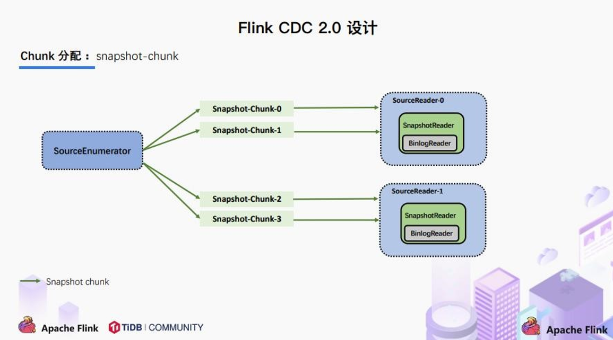

# 1、CDC简介

## 1.1 什么是 CDC

CDC 是 ==Change Data Capture（变更数据获取）==的简称。核心思想是，监测并捕获数据库的变动（包括数据或数据表的插入、更新以及删除等），将这些变更按发生的顺序完整记录下来，写入到消息中间件中以供其他服务进行订阅及消费。

## 1.2 CDC 的种类

CDC 主要分为==基于查询==和==基于 Binlog== 两种方式，我们主要了解一下这两种之间的区别：

|                          | 基于查询的 CDC            | 基于 Binlog 的 CDC           |
| ------------------------ | ------------------------- | ---------------------------- |
| 开源产品                 | Sqoop、Kafka  JDBC Source | Canal、Maxwell、==Debezium== |
| 执行模式                 | Batch                     | Streaming                    |
| 是否可以捕获所有数据变化 | 否                        | 是                           |
| 延迟性                   | 高延迟                    | 低延迟                       |
| 是否增加数据库压力       | 是                        | 否                           |

## 1.3 Flink-CDC

Flink 社区开发了 flink-cdc-connectors 组件，这是一个可以直接从 MySQL、PostgreSQL 等数据库直接读取全量数据和增量变更数据的 source 组件。 

目前也已开源，开源地址：https://github.com/ververica/flink-cdc-connectors

# 2、Flink CDC案例实操

## 2.1 DataStream 方式的应用 

### 2.1.1 导入依赖

==版本兼容==

*FlinkCDC-2.3.0和Flink-1.13的guava包版本冲突，FlinkCDC-2.3.0为guava30，Flink-1.13为guava18*

| Fink CDC版本 | Flink版本        |
| ------------ | ---------------- |
| ***2.2***    | ***1.13，1.14*** |
| ***2.3***    | ***1.15，1.16*** |

==注意：MySQL驱动版本8.0.27会报错，修改为8.0.21==

*pom.xml*

```xml
    <properties>
        <project.build.sourceEncoding>UTF-8</project.build.sourceEncoding>
        <flink.version>1.13.0</flink.version>
        <java.version>1.8</java.version>
        <scala.binary.version>2.12</scala.binary.version>
    </properties>

    <dependencies>
        <!-- 引入 Flink 相关依赖-->
        <dependency>
            <groupId>org.apache.flink</groupId>
            <artifactId>flink-java</artifactId>
            <version>${flink.version}</version>
        </dependency>

        <dependency>
            <groupId>org.apache.flink</groupId>
            <artifactId>flink-streaming-java_${scala.binary.version}</artifactId>
            <version>${flink.version}</version>
        </dependency>

        <dependency>
            <groupId>org.apache.flink</groupId>
            <artifactId>flink-clients_${scala.binary.version}</artifactId>
            <version>${flink.version}</version>
        </dependency>

        <dependency>
            <groupId>org.apache.flink</groupId>
            <artifactId>flink-table-planner-blink_${scala.binary.version}</artifactId>
            <version>${flink.version}</version>
        </dependency>

        <dependency>
            <groupId>org.apache.hadoop</groupId>
            <artifactId>hadoop-client</artifactId>
            <version>3.1.3</version>
        </dependency>

        <dependency>
            <groupId>mysql</groupId>
            <artifactId>mysql-connector-java</artifactId>
            <version>8.0.21</version>
        </dependency>

        <dependency>
            <groupId>com.ververica</groupId>
            <artifactId>flink-connector-mysql-cdc</artifactId>
            <version>2.2.0</version>
        </dependency>

        <dependency>
            <groupId>com.alibaba</groupId>
            <artifactId>fastjson</artifactId>
            <version>1.2.83</version>
        </dependency>
    </dependencies>

    <build>
        <plugins>
            <plugin>
                <groupId>org.apache.maven.plugins</groupId>
                <artifactId>maven-assembly-plugin</artifactId>
                <version>3.0.0</version>
                <configuration>
                    <descriptorRefs>
                        <descriptorRef>jar-with-dependencies</descriptorRef>
                    </descriptorRefs>
                </configuration>
                <executions>
                    <execution>
                        <id>make-assembly</id>
                        <phase>package</phase>
                        <goals>
                            <goal>single</goal>
                        </goals>
                    </execution>
                </executions>
            </plugin>
        </plugins>
    </build>
```

### 2.1.2 编写代码

```java
import com.ververica.cdc.connectors.mysql.MySqlSource;
import com.ververica.cdc.connectors.mysql.table.StartupOptions;
import com.ververica.cdc.debezium.DebeziumSourceFunction;
import com.ververica.cdc.debezium.StringDebeziumDeserializationSchema;
import org.apache.flink.api.common.restartstrategy.RestartStrategies;
import org.apache.flink.runtime.state.filesystem.FsStateBackend;
import org.apache.flink.streaming.api.CheckpointingMode;
import org.apache.flink.streaming.api.datastream.DataStreamSource;
import org.apache.flink.streaming.api.environment.CheckpointConfig;
import org.apache.flink.streaming.api.environment.StreamExecutionEnvironment;


public class FlinkCDC {

    public static void main(String[] args) throws Exception {

        //1.创建执行环境 
        StreamExecutionEnvironment env =
                StreamExecutionEnvironment.getExecutionEnvironment();
        env.setParallelism(1);

        //2.Flink-CDC 将读取 binlog 的位置信息以状态的方式保存在 CK,如果想要做到断点续传,需要从 Checkpoint 或者 Savepoint 启动程序         //2.1 开启 Checkpoint,每隔 5 秒钟做一次 CK 
        env.enableCheckpointing(5000L);
        //2.2 指定 CK 的一致性语义 
        env.getCheckpointConfig().setCheckpointingMode(CheckpointingMode.EXACTLY_ONCE);
        //2.3 设置任务关闭的时候保留最后一次 CK 数据 
        env.getCheckpointConfig().enableExternalizedCheckpoints(CheckpointConfig.ExternalizedCheckpointCleanup.RETAIN_ON_CANCELLATION);
        //2.4 指定从 CK 自动重启策略 
        env.setRestartStrategy(RestartStrategies.fixedDelayRestart(3, 2000L));
        //2.5 设置状态后端 
        env.setStateBackend(new FsStateBackend("hdfs://hadoop102:8020/flinkCDC"));
        //2.6 设置访问 HDFS 的用户名 
        System.setProperty("HADOOP_USER_NAME", "atguigu");

        //3.创建 Flink-MySQL-CDC 的 Source 
        //initial (default): Performs an initial snapshot on the monitored database tables upon first startup, and continue to read the latest binlog. 
        //latest-offset: Never to perform snapshot on the monitored database tables upon first startup, just read from the end of the binlog which means only have the changes since the connector was started. 
        //timestamp: Never to perform snapshot on the monitored database tables upon first startup, and directly read binlog from the specified timestamp. The consumer will traverse the binlog from the beginning and ignore change events whose timestamp is smaller than the specified timestamp. 
        //specific-offset: Never to perform snapshot on the monitored database tables upon first startup, and directly read binlog from the specified offset. 
        DebeziumSourceFunction<String> mysqlSource = MySqlSource.<String>builder()
                .hostname("hadoop102")
                .port(3306)
                .username("root")
                .password("000000")
                .databaseList("gmall-flink")
                .tableList("gmall-flink.z_user_info") //可选配置项,如果不指定该参数,则会读取上一个配置下的所有表的数据，注意：指定的时候需要使用"db.table"的方式 
                .startupOptions(StartupOptions.initial())
                .deserializer(new StringDebeziumDeserializationSchema())
                .build();

        //4.使用 CDC Source 从 MySQL 读取数据 
        DataStreamSource<String> mysqlDS = env.addSource(mysqlSource);

        //5.打印数据 
        mysqlDS.print();

        //6.执行任务
        env.execute();

    }
} 
```

### 2.1.3 案例测试 

* 打包并上传至 Linux

* 开启 MySQL Binlog 并重启 MySQL

* 启动 Flink 集群 

```perl
bin/start-cluster.sh 
```

* 启动 HDFS 集群 

```perl
start-dfs.sh 
```

* 启动程序 

```perl
bin/flink run -c com.atguigu.FlinkCDC flink-1.0SNAPSHOT-jar-with-dependencies.jar 
```

* 在 MySQL 的 gmall-flink.z_user_info 表中添加、修改或者删除数据 

* 给当前的 Flink 程序创建 Savepoint 

```perl
bin/flink savepoint JobId hdfs://hadoop102:8020/flink/save 
```

* 关闭程序以后从 Savepoint 重启程序 

```perl
bin/flink run -s hdfs://hadoop102:8020/flink/save/... -c com.atguigu.FlinkCDC flink-1.0-SNAPSHOT-jar-with-dependencies.jar 
```

## 2.2 FlinkSQL 方式的应用

### 2.2.1 代码实现

```java
import org.apache.flink.streaming.api.environment.StreamExecutionEnvironment;
import org.apache.flink.table.api.bridge.java.StreamTableEnvironment;

public class FlinkSQL_CDC {

    public static void main(String[] args) throws Exception {

        //1.创建执行环境 
        StreamExecutionEnvironment env =
                StreamExecutionEnvironment.getExecutionEnvironment();
        env.setParallelism(1);
        StreamTableEnvironment tableEnv = StreamTableEnvironment.create(env);

        //2.创建 Flink-MySQL-CDC 的 Source 
        tableEnv.executeSql("CREATE TABLE user_info (" +
                "  id INT," +
                "  name STRING," +
                "  phone_num STRING" +
                ") WITH (" +
                "  'connector' = 'mysql-cdc'," +
                "  'hostname' = 'hadoop102'," +
                "  'port' = '3306'," +
                "  'username' = 'root'," +
                "  'password' = '000000'," +
                "  'database-name' = 'gmall-flink'," +
                "  'table-name' = 'z_user_info'" +
                ")");

        tableEnv.executeSql("select * from user_info").print();

        env.execute();
    }

} 
```

## 2.3 自定义反序列化器

### 2.3.1 代码实现

```java
import com.alibaba.fastjson.JSONObject;
import com.ververica.cdc.connectors.mysql.MySqlSource;
import com.ververica.cdc.connectors.mysql.table.StartupOptions;
import com.ververica.cdc.debezium.DebeziumDeserializationSchema;
import com.ververica.cdc.debezium.DebeziumSourceFunction;
import io.debezium.data.Envelope;
import org.apache.flink.api.common.typeinfo.TypeInformation;
import org.apache.flink.streaming.api.datastream.DataStreamSource;
import org.apache.flink.streaming.api.environment.StreamExecutionEnvironment;
import org.apache.flink.util.Collector;
import org.apache.kafka.connect.data.Field;
import org.apache.kafka.connect.data.Struct;
import org.apache.kafka.connect.source.SourceRecord;

public class Flink_CDCWithCustomerSchema {

    public static void main(String[] args) throws Exception {

        //1.创建执行环境 
        StreamExecutionEnvironment env =
                StreamExecutionEnvironment.getExecutionEnvironment();
        env.setParallelism(1);

        //2.创建 Flink-MySQL-CDC 的 Source 
        DebeziumSourceFunction<String> mysqlSource = MySqlSource.<String>builder()
                .hostname("hadoop102")
                .port(3306)
                .username("root")
                .password("000000")
                .databaseList("gmall-flink")
                .tableList("gmall-flink.z_user_info")         //可选配置项,如果不指定该参数,则会读取上一个配置下的所有表的数据,注意：指定的时候需要使用"db.table"的方式 
                .startupOptions(StartupOptions.initial())
                .deserializer(new DebeziumDeserializationSchema<String>() {  //自定义数据解析器
                    @Override
                    public void deserialize(SourceRecord sourceRecord, Collector<String>

                            collector) throws Exception {

                        //获取主题信息,包含着数据库和表名  
                        //mysql_binlog_source.gmall - flink.z_user_info
                        String topic = sourceRecord.topic();
                        String[] arr = topic.split("\\.");
                        String db = arr[1];
                        String tableName = arr[2];

                        //获取操作类型 READ DELETE UPDATE CREATE 
                        Envelope.Operation operation =
                                Envelope.operationFor(sourceRecord);

                        //获取值信息并转换为 Struct 类型 
                        Struct value = (Struct) sourceRecord.value();

                        //获取变化后的数据 
                        Struct after = value.getStruct("after");

                        //创建 JSON 对象用于存储数据信息 
                        JSONObject data = new JSONObject();
                        for (Field field : after.schema().fields()) {
                            Object o = after.get(field);
                            data.put(field.name(), o);
                        }

                        //创建 JSON 对象用于封装最终返回值数据信息 
                        JSONObject result = new JSONObject();
                        result.put("operation", operation.toString().toLowerCase());
                        result.put("data", data);
                        result.put("database", db);
                        result.put("table", tableName);

                        //发送数据至下游 
                        collector.collect(result.toJSONString());
                    }

                    @Override
                    public TypeInformation<String> getProducedType() {
                        return TypeInformation.of(String.class);
                    }
                })
                .build();

        //3.使用 CDC Source 从 MySQL 读取数据 
        DataStreamSource<String> mysqlDS = env.addSource(mysqlSource);

        //4.打印数据 
        mysqlDS.print();

        //5.执行任务
        env.execute();
    }
} 
```

# 3 Flink-CDC 2.0

## 3.1 Flink-CDC1.x 痛点 


## 3.2 设计目标


## 3.3 设计实现

### 3.3.1 整体概览

在对于有==主键的表==做初始化模式，整体的流程主要分为 5 个阶段： 

* Chunk 切分；

* Chunk 分配；（==实现并行读取数据&CheckPoint==） 

* Chunk 读取；（==实现无锁读取==） 

* Chunk 汇报； 

* Chunk 分配。 


### 3.3.2 Chunk 切分


根据 Netflix DBlog 的论文中的无锁算法原理，对于目标表按照主键进行数据分片，设置每个切片的区间为左闭右开或者左开右闭来保证数据的连续性。 

### 3.3.3 Chunk 分配



将划分好的 Chunk 分发给多个 SourceReader，每个 SourceReader 读取表中的一部分数据，==实现了并行读取==。 

同时在每个 Chunk 读取的时候可以单独==做 CheckPoint==，某个 Chunk 读取失败只需要单独执行该 Chunk 的任务，而不需要像 1.x 中失败了只能从头读取。 

若每个 SourceReader 保证了数据一致性，则全表就保证了数据一致性。

### 3.3.4 Chunk 读取


读取可以分为 5 个阶段 

* SourceReader 读取表数据之前先记录当前的 Binlog 位置信息记为低位点； 

* SourceReader 将自身区间内的数据查询出来并放置在 buffer 中； 

* 查询完成之后记录当前的 Binlog 位置信息记为高位点； 

* 在增量部分消费从低位点到高位点的 Binlog； 

* 根据主键，对 buffer 中的数据进行修正并输出。 

通过以上5个阶段可以保证每个Chunk最终的输出就是在高位点时该Chunk中最新的数据，但是目前只是做到了保证单个 Chunk 中的数据一致性。

### 3.3.5 Chunk 汇报


在 Snapshot Chunk 读取完成之后，有一个汇报的流程，如上图所示，即 SourceReader 需要将 Snapshot Chunk 完成信息汇报给 SourceEnumerator。

### 3.3.6 Chunk 分配


FlinkCDC 是支持全量+增量数据同步的，在 SourceEnumerator 接收到所有的 Snapshot Chunk 完成信息之后，还有一个==消费增量数据（Binlog）==的任务，此时是通过下发 Binlog Chunk 给任意一个 SourceReader 进行单并发读取来实现的。

## 3.4 核心原理分析

### 3.4.1 Binlog Chunk 中开始读取位置源码

*MySqlHybridSplitAssigner*

```java
    private MySqlBinlogSplit createBinlogSplit() {
        final List<MySqlSnapshotSplit> assignedSnapshotSplit =
                snapshotSplitAssigner.getAssignedSplits().values().stream()
                        .sorted(Comparator.comparing(MySqlSplit::splitId))
                        .collect(Collectors.toList());

        Map<String, BinlogOffset> splitFinishedOffsets =
                snapshotSplitAssigner.getSplitFinishedOffsets();
        final List<FinishedSnapshotSplitInfo> finishedSnapshotSplitInfos = new ArrayList<>();
        final Map<TableId, TableChanges.TableChange> tableSchemas = new HashMap<>();

        BinlogOffset minBinlogOffset = BinlogOffset.INITIAL_OFFSET;
        for (MySqlSnapshotSplit split : assignedSnapshotSplit) {
            // find the min binlog offset
            BinlogOffset binlogOffset = splitFinishedOffsets.get(split.splitId());
            if (binlogOffset.compareTo(minBinlogOffset) < 0) {
                minBinlogOffset = binlogOffset;
            }
            finishedSnapshotSplitInfos.add(
                    new FinishedSnapshotSplitInfo(
                            split.getTableId(),
                            split.splitId(),
                            split.getSplitStart(),
                            split.getSplitEnd(),
                            binlogOffset));
            tableSchemas.putAll(split.getTableSchemas());
        }

        final MySqlSnapshotSplit lastSnapshotSplit =
                assignedSnapshotSplit.get(assignedSnapshotSplit.size() - 1).asSnapshotSplit();
        return new MySqlBinlogSplit(
                BINLOG_SPLIT_ID,
                lastSnapshotSplit.getSplitKeyType(),
                minBinlogOffset,
                BinlogOffset.NO_STOPPING_OFFSET,
                finishedSnapshotSplitInfos,
                tableSchemas);
    }
```

### 3.4.2 读取低位点到高位点之间的Binlog

*BinlogSplitReader*

```java
    /**
     * Returns the record should emit or not.
     *
     * <p>The watermark signal algorithm is the binlog split reader only sends the binlog event that
     * belongs to its finished snapshot splits. For each snapshot split, the binlog event is valid
     * since the offset is after its high watermark.
     *
     * <pre> E.g: the data input is :
     *    snapshot-split-0 info : [0,    1024) highWatermark0
     *    snapshot-split-1 info : [1024, 2048) highWatermark1
     *  the data output is:
     *  only the binlog event belong to [0,    1024) and offset is after highWatermark0 should send,
     *  only the binlog event belong to [1024, 2048) and offset is after highWatermark1 should send.
     * </pre>
     */
    private boolean shouldEmit(SourceRecord sourceRecord) {
        if (isDataChangeRecord(sourceRecord)) {
            TableId tableId = getTableId(sourceRecord);
            BinlogOffset position = getBinlogPosition(sourceRecord);
            // aligned, all snapshot splits of the table has reached max highWatermark
            if (position.isAtOrBefore(maxSplitHighWatermarkMap.get(tableId))) {
                return true;
            }
            Object[] key =
                    getSplitKey(
                            currentBinlogSplit.getSplitKeyType(),
                            sourceRecord,
                            statefulTaskContext.getSchemaNameAdjuster());
            for (FinishedSnapshotSplitInfo splitInfo : finishedSplitsInfo.get(tableId)) {
                if (RecordUtils.splitKeyRangeContains(
                                key, splitInfo.getSplitStart(), splitInfo.getSplitEnd())
                        && position.isAtOrBefore(splitInfo.getHighWatermark())) {
                    return true;
                }
            }
            // not in the monitored splits scope, do not emit
            return false;
        }
        // always send the schema change event and signal event
        // we need record them to state of Flink
        return true;
    }
```

# 4、Flink CDC Oracle

## Enable log archiving

### Connect to the database as DBA

```perl
ORACLE_SID=SID
export ORACLE_SID
sqlplus /nolog
  CONNECT sys/password AS SYSDBA
```

### Enable log archiving

```sql
alter system set db_recovery_file_dest_size = 10G;
alter system set db_recovery_file_dest = '/opt/oracle/oradata/recovery_area' scope=spfile;
shutdown immediate;
startup mount;
alter database archivelog;
alter database open;
```

**Note:**

- Enable log archiving requires database restart, pay attention when try to do it
- The archived logs will occupy a large amount of disk space, so consider clean the expired logs the periodically

### Check whether log archiving is enabled

```sql
-- Should now "Database log mode: Archive Mode"
archive log list;
```

**Note:**

Supplemental logging must be enabled for captured tables or the database in order for data changes to capture the *before* state of changed database rows. The following illustrates how to configure this on the table/database level.

```sql
-- Enable supplemental logging for a specific table:
ALTER TABLE inventory.customers ADD SUPPLEMENTAL LOG DATA (ALL) COLUMNS;
```

```sql
-- Enable supplemental logging for database
ALTER DATABASE ADD SUPPLEMENTAL LOG DATA;
```

## Create an Oracle user with permissions

### Create Tablespace

```sql
sqlplus sys/password@host:port/SID AS SYSDBA;
  CREATE TABLESPACE logminer_tbs DATAFILE '/opt/oracle/oradata/SID/logminer_tbs.dbf' SIZE 25M REUSE AUTOEXTEND ON MAXSIZE UNLIMITED;
  exit;
```

### Create a user and grant permissions

```sql
sqlplus sys/password@host:port/SID AS SYSDBA;
  CREATE USER flinkuser IDENTIFIED BY flinkpw DEFAULT TABLESPACE LOGMINER_TBS QUOTA UNLIMITED ON LOGMINER_TBS;
  GRANT CREATE SESSION TO flinkuser;
  GRANT SET CONTAINER TO flinkuser;
  GRANT SELECT ON V_$DATABASE to flinkuser;
  GRANT FLASHBACK ANY TABLE TO flinkuser;
  GRANT SELECT ANY TABLE TO flinkuser;
  GRANT SELECT_CATALOG_ROLE TO flinkuser;
  GRANT EXECUTE_CATALOG_ROLE TO flinkuser;
  GRANT SELECT ANY TRANSACTION TO flinkuser;
  GRANT LOGMINING TO flinkuser;

  GRANT CREATE TABLE TO flinkuser;
  -- need not to execute if set scan.incremental.snapshot.enabled=true(default)
  GRANT LOCK ANY TABLE TO flinkuser;
  GRANT ALTER ANY TABLE TO flinkuser;
  GRANT CREATE SEQUENCE TO flinkuser;

  GRANT EXECUTE ON DBMS_LOGMNR TO flinkuser;
  GRANT EXECUTE ON DBMS_LOGMNR_D TO flinkuser;

  GRANT SELECT ON V_$LOG TO flinkuser;
  GRANT SELECT ON V_$LOG_HISTORY TO flinkuser;
  GRANT SELECT ON V_$LOGMNR_LOGS TO flinkuser;
  GRANT SELECT ON V_$LOGMNR_CONTENTS TO flinkuser;
  GRANT SELECT ON V_$LOGMNR_PARAMETERS TO flinkuser;
  GRANT SELECT ON V_$LOGFILE TO flinkuser;
  GRANT SELECT ON V_$ARCHIVED_LOG TO flinkuser;
  GRANT SELECT ON V_$ARCHIVE_DEST_STATUS TO flinkuser;
  exit;
```

See more about the [Setting up Oracle](https://debezium.io/documentation/reference/1.6/connectors/oracle.html#setting-up-oracle)

## How to create an Oracle CDC table

The Oracle CDC table can be defined as following:

```sql
-- register an Oracle table 'products' in Flink SQL
Flink SQL> CREATE TABLE products (
     ID INT NOT NULL,
     NAME STRING,
     DESCRIPTION STRING,
     WEIGHT DECIMAL(10, 3),
     PRIMARY KEY(id) NOT ENFORCED
     ) WITH (
     'connector' = 'oracle-cdc',
     'hostname' = 'localhost',
     'port' = '1521',
     'username' = 'flinkuser',
     'password' = 'flinkpw',
     'database-name' = 'XE',
     'schema-name' = 'inventory',
     'table-name' = 'products');
  
-- read snapshot and binlogs from products table
Flink SQL> SELECT * FROM products;
```

**Note:** When working with the CDB + PDB model, you are expected to add an extra option `'debezium.database.pdb.name' = 'xxx'` in Flink DDL to specific the name of the PDB to connect to.

**Note:** While the connector might work with a variety of Oracle versions and editions, only Oracle 9i, 10g, 11g and 12c have been tested.

## Connector Options

| Option                               | Required | Default                                             | Type    | Description                                                  |
| ------------------------------------ | -------- | --------------------------------------------------- | ------- | ------------------------------------------------------------ |
| connector                            | required | (none)                                              | String  | Specify what connector to use, here should be `'oracle-cdc'`. |
| hostname                             | optional | (none)                                              | String  | IP address or hostname of the Oracle database server. If the url is not empty, hostname may not be configured, otherwise hostname can not be empty |
| username                             | required | (none)                                              | String  | Name of the Oracle database to use when connecting to the Oracle database server. |
| password                             | required | (none)                                              | String  | Password to use when connecting to the Oracle database server. |
| database-name                        | required | (none)                                              | String  | Database name of the Oracle server to monitor.               |
| schema-name                          | required | (none)                                              | String  | Schema name of the Oracle database to monitor.               |
| table-name                           | required | (none)                                              | String  | Table name of the Oracle database to monitor.                |
| port                                 | optional | 1521                                                | Integer | Integer port number of the Oracle database server.           |
| url                                  | optional | jdbc:oracle:thin:@{hostname}:{port}:{database-name} | String  | JdbcUrl of the oracle database server . If the hostname and port parameter is configured, the URL is concatenated by hostname port database-name in SID format by default. Otherwise, you need to configure the URL parameter |
| scan.startup.mode                    | optional | initial                                             | String  | Optional startup mode for Oracle CDC consumer, valid enumerations are "initial" and "latest-offset". Please see [Startup Reading Position](https://github.com/ververica/flink-cdc-connectors/blob/master/docs/content/connectors/oracle-cdc.md#startup-reading-position) section for more detailed information. |
| scan.incremental.snapshot.enabled    | optional | true                                                | Boolean | Incremental snapshot is a new mechanism to read snapshot of a table. Compared to the old snapshot mechanism, the incremental snapshot has many advantages, including: (1) source can be parallel during snapshot reading, (2) source can perform checkpoints in the chunk granularity during snapshot reading, (3) source doesn't need to acquire ROW SHARE MODE lock before snapshot reading. |
| scan.incremental.snapshot.chunk.size | optional | 8096                                                | Integer | The chunk size (number of rows) of table snapshot, captured tables are split into multiple chunks when read the snapshot of table. |
| scan.snapshot.fetch.size             | optional | 1024                                                | Integer | The maximum fetch size for per poll when read table snapshot. |
| connect.max-retries                  | optional | 3                                                   | Integer | The max retry times that the connector should retry to build Oracle database server connection. |
| connection.pool.size                 | optional | 20                                                  | Integer | The connection pool size.                                    |
| debezium.*                           | optional | (none)                                              | String  | Pass-through Debezium's properties to Debezium Embedded Engine which is used to capture data changes from Oracle server. For example: `'debezium.snapshot.mode' = 'never'`. See more about the [Debezium's Oracle Connector properties](https://debezium.io/documentation/reference/1.6/connectors/oracle.html#oracle-connector-properties) |

## Limitation

### Can't perform checkpoint during scanning snapshot of tables

During scanning snapshot of database tables, since there is no recoverable position, we can't perform checkpoints. In order to not perform checkpoints, Oracle CDC source will keep the checkpoint waiting to timeout. The timeout checkpoint will be recognized as failed checkpoint, by default, this will trigger a failover for the Flink job. So if the database table is large, it is recommended to add following Flink configurations to avoid failover because of the timeout checkpoints:

```yaml
execution.checkpointing.interval: 10min
execution.checkpointing.tolerable-failed-checkpoints: 100
restart-strategy: fixed-delay
restart-strategy.fixed-delay.attempts: 2147483647
```

## Available Metadata

The following format metadata can be exposed as read-only (VIRTUAL) columns in a table definition.

| Key           | DataType                  | Description                                                  |
| ------------- | ------------------------- | ------------------------------------------------------------ |
| table_name    | STRING NOT NULL           | Name of the table that contain the row.                      |
| schema_name   | STRING NOT NULL           | Name of the schema that contain the row.                     |
| database_name | STRING NOT NULL           | Name of the database that contain the row.                   |
| op_ts         | TIMESTAMP_LTZ(3) NOT NULL | It indicates the time that the change was made in the database. If the record is read from snapshot of the table instead of the change stream, the value is always 0. |

The extended CREATE TABLE example demonstrates the syntax for exposing these metadata fields:

```sql
CREATE TABLE products (
    db_name STRING METADATA FROM 'database_name' VIRTUAL,
    schema_name STRING METADATA FROM 'schema_name' VIRTUAL, 
    table_name STRING METADATA  FROM 'table_name' VIRTUAL,
    operation_ts TIMESTAMP_LTZ(3) METADATA FROM 'op_ts' VIRTUAL,
    ID INT NOT NULL,
    NAME STRING,
    DESCRIPTION STRING,
    WEIGHT DECIMAL(10, 3),
    PRIMARY KEY(id) NOT ENFORCED
) WITH (
    'connector' = 'oracle-cdc',
    'hostname' = 'localhost',
    'port' = '1521',
    'username' = 'flinkuser',
    'password' = 'flinkpw',
    'database-name' = 'XE',
    'schema-name' = 'inventory',
    'table-name' = 'products',
    'debezium.log.mining.strategy' = 'online_catalog',
    'debezium.log.mining.continuous.mine' = 'true'
);
```

**Note** : The Oracle dialect is case-sensitive, it converts field name to uppercase if the field name is not quoted, Flink SQL doesn't convert the field name. Thus for physical columns from oracle database, we should use its converted field name in Oracle when define an `oracle-cdc` table in Flink SQL.

## Features

### Exactly-Once Processing

The Oracle CDC connector is a Flink Source connector which will read database snapshot first and then continues to read change events with **exactly-once processing** even failures happen. Please read [How the connector works](https://debezium.io/documentation/reference/1.6/connectors/oracle.html#how-the-oracle-connector-works).

### Startup Reading Position

The config option `scan.startup.mode` specifies the startup mode for Oracle CDC consumer. The valid enumerations are:

- `initial` (default): Performs an initial snapshot on the monitored database tables upon first startup, and continue to read the latest binlog.
- `latest-offset`: Never to perform a snapshot on the monitored database tables upon first startup, just read from the change since the connector was started.

*Note: the mechanism of `scan.startup.mode` option relying on Debezium's `snapshot.mode` configuration. So please do not use them together. If you specific both `scan.startup.mode` and `debezium.snapshot.mode` options in the table DDL, it may make `scan.startup.mode` doesn't work.*

### Single Thread Reading

The Oracle CDC source can't work in parallel reading, because there is only one task can receive change events.

## Data Type Mapping

| [Oracle type](https://docs.oracle.com/en/database/oracle/oracle-database/21/sqlrf/Data-Types.html) | Flink SQL type                     |
| ------------------------------------------------------------ | ---------------------------------- |
| NUMBER(p, s <= 0), p - s < 3                                 | TINYINT                            |
| NUMBER(p, s <= 0), p - s < 5                                 | SMALLINT                           |
| NUMBER(p, s <= 0), p - s < 10                                | INT                                |
| NUMBER(p, s <= 0), p - s < 19                                | BIGINT                             |
| NUMBER(p, s <= 0), 19 <= p - s <= 38                         | DECIMAL(p - s, 0)                  |
| NUMBER(p, s > 0)                                             | DECIMAL(p, s)                      |
| NUMBER(p, s <= 0), p - s > 38                                | STRING                             |
| FLOAT BINARY_FLOAT                                           | FLOAT                              |
| DOUBLE PRECISION BINARY_DOUBLE                               | DOUBLE                             |
| NUMBER(1)                                                    | BOOLEAN                            |
| DATE TIMESTAMP [(p)]                                         | TIMESTAMP [(p)] [WITHOUT TIMEZONE] |
| TIMESTAMP [(p)] WITH TIME ZONE                               | TIMESTAMP [(p)] WITH TIME ZONE     |
| TIMESTAMP [(p)] WITH LOCAL TIME ZONE                         | TIMESTAMP_LTZ [(p)]                |
| CHAR(n) NCHAR(n) NVARCHAR2(n) VARCHAR(n) VARCHAR2(n) CLOB NCLOB XMLType SYS.XMLTYPE | STRING                             |
| BLOB ROWID                                                   | BYTES                              |
| INTERVAL DAY TO SECOND INTERVAL YEAR TO MONTH                | BIGINT                             |

## DataStream Source

*pom.xml*

```xml
        <dependency>
            <groupId>com.ververica</groupId>
            <artifactId>flink-connector-oracle-cdc</artifactId>
            <version>2.2.0</version>
        </dependency>
```

*Example Code*

```java
import org.apache.flink.streaming.api.environment.StreamExecutionEnvironment;
import org.apache.flink.streaming.api.functions.source.SourceFunction;
import com.ververica.cdc.debezium.JsonDebeziumDeserializationSchema;
import com.ververica.cdc.connectors.oracle.OracleSource;

import java.util.Properties;

public class OracleSourceExample {
  public static void main(String[] args) throws Exception {
      Properties properties = new Properties();
      properties.put("decimal.handling.mode","double");
      SourceFunction<String> sourceFunction = OracleSource.<String>builder()
             .hostname("192.168.10.130")
             .port(1521)
             .database("nep") // monitor nep database
             .schemaList("neptune") // monitor neptune schema
             .tableList("neptune.student") // monitor student table
             .username("cdcuser")
             .password("123456")
             .debeziumProperties(properties)//可兼容debezium的参数
             .deserializer(new JsonDebeziumDeserializationSchema()) // converts SourceRecord to JSON String
             .build();

     StreamExecutionEnvironment env = StreamExecutionEnvironment.getExecutionEnvironment();

     env
        .addSource(sourceFunction)
        .print().setParallelism(1); // use parallelism 1 for sink to keep message ordering   
     
     env.execute();
  }
}
```

