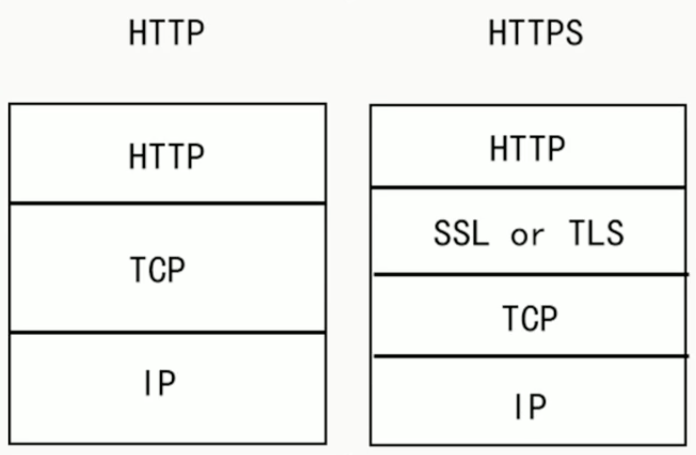
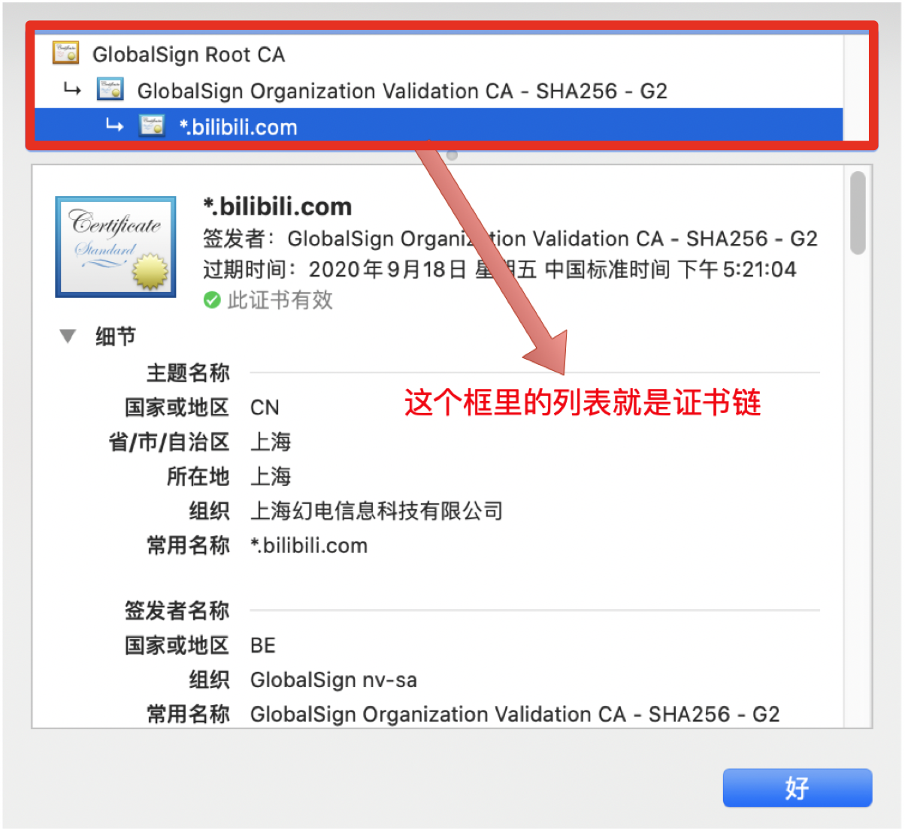

# 环境和软件准备

从 [Apache Kafka 官网](https://link.segmentfault.com/?enc=wrfsCvuL2ZzNDl7HWAMpcw%3D%3D.uOcXOgNcL%2BFeRpsJgChG8071lfmEmmh3Qn96VJPUWP3L5rhkX9IYr3%2F3t9lccNBS) 下载对应版本的 Kafka 并解压到你选择的目录。

> 确保已经安装 Java 才能运行 Kafka，可以通过运行 `java -version` 来检查 Java 环境。

# 部署 Zookeeper

使用 Kafka **内置**的 Zookeeper

## 启用 SASL 认证

进入 config 目录，修改 `zookeeper.properties` 配置文件增加以下内容：

```properties
authProvider.1=org.apache.zookeeper.server.auth.SASLAuthenticationProvider
jaasLoginRenew=3600000
requireClientAuthScheme=sasl
zookeeper.sasl.client=true
```

## 配置 JAAS

在 config 目录下创建 `zk_jaas.conf` 文件，内容如下：

```perl
Server {
    org.apache.zookeeper.server.auth.DigestLoginModule required
    username="admin"
    password="admin"
    user_admin="admin"
    user_zkclient="zkclient";
};
```

其作用是创建了一个 Server 节点，其中

- `org.apache.zookeeper.server.auth.DigestLoginModule required` 是认证逻辑的处理类；
- `username、password` 是zookeeper之间通讯的用户名和密码；
- `user_admin="admin"` 的结构是 user_[username]=[password] 定义 kafka-broker（zookeeper客户端）连接到 zookeeper 时用的用户名和密码。

==注意：Server 内部最后一行的 `;` 和 } 后的 `;` 不能缺少！==

## 修改启动文件

进入 bin 目录，修改 `zookeeper-server-start.sh` 文件；

在 `export KAFKA_HEAP_OPTS=` 配置项的参数后添加 `JAAS` 的配置：

```javascript
export KAFKA_HEAP_OPTS="-Xmx512M -Xms512M -Djava.security.auth.login.config=../config/zk_jaas.conf"
```

## 启动 Zookeeper

执行命令：

```bash
./zookeeper-server-start.sh -daemon ../config/zookeeper.properties
```

> -daemon 参数配置后台运行

## 测试

可以从官网 [Apache ZooKeeper](https://link.segmentfault.com/?enc=9xdL3Qu6IPzhKVV4ERwkVA%3D%3D.7lYxBmch1K1WHPCEjGCq3UTKbVyv0sMb0MIffopKgu5kogbT1SJSNi5sW76A6CjF3vY8%2FivGWcFvd95WlMyPgQ%3D%3D) 下载对应版本的 ZooKeeper 并解压；

添加 `JAAS` 配置，在 confi 目录下创建 `zk_client_jaas.conf` 文件：

```perl
Client{
    org.apache.zookeeper.server.auth.DigestLoginModule required
    username="zkclient"
    password="zkclient";
};
```

修改 bin 目录下的 `zkCli.sh` 文件，在启动命令中增加 JAAS 的配置：

```bash
"$JAVA" "-Dzookeeper.log.dir=${ZOO_LOG_DIR}" "-Dzookeeper.root.logger=${ZOO_LOG4J_PROP}" "-Dzookeeper.log.file=${ZOO_LOG_FILE}" \
     -cp "$CLASSPATH" $CLIENT_JVMFLAGS $JVMFLAGS \
     "-Djava.security.auth.login.config=../conf/zk_client_jaas.conf" \
     org.apache.zookeeper.ZooKeeperMain "$@"
```

执行 `zkCli.sh` 连接本机已经启动好的 `ZooKeeper`

进入 Kafka 的 log 目录，查看内置 zk 的日志 `zookeeper.out` 显示以下内容：

```rust
INFO adding SASL authorization for authorizationID: zkclient (org.apache.zookeeper.server.ZooKeeperServer)
```

> 代表 ZooKeeper 的 SASL 认证已经配置成功。


# 部署 Kafka

## 配置 Kafka Broker

进入 config 目录，修改 `server.properties` 配置文件增加以下内容：

```ruby
listeners=SASL_PLAINTEXT://:9092
advertised.listeners=SASL_PLAINTEXT://localhost:9092
security.inter.broker.protocol=SASL_PLAINTEXT
sasl.mechanism.inter.broker.protocol=SCRAM-SHA-512
sasl.enabled.mechanisms=SCRAM-SHA-512
authorizer.class.name=kafka.security.authorizer.AclAuthorizer
allow.everyone.if.no.acl.found=false
super.users=User:admin
```

- `authorizer.class.name` 开启 ACL 授权机制并指定实现类；
- `allow.everyone.if.no.acl.found` 如果没有找到ACL（访问控制列表）配置，是否允许任何操作；这里设置为 `false` 指除了超级管理员，其他用户必须配置 ACL 才能访问资源；
- `super.users` 超级管理员，无需配置 ACL 拥有所有权限的用户。

## 配置 JAAS

在 config 目录下创建 `kafka_server_jaas.conf` 文件，内容如下：

```perl
KafkaServer {
    org.apache.kafka.common.security.scram.ScramLoginModule required
    username="admin"
    password="admin";
};

Client{
    org.apache.kafka.common.security.plain.PlainLoginModule required
    username="zkclient"
    password="zkclient";
};
```

- `KafkaServer` 中的 `username，password` 用于 Kafka 集群 Broker 节点之间通信用的账号密码；
- `KafkaServer` 中的 `user_test="test"` 用于 Kafka 客户端（producer，consumer）连接broker时，用该配置下user_[username]=[password]结构配置的账号密码登录；
- `Client` 用于 broker 和 zookeeper 之间的认证，对应 zk_jaas.conf 中的 【user_zkclient="zkclient"】 配置；
- `user_admin="admin"` 的结构是 user_[username]=[password] 定义 kafka-broker（zookeeper客户端）连接到 zookeeper 时用的用户名和密码。

## 修改启动文件

进入 bin 目录，修改 `kafka-server-start.sh` 文件；

在 `export KAFKA_HEAP_OPTS=` 配置项的参数后添加 `JAAS` 的配置：

```javascript
export KAFKA_HEAP_OPTS="-Xmx1G -Xms1G -Djava.security.auth.login.config=../config/kafka_server_jaas.conf"
```

## 创建 SCRAM 用户

在启动 Kafka 之前需要先创建好admin用户，其余用户可以之后创建，在 bin 目录下执行以下内容：

> 分别创建 `admin`(超级管理员) 和 `test`(客户端用户)

```bash
./kafka-configs.sh --zookeeper localhost:2181 --alter --add-config 'SCRAM-SHA-512=[password=admin]' --entity-type users --entity-name admin

./kafka-configs.sh --zookeeper localhost:2181 --alter --add-config 'SCRAM-SHA-512=[password=test]' --entity-type users --entity-name test
```

> `SASL/SCRAM` 认证的用户信息是动态创建存储在 ZooKeeper 中， 由于上面的配置 `kafka_server_jaas.conf` 中 Broker 之间的通信是通过 `admin` 用户的，如果该用户不存在会 **启动报错**。

## 启动 Kafka

执行命令：

```bash
./kafka-server-start.sh -daemon ../config/server.properties
```

> -daemon 参数配置后台运行

# 验证 SASL/SCRAM 鉴权

## 客户端认证配置

### 管理员配置

进入 config 目录创建 `cmd.properties` 内容如下：

```properties
security.protocol=SASL_PLAINTEXT
sasl.mechanism=SCRAM-SHA-512
sasl.jaas.config=org.apache.kafka.common.security.scram.ScramLoginModule required username="admin" password="admin";
```

> 配置认证的类型以及登录逻辑的处理类和用户，使用超级管理员 admin
>
> **注意** 最后的 `;` 是必须加上的。

### 生产者配置

修改 config 目录下的 `producer.properties` 增加以下内容：

```properties
security.protocol=SASL_PLAINTEXT
sasl.mechanism=SCRAM-SHA-512
sasl.jaas.config=org.apache.kafka.common.security.scram.ScramLoginModule required username="admin" password="admin";
```

> 生产者也使用超级管理员 admin 来发送消息。

### 消费者配置

修改 config 目录下的 `consumer.properties` 增加以下内容：

```properties
security.protocol=SASL_PLAINTEXT
sasl.mechanism=SCRAM-SHA-512
sasl.jaas.config=org.apache.kafka.common.security.scram.ScramLoginModule required username="test" password="test";
```

> 消费者使用 test 用户来接收消息。

## 创建topic

在 bin 目录下执行以下命令：

```bash
./kafka-topics.sh --bootstrap-server localhost:9092 --create --topic test --partitions 1 --replication-factor 1 --command-config ../config/cmd.properties
```

- `bootstrap-server` 配置 Kafka 服务端的地址
- `topic` 指定topic名称
- `command-config` 指定命令的认证配置，这里使用上面创建的 **管理员配置**

创建成功后可以通过以下命令查看存在的 topic 清单：

```bash
./kafka-topics.sh --bootstrap-server localhost:9092 --list --command-config ../config/cmd.properties
```

## 创建消费者

### 执行 kafka-console-consumer

在 bin 目录下执行以下命令：

```bash
./kafka-console-consumer.sh --bootstrap-server localhost:9092 --topic test --consumer.config ../config/consumer.properties
```

执行命令后会发现以下 **报错** 信息：

```autoit
ERROR Error processing message, terminating consumer process:  (kafka.tools.ConsoleConsumer$)
org.apache.kafka.common.errors.SaslAuthenticationException: Authentication failed during authentication due to invalid credentials with SASL mechanism SCRAM-SHA-512
Processed a total of 0 messages
```

> `Authentication failed` 认证失败，由于消费者的认证使用的是 test 用户，而该用户还未配置任何 ACL 权限。

### 配置用户 ACL 权限

Kafka 的 ACL (Access Control Lists) 允许你定义哪些用户可以访问哪些主题，并且可以执行哪些操作（如读、写、创建、删除等）。

执行以下命令：

```csharp
./kafka-acls.sh --authorizer-properties zookeeper.connect=localhost:2181 --add --allow-principal User:test --operation Read --topic test --group test-consumer-group
```

> 为 test 用户在资源 `topic[test]` 下分配只读权限

执行成功，可以通过以下命令查看资源所分配的所有 ACL 清单：

```bash
./kafka-acls.sh --bootstrap-server localhost:9092 --topic test --list --command-config ../config/cmd.properties
```

重新创建消费者：

```bash
./kafka-console-consumer.sh --bootstrap-server localhost:9092 --topic test --consumer.config ../config/consumer.properties
```

> 执行成功后该 shell 窗口会一直阻塞等待消息。

## 创建生产者

**新开一个 shell 窗口** 在 bin 目录下执行以下命令：

```bash
./kafka-console-producer.sh --bootstrap-server localhost:9092 --topic test --producer.config ../config/producer.properties
```

> 由于生产者的认证使用的是 admin 为 **超级管理员** 所以无需配置 ACL 权限。
>
> 执行成功后会出现 `>` 符号，输入内容之后，切换到 **消费者** 窗口就可以看到了。

# 配置文件

zookeeper配置文件zookeeper.properties

```properties
dataDir=/data/kafka/zookeeper
clientPort=2181
maxClientCnxns=100
admin.enableServer=false
dataLogDir=/data/kafka/zookeeper/data/dataLogDir #zookeeper日志目录 （可以修改可以不修改）
tickTime=2000
initLimit=10
authProvider.1=org.apache.zookeeper.server.auth.SASLAuthenticationProvider
jaasLoginRenew=3600000
requireClientAuthScheme=sasl
zookeeper.sasl.client=true
```

kafka配置文件server.properties

```properties
broker.id=1
num.network.threads=3
num.io.threads=8
socket.send.buffer.bytes=102400
socket.receive.buffer.bytes=102400
socket.request.max.bytes=104857600
log.dirs=/data/kafka/kafka-logs
num.partitions=1
num.recovery.threads.per.data.dir=1
offsets.topic.replication.factor=1
transaction.state.log.replication.factor=1
transaction.state.log.min.isr=1
log.retention.hours=168
log.segment.bytes=1073741824
log.retention.check.interval.ms=300000
zookeeper.connect=localhost:2181
zookeeper.connection.timeout.ms=18000
group.initial.rebalance.delay.ms=0
port=9092
host.name=localhost
listeners=SASL_PLAINTEXT://:9092
advertised.listeners=SASL_PLAINTEXT://localhost:9092
security.inter.broker.protocol=SASL_PLAINTEXT
sasl.mechanism.inter.broker.protocol=SCRAM-SHA-512
sasl.enabled.mechanisms=SCRAM-SHA-512
authorizer.class.name=kafka.security.authorizer.AclAuthorizer
allow.everyone.if.no.acl.found=false
super.users=User:admin
```

# SSL加密

http和https的区别是https多了一层 SSL (Secure Sockets Layer 安全套接层)或 TLS (Transport Layer Security 安全传输层协议)。



SSL 和 TLS 协议可以为通信双方提供识别和认证通道，从而保证通信的机密性和数据完整性。SSL 已经逐渐被 TLS 取代，所以下文就以 TLS 指代安全层。 

TLS 握手是启动 HTTPS 通信的过程，类似于 TCP 建立连接时的三次握手。 在 TLS 握手的过程中，通信双方交换消息以相互验证，相互确认，并确立它们所要使用的加密算法以及会话密钥 (用于对称加密的密钥)。

# TLS握手过程

1. **"client hello"消息：**客户端通过发送"client hello"消息向服务器发起握手请求，该消息包含了客户端所支持的 TLS 版本和密码组合以供服务器进行选择，还有一个"client random"随机字符串。
2. **"server hello"消息：**服务器发送"server hello"消息对客户端进行回应，该消息包含了数字证书【包含服务端的公钥】，服务器选择的密码组合和"server random"随机字符串。
3. **验证：**客户端对服务器发来的证书进行验证，确保对方的合法身份，验证过程可以细化为以下几个步骤：
    1. 检查数字签名
    2. 验证证书链 (这个概念下面会进行说明)
    3. 检查证书的有效期
    4. 检查证书的撤回状态 (撤回代表证书已失效)
4. **"premaster secret"字符串：**客户端向服务器发送另一个随机字符串"premaster secret (预主密钥)"，这个字符串是经过服务器的公钥加密过的，只有对应的私钥才能解密。
5. **使用私钥：**服务器使用私钥解密"premaster secret"。
6. **生成共享密钥**：客户端和服务器均使用 client random，server random 和 premaster secret，并通过相同的算法生成相同的共享密钥 **KEY**。
7. **客户端就绪：**客户端发送经过共享密钥 **KEY**加密过的"finished"信号。
8. **服务器就绪：**服务器发送经过共享密钥 **KEY**加密过的"finished"信号。
9. **达成安全通信：**握手完成，双方使用对称加密进行安全通信。

> client给server发送消息包含==client生成的随机串==
>
> server收到消息后响应服务端，响应内容包含==CA数字证书（证书有server的公钥）和server生成的随机串==
>
> server端验证数字签名和证书，并==再次生成随机串用server的公钥加密，加密的字符串为premaster secret==发送给server
>
> client和server端均通过 ==client random+server random+premaster secret 通过相同的算法加密成KEY==
>
> 加密完成后client给server==发送finished信号（包含KEY）==
>
> ==server验证KEY成功==后，给client端==发送finished信号==
>
> 至此连接建立


证书链，证书链从根证书开始，并且证书链中的每一级证书所标识的实体都要为其下一级证书签名，而根证书自身则由证书颁发机构签名。客户端在验证证书链时，必须对链中所有证书的数字签名进行验证，直到达到根证书为止。




