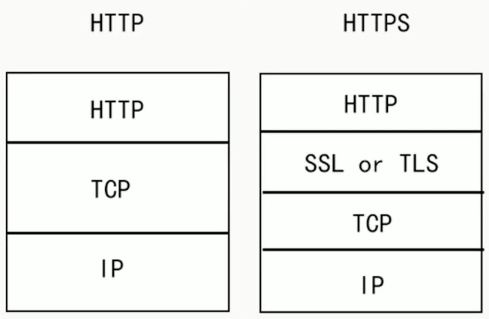
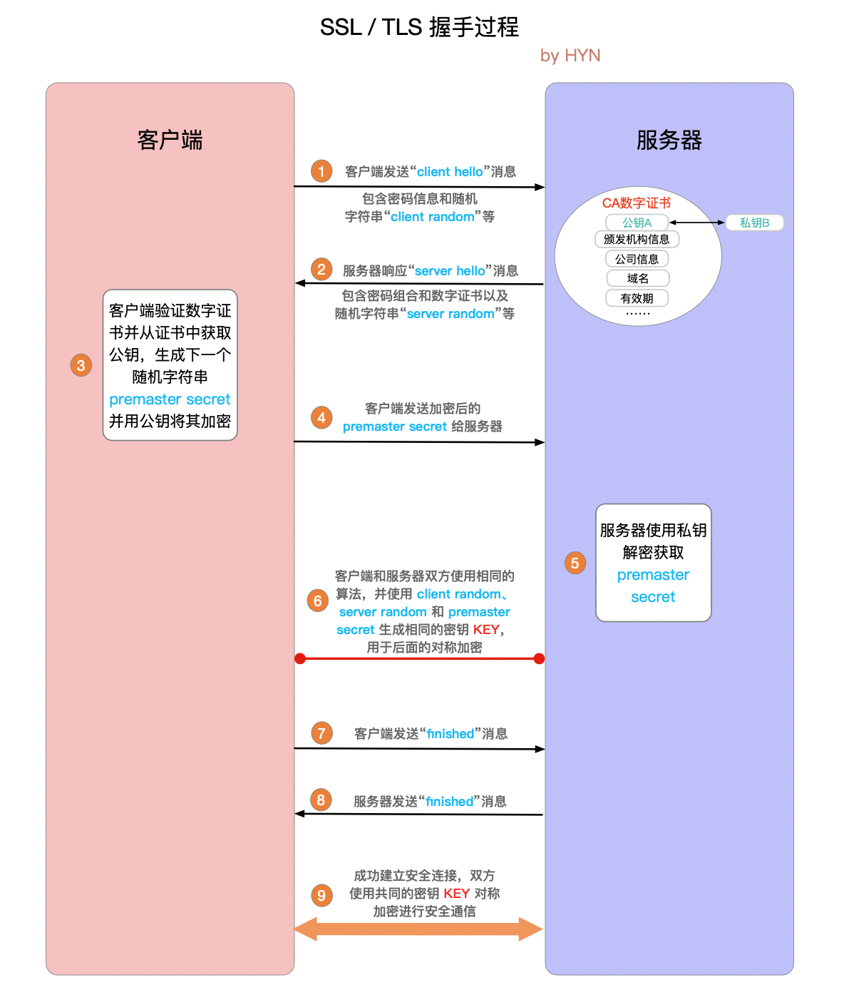

```perl
keystore: 密钥仓库的位置
ca-cert: CA的证书
ca-key: CA的私钥
ca-password: CA的密码
cert-file: 出口，服务器的未签名证书
cert-signed: 已签名的服务器证书
```


```perl
keytool -keystore server.keystore.jks -alias localhost -validity 6666 -genkey

1qaz@WSX
1qaz@WSX

您的名字与姓氏是什么?
  [yes]:  localhost
您的组织单位名称是什么?
  [yes]:  neptune
您的组织名称是什么?
  [yes]:  neptune
您所在的城市或区域名称是什么?
  [yes]:  shanghai
您所在的省/市/自治区名称是什么?
  [yes]:  shanghai
该单位的双字母国家/地区代码是什么?
  [yes]:  CH
CN=localhost, OU=neptune, O=neptune, L=shanghai, ST=shanghai, C=CH是否正确?
  [否]:  是

输入 <localhost> 的密钥口令
1qaz@WSX
1qaz@WSX


验证证书内容
keytool -list -v -keystore server.keystore.jks


openssl req -new -x509 -keyout ca-key -out ca-cert -days 365

[root@Neptune ~]# openssl req -new -x509 -keyout ca-key -out ca-cert -days 365
Generating a 2048 bit RSA private key
...................................................................+++
......................................+++
writing new private key to 'ca-key'
Enter PEM pass phrase:
Verifying - Enter PEM pass phrase:
-----
You are about to be asked to enter information that will be incorporated
into your certificate request.
What you are about to enter is what is called a Distinguished Name or a DN.
There are quite a few fields but you can leave some blank
For some fields there will be a default value,
If you enter '.', the field will be left blank.
-----
Country Name (2 letter code) [XX]:CH
State or Province Name (full name) []:shanghai
Locality Name (eg, city) [Default City]:shanghai
Organization Name (eg, company) [Default Company Ltd]:Neptune
Organizational Unit Name (eg, section) []:Neptune
Common Name (eg, your name or your server's hostname) []:localhost
Email Address []:此处不填，直接回车


```


```perl
keytool -keystore server.truststore.jks -alias CARoot -import -file ca-cert
1qaz@WSX
1qaz@WSX
是否信任此证书? [否]:  是
证书已添加到密钥库中

keytool -keystore client.truststore.jks -alias CARoot -import -file ca-cert
1qaz@WSX
1qaz@WSX
是否信任此证书? [否]:  是
证书已添加到密钥库中

keytool -keystore server.keystore.jks -alias localhost -certreq -file cert-file

openssl x509 -req -CA ca-cert -CAkey ca-key -in cert-file -out cert-signed -days 6666 -CAcreateserial -passin pass:1qaz@WSX

keytool -keystore server.keystore.jks -alias CARoot -import -file ca-cert
keytool -keystore server.keystore.jks -alias localhost -import -file cert-signed

```

执行脚本

```shell
#!/bin/bash
#Step 1
keytool -keystore server.keystore.jks -alias localhost -validity 3650 -keyalg RSA -genkey
#Step 2
openssl req -new -x509 -keyout ca-key -out ca-cert -days 3650
keytool -keystore server.truststore.jks -alias CARoot -import -file ca-cert
keytool -keystore client.truststore.jks -alias CARoot -import -file ca-cert
#Step 3
keytool -keystore server.keystore.jks -alias localhost -certreq -file cert-file
openssl x509 -req -CA ca-cert -CAkey ca-key -in cert-file -out cert-signed -days 3650 -CAcreateserial -passin pass:123456
keytool -keystore server.keystore.jks -alias CARoot -import -file ca-cert
keytool -keystore server.keystore.jks -alias localhost -import -file cert-signed
#Step 4
keytool -keystore client.keystore.jks -alias localhost -validity 3650 -keyalg RSA -genkey
```

kafka配置文件server.properties

```properties
listeners=PLAINTEXT://localhost:9092,SSL://localhost:9093

ssl.keystore.location=/root/ssl/server.keystore.jks
ssl.keystore.password=123456
ssl.key.password=123456
ssl.truststore.location=/root/ssl/server.truststore.jks
ssl.truststore.password=123456
ssl.client.auth=required
security.inter.broker.protocol=SSL
ssl.endpoint.identification.algorithm=
producer.ssl.endpoint.identification.algorithm=
consumer.ssl.endpoint.identification.algorithm=


listeners=PLAINTEXT://0.0.0.0:9965,SSL://0.0.0.0:9955
advertised.listeners=PLAINTEXT://localhost:9965,SSL://localhost:9955
ssl.keystore.location=/home/sdut/ssl/server.keystore.jks
ssl.keystore.password=sdut123456
ssl.key.password=sdut123456
ssl.truststore.location=/home/sdut/ssl/server.truststore.jks
ssl.truststore.password=sdut123456
ssl.client.auth=none

```

Kafka客户端的client-ssl.properties 文件

```properties
security.protocol=SSL
ssl.truststore.location=/root/ssl/server.keystore.jks
ssl.truststore.password=123456
```

kafka命令

```perl
kafka-console-producer.sh --broker-list localhost:9093 --topic test --producer.config client-ssl.properties
kafka-console-consumer.sh --bootstrap-server localhost:9093 --topic test --consumer.config client-ssl.properties
```


# SASL SCRAM认证

## SSL加密

http和https的区别是https多了一层 SSL (Secure Sockets Layer 安全套接层)或 TLS (Transport Layer Security 安全传输层协议)。



SSL 和 TLS 协议可以为通信双方提供识别和认证通道，从而保证通信的机密性和数据完整性。SSL 已经逐渐被 TLS 取代，所以下文就以 TLS 指代安全层。 

TLS 握手是启动 HTTPS 通信的过程，类似于 TCP 建立连接时的三次握手。 在 TLS 握手的过程中，通信双方交换消息以相互验证，相互确认，并确立它们所要使用的加密算法以及会话密钥 (用于对称加密的密钥)。

## TLS握手过程

1. **"client hello"消息：**客户端通过发送"client hello"消息向服务器发起握手请求，该消息包含了客户端所支持的 TLS 版本和密码组合以供服务器进行选择，还有一个"client random"随机字符串。
2. **"server hello"消息：**服务器发送"server hello"消息对客户端进行回应，该消息包含了数字证书【包含服务端的公钥】，服务器选择的密码组合和"server random"随机字符串。
3. **验证：**客户端对服务器发来的证书进行验证，确保对方的合法身份，验证过程可以细化为以下几个步骤：
    1. 检查数字签名
    2. 验证证书链 (这个概念下面会进行说明)
    3. 检查证书的有效期
    4. 检查证书的撤回状态 (撤回代表证书已失效)
4. **"premaster secret"字符串：**客户端向服务器发送另一个随机字符串"premaster secret (预主密钥)"，这个字符串是经过服务器的公钥加密过的，只有对应的私钥才能解密。
5. **使用私钥：**服务器使用私钥解密"premaster secret"。
6. **生成共享密钥**：客户端和服务器均使用 client random，server random 和 premaster secret，并通过相同的算法生成相同的共享密钥 **KEY**。
7. **客户端就绪：**客户端发送经过共享密钥 **KEY**加密过的"finished"信号。
8. **服务器就绪：**服务器发送经过共享密钥 **KEY**加密过的"finished"信号。
9. **达成安全通信：**握手完成，双方使用对称加密进行安全通信。

> client给server发送消息包含==client生成的随机串==
>
> server收到消息后响应服务端，响应内容包含==CA数字证书（证书有server的公钥）和server生成的随机串==
>
> server端验证数字签名和证书，并==再次生成随机串用server的公钥加密，加密的字符串为premaster secret==发送给server
>
> client和server端均通过 ==client random+server random+premaster secret 通过相同的算法加密成KEY==
>
> 加密完成后client给server==发送finished信号（包含KEY）==
>
> ==server验证KEY成功==后，给client端==发送finished信号==
>
> 至此连接建立



证书链，证书链从根证书开始，并且证书链中的每一级证书所标识的实体都要为其下一级证书签名，而根证书自身则由证书颁发机构签名。客户端在验证证书链时，必须对链中所有证书的数字签名进行验证，直到达到根证书为止。


