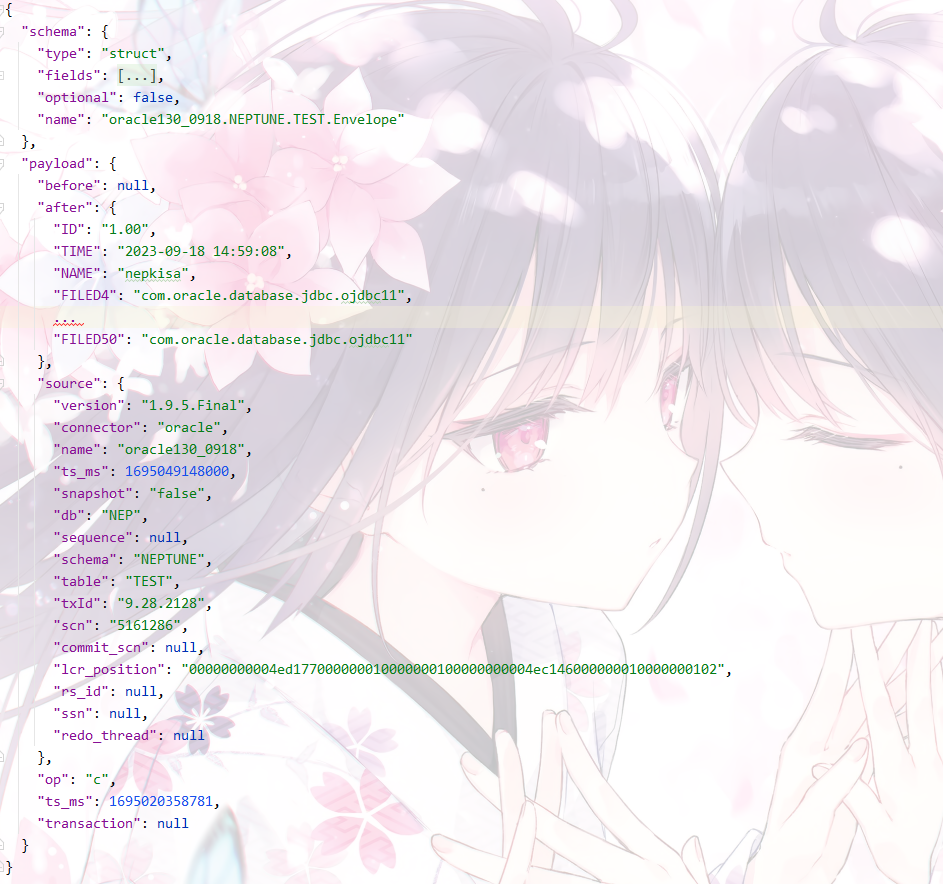

[toc]

# CDC采集Oracle

## Debezium

Oracle Document：https://debezium.io/documentation/reference/2.3/connectors/oracle.html

支持版本：11.2.0.4+、12c、19c

### 工作流程

1. 建立与目标数据库的连接。

2. 确定要捕获的表。 默认情况下，连接器捕获所有表，可通过参数选择需要捕获的表（ table.include.list 或 table.exclude.list ）。快照完成后，连接器将继续流式传输指定表的数据。 

3. 获取每个捕获表的锁（ROW SHARE MODE）【此类型的锁读取数据，不可修改数据】，以防止在创建快照期间发生表结构更改。 Debezium只会锁很短的时间。

4. 从数据库的重做日志中读取当前更改位置（SCN）【System Change Number】 。

5. 捕获所有数据库表的结构【可使用参数指定仅捕获采集表】。 连接器将表结构信息保存到schema history topic中。此topic记录表结构变化（DDL） 

> 如果未配置采集表，则初始快照仅捕获其结构，它不捕获任何表数据。

6. 释放在步骤 3 中获得的锁。 其他数据库客户端现在可以写入任何以前锁定的表。

7. **实际跳过此步（采集存量数据），**在步骤 4 中读取的 SCN 位置，连接器扫描指定用于捕获的表 （SELECT * FROM … AS OF SCN 123）【在查询时指定一个SCN，以查看在该SCN所表示的历史时间点的表数据】。 

    在扫描期间，连接器将完成以下任务：

    * 确认表是在快照开始之前创建的。 如果表是在快照开始后创建的，则连接器将跳过该表。 快照完成后，连接器转换为流式处理后，它会为快照开始后创建的任何表发出更改事件。
    * 为从表中捕获的每一行生成一个事件。 所有事件都包含相同的 SCN 位置，即在步骤 4 中获取的 SCN 位置。
    * 将每个事件发送到源表的 Kafka 主题。

    * 释放数据表锁（如果适用）。

8. 在连接器偏移量中记录快照的成功完成情况。

* 生成的初始快照捕获捕获的表中每一行的当前状态。 从此基线状态开始，连接器会在发生后续更改时捕获这些更改。

* 快照过程开始后，如果由于连接器故障、重新平衡或其他原因导致进程中断，则在连接器重新启动后，该过程将重新启动。 连接器完成初始快照后，它会从步骤 3 中读取的位置继续流式传输，以免错过任何更新。 如果连接器因任何原因再次停止，则在重新启动后，它将从之前中断的位置恢复流式处理更改。【**断点续传**】

### 数据格式

含有表结构+数据（主要关注数据部分【payload】）



Payload of a change event value

An *envelope* structure in the payload sections of a change event value contains the following fields:

- `op`

    包含描述操作类型的字符串值的必填字段。 Oracle 连接器更改事件值的负载中的 op 字段包含以下值之一：c（创建或插入）、u（更新）、d（删除）、 r（读取，表示快照）、t（truncate）

- `before`

    数据更改之前的数据

- `after`

    数据更改之后的数据

- `source`

    描述事件源元数据的结构

    * Debezium 版本
    * 事务 ID（不包括快照）
    * 更改的 SCN
    * 【ts_ms】指示源数据库中的记录何时更改的时间戳（对于快照，时间戳指示快照发生的时间）

- `ts_ms`

    debezium采集到数据的时间

### 部署（Xstream）

* 数据开启归档/xstream
* 创建xstream采集用户
* 授权采集用户权限
* 创建xstream所需进程

```sql
ORACLE_SID=ORCLCDB dbz_oracle sqlplus /nolog

CONNECT sys/top_secret AS SYSDBA
alter system set db_recovery_file_dest_size = 5G;
alter system set db_recovery_file_dest = '/opt/oracle/oradata/recovery_area' scope=spfile;
alter system set enable_goldengate_replication=true;
shutdown immediate
startup mount
alter database archivelog;
alter database open;
-- Should show "Database log mode: Archive Mode"
archive log list

exit;

ALTER TABLE inventory.customers ADD SUPPLEMENTAL LOG DATA (ALL) COLUMNS;

sqlplus sys/top_secret@//localhost:1521/ORCLCDB as sysdba
  CREATE TABLESPACE xstream_adm_tbs DATAFILE '/opt/oracle/oradata/ORCLCDB/xstream_adm_tbs.dbf'
    SIZE 25M REUSE AUTOEXTEND ON MAXSIZE UNLIMITED;
  exit;

sqlplus sys/top_secret@//localhost:1521/ORCLPDB1 as sysdba
  CREATE TABLESPACE xstream_adm_tbs DATAFILE '/opt/oracle/oradata/ORCLCDB/ORCLPDB1/xstream_adm_tbs.dbf'
    SIZE 25M REUSE AUTOEXTEND ON MAXSIZE UNLIMITED;
  exit;

sqlplus sys/top_secret@//localhost:1521/ORCLCDB as sysdba
  CREATE USER c##dbzadmin IDENTIFIED BY dbz
    DEFAULT TABLESPACE xstream_adm_tbs
    QUOTA UNLIMITED ON xstream_adm_tbs
    CONTAINER=ALL;

  GRANT CREATE SESSION, SET CONTAINER TO c##dbzadmin CONTAINER=ALL;

  BEGIN
     DBMS_XSTREAM_AUTH.GRANT_ADMIN_PRIVILEGE(
        grantee                 => 'c##dbzadmin',
        privilege_type          => 'CAPTURE',
        grant_select_privileges => TRUE,
        container               => 'ALL'
     );
  END;
  /

  exit;
  
  sqlplus sys/top_secret@//localhost:1521/ORCLCDB as sysdba
  CREATE TABLESPACE xstream_tbs DATAFILE '/opt/oracle/oradata/ORCLCDB/xstream_tbs.dbf'
    SIZE 25M REUSE AUTOEXTEND ON MAXSIZE UNLIMITED;
  exit;

sqlplus sys/top_secret@//localhost:1521/ORCLPDB1 as sysdba
  CREATE TABLESPACE xstream_tbs DATAFILE '/opt/oracle/oradata/ORCLCDB/ORCLPDB1/xstream_tbs.dbf'
    SIZE 25M REUSE AUTOEXTEND ON MAXSIZE UNLIMITED;
  exit;

sqlplus sys/top_secret@//localhost:1521/ORCLCDB as sysdba
  CREATE USER c##dbzuser IDENTIFIED BY dbz
    DEFAULT TABLESPACE xstream_tbs
    QUOTA UNLIMITED ON xstream_tbs
    CONTAINER=ALL;

  GRANT CREATE SESSION TO c##dbzuser CONTAINER=ALL;
  GRANT SET CONTAINER TO c##dbzuser CONTAINER=ALL;
  GRANT SELECT ON V_$DATABASE to c##dbzuser CONTAINER=ALL;
  GRANT FLASHBACK ANY TABLE TO c##dbzuser CONTAINER=ALL;
  GRANT SELECT_CATALOG_ROLE TO c##dbzuser CONTAINER=ALL;
  GRANT EXECUTE_CATALOG_ROLE TO c##dbzuser CONTAINER=ALL;
  exit;
  
  sqlplus c##dbzadmin/dbz@//localhost:1521/ORCLCDB
DECLARE
  tables  DBMS_UTILITY.UNCL_ARRAY;
  schemas DBMS_UTILITY.UNCL_ARRAY;
BEGIN
    tables(1)  := NULL;
    schemas(1) := 'debezium';
  DBMS_XSTREAM_ADM.CREATE_OUTBOUND(
    server_name     =>  'dbzxout',
    table_names     =>  tables,
    schema_names    =>  schemas);
END;
/
exit;
sqlplus sys/top_secret@//localhost:1521/ORCLCDB as sysdba
BEGIN
  DBMS_XSTREAM_ADM.ALTER_OUTBOUND(
    server_name  => 'dbzxout',
    connect_user => 'c##dbzuser');
END;
/
exit;
```

### 采集演示

#### 环境准备

* Oracle19c
* zookeeper 
* kafka
* debezium-1.9

#### RestAPI

```json
###获取任务列表
GET {{baseUrl}}
Accept: application/json

###删除任务
DELETE {{baseUrl}}/{{taskname}}

###开启oracle任务
POST {{baseUrl}}
Content-Type: application/json

{
  "name": "{{taskname}}",
  "config": {
    "connector.class": "io.debezium.connector.oracle.OracleConnector",
    "tasks.max": "1",
    "database.server.name": "{{topic}}",
    "database.hostname": "{{hostname}}",
    "database.port": "1521",
    "database.user": "xstrmadmin",
    "database.password": "123456",
    "database.dbname": "nep",
    "skipped.operations": "d",
    "database.history.store.only.captured.tables.ddl":"true",
    "database.connection.adapter": "xstream",
    "database.out.server.name": "xout",
    "snapshot.mode": "schema_only",
    "table.include.list": "{{tables}}",
    "decimal.handling.mode": "string",
    "database.history.kafka.bootstrap.servers": "{{kafka}}",
    "database.history.kafka.topic": "schema-changes.{{topic}}"
  }
}

###获取任务开启参数
GET {{baseUrl}}/{{taskname}}
Accept: application/json

###获取任务状态
GET {{baseUrl}}/{{taskname}}/status
Accept: application/json
```

#### 操作步骤

* 开启Debezium采集
* 数据库操作（单表50个字段 一个事务insert 10w条）
* Kafka消费数据

## FlinkCDC

支持Oracle版本：11, 12, 19

其中11版本不需要额外授权，logminer默认开启

### 演变过程

* 由于Debezium Xstream采集方式存在一些未知且无法解决的的问题，使用的备选方案为Debezium Logminer

* Debezium Logminer经测试遇到百万大事务时必定OOM导致整个容器挂掉，且==不支持断点续传==，故使用FlinkCDC【**支持断点续传**】

* 使用FlinkCDC依旧存在OOM问题，且FlinkCDC底层使用版本为dbz-1.6.4（https://github.com/NepKisa/DebeziumCDC）
* 稳定性测试期间由于一些特殊原因导致任务失败，通过Kafka参数调整、Flink检查点参数调整等操作目前已正常
* 上线接入ECIF系统（内存版本，遇OOM，通过调整tm内存已解决【发现隐藏参数】，目前已正常运行3个月）

* 通过调整`manager memory`使性能从不稳定的（***600~1500***）【数据高峰期性能提高到峰值1500后一段时间会急剧下降，6小时左右会恢复，原因未知】提高到稳定的***4500+***

### 工作流程


### 数据格式

目前生产与debezium相同，由于此数据会经过算子，可以自定义算子转换成任何格式


### 部署（logminer）

```sql
ORACLE_SID=SID
export ORACLE_SID
sqlplus /nolog
  CONNECT sys/password AS SYSDBA
alter system set db_recovery_file_dest_size = 10G;
alter system set db_recovery_file_dest = '/opt/oracle/oradata/recovery_area' scope=spfile;
shutdown immediate;
startup mount;
alter database archivelog;
alter database open;

-- Should now "Database log mode: Archive Mode"
archive log list;

-- Enable supplemental logging for a specific table:
ALTER TABLE inventory.customers ADD SUPPLEMENTAL LOG DATA (ALL) COLUMNS;

-- Enable supplemental logging for database
ALTER DATABASE ADD SUPPLEMENTAL LOG DATA;

sqlplus sys/password@host:port/SID AS SYSDBA;
  CREATE TABLESPACE logminer_tbs DATAFILE '/opt/oracle/oradata/SID/logminer_tbs.dbf' SIZE 25M REUSE AUTOEXTEND ON MAXSIZE UNLIMITED;
  exit;
  
  sqlplus sys/password@host:port/SID AS SYSDBA;
  CREATE USER flinkuser IDENTIFIED BY flinkpw DEFAULT TABLESPACE LOGMINER_TBS QUOTA UNLIMITED ON LOGMINER_TBS;
  GRANT CREATE SESSION TO flinkuser;
  GRANT SET CONTAINER TO flinkuser;
  GRANT SELECT ON V_$DATABASE to flinkuser;
  GRANT FLASHBACK ANY TABLE TO flinkuser;
  GRANT SELECT ANY TABLE TO flinkuser;
  GRANT SELECT_CATALOG_ROLE TO flinkuser;
  GRANT EXECUTE_CATALOG_ROLE TO flinkuser;
  GRANT SELECT ANY TRANSACTION TO flinkuser;
  GRANT LOGMINING TO flinkuser;

  GRANT CREATE TABLE TO flinkuser;
  -- need not to execute if set scan.incremental.snapshot.enabled=true(default)
  GRANT LOCK ANY TABLE TO flinkuser;
  GRANT ALTER ANY TABLE TO flinkuser;
  GRANT CREATE SEQUENCE TO flinkuser;

  GRANT EXECUTE ON DBMS_LOGMNR TO flinkuser;
  GRANT EXECUTE ON DBMS_LOGMNR_D TO flinkuser;

  GRANT SELECT ON V_$LOG TO flinkuser;
  GRANT SELECT ON V_$LOG_HISTORY TO flinkuser;
  GRANT SELECT ON V_$LOGMNR_LOGS TO flinkuser;
  GRANT SELECT ON V_$LOGMNR_CONTENTS TO flinkuser;
  GRANT SELECT ON V_$LOGMNR_PARAMETERS TO flinkuser;
  GRANT SELECT ON V_$LOGFILE TO flinkuser;
  GRANT SELECT ON V_$ARCHIVED_LOG TO flinkuser;
  GRANT SELECT ON V_$ARCHIVE_DEST_STATUS TO flinkuser;
  exit;
  
```

### 采集演示

#### 环境准备

* Oracle19c
* zookeeper
* kafka

#### 操作步骤

* 开启FlinkCDC采集
* 数据库操作（单表50个字段 一个事务insert 10w条）
* Kafka消费数据

### 迭代计划

* 通过传参指定位置采集
* 大事务使用rocksdb更换内存
* rocksdb与内存自动切换

### 当前痛点

* 集群无法指定checkpoint启动flink作业，本地可以
* rocksdb为本地目录存储，yarn发布作业为随机结点
* rocksdb使用hdfs存储，未实现【需使用C++源码编译？】

## 两者区别

|                              | Debezium                                   | FlinkCDC                       |
| ---------------------------- | ------------------------------------------ | ------------------------------ |
| Oracle组件                   | Xstream                                    | Logminer                       |
| 持续采集性能                 | 2000条/s                                   | 4500条/s                       |
| 内存资源占用（大事务时出现） | 上游数据库（sysaux系统表）                 | flink集群端（OOM后任务失败）   |
| 任务并行                     | 可同时开启多套xstream、多任务并行          | 只可开启一个任务               |
| 任务适配度                   | 可与flinkcdc同时开启                       | 不可与Debezium Xstream同时开启 |
| 是否阻碍上游数据库归档删除   | 会阻碍上游数据库删除归档（会导致磁盘撑爆） | 不会阻碍（删除后任务失败）     |
| 接入/取消接入                | 上游有未结束事务时无法接入/取消            | 无                             |
| 对上游数据库的影响           | 较大                                       | 较小                           |

