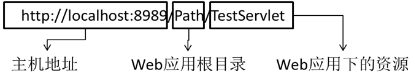
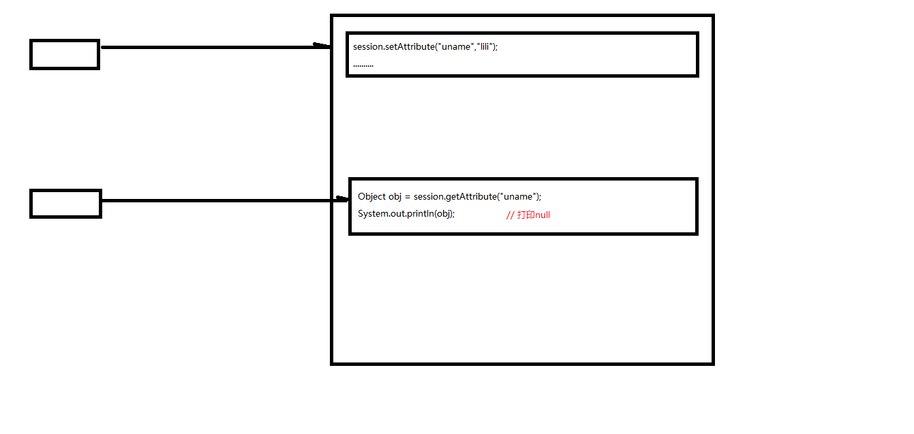
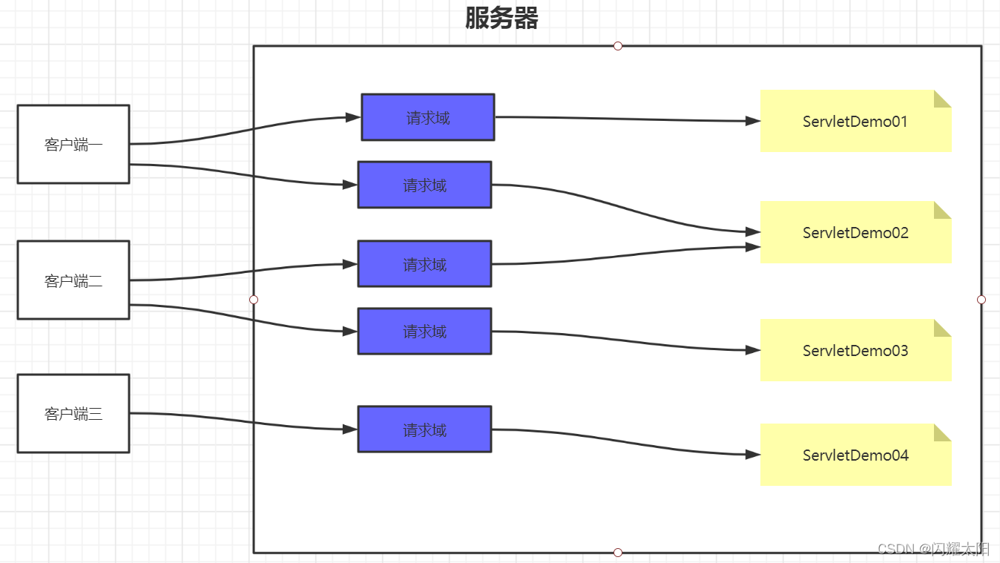

# 1 HTTP

## 1.1 报文

- 请求报文：浏览器发给服务器
- 响应报文：服务器发回给浏览器

### 1.1.1 请求报文

报文格式 (4部分)

- 请求首行（**请求行**）；
- 请求头信息（**请求头**）；
- 空行；
- 请求体；

### 1.1.2 GET请求说明
1、由于请求参数在请求首行中已经携带了，所以没有请求体，也没有请求空行
2、请求参数拼接在url地址中，地址栏可见[url?name1=value1&name2=value2]，不安全
3、由于参数在地址栏中携带，所以由大小限制[地址栏数据大小一般限制为4k]，只能携带纯文本
4、get请求参数只能上传文本数据
5、没有请求体。所以封装和解析都快，效率高， 浏览器默认提交的请求都是get请求
[比如：① 地址栏输入url地址回车，②点击超链接a ， ③ form表单默认方式…]

* 请求首行

```perl
GET /05_web_tomcat/login_success.html?username=admin&password=123213 HTTP/1.1

请求方式 	访问的服务器中的资源路径？get请求参数	协议版本
```

* 请求头

```perl
Host: localhost:8080   主机虚拟地址
Connection: keep-alive 长连接
Upgrade-Insecure-Requests: 1  请求协议的自动升级[http的请求，服务器却是https的，浏览器自动会将请求协议升级为https的]
User-Agent: Mozilla/5.0 (Windows NT 6.1; WOW64) AppleWebKit/537.36 (KHTML, like Gecko) Chrome/68.0.3440.75 Safari/537.36
- 用户系统信息
Accept:text/html,application/xhtml+xml,application/xml;q=0.9,image/webp,image/apng,*/*;q=0.8
- 浏览器支持的文件类型
Referer: http://localhost:8080/05_web_tomcat/login.html
- 当前页面的上一个页面的路径[当前页面通过哪个页面跳转过来的]：   可以通过此路径跳转回上一个页面， 广告计费，防止盗链
Accept-Encoding: gzip, deflate, br
- 浏览器支持的压缩格式
Accept-Language: zh-CN,zh;q=0.9,en-US;q=0.8,en;q=0.7
- 浏览器支持的语言
```

### 1.1.3 POST请求说明

* POST请求要求将form标签的method的属性设置为post


1、POST请求有请求体，而GET请求没有请求体。
2、post请求数据在请求体中携带，请求体数据大小没有限制，可以用来上传所有内容[文件、文本]
3、只能使用post请求上传文件
4、post请求报文多了和请求体相关的配置[请求头]
5、地址栏参数不可见，相对安全
6、post效率比get低

* 请求首行

```perl
POST /05_web_tomcat/login_success.html HTTP/1.1
```

* 请求头

```perl
Host: localhost:8080
Connection: keep-alive
Content-Length: 31 		-请求体内容的长度
Cache-Control: max-age=0  -无缓存
Origin: http://localhost:8080
Upgrade-Insecure-Requests: 1  -协议的自动升级
Content-Type: application/x-www-form-urlencoded   -请求体内容类型[服务器根据类型解析请求体参数]
User-Agent: Mozilla/5.0 (Windows NT 6.1; WOW64) AppleWebKit/537.36 (KHTML, like Gecko) Chrome/68.0.3440.75 Safari/537.36
Accept:text/html,application/xhtml+xml,application/xml;q=0.9,image/webp,image/apng,*/*;q=0.8
Referer: http://localhost:8080/05_web_tomcat/login.html
Accept-Encoding: gzip, deflate, br
Accept-Language: zh-CN,zh;q=0.9,en-US;q=0.8,en;q=0.7
Cookie:JSESSIONID-
```

* 请求空行

* 请求体：浏览器提交给服务器的内容

```perl
username=admin&password=1232131
```


### 1.1.4 响应报文

报文格式(4部分)

- 响应首行（**响应行**）；
- 响应头信息（**响应头**）；
- 空行；
- **响应体；**

#### 1.1.4.1 具体情况

**响应首行：**

```perl
HTTP/1.1 200 OK

说明：响应协议为HTTP1.1，响应状态码为200，表示请求成功； 
```

**响应头：**

```perl
Server: Apache-Coyote/1.1   服务器的版本信息
Accept-Ranges: bytes
ETag: W/"157-1534126125811"
Last-Modified: Mon, 13 Aug 2018 02:08:45 GMT
Content-Type: text/html    响应体数据的类型[浏览器根据类型解析响应体数据]
Content-Length: 157   响应体内容的字节数
Date: Mon, 13 Aug 2018 02:47:57 GMT  响应的时间，这可能会有8小时的时区差
```

- **响应空行**

- **响应空行**

```perl
<!--需要浏览器解析使用的内容[如果响应的是html页面，最终响应体内容会被浏览器显示到页面中]-->

<!DOCTYPE html>
<html>
	<head>
		<meta charset="UTF-8">
		<title>Insert title here</title>
	</head>
	<body>
		恭喜你，登录成功了...
	</body>
</html>
```

### 1.1.5 浏览器响应码

```perl
200 - 服务器成功返回网页 
404 - 请求的网页不存在 
503 - 服务不可用 
详细分解：

1xx（临时响应） 
表示临时响应并需要请求者继续执行操作的状态代码。

代码 说明 
100 （继续） 请求者应当继续提出请求。服务器返回此代码表示已收到请求的第一部分，正在等待其余部分。 
101 （切换协议） 请求者已要求服务器切换协议，服务器已确认并准备切换。

2xx （成功） 
表示成功处理了请求的状态代码。

代码 说明 
200 （成功） 服务器已成功处理了请求。通常，这表示服务器提供了请求的网页。 
201 （已创建） 请求成功并且服务器创建了新的资源。 
202 （已接受） 服务器已接受请求，但尚未处理。 
203 （非授权信息） 服务器已成功处理了请求，但返回的信息可能来自另一来源。 
204 （无内容） 服务器成功处理了请求，但没有返回任何内容。 
205 （重置内容） 服务器成功处理了请求，但没有返回任何内容。 
206 （部分内容） 服务器成功处理了部分 GET 请求。

3xx （重定向） 
表示要完成请求，需要进一步操作。 通常，这些状态代码用来重定向。

代码 说明 
300 （多种选择） 针对请求，服务器可执行多种操作。服务器可根据请求者 (user agent) 选择一项操作，或提供操作列表供请求者选择。 
301 （永久移动） 请求的网页已永久移动到新位置。服务器返回此响应（对 GET 或 HEAD 请求的响应）时，会自动将请求者转到新位置。 
302 （临时移动） 服务器目前从不同位置的网页响应请求，但请求者应继续使用原有位置来进行以后的请求。 
303 （查看其他位置） 请求者应当对不同的位置使用单独的 GET 请求来检索响应时，服务器返回此代码。 
304 （未修改） 自从上次请求后，请求的网页未修改过。服务器返回此响应时，不会返回网页内容。 
305 （使用代理） 请求者只能使用代理访问请求的网页。如果服务器返回此响应，还表示请求者应使用代理。 
307 （临时重定向） 服务器目前从不同位置的网页响应请求，但请求者应继续使用原有位置来进行以后的请求。

4xx（请求错误） 
这些状态代码表示请求可能出错，妨碍了服务器的处理。

代码 说明 
400 （错误请求） 服务器不理解请求的语法。 
401 （未授权） 请求要求身份验证。 对于需要登录的网页，服务器可能返回此响应。 
403 （禁止） 服务器拒绝请求。 
404 （未找到） 服务器找不到请求的网页。 
405 （方法禁用） 禁用请求中指定的方法。 
406 （不接受） 无法使用请求的内容特性响应请求的网页。 
407 （需要代理授权） 此状态代码与 401（未授权）类似，但指定请求者应当授权使用代理。 
408 （请求超时） 服务器等候请求时发生超时。 
409 （冲突） 服务器在完成请求时发生冲突。服务器必须在响应中包含有关冲突的信息。 
410 （已删除） 如果请求的资源已永久删除，服务器就会返回此响应。 
411 （需要有效长度） 服务器不接受不含有效内容长度标头字段的请求。 
412 （未满足前提条件） 服务器未满足请求者在请求中设置的其中一个前提条件。 
413 （请求实体过大） 服务器无法处理请求，因为请求实体过大，超出服务器的处理能力。 
414 （请求的 URI 过长） 请求的 URI（通常为网址）过长，服务器无法处理。 
415 （不支持的媒体类型） 请求的格式不受请求页面的支持。 
416 （请求范围不符合要求） 如果页面无法提供请求的范围，则服务器会返回此状态代码。 
417 （未满足期望值） 服务器未满足”期望”请求标头字段的要求。

5xx（服务器错误） 
这些状态代码表示服务器在尝试处理请求时发生内部错误。 这些错误可能是服务器本身的错误，而不是请求出错。

代码 说明 
500 （服务器内部错误） 服务器遇到错误，无法完成请求。 
501 （尚未实施） 服务器不具备完成请求的功能。例如，服务器无法识别请求方法时可能会返回此代码。 
502 （错误网关） 服务器作为网关或代理，从上游服务器收到无效响应。 
503 （服务不可用） 服务器目前无法使用（由于超载或停机维护）。通常，这只是暂时状态。 
504 （网关超时） 服务器作为网关或代理，但是没有及时从上游服务器收到请求。 
505 （HTTP 版本不受支持） 服务器不支持请求中所用的 HTTP 协议版本。

HttpWatch状态码Result is

200 - 服务器成功返回网页，客户端请求已成功。 
302 - 对象临时移动。服务器目前从不同位置的网页响应请求，但请求者应继续使用原有位置来进行以后的请求。 
304 - 属于重定向。自上次请求后，请求的网页未修改过。服务器返回此响应时，不会返回网页内容。 
401 - 未授权。请求要求身份验证。 对于需要登录的网页，服务器可能返回此响应。 
404 - 未找到。服务器找不到请求的网页。 
2xx - 成功。表示服务器成功地接受了客户端请求。 
3xx - 重定向。表示要完成请求，需要进一步操作。客户端浏览器必须采取更多操作来实现请求。例如，浏览器可能不得不请求服务器上的不同的页面，或通过代理服务器重复该请求。 
4xx - 请求错误。这些状态代码表示请求可能出错，妨碍了服务器的处理。 
5xx - 服务器错误。表示服务器在尝试处理请求时发生内部错误。 这些错误可能是服务器本身的错误，而不是请求出错。

```

# 2 Servlet

## 2.1 什么是Servlet
Servlet（Server Applet）是Java Servlet的简称，称为小服务程序或服务连接器，用Java编写的服务器端程序，具有独立于平台和协议的特性，主要功能在于交互式地浏览和生成数据，生成动态Web内容。 是java实现前后端交互的主要机制.

## 2.2 Servlet工作的原理

* 客户端发起http请求

* Servlet机制接收用户请求,并且交给后端业务进行处理

* 业务层根据逻辑实现数据CURD操作


### 2.2.1 Servlet的继承关系 - 重点查看的是<font color = red>服务方法（service()）</font>

#### 2.2.1.1 继承关系

```java
javax.servlet.Servlet接口
  javax.servlet.GenericServlet抽象类
  	javax.servlet.http.HttpServlet抽象子类
```

#### 2.2.1.2 相关方法

```java
javax.servlet.Servlet接口:
void init(config) - 初始化方法
void service(request,response) - 服务方法
void destory() - 销毁方法

  javax.servlet.GenericServlet抽象类：
void service(request,response) - 仍然是抽象的

  javax.servlet.http.HttpServlet 抽象子类：
    void service(request,response) - 不是抽象的
    1. String method = req.getMethod(); 获取请求的方式
        2. 各种if判断，根据请求方式不同，决定去调用不同的do方法
        if (method.equals("GET")) {
            this.doGet(req,resp);
        } else if (method.equals("HEAD")) {
            this.doHead(req, resp);
        } else if (method.equals("POST")) {
            this.doPost(req, resp);
        } else if (method.equals("PUT")) {
        3. 在HttpServlet这个抽象类中，do方法都差不多:
        protected void doGet(HttpServletRequest req, HttpServletResponse resp) throws ServletException, IOException {
        String protocol = req.getProtocol();
        String msg = lStrings.getString("http.method_get_not_supported");
        if (protocol.endsWith("1.1")) {
            resp.sendError(405, msg);
        } else {
            resp.sendError(400, msg);
        }
        }
```

#### 2.2.1.3 小结

1) 继承关系： HttpServlet -> GenericServlet -> Servlet
2) Servlet中的核心方法： init() , service() , destroy()

<font color=red>
3) 服务方法： 当有请求过来时，service方法会自动响应（其实是tomcat容器调用的）
        在HttpServlet中我们会去分析请求的方式：到底是get、post、head还是delete等等
        然后再决定调用的是哪个do开头的方法
        那么在HttpServlet中这些do方法默认都是405的实现风格-要我们子类去实现对应的方法，否则默认会报405错误</font>
4) 因此，我们在新建Servlet时，我们才会去考虑请求方法，从而决定重写哪个do方法

## 2.3 Servlet作用

- 接收请求 【解析请求报文中的数据：请求参数】
- 处理请求 【DAO和数据库交互】
- 完成响应 【设置响应报文】


## 2.4 servlet的生命周期

```perl
1） 生命周期：从出生到死亡的过程就是生命周期。对应Servlet中的三个方法：init(),service(),destroy()
2） 通过案例我们发现：
    - Servlet实例tomcat只会创建一个，所有的请求都是这个实例去响应。
    - 默认情况下，第一次请求时，tomcat才会去实例化，初始化，然后再服务.这样的好处是什么？ 提高系统的启动速度 。 这样的缺点是什么？ 第一次请求时，耗时较长。
    - 因此得出结论： 如果需要提高系统的启动速度，当前默认情况就是这样。如果需要提高响应速度，我们应该设置Servlet的初始化时机。
3） Servlet的初始化时机：
    - 默认是第一次接收请求时，实例化，初始化
    - 我们可以通过<load-on-startup>来设置servlet启动的先后顺序,数字越小，启动越靠前，最小值0
4） Servlet在容器中是：单例的、线程不安全的
    - 单例：所有的请求都是同一个实例去响应
    - 线程不安全：一个线程需要根据这个实例中的某个成员变量值去做逻辑判断。但是在中间某个时机，另一个线程改变了这个成员变量的值，从而导致第一个线程的执行路径发生了变化
    - 我们已经知道了servlet是线程不安全的，给我们的启发是： 尽量的不要在servlet中定义成员变量。如果不得不定义成员变量，那么不要去：①不要去修改成员变量的值 ②不要去根据成员变量的值做一些逻辑判断
```

### 2.4.1 Servlet请求过程

- 第一次请求
  - 调用构造器，创建对象
  - 执行init()方法
  - 执行service()方法
- 后面请求
  - 执行service()方法
- 对象销毁前
  - 执行destroy()方法

### 2.4.2 Servlet的使用

#### 2.4.2.1 GenericServlet

说明: 使用GenericServlet 只需要编辑service() 方法即可

```java
public class MyServlet extends GenericServlet {

    @Override
    public void service(ServletRequest servletRequest, ServletResponse servletResponse) throws ServletException, IOException {
        System.out.println("使用GenericServlet实现业务调用");
    }
}
```

#### 2.4.2.1 HttpServlet

说明: 使用HttpServlet只需要专注GET/POST请求即可

```java
public class MyServlet2 extends HttpServlet {

    @Override
    protected void doGet(HttpServletRequest req, HttpServletResponse resp) throws ServletException, IOException {
        super.doGet(req, resp);
        System.out.println("这里是get提交");
    }

    @Override
    protected void doPost(HttpServletRequest req, HttpServletResponse resp) throws ServletException, IOException {
        super.doPost(req, resp);
        System.out.println("这里是post提交");
    }
}
```

### 2.4.3 Servlet中接口调用

#### 2.4.3.1 ServletConfig接口

说明: 每个Servlet都有各自的ServletConfig对象

* **ServletConfig接口封装了Servlet配置信息**，这一点从接口的名称上就能够看出来。
* **每一个Servlet都有一个唯一对应的ServletConfig对象**，代表当前Servlet的配置信息。
* 对象由Servlet容器创建，并传入生命周期方法init(ServletConfig config)中。可以直接获取使用。
* 代表当前Web应用的ServletContext对象也封装到了ServletConfig对象中，使ServletConfig对象成为了获取ServletContext对象的一座桥梁。
* ServletConfig对象的主要功能
  * **获取Servlet名称：getServletName()**
  * **获取全局上下文ServletContext对象：getServletContext()**
  * **获取Servlet初始化参数：getInitParameter(String) / getInitParameterNames()。**

```java
@Override
    public void init(ServletConfig servletConfig) throws ServletException {
        System.out.println("第二步: 定义初始化init方法");
        /*1.通过servletConfig对象获取配置文件信息*/
        String servletName = servletConfig.getServletName();
        /*2.通过servlet获取上下文信息*/
        ServletContext servletContext = servletConfig.getServletContext();
        /*3.获取初始化参数的值*/
        String initValue = servletConfig.getInitParameter("springmvc");
        Enumeration  enumeration = servletConfig.getInitParameterNames();
        while (enumeration.hasMoreElements()){
            System.out.println("获取多个初始化名称:"+enumeration.nextElement());
        }
        System.out.println("获取servlet名称:"+servletName);
        System.out.println("获取上下文信息:"+servletContext);
        System.out.println("获取初始化参数:"+initValue);

    }
```

#### 2.4.3.2 ServletContext接口

- Web容器在启动时，它会为**每个Web应用程序都创建一个唯一对应的ServletContext对象**，意思是Servlet上下文，**代表当前Web应用。**

- 由于**一个Web应用程序中的所有Servlet都共享同一个ServletContext对象**，所以ServletContext对象也被称为 application 对象（Web应用程序对象）。

- **对象由Servlet容器在项目启动时创建**，通过ServletConfig对象的getServletContext()方法获取。在项目卸载时销毁。

- ServletContext对象的主要功能

  ① 获取项目的上下文路径(带/的项目名): **getContextPath()**

  ```java
  @Override
  public void init(ServletConfig config) throws ServletException {
  	ServletContext application = config.getServletContext();
  	System.out.println("全局上下文对象："+application);
  	String path = application.getContextPath();
  	System.out.println("全局上下文路径："+path);// /06_Web_Servlet
  }
  ```

  ② 获取虚拟路径所映射的本地真实路径：**getRealPath(String path)**

  - 虚拟路径：浏览器访问Web应用中资源时所使用的路径。
  - 本地路径：资源在文件系统中的实际保存路径。
  - 作用：将用户上传的文件通过流写入到服务器硬盘中。

  ```java
  @Override
  public void init(ServletConfig config) throws ServletException {
  	//1.获取ServletContext对象
  	ServletContext context = config.getServletContext();
  	//2.获取index.html的本地路径
  	//index.html的虚拟路径是“/index.html”,其中“/”表示当前Web应用的根目录，
  	//即WebContent目录
  	String realPath = context.getRealPath("/index.html");
  	//realPath=D:\DevWorkSpace\MyWorkSpace\.metadata\.plugins\
  	//org.eclipse.wst.server.core\tmp0\wtpwebapps\MyServlet\index.html
  	System.out.println("realPath="+realPath);
  }
  ```

  ③ 获取WEB应用程序的全局初始化参数（基本不用）

  * 设置Web应用初始化参数的方式是在web.xml的根标签下加入如下代码

  ```xml
  <web-app>
  	<!-- Web应用初始化参数 -->
  	<context-param>
  		<param-name>ParamName</param-name>
  		<param-value>ParamValue</param-value>
  	</context-param>
  </web-app>
  ```

  * 获取Web应用初始化参数

  ```java
  @Override
  public void init(ServletConfig config) throws ServletException {
  	//1.获取ServletContext对象
  	ServletContext application = config.getServletContext();
  	//2.获取Web应用初始化参数
  	String paramValue = application.getInitParameter("ParamName");
  	System.out.println("全局初始化参数paramValue="+paramValue);
  }
  ```

  ④ 作为域对象共享数据

  * 作为最大的域对象在整个项目的不同web资源内共享数据。
    - setAttribute(key,value)：以后可以在任意位置取出并使用
    - getAttribute(key)：取出设置的value值

## 2.5 HttpServletRequest接口

### 2.5.1 HttpServletRequest介绍

* 该接口是ServletRequest接口的子接口，封装了HTTP请求的相关信息。
* 浏览器请求服务器时会封装请求报文交给服务器，服务器接受到请求会将请求报文解析生成request对象。
* 由Servlet容器创建其实现类对象并传入service(HttpServletRequest req, HttpServletResponse res)方法中。
* 以下我们所说的HttpServletRequest对象指的是容器提供的HttpServletRequest实现类对象。

### 2.5.2 获取请求参数

- 什么是请求参数？
- 请求参数就是浏览器向服务器提交的数据。
- 浏览器向服务器如何发送数据？

① 附在url后面(和get请求一致，拼接的形式就行请求数据的绑定)，如：
http://localhost:8080/MyServlet/MyHttpServlet?userId=20

② 通过表单提交

```html
<form action="MyHttpServlet" method="post">
	你喜欢的足球队<br /><br />
	巴西<input type="checkbox" name="soccerTeam" value="Brazil" />
	德国<input type="checkbox" name="soccerTeam" value="German" />
	荷兰<input type="checkbox" name="soccerTeam" value="Holland" />
	<input type="submit" value="提交" />
</form>
```

* 使用HttpServletRequest对象获取请求参数

```java
//一个name对应一个值
String userId = request.getParameter("userId");
```

```java
//一个name对应一组值
String[] soccerTeams = request.getParameterValues("soccerTeam");
for(int i = 0; i < soccerTeams.length; i++){
	System.out.println("team "+i+"="+soccerTeams[i]);
}
```

### 2.5.3 获取url地址参数

```java
String path = request.getContextPath();//重要
System.out.println("上下文路径："+path);
System.out.println("端口号："+request.getServerPort());
System.out.println("主机名："+request.getServerName());
System.out.println("协议："+request.getScheme());
```

### 2.5.4 获取请求头信息

```java
String header = request.getHeader("User-Agent");
System.out.println("user-agent:"+header);
String referer = request.getHeader("Referer");
System.out.println("上个页面的地址："+referer);//登录失败，返回登录页面让用户继续登录
```

### 2.5.5 请求的转发

将请求转发给另外一个URL地址

```java
//获取请求转发对象
RequestDispatcher dispatcher = request.getRequestDispatcher("success.html");
dispatcher.forward(request, response);//发起转发
```

### 2.5.6 向请求域中保存数据

```java
//将数据保存到request对象的属性域中
request.setAttribute("attrName", "attrValueInRequest");
//两个Servlet要想共享request对象中的数据，必须是转发的关系
request.getRequestDispatcher("/ReceiveServlet").forward(request, response);
```

```java
//从request属性域中获取数据
Object attribute = request.getAttribute("attrName");
System.out.println("attrValue="+attribute);
```

## 2.6 HttpServletResponse接口

### 2.6.1 HttpServletResponse介绍

* 该接口是ServletResponse接口的子接口，封装了服务器针对于HTTP响应的相关信息。(暂时只有服务器的配置信息，没有具体的和响应体相关的内容)

* 由Servlet容器创建其实现类对象，并传入service(HttpServletRequest req, HttpServletResponse res)方法中。

* 后面我们所说的HttpServletResponse对象指的是容器提供的HttpServletResponse实现类对象。

HttpServletResponse对象的主要功能有：

### 2.6.2 使用PrintWriter对象向浏览器输出数据

```java
//通过PrintWriter对象向浏览器端发送响应信息
PrintWriter writer = res.getWriter();
writer.write("Servlet response");
writer.close();
```

- 写出的数据可以是页面、页面片段、字符串等
- 当写出的数据包含中文时，浏览器接收到的响应数据就可能有乱码。为了避免乱码，可以使用Response对象在向浏览器输出数据前设置响应头。

### 2.6.3 设置响应头

- 响应头就是浏览器解析页面的配置。比如：告诉浏览器使用哪种编码和文件格式解析响应体内容

```java
response.setHeader("Content-Type", "text/html;charset=UTF-8");
```

* 设置好以后，会在浏览器的响应报文中看到设置的响应头中的信息。

### 2.6.4 重定向请求

- 实现请求重定向，
- 举例：用户从login.html页面提交登录请求数据给LoginServlet处理。如果账号密码正确，需要让用户跳转到成功页面，通过servlet向响应体中写入成功页面过于复杂，通过重定向将成功页面的地址交给浏览器并设置响应状态码为302，浏览器会自动进行跳转。

```java
//注意路径问题，加上/会失败，会以主机地址为起始，重定向一般需要加上项目名
response.sendRedirect(“success.html”);
```

## 2.7  请求的转发

### 2.7.1 转发和重定向说明

请求的转发与重定向是web应用页面跳转的主要手段，在Web应用中使用非常广泛。所以我们一定要搞清楚他们的区别。


### 2.7.2 请求的转发


* 第一个Servlet接收到了浏览器端的请求，进行了一定的处理，然后没有立即对请求进行响应，而是将请求“交给下一个Servlet”继续处理，下一个Servlet处理完成之后对浏览器进行了响应。**在服务器内部将请求“交给”其它组件继续处理就是请求的转发。**对浏览器来说，一共只发了一次请求，服务器内部进行的“转发”浏览器感觉不到，同时浏览器地址栏中的地址不会变成“下一个Servlet”的虚拟路径。
* HttpServletRequest代表HTTP请求，对象由Servlet容器创建。转发的情况下，两个Servlet可以共享同一个Request对象中保存的数据。
* 当需要将后台获取的数据传送到JSP上显示的时候，就可以先将数据存放到Request对象中，再转发到JSP从属性域中获取。此时由于是“转发”，所以它们二者共享Request对象中的数据。
* 转发的情况下，可以访问WEB-INF下的资源。
* **转发以“/”开始表示项目根路径，重定向以”/”开始表示主机地址。**
* 功能：
  - 获取请求参数
  - 获取请求路径即URL地址相关信息
  - 在请求域中保存数据
  - 转发请求
* 代码举例

```java
	@Override
    protected void doPost(HttpServletRequest request, HttpServletResponse response) throws ServletException, IOException {
        //1.获取用户的参数
        int id = Integer.valueOf(request.getParameter("id"));
        String name = request.getParameter("name");
        System.out.println(id+"|"+name);
        //2.利用request域保存数据
        request.setAttribute("key","UUID密钥");

        //3.将请求转发给 twoServlet
        request.getRequestDispatcher("/twoServlet").forward(request,response);
    }
```

## 2.8 重定向


* 第一个Servlet接收到了浏览器端的请求，进行了一定的处理，然后给浏览器一个特殊的响应消息，这个特殊的响应消息会通知浏览器去访问另外一个资源，这个动作是服务器和浏览器自动完成的。**整个过程中浏览器端会发出两次请求**，且在**浏览器地址栏里面能够看到地址的改变**，改变为下一个资源的地址。

* 重定向的情况下，原Servlet和目标资源之间就不能共享请求域数据了。
* HttpServletResponse代表HTTP响应，对象由Servlet容器创建。
* 功能：
  * 向浏览器输出数据
  * 重定向请求
* 重定向的响应报文的头

```perl
HTTP/1.1 302 Found
Location: success.html
```

* 应用：

  * 用户从login.html页面提交登录请求数据给LoginServlet处理。

  如果账号密码正确，需要让用户跳转到成功页面，通过servlet向响应体中写入成功页面过于复杂，通过重定向将成功页面的地址交给浏览器并设置响应状态码为302，浏览器会自动进行跳转

* 代码举例：

```java
 @Override
    protected void doPost(HttpServletRequest request, HttpServletResponse response) throws ServletException, IOException {
        //1.从转发来的请求获取数据
        String id = request.getParameter("id");
        String name = request.getParameter("name");
        System.out.println("跳转到第二个Servlet|"+id+"|"+name);

        //2.从域中获取数据
        String msg = (String) request.getAttribute("key");
        System.out.println("打印域中的数据:"+msg);
        //将域中的数据清除
        request.removeAttribute("key");

        //3.重定向到成功页面
        response.sendRedirect("success.html");
    }
```

## 2.9 对比请求的转发与重定向

|                         | 转发                             | 重定向                                              |
| ----------------------- | -------------------------------- | --------------------------------------------------- |
| 浏览器感知              | 在服务器内部完成，浏览器感知不到 | 服务器以302状态码通知浏览器访问新地址，浏览器有感知 |
| 浏览器地址栏            | 不改变                           | 改变                                                |
| 整个过程发送请求次数    | 一次                             | 两次                                                |
| 能否共享request对象数据 | 能                               | 否                                                  |
| WEB-INF下的资源         | 能访问                           | 不能访问                                            |
| 目标资源                | 必须是当前web应用中的资源        | 不局限于当前web应用                                 |

## 2.10 Web应用路径设置

### 2.10.1 url的概念

url是`uniform Resource Locater`的简写，中文翻译为`统一资源定位符`，它是某个互联网资源的唯一访问地址，客户端可以通过url访问到具体的互联网资源
完整的url构成如下图：



uri是`统一资源标志符(Uniform Resource Identifier， URI)` 表示的是web上每一种可用的资源 只包含上图中的path/TestServlet 不包含服务器地址

**相对路径和绝对路径**

**相对路径：虚拟路径如果不以“/”开始，就是相对路径**，浏览器会以当前资源所在的虚拟路径为基准对相对路径进行解析，从而生成最终的访问路径。此时如果通过转发进入其他目录，再使用相对路径访问资源就会出错。所以为了防止路径出错，我们经常将相对路径转化为绝对路径的形式进行请求。

**绝对路径：虚拟路径以“/”开始，就是绝对路径。**

**① 在服务器端**：虚拟路径最开始的“/”表示当前Web应用的根目录。只要是服务端解析的绝对路径，都是以web根目录为起始的。由服务器解析的路径包括：<1> web.xml的配置路径、<2>request转发的路径。

**② 在浏览器端**：虚拟路径最开始的“/”表示当前主机地址。
例如：链接地址“/Path/dir/b.html”经过浏览器解析后为：
相当于http://localhost:8989/Path/dir/b.html
由浏览器解析的路径包括：

<1>重定向操作：response.sendRedirect(“/xxx”)
<2>所有HTML标签：<a href=“/xxx”> 、<form action=“/xxx”> 、link、img、script等
这些最后的访问路径都是 http://localhost:8989/xxx

所以我们可以看出，如果是浏览器解析的路径，我们必须加上项目名称才可以正确的指向资源。

http://localhost:8989/Path/xxx
<1>重定向操作：

```java
response.sendRedirect(request.getContextPath()+"/xxx");
```

<2>所有HTML标签：<a href="/项目名/xxx">； <form action=“/项目名/xxx">

- 在浏览器端，除了使用绝对路径之外，我们还可以使用base标签+相对路径的方式来确定资源的访问有效。
- base标签影响当前页面中的所有相对路径，不会影响绝对路径。相当于给相对路径设置了一个基准地址。
- 习惯上在html的标签内，声明：

```html
<!-- 给页面中的相对路径设置基准地址 -->
<base href="http://localhost:8080/Test_Path/"/>
```

接着html中的路径就可以使用相对路径的方式来访问。比如：

```html
<h4> base+相对路径</h4>
<!-- <base href="http://localhost:8080/Test_Path/"/> -->
<a href="1.html">1.html</a><br/>
<a href="a/3.html">a/3.html</a><br/>
<!-- servlet映射到了项目根目录下，可以直接访问 -->
<a href="PathServlet">PathServlet</a><br/>
```


## 2.11 关于域的说明

 **保存作用域**

```perl
原始情况下，保存作用域我们可以认为有四个： 
page（页面级别，现在几乎不用）,
request（一次请求响应范围） , 
session（一次会话范围） , 
application（整个应用程序范围）
```

### 2.11.1 请求域(Request域)

在请求转发的场景下，我们可以借助HttpServletRequest对象内部给我们提供的存储空间，帮助我们携带数据，把数据发送给转发的目标资源。

请求域：HttpServletRequest对象内部给我们提供的存储空间
总结: 在同一个请求中实现数据共享


**request：一次请求响应范围**

```java
//演示request保存作用域
@WebServlet("/test1")
public class ServletTest01 extends HttpServlet {
    @Override
    protected void service(HttpServletRequest request, HttpServletResponse response) throws ServletException, IOException {
        //1.向request保存作用域保存数据
        request.setAttribute("name","lisa");
        //2.客户端重定向(request范围外)
        //response.sendedirect("test2");
        //3.服务器端转发(request范围内)
        request.getRequestDispatcher("test2").forward(request, response);
    }
}

@WebServlet("/test2")
public class ServletTest02 extends HttpServlet {
    @Override
    protected void service(HttpServletRequest request, HttpServletResponse response) throws ServletException, IOException {
        //1.获取request保存的作用域保存的数据
        Object name = request.getAttribute("name");
        System.out.println(name);
    }
}
```


### 2.11.2 会话域(Session域)

说明: 在同一个会话下,可以发起多个交互, 在同一个会话下实现数据共享,==只要不换浏览器就可以访问到==


**session：一次会话范围有效**

```java
//演示session保存作用域
@WebServlet("/test3")
public class ServletTest03 extends HttpServlet {
    @Override
    protected void service(HttpServletRequest request, HttpServletResponse response) throws ServletException, IOException {
        //1.向request保存作用域保存数据
        request.getSession().setAttribute("name","lisa");
        //2.客户端重定向(session范围内)
        response.sendRedirect("test4");
        //3.服务器端转发(session范围内)
        //request.getRequestDispatcher("test2").forward(request, response);
    }
}

@WebServlet("/test4")
public class ServletTest04 extends HttpServlet {
    @Override
    protected void service(HttpServletRequest request, HttpServletResponse response) throws ServletException, IOException {
        //1.获取session保存的作用域保存的数据
        Object name = request.getSession().getAttribute("name");
        System.out.println(name);
    }
}
```



### 2.11.3 应用域(Application域)

说明: 在同一个tocmat服务器中实现数据共享,不关闭tomcat就能访问到

**application： 一次应用程序范围有效**

```java
//演示application保存作用域
@WebServlet("/test5")
public class ServletTest05 extends HttpServlet {
    @Override
    protected void service(HttpServletRequest request, HttpServletResponse response) throws ServletException, IOException {
        //1.向application保存作用域保存数据
        //ServletContext: Servlet上下文
        ServletContext application = request.getServletContext();
        application.setAttribute("name","lisa");
        //2.客户端重定向(application范围内)
        response.sendRedirect("test6");
        //3.服务器端转发(application范围内)
        //request.getRequestDispatcher("test2").forward(request, response);
    }
}

@WebServlet("/test6")
public class ServletTest06 extends HttpServlet {
    @Override
    protected void service(HttpServletRequest request, HttpServletResponse response) throws ServletException, IOException {
        //1.获取application保存的作用域保存的数据
        ServletContext application = request.getServletContext();
        Object name = application.getAttribute("name");
        System.out.println(name);
    }
}

```


# 3 会话技术

## 3.1 为什么需要会话控制
保持用户登录状态，就是当用户在登录之后，会在服务器中保存该用户的登录状态，当该用户后续访问该项目中的其它动态资源(Servlet或者Thymeleaf)的时候，能够判断当前是否是已经登录过的。而从用户登录到用户退出登录这个过程中所发生的所有请求，其实都是在一次会话范围之内

## 3.2 域对象的范围
### 3.2.1 请求域的范围

每一次请求都有一个请求域对象，当请求结束的时候对应的请求域对象也就销毁了



### 3.2.2 会话域的范围

会话域(打开一个浏览器窗口)是从客户端连接上服务器开始，一直到客户端关闭，这一整个过程中发生的所有请求都在同一个会话域中；而不同的客户端是不能共用会话域的


### 3.2.3 应用域的范围

整个项目部署之后，只会有一个应用域对象，所有客户端都是共同访问同一个应用域对象，在该项目的所有动态资源中也是共用一个应用域对象. 所以在应用域中的数据,所有的项目共享


## 3.3 Cookie技术

### 3.3.1 Cookie的概念

Cookie，有时也用其复数形式 Cookies。类型为“小型文本文件”，是某些网站为了辨别用户身份，进行Session跟踪而储存在用户本地终端上的数据（通常经过加密），由用户客户端计算机暂时或永久保存的信息.
Cookie是一种客户端的会话技术,它是服务器存放在浏览器的一小份数据,浏览器以后每次访问该服务器的时候都会将这小份数据携带到服务器去。

### 3.3.2 Cookie的特点

* 在浏览器中存放数据
* 将浏览器中存放的数据携带到服务器
* Cookie是一段不超过4KB的小型文本数据，由一个名称（Name）、一个值（Value）和其它几个用于控制Cookie有效期、安全性、使用范围的可选属性组成。

### 3.3.3 Cookie的应用场景

* 记住用户名

  当我们在用户名的输入框中输入完用户名后,浏览器记录用户名,下一次再访问登录页面时,用户名自动填充到用户名的输入框

* 保存电影的播放进度

  在网页上播放电影的时候,如果中途退出浏览器了,下载再打开浏览器播放同一部电影的时候,会自动跳转到上次退出时候的进度,因为在播放的时候会将播放进度保存到cookie中

### 3.3.4 Cookie的时效性

如果我们不设置Cookie的时效性，默认情况下Cookie的有效期是一次会话范围内，我们可以通过cookie的setMaxAge()方法让Cookie持久化保存到浏览器上

- 会话级Cookie
  - 服务器端并没有明确指定Cookie的存在时间
  - 在浏览器端，Cookie数据存在于内存中
  - 只要浏览器还开着，Cookie数据就一直都在
  - 浏览器关闭，内存中的Cookie数据就会被释放

- 持久化Cookie
  - 服务器端明确设置了Cookie的存在时间
  - 在浏览器端，Cookie数据会被保存到硬盘上
  - Cookie在硬盘上存在的时间根据服务器端限定的时间来管控，不受浏览器关闭的影响
  - 持久化Cookie到达了预设的时间会被释放

`cookie.setMaxAge(int expiry)`参数单位是秒，表示cookie的持久化时间，如果设置参数为0，表示将浏览器中保存的该cookie删除

### 3.3.5 关于Cookie使用API说明

```java
public class CookieServlet extends BaseServlet {

    /**
     * 实现Cookie添加操作
     */
    protected void addCookie(HttpServletRequest request, HttpServletResponse response) throws ServletException, IOException {
        response.setContentType("text/html;charset=utf-8");
        //1.设定Cookie的数据
        Cookie cookie1 = new Cookie("key1", "密钥信息1");
        Cookie cookie2 = new Cookie("key2", "密钥信息2");

        //2.设定Cookie的有效期  单位是秒
        cookie2.setMaxAge(10);

        //3.设定Cookie有效路径  表示请求 /项目名称/aaa时才会携带该Cookie
        cookie2.setPath(request.getContextPath()+"/aaa");

        //4.设定Cookie 在哪个域名有效
        cookie2.setDomain("www.baidu.com");

        response.addCookie(cookie1);
        response.addCookie(cookie2);
        //给出响应
        response.getWriter().write("Cookie添加成功!!!");
    }


    protected void getCookie(HttpServletRequest request, HttpServletResponse response) throws ServletException, IOException {

        Cookie[] cookies = request.getCookies();
        if(cookies !=null && cookies.length>0){
            for (Cookie cookie : cookies){
                String name = cookie.getName();
                String value = cookie.getValue();
                System.out.println(name+":"+value);
            }
        }
        //response.sendRedirect(request.getContextPath()+"/index.html");
        request.getRequestDispatcher("index.html").forward(request,response);
    }
}
```

### 3.3.6 浏览器检查Cookie

说明: 通过F12 开发工具打开浏览器 可以检查cookie的相关信息


## 3.4 Session技术

### 3.4.1 Session概述

==sessionID绑定浏览器==

session是服务器端的技术。服务器为每一个浏览器开辟一块内存空间，即session对象。由于session对象是每一个浏览器特有的，所以用户的记录可以存放在session对象中

    - HTTP 无状态 ：服务器无法判断这两次请求是同一个客户端发过来的，还是不同的客户端发过来的
        - 无状态带来的现实问题：第一次请求是添加商品到购物车，第二次请求是结账；如果这两次请求服务器无法区分是同一个用户的，那么就会导致混乱
        - 通过会话跟踪技术来解决无状态的问题。

* 会话跟踪技术

  * 客户端第一次发请求给服务器，服务器获取session，获取不到，则创建新的，然后响应给客户端

  * 下次客户端给服务器发请求时，会把sessionID带给服务器，那么服务器就能获取到了，那么服务器就判断这一次请求和上次某次请求是同一个客户端，从而能够区分开客户端
  * 常用的API：

  ```perl
        request.getSession() -> 获取当前的会话，没有则创建一个新的会话
        request.getSession(true) -> 效果和不带参数相同
        request.getSession(false) -> 获取当前会话，没有则返回null，不会创建新的
  
        session.getId() -> 获取sessionID
        session.isNew() -> 判断当前session是否是新的
        session.getMaxInactiveInterval() -> session的非激活间隔时长，默认1800秒
        session.setMaxInactiveInterval()
        session.invalidate() -> 强制性让会话立即失效
        ....
  ```

### 3.4.2 Session的API介绍

* request.getSession(); 获得session(==第一次调用时创建session,之后通过sessionId找到session进行使用==)
* Object getAttribute(String name) ;获取值
* void setAttribute(String name, Object value) ;存储值
* void removeAttribute(String name) ;移除值

### 3.4.3 Session的代码

```java
import javax.servlet.*;
import javax.servlet.http.*;
import java.io.IOException;

public class SessionServlet extends BaseServlet {

    //1.添加Session
    protected void addSession(HttpServletRequest request, HttpServletResponse response) throws ServletException, IOException {
        HttpSession session = request.getSession();
        session.setAttribute("name","Session数据");
        response.sendRedirect(request.getContextPath()+"/index.html");
    }

    //2.获取Session
    protected void getSession(HttpServletRequest request, HttpServletResponse response) throws ServletException, IOException {
        HttpSession session = request.getSession();
        System.out.println(session.getAttribute("name"));
    }

    //3.移除Session数据
    protected void removeSession(HttpServletRequest request, HttpServletResponse response) throws ServletException, IOException {
        HttpSession session = request.getSession();
        session.removeAttribute("name");
        response.sendRedirect(request.getContextPath()+"/index.html");
    }
}
```

# 4 Filter

## 4.1 Filter的概念
Filter：一个实现了特殊接口(Filter)的Java类. 实现对请求资源(jsp,servlet,html,)的过滤的功能. 过滤器是一个运行在服务器的程序, 优先于请求资源(Servlet或者jsp,html)之前执行. 过滤器是javaweb技术中最为实用的技术之一

## 4.2 Filter的作用
Filter的作用是对目标资源(Servlet,jsp)进行过滤，其应用场景有: 登录权限检查,解决网站乱码,过滤敏感字符等等

## 4.3 Filter的生命周期和生命周期方法

| **生命周期阶段** | **执行时机**     | **生命周期方法**                         |
| ---------------- | ---------------- | ---------------------------------------- |
| 创建对象         | Web应用启动时    | init方法，通常在该方法中做初始化工作     |
| 拦截请求         | 接收到匹配的请求 | doFilter方法，通常在该方法中执行拦截过滤 |
| 销毁             | Web应用卸载前    | destroy方法，通常在该方法中执行资源释放  |

## 4.4 过滤器匹配规则

### 4.4.1 过滤器匹配的目的

过滤器匹配的目的是指定当前过滤器要拦截哪些资源

### 4.4.2 四种匹配规则

#### 4.4.2.1 精确匹配

指定被拦截资源的完整路径：拦截映射路径为`/demo01`的资源

```xml
<!-- 配置Filter要拦截的目标资源 -->
<filter-mapping>
    <!-- 指定这个mapping对应的Filter名称 -->
    <filter-name>FilterDemo01</filter-name>

    <!-- 通过请求地址模式来设置要拦截的资源 -->
    <url-pattern>/demo01</url-pattern>
</filter-mapping>
```

#### 4.4.2.2 模糊匹配

相比较精确匹配，使用模糊匹配可以让我们创建一个Filter就能够覆盖很多目标资源，不必专门为每一个目标资源都创建Filter，提高开发效率。

在我们配置了url-pattern为/user/*之后，请求地址只要是/user开头的那么就会被匹配。

**极端情况：/*匹配所有请求**

```xml
<filter-mapping>
    <filter-name>Target02Filter</filter-name>

    <!-- 模糊匹配：前杠后星 -->
    <!--
        /user/demo01
        /user/demo02
        /user/demo03
		/demo04
    -->
    <url-pattern>/user/*</url-pattern>
</filter-mapping>

```

#### 4.4.2.3 扩展名匹配

拦截所有以`.png`结尾的请求

```xml
<filter>
    <filter-name>Target04Filter</filter-name>
    <filter-class>com.atguigu.filter.filter.Target04Filter</filter-class>
</filter>
<filter-mapping>
    <filter-name>Target04Filter</filter-name>
    <url-pattern>*.png</url-pattern>
</filter-mapping>
```

## 4.5 过滤器链

### 4.5.1 过滤链的概念

一个请求可能被多个过滤器所过滤，只有当所有过滤器都放行，请求才能到达目标资源，如果有某一个过滤器没有放行，那么请求则无法到达后续过滤器以及目标资源，多个过滤器组成的链路就是过滤器链


### 4.5.2 过滤器链的顺序

过滤器链中每一个Filter执行的顺序是由**web.xml中filter-mapping配置的顺序决定**的。如果某个Filter是使用ServletName进行匹配规则的配置，那么这个Filter执行的优先级要更低

### 4.5.3 过滤器链案例

1) Filter也属于Servlet规范
2) Filter开发步骤：新建类实现Filter接口，然后实现其中的三个方法：init、doFilter、destroy
配置Filter，可以用注解@WebFilter，也可以使用xml文件 <filter> <filter-mapping>
3) Filter在配置时，和servlet一样，也可以配置通配符，例如 @WebFilter("*.do")表示拦截所有以.do结尾的请求
4) 过滤器链

* 执行的顺序依次是： ==A B C demo01-service..... C2 B2 A2==
* 如果采取的是注解的方式进行配置，那么过滤器链的拦截顺序是按照全类名的先后顺序排序的
* 如果采取的是xml的方式进行配置，那么按照配置的先后顺序进行排序

```java
import javax.servlet.*;
import javax.servlet.annotation.WebFilter;
import java.io.IOException;

@WebFilter("*.do")
public class Filter01 implements Filter {
    @Override
    public void init(FilterConfig filterConfig) throws ServletException {

    }

    @Override
    public void doFilter(ServletRequest servletRequest, ServletResponse servletResponse, FilterChain filterChain) throws IOException, ServletException {
        System.out.println("A");
        //放行
        filterChain.doFilter(servletRequest,servletResponse);
        //执行完Service后倒序执行
        System.out.println("A2");
    }

    @Override
    public void destroy() {

    }
}

===========================================
@WebFilter("*.do")
public class Filter02 implements Filter {
    @Override
    public void init(FilterConfig filterConfig) throws ServletException {

    }

    @Override
    public void doFilter(ServletRequest servletRequest, ServletResponse servletResponse, FilterChain filterChain) throws IOException, ServletException {
        System.out.println("B");
        //放行
        filterChain.doFilter(servletRequest,servletResponse);
        System.out.println("B2");
    }

    @Override
    public void destroy() {

    }
}
===========================================
@WebFilter("*.do")
public class Filter03 implements Filter {
    @Override
    public void init(FilterConfig filterConfig) throws ServletException {

    }

    @Override
    public void doFilter(ServletRequest servletRequest, ServletResponse servletResponse, FilterChain filterChain) throws IOException, ServletException {
        System.out.println("C");
        //放行
        filterChain.doFilter(servletRequest,servletResponse);
        System.out.println("C2");
    }

    @Override
    public void destroy() {

    }
}
===========================================
import javax.servlet.ServletException;
import javax.servlet.annotation.WebServlet;
import javax.servlet.http.HttpServlet;
import javax.servlet.http.HttpServletRequest;
import javax.servlet.http.HttpServletResponse;
import java.io.IOException;

@WebServlet("/demo01.do")
public class Demo01Servlet extends HttpServlet {
    @Override
    protected void service(HttpServletRequest request, HttpServletResponse response) throws ServletException, IOException {
        System.out.println("demo01-service.....");
        request.getRequestDispatcher("succ.html").forward(request,response);
    }
}
```

# 5 Listener

## 5.1 监听器介绍

**某个对象发生改变时，执行一段代码**

### 5.1.1 监听器概念

监听器：专门用于对其他对象身上发生的事件或状态改变进行监听和相应处理的对象，当被监视的对象发生情况时，立即采取相应的行动。
Servlet监听器：Servlet规范中定义的一种特殊类，它用于监听Web应用程序中的ServletContext，HttpSession 和HttpServletRequest等域对象的创建与销毁事件，以及监听这些域对象中的属性发生修改的事件。

### 5.1.2 Servlet监听器的分类(了解)

1) ServletContextListener - 监听ServletContext对象的创建和销毁的过程
2) HttpSessionListener - 监听HttpSession对象的创建和销毁的过程
3) ServletRequestListener - 监听ServletRequest对象的创建和销毁的过程

4) ServletContextAttributeListener - 监听ServletContext的保存作用域的改动(add,remove,replace)
5) HttpSessionAttributeListener - 监听HttpSession的保存作用域的改动(add,remove,replace)
6) ServletRequestAttributeListener - 监听ServletRequest的保存作用域的改动(add,remove,replace)

7) HttpSessionBindingListener - 监听某个对象在Session域中的创建与移除
8) HttpSessionActivationListener - 监听某个对象在Session域中的序列化和反序列化

## 5.2 ServletContextListener的使用

### 5.2.1 作用

ServletContextListener是监听ServletContext对象的创建和销毁的，因为ServletContext对象是在服务器启动的时候创建、在服务器关闭的时候销毁，所以ServletContextListener也可以监听服务器的启动和关闭

### 5.2.2 使用场景

学习SpringMVC的时候，会用到一个ContextLoaderListener，这个监听器就实现了ServletContextListener接口，表示对ServletContext对象本身的生命周期进行监控。

### 5.2.3 代码实现

```java
import javax.servlet.ServletContextEvent;
import javax.servlet.ServletContextListener;

/**
 *
 * 编写监听器的步骤:
 * 1. 写一个类实现对应的：Listener的接口(我们这里使用的是ServletContextListener),并且实现它里面的方法
 *    1.1 contextInitialized()这个方法在ServletContext对象被创建出来的时候执行，也就是说在服务器启动的时候执行
 *    1.2 contextDestroyed()这个方法会在ServletContext对象被销毁的时候执行，也就是说在服务器关闭的时候执行
 *
 * 2. 在web.xml中注册(配置)监听器
 */
public class ContextLoaderListener implements ServletContextListener {

    @Override
    public void contextInitialized(ServletContextEvent sce) {
        System.out.println("在服务器启动的时候，模拟创建SpringMVC的核心容器...");
    }

    @Override
    public void contextDestroyed(ServletContextEvent sce) {
        System.out.println("在服务器启动的时候，模拟销毁SpringMVC的核心容器...");
    }
}
```

```xml
<listener>
    <listener-class>com.atguigu.listener.ContextLoaderListener</listener-class>
</listener>
```

