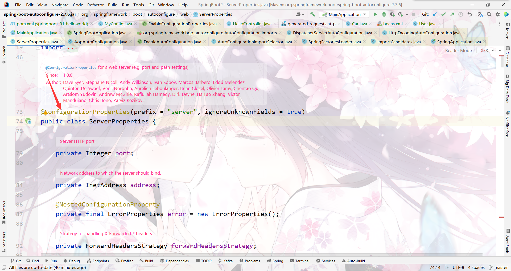
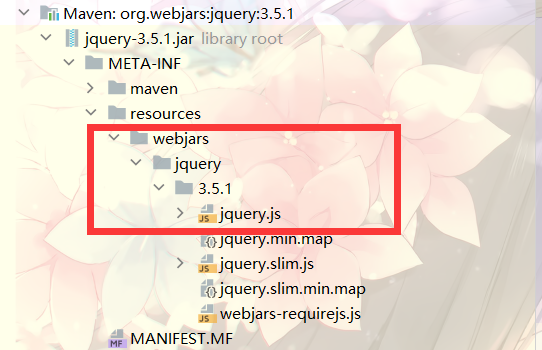
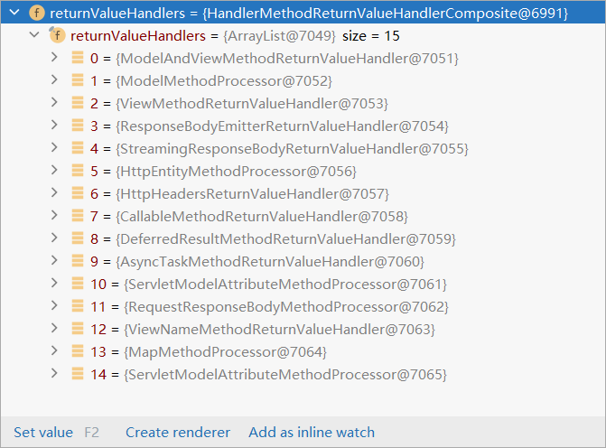
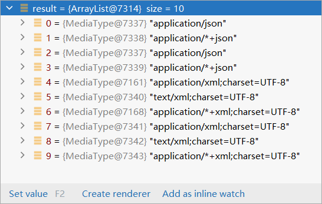
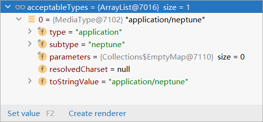
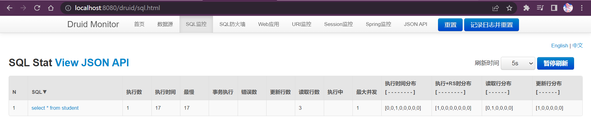

[toc]

# 1 环境

* Windows11
* IDEA 2022.2.3
* Java 8 
* Maven 3.8.5
* springboot2.7

## 1.1 maven配置

```xml
<localRepository>H:\Source\maven-repo</localRepository>

<mirrors>
	<mirror>
		<id>nexus-aliyun</id>
		<mirrorOf>central</mirrorOf>
		<name>Nexus aliyun</name>
		<url>http://maven.aliyun.com/nexus/content/groups/public</url>
	</mirror>
  </mirrors>
 
  <profiles>
	<profile>
	  <id>jdk-1.8</id>
	  <activation>
		<activeByDefault>true</activeByDefault>
		<jdk>1.8</jdk>
	  </activation>
	  <properties>
		<maven.compiler.source>1.8</maven.compiler.source>
		<maven.compiler.target>1.8</maven.compiler.target>
		<maven.compiler.compilerVersion>1.8</maven.compiler.compilerVersion>
	  </properties>
	</profile>
  </profiles>
```
# 2 HelloWorld

需求：浏览发送/hello请求，响应 Hello，Spring Boot 2 
https://docs.spring.io/spring-boot/docs/current/reference/html/index.html【教程】

## 2.1 创建maven工程

选择maven对应的版本3.8.5，仓库，settings，创建maven工程

## 2.2 引入依赖

```xml
<parent>
        <groupId>org.springframework.boot</groupId>
        <artifactId>spring-boot-starter-parent</artifactId>
        <version>2.7.6</version>
    </parent>

    <dependencies>
        <dependency>
            <groupId>org.springframework.boot</groupId>
            <artifactId>spring-boot-starter-web</artifactId>
        </dependency>
    </dependencies>
    
```
## 2.3 创建主程序

主程序固定写法，引导spring boot启动
```java
/**
 * 主程序类
 *
 * @springBootApplication;这是一个SpringBoot应用
 */
@SpringBootApplication
public class MainApplication {

    public static void main(String[] args) {
        SpringApplication.run(MainApplication.class, args);
    }

}
```
## 2.4 编写业务

正常编写业务，无需过多的配置
```java
@RestController
public class HelloController {
    @RequestMapping("/hello")
    public String hello() {
        return "Hello,Spring Boot 2!";
    }
}
```
## 2.5 测试

直接运行main方法


## 2.6 简化配置

application.properties
可以将所有配置写在里面
https://docs.spring.io/spring-boot/docs/current/reference/html/application-properties.html#application-properties.mail【修改属性配置的文档】

```properties
server.port=8888
```


## 2.7 简化部署

springboot插件，自带tomcat环境
```XML
    <build>
        <plugins>
            <plugin>
                <groupId>org.springframework.boot</groupId>
                <artifactId>spring-boot-maven-plugin</artifactId>
            </plugin>
        </plugins>
    </build>
```
将项目打成jar包，直接在目标服务器执行即可
可用cmd命令执行jar包【java -jar boot-01-helloworld-1.0-SNAPSHOT.jar】
注意

* cmd去掉快速编辑模式！【否则点一下就卡住不动】


# 3 了解自动配置的原理
## 3.1 SpringBoot特点

### 3.1.1 依赖管理

* 父项目做依赖管理
```XML
依赖管理
    <parent>
        <groupId>org.springframework.boot</groupId>
        <artifactId>spring-boot-starter-parent</artifactId>
        <version>2.7.6</version>
    </parent>
它的父项目（按住Ctrl 点击spring-boot-starter-parent）
  <parent>
    <groupId>org.springframework.boot</groupId>
    <artifactId>spring-boot-dependencies</artifactId>
    <version>2.7.6</version>
  </parent>
  几乎声明了所有开发中常用的依赖的版本号,自动版本仲裁机制
```
* 开发导入starter场景启动器

```XML
1、见到很多 spring-boot-starter-* ： *就某种场景
2、只要引入starter，这个场景的所有常规需要的依赖我们都自动引入
3、SpringBoot所有支持的场景
https://docs.spring.io/spring-boot/docs/current/reference/html/using-spring-boot.html#using-boot-starter
4、见到的  *-spring-boot-starter： 第三方为我们提供的简化开发的场景启动器。
5、所有场景启动器最底层的依赖
      <dependency>
        <groupId>org.springframework.boot</groupId>
        <artifactId>spring-boot-starter</artifactId>
        <version>2.7.6</version>
        <scope>compile</scope>
      </dependency>
```

查看依赖树


* 无需关注版本号，自动版本仲裁
```XML
1、引入依赖默认都可以不写版本
2、引入非版本仲裁的jar，要写版本号。
```
* 可修改默认版本号
```XML
1、查看spring-boot-dependencies里面规定当前依赖的版本用的 key。
2、在当前项目里面重写配置
    <properties>
        <mysql.version>5.1.43</mysql.version>
    </properties>
```

### 3.1.2 自动配置

- 自动配好Tomcat

  * 引入Tomcat依赖。【引入spring-boot-starter-web时自动引入】

  - 配置Tomcat


- 自动配好SpringMVC

  * 引入SpringMVC全套组件

  - 自动配好SpringMVC常用组件（功能）

  

- 自动配好Web常见功能，如：字符编码问题

  * SpringBoot帮我们配置好了所有web开发的常见场景


- 默认的包结构

  * 主程序所在包及其下面的所有子包里面的组件都会被默认扫描进来

  - 无需以前的包扫描配置

  * 想要改变扫描路径，@SpringBootApplication(scanBasePackages=**"com.neptune"**)
    * 或者@ComponentScan 指定扫描路径


```java
@SpringBootApplication
等同于
@SpringBootConfiguration
@EnableAutoConfiguration
@ComponentScan("com.neptune.springboot")
```


- 各种配置拥有默认值

  * 默认配置最终都是映射到某个类上，如：MultipartProperties

  - 配置文件的值最终会绑定每个类上，这个类会在容器中创建对象

配置文件按住Ctrl可点进去看具体的类，可在容器组件找到。


- ==按需加载==所有自动配置项

  * 非常多的starter

  - 引入了哪些场景这个场景的自动配置才会开启

  * SpringBoot所有的自动配置功能都在 spring-boot-autoconfigure 包里面


- ......

### 3.1.3 示例

#### 3.1.3.1 实体类

```java
public class Pet {
    private String name;

    public Pet() {
    }

    public Pet(String name) {
        this.name = name;
    }

    public String getName() {
        return name;
    }

    public void setName(String name) {
        this.name = name;
    }

    @Override
    public String toString() {
        return "Pet{" +
                "name='" + name + '\'' +
                '}';
    }
}

```

```java
public class User {
   private String name;

   private int age;

   private Pet pet;

    public User() {
    }

    public User(String name, int age) {
        this.name = name;
        this.age = age;
    }

    public Pet getPet() {
        return pet;
    }

    public void setPet(Pet pet) {
        this.pet = pet;
    }

    public String getName() {
        return name;
    }

    public void setName(String name) {
        this.name = name;
    }

    public int getAge() {
        return age;
    }

    public void setAge(int age) {
        this.age = age;
    }

    @Override
    public String toString() {
        return "User{" +
                "name='" + name + '\'' +
                ", age=" + age +
                ", pet=" + pet +
                '}';
    }
}
```

#### 3.1.3.2 配置文件

```xml
<?xml version="1.0" encoding="UTF-8"?>
<beans xmlns="http://www.springframework.org/schema/beans"
       xmlns:xsi="http://www.w3.org/2001/XMLSchema-instance"
       xsi:schemaLocation="http://www.springframework.org/schema/beans http://www.springframework.org/schema/beans/spring-beans.xsd">
    <bean id="user01" class="com.neptune.springboot.bean.User">
        <property name="name" value="zhangsan"></property>
        <property name="age" value="32"></property>
    </bean>
    <bean id="cat" class="com.neptune.springboot.bean.Pet">
        <property name="name" value="tom"></property>
    </bean>
</beans>
```

#### 3.1.3.3 配置类

```java
package com.neptune.springboot.config;

import com.neptune.springboot.bean.Pet;
import com.neptune.springboot.bean.User;
import org.springframework.context.annotation.Bean;
import org.springframework.context.annotation.Configuration;

@Configuration//告诉Spring boot这是一个配置类
public class MyConfig {

    @Bean //给容器添加组件，以方法名作为组件的id。返回类型就是组件类型。返回的值，就是组件在容器中的实例
    public User user01(){
        return new User("zhangsan",32);
    }

    @Bean("tomcat")//可自定义组件id
    public Pet tom(){
        return new Pet("tom");
    }
}

```


## 3.2 容器功能

### 3.2.1 组件添加

#### 3.2.1.1 @Configuration

- 基本使用
- **Full模式与Lite模式**

- 示例
  - 最佳实战
    * 配置类组件之间无依赖关系用Lite模式加速容器启动过程，减少判断
    * 配置类组件之间有依赖关系，方法会被调用得到之前单实例组件，用Full模式
    * 与Component区别是，Component无法启用代理（每次都是新对象）
    * 标注了@configuration、@component的(容器中的类)，方法上的@Bean才生效


```java
/**
 * 1、配置类里面使用@Bean标注在方法上给容器注册组件，默认也是单实例的对象
 * 2、配置类本身也是组件
 * 3、proxyBeanMethods：代理bean的方法(默认为true)
 *      Full(proxyBeanMethods = true)【保证每个@Bean方法被调用多少次返回的组件都是单实例的】
 *      Lite(proxyBeanMethods = false)【每个@Bean方法被调用多少次返回的组件都是新创建的】
 *      组件依赖必须使用Full模式（默认）。其他默认设为Lite模式
 *      Full启动慢，Lite启动快
 */

@Configuration(proxyBeanMethods=true)//告诉Spring boot这是一个配置类
public class MyConfig {

    /**
     * 外部无论对配置类中的这个组件注册方法调用多少次获取的都是之前注册容器中的单实例
     * @return
     */
    @Bean //给容器添加组件，以方法名作为组件的id。返回类型就是组件类型。返回的值，就是组件在容器中的实例
    public User user01(){
        User user = new User("zhangsan", 32);
        user.setPet(tom());
        return user;
    }

    @Bean("tomcat")//可自定义组件id
    public Pet tom(){
        return new Pet("tom");
    }
}
```

```java
/**
 * 主程序类
 *
 * @springBootApplication;这是一个SpringBoot应用
 */

//@SpringBootApplication
@SpringBootConfiguration
@EnableAutoConfiguration
@ComponentScan("com.neptune.springboot")
public class MainApplication {

    public static void main(String[] args) {

        //1、返回IOC容器
        ConfigurableApplicationContext run = SpringApplication.run(MainApplication.class, args);

        //2、查看容器里的组件
        String[] names = run.getBeanDefinitionNames();
        for (String name : names) {
            System.out.println("name = " + name);
        }

        //3、从容器中获取组件
        Pet tomcat1 = run.getBean("tomcat", Pet.class);
        Pet tomcat2 = run.getBean("tomcat", Pet.class);

        System.out.println("组件："+(tomcat1==tomcat2));//true

        MyConfig bean = run.getBean(MyConfig.class);
        //@configuration( proxyBeanMethods = true)
        //获取到代理对象com.neptune.springboot.config.MyConfig$$EnhancerBySpringCGLIB$$4b8186f7@60baef24

        //@configuration( proxyBeanMethods = false)
        //获取到对象com.neptune.springboot.config.MyConfig@67207d8a
        System.out.println("配置类："+bean);

        //如果@configuration( proxyBeanMethods = true) 就是代理对象调用方法。
        //SpringBoot总会检查这个组件是否在容器中，保持组件单实例

        //如果@configuration( proxyBeanMethods = false)。
        //每次调用组件的方法都会产生新对象
        User user1 = bean.user01();
        User user2 = bean.user01();
        System.out.println("对组件注册方法调用多次：" + (user1==user2));

        //@configuration( proxyBeanMethods = true)
        User user01 = run.getBean("user01", User.class);
        Pet tomcat = run.getBean("tomcat", Pet.class);
        System.out.println("组件调用方法创建的对象与容器对象："+(user01.getPet()==tomcat));//true

    }

}
```

#### 3.2.1.2 @Bean、@Component、@Controller、@Service、@Repository

```java
@Bean：放在方法的上面， 把方法的返回值对象，注入到spring容器中。
@Component:  放在类的上面，创建此类的对象，放入到容器中。 
@Controller: 放在类的上面，创建控制器对象，注入到容器中
@Service ： 放在业务层的实现类上面，创建service对象，注入到容器
@Repository : 放在dao层的实现类上面，创建dao对象，放入到容器。 没有使用这个注解，是因为现在使用MyBatis框     架，  dao对象是MyBatis通过代理生成的。 不需要使用@Repository、 所以没有使用。
```

#### 3.2.1.3 @ComponentScan、@Import

```java
//@SpringBootApplication
@SpringBootConfiguration
@EnableAutoConfiguration
@ComponentScan("com.neptune.springboot") 默认扫描的包就是主程序类所在的包
public class MainApplication {
```

```java
 * 4、@Import({User.class, DBHelper.class})
 *      给容器中自动创建出这两个类型的组件、默认组件的名字就是全类名
 * 	   @Import除了可以把普通的类定义为Bean，@Import还可以引入一个@Configuration修饰的类(引入配置类)，从而  *	 让配置类生效(把配置类下的所有Bean添加到IOC容器里面去)。在自定义starter的时候经常会用到。
 *
 *
 */

@Import({User.class, StaticLoggerBinder.class})
@Configuration(proxyBeanMethods=true)//告诉Spring boot这是一个配置类
public class MyConfig {
```


@Import 高级用法： https://www.bilibili.com/video/BV1gW411W7wy?p=8

#### 3.2.1.4 @Conditional

条件装配：满足Conditional指定的条件，则进行组件注入


**测试条件装配**

```java
//@ConditionalOnBean(name="tomcat")//容器中有tomcat组件时注入整个配置类（包括类中的组件）
@ConditionalOnMissingBean(name="tomcat")//容器中没有tomcat组件时注入整个配置类（包括类中的组件）
@Import({User.class, StaticLoggerBinder.class})
@Configuration(proxyBeanMethods=true)//告诉Spring boot这是一个配置类
public class MyConfig {

    /**
     * 外部无论对配置类中的这个组件注册方法调用多少次获取的都是之前注册容器中的单实例
     * @return
     */
//    @ConditionalOnBean(name="tomcat")//容器中有tomcat组件时注入user01
    @Bean //给容器添加组件，以方法名作为组件的id。返回类型就是组件类型。返回的值，就是组件在容器中的实例
    public User user01(){
        User user = new User("zhangsan", 32);
        user.setPet(tom());
        return user;
    }

    @Bean("tomcat")//可自定义组件id
    public Pet tom(){
        return new Pet("tom");
    }

    @Bean
    public Pet tom22(){
        return new Pet("tom");
    }
}
```

```java
@SpringBootConfiguration
@EnableAutoConfiguration
@ComponentScan("com.neptune.springboot")
public class MainApplication {

    public static void main(String[] args) {

        //1、返回IOC容器
        ConfigurableApplicationContext run = SpringApplication.run(MainApplication.class, args);

        //2、查看容器里的组件
        String[] names = run.getBeanDefinitionNames();
        for (String name : names) {
            System.out.println("name = " + name);
        }


        boolean tomcat = run.containsBean("tomcat");
        System.out.println("容器中是否存在tomcat组件："+tomcat);

        boolean user01 = run.containsBean("user01");
        System.out.println("容器中是否存在user01组件："+user01);

        boolean tom22 = run.containsBean("tom22");
        System.out.println("容器中是否存在tom22组件："+tom22);

        boolean myConfig = run.containsBean("myConfig");
        System.out.println("容器中是否存在myConfig组件："+myConfig);

    }

}
```


#### 3.2.1.5 @Value

* @Value注解是spring框架的注解，用于对对象属性的注入。

* @Value注解只有一个value属性，值可以是字面量，#{SPEL}表达式，配置文件的${key}值等。

* 能作用在方法（一般是setter方法）、属性、参数、注解上。但是一般会在方法或者属性上使用该注解。

```java
@ToString
@Component
public class Student {

    //字面量，作用在成员变量里面
    @Value(value = "张三")
    private String name;
    //SPEL表达式
    @Value(value = "#{5+6}")
    private int age;
    //引用外部配置文件的属性值
    @Value("${student.sex}")
    private boolean sex;

    private String fatherName;

    private String motherName;

    private String teacherName;

    //作用在setter方法上
    @Value(value = "李四")
    public void setFatherName(String fatherName){
        this.fatherName = fatherName;
    }

    //理论上@Value注解应该使用在setter方法上，例如上面的setFatherName，但是也可以作用在下面方法，把motherName和teacherName属性也复制成value的值
    @Value(value = "王五")
    public void setMAndT(String motherName,String teacherName){
        this.motherName = motherName;
        this.teacherName = teacherName;
    }
}
```

```yaml
student: 
	sex: true
```

```java
@SpringBootTest
class SpringbootstudyApplicationTests {

	
	@Autowired
	private Student student;

	@Test
	void test1() {
		System.out.println(student);
	}

}

//执行结果：
//Student(name=张三, age=11, sex=true, fatherName=李四, motherName=王五, teacherName=王五)
```

#### 3.2.1.6 @ConfigurationProperties

##### 3.2.1.6.1 简介

```java
//源码
@Target({ElementType.TYPE, ElementType.METHOD})
@Retention(RetentionPolicy.RUNTIME)
@Documented
public @interface ConfigurationProperties {
	
    @AliasFor("prefix")
    String value() default "";

    @AliasFor("value")
    String prefix() default "";

    boolean ignoreInvalidFields() default false;

    boolean ignoreUnknownFields() default true;
}

```

* @ConfigurationProperties注解是spring boot的注解，用于配置文件对对象属性的配置。
* 不支持字面量，也不支持SPEL表达式。
* 从上面源码可知，该注解能作用在类和方法上。
* 有四个属性：
  * prefix：配置文件key的前缀，给属性进行值的注入时会加上此前缀，例如设为teacher,然后属性值为name，name就会把配置文件中的key为teacher.name的值进行注入。
  * value：与prefix一样的作用。与prefix不能同时设置，除非设置的值一样。
  * ignoreInvalidFields：是否忽略无效的字段，默认不忽略。
  * ignoreUnknownFields：是否忽略未知字段，默认忽略。

<font color=00BFFF>**prefix与value的值不能有大写字母，不能下划线，可以中划线，不然会非法字符报错。**</font>

<font color=00BFFF>**Spring 使用一些宽松的规则来绑定属性。因此，配置文件的以下变体都绑定到属性hostName**</font>

```properties
mail.hostName
mail.hostname
mail.host_name
mail.host-name
mail.HOST_NAME
```

<font color=00BFFF>**可以在属性中嵌套List、Map和类**</font>

```java
//定义Credentials 类
public class Credentials {
    private String authMethod;
    private String username;
    private String password;
 
    // standard getters and setters
}
```

```java
@Configuration
@ConfigurationProperties(prefix = "mail") 
public class ConfigProperties {
 
    private String host;
    private int port;
    private String from;
    private List<String> defaultRecipients;
    private Map<String, String> additionalHeaders;
    private Credentials credentials;
 
    // standard getters and setters
}
```

```properties
#Simple properties
mail.hostname=mailer@mail.com
mail.port=9000
mail.from=mailer@mail.com
 
#List properties
mail.defaultRecipients[0]=admin@mail.com
mail.defaultRecipients[1]=owner@mail.com
 
#Map Properties
mail.additionalHeaders.redelivery=true
mail.additionalHeaders.secure=true
 
#Object properties
mail.credentials.username=john
mail.credentials.password=password
mail.credentials.authMethod=SHA1
```


###### 3.2.1.6.1.1 ignoreInvalidFields

```java
@Setter
@ToString
@Component
@ConfigurationProperties(prefix = "pet")
public class Pet {
    private String name;
    private boolean sex;
}
```

```yaml
pet:
  name: 旺财
  sex: 女
  master: 张三
```

```java
@SpringBootTest
class SpringbootstudyApplicationTests {
	@Autowired
	private Pet pet;
	@Test
	void test() {
		System.out.println(pet);
	}
}
```


分析：因为ignoreInvalidFields是是否忽略无效字段，默认false不忽略，所以，Pet类中的sex属性是布尔类型，而配置文件中的该字段是字符串String类型，所以会抛出异常。

也可以设置为true，忽略无效字段：


sex字段因为无效被忽略了，使用默认值。

###### 3.2.1.6.1.2 ignoreUnknownFields

```java
@Setter
@ToString
@Component
@ConfigurationProperties(prefix = "pet",ignoreUnknownFields = false)
public class Pet {
    private String name;
    private boolean sex;
}
```

```yaml
pet:
  name: 旺财
  sex: true
  master: 张三
```

```java
@SpringBootTest
class SpringbootstudyApplicationTests {
	@Autowired
	private Pet pet;
	@Test
	void test() {
		System.out.println(pet);
	}
}
```

```perl
Caused by: org.springframework.boot.context.properties.bind.UnboundConfigurationPropertiesException: The elements [pet.master] were left unbound.

//意思是配置文件中的pet.master在类用没有属性跟他绑定报错
```

ignoreUnknownFields的意思是是否忽略未知字段，默认是，所以默认情况下是不会报错，但是我设置为false之后，由于配置文件中有pet.master属性，但是类没有该属性，然后配置为不忽略未知字段，所以报错。

@ConfigurationProperties注解还支持JSR303数据校验：

```java
@Setter
@ToString
@Component
@ConfigurationProperties(prefix = "pet")
@Validated
public class Pet {
    @Email //对name进行邮箱校验
    private String name;
    private boolean sex;
}
```

```yaml
pet:
  name: 旺财
  sex: true
```

```java
@SpringBootTest
class SpringbootstudyApplicationTests {
	@Autowired
	private Pet pet;
	@Test
	void test() {
		System.out.println(pet);
	}
}
```

```perl
Field error in object 'pet' on field 'name': rejected value [旺财]; codes [Email.pet.name,Email.name,Email.java.lang.String,Email]; arguments [org.springframework.context.support.DefaultMessageSourceResolvable: codes [pet.name,name]; arguments []; default message [name],[Ljavax.validation.constraints.Pattern$Flag;@48bfb884,.*]; default message [不是一个合法的电子邮件地址]; origin class path resource [application.yml]:6:9

//因为pet.name不是邮箱格式，所以数据校验生效报错了。
```

##### 3.2.1.6.2 使用方式

@ConfigurationProperties和@Value注解用于获取配置文件中的属性定义并绑定到Java Bean或属性中

###### 3.2.1.6.2.1 简单使用

@ConfigurationProperties最适用于所有具有相同前缀的分层属性，用于将配置文件中mail开头的属性绑定到POJO中

```java
@Component
@ConfigurationProperties(prefix = "mail")
public class ConfigProperties {
    
    private String hostName;
    private int port;
    private String from;
 
    // standard getters and setters
}
```

###### 3.2.1.6.2.2 @ConfigurationPropertiesScan

@SpringBootApplication启用的类路径扫描器可以找到ConfigProperties类

可以使用@ConfigurationPropertiesScan 注释扫描配置属性类的自定义位置

```java
@ConfigurationProperties(prefix = "mail")
public class ConfigProperties {
    
    private String hostName;
    private int port;
    private String from;
 
    // standard getters and setters
}
 
@SpringBootApplication
@ConfigurationPropertiesScan("com.baeldung.configurationproperties")
public class EnableConfigurationDemoApplication { 
 
    public static void main(String[] args) {   
        SpringApplication.run(EnableConfigurationDemoApplication.class, args); 
    } 
}
```

###### 3.2.1.6.2.3 @EnableConfigurationProperties

```java
@ConfigurationProperties(prefix = "mail")
public class ConfigProperties {
    
    private String hostName;
    private int port;
    private String from;
 
    // standard getters and setters
}
 
@SpringBootApplication
@EnableConfigurationProperties(ConfigProperties.class)
public class EnableConfigurationDemoApplication {
    public static void main(String[] args) {
        SpringApplication.run(EnableConfigurationDemoApplication.class, args);
    }
}
```
###### 3.2.1.6.2.4 使用@ConfigurationProperties作用在@Bean注释的方法上

这种方式非常适合绑定到我们无法控制的第三方组件上

```java
//Item 类
public class Item {
    private String name;
    private int size;
 
    // standard getters and setters
}
 
//将属性绑定到Item实例上
@Configuration
public class ConfigProperties {
 
    @Bean
    @ConfigurationProperties(prefix = "item")
    public Item item() {
        return new Item();
    }
}
```

###### 3.2.1.6.2.5 不可变的@ConfigurationProperties绑定

通过构造器参数绑定，还需要使用@EnableConfigurationProperties 或 @ConfigurationPropertiesScan显式启用我们的配置类

```java
@ConfigurationProperties(prefix = "mail.credentials")
@ConstructorBinding
public class ConfigProperties {
    
    private String hostName;
    private int port;
    private String from;
 
    public ConfigProperties(String hostName,  int port, String from) {
        this.hostName = hostName;
        this.port = port;
        this.from = from;
    } 
 
    // standard getters and setters
}
```

### 3.2.2 原生配置文件引入

#### 3.2.2.1 @ImportResource

```java
@ImportResource ： 加载其他的xml配置文件， 把文件中的对象注入到spring容器中
```

```xml
======================beans.xml=========================
<?xml version="1.0" encoding="UTF-8"?>
<beans xmlns="http://www.springframework.org/schema/beans"
       xmlns:xsi="http://www.w3.org/2001/XMLSchema-instance"
       xmlns:context="http://www.springframework.org/schema/context"
       xsi:schemaLocation="http://www.springframework.org/schema/beans http://www.springframework.org/schema/beans/spring-beans.xsd http://www.springframework.org/schema/context https://www.springframework.org/schema/context/spring-context.xsd">

    <bean id="haha" class="com.atguigu.boot.bean.User">
        <property name="name" value="zhangsan"></property>
        <property name="age" value="18"></property>
    </bean>

    <bean id="hehe" class="com.atguigu.boot.bean.Pet">
        <property name="name" value="tomcat"></property>
    </bean>
</beans>
@ImportResource("classpath:beans.xml")
public class MyConfig {}

======================测试=================
        boolean haha = run.containsBean("haha");
        boolean hehe = run.containsBean("hehe");
        System.out.println("haha："+haha);//true
        System.out.println("hehe："+hehe);//true
```

### 3.2.3 配置绑定 

如何使用Java读取到properties文件中的内容，并且把它封装到JavaBean中，以供随时使用；

```java
public class getProperties {
     public static void main(String[] args) throws FileNotFoundException, IOException {
         Properties pps = new Properties();
         pps.load(new FileInputStream("a.properties"));
         Enumeration enum1 = pps.propertyNames();//得到配置文件的名字
         while(enum1.hasMoreElements()) {
             String strKey = (String) enum1.nextElement();
             String strValue = pps.getProperty(strKey);
             System.out.println(strKey + "=" + strValue);
             //封装到JavaBean。
         }
     }
 }
```

#### 3.2.3.1 @Component + @ConfigurationProperties

```java
/**
 * 只有在容器中的组件，才会拥有SpringBoot提供的强大功能
 */
@Component
@ConfigurationProperties(prefix = "mycar")
public class Car {

    private String brand;
    private Integer price;

    public String getBrand() {
        return brand;
    }

    public void setBrand(String brand) {
        this.brand = brand;
    }

    public Integer getPrice() {
        return price;
    }

    public void setPrice(Integer price) {
        this.price = price;
    }

    @Override
    public String toString() {
        return "Car{" +
                "brand='" + brand + '\'' +
                ", price=" + price +
                '}';
    }
}
```

#### 3.2.3.2 @EnableConfigurationProperties + @ConfigurationProperties

```java
@EnableConfigurationProperties(Car.class)
//1、开启Car配置绑定功能
//2、把这个Car这个组件自动注册到容器中
public class MyConfig {
}

==============================================
    
 //@Component
@ConfigurationProperties(prefix = "mycar")
public class Car {
```

#### 3.2.3.3 @ConfigurationProperties

```java
@Configuration
public class MyDataSourceConfig {

    @ConfigurationProperties("spring.datasource")//通过setter方法绑定配置文件
    @Bean
    public DataSource dataSource(){
        DruidDataSource druidDataSource = new DruidDataSource();
//        druidDataSource.setUrl();
//        druidDataSource.setUsername();
//        druidDataSource.setPassword();
        return druidDataSource;
    }
}
```


## 3.3 自动配置原理入门

### 3.3.1 引导加载自动配置类

```java
@SpringBootConfiguration
@EnableAutoConfiguration
@ComponentScan(excludeFilters = { @Filter(type = FilterType.CUSTOM, classes = TypeExcludeFilter.class),
		@Filter(type = FilterType.CUSTOM, classes = AutoConfigurationExcludeFilter.class) })
public @interface SpringBootApplication{}


======================
    
```

#### 3.3.1.1 @SpringBootConfiguration

@Configuration。代表当前是一个配置类


#### 3.3.1.2 @ComponentScan

指定扫描哪些，Spring注解；

#### 3.3.1.3 @EnableAutoConfiguration

```java
@AutoConfigurationPackage
@Import(AutoConfigurationImportSelector.class)
public @interface EnableAutoConfiguration {}
```

##### 3.3.1.3.1 @AutoConfigurationPackage

自动配置包？指定了默认的包规则

```java
@Import(AutoConfigurationPackages.Registrar.class)  //给容器中导入一个组件
public @interface AutoConfigurationPackage {}

//利用Registrar给容器中导入一系列组件
//将指定的一个包下的所有组件导入进来 => MainApplication 所在包下。
```


##### 3.3.1.3.2 @Import(AutoConfigurationImportSelector.class)

```java
	protected List<String> getCandidateConfigurations(AnnotationMetadata metadata, AnnotationAttributes attributes) {
		List<String> configurations = new ArrayList<>(
				SpringFactoriesLoader.loadFactoryNames(getSpringFactoriesLoaderFactoryClass(), getBeanClassLoader()));
		ImportCandidates.load(AutoConfiguration.class, getBeanClassLoader()).forEach(configurations::add);
		Assert.notEmpty(configurations,
				"No auto configuration classes found in META-INF/spring.factories nor in META-INF/spring/org.springframework.boot.autoconfigure.AutoConfiguration.imports. If you "
						+ "are using a custom packaging, make sure that file is correct.");
		return configurations;
	}
```


```java
1、利用getAutoConfigurationEntry(annotationMetadata);给容器中批量导入一些组件
2、调用List<String> configurations = getCandidateConfigurations(annotationMetadata, attributes)获取到所有需要导入到容器中的配置类
3、利用工厂加载 Map<String, List<String>> loadSpringFactories(@Nullable ClassLoader classLoader)；得到所有的组件，2.7版本后spring本身的自动配置类不从这里读，第三方的依旧在这里读
    
2.7版本后spring的类，新增静态方法public static ImportCandidates load(Class<?> annotation, ClassLoader classLoader)；
4、从META-INF/spring.factories位置来加载一个文件。
     默认扫描我们当前系统里面所有META-INF/spring.factories位置的文件
    
    2.7版本后spring本身的自动配置类
    从META-INF/spring/%s.imports位置来加载一个文件。
	默认扫描我们当前系统里面所有META-INF/spring/%s.imports位置的文件
    spring-boot-autoconfigure-2.7.6.jar包里面有
    META-INF/spring/org.springframework.boot.autoconfigure.AutoConfiguration.imports
```

*spring.factories*

```properties
# Auto Configure
org.springframework.boot.autoconfigure.EnableAutoConfiguration=\
com.neptune.hello.auto.HelloServiceAutoConfiguration
```


## 


```properties
#文件里面写死了spring-boot一启动就要给容器中加载的所有配置类
#spring-boot-autoconfigure-2.7.6.jar/META-INF/spring/org.springframework.boot.autoconfigure.AutoConfiguration.imports

org.springframework.boot.autoconfigure.admin.SpringApplicationAdminJmxAutoConfiguration
org.springframework.boot.autoconfigure.aop.AopAutoConfiguration
org.springframework.boot.autoconfigure.amqp.RabbitAutoConfiguration
org.springframework.boot.autoconfigure.batch.BatchAutoConfiguration
org.springframework.boot.autoconfigure.cache.CacheAutoConfiguration
org.springframework.boot.autoconfigure.cassandra.CassandraAutoConfiguration
org.springframework.boot.autoconfigure.context.ConfigurationPropertiesAutoConfiguration
org.springframework.boot.autoconfigure.context.LifecycleAutoConfiguration
org.springframework.boot.autoconfigure.context.MessageSourceAutoConfiguration
org.springframework.boot.autoconfigure.context.PropertyPlaceholderAutoConfiguration
org.springframework.boot.autoconfigure.couchbase.CouchbaseAutoConfiguration
org.springframework.boot.autoconfigure.dao.PersistenceExceptionTranslationAutoConfiguration
org.springframework.boot.autoconfigure.data.cassandra.CassandraDataAutoConfiguration
org.springframework.boot.autoconfigure.data.cassandra.CassandraReactiveDataAutoConfiguration
org.springframework.boot.autoconfigure.data.cassandra.CassandraReactiveRepositoriesAutoConfiguration
org.springframework.boot.autoconfigure.data.cassandra.CassandraRepositoriesAutoConfiguration
org.springframework.boot.autoconfigure.data.couchbase.CouchbaseDataAutoConfiguration
org.springframework.boot.autoconfigure.data.couchbase.CouchbaseReactiveDataAutoConfiguration
org.springframework.boot.autoconfigure.data.couchbase.CouchbaseReactiveRepositoriesAutoConfiguration
org.springframework.boot.autoconfigure.data.couchbase.CouchbaseRepositoriesAutoConfiguration
org.springframework.boot.autoconfigure.data.elasticsearch.ElasticsearchDataAutoConfiguration
org.springframework.boot.autoconfigure.data.elasticsearch.ElasticsearchRepositoriesAutoConfiguration
org.springframework.boot.autoconfigure.data.elasticsearch.ReactiveElasticsearchRepositoriesAutoConfiguration
org.springframework.boot.autoconfigure.data.elasticsearch.ReactiveElasticsearchRestClientAutoConfiguration
org.springframework.boot.autoconfigure.data.jdbc.JdbcRepositoriesAutoConfiguration
org.springframework.boot.autoconfigure.data.jpa.JpaRepositoriesAutoConfiguration
org.springframework.boot.autoconfigure.data.ldap.LdapRepositoriesAutoConfiguration
org.springframework.boot.autoconfigure.data.mongo.MongoDataAutoConfiguration
org.springframework.boot.autoconfigure.data.mongo.MongoReactiveDataAutoConfiguration
org.springframework.boot.autoconfigure.data.mongo.MongoReactiveRepositoriesAutoConfiguration
org.springframework.boot.autoconfigure.data.mongo.MongoRepositoriesAutoConfiguration
org.springframework.boot.autoconfigure.data.neo4j.Neo4jDataAutoConfiguration
org.springframework.boot.autoconfigure.data.neo4j.Neo4jReactiveDataAutoConfiguration
org.springframework.boot.autoconfigure.data.neo4j.Neo4jReactiveRepositoriesAutoConfiguration
org.springframework.boot.autoconfigure.data.neo4j.Neo4jRepositoriesAutoConfiguration
org.springframework.boot.autoconfigure.data.r2dbc.R2dbcDataAutoConfiguration
org.springframework.boot.autoconfigure.data.r2dbc.R2dbcRepositoriesAutoConfiguration
org.springframework.boot.autoconfigure.data.redis.RedisAutoConfiguration
org.springframework.boot.autoconfigure.data.redis.RedisReactiveAutoConfiguration
org.springframework.boot.autoconfigure.data.redis.RedisRepositoriesAutoConfiguration
org.springframework.boot.autoconfigure.data.rest.RepositoryRestMvcAutoConfiguration
org.springframework.boot.autoconfigure.data.web.SpringDataWebAutoConfiguration
org.springframework.boot.autoconfigure.elasticsearch.ElasticsearchRestClientAutoConfiguration
org.springframework.boot.autoconfigure.flyway.FlywayAutoConfiguration
org.springframework.boot.autoconfigure.freemarker.FreeMarkerAutoConfiguration
org.springframework.boot.autoconfigure.graphql.GraphQlAutoConfiguration
org.springframework.boot.autoconfigure.graphql.data.GraphQlReactiveQueryByExampleAutoConfiguration
org.springframework.boot.autoconfigure.graphql.data.GraphQlReactiveQuerydslAutoConfiguration
org.springframework.boot.autoconfigure.graphql.data.GraphQlQueryByExampleAutoConfiguration
org.springframework.boot.autoconfigure.graphql.data.GraphQlQuerydslAutoConfiguration
org.springframework.boot.autoconfigure.graphql.reactive.GraphQlWebFluxAutoConfiguration
org.springframework.boot.autoconfigure.graphql.rsocket.GraphQlRSocketAutoConfiguration
org.springframework.boot.autoconfigure.graphql.rsocket.RSocketGraphQlClientAutoConfiguration
org.springframework.boot.autoconfigure.graphql.security.GraphQlWebFluxSecurityAutoConfiguration
org.springframework.boot.autoconfigure.graphql.security.GraphQlWebMvcSecurityAutoConfiguration
org.springframework.boot.autoconfigure.graphql.servlet.GraphQlWebMvcAutoConfiguration
org.springframework.boot.autoconfigure.groovy.template.GroovyTemplateAutoConfiguration
org.springframework.boot.autoconfigure.gson.GsonAutoConfiguration
org.springframework.boot.autoconfigure.h2.H2ConsoleAutoConfiguration
org.springframework.boot.autoconfigure.hateoas.HypermediaAutoConfiguration
org.springframework.boot.autoconfigure.hazelcast.HazelcastAutoConfiguration
org.springframework.boot.autoconfigure.hazelcast.HazelcastJpaDependencyAutoConfiguration
org.springframework.boot.autoconfigure.http.HttpMessageConvertersAutoConfiguration
org.springframework.boot.autoconfigure.http.codec.CodecsAutoConfiguration
org.springframework.boot.autoconfigure.influx.InfluxDbAutoConfiguration
org.springframework.boot.autoconfigure.info.ProjectInfoAutoConfiguration
org.springframework.boot.autoconfigure.integration.IntegrationAutoConfiguration
org.springframework.boot.autoconfigure.jackson.JacksonAutoConfiguration
org.springframework.boot.autoconfigure.jdbc.DataSourceAutoConfiguration
org.springframework.boot.autoconfigure.jdbc.JdbcTemplateAutoConfiguration
org.springframework.boot.autoconfigure.jdbc.JndiDataSourceAutoConfiguration
org.springframework.boot.autoconfigure.jdbc.XADataSourceAutoConfiguration
org.springframework.boot.autoconfigure.jdbc.DataSourceTransactionManagerAutoConfiguration
org.springframework.boot.autoconfigure.jms.JmsAutoConfiguration
org.springframework.boot.autoconfigure.jmx.JmxAutoConfiguration
org.springframework.boot.autoconfigure.jms.JndiConnectionFactoryAutoConfiguration
org.springframework.boot.autoconfigure.jms.activemq.ActiveMQAutoConfiguration
org.springframework.boot.autoconfigure.jms.artemis.ArtemisAutoConfiguration
org.springframework.boot.autoconfigure.jersey.JerseyAutoConfiguration
org.springframework.boot.autoconfigure.jooq.JooqAutoConfiguration
org.springframework.boot.autoconfigure.jsonb.JsonbAutoConfiguration
org.springframework.boot.autoconfigure.kafka.KafkaAutoConfiguration
org.springframework.boot.autoconfigure.availability.ApplicationAvailabilityAutoConfiguration
org.springframework.boot.autoconfigure.ldap.embedded.EmbeddedLdapAutoConfiguration
org.springframework.boot.autoconfigure.ldap.LdapAutoConfiguration
org.springframework.boot.autoconfigure.liquibase.LiquibaseAutoConfiguration
org.springframework.boot.autoconfigure.mail.MailSenderAutoConfiguration
org.springframework.boot.autoconfigure.mail.MailSenderValidatorAutoConfiguration
org.springframework.boot.autoconfigure.mongo.embedded.EmbeddedMongoAutoConfiguration
org.springframework.boot.autoconfigure.mongo.MongoAutoConfiguration
org.springframework.boot.autoconfigure.mongo.MongoReactiveAutoConfiguration
org.springframework.boot.autoconfigure.mustache.MustacheAutoConfiguration
org.springframework.boot.autoconfigure.neo4j.Neo4jAutoConfiguration
org.springframework.boot.autoconfigure.netty.NettyAutoConfiguration
org.springframework.boot.autoconfigure.orm.jpa.HibernateJpaAutoConfiguration
org.springframework.boot.autoconfigure.quartz.QuartzAutoConfiguration
org.springframework.boot.autoconfigure.r2dbc.R2dbcAutoConfiguration
org.springframework.boot.autoconfigure.r2dbc.R2dbcTransactionManagerAutoConfiguration
org.springframework.boot.autoconfigure.rsocket.RSocketMessagingAutoConfiguration
org.springframework.boot.autoconfigure.rsocket.RSocketRequesterAutoConfiguration
org.springframework.boot.autoconfigure.rsocket.RSocketServerAutoConfiguration
org.springframework.boot.autoconfigure.rsocket.RSocketStrategiesAutoConfiguration
org.springframework.boot.autoconfigure.security.servlet.SecurityAutoConfiguration
org.springframework.boot.autoconfigure.security.servlet.UserDetailsServiceAutoConfiguration
org.springframework.boot.autoconfigure.security.servlet.SecurityFilterAutoConfiguration
org.springframework.boot.autoconfigure.security.reactive.ReactiveSecurityAutoConfiguration
org.springframework.boot.autoconfigure.security.reactive.ReactiveUserDetailsServiceAutoConfiguration
org.springframework.boot.autoconfigure.security.rsocket.RSocketSecurityAutoConfiguration
org.springframework.boot.autoconfigure.security.saml2.Saml2RelyingPartyAutoConfiguration
org.springframework.boot.autoconfigure.sendgrid.SendGridAutoConfiguration
org.springframework.boot.autoconfigure.session.SessionAutoConfiguration
org.springframework.boot.autoconfigure.security.oauth2.client.servlet.OAuth2ClientAutoConfiguration
org.springframework.boot.autoconfigure.security.oauth2.client.reactive.ReactiveOAuth2ClientAutoConfiguration
org.springframework.boot.autoconfigure.security.oauth2.resource.servlet.OAuth2ResourceServerAutoConfiguration
org.springframework.boot.autoconfigure.security.oauth2.resource.reactive.ReactiveOAuth2ResourceServerAutoConfiguration
org.springframework.boot.autoconfigure.solr.SolrAutoConfiguration
org.springframework.boot.autoconfigure.sql.init.SqlInitializationAutoConfiguration
org.springframework.boot.autoconfigure.task.TaskExecutionAutoConfiguration
org.springframework.boot.autoconfigure.task.TaskSchedulingAutoConfiguration
org.springframework.boot.autoconfigure.thymeleaf.ThymeleafAutoConfiguration
org.springframework.boot.autoconfigure.transaction.TransactionAutoConfiguration
org.springframework.boot.autoconfigure.transaction.jta.JtaAutoConfiguration
org.springframework.boot.autoconfigure.validation.ValidationAutoConfiguration
org.springframework.boot.autoconfigure.web.client.RestTemplateAutoConfiguration
org.springframework.boot.autoconfigure.web.embedded.EmbeddedWebServerFactoryCustomizerAutoConfiguration
org.springframework.boot.autoconfigure.web.reactive.HttpHandlerAutoConfiguration
org.springframework.boot.autoconfigure.web.reactive.ReactiveMultipartAutoConfiguration
org.springframework.boot.autoconfigure.web.reactive.ReactiveWebServerFactoryAutoConfiguration
org.springframework.boot.autoconfigure.web.reactive.WebFluxAutoConfiguration
org.springframework.boot.autoconfigure.web.reactive.WebSessionIdResolverAutoConfiguration
org.springframework.boot.autoconfigure.web.reactive.error.ErrorWebFluxAutoConfiguration
org.springframework.boot.autoconfigure.web.reactive.function.client.ClientHttpConnectorAutoConfiguration
org.springframework.boot.autoconfigure.web.reactive.function.client.WebClientAutoConfiguration
org.springframework.boot.autoconfigure.web.servlet.DispatcherServletAutoConfiguration
org.springframework.boot.autoconfigure.web.servlet.ServletWebServerFactoryAutoConfiguration
org.springframework.boot.autoconfigure.web.servlet.error.ErrorMvcAutoConfiguration
org.springframework.boot.autoconfigure.web.servlet.HttpEncodingAutoConfiguration
org.springframework.boot.autoconfigure.web.servlet.MultipartAutoConfiguration
org.springframework.boot.autoconfigure.web.servlet.WebMvcAutoConfiguration
org.springframework.boot.autoconfigure.websocket.reactive.WebSocketReactiveAutoConfiguration
org.springframework.boot.autoconfigure.websocket.servlet.WebSocketServletAutoConfiguration
org.springframework.boot.autoconfigure.websocket.servlet.WebSocketMessagingAutoConfiguration
org.springframework.boot.autoconfigure.webservices.WebServicesAutoConfiguration
org.springframework.boot.autoconfigure.webservices.client.WebServiceTemplateAutoConfiguration
```

### 3.3.2 按需开启自动配置项

```java
虽然我们144个场景的所有自动配置启动的时候默认全部加载。xxxxAutoConfiguration
按照条件装配规则（@Conditional），最终会按需配置。
```


### 3.3.3 修改默认配置

**修改用户自己注册的组件名称（bean重命名）**

```java
        @Bean
		@ConditionalOnBean(MultipartResolver.class)  //容器中有这个类型组件
		@ConditionalOnMissingBean(name = DispatcherServlet.MULTIPART_RESOLVER_BEAN_NAME) //容器中没有这个名字 multipartResolver 的组件
		public MultipartResolver multipartResolver(MultipartResolver resolver) {
            //给@Bean标注的方法传入了对象参数，这个参数的值就会从容器中找。
            //SpringMVC multipartResolver。防止有些用户配置的文件上传解析器不符合规范
			// Detect if the user has created a MultipartResolver but named it incorrectly
			return resolver;
		}
给容器中加入了文件上传解析器；
```

SpringBoot默认会在底层配好所有的组件。但是如果用户自己配置了以用户的优先

```java
@Bean
	@ConditionalOnMissingBean
	public CharacterEncodingFilter characterEncodingFilter() {
    }
```





总结：

- SpringBoot先加载所有的自动配置类  xxxxxAutoConfiguration

- 每个自动配置类按照条件进行生效，默认都会绑定配置文件指定的值。xxxxProperties里面拿。xxxProperties和配置文件进行了绑定

- 生效的配置类就会给容器中装配很多组件

- 只要容器中有这些组件，相当于这些功能就有了

- 定制化配置

  * 用户直接自己@Bean替换底层的组件

  - 用户去看这个组件是获取的配置文件什么值就去修改。

==xxxxxAutoConfiguration ➡ 组件  ➡ xxxxProperties里面拿值  ➡ application.properties==

### 3.3.4 最佳实践

- 引入场景依赖

  * https://docs.spring.io/spring-boot/docs/current/reference/html/using-spring-boot.html#using-boot-starter

- 查看自动配置了哪些（选做）

  * 自己分析，引入场景对应的自动配置一般都生效了（pom文件引入的依赖）

  - 配置文件中debug=true开启自动配置报告。Negative（不生效）\Positive（生效）


- 是否需要修改

  * 参照文档修改配置项
    * https://docs.spring.io/spring-boot/docs/current/reference/html/appendix-application-properties.html#common-application-properties
    * 自己分析。xxxxProperties绑定了配置文件的哪些。

  如：更换spring启动图标

  

  * 自定义加入或者替换组件

    * @Bean、@Component。。。
  * 自定义器  **XXXXXCustomizer**；

  

  * ......

## 3.4 开发小技巧

### 3.4.1 Lombok

简化JavaBean开发

```xml
        <dependency>
            <groupId>org.projectlombok</groupId>
            <artifactId>lombok</artifactId>
        </dependency>
```

```java
idea中搜索安装lombok插件
===============================简化JavaBean开发===================================
@NoArgsConstructor//无参构造器
//@AllArgsConstructor//全参构造器
@Data//setter and getter
@ToString//toString
@EqualsAndHashCode//hashcode
public class User {
    private String name;

    private int age;

    private Pet pet;

    public User(String name, int age) {
        this.name = name;
        this.age = age;
    }
}

================================简化日志开发===================================
@Slf4j
@RestController
public class HelloController {
    @RequestMapping("/hello")
    public String handle01(@RequestParam("name") String name){
        
        log.info("请求进来了....");
        
        return "Hello, Spring Boot 2!"+"你好："+name;
    }
}
```

### 3.4.2 dev-tools

```xml
        <dependency>
            <groupId>org.springframework.boot</groupId>
            <artifactId>spring-boot-devtools</artifactId>
            <optional>true</optional>
        </dependency>
```

项目或者页面修改以后：Ctrl+F9；


### 3.4.3 Spring Initailizr（项目初始化向导）

# 4 配置文件

==*优先级：properties>yml>yaml*==

==使用yml文件可以避免中文乱码==

## 4.1 文件类型

### 4.1.1 properties

同以前的properties用法

### 4.1.2 yaml

#### 4.1.2.1 简介

YAML 是 "YAML Ain't Markup Language"（YAML 不是一种标记语言）的递归缩写。在开发的这种语言时，YAML 的意思其实是："Yet Another Markup Language"（仍是一种标记语言）。 

非常适合用来做以数据为中心的配置文件

#### 4.1.2.2 基本语法

- key: value；kv之间有空格
- 大小写敏感
- 使用缩进表示层级关系
- 缩进不允许使用tab，只允许空格
- 缩进的空格数不重要，只要相同层级的元素左对齐即可
- '#'表示注释
- 字符串无需加引号，如果要加，''与""表示字符串内容 会被 转义/不转义

#### 4.1.2.3 数据类型

- 字面量：单个的、不可再分的值。date、boolean、string、number、null

```yaml
k: v
```

- 对象：键值对的集合。map、hash、set、object 

```yaml
行内写法：  k: {k1:v1,k2:v2,k3:v3}
#或
k: 
  k1: v1
  k2: v2
  k3: v3
```

- 数组：一组按次序排列的值。array、list、queue

```yaml
行内写法：  k: [v1,v2,v3]
#或者
k:
 - v1
 - v2
 - v3
```

#### 4.1.2.4 示例

```java
@Data
public class Person {
	
	private String userName;
	private Boolean boss;
	private Date birth;
	private Integer age;
	private Pet pet;
	private String[] interests;
	private List<String> animal;
	private Map<String, Object> score;
	private Set<Double> salarys;
	private Map<String, List<Pet>> allPets;
}

@Data
public class Pet {
	private String name;
	private Double weight;
}
```

```yaml
# yaml表示以上对象
person:
  userName: zhangsan
  boss: false
  birth: 2019/12/12 20:12:33
  age: 18
  pet: 
    name: tomcat
    weight: 23.4
  interests: [篮球,游泳]
  animal: 
    - jerry
    - mario
  score:
    english: 
      first: 30
      second: 40
      third: 50
    math: [131,140,148]
    chinese: {first: 128,second: 136}
  salarys: [3999,4999.98,5999.99]
  allPets:
    sick:
      - {name: tom}
      - {name: jerry,weight: 47}
    health: [{name: mario,weight: 47}]
```

## 4.2 配置提示

自定义的类和配置文件绑定一般没有提示。

```xml
        <dependency>
            <groupId>org.springframework.boot</groupId>
            <artifactId>spring-boot-configuration-processor</artifactId>
            <optional>true</optional>
        </dependency>


打包时排除spring-boot-configuration-processor
 <build>
        <plugins>
            <plugin>
                <groupId>org.springframework.boot</groupId>
                <artifactId>spring-boot-maven-plugin</artifactId>
                <configuration>
                    <excludes>
                        <exclude>
                            <groupId>org.springframework.boot</groupId>
                            <artifactId>spring-boot-configuration-processor</artifactId>
                        </exclude>
                    </excludes>
                </configuration>
            </plugin>
        </plugins>
    </build>
```

# 5 Web开发


## 5.1 SpringMVC自动配置概览

Spring Boot provides auto-configuration for Spring MVC that **works well with most applications.(大多场景我们都无需自定义配置)**

The auto-configuration adds the following features on top of Spring’s defaults:

- Inclusion of `ContentNegotiatingViewResolver` and `BeanNameViewResolver` beans.

- - 内容协商视图解析器和BeanName视图解析器

- Support for serving static resources, including support for WebJars (covered [later in this document](https://docs.spring.io/spring-boot/docs/current/reference/html/spring-boot-features.html#boot-features-spring-mvc-static-content))).

- - 静态资源（包括webjars）

- Automatic registration of `Converter`, `GenericConverter`, and `Formatter` beans.

- - 自动注册 `Converter，GenericConverter，Formatter `

- Support for `HttpMessageConverters` (covered [later in this document](https://docs.spring.io/spring-boot/docs/current/reference/html/spring-boot-features.html#boot-features-spring-mvc-message-converters)).

- - 支持 `HttpMessageConverters` （后来我们配合内容协商理解原理）

- Automatic registration of `MessageCodesResolver` (covered [later in this document](https://docs.spring.io/spring-boot/docs/current/reference/html/spring-boot-features.html#boot-features-spring-message-codes)).

- - 自动注册 `MessageCodesResolver` （国际化用）

- Static `index.html` support.

- - 静态index.html 页支持

- Custom `Favicon` support (covered [later in this document](https://docs.spring.io/spring-boot/docs/current/reference/html/spring-boot-features.html#boot-features-spring-mvc-favicon)).

- - 自定义 `Favicon`  

- Automatic use of a `ConfigurableWebBindingInitializer` bean (covered [later in this document](https://docs.spring.io/spring-boot/docs/current/reference/html/spring-boot-features.html#boot-features-spring-mvc-web-binding-initializer)).

- - 自动使用 `ConfigurableWebBindingInitializer` ，（DataBinder负责将请求数据绑定到JavaBean上）

If you want to keep those Spring Boot MVC customizations and make more [MVC customizations](https://docs.spring.io/spring/docs/5.2.9.RELEASE/spring-framework-reference/web.html#mvc) (interceptors, formatters, view controllers, and other features), you can add your own `@Configuration` class of type `WebMvcConfigurer` but **without** `@EnableWebMvc`.

**不用@EnableWebMvc注解。使用** `@Configuration` **+** `WebMvcConfigurer` **自定义规则**


If you want to provide custom instances of `RequestMappingHandlerMapping`, `RequestMappingHandlerAdapter`, or `ExceptionHandlerExceptionResolver`, and still keep the Spring Boot MVC customizations, you can declare a bean of type `WebMvcRegistrations` and use it to provide custom instances of those components.

**声明** `WebMvcRegistrations` **改变默认底层组件**


If you want to take complete control of Spring MVC, you can add your own `@Configuration` annotated with `@EnableWebMvc`, or alternatively add your own `@Configuration`-annotated `DelegatingWebMvcConfiguration` as described in the Javadoc of `@EnableWebMvc`.

**使用** `@EnableWebMvc+@Configuration+DelegatingWebMvcConfiguration 全面接管SpringMVC`

## 5.2 简单功能分析


### 5.2.1 静态资源访问

#### 5.2.1.1 静态资源目录

只要静态资源放在类路径下： called `/static` (or `/public` or `/resources` or `/META-INF/resources`


访问 ： 当前项目根路径/ + 静态资源名 


原理： 静态映射/**。

请求进来，先去找Controller看能不能处理。不能处理的所有请求又都交给静态资源处理器。静态资源也找不到则响应404页面


改变默认的静态资源路径

```yaml
spring:
  mvc:
    static-path-pattern: /res/**

  resources:
    static-locations: [classpath:/haha/]
```


#### 5.2.1.2 静态资源访问前缀

默认无前缀

```yaml
spring:
  mvc:
    static-path-pattern: /res/**
```

当前项目 + static-path-pattern + 静态资源名 = 静态资源文件夹下找

#### 5.2.1.3 webjar

自动映射 /[webjars](http://localhost:8080/webjars/jquery/3.5.1/jquery.js)/**

https://www.webjars.org/

```xml
        <dependency>
            <groupId>org.webjars</groupId>
            <artifactId>jquery</artifactId>
            <version>3.5.1</version>
        </dependency>
```

访问地址：[http://localhost:8080/webjars/**jquery/3.5.1/jquery.js**](http://localhost:8080/webjars/jquery/3.5.1/jquery.js)   后面地址要按照依赖里面的包路径



### 5.2.2 欢迎页支持

- 静态资源路径下  index.html

  * 可以配置静态资源路径

  - 但是不可以配置静态资源的访问前缀。否则导致 index.html不能被默认访问


```yaml
spring:
#  mvc:
#    static-path-pattern: /res/**	这个会导致welcome page功能失效
  web:
    resources:
      static-locations: [classpath:/pictures/]
```

- controller能处理/index


### 5.2.3 自定义 `Favicon`

浏览器显示不出来时,由于缓存问题，按Ctrl+F5 强制刷新屏幕。（以后遇到很多浏览器问题，在代码没有问题的情况下，通过强制刷新浏览器都可能会很有效）

favicon.ico 放在静态资源目录下即可。

```yaml
spring:
#  mvc:
#    static-path-pattern: /res/**   这个会导致 Favicon 功能失效
```


### 5.2.4 静态资源配置原理

- SpringBoot启动默认加载  xxxAutoConfiguration 类（自动配置类）
- SpringMVC功能的自动配置类 WebMvcAutoConfiguration，生效

```java
@SuppressWarnings("deprecation")
@AutoConfiguration(after = { DispatcherServletAutoConfiguration.class, TaskExecutionAutoConfiguration.class,
		ValidationAutoConfiguration.class })
@ConditionalOnWebApplication(type = Type.SERVLET)
@ConditionalOnClass({ Servlet.class, DispatcherServlet.class, WebMvcConfigurer.class })
@ConditionalOnMissingBean(WebMvcConfigurationSupport.class)
@AutoConfigureOrder(Ordered.HIGHEST_PRECEDENCE + 10)
public class WebMvcAutoConfiguration {}

===================================================
@ConfigurationProperties(prefix = "spring.mvc")
public class WebMvcProperties {}

================================================
@ConfigurationProperties("spring.web")
public class WebProperties {}
```

- 给容器中配了什么。

```java
	@SuppressWarnings("deprecation")
	@Configuration(proxyBeanMethods = false)
	@Import(EnableWebMvcConfiguration.class)
	@EnableConfigurationProperties({ WebMvcProperties.class, WebProperties.class })
	@Order(0)
	public static class WebMvcAutoConfigurationAdapter implements WebMvcConfigurer, ServletContextAware {}
```

- 配置文件的相关属性和xxx进行了绑定。WebMvcProperties **spring.mvc**、WebProperties **spring.web**

#### 5.2.4.1 配置类只有一个有参构造器

```java
	//有参构造器所有参数的值都会从容器中确定
//WebProperties webProperties；获取和spring.web绑定的所有的值的对象
//WebMvcProperties mvcProperties 获取和spring.mvc绑定的所有的值的对象
//ListableBeanFactory beanFactory Spring的beanFactory
//HttpMessageConverters 找到所有的HttpMessageConverters
//ResourceHandlerRegistrationCustomizer 找到 资源处理器的自定义器。=========
//DispatcherServletPath  
//ServletRegistrationBean   给应用注册Servlet、Filter....
		public WebMvcAutoConfigurationAdapter(WebProperties webProperties, WebMvcProperties mvcProperties,
				ListableBeanFactory beanFactory, ObjectProvider<HttpMessageConverters> messageConvertersProvider,
				ObjectProvider<ResourceHandlerRegistrationCustomizer> resourceHandlerRegistrationCustomizerProvider,
				ObjectProvider<DispatcherServletPath> dispatcherServletPath,
				ObjectProvider<ServletRegistrationBean<?>> servletRegistrations) {
			this.resourceProperties = webProperties.getResources();
			this.mvcProperties = mvcProperties;
			this.beanFactory = beanFactory;
			this.messageConvertersProvider = messageConvertersProvider;
			this.resourceHandlerRegistrationCustomizer = resourceHandlerRegistrationCustomizerProvider.getIfAvailable();
			this.dispatcherServletPath = dispatcherServletPath;
			this.servletRegistrations = servletRegistrations;
			this.mvcProperties.checkConfiguration();
		}
```

#### 5.2.4.2 资源处理的默认规则

```java
		@Override
		public void addResourceHandlers(ResourceHandlerRegistry registry) {
			if (!this.resourceProperties.isAddMappings()) {
				logger.debug("Default resource handling disabled");
				return;
			}
			addResourceHandler(registry, "/webjars/**", "classpath:/META-INF/resources/webjars/");
			addResourceHandler(registry, this.mvcProperties.getStaticPathPattern(), (registration) -> {
				registration.addResourceLocations(this.resourceProperties.getStaticLocations());
				if (this.servletContext != null) {
					ServletContextResource resource = new ServletContextResource(this.servletContext, SERVLET_LOCATION);
					registration.addResourceLocations(resource);
				}
			});
		}
```

```yaml
spring:
  web:
    resources:
      add-mappings: false	禁用所有静态资源规则
```

```java
	public static class Resources {

		private static final String[] CLASSPATH_RESOURCE_LOCATIONS = { "classpath:/META-INF/resources/",
				"classpath:/resources/", "classpath:/static/", "classpath:/public/" };

		/**
		 * Locations of static resources. Defaults to classpath:[/META-INF/resources/,
		 * /resources/, /static/, /public/].
		 */
		private String[] staticLocations = CLASSPATH_RESOURCE_LOCATIONS;
```

#### 5.2.4.3 欢迎页的处理规则

`HandlerMapping`：处理器映射。保存了每一个Handler能处理哪些请求。	

```java
		@Bean
		public WelcomePageHandlerMapping welcomePageHandlerMapping(ApplicationContext applicationContext,
				FormattingConversionService mvcConversionService, ResourceUrlProvider mvcResourceUrlProvider) {
			WelcomePageHandlerMapping welcomePageHandlerMapping = new WelcomePageHandlerMapping(
					new TemplateAvailabilityProviders(applicationContext), applicationContext, getWelcomePage(),
					this.mvcProperties.getStaticPathPattern());
			welcomePageHandlerMapping.setInterceptors(getInterceptors(mvcConversionService, mvcResourceUrlProvider));
			welcomePageHandlerMapping.setCorsConfigurations(getCorsConfigurations());
			return welcomePageHandlerMapping;
		}
```

```java
	WelcomePageHandlerMapping(TemplateAvailabilityProviders templateAvailabilityProviders,
			ApplicationContext applicationContext, Resource welcomePage, String staticPathPattern) {
		if (welcomePage != null && "/**".equals(staticPathPattern)) {
            	    //要用欢迎页功能，必须是/**
			logger.info("Adding welcome page: " + welcomePage);
			setRootViewName("forward:index.html");
		}
		else if (welcomeTemplateExists(templateAvailabilityProviders, applicationContext)) {
            	    // 调用Controller  /index
			logger.info("Adding welcome page template: index");
			setRootViewName("index");
		}
	}

================
    	private void setRootViewName(String viewName) {
		ParameterizableViewController controller = new ParameterizableViewController();
		controller.setViewName(viewName);
		setRootHandler(controller);
		setOrder(2);
	}
```

#### 5.2.4.4 favicon

浏览器会自动发送/favicon.ico请求获取到图标，整个session期间不再获取

## 5.3 请求参数处理

### 5.3.1 请求映射

#### 5.3.1.1 rest使用与原理

- @xxxMapping；
- Rest风格支持（*使用**HTTP**请求方式动词来表示对资源的操作*）

  * *以前：/getUser*  *获取用户*    */deleteUser* *删除用户*   */editUser*  *修改用户*      */saveUser* *保存用户*

  - *现在： /user*    *GET-获取用户*    *DELETE-删除用户*     *PUT-修改用户*      *POST-保存用户*
  - 核心Filter；HiddenHttpMethodFilter
    * 用法： 表单method=post，隐藏域 _method=put
    * SpringBoot中手动开启

  * 扩展：如何把_method 这个名字换成我们自己喜欢的。


```java
    @RequestMapping(value = "/user",method = RequestMethod.GET)
    public String getUser(){
        return "GET-张三";
    }

    @RequestMapping(value = "/user",method = RequestMethod.POST)
    public String saveUser(){
        return "POST-张三";
    }


    @RequestMapping(value = "/user",method = RequestMethod.PUT)
    public String putUser(){
        return "PUT-张三";
    }

    @RequestMapping(value = "/user",method = RequestMethod.DELETE)
    public String deleteUser(){
        return "DELETE-张三";
    }


	@Bean
	@ConditionalOnMissingBean(HiddenHttpMethodFilter.class)
	@ConditionalOnProperty(prefix = "spring.mvc.hiddenmethod.filter", name = "enabled", matchIfMissing = false)
	public OrderedHiddenHttpMethodFilter hiddenHttpMethodFilter() {
		return new OrderedHiddenHttpMethodFilter();
	}


//自定义filter
    @Bean
    public HiddenHttpMethodFilter hiddenHttpMethodFilter(){
        HiddenHttpMethodFilter methodFilter = new HiddenHttpMethodFilter();
        methodFilter.setMethodParam("_m");
        return methodFilter;
    }
```

Rest原理（表单提交要使用REST的时候）

- 表单提交会带上**_method=DELETE**
- **请求过来被**HiddenHttpMethodFilter拦截
  * 请求是否正常，并且是POST
    * 获取到**_method**的值。
    * 兼容以下请求；**PUT**.**DELETE**.**PATCH**
    * **原生request（post），包装模式requesWrapper重写了getMethod方法，返回的是传入的值。**
    * **过滤器链放行的时候用wrapper。以后的方法调用getMethod是调用requesWrapper的。**


**Rest使用客户端工具，**

- 如PostMan直接发送Put、delete等方式请求，无需Filter。

```yaml
spring:
  mvc:
    hiddenmethod:
      filter:
        enabled: true   #开启页面表单的Rest功能
```

#### 5.3.1.2 请求映射原理

SpringMVC的`DispatcherServlet`是处理所有请求的开始


SpringMVC功能分析都从 org.springframework.web.servlet.DispatcherServlet -> doDispatch（）

```java
protected void doDispatch(HttpServletRequest request, HttpServletResponse response) throws Exception {
		HttpServletRequest processedRequest = request;
		HandlerExecutionChain mappedHandler = null;
		boolean multipartRequestParsed = false;

		WebAsyncManager asyncManager = WebAsyncUtils.getAsyncManager(request);

		try {
			ModelAndView mv = null;
			Exception dispatchException = null;

			try {
				processedRequest = checkMultipart(request);
				multipartRequestParsed = (processedRequest != request);

				// 找到当前请求使用哪个Handler（Controller的方法）处理
				mappedHandler = getHandler(processedRequest);
                
                //HandlerMapping：处理器映射。/xxx->>xxxx
```


**RequestMappingHandlerMapping**：保存了所有@RequestMapping 和handler的映射规则。


所有的请求映射都在HandlerMapping中。


- SpringBoot自动配置欢迎页的 WelcomePageHandlerMapping 。访问 /能访问到index.html；
- SpringBoot自动配置了默认的 RequestMappingHandlerMapping
- 请求进来，挨个尝试所有的HandlerMapping看是否有请求信息。

  * 如果有就找到这个请求对应的handler

  - 如果没有就是下一个 HandlerMapping

- 我们需要一些自定义的映射处理，我们也可以自己给容器中放**HandlerMapping**。自定义 **HandlerMapping**

```java
	@Nullable
	protected HandlerExecutionChain getHandler(HttpServletRequest request) throws Exception {
		if (this.handlerMappings != null) {
			for (HandlerMapping mapping : this.handlerMappings) {
				HandlerExecutionChain handler = mapping.getHandler(request);
				if (handler != null) {
					return handler;
				}
			}
		}
		return null;
	}
```

### 5.3.2 普通参数与基本注解

#### 5.3.2.1 注解

```java
@PathVariable：路径变量
@RequestHeader：获取请求头
@ModelAttribute：
@RequestParam：获取请求参数
@MatrixVariable：获取矩阵变量
@CookieValue：获取cookie值
@RequestBody：获取请求体[POST]
@RequestAttribute：获取请求属性
```

```java
@RestController
public class ParameterTestController {

    //  car/2/owner/zhangsan
     @GetMapping("/car/{id}/owner/{username}")
    public Map<String, Object> getCar(@PathVariable("id") Integer id,
                                      @PathVariable("username") String name,
                                      @PathVariable Map<String, String> pv,
                                      @RequestHeader("User-Agent") String userAgent,
                                      @RequestHeader Map<String, String> header, @RequestParam("age") Integer age,
                                      @RequestParam("inters") List<String> inters,
                                      @RequestParam Map<String, String> params,
                                      @CookieValue Cookie cookie) {
        Map<String, Object> map = new HashMap<>();
        map.put("id", id);
        map.put("name", name);
        map.put("pv", pv);
        map.put("userAgent", userAgent);
        map.put("headers", header);
        map.put("age", age);
        map.put("inters", inters);
        map.put("params", params);
        System.out.println(cookie.getName()+"===>"+cookie.getValue());
        return map;
    }


    @PostMapping("/save")
    public Map postMethod(@RequestBody String content){
        Map<String,Object> map = new HashMap<>();
        map.put("content",content);
        return map;
    }

    //禁用cookie时，可将cookie作为矩阵变量
    //1、语法： 请求路径：/cars/sell;low=34;brand=byd,audi,yd
    // 或/cars/sell;low=34;brand=byd;brand=audi;brand=yd
    //2、SpringBoot默认是禁用了矩阵变量的功能
    //      手动开启：原理。对于路径的处理。UrlPathHelper进行解析。
    //              removeSemicolonContent（移除分号内容）支持矩阵变量的
    //3、矩阵变量必须有url路径变量才能被解析，不写默认第一个路径变量
    @GetMapping("/cars/{path}")
    public Map carsSell(@MatrixVariable("low") Integer low,
                        @MatrixVariable("brand") List<String> brand,
                        @PathVariable("path") String path){
        Map<String,Object> map = new HashMap<>();

        map.put("low",low);
        map.put("brand",brand);
        map.put("path",path);
        return map;//{"path":"sell","low":34,"brand":["byd","audi","yd"]}
    }

    // /boss/1;age=20/2;age=10

    @GetMapping("/boss/{bossId}/{empId}")
    public Map boss(@MatrixVariable(value = "age",pathVar = "bossId") Integer bossAge,
                    @MatrixVariable(value = "age",pathVar = "empId") Integer empAge){
        Map<String,Object> map = new HashMap<>();

        map.put("bossAge",bossAge);
        map.put("empAge",empAge);
        return map;//{"bossAge":20,"empAge":10}

    }

}
```


##### 5.3.2.1.1 @RequestAttribute 

**@Controller+@ResponseBody+return "forward:/success" 可实现转发请求**

```java
@Controller
public class RequestController {

    @GetMapping("/goto")
    public String goToPage(HttpServletRequest request) {
        request.setAttribute("msg", "成功了。。。");
        request.setAttribute("code",200);
        return "forward:/success";//转发到 /success请求 或 return "/success"
    }

    @ResponseBody
    @GetMapping("/success")
    public Map<String, Object> success(@RequestAttribute("msg") String msg,
                                       @RequestAttribute("code") Integer code,
                                       HttpServletRequest request) {
        Object msg1 = request.getAttribute("msg");
        HashMap<String, Object> map = new HashMap<>();
        map.put("reqMethod_msg", msg1);
        map.put("annotation_msg", msg);
        map.put("code",code);
        return map;
    }


}
```

##### 5.3.2.1.2 自定义组件，矩阵变量

```java
@Configuration(proxyBeanMethods = false)
public class WebConfig implements WebMvcConfigurer {

    @Override
    public void configurePathMatch(PathMatchConfigurer configurer) {
        UrlPathHelper urlPathHelper = new UrlPathHelper();
        //不移除;后面的内容。矩阵变量功能就可以生效
        urlPathHelper.setRemoveSemicolonContent(false);
        configurer.setUrlPathHelper(urlPathHelper);
    }
    
或者====================================================
    
    @Bean
    public WebMvcConfigurer webMvcConfigurer() {
        return new WebMvcConfigurer() {
            @Override
            public void configurePathMatch(PathMatchConfigurer configurer) {
                UrlPathHelper urlPathHelper = new UrlPathHelper();
                //不移除;后面的内容。矩阵变量功能就可以生效
                urlPathHelper.setRemoveSemicolonContent(false);
                configurer.setUrlPathHelper(urlPathHelper);
            }

            @Override
            public void addFormatters(FormatterRegistry registry) {
                registry.addConverter(new Converter<String, Pet>() {
                    //自定义类型转换器
                    @Override
                    public Pet convert(String source) {
                        //pet=tom,18
                        if (StringUtils.hasLength(source)) {
                            Pet pet = new Pet();
                            String[] split = source.split(",");
                            pet.setName(split[0]);
                            pet.setAge(Integer.parseInt(split[1]));
                            return pet;
                        }
                        return null;
                    }
                });
            }
        };
    }
```

##### 5.3.2.1.3 自定义转换器

```java
@Override
            public void addFormatters(FormatterRegistry registry) {

                registry.addConverter(String.class, Pet.class, source -> {
                    //pet=tom,18
                    if (StringUtils.hasLength(source)) {
                        Pet pet = new Pet();
                        String[] split = source.split(",");
                        pet.setName(split[0]);
                        pet.setAge(Integer.parseInt(split[1]));
                        return pet;
                    }
                    return null;
                });
   }
```


#### 5.3.2.2 Servlet API

WebRequest、ServletRequest、MultipartRequest、 HttpSession、javax.servlet.http.PushBuilder、Principal、InputStream、Reader、HttpMethod、Locale、TimeZone、ZoneId


**ServletRequestMethodArgumentResolver  以上的部分参数**

```java
	@Override
	public boolean supportsParameter(MethodParameter parameter) {
		Class<?> paramType = parameter.getParameterType();
		return (WebRequest.class.isAssignableFrom(paramType) ||
				ServletRequest.class.isAssignableFrom(paramType) ||
				MultipartRequest.class.isAssignableFrom(paramType) ||
				HttpSession.class.isAssignableFrom(paramType) ||
				(pushBuilder != null && pushBuilder.isAssignableFrom(paramType)) ||
				(Principal.class.isAssignableFrom(paramType) && !parameter.hasParameterAnnotations()) ||
				InputStream.class.isAssignableFrom(paramType) ||
				Reader.class.isAssignableFrom(paramType) ||
				HttpMethod.class == paramType ||
				Locale.class == paramType ||
				TimeZone.class == paramType ||
				ZoneId.class == paramType);
	}
```

#### 5.3.2.3 复杂参数

**Map**、**Model（map、model里面的数据会被放在request的请求域  request.setAttribute）、**Errors/BindingResult、**RedirectAttributes（ 重定向携带数据）**、**ServletResponse（response）**、SessionStatus、UriComponentsBuilder、ServletUriComponentsBuilder

```java
Map<String,Object> map,  Model model, HttpServletRequest request 都是可以给request域中放数据，
request.getAttribute();//获取
```

**Map、Model类型的参数**，都会返回 mavContainer.getModel（）；---> BindingAwareModelMap 是Model 也是Map 

两者都是通过**mavContainer**.getModel(); 获取到值的

mavContainer全称为ModelAndViewContainer


 


#### 5.3.2.4 自定义对象参数

可以自动类型转换与格式化，可以级联封装。

```java
/**
 *     姓名： <input name="userName"/> <br/>
 *     年龄： <input name="age"/> <br/>
 *     生日： <input name="birth"/> <br/>
 *     宠物姓名：<input name="pet.name"/><br/>
 *     宠物年龄：<input name="pet.age"/>
 */
@Data
public class Person {
    
    private String userName;
    private Integer age;
    private Date birth;
    private Pet pet;
    
}

@Data
public class Pet {

    private String name;
    private String age;

}

result
```

### 5.3.3 POJO封装过程

- **ServletModelAttributeMethodProcessor** 

将web请求中的内容String，一个个转换，赋值到java Bean里


```java
	public static boolean isSimpleValueType(Class<?> type) {
		return (Void.class != type && void.class != type &&
				(ClassUtils.isPrimitiveOrWrapper(type) ||
				Enum.class.isAssignableFrom(type) ||
				CharSequence.class.isAssignableFrom(type) ||
				Number.class.isAssignableFrom(type) ||
				Date.class.isAssignableFrom(type) ||
				Temporal.class.isAssignableFrom(type) ||
				URI.class == type ||
				URL.class == type ||
				Locale.class == type ||
				Class.class == type));
	}
```


### 5.3.4 参数处理原理

- HandlerMapping中找到能处理请求的Handler（Controller.method()）
- 为当前Handler 找一个适配器 HandlerAdapter； **RequestMappingHandlerAdapter**
- 适配器执行目标方法并确定方法参数的每一个值

#### 5.3.4.1 HandlerAdapter


* 0 - 支持方法上标注@RequestMapping 

* 1 - 支持函数式编程的

* ......

#### 5.3.4.2 执行目标方法

```java
// Actually invoke the handler.
//DispatcherServlet -- doDispatch
mv = ha.handle(processedRequest, response, mappedHandler.getHandler());
```
```java
 //执行目标方法
mav = invokeHandlerMethod(request, response, handlerMethod);

===================================================
invocableMethod.invokeAndHandle(webRequest, mavContainer);
```
```java
//ServletInvocableHandlerMethod
Object returnValue = invokeForRequest(webRequest, mavContainer, providedArgs);
//获取方法的参数值
Object[] args = getMethodArgumentValues(request, mavContainer, providedArgs);
```

#### 5.3.4.3 参解析器-HandlerMethodArgumentResolver

确定将要执行的目标方法的每一个参数的值是什么;

SpringMC目标方法能写多少种参数类型。取决于参数解析器。


- 当前解析器是否支持解析这种参数
- 支持就调用 resolveArgument

#### 5.3.4.4 返回值处理器


### 5.3.5 如何确定目标方法每一个参数的值

```java
============InvocableHandlerMethod==========================
protected Object[] getMethodArgumentValues(NativeWebRequest request, @Nullable ModelAndViewContainer mavContainer,
			Object... providedArgs) throws Exception {

		MethodParameter[] parameters = getMethodParameters();
		if (ObjectUtils.isEmpty(parameters)) {
			return EMPTY_ARGS;
		}

		Object[] args = new Object[parameters.length];
		for (int i = 0; i < parameters.length; i++) {
			MethodParameter parameter = parameters[i];
			parameter.initParameterNameDiscovery(this.parameterNameDiscoverer);
			args[i] = findProvidedArgument(parameter, providedArgs);
			if (args[i] != null) {
				continue;
			}
			if (!this.resolvers.supportsParameter(parameter)) {
				throw new IllegalStateException(formatArgumentError(parameter, "No suitable resolver"));
			}
			try {
				args[i] = this.resolvers.resolveArgument(parameter, mavContainer, request, this.dataBinderFactory);
			}
			catch (Exception ex) {
				// Leave stack trace for later, exception may actually be resolved and handled...
				if (logger.isDebugEnabled()) {
					String exMsg = ex.getMessage();
					if (exMsg != null && !exMsg.contains(parameter.getExecutable().toGenericString())) {
						logger.debug(formatArgumentError(parameter, exMsg));
					}
				}
				throw ex;
			}
		}
		return args;
	}
```


#### 5.3.5.1 挨个判断所有参数解析器哪个支持解析这个参数

```java
	@Override
	public boolean supportsParameter(MethodParameter parameter) {
		return getArgumentResolver(parameter) != null;
	}

===============================================================
    
	@Nullable
	private HandlerMethodArgumentResolver getArgumentResolver(MethodParameter parameter) {
		HandlerMethodArgumentResolver result = this.argumentResolverCache.get(parameter);
		if (result == null) {
			for (HandlerMethodArgumentResolver resolver : this.argumentResolvers) {
				if (resolver.supportsParameter(parameter)) {
					result = resolver;
					this.argumentResolverCache.put(parameter, result);
					break;
				}
			}
		}
		return result;
	}
```

#### 5.3.5.2 解析这个参数的值

```java
调用各自 HandlerMethodArgumentResolver 的 resolveArgument 方法即可
```

#### 5.3.5.3 自定义类型参数 封装POJO

**ServletModelAttributeMethodProcessor  这个参数处理器支持**

 **是否为简单类型。**

```java
public static boolean isSimpleValueType(Class<?> type) {
		return (Void.class != type && void.class != type &&
				(ClassUtils.isPrimitiveOrWrapper(type) ||
				Enum.class.isAssignableFrom(type) ||
				CharSequence.class.isAssignableFrom(type) ||
				Number.class.isAssignableFrom(type) ||
				Date.class.isAssignableFrom(type) ||
				Temporal.class.isAssignableFrom(type) ||
				URI.class == type ||
				URL.class == type ||
				Locale.class == type ||
				Class.class == type));
	}
@Override
	@Nullable
	public final Object resolveArgument(MethodParameter parameter, @Nullable ModelAndViewContainer mavContainer,
			NativeWebRequest webRequest, @Nullable WebDataBinderFactory binderFactory) throws Exception {

		Assert.state(mavContainer != null, "ModelAttributeMethodProcessor requires ModelAndViewContainer");
		Assert.state(binderFactory != null, "ModelAttributeMethodProcessor requires WebDataBinderFactory");

		String name = ModelFactory.getNameForParameter(parameter);
		ModelAttribute ann = parameter.getParameterAnnotation(ModelAttribute.class);
		if (ann != null) {
			mavContainer.setBinding(name, ann.binding());
		}

		Object attribute = null;
		BindingResult bindingResult = null;

		if (mavContainer.containsAttribute(name)) {
			attribute = mavContainer.getModel().get(name);
		}
		else {
			// Create attribute instance
			try {
				attribute = createAttribute(name, parameter, binderFactory, webRequest);
			}
			catch (BindException ex) {
				if (isBindExceptionRequired(parameter)) {
					// No BindingResult parameter -> fail with BindException
					throw ex;
				}
				// Otherwise, expose null/empty value and associated BindingResult
				if (parameter.getParameterType() == Optional.class) {
					attribute = Optional.empty();
				}
				bindingResult = ex.getBindingResult();
			}
		}

		if (bindingResult == null) {
			// Bean property binding and validation;
			// skipped in case of binding failure on construction.
			WebDataBinder binder = binderFactory.createBinder(webRequest, attribute, name);
			if (binder.getTarget() != null) {
				if (!mavContainer.isBindingDisabled(name)) {
					bindRequestParameters(binder, webRequest);
				}
				validateIfApplicable(binder, parameter);
				if (binder.getBindingResult().hasErrors() && isBindExceptionRequired(binder, parameter)) {
					throw new BindException(binder.getBindingResult());
				}
			}
			// Value type adaptation, also covering java.util.Optional
			if (!parameter.getParameterType().isInstance(attribute)) {
				attribute = binder.convertIfNecessary(binder.getTarget(), parameter.getParameterType(), parameter);
			}
			bindingResult = binder.getBindingResult();
		}

		// Add resolved attribute and BindingResult at the end of the model
		Map<String, Object> bindingResultModel = bindingResult.getModel();
		mavContainer.removeAttributes(bindingResultModel);
		mavContainer.addAllAttributes(bindingResultModel);

		return attribute;
	}
```

**WebDataBinder binder = binderFactory.createBinder(webRequest, attribute, name);**

**WebDataBinder :web数据绑定器，将请求参数的值绑定到指定的JavaBean里面**

**WebDataBinder 利用它里面的 Converters 将请求数据转成指定的数据类型。再次封装到JavaBean中**

**GenericConversionService：在设置每一个值的时候，找它里面的所有converter那个可以将这个数据类型（request带来参数的字符串）转换到指定的类型（JavaBean -- Integer）**

**byte -- > file**

@FunctionalInterface**public interface** Converter<S, T>


未来我们可以给WebDataBinder里面放自己的Converter；

**private static final class** StringToNumber<T **extends** Number> **implements** Converter<String, T>


自定义 Converter

```java
    //1、WebMvcConfigurer定制化SpringMVC的功能
    @Bean
    public WebMvcConfigurer webMvcConfigurer(){
        return new WebMvcConfigurer() {
            @Override
            public void configurePathMatch(PathMatchConfigurer configurer) {
                UrlPathHelper urlPathHelper = new UrlPathHelper();
                // 不移除；后面的内容。矩阵变量功能就可以生效
                urlPathHelper.setRemoveSemicolonContent(false);
                configurer.setUrlPathHelper(urlPathHelper);
            }

            @Override
            public void addFormatters(FormatterRegistry registry) {
                registry.addConverter(new Converter<String, Pet>() {

                    @Override
                    public Pet convert(String source) {
                        // 啊猫,3
                        if(!StringUtils.isEmpty(source)){
                            Pet pet = new Pet();
                            String[] split = source.split(",");
                            pet.setName(split[0]);
                            pet.setAge(Integer.parseInt(split[1]));
                            return pet;
                        }
                        return null;
                    }
                });
            }
        };
    }
```

### 5.3.6 目标方法执行完成

将所有的数据都放在 **ModelAndViewContainer**；包含要去的页面地址View。还包含Model数据。


### 5.3.7 处理派发结果

**processDispatchResult**(processedRequest, response, mappedHandler, mv, dispatchException);

**renderMergedOutputModel**(mergedModel, getRequestToExpose(request), response);

```java
InternalResourceView：
	/**
	 * Render the internal resource given the specified model.
	 * This includes setting the model as request attributes.
	 */
	@Override
	protected void renderMergedOutputModel(
			Map<String, Object> model, HttpServletRequest request, HttpServletResponse response) throws Exception {

		// Expose the model object as request attributes.
		exposeModelAsRequestAttributes(model, request);

		// Expose helpers as request attributes, if any.
		exposeHelpers(request);

		// Determine the path for the request dispatcher.
		String dispatcherPath = prepareForRendering(request, response);

		// Obtain a RequestDispatcher for the target resource (typically a JSP).
		RequestDispatcher rd = getRequestDispatcher(request, dispatcherPath);
		if (rd == null) {
			throw new ServletException("Could not get RequestDispatcher for [" + getUrl() +
					"]: Check that the corresponding file exists within your web application archive!");
		}

		// If already included or response already committed, perform include, else forward.
		if (useInclude(request, response)) {
			response.setContentType(getContentType());
			if (logger.isDebugEnabled()) {
				logger.debug("Including [" + getUrl() + "]");
			}
			rd.include(request, response);
		}

		else {
			// Note: The forwarded resource is supposed to determine the content type itself.
			if (logger.isDebugEnabled()) {
				logger.debug("Forwarding to [" + getUrl() + "]");
			}
			rd.forward(request, response);
		}
	}

```

```java
暴露模型作为请求域属性
// Expose the model object as request attributes.
		exposeModelAsRequestAttributes(model, request);
```

```java
protected void exposeModelAsRequestAttributes(Map<String, Object> model,
			HttpServletRequest request) throws Exception {

    //model中的所有数据遍历挨个放在请求域中,跳转之前，渲染时放的
		model.forEach((name, value) -> {
			if (value != null) {
				request.setAttribute(name, value);
			}
			else {
				request.removeAttribute(name);
			}
		});
	}
```

## 5.4 数据响应与内容协商


### 5.4.1 响应JSON

#### 5.4.1.1 jackson.jar+@ResponseBody

```xml
        <dependency>
            <groupId>org.springframework.boot</groupId>
            <artifactId>spring-boot-starter-web</artifactId>
        </dependency>
web场景自动引入了json场景
    <dependency>
      <groupId>org.springframework.boot</groupId>
      <artifactId>spring-boot-starter-json</artifactId>
      <version>2.3.4.RELEASE</version>
      <scope>compile</scope>
    </dependency>
```

`spring-boot-starter-json`，给前端自动返回json数据；


##### 5.4.1.1.1 返回值解析器




```java
try {
			this.returnValueHandlers.handleReturnValue(
					returnValue, getReturnValueType(returnValue), mavContainer, webRequest);
		}
```
```java

	@Override
	public void handleReturnValue(@Nullable Object returnValue, MethodParameter returnType,
			ModelAndViewContainer mavContainer, NativeWebRequest webRequest) throws Exception {

		HandlerMethodReturnValueHandler handler = selectHandler(returnValue, returnType);
		if (handler == null) {
			throw new IllegalArgumentException("Unknown return value type: " + returnType.getParameterType().getName());
		}
		handler.handleReturnValue(returnValue, returnType, mavContainer, webRequest);
	}
RequestResponseBodyMethodProcessor  	
```

```java
@Override
	public void handleReturnValue(@Nullable Object returnValue, MethodParameter returnType,
			ModelAndViewContainer mavContainer, NativeWebRequest webRequest)
			throws IOException, HttpMediaTypeNotAcceptableException, HttpMessageNotWritableException {

		mavContainer.setRequestHandled(true);
		ServletServerHttpRequest inputMessage = createInputMessage(webRequest);
		ServletServerHttpResponse outputMessage = createOutputMessage(webRequest);

		// Try even with null return value. ResponseBodyAdvice could get involved.
        // 使用消息转换器进行写出操作
		writeWithMessageConverters(returnValue, returnType, inputMessage, outputMessage);
	}
```

##### 5.4.1.1.2 返回值解析器原理


- 返回值处理器判断是否支持这种类型返回值 supportsReturnType
- 返回值处理器调用 handleReturnValue 进行处理
- RequestResponseBodyMethodProcessor 可以处理返回值标了@ResponseBody 注解的。
  * 利用 MessageConverters 进行处理 将数据写为json
    * 内容协商（浏览器默认会以请求头的方式告诉服务器他能接受什么样的内容类型）
    * 服务器最终根据自己自身的能力，决定服务器能生产出什么样内容类型的数据，
    * SpringMVC会挨个遍历所有容器底层的 HttpMessageConverter ，看谁能处理？
      * 得到MappingJackson2HttpMessageConverter可以将对象写为json
      * 利用MappingJackson2HttpMessageConverter将对象转为json再写出去


#### 5.4.1.2 SpringMVC到底支持哪些返回值

```java
ModelAndView
Model
View
ResponseEntity 
ResponseBodyEmitter
StreamingResponseBody
HttpEntity
HttpHeaders
//异步
Callable
DeferredResult
ListenableFuture
CompletionStage
WebAsyncTask
有 @ModelAttribute注解 且为对象类型的 ---> ServletModelAttributeMethodProcessor
@ResponseBody 注解 ---> RequestResponseBodyMethodProcessor
```

#### 5.4.1.3HTTPMessageConverter原理

##### 5.4.1.3.1 MessageConverter规范


HttpMessageConverter: 看是否支持将此Class类型的对象，转为MediaType类型的数据。

例子：Person对象转为JSON。或者 JSON转为Person

##### 5.4.1.3.2 默认的MessageConverter


```perl
0 - 只支持Byte类型的
1 - String (UTF-8)
2 - String (IOS-859-1)
3 - Resource
4 - ResourceRegion
5 - DOMSource.class \SAXSource.class) \ StAXSource.class \StreamSource.class \Source.class
6 - MultiValueMap
7 - true 直接返回true
8 - true 直接返回true
9 - 支持注解方式xml处理的。
```

最终 MappingJackson2HttpMessageConverter  把对象转为JSON（利用底层的jackson的objectMapper转换的）


### 5.4.2 内容协商

根据客户端接收能力不同，返回不同媒体类型的数据。

#### 5.4.2.1 引入xml依赖

```xml
 <dependency>
            <groupId>com.fasterxml.jackson.dataformat</groupId>
            <artifactId>jackson-dataformat-xml</artifactId>
</dependency>
```

#### 5.4.2.2 客户端分别测试返回json和xml

只需要改变请求头中Accept字段。Http协议中规定的，告诉服务器本客户端可以接收的数据类型。


#### 5.4.2.3 开启浏览器参数方式内容协商功能

为了方便内容协商，开启基于请求参数的内容协商功能。

```yaml
spring:
    contentnegotiation:
      favor-parameter: true  #开启请求参数内容协商模式
```

发请求： http://localhost:8080/newuser?format=json

[http://localhost:8080/test/person?format=](http://localhost:8080/test/person?format=json)xml

确定客户端接收什么样的内容类型；


1、Parameter策略优先确定是要返回json数据（获取请求头中的format的值）


2、最终进行内容协商返回给客户端json即可。


#### 5.4.2.4 内容协商原理


- 判断当前响应头中是否已经有确定的媒体类型。MediaType

- **获取客户端（PostMan、浏览器）支持接收的内容类型。（获取客户端Accept请求头字段）【application/xml】**

  * **contentNegotiationManager 内容协商管理器 默认使用基于请求头的策略**

    

  - **HeaderContentNegotiationStrategy  确定客户端可以接收的内容类型** 

    

- 3、遍历循环所有当前系统的 **MessageConverter**，看谁支持操作这个对象（Person）

- 4、找到支持操作Person的converter，把converter支持的媒体类型统计出来。

- 5、客户端需要【application/xml】。服务端能力【10种、json、xml】

  

- 6、进行内容协商的最佳匹配媒体类型

- 7、用 支持 将对象转为 最佳匹配媒体类型 的converter。调用它进行转化 。


导入了jackson处理xml的包，xml的converter就会自动进来

静态判断，导入了xml类就会加载进来


```java
WebMvcConfigurationSupport类
jackson2XmlPresent = ClassUtils.isPresent("com.fasterxml.jackson.dataformat.xml.XmlMapper", classLoader);

=================================================================
WebMvcConfigurationSupport类
    if (jackson2XmlPresent) {
			Jackson2ObjectMapperBuilder builder = Jackson2ObjectMapperBuilder.xml();
			if (this.applicationContext != null) {
				builder.applicationContext(this.applicationContext);
			}
			messageConverters.add(new MappingJackson2XmlHttpMessageConverter(builder.build()));
		}
```

#### 5.4.2.5 自定义 MessageConverter

**实现多协议数据兼容。json、xml、neptune**

**0、**@ResponseBody 响应数据出去 调用 **RequestResponseBodyMethodProcessor** 处理

1、Processor 处理方法返回值。通过 **MessageConverter** 处理

2、所有 **MessageConverter** 合起来可以支持各种媒体类型数据的操作（读、写）

3、内容协商找到最终的 **messageConverter**；

##### 5.4.2.3.1 请求头指定

SpringMVC的什么功能。一个入口给容器中添加一个  WebMvcConfigurer

```java
 @Bean
    public WebMvcConfigurer webMvcConfigurer(){
        return new WebMvcConfigurer() {

            @Override
            public void extendMessageConverters(List<HttpMessageConverter<?>> converters) {
                converters.add(new NeptuneMessageConverter());
            }
        }
    }
```

```java
import com.neptune.springboot.pojo.User;
import org.springframework.http.HttpInputMessage;
import org.springframework.http.HttpOutputMessage;
import org.springframework.http.MediaType;
import org.springframework.http.converter.HttpMessageConverter;
import org.springframework.http.converter.HttpMessageNotReadableException;
import org.springframework.http.converter.HttpMessageNotWritableException;

import java.io.IOException;
import java.io.OutputStream;
import java.util.List;

public class NeptuneMessageConverter implements HttpMessageConverter<User> {
    @Override
    public boolean canRead(Class<?> clazz, MediaType mediaType) {
        return false;
    }

    @Override
    public boolean canWrite(Class<?> clazz, MediaType mediaType) {
        return true;
    }

    /**
     * 服务器要统计所有Messageconverter都能写出哪些内容类型
     *
     * application/neptune
     * @return
     */
    @Override
    public List<MediaType> getSupportedMediaTypes() {
       return MediaType.parseMediaTypes("application/neptune");
    }

    @Override
    public User read(Class<? extends User> clazz, HttpInputMessage inputMessage) throws IOException, HttpMessageNotReadableException {
        return null;
    }

    @Override
    public void write(User user, MediaType contentType, HttpOutputMessage outputMessage) throws IOException, HttpMessageNotWritableException {

        //自定义协议的数据的写出
        String format = String.format("%s;%s", user.getName(), user.getAge());

        //写出
        OutputStream body = outputMessage.getBody();
        body.write(format.getBytes());
    }
}

```





##### 5.4.2.3.2 请求参数format指定

```java
/**
             * 自定义内容协商策略
             * @param configurer
             */
            @Override
            public void configureContentNegotiation(ContentNegotiationConfigurer configurer) {
                HashMap<String, MediaType> mediaTypes = new HashMap<>();
                mediaTypes.put("json",MediaType.APPLICATION_JSON);
                mediaTypes.put("xml",MediaType.APPLICATION_XML);
                mediaTypes.put("uranus",MediaType.parseMediaType("application/neptune"));

                //指定支持解析哪些参数对应的哪些媒体类型
                ParameterContentNegotiationStrategy parameterStrategy = new ParameterContentNegotiationStrategy(mediaTypes);
                
                //设置参数名称http://localhost:8080/newuser?star=json
                //parameterStrategy.setParameterName("star");
                
                //添加请求头策略（否则请求头失效，默认*/*）
                HeaderContentNegotiationStrategy headerStrategy = new HeaderContentNegotiationStrategy();
                configurer.strategies(Arrays.asList(parameterStrategy,headerStrategy));
                configurer.strategies(Arrays.asList(parameterContentNegotiationStrategy));
            }

```


==有可能我们添加的自定义的功能会覆盖默认很多功能，导致一些默认的功能失效。debug源码获取失去了什么。==

**上述功能除了我们完全自定义外？SpringBoot有没有为我们提供基于配置文件的快速修改媒体类型功能？怎么配置呢？【提示：参照SpringBoot官方文档web开发内容协商章节】**

## 5.5 拦截器


### 5.5.1 HandlerInterceptor 接口

```java
/**
 * 登录检查
 * 1、配置好拦截器要拦截哪些请求
 * 2、把这些配置放在容器中
 */
@Slf4j
public class LoginInterceptor implements HandlerInterceptor {

    /**
     * 目标方法执行之前
     * @param request
     * @param response
     * @param handler
     * @return
     * @throws Exception
     */
    @Override
    public boolean preHandle(HttpServletRequest request, HttpServletResponse response, Object handler) throws Exception {

        String requestURI = request.getRequestURI();
        log.info("preHandle拦截的请求路径是{}",requestURI);

        //登录检查逻辑
        HttpSession session = request.getSession();

        Object loginUser = session.getAttribute("loginUser");

        if(loginUser != null){
            //放行
            return true;
        }

        //拦截住。未登录。跳转到登录页
        request.setAttribute("msg","请先登录");
//        re.sendRedirect("/");
        request.getRequestDispatcher("/").forward(request,response);
        return false;
    }

    /**
     * 目标方法执行完成以后
     * @param request
     * @param response
     * @param handler
     * @param modelAndView
     * @throws Exception
     */
    @Override
    public void postHandle(HttpServletRequest request, HttpServletResponse response, Object handler, ModelAndView modelAndView) throws Exception {
        log.info("postHandle执行{}",modelAndView);
    }

    /**
     * 页面渲染以后
     * @param request
     * @param response
     * @param handler
     * @param ex
     * @throws Exception
     */
    @Override
    public void afterCompletion(HttpServletRequest request, HttpServletResponse response, Object handler, Exception ex) throws Exception {
        log.info("afterCompletion执行异常{}",ex);
    }
}
```

### 5.5.2配置拦截器

```java
/**
 * 1、编写一个拦截器实现HandlerInterceptor接口
 * 2、拦截器注册到容器中（实现WebMvcConfigurer的addInterceptors）
 * 3、指定拦截规则【如果是拦截所有，静态资源也会被拦截】
 */
@Configuration
public class AdminWebConfig implements WebMvcConfigurer {

    @Override
    public void addInterceptors(InterceptorRegistry registry) {
        registry.addInterceptor(new LoginInterceptor())
                .addPathPatterns("/**")  //所有请求都被拦截包括静态资源
                .excludePathPatterns("/","/login","/css/**","/fonts/**","/images/**","/js/**"); //放行的请求
    }
}
```

### 5.5.3 拦截器原理

1、根据当前请求，找到**HandlerExecutionChain【**可以处理请求的handler以及handler的所有 拦截器】

2、先来**顺序执行** 所有拦截器的 preHandle方法

* 如果当前拦截器prehandler返回为true。则执行下一个拦截器的preHandle

* 如果当前拦截器返回为false。直接倒序执行所有已经执行了的拦截器的  afterCompletion；

**3、如果任何一个拦截器返回false。直接跳出不执行目标方法**

**4、所有拦截器都返回True。执行目标方法**

**5、倒序执行所有拦截器的postHandle方法。**

**6、前面的步骤有任何异常都会直接倒序触发** afterCompletion

7、**页面成功渲染完成以后，倒序触发** afterCompletion


## 5.6 文件上传

### 5.6.1 页面表单

```html
<form method="post" action="/upload" enctype="multipart/form-data">
    <input type="file" name="file"><br>
    <input type="submit" value="提交">
</form>
```

### 5.6.2 文件上传代码

```java
    /**
     * MultipartFile 自动封装上传过来的文件
     * @param email
     * @param username
     * @param headerImg
     * @param photos
     * @return
     */
    @PostMapping("/upload")
    public String upload(@RequestParam("email") String email,
                         @RequestParam("username") String username,
                         @RequestPart("headerImg") MultipartFile headerImg,
                         @RequestPart("photos") MultipartFile[] photos) throws IOException {

        log.info("上传的信息：email={}，username={}，headerImg={}，photos={}",
                email,username,headerImg.getSize(),photos.length);

        if(!headerImg.isEmpty()){
            //保存到文件服务器，OSS服务器
            String originalFilename = headerImg.getOriginalFilename();
            headerImg.transferTo(new File("H:\\cache\\"+originalFilename));
        }

        if(photos.length > 0){
            for (MultipartFile photo : photos) {
                if(!photo.isEmpty()){
                    String originalFilename = photo.getOriginalFilename();
                    photo.transferTo(new File("H:\\cache\\"+originalFilename));
                }
            }
        }


        return "main";
    }
```

### 5.6.3 自动配置原理

**文件上传自动配置类-MultipartAutoConfiguration-**MultipartProperties

- 自动配置好了 **StandardServletMultipartResolver   【文件上传解析器】**
- **原理步骤**

  * **1、请求进来使用文件上传解析器判断（**isMultipart**）并封装（**resolveMultipart，**返回**MultipartHttpServletRequest**）文件上传请求**

  - **2、参数解析器来解析请求中的文件内容封装成MultipartFile**
  - **3、将request中文件信息封装为一个Map；**MultiValueMap<String, MultipartFile>

* **FileCopyUtils：**实现文件流的拷贝

```java
    @PostMapping("/upload")
    public String upload(@RequestParam("email") String email,
                         @RequestParam("username") String username,
                         @RequestPart("headerImg") MultipartFile headerImg,
                         @RequestPart("photos") MultipartFile[] photos)
```


## 5.7 异常处理

### 5.7.1 错误处理

#### 5.7.1.1 默认规则

- 默认情况下，Spring Boot提供`/error`处理所有错误的映射
- 对于机器客户端，它将生成JSON响应，其中包含错误，HTTP状态和异常消息的详细信息。对于浏览器客户端，响应一个“ whitelabel”错误视图，以HTML格式呈现相同的数据

```perl
GET http://localhost:8080/123456
Cookie: JSESSIONID=947FC0ECC28018456DE5ADD0724B33D9
```


- **要对其进行自定义，添加**`View`**解析为**`error`
- 要完全替换默认行为，可以实现 `ErrorController `并注册该类型的Bean定义，或添加`ErrorAttributes类型的组件`以使用现有机制但替换其内容。
- error/下的4xx，5xx页面会被自动解析；


#### 5.7.1.2 定制错误处理逻辑

- 自定义错误页

  

  * error/404.html   error/5xx.html；有精确的错误状态码页面就匹配精确，没有就找 4xx.html；如果都没有就触发白页

- @ControllerAdvice+@ExceptionHandler处理全局异常；底层是 **ExceptionHandlerExceptionResolver 支持的**

  ```java
  /**
   * 处理整个web controlLer的异常
   */
  @Slf4j
  @ControllerAdvice
  public class GlobalExceptionHandler {
  
      @ExceptionHandler({ArithmeticException.class, NullPointerException.class})//处理异常
      public String handlerArithException(Exception e){
          log.info("异常是：{}",e);
          return "main";//视图地址
      }
  }
  ```

- @ResponseStatus+自定义异常 ；底层是 **ResponseStatusExceptionResolver ，把responsestatus注解的信息底层调用** **response.sendError(statusCode, resolvedReason)；tomcat发送的/error**

  ```java
  @ResponseStatus(value = HttpStatus.FORBIDDEN,reason = "用户数量太多")
  public class UserTooManyException extends RuntimeException {
  
      public UserTooManyException() {}
  
      public UserTooManyException(String message) {
          super(message);
      }
  }
  ```

- Spring底层的异常，如 参数类型转换异常；**DefaultHandlerExceptionResolver 处理框架底层的异常。**

  * response.sendError(HttpServletResponse.**SC_BAD_REQUEST**, ex.getMessage()); 

  

- 自定义实现 HandlerExceptionResolver 处理异常；优先级调高，可以作为默认的全局异常处理规则

  

  ```java
  @Order(value = Ordered.HIGHEST_PRECEDENCE)//优先级，数字越小优先级越高
  @Component
  public class CustomerExceptionHandlerResolver implements HandlerExceptionResolver {
      @Override
      public ModelAndView resolveException(HttpServletRequest request, HttpServletResponse response, Object handler, Exception ex) {
          try {
              ex.printStackTrace();
              response.sendError(520,"我喜欢的错误");
          } catch (IOException e) {
              throw new RuntimeException(e);
          }
          return new ModelAndView();
      }
  }
  ```

  

- **ErrorViewResolver**  实现自定义处理异常；

  * response.sendError 。error请求就会转给controller

  - 你的异常没有任何人能处理。tomcat底层 response.sendError。error请求就会转给controller
  - <font color=red>**basicErrorController 要去的页面地址是** </font>**ErrorViewResolver**  （没人能处理的异常都是basicErrorController处理）

#### 5.7.1.3 异常处理自动配置原理

- **ErrorMvcAutoConfiguration  自动配置异常处理规则**

  * **容器中的组件：类型：DefaultErrorAttributes ->** **id：errorAttributes**
    * **public class** <font color=red>**DefaultErrorAttributes**</font> **implements** <font color=00BFFF>**ErrorAttributes,HandlerExceptionResolver**</font>
    * **DefaultErrorAttributes**：定义错误页面中可以包含哪些数据。

  

  

  * <font color=red>**容器中的组件：类型：BasicErrorController --> id：basicErrorController（json+白页 适配响应）**</font>
    * 处理默认 **/error 路径的请求；页面响应** **new** ModelAndView(**"error"**, model)；
    * **容器中有组件 View**->**id是error**；（响应默认错误页）
    * 容器中放组件 **BeanNameViewResolver（视图解析器）；按照返回的视图名作为组件的id去容器中找View对象。**

  * **容器中的组件：**类型：**DefaultErrorViewResolver -> id：**conventionErrorViewResolver
    * 如果发生错误，会以HTTP的状态码 作为视图页地址（viewName），找到真正的页面
    * error/4xx、5xx.html


如果想要返回页面；就会找error视图【**StaticView**】。(默认是一个白页)

写出去json

错误页

#### 5.7.1.4 异常处理步骤流程

1、执行目标方法，目标方法运行期间有任何异常都会被catch、而且标志当前请求结束；并且用 **dispatchException** 

2、进入视图解析流程（页面渲染？） 

processDispatchResult(processedRequest, response, mappedHandler, **mv**, <font color=red>**dispatchException**</font>);

3、**mv** = **processHandlerException**；处理handler发生的异常，处理完成返回ModelAndView；

- 1、遍历所有的 **handlerExceptionResolvers，看谁能处理当前异常【<font color=red>HandlerExceptionResolver处理器异常解析器】</font>**
- 
- **2、系统默认的  异常解析器；**

* 

  * **1、DefaultErrorAttributes先来处理异常。把异常信息保存到request域，并且返回null；**

  * **2、默认没有任何处理器能处理异常，所以异常会被抛出**

    * **1、如果没有任何处理器能处理最终底层就会发送 /error 请求。会被底层的BasicErrorController处理**

    

    * **2、解析错误视图；遍历所有的**  **ErrorViewResolver  看谁能解析。**
    *  
    * **3、默认的** **DefaultErrorViewResolver ,作用是把响应状态码作为错误页的地址，error/500.html** 
    * **4、模板引擎最终响应这个页面** **error/500.html** 

## 5.8 Web原生组件注入（Servlet、Filter、Listener）

### 5.8.1 使用Servlet API

@ServletComponentScan(basePackages = **"com.atguigu.admin"**) :指定原生Servlet组件都放在那里
@WebServlet(urlPatterns = **"/my"**)：效果：直接响应，**没有经过Spring的拦截器？**
@WebFilter(urlPatterns={**"/css/\*"**,**"/images/\*"**})
@WebListener

```java
@ServletComponentScan
@SpringBootApplication
public class Springboot02WebAdminApplication {
```

```java
import javax.servlet.ServletException;
import javax.servlet.annotation.WebServlet;
import javax.servlet.http.HttpServlet;
import javax.servlet.http.HttpServletRequest;
import javax.servlet.http.HttpServletResponse;
import java.io.IOException;

@WebServlet(urlPatterns = "/my")
public class MyWebServlet extends HttpServlet {
    @Override
    protected void doGet(HttpServletRequest req, HttpServletResponse resp) throws ServletException, IOException {
        resp.getWriter().write("77777");
    }
}

```

```java
import lombok.extern.slf4j.Slf4j;

import javax.servlet.*;
import javax.servlet.annotation.WebFilter;
import java.io.IOException;

//单星是servlet写法，双星是spring写法
@WebFilter(urlPatterns = {"/css/*","/images/*"})
@Slf4j
public class MyFilter implements Filter {

    @Override
    public void init(FilterConfig filterConfig) throws ServletException {
        log.info("MyFilter初始化完成");
    }

    @Override
    public void doFilter(ServletRequest request, ServletResponse response, FilterChain chain) throws IOException, ServletException {
        log.info("MyFilter工作");
        chain.doFilter(request,response);
    }

    @Override
    public void destroy() {
        log.info("MyFilter销毁");
    }
}
```

```java
import lombok.extern.slf4j.Slf4j;

import javax.servlet.ServletContextEvent;
import javax.servlet.ServletContextListener;
import javax.servlet.annotation.WebListener;

@Slf4j
@WebListener
public class MyServletContextListener implements ServletContextListener {
    @Override
    public void contextInitialized(ServletContextEvent sce) {
        log.info("MyServletContextListener监听到项目初始化完成");
    }

    @Override
    public void contextDestroyed(ServletContextEvent sce) {
        log.info("MyServletContextListener监听到项目销毁");
    }
}
```

推荐`RegistrationBean`这种方式；

扩展：DispatchServlet 如何注册进来

- 容器中自动配置了  DispatcherServlet  属性绑定到 WebMvcProperties；对应的配置文件配置项是 **spring.mvc。**
- **通过** **ServletRegistrationBean**<DispatcherServlet> 把 DispatcherServlet  配置进来。
- 默认映射的是 / 路径。


Tomcat-Servlet；

多个Servlet都能处理到同一层路径，精确优先原则

发送/my/1请求，会触发B

A： /my/

B： /my/1

### 5.8.2 使用RegistrationBean

```java
ServletRegistrationBean`, `FilterRegistrationBean`, and `ServletListenerRegistrationBean
@Configuration//保证依赖的组件始终是单实例的
public class MyRegistConfig {

    @Bean
    public ServletRegistrationBean myServlet(){
        MyServlet myServlet = new MyServlet();

        return new ServletRegistrationBean(myServlet,"/my","/my02");
    }


    @Bean
    public FilterRegistrationBean myFilter(){

        MyFilter myFilter = new MyFilter();
//        return new FilterRegistrationBean(myFilter,myServlet());
        FilterRegistrationBean filterRegistrationBean = new FilterRegistrationBean(myFilter);
        filterRegistrationBean.setUrlPatterns(Arrays.asList("/my","/css/*"));
        return filterRegistrationBean;
    }

    @Bean
    public ServletListenerRegistrationBean myListener(){
        MySwervletContextListener mySwervletContextListener = new MySwervletContextListener();
        return new ServletListenerRegistrationBean(mySwervletContextListener);
    }
}
```

## 5.9 嵌入式Servlet容器

### 5.9.1 切换嵌入式Servlet容器

- 默认支持的webServer

  * `Tomcat`, `Jetty`, or `Undertow`

  - `ServletWebServerApplicationContext 容器启动寻找ServletWebServerFactory 并引导创建服务器`

- 切换服务器


```xml
        <dependency>
            <groupId>org.springframework.boot</groupId>
            <artifactId>spring-boot-starter-web</artifactId>
            <exclusions>
                <exclusion>
                    <groupId>org.springframework.boot</groupId>
                    <artifactId>spring-boot-starter-tomcat</artifactId>
                </exclusion>
            </exclusions>
        </dependency>

        <dependency>
            <groupId>org.springframework.boot</groupId>
            <artifactId>spring-boot-starter-undertow</artifactId>
        </dependency>
```

- 原理

  * SpringBoot应用启动发现当前是Web应用。web场景包-导入tomcat

  - web应用会创建一个web版的ioc容器 `ServletWebServerApplicationContext` 
  - `ServletWebServerApplicationContext` 启动的时候寻找 `ServletWebServerFactory（Servlet 的web服务器工厂---> Servlet 的web服务器）` 
  - SpringBoot底层默认有很多的WebServer工厂；`TomcatServletWebServerFactory`, `JettyServletWebServerFactory`, or `UndertowServletWebServerFactory`
  - `底层直接会有一个自动配置类。ServletWebServerFactoryAutoConfiguration`
  - `ServletWebServerFactoryAutoConfiguration导入了ServletWebServerFactoryConfiguration（配置类）`
  - `ServletWebServerFactoryConfiguration 配置类 根据动态判断系统中到底导入了那个Web服务器的包。（默认是web-starter导入tomcat包），容器中就有 TomcatServletWebServerFactory`
  - `TomcatServletWebServerFactory 创建出Tomcat服务器并启动；TomcatWebServer 的构造器拥有初始化方法initialize---this.tomcat.start();`
  - `内嵌服务器，就是手动把启动服务器的代码调用（tomcat核心jar包存在）`

- ....

### 5.9.2 定制Servlet容器

- 实现  **WebServerFactoryCustomizer<ConfigurableServletWebServerFactory> **
  * 把配置文件的值和`ServletWebServerFactory 进行绑定`

- 修改配置文件 **server.xxx**
- 直接自定义 **ConfigurableServletWebServerFactory** 


**xxxxxCustomizer：定制化器，可以改变xxxx的默认规则**

```java
import org.springframework.boot.web.server.WebServerFactoryCustomizer;
import org.springframework.boot.web.servlet.server.ConfigurableServletWebServerFactory;
import org.springframework.stereotype.Component;

@Component
public class CustomizationBean implements WebServerFactoryCustomizer<ConfigurableServletWebServerFactory> {

    @Override
    public void customize(ConfigurableServletWebServerFactory server) {
        server.setPort(9000);
    }

}
```

## 5.10 定制化原理

### 5.10.1 定制化的常见方式 

- 修改配置文件；
- **xxxxxCustomizer；**
- **编写自定义的配置类   xxxConfiguration；+** **@Bean替换、增加容器中默认组件；视图解析器** 
- <font color=red>**Web应用 编写一个配置类实现 WebMvcConfigurer 即可定制化web功能；**</font><font color=00BFFF>**+ @Bean给容器中再扩展一些组件**</font>

```java
@Configuration
public class AdminWebConfig implements WebMvcConfigurer
```

- @EnableWebMvc + WebMvcConfigurer + @Bean  可以全面接管SpringMVC，所有规则全部自己重新配置； 实现定制和扩展功能

  * 原理

  - 1、WebMvcAutoConfiguration  默认的SpringMVC的自动配置功能类。静态资源、欢迎页.....
  - 2、一旦使用 @EnableWebMvc 。会 @Import(DelegatingWebMvcConfiguration.**class**)
  - 3、**DelegatingWebMvcConfiguration** 的 作用，只保证SpringMVC最基本的使用
    * 把所有系统中的 WebMvcConfigurer 拿过来。所有功能的定制都是这些 WebMvcConfigurer  合起来一起生效
    * 自动配置了一些非常底层的组件。**RequestMappingHandlerMapping**、这些组件依赖的组件都是从容器中获取
    * **public class** DelegatingWebMvcConfiguration **extends** **WebMvcConfigurationSupport**

  * 4、**WebMvcAutoConfiguration** 里面的配置要能生效 必须  @ConditionalOnMissingBean(**WebMvcConfigurationSupport**.**class**)

  - 5、@EnableWebMvc  导致了 **WebMvcAutoConfiguration  没有生效。**

- ... ...

### 5.10.2 原理分析套路

<font color=red>**场景starter**</font> **- xxxxAutoConfiguration - 导入xxx组件 - 绑定xxxProperties --** <font color=red>**绑定配置文件项**</font>

# 6 数据访问

## 6.1 SQL	

### 6.1.1 数据源的自动配置-HikariDataSource

#### 6.1.1.1 导入JDBC场景

```xml
        <dependency>
            <groupId>org.springframework.boot</groupId>
            <artifactId>spring-boot-starter-data-jdbc</artifactId>
        </dependency>
```


数据库驱动？

为什么导入JDBC场景，官方不导入驱动？官方不知道我们接下要操作什么数据库。

数据库版本和驱动版本对应

```xml
默认版本：<mysql.version>8.0.22</mysql.version>

        <dependency>
            <groupId>mysql</groupId>
            <artifactId>mysql-connector-java</artifactId>
<!--            <version>5.1.49</version>-->
        </dependency>
想要修改版本
1、直接依赖引入具体版本（maven的就近依赖原则）
2、重新声明版本（maven的属性的就近优先原则）
    <properties>
        <java.version>1.8</java.version>
        <mysql.version>5.1.49</mysql.version>
    </properties>
```

#### 6.1.1.2 分析自动配置

##### 6.1.1.2.1 自动配置的类

- DataSourceAutoConfiguration ： 数据源的自动配置

  * 修改数据源相关的配置：**spring.datasource**

  - **数据库连接池的配置，是自己容器中没有DataSource才自动配置的**
  - 底层配置好的连接池是：**HikariDataSource**


```java
	@Configuration(proxyBeanMethods = false)
	@Conditional(PooledDataSourceCondition.class)
	@ConditionalOnMissingBean({ DataSource.class, XADataSource.class })
	@Import({ DataSourceConfiguration.Hikari.class, DataSourceConfiguration.Tomcat.class,
			DataSourceConfiguration.Dbcp2.class, DataSourceConfiguration.OracleUcp.class,
			DataSourceConfiguration.Generic.class, DataSourceJmxConfiguration.class })
	protected static class PooledDataSourceConfiguration
```

- DataSourceTransactionManagerAutoConfiguration： 事务管理器的自动配置
- JdbcTemplateAutoConfiguration： **JdbcTemplate的自动配置，可以来对数据库进行crud**

  * 可以修改这个配置项@ConfigurationProperties(prefix = **"spring.jdbc"**) 来修改JdbcTemplate

  - @Bean@Primary    JdbcTemplate；容器中有这个组件

- JndiDataSourceAutoConfiguration： jndi的自动配置
- XADataSourceAutoConfiguration： 分布式事务相关的

#### 6.1.1.3 修改配置项

```yaml
spring:
  datasource:
    url: jdbc:mysql://localhost:3306/test?characterEncoding=UTF-8
    username: root
    password: root
    driver-class-name: com.mysql.cj.jdbc.Driver
```

#### 6.1.1.4 测试

```java
@Slf4j
@SpringBootTest
class Springboot02WebAdminApplicationTests {

    @Autowired
    JdbcTemplate jdbcTemplate;

    @Test
    void contextLoads() {
        Long count = jdbcTemplate.queryForObject("select count(*) from student", Long.class);
        List<Map<String, Object>> maps = jdbcTemplate.queryForList("select * from student");
        log.info("当前记录数：{}", count);
        maps.forEach(System.out::println);
    }

}
```

### 6.1.2 使用Druid数据源

#### 6.1.2.1 druid官方github地址

https://github.com/alibaba/druid

整合第三方技术的两种方式

- 自定义
- 找starter

#### 6.1.2.2 自定义方式

##### 6.1.2.2.1 创建数据源

添加依赖

```xml
        <dependency>
            <groupId>com.alibaba</groupId>
            <artifactId>druid</artifactId>
            <version>1.1.17</version>
        </dependency>
```

**方式一：xml配置文件定义**

```xml
<bean id="dataSource" class="com.alibaba.druid.pool.DruidDataSource"
		destroy-method="close">
		<property name="url" value="${jdbc.url}" />
		<property name="username" value="${jdbc.username}" />
		<property name="password" value="${jdbc.password}" />
		<property name="maxActive" value="20" />
		<property name="initialSize" value="1" />
		<property name="maxWait" value="60000" />
		<property name="minIdle" value="1" />
		<property name="timeBetweenEvictionRunsMillis" value="60000" />
		<property name="minEvictableIdleTimeMillis" value="300000" />
		<property name="testWhileIdle" value="true" />
		<property name="testOnBorrow" value="false" />
		<property name="testOnReturn" value="false" />
		<property name="poolPreparedStatements" value="true" />
		<property name="maxOpenPreparedStatements" value="20" />
```

**方式二：配置类定义**

```java
@Configuration
public class MyDataSourceConfig {

    @ConfigurationProperties("spring.datasource")//通过setter方法绑定配置文件
    @Bean
    public DataSource dataSource(){
        DruidDataSource druidDataSource = new DruidDataSource();
//        druidDataSource.setUrl();
//        druidDataSource.setUsername();
//        druidDataSource.setPassword();
        return druidDataSource;
    }
}
```

##### 6.1.2.2.2 StatViewServlet

<font color=00BFFF>**Druid的内置监控页面**</font>

https://github.com/alibaba/druid/wiki/%E9%85%8D%E7%BD%AE_StatViewServlet%E9%85%8D%E7%BD%AE

StatViewServlet的用途包括：

- 提供监控信息展示的html页面
- 提供监控信息的JSON API

```xml
  <servlet>
      <servlet-name>DruidStatView</servlet-name>
      <servlet-class>com.alibaba.druid.support.http.StatViewServlet</servlet-class>
  </servlet>
  <servlet-mapping>
      <servlet-name>DruidStatView</servlet-name>
      <url-pattern>/druid/*</url-pattern>
  </servlet-mapping>
```

或

```java
    @Bean
    public ServletRegistrationBean statViewServlet(){
        StatViewServlet statViewServlet = new StatViewServlet();
        ServletRegistrationBean<StatViewServlet> servletRegistrationBean = 
            new ServletRegistrationBean(statViewServlet, "/druid/*");
        return servletRegistrationBean;
    }
```

##### 6.1.2.2.3 StatFilter

<font color=00BFFF>**打开Druid的监控统计功能**</font>

用于统计监控信息；如SQL监控、URI监控

```xml
需要给数据源中配置如下属性；可以允许多个filter，多个用，分割；如：

<property name="filters" value="stat,slf4j" />
```

或

```java
    @ConfigurationProperties("spring.datasource")//通过setter方法绑定配置文件
    @Bean
    public DataSource dataSource() throws SQLException {
        DruidDataSource druidDataSource = new DruidDataSource();
//        druidDataSource.setUrl();
//        druidDataSource.setUsername();
//        druidDataSource.setPassword();
        //加入监控功能
        druidDataSource.setFilters("stat");
        return druidDataSource;
    }
```



系统中所有filter：

| 别名          | Filter类名                                              |
| ------------- | ------------------------------------------------------- |
| default       | com.alibaba.druid.filter.stat.StatFilter                |
| stat          | com.alibaba.druid.filter.stat.StatFilter                |
| mergeStat     | com.alibaba.druid.filter.stat.MergeStatFilter           |
| encoding      | com.alibaba.druid.filter.encoding.EncodingConvertFilter |
| log4j         | com.alibaba.druid.filter.logging.Log4jFilter            |
| log4j2        | com.alibaba.druid.filter.logging.Log4j2Filter           |
| slf4j         | com.alibaba.druid.filter.logging.Slf4jLogFilter         |
| commonlogging | com.alibaba.druid.filter.logging.CommonsLogFilter       |

**慢SQL记录配置**

```xml
<bean id="stat-filter" class="com.alibaba.druid.filter.stat.StatFilter">
    <property name="slowSqlMillis" value="10000" />
    <property name="logSlowSql" value="true" />
</bean>

使用 slowSqlMillis 定义慢SQL的时长
```

##### 6.1.2.2.4 WebStatFilter

<font color=00BFFF>**内置监控中的Web和Spring关联监控怎么配置**</font>

```xml
  <filter>
  	<filter-name>DruidWebStatFilter</filter-name>
  	<filter-class>com.alibaba.druid.support.http.WebStatFilter</filter-class>
  	<init-param>
  		<param-name>exclusions</param-name>
  		<param-value>*.js,*.gif,*.jpg,*.png,*.css,*.ico,/druid/*</param-value>
  	</init-param>
  </filter>
  <filter-mapping>
  	<filter-name>DruidWebStatFilter</filter-name>
  	<url-pattern>/*</url-pattern>
  </filter-mapping>
```

或

```java
    /**
     * webstatFilter 用于采集web-jdbc关联监控的数据。
     * @return
     */
    @Bean
    public FilterRegistrationBean webStatFilter(){
        WebStatFilter webStatFilter = new WebStatFilter();
        FilterRegistrationBean<WebStatFilter> filterRegistrationBean = new FilterRegistrationBean(webStatFilter);
        filterRegistrationBean.setUrlPatterns(Arrays.asList("/*"));
        filterRegistrationBean.addInitParameter("exclusions","*.js,*.gif,*.jpg,*.png,*.css,*.ico,/druid/*");
        return filterRegistrationBean;
    }
```

#### 6.1.2.3 使用官方starter方式

##### 6.1.2.3.1 引入druid-starter

```xml
        <dependency>
            <groupId>com.alibaba</groupId>
            <artifactId>druid-spring-boot-starter</artifactId>
            <version>1.1.17</version>
        </dependency>
```

##### 6.1.2.3.2 分析自动配置

- 扩展配置项 **spring.datasource.druid**
- DruidSpringAopConfiguration.**class**,   监控SpringBean的；配置项：**spring.datasource.druid.aop-patterns**
- DruidStatViewServletConfiguration.**class**, 监控页的配置：**spring.datasource.druid.stat-view-servlet；默认开启**
-  DruidWebStatFilterConfiguration.**class**, web监控配置；**spring.datasource.druid.web-stat-filter；默认开启**
- DruidFilterConfiguration.**class**}) 所有Druid自己filter的配置

```java
    private static final String FILTER_STAT_PREFIX = "spring.datasource.druid.filter.stat";
    private static final String FILTER_CONFIG_PREFIX = "spring.datasource.druid.filter.config";
    private static final String FILTER_ENCODING_PREFIX = "spring.datasource.druid.filter.encoding";
    private static final String FILTER_SLF4J_PREFIX = "spring.datasource.druid.filter.slf4j";
    private static final String FILTER_LOG4J_PREFIX = "spring.datasource.druid.filter.log4j";
    private static final String FILTER_LOG4J2_PREFIX = "spring.datasource.druid.filter.log4j2";
    private static final String FILTER_COMMONS_LOG_PREFIX = "spring.datasource.druid.filter.commons-log";
    private static final String FILTER_WALL_PREFIX = "spring.datasource.druid.filter.wall";
```

##### 6.1.2.3.3 配置示例

```yaml
spring:
  datasource:
    url: jdbc:mysql://localhost:3306/test?characterEncoding=UTF-8
    username: root
    password: root
    driver-class-name: com.mysql.cj.jdbc.Driver

    druid:
      aop-patterns: com.neptune.springboot02webadmin.*  #监控SpringBean
      filters: stat,wall     # 底层开启功能，stat（sql监控），wall（防火墙）

      stat-view-servlet: # 配置监控页功能
        enabled: true
        login-username: admin
        login-password: 123456
        reset-enable: false

      web-stat-filter:  # 监控web
        enabled: true
        urlPattern: /*
        exclusions: '*.js,*.gif,*.jpg,*.png,*.css,*.ico,/druid/*'

      filter:
        stat:    # 对上面filters里面的stat的详细配置
          slow-sql-millis: 1000
          logSlowSql: true
          enabled: true
        wall:
          enabled: true
          config:
            drop-table-allow: false
```

SpringBoot配置示例

https://github.com/alibaba/druid/tree/master/druid-spring-boot-starter


配置项列表[https://github.com/alibaba/druid/wiki/DruidDataSource%E9%85%8D%E7%BD%AE%E5%B1%9E%E6%80%A7%E5%88%97%E8%A1%A8](https://github.com/alibaba/druid/wiki/DruidDataSource配置属性列表)


### 6.1.3 整合MyBatis操作

https://github.com/mybatis

starter

SpringBoot官方的Starter：spring-boot-starter-*

第三方的： ***-spring-boot-starter**

```xml
        <dependency>
            <groupId>org.mybatis.spring.boot</groupId>
            <artifactId>mybatis-spring-boot-starter</artifactId>
            <version>3.0.1</version>
        </dependency>
```


#### 6.1.3.1 配置模式

- 全局配置文件
- SqlSessionFactory: 自动配置好了
- SqlSession：自动配置了 **SqlSessionTemplate 组合了SqlSession**
- @Import(**AutoConfiguredMapperScannerRegistrar**.**class**）；
- Mapper： 只要我们写的操作MyBatis的接口标准了 **@Mapper 就会被自动扫描进来**

```java
@EnableConfigurationProperties(MybatisProperties.class) ： MyBatis配置项绑定类。
@AutoConfigureAfter({ DataSourceAutoConfiguration.class, MybatisLanguageDriverAutoConfiguration.class })
public class MybatisAutoConfiguration{}

@ConfigurationProperties(prefix = "mybatis")
public class MybatisProperties
```

**可以修改配置文件中 mybatis 开始的属性代替`mybatis-config.xml` 配置**

*application.yml*

```yaml
# 配置mybatis规则
mybatis:
  config-location: classpath:mybatis/mybatis-config.xml  #全局配置文件位置
  mapper-locations: classpath:mybatis/mapper/*.xml  #sql映射文件位置
```

*StudentMpper*

```java
import org.apache.ibatis.annotations.Mapper;

@Mapper
public interface StudentMapper {

    public Student selectById(Long id);
}
```

*StudentMapper.xml*

```xml
<?xml version="1.0" encoding="UTF-8" ?>
<!DOCTYPE mapper
        PUBLIC "-//mybatis.org//DTD Mapper 3.0//EN"
        "http://mybatis.org/dtd/mybatis-3-mapper.dtd">
<mapper namespace="com.neptune.springboot02webadmin.mapper.StudentMapper">
    <select id="selectById" resultType="com.neptune.springboot02webadmin.bean.Student">
        select *
        from student
        where id = #{id};
    </select>
</mapper>
```

配置 **private** Configuration **configuration**; mybatis.**configuration下面的所有，就是相当于改mybatis全局配置文件中的值**

```yaml
# 配置mybatis规则
mybatis:
#  config-location: classpath:mybatis/mybatis-config.xml
  mapper-locations: classpath:mybatis/mapper/*.xml
  configuration:
    map-underscore-to-camel-case: true
    
 可以不写全局配置文件，所有全局配置文件的配置都放在configuration配置项中即可
```

**使用步骤：**

- 导入mybatis官方starter
- 编写mapper接口。标准@Mapper注解
- 编写sql映射文件并绑定mapper接口
- 在application.yaml中指定Mapper配置文件的位置，以及指定全局配置文件的信息 （**配置在mybatis.configuration**）

#### 6.1.3.2 注解模式

**无需xml文件**

```java
@Mapper
public interface StudentMapper {

    @Select("select * from student where age=#{age}")
     Student getByAge(Integer age);
    
}
```

#### 6.1.3.3 混合模式

*StudentMapper*

```java
@Mapper
public interface StudentMapper {

    @Select("select * from student where age=#{age}")
     Student getByAge(Integer age);

     Student selectById(Long id);

     @Insert("insert into student (`id`,`name`,`age`) values (#{id},#{name},#{age})")
     @Options(useGeneratedKeys=true,keyProperty = "id")
     void insert(Student student);
}

```

*StudentMapper.xml*

```xml
<?xml version="1.0" encoding="UTF-8" ?>
<!DOCTYPE mapper
        PUBLIC "-//mybatis.org//DTD Mapper 3.0//EN"
        "http://mybatis.org/dtd/mybatis-3-mapper.dtd">
<mapper namespace="com.neptune.springboot02webadmin.mapper.StudentMapper">
    <select id="selectById" resultType="com.neptune.springboot02webadmin.bean.Student">
        select *
        from student
        where id = #{id};
    </select>
<!--    <insert id="insert" useGeneratedKeys="true" keyProperty="id">
        /*反引号可以避免与MySQL关键字冲突*/
        insert into student (`id`,`name`,`age`) values (#{id},#{name},#{age})
    </insert> -->
</mapper>
```

**最佳实战：**

- 引入mybatis-starter
- **配置application.yaml中，指定mapper-location位置即可**
- 编写Mapper接口并标注@Mapper注解
- 简单方法直接注解方式
- 复杂方法编写mapper.xml进行绑定映射
- *@MapperScan("com.neptune.springboot02webadmin.mapper") 简化，其他的接口就可以不用标注@Mapper注解*

### 6.1.4 整合 MyBatis-Plus 完成CRUD

#### 6.1.4.1 什么是MyBatis-Plus

[MyBatis-Plus](https://github.com/baomidou/mybatis-plus)（简称 MP）是一个 [MyBatis](http://www.mybatis.org/mybatis-3/) 的增强工具，在 MyBatis 的基础上只做增强不做改变，为简化开发、提高效率而生。

[mybatis plus 官网](https://baomidou.com/)

建议安装 **MybatisX** 插件 

#### 6.1.4.2 整合MyBatis-Plus

```xml
        <dependency>
            <groupId>com.baomidou</groupId>
            <artifactId>mybatis-plus-boot-starter</artifactId>
            <version>3.5.3.1</version>
        </dependency>
```

*mybatis-plus已引入mybatis-starter和jdbc-starter*


自动配置

- MybatisPlusAutoConfiguration 配置类，MybatisPlusProperties 配置项绑定。**mybatis-plus：xxx 就是对mybatis-plus的定制**
- **SqlSessionFactory 自动配置好。底层是容器中默认的数据源**
- **mapperLocations 自动配置好的。有默认值：** *classpath\*:/mapper/\*\*/\*.xml*；任意包的类路径下的所有mapper文件夹下任意路径下的所有xml都是sql映射文件。 **建议以后sql映射文件，放在 mapper下**
- **容器中也自动配置好了** **SqlSessionTemplate**
- **@Mapper 标注的接口也会被自动扫描；建议直接** @MapperScan(**"com.neptune.springboot02webadmin.mapper"**) 批量扫描就行

**优点：**

-  只需要我们的Mapper继承 **BaseMapper** 就可以拥有crud能力

#### 6.1.4.3 CRUD功能

==RedirectAttributes：重定向携带参数==

```sql
DROP TABLE IF EXISTS user;

CREATE TABLE user
(
    id BIGINT(20) NOT NULL COMMENT '主键ID',
    name VARCHAR(30) NULL DEFAULT NULL COMMENT '姓名',
    age INT(11) NULL DEFAULT NULL COMMENT '年龄',
    email VARCHAR(50) NULL DEFAULT NULL COMMENT '邮箱',
    PRIMARY KEY (id)
);

INSERT INTO user (id, name, age, email) VALUES
                                            (1, 'Jone', 18, 'test1@baomidou.com'),
                                            (2, 'Jack', 20, 'test2@baomidou.com'),
                                            (3, 'Tom', 28, 'test3@baomidou.com'),
                                            (4, 'Sandy', 21, 'test4@baomidou.com'),
                                            (5, 'Billie', 24, 'test5@baomidou.com');
```

**Controller**

```java
    @GetMapping("/user/delete/{id}")
    public String deleteUser(@PathVariable("id") Long id,
                             @RequestParam(value = "pn",defaultValue = "1")Integer pn,
                             RedirectAttributes ra){

        userService.removeById(id);

        ra.addAttribute("pn",pn);
        return "redirect:/dynamic_table";
    }


    @GetMapping("/dynamic_table")
    public String dynamic_table(@RequestParam(value="pn",defaultValue = "1") Integer pn,Model model){
        //表格内容的遍历
//        response.sendError
//     List<User> users = Arrays.asList(new User("zhangsan", "123456"),
//                new User("lisi", "123444"),
//                new User("haha", "aaaaa"),
//                new User("hehe ", "aaddd"));
//        model.addAttribute("users",users);
//
//        if(users.size()>3){
//            throw new UserTooManyException();
//        }
        //从数据库中查出user表中的用户进行展示

        //构造分页参数
        Page<User> page = new Page<>(pn, 2);
        //调用page进行分页
        Page<User> userPage = userService.page(page, null);


//        userPage.getRecords()
//        userPage.getCurrent()
//        userPage.getPages()


        model.addAttribute("users",userPage);

        return "table/dynamic_table";
    }
```

**Service**

```java
@Service
public class UserServiceImpl extends ServiceImpl<UserMapper,User> implements UserService {


}

public interface UserService extends IService<User> {

}
```

**Mapper**

```java
public interface UserMapper extends BaseMapper<User> {
}
==============================
@MapperScan("com.neptune.springboot02webadmin.mapper")
@SpringBootApplication
public class Springboot02WebAdminApplication {
```

**分页插件**

```java
@Configuration
@MapperScan("com.neptune.springboot02webadmin.mapper")
public class MybatisPlusConfig {
    
    /**
     * MybatisPlusInterceptor
     * @return
     */
    @Bean
    public MybatisPlusInterceptor paginationInterceptor() {
        MybatisPlusInterceptor mybatisPlusInterceptor = new MybatisPlusInterceptor();
        // 设置请求的页面大于最大页后操作， true调回到首页，false 继续请求  默认false
        // paginationInterceptor.setOverflow(false);
        // 设置最大单页限制数量，默认 500 条，-1 不受限制
        // paginationInterceptor.setLimit(500);
        // 开启 count 的 join 优化,只针对部分 left join

        //这是分页拦截器
        PaginationInnerInterceptor paginationInnerInterceptor = new PaginationInnerInterceptor();
        paginationInnerInterceptor.setOverflow(true);
        paginationInnerInterceptor.setMaxLimit(500L);
        mybatisPlusInterceptor.addInnerInterceptor(paginationInnerInterceptor);

        return mybatisPlusInterceptor;
    }
}
```

## 6.2 NoSQL

Redis 是一个开源（BSD许可）的，内存中的数据结构存储系统，它可以用作数据库、**缓存**和消息中间件。 它支持多种类型的数据结构，如 [字符串（strings）](http://www.redis.cn/topics/data-types-intro.html#strings)， [散列（hashes）](http://www.redis.cn/topics/data-types-intro.html#hashes)， [列表（lists）](http://www.redis.cn/topics/data-types-intro.html#lists)， [集合（sets）](http://www.redis.cn/topics/data-types-intro.html#sets)， [有序集合（sorted sets）](http://www.redis.cn/topics/data-types-intro.html#sorted-sets) 与范围查询， [bitmaps](http://www.redis.cn/topics/data-types-intro.html#bitmaps)， [hyperloglogs](http://www.redis.cn/topics/data-types-intro.html#hyperloglogs) 和 [地理空间（geospatial）](http://www.redis.cn/commands/geoadd.html) 索引半径查询。 Redis 内置了 [复制（replication）](http://www.redis.cn/topics/replication.html)，[LUA脚本（Lua scripting）](http://www.redis.cn/commands/eval.html)， [LRU驱动事件（LRU eviction）](http://www.redis.cn/topics/lru-cache.html)，[事务（transactions）](http://www.redis.cn/topics/transactions.html) 和不同级别的 [磁盘持久化（persistence）](http://www.redis.cn/topics/persistence.html)， 并通过 [Redis哨兵（Sentinel）](http://www.redis.cn/topics/sentinel.html)和自动 [分区（Cluster）](http://www.redis.cn/topics/cluster-tutorial.html)提供高可用性（high availability）。

### 6.2.1 Redis自动配置

```xml
        <dependency>
            <groupId>org.springframework.boot</groupId>
            <artifactId>spring-boot-starter-data-redis</artifactId>
        </dependency>
```


自动配置：

- RedisAutoConfiguration 自动配置类。RedisProperties 属性类 --> **spring.redis.xxx是对redis的配置**
- 连接工厂是准备好的。**Lettuce**ConnectionConfiguration、**Jedis**ConnectionConfiguration
- **自动注入了RedisTemplate**<**Object**, **Object**> ：**k：v都是Object** ；第三方：xxxTemplate；
- **自动注入了StringRedisTemplate；k：v都是String**
- **key：value**
- **底层只要我们使用** **StringRedisTemplate、** **RedisTemplate就可以操作redis**

**redis环境搭建**

**1、阿里云按量付费redis。经典网络，0.46RMB/h**

**2、申请redis的公网连接地址**

**3、修改白名单  允许0.0.0.0/0 访问**

### 6.2.2 RedisTemplate与Lettuce

```properties
spring:
    redis:
        host: 192.168.10.130
        port: 6379
```

*配置序列化转换器，使用StringRedisTemplate 则不需要配置序列化器*

```java
@Configuration
public class RedisConfig {
    /**
     * 如果key和value都使用的StringRedisSerializer序列化器，则推荐使用StringRedisTemplate
     *
     * 配置Redis的Key和Value的序列化器
     * @param redisTemplate 从容器中获取RedisTemplate
     * @return 修改后的RedisTemple
     */
    @Bean
    public RedisTemplate<Object, Object> redisStringTemplate(RedisTemplate<Object, Object> redisTemplate) {
        StringRedisSerializer stringRedisSerializer = new StringRedisSerializer();
        redisTemplate.setKeySerializer(stringRedisSerializer);
        // 如果手动将Value转换成了JSON，就不要再用JSON序列化器了。
        // redisTemplate.setValueSerializer(new Jackson2JsonRedisSerializer<>(Object.class));
        redisTemplate.setValueSerializer(stringRedisSerializer);
        return redisTemplate;
    }
}

```

*测试类*

```java
    @Resource
    RedisTemplate redisTemplate;

    //@Resource
    //StringRedisTemplate redisTemplate;

    @Test
    void testRedis(){
        ValueOperations<String, String> operations = redisTemplate.opsForValue();

        //设置值到redis
        operations.set("hello2","world2");

        //从redis获取数据
        String hello = operations.get("hello2");
        System.out.println(hello);
    }
```

### 6.2.3 切换至jedis

```xml
        <dependency>
            <groupId>org.springframework.boot</groupId>
            <artifactId>spring-boot-starter-data-redis</artifactId>
        </dependency>

<!--        导入jedis-->
        <dependency>
            <groupId>redis.clients</groupId>
            <artifactId>jedis</artifactId>
        </dependency>
```

```yaml
spring:
  redis:
      host: 192.168.10.130
      port: 6379
      client-type: jedis
      jedis:
        pool:
          max-active: 10
```

# 7 单元测试

## 7.1 JUnit5 的变化

==Spring Boot 2.2.0 版本开始引入 JUnit 5 作为单元测试默认库==

作为最新版本的JUnit框架，JUnit5与之前版本的Junit框架有很大的不同。由三个不同子项目的几个不同模块组成。

> **<font color=000000>JUnit 5 = JUnit Platform + JUnit Jupiter + JUnit Vintage</font>**

**JUnit Platform**: Junit Platform是在JVM上启动测试框架的基础，不仅支持Junit自制的测试引擎，其他测试引擎也都可以接入。

**JUnit Jupiter**: JUnit Jupiter提供了JUnit5的新的编程模型，是JUnit5新特性的核心。内部 包含了一个**测试引擎**，用于在Junit Platform上运行。

**JUnit Vintage**: 由于JUnit已经发展多年，为了照顾老的项目，JUnit Vintage提供了兼容JUnit4.x,Junit3.x的测试引擎。


==注意：==

**SpringBoot 2.4 以上版本移除了默认对** **Vintage 的依赖。如果需要兼容junit4需要自行引入（不能使用junit4的功能 @Test）**

**JUnit 5’s Vintage Engine Removed from** `spring-boot-starter-test,如果需要继续兼容junit4需要自行引入vintage`

```xml
<dependency>
    <groupId>org.junit.vintage</groupId>
    <artifactId>junit-vintage-engine</artifactId>
    <scope>test</scope>
    <exclusions>
        <exclusion>
            <groupId>org.hamcrest</groupId>
            <artifactId>hamcrest-core</artifactId>
        </exclusion>
    </exclusions>
</dependency>
```

**引入依赖**

```xml
<dependency>
  <groupId>org.springframework.boot</groupId>
  <artifactId>spring-boot-starter-test</artifactId>
  <scope>test</scope>
</dependency>
```


现在版本：

```java
@SpringBootTest
class Boot05WebAdminApplicationTests {


    @Test
    void contextLoads() {

    }
}
```

以前：

@SpringBootTest + @RunWith(SpringTest.class)


*SpringBoot整合Junit以后：*

- 编写测试方法：@Test标注（注意需要使用junit5版本的注解）
- Junit类具有Spring的功能，@Autowired、比如 @Transactional 标注测试方法，测试完成后自动回滚

## 7.2 JUnit5常用注解

JUnit5的注解与JUnit4的注解有所变化

https://junit.org/junit5/docs/current/user-guide/#writing-tests-annotations

- **@Test :**表示方法是测试方法。但是与JUnit4的@Test不同，他的职责非常单一不能声明任何属性，拓展的测试将会由Jupiter提供额外测试
- **@ParameterizedTest :**表示方法是参数化测试，下方会有详细介绍
- **@RepeatedTest :**表示方法可重复执行，下方会有详细介绍
- **@DisplayName :**为测试类或者测试方法设置展示名称
- **@BeforeEach :**表示在每个单元测试之前执行
- **@AfterEach :**表示在每个单元测试之后执行
- **@BeforeAll :**表示在所有单元测试之前执行
- **@AfterAll :**表示在所有单元测试之后执行
- **@Tag :**表示单元测试类别，类似于JUnit4中的@Categories
- **@Disabled :**表示测试类或测试方法不执行，类似于JUnit4中的@Ignore
- **@Timeout :**表示测试方法运行如果超过了指定时间将会返回错误
- **@ExtendWith :**为测试类或测试方法提供扩展类引用

```java
import org.junit.jupiter.api.Test; //注意这里使用的是jupiter的Test注解！！


public class TestDemo {

  @Test
  @DisplayName("第一次测试")
  public void firstTest() {
      System.out.println("hello world");
  }
```

```java
@DisplayName("Junit5功能类测试")
//@SpringBootTest
public class Junit5Test {

    @Disabled
    @DisplayName("测试DisPlayName注解")
    @Test
    void testDisplayName(){
        System.out.println(1);
    }

    @DisplayName("测试方法1")
    @Test
    void testDisplayName1(){
        System.out.println("test1....");
    }

    @DisplayName("测试方法2")
    @Test
    void testDisplayName2(){
        System.out.println("test2....");
    }

    /**
     * 规定方法超时时间。超出时间测试出异常
     * @throws InterruptedException
     */
    @Timeout(value = 500,unit = TimeUnit.MILLISECONDS)
    @Test
    void testTimeout() throws InterruptedException {
        System.out.println(233);
        Thread.sleep(6000);
    }

    @RepeatedTest(5)
    @Test
    void testRepeat(){
        System.out.println(66666);
    }

    @BeforeEach
    void testBeforeEach(){
        System.out.println("测试开始了");
    }

    @AfterEach
    void testAfterEach(){
        System.out.println("测试结束了");
    }

    @BeforeAll
    static void testBeforeAll(){
        System.out.println("所有测试开始了....");
    }

    @AfterAll
    static void testAfterAll(){
        System.out.println("所有测试结束了....");
    }

}
```


## 7.3 断言（assertions）

断言（assertions）是测试方法中的核心部分，用来对测试需要满足的条件进行验证。**这些断言方法都是 org.junit.jupiter.api.Assertions 的静态方法**。JUnit 5 内置的断言可以分成如下几个类别：

**检查业务逻辑返回的数据是否合理。**

**所有的测试运行结束以后，会有一个详细的测试报告；**

### 7.3.1 简单断言

用来对单个值进行简单的验证。如：

| 方法            | 说明                                 |
| --------------- | ------------------------------------ |
| assertEquals    | 判断两个对象或两个原始类型是否相等   |
| assertNotEquals | 判断两个对象或两个原始类型是否不相等 |
| assertSame      | 判断两个对象引用是否指向同一个对象   |
| assertNotSame   | 判断两个对象引用是否指向不同的对象   |
| assertTrue      | 判断给定的布尔值是否为 true          |
| assertFalse     | 判断给定的布尔值是否为 false         |
| assertNull      | 判断给定的对象引用是否为 null        |
| assertNotNull   | 判断给定的对象引用是否不为 null      |

```java
   /**
     * 断言:前面断言失败,后面的代码都不会执行
     * 每个断言都可自定义错误信息
     */
    @Test
    @DisplayName("simple assertion")
    public void simple() {
        assertEquals(3, 1 + 2, "业务逻辑计算失败");
        assertNotEquals(3, 1 + 1);

        assertNotSame(new Object(), new Object());
        Object obj = new Object();
        assertSame(obj, obj,"两个对象不一样");

        assertFalse(1 > 2);
        assertTrue(1 < 2);

        assertNull(null);
        assertNotNull(new Object());

    }
```

### 7.3.2 数组断言

通过 assertArrayEquals 方法来判断两个对象或原始类型的数组是否相等

```java
    @Test
    @DisplayName("array assertion")
        public void array() {
            assertArrayEquals(new int[]{1, 2}, new int[]{2, 1},"两数组不相等");
        }
```

### 7.3.3 组合断言

assertAll 方法接受多个 org.junit.jupiter.api.Executable 函数式接口的实例作为要验证的断言，可以通过 lambda 表达式很容易的提供这些断言，**全部成功才算成功，有一个断言失败则失败**

```java
    @Test
    @DisplayName("assert all")
    public void all() {
        assertAll("Math",
                () -> assertEquals(2, 1 + 1,"结果不为2"),
                () -> assertTrue(1 > 0,"结果不是true")
        );
    }
```

### 7.3.4 异常断言

在JUnit4时期，想要测试方法的异常情况时，需要用**@Rule**注解的ExpectedException变量还是比较麻烦的。而JUnit5提供了一种新的断言方式**Assertions.assertThrows()** ,配合函数式编程就可以进行使用。

```java
    @Test
    @DisplayName("异常测试")
    public void exceptionTest() {
        Assertions.assertThrows(ArithmeticException.class,
                //断定业务逻辑一定会出现异常
                () -> System.out.println(1 % 0), "业务逻辑竟然正常运行？");

    }
```

### 7.3.5 超时断言

Junit5还提供了**Assertions.assertTimeout()** 为测试方法设置了超时时间

```java
    @Test
    @DisplayName("超时测试")
    public void timeoutTest() {
        //如果测试方法时间超过1s将会异常
        Assertions.assertTimeout(Duration.ofMillis(1000), () -> Thread.sleep(500));
    }
```

### 7.3.6 快速失败

通过 fail 方法直接使得测试失败

```java
    @Test
    @DisplayName("fail")
    public void shouldFail() {
        fail("This should fail");
    }
```

## 7.4 前置条件（assumptions）

JUnit 5 中的前置条件（**assumptions【假设】**）类似于断言，不同之处在于**不满足的断言会使得测试方法失败**，而不满足的**前置条件只会使得测试方法的执行终止**。前置条件可以看成是测试方法执行的前提，当该前提不满足时，就没有继续执行的必要。

```java
import static org.junit.jupiter.api.Assumptions.*;

@DisplayName("前置条件")
public class AssumptionsTest {
    private final String environment = "DEV";

    @Test
    @DisplayName("simple")
    public void simpleAssume() {
        assumeTrue(Objects.equals(this.environment, "DEV"));
        assumeFalse(() -> Objects.equals(this.environment, "PROD"));
    }

    @Test
    @DisplayName("assume then do")
    public void assumeThenDo() {
        assumingThat(
                Objects.equals(this.environment, "DEV"),
                () -> System.out.println("In DEV")
        );
    }
}
```

assumeTrue 和 assumFalse 确保给定的条件为 true 或 false，不满足条件会使得测试执行终止。assumingThat 的参数是表示条件的布尔值和对应的 Executable 接口的实现对象。只有条件满足时，Executable 对象才会被执行；当条件不满足时，测试执行并不会终止。

## 7.5 嵌套测试

JUnit 5 可以通过 Java 中的内部类和@Nested 注解实现嵌套测试，从而可以更好的把相关的测试方法组织在一起。在**内部类中可以使用外层的@BeforeEach 和@AfterEach 注解**，而且嵌套的层次没有限制。

```java
import org.junit.jupiter.api.BeforeEach;
import org.junit.jupiter.api.DisplayName;
import org.junit.jupiter.api.Nested;
import org.junit.jupiter.api.Test;

import java.util.EmptyStackException;
import java.util.Stack;

import static org.junit.jupiter.api.Assertions.*;

@DisplayName("A stack")
class TestingAStackDemo {

    Stack<Object> stack;

    @Test
    @DisplayName("is instantiated with new Stack()")
    void isInstantiatedWithNew() {
        new Stack<>();
        //嵌套测试情况下，外层的Test不能驱动内层的Before(After)Each/All之类的方法提前/之后
        assertNull(stack);
    }

    @Nested
    @DisplayName("when new")
    class WhenNew {

        @BeforeEach
        void createNewStack() {
            stack = new Stack<>();
            System.out.println("新建对象");
        }

        @Test
        @DisplayName("is empty")
        void isEmpty() {
            assertTrue(stack.isEmpty());
        }

        @Test
        @DisplayName("throws EmptyStackException when popped")
        void throwsExceptionWhenPopped() {
            assertThrows(EmptyStackException.class, stack::pop);
        }

        @Test
        @DisplayName("throws EmptyStackException when peeked")
        void throwsExceptionWhenPeeked() {
            assertThrows(EmptyStackException.class, stack::peek);
        }

        @Nested
        @DisplayName("after pushing an element")
        class AfterPushing {

            String anElement = "an element";

            @BeforeEach
            void pushAnElement() {
                stack.push(anElement);
                System.out.println("插入元素");
            }

            @Test
            @DisplayName("it is no longer empty")
            void isNotEmpty() {
                //内层的Test可以驱动外层的Before(After)Each/All之类的方法提前/之后
                assertFalse(stack.isEmpty());
            }

            @Test
            @DisplayName("returns the element when popped and is empty")
            void returnElementWhenPopped() {
                assertEquals(anElement, stack.pop());
                assertTrue(stack.isEmpty());
            }

            @Test
            @DisplayName("returns the element when peeked but remains not empty")
            void returnElementWhenPeeked() {
                assertEquals(anElement, stack.peek());
                assertFalse(stack.isEmpty());
            }
        }
    }
}
```

## 7.6 参数化测试

参数化测试是JUnit5很重要的一个新特性，它使得用不同的参数多次运行测试成为了可能，也为我们的单元测试带来许多便利。

利用**@ValueSource**等注解，指定入参，我们将可以使用不同的参数进行多次单元测试，而不需要每新增一个参数就新增一个单元测试，省去了很多冗余代码。


**@ValueSource**: 为参数化测试指定入参来源，支持八大基础类以及String类型,Class类型

**@NullSource**: 表示为参数化测试提供一个null的入参

**@EnumSource**: 表示为参数化测试提供一个枚举入参

**@CsvFileSource**：表示读取指定CSV文件内容作为参数化测试入参

**@MethodSource**：表示读取指定方法的返回值作为参数化测试入参(注意方法返回需要是一个流)


当然如果参数化测试仅仅只能做到指定普通的入参还达不到让我觉得惊艳的地步。让我真正感到他的强大之处的地方在于他可以支持外部的各类入参。如:CSV,YML,JSON 文件甚至方法的返回值也可以作为入参。只需要去实现**ArgumentsProvider**接口，任何外部文件都可以作为它的入参。

```java
@ParameterizedTest
@ValueSource(strings = {"one", "two", "three"})
@DisplayName("参数化测试1")
public void parameterizedTest1(String string) {
    System.out.println(string);
    Assertions.assertTrue(StringUtils.isNotBlank(string));
}


@ParameterizedTest
@MethodSource("method")    //指定方法名
@DisplayName("方法来源参数")
public void testWithExplicitLocalMethodSource(String name) {
    System.out.println(name);
    Assertions.assertNotNull(name);
}

static Stream<String> method() {
    return Stream.of("apple", "banana");
}
```

## 7.7 迁移指南

在进行迁移的时候需要注意如下的变化：

- 注解在 org.junit.jupiter.api 包中，断言在 org.junit.jupiter.api.Assertions 类中，前置条件在 org.junit.jupiter.api.Assumptions 类中。
- 把@Before 和@After 替换成@BeforeEach 和@AfterEach。
- 把@BeforeClass 和@AfterClass 替换成@BeforeAll 和@AfterAll。
- 把@Ignore 替换成@Disabled。
- 把@Category 替换成@Tag。
- 把@RunWith、@Rule 和@ClassRule 替换成@ExtendWith。

# 8 指标监控

## 8.1 SpringBoot Actuator

https://docs.spring.io/spring-boot/docs/current/reference/html/actuator.html#actuator

### 8.1.1 简介

未来每一个微服务在云上部署以后，我们都需要对其进行监控、追踪、审计、控制等。SpringBoot就抽取了Actuator场景，使得我们每个微服务快速引用即可获得生产级别的应用监控、审计等功能。

```xml
        <dependency>
            <groupId>org.springframework.boot</groupId>
            <artifactId>spring-boot-starter-actuator</artifactId>
        </dependency>
```


### 8.1.2 1.x与2.x的不同


### 8.1.3 如何使用

- 引入场景
- 访问 http://localhost:8080/actuator/**
- 暴露所有监控信息为HTTP

```yaml
# management是所有actuator的配置
management:
  endpoints:
    enabled-by-default: true #暴露所有端点信息
    web:
      exposure:
        include: '*'  #以web方式暴露
```

- 测试

http://localhost:8080/actuator/beans

http://localhost:8080/actuator/conditions

http://localhost:8080/actuator/configprops

http://localhost:8080/actuator/metrics

http://localhost:8080/actuator/metrics/jvm.gc.pause

语法：[http://localhost:8080/actuator/](http://localhost:8080/actuator/metrics)endpointName/detailPath
.....

### 8.1.4 可视化

https://github.com/codecentric/spring-boot-admin

## 8.2 Actuator Endpoint

### 8.2.1 最常使用的端点

| ID                 | 描述                                                         |
| ------------------ | ------------------------------------------------------------ |
| `auditevents`      | 暴露当前应用程序的审核事件信息。需要一个`AuditEventRepository组件`。 |
| `beans`            | 显示应用程序中所有Spring Bean的完整列表。                    |
| `caches`           | 暴露可用的缓存。                                             |
| `conditions`       | 显示自动配置的所有条件信息，包括匹配或不匹配的原因。         |
| `configprops`      | 显示所有`@ConfigurationProperties`。                         |
| `env`              | 暴露Spring的属性`ConfigurableEnvironment`                    |
| `flyway`           | 显示已应用的所有Flyway数据库迁移。 需要一个或多个`Flyway`组件。 |
| `health`           | 显示应用程序运行状况信息。                                   |
| `httptrace`        | 显示HTTP跟踪信息（默认情况下，最近100个HTTP请求-响应）。需要一个`HttpTraceRepository`组件。 |
| `info`             | 显示应用程序信息。                                           |
| `integrationgraph` | 显示Spring `integrationgraph` 。需要依赖`spring-integration-core`。 |
| `loggers`          | 显示和修改应用程序中日志的配置。                             |
| `liquibase`        | 显示已应用的所有Liquibase数据库迁移。需要一个或多个`Liquibase`组件。 |
| `metrics`          | 显示当前应用程序的“指标”信息。                               |
| `mappings`         | 显示所有`@RequestMapping`路径列表。                          |
| `scheduledtasks`   | 显示应用程序中的计划任务。                                   |
| `sessions`         | 允许从Spring Session支持的会话存储中检索和删除用户会话。需要使用Spring Session的基于Servlet的Web应用程序。 |
| `shutdown`         | 使应用程序正常关闭。默认禁用。                               |
| `startup`          | 显示由`ApplicationStartup`收集的启动步骤数据。需要使用`SpringApplication`进行配置`BufferingApplicationStartup`。 |
| `threaddump`       | 执行线程转储。                                               |

如果您的应用程序是Web应用程序（Spring MVC，Spring WebFlux或Jersey），则可以使用以下附加端点：

| ID           | 描述                                                         |
| ------------ | ------------------------------------------------------------ |
| `heapdump`   | 返回`hprof`堆转储文件。                                      |
| `jolokia`    | 通过HTTP暴露JMX bean（需要引入Jolokia，不适用于WebFlux）。需要引入依赖`jolokia-core`。 |
| `logfile`    | 返回日志文件的内容（如果已设置`logging.file.name`或`logging.file.path`属性）。支持使用HTTP`Range`标头来检索部分日志文件的内容。 |
| `prometheus` | 以Prometheus服务器可以抓取的格式公开指标。需要依赖`micrometer-registry-prometheus`。 |

最常用的Endpoint

- **Health：监控状况**
- **Metrics：运行时指标**
- **Loggers：日志记录**

### 8.2.2 Health Endpoint

健康检查端点，我们一般用于在云平台，平台会定时的检查应用的健康状况，我们就需要Health Endpoint可以为平台返回当前应用的一系列组件健康状况的集合。

重要的几点：

- health endpoint返回的结果，应该是一系列健康检查后的一个汇总报告
- 很多的健康检查默认已经自动配置好了，比如：数据库、redis等
- 可以很容易的添加自定义的健康检查机制


```yaml
# management.endpoint.端点名.xxx对某个端点的具体配置
management:
    endpoint:
        health:
            show-details: ALWAYS
```

http://localhost:8080/actuator/health


### 8.2.3 Metrics Endpoint

提供详细的、层级的、空间指标信息，这些信息可以被pull（主动推送）或者push（被动获取）方式得到；

- 通过Metrics对接多种监控系统
- 简化核心Metrics开发
- 添加自定义Metrics或者扩展已有Metrics

http://localhost:8080/actuator/metrics


### 8.2.4 管理Endpoints

#### 8.2.4.1 开启与禁用Endpoints

- 默认所有的Endpoint除过shutdown都是开启的。
- 需要开启或者禁用某个Endpoint。配置模式为  **management.endpoint.\*.enabled = true**

```yaml
management:
  endpoint:
    beans:
      enabled: true
```

- 或者禁用所有的Endpoint然后手动开启指定的Endpoint

```yaml
management:
  endpoints:
    enabled-by-default: false
  endpoint:
    beans:
      enabled: true
    health:
      enabled: true
```

#### 8.2.4.2 暴露Endpoints

支持的暴露方式

- HTTP：默认只暴露**health**和**info** Endpoint
- **JMX**：默认暴露所有Endpoint
- 除过health和info，剩下的Endpoint都应该进行保护访问。如果引入SpringSecurity，则会默认配置安全访问规则

| ID                 | JMX  | Web  |
| ------------------ | ---- | ---- |
| `auditevents`      | Yes  | No   |
| `beans`            | Yes  | No   |
| `caches`           | Yes  | No   |
| `conditions`       | Yes  | No   |
| `configprops`      | Yes  | No   |
| `env`              | Yes  | No   |
| `flyway`           | Yes  | No   |
| `health`           | Yes  | Yes  |
| `heapdump`         | N/A  | No   |
| `httptrace`        | Yes  | No   |
| `info`             | Yes  | Yes  |
| `integrationgraph` | Yes  | No   |
| `jolokia`          | N/A  | No   |
| `logfile`          | N/A  | No   |
| `loggers`          | Yes  | No   |
| `liquibase`        | Yes  | No   |
| `metrics`          | Yes  | No   |
| `mappings`         | Yes  | No   |
| `prometheus`       | N/A  | No   |
| `scheduledtasks`   | Yes  | No   |
| `sessions`         | Yes  | No   |
| `shutdown`         | Yes  | No   |
| `startup`          | Yes  | No   |
| `threaddump`       | Yes  | No   |

## 8.3 定制 Endpoint

### 8.3.1 定制 Health 信息

**示例：**

```java
import org.springframework.boot.actuate.health.Health;
import org.springframework.boot.actuate.health.HealthIndicator;
import org.springframework.stereotype.Component;

@Component
public class MyHealthIndicator implements HealthIndicator {

    @Override
    public Health health() {
        int errorCode = check(); // perform some specific health check
        if (errorCode != 0) {
            return Health.down().withDetail("Error Code", errorCode).build();
        }
        return Health.up().build();
    }

}

构建Health
Health build = Health.down()
                .withDetail("msg", "error service")
                .withDetail("code", "500")
                .withException(new RuntimeException())
                .build();
management:
    health:
      enabled: true
      show-details: always #总是显示详细信息。可显示每个模块的状态信息
```

**实践：**

```java
@Component
public class MyComHealthIndicator extends AbstractHealthIndicator {

    /**
     * 真实的检查方法
     * @param builder
     * @throws Exception
     */
    @Override
    protected void doHealthCheck(Health.Builder builder) throws Exception {
        //mongodb。  获取连接进行测试
        Map<String,Object> map = new HashMap<>();
        // 检查完成
        if(1 == 2){
//            builder.up(); //健康
            builder.status(Status.UP);
            map.put("count",1);
            map.put("ms",100);
        }else {
//            builder.down();
            builder.status(Status.OUT_OF_SERVICE);
            map.put("err","连接超时");
            map.put("ms",3000);
        }


        builder.withDetail("code",100)
                .withDetails(map);

    }
}
```

### 8.3.2 定制info信息

常用两种方式

#### 8.3.2.1 编写配置文件

```yaml
info:
  appName: boot-admin
  version: 2.0.1
  mavenProjectName: @project.artifactId@  #使用@@可以获取maven的pom文件值
  mavenProjectVersion: @project.version@
```

#### 8.3.2.2 编写InfoContributor

```java
import java.util.Collections;

import org.springframework.boot.actuate.info.Info;
import org.springframework.boot.actuate.info.InfoContributor;
import org.springframework.stereotype.Component;

@Component
public class ExampleInfoContributor implements InfoContributor {

    @Override
    public void contribute(Info.Builder builder) {
        builder.withDetail("example",
                Collections.singletonMap("key", "value"));
    }

}
```

http://localhost:8080/actuator/info 会输出以上方式返回的所有info信息

### 8.3.3 定制Metrics信息

#### 8.3.3.1 SpringBoot支持自动适配的Metrics

- JVM metrics, report utilization of:

- - Various memory and buffer pools
  - Statistics related to garbage collection
  - Threads utilization
  - Number of classes loaded/unloaded

- CPU metrics
- File descriptor metrics
- Kafka consumer and producer metrics
- Log4j2 metrics: record the number of events logged to Log4j2 at each level
- Logback metrics: record the number of events logged to Logback at each level
- Uptime metrics: report a gauge for uptime and a fixed gauge representing the application’s absolute start time
- Tomcat metrics (`server.tomcat.mbeanregistry.enabled` must be set to `true` for all Tomcat metrics to be registered)
- [Spring Integration](https://docs.spring.io/spring-integration/docs/5.4.1/reference/html/system-management.html#micrometer-integration) metrics

#### 8.3.3.2 增加定制Metrics

```java
class MyService{
    Counter counter;
    public MyService(MeterRegistry meterRegistry){
         counter = meterRegistry.counter("myservice.method.running.counter");
    }

    public void hello() {
        counter.increment();
    }
}


//也可以使用下面的方式
@Bean
MeterBinder queueSize(Queue queue) {
    return (registry) -> Gauge.builder("queueSize", queue::size).register(registry);
}
```

### 8.3.4 定制Endpoint

```java
@Component
@Endpoint(id = "container")
public class DockerEndpoint {


    @ReadOperation
    public Map getDockerInfo(){
        return Collections.singletonMap("info","docker started...");
    }

    @WriteOperation
    private void restartDocker(){
        System.out.println("docker restarted....");
    }

}
```

场景：开发**ReadinessEndpoint**来管理程序是否就绪，或者**Liveness** **Endpoint**来管理程序是否存活；

当然，这个也可以直接使用 https://docs.spring.io/spring-boot/docs/current/reference/html/production-ready-features.html#production-ready-kubernetes-probes

# 9 原理解析

## 9.1 Profile功能

为了方便多环境适配，springboot简化了profile功能。

### 9.1.1 application-profile功能

- 默认配置文件  application.yaml；任何时候都会加载
- 指定环境配置文件  application-{env}.yaml
- 激活指定环境

  * 配置文件激活

  - 命令行激活：java -jar xxx.jar --**spring.profiles.active=prod  --person.name=haha**
    * **修改配置文件的任意值，命令行优先**

- 默认配置与环境配置同时生效
- 同名配置项，profile配置优先

### 9.1.2 @Profile条件装配功能

*可在生产环境和测试环境注入不同组件*

```java
@Configuration(proxyBeanMethods = false)
@Profile("production")
public class ProductionConfiguration {

}
```

### 9.1.3 profile分组

`production`组有多个配置文件`application-proddb.yaml`，`application-prodmq.yaml`时

命令行使用：**--spring.profiles.active=production**  激活

*application.properties*

```properties
spring.profiles.active=production

spring.profiles.group.production[0]=proddb
spring.profiles.group.production[1]=prodmq
```

## 9.2 外部化配置

https://docs.spring.io/spring-boot/docs/current/reference/html/spring-boot-features.html#boot-features-external-config

1. Default properties (specified by setting `SpringApplication.setDefaultProperties`).
2. `@PropertySource` annotations on your `@Configuration` classes. Please note that such property sources are not added to the `Environment` until the application context is being refreshed. This is too late to configure certain properties such as `logging.*` and `spring.main.*` which are read before refresh begins.
3. **Config data (such as** `**application.properties**` **files)**
4. A `RandomValuePropertySource` that has properties only in `random.*`.
5. OS environment variables.
6. Java System properties (`System.getProperties()`).
7. JNDI attributes from `java:comp/env`.
8. `ServletContext` init parameters.
9. `ServletConfig` init parameters.
10. Properties from `SPRING_APPLICATION_JSON` (inline JSON embedded in an environment variable or system property).
11. Command line arguments.
12. `properties` attribute on your tests. Available on `@SpringBootTest` and the [test annotations for testing a particular slice of your application](https://docs.spring.io/spring-boot/docs/current/reference/html/spring-boot-features.html#boot-features-testing-spring-boot-applications-testing-autoconfigured-tests).
13. `@TestPropertySource` annotations on your tests.
14. [Devtools global settings properties](https://docs.spring.io/spring-boot/docs/current/reference/html/using-spring-boot.html#using-boot-devtools-globalsettings) in the `$HOME/.config/spring-boot` directory when devtools is active.

### 9.2.1 外部配置源

常用：**Java properties文件**、**YAML文件**、**环境变量**、**命令行参数**；

### 9.2.2 配置文件查找位置

(1) classpath 根路径

(2) classpath 根路径下config目录

(3) jar包当前目录

(4) jar包当前目录的config目录

(5) /config子目录的直接子目录

### 9.2.3 配置文件加载顺序

1. 　当前jar包内部的application.properties和application.yml
2. 　当前jar包内部的application-{profile}.properties 和 application-{profile}.yml
3. 　引用的外部jar包的application.properties和application.yml
4. 　引用的外部jar包的application-{profile}.properties 和 application-{profile}.yml

### ==9.2.4 指定环境优先，外部优先，后面的可以覆盖前面的同名配置项（key）==

**注意：非配置文件覆盖，是配置项覆盖**

## 9.3 自定义starter

### 9.3.1 starter启动原理

- starter-pom引入 autoconfigurer 包


- autoconfigure包中配置使用 **META-INF/spring.factories** 中 **EnableAutoConfiguration 的值，使得项目启动加载指定的自动配置类**
- **编写自动配置类 xxxAutoConfiguration -> xxxxProperties**

  * **@Configuration**

  - **@Conditional**
  - **@EnableConfigurationProperties**
  - **@Bean**
  - ......


**引入starter** **--- xxxAutoConfiguration --- 容器中放入组件 ---- 绑定xxxProperties ----** **配置项**

### 9.3.2 自定义starter

**neptune-hello-spring-boot-starter（启动器）**

**neptune-hello-spring-boot-starter-autoconfigure（自动配置包）**


新建一个空project（neptune01-springboot-starter）

空project下建maven项目（neptune-hello-spring-boot-starter）和springboot项目（neptune-hello-spring-boot-starter-autoconfigure）

目录结构


maven项目需在pom文件中导入springboot项目的依赖

```xml
    <dependency>
      <groupId>com.neptune</groupId>
      <artifactId>neptune-hello-spring-boot-starter-autoconfigure</artifactId>
      <version>0.0.1-SNAPSHOT</version>
    </dependency>
```

**springboot项目**

pom文件移除无用内容（`build标签[不移除会打包失败，找不到主类]`、spring-boot-test-starter依赖等）

移除test目录及application.properties配置文件

`resource目录下新建META-INF/spring.factories文件`

*pom.xml*

```xml
<?xml version="1.0" encoding="UTF-8"?>
<project xmlns="http://maven.apache.org/POM/4.0.0" xmlns:xsi="http://www.w3.org/2001/XMLSchema-instance"
         xsi:schemaLocation="http://maven.apache.org/POM/4.0.0 https://maven.apache.org/xsd/maven-4.0.0.xsd">
    <modelVersion>4.0.0</modelVersion>
    <parent>
        <groupId>org.springframework.boot</groupId>
        <artifactId>spring-boot-starter-parent</artifactId>
        <version>2.7.8</version>
        <relativePath/> <!-- lookup parent from repository -->
    </parent>
    <groupId>com.neptune</groupId>
    <artifactId>neptune-hello-spring-boot-starter-autoconfigure</artifactId>
    <version>0.0.1-SNAPSHOT</version>
    <name>neptune-hello-spring-boot-starter-autoconfigure</name>
    <description>neptune-hello-spring-boot-starter-autoconfigure</description>
    <properties>
        <java.version>17</java.version>
    </properties>
    <dependencies>
        <dependency>
            <groupId>org.springframework.boot</groupId>
            <artifactId>spring-boot-starter</artifactId>
        </dependency>
    </dependencies>
</project>
```

*配置类HelloProperties*

```java
import org.springframework.boot.context.properties.ConfigurationProperties;

@ConfigurationProperties("neptune.hello")
public class HelloProperties {

    private String prefix;
    private String suffix;

    public String getPrefix() {
        return prefix;
    }

    public void setPrefix(String prefix) {
        this.prefix = prefix;
    }

    public String getSuffix() {
        return suffix;
    }

    public void setSuffix(String suffix) {
        this.suffix = suffix;
    }
}
```

*业务类HelloService，默认不要放在容器中*

```java
/**
 * 默认不要放在容器中
 */
public class HelloService {

    @Autowired
    HelloProperties helloProperties;

    public String sayHello(String userName){
        return helloProperties.getPrefix() + "(>_<)："+userName+" => "+helloProperties.getSuffix();
    }
}
```

*自动配置类HelloServiceAutoConfiguration*

```java
import org.springframework.boot.autoconfigure.condition.ConditionalOnMissingBean;
import org.springframework.boot.context.properties.EnableConfigurationProperties;
import org.springframework.context.annotation.Bean;
import org.springframework.context.annotation.Configuration;

@Configuration
@EnableConfigurationProperties(HelloProperties.class)  //默认HelloProperties放在容器中
public class HelloServiceAutoConfiguration{

    @ConditionalOnMissingBean(HelloService.class)
    @Bean
    public HelloService helloService(){
        HelloService helloService = new HelloService();
        return helloService;
    }

}
```

*自动装配文件spring.factories*

```properties
# Auto Configure
org.springframework.boot.autoconfigure.EnableAutoConfiguration=\
com.neptune.hello.auto.HelloServiceAutoConfiguration
```

*目录结构*


使用maven插件`install`安装到本地仓库


`将maven项目也安装到本地仓库`

**测试**

*新建工程引入自定义starter依赖*

```xml
        <dependency>
            <groupId>com.neptune</groupId>
            <artifactId>neptune-hello-spring-boot-starter</artifactId>
            <version>1.0-SNAPSHOT</version>
        </dependency>
```

*测试类*

```java
import com.neptune.hello.service.HelloService;
import org.springframework.beans.factory.annotation.Autowired;
import org.springframework.web.bind.annotation.RequestMapping;
import org.springframework.web.bind.annotation.RestController;


@RestController
public class HelloController {

    @Autowired
    HelloService helloService;

    @RequestMapping("/hello")
    public String hello(){
        return helloService.sayHello("unicorn");
    }
}
```


## 9.4 SpringBoot原理

Spring原理【[Spring注解](https://www.bilibili.com/video/BV1gW411W7wy?p=1)】、**SpringMVC**原理、**自动配置原理**、SpringBoot原理

### 9.4.1 SpringBoot启动过程

- 创建 **SpringApplication**

  * 保存一些信息。

  - 判定当前应用的类型。ClassUtils。**Servlet**
  - **==bootstrapRegistryInitializers==**：**初始启动引导器**（List<BootstrapRegistryInitializers>）：**去spring.factories文件中找**org.springframework.boot.==**BootstrapRegistryInitializers**==
  - 找 ==ApplicationContextInitializer==；去**spring.factories找**<font style="background:#f9eda6;color:red">**ApplicationContextInitializer**</font>
    * List<ApplicationContextInitializer<?>> **initializers**

  * **找 ==ApplicationListener  ；应用监听器。==**去**spring.factories找** <font style="background:#f9eda6;color:red">**ApplicationListener**</font>
    * List<ApplicationListener<?>> **listeners**

- 运行 **SpringApplication**

  - **记录应用的启动时间**
  - **创建引导上下文（Context环境）**createBootstrapContext()
    * <font style="background:#98FB98;">获取到所有之前的 **<font color=red>bootstrapRegistryInitializers 挨个执行 intitialize()</font>** 来完成对引导启动器上下文环境设置</font>

  * 让当前应用进入**headless**模式。**java.awt.headless**

  - **获取所有** **RunListener** **（运行监听器）【为了方便所有Listener进行事件感知】**
    * getSpringFactoriesInstances 去**spring.factories找**<font style="background:#f9eda6;color:red">**SpringApplicationRunListener**</font>

  * <font style="background:#98FB98;">遍历 **<font color=red>SpringApplicationRunListener 调用 starting 方法；</font>**</font>
    * ==**相当于通知所有感兴趣系统正在启动过程的人，项目正在 starting。**==

  * 保存命令行参数；ApplicationArguments

  - 准备环境 prepareEnvironment（）;
    - 返回或者创建基础环境信息对象。**StandardServletEnvironment**
    - **配置环境信息对象。**
      - **读取所有的配置源的配置属性值。**
    - 绑定环境信息
    - <font style="background:#98FB98;">监听器调用 *listener.environmentPrepared()*；通知所有的监听器当前环境准备完成</font>
    
  - 创建IOC容器（createApplicationContext（））
    - 根据项目类型（Servlet）创建容器，
    - 当前会创建 **AnnotationConfigServletWebServerApplicationContext**
    
  - **准备ApplicationContext IOC容器的基本信息**  prepareContext()
    
    - 保存环境信息
    - IOC容器的后置处理流程。
    - 应用初始化器；applyInitializers；
      - <font style="background:#98FB98;">遍历所有的 <font color=red>**ApplicationContextInitializer 。调用**</font>**initialize。来对ioc容器进行初始化扩展功能**</font>
      - <font style="background:#98FB98;">遍历所有的 listener 调用 **contextPrepared。EventPublishRunListener；通知所有的监听器** **contextPrepared**</font>
    - <font style="background:#98FB98;">**所有的监听器 调用** **contextLoaded。通知所有的监听器** **contextLoaded；**</font>
    
  - **刷新IOC容器。**refreshContext
    
    - 创建容器中的所有组件（Spring注解）
    
  - 容器刷新完成后工作？afterRefresh

  - <font style="background:#98FB98;">所有监听器调用 listeners.**started**(context); **通知所有的监听器** **started**</font>

  - **调用所有runners；**callRunners()
    
    - **获取容器中的** <font style="background:#f9eda6;color:red">**ApplicationRunner**</font> 
    - **获取容器中的 <font style="background:#f9eda6;color:red">CommandLineRunner</font>**
    - **合并所有runner并且按照@Order进行排序**
    - <font style="background:#98FB98;">**遍历所有的runner。调用 run** **方法**</font>
    
  - **如果以上有异常**
    
    - <font style="background:#98FB98;">**调用Listener 的 failed**</font>
    
  - <font style="background:#98FB98;">**调用所有监听器的 ready方法**  listeners.ready(context, timeTakenToReady); **通知所有的监听器** **running** </font>

    2.7版本后running被ready封装了

    ```java
    	default void ready(ConfigurableApplicationContext context, Duration timeTaken) {
    		running(context);
    	}
    ```

  - <font style="background:#98FB98;">**running如果有问题。继续通知 failed 。** **调用所有 Listener 的** **failed；** **通知所有的监听器** **failed**</font>

*SpringApplication*

```java
	public ConfigurableApplicationContext run(String... args) {
		long startTime = System.nanoTime();
		DefaultBootstrapContext bootstrapContext = createBootstrapContext();
		ConfigurableApplicationContext context = null;
		configureHeadlessProperty();
		SpringApplicationRunListeners listeners = getRunListeners(args);
		listeners.starting(bootstrapContext, this.mainApplicationClass);
		try {
			ApplicationArguments applicationArguments = new DefaultApplicationArguments(args);
			ConfigurableEnvironment environment = prepareEnvironment(listeners, bootstrapContext, applicationArguments);
			configureIgnoreBeanInfo(environment);
			Banner printedBanner = printBanner(environment);
			context = createApplicationContext();
			context.setApplicationStartup(this.applicationStartup);
			prepareContext(bootstrapContext, context, environment, listeners, applicationArguments, printedBanner);
			refreshContext(context);
			afterRefresh(context, applicationArguments);
			Duration timeTakenToStartup = Duration.ofNanos(System.nanoTime() - startTime);
			if (this.logStartupInfo) {
				new StartupInfoLogger(this.mainApplicationClass).logStarted(getApplicationLog(), timeTakenToStartup);
			}
			listeners.started(context, timeTakenToStartup);
			callRunners(context, applicationArguments);
		}
		catch (Throwable ex) {
			handleRunFailure(context, ex, listeners);
			throw new IllegalStateException(ex);
		}
		try {
			Duration timeTakenToReady = Duration.ofNanos(System.nanoTime() - startTime);
			listeners.ready(context, timeTakenToReady);
		}
		catch (Throwable ex) {
			handleRunFailure(context, ex, null);
			throw new IllegalStateException(ex);
		}
		return context;
	}

```


```java
@FunctionalInterface
public interface BootstrapRegistryInitializer {

	/**
	 * Initialize the given {@link BootstrapRegistry} with any required registrations.
	 * @param registry the registry to initialize
	 */
	void initialize(BootstrapRegistry registry);

}

```


```java
@FunctionalInterface
public interface ApplicationRunner {

	/**
	 * Callback used to run the bean.
	 * @param args incoming application arguments
	 * @throws Exception on error
	 */
	void run(ApplicationArguments args) throws Exception;

}
```

```java
@FunctionalInterface
public interface CommandLineRunner {

	/**
	 * Callback used to run the bean.
	 * @param args incoming main method arguments
	 * @throws Exception on error
	 */
	void run(String... args) throws Exception;

}
```

### 9.4.2 Application Events and Listeners

https://docs.spring.io/spring-boot/docs/current/reference/html/spring-boot-features.html#boot-features-application-events-and-listeners

*spring.factories*

```properties
org.springframework.context.ApplicationContextInitializer=\
  com.neptune.springboot02webadmin.listener.MyApplicationContextInitializer

org.springframework.context.ApplicationListener=\
  com.neptune.springboot02webadmin.listener.MyApplicationListener

org.springframework.boot.SpringApplicationRunListener=\
  com.neptune.springboot02webadmin.listener.MySpringApplicationRunListener
```

**ApplicationContextInitializer**

```java
public class MyApplicationContextInitializer implements ApplicationContextInitializer {
    @Override
    public void initialize(ConfigurableApplicationContext applicationContext) {
        System.out.println("MyApplicationContextInitializer ....initialize.... ");
    }
}
```

**ApplicationListener**

```java
public class MyApplicationListener implements ApplicationListener {
    @Override
    public void onApplicationEvent(ApplicationEvent event) {
        System.out.println("MyApplicationListener.....onApplicationEvent...");
    }
}
```

**SpringApplicationRunListener**

```java
public class MySpringApplicationRunListener implements SpringApplicationRunListener {

    private SpringApplication application;
    public MySpringApplicationRunListener(SpringApplication application, String[] args){
        this.application = application;
    }

    @Override
    public void starting(ConfigurableBootstrapContext bootstrapContext) {
        System.out.println("MySpringApplicationRunListener....starting....");

    }


    @Override
    public void environmentPrepared(ConfigurableBootstrapContext bootstrapContext, ConfigurableEnvironment environment) {
        System.out.println("MySpringApplicationRunListener....environmentPrepared....");
    }


    @Override
    public void contextPrepared(ConfigurableApplicationContext context) {
        System.out.println("MySpringApplicationRunListener....contextPrepared....");

    }

    @Override
    public void contextLoaded(ConfigurableApplicationContext context) {
        System.out.println("MySpringApplicationRunListener....contextLoaded....");
    }

    @Override
    public void started(ConfigurableApplicationContext context) {
        System.out.println("MySpringApplicationRunListener....started....");
    }

    @Override
    public void running(ConfigurableApplicationContext context) {
        System.out.println("MySpringApplicationRunListener....running....");
    }

    @Override
    public void failed(ConfigurableApplicationContext context, Throwable exception) {
        System.out.println("MySpringApplicationRunListener....failed....");
    }
}
```

### 9.4.3 ApplicationRunner 与 CommandLineRunner

*ApplicationRunner* 

```java
@Order(1)
@Component
public class MyApplicationRunner implements ApplicationRunner {
    @Override
    public void run(ApplicationArguments args) throws Exception {
        System.out.println("MyApplicationRunner...run...");
    }
}
```

*CommandLineRunner*

```java
/**
 * 应用启动做一个一次性事情
 */
@Order(2)
@Component
public class MyCommandLineRunner implements CommandLineRunner {
    @Override
    public void run(String... args) throws Exception {
        System.out.println("MyCommandLineRunner....run....");
    }
}
```

# 10 应用

## 10.1 swagger引入

*添加swagger依赖*

```xml
        <!-- https://mvnrepository.com/artifact/io.springfox/springfox-swagger2 -->
        <dependency>
            <groupId>io.springfox</groupId>
            <artifactId>springfox-swagger2</artifactId>
            <version>2.9.2</version>
        </dependency>
        <!-- https://mvnrepository.com/artifact/io.springfox/springfox-swagger-ui -->
        <dependency>
            <groupId>io.springfox</groupId>
            <artifactId>springfox-swagger-ui</artifactId>
            <version>2.9.2</version>
        </dependency>
```

*主启动类添加注解* **@EnableSwagger2**

```java
@EnableSwagger2
@SpringBootApplication
public class MainApplication {
    public static void main(String[] args) {
    	SpringApplication.run(MainApplication.class, args);
    }
}
```

启动服务后访问：http://localhost:8888/swagger-ui.html

