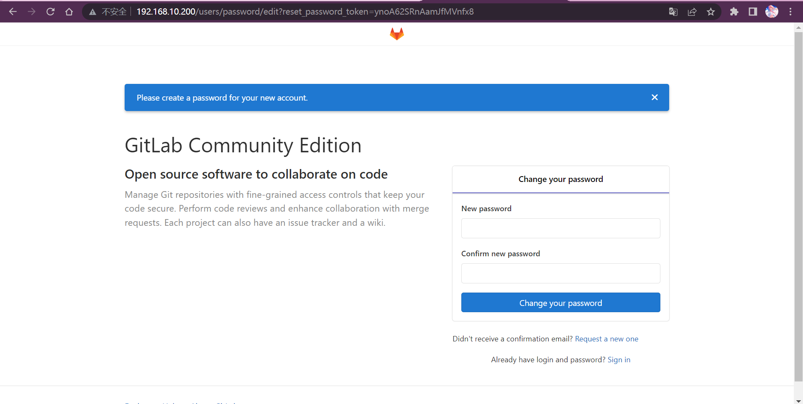
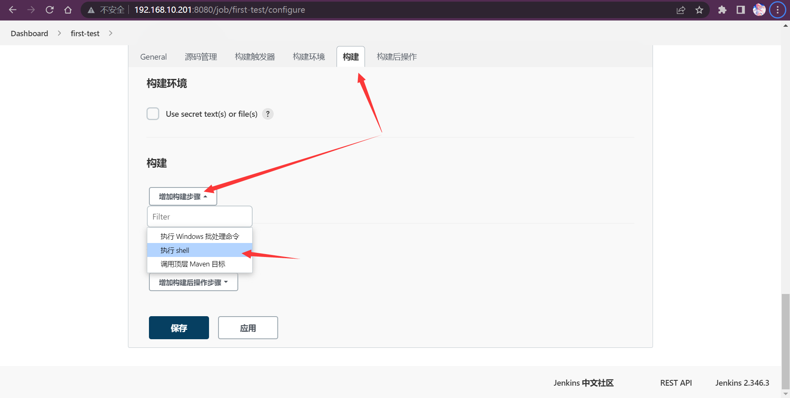

# 1、持续集成及Jenkins介绍


* 首先，开发人员每天进行代码提交，提交到Git仓库

* 后，Jenkins作为持续集成工具，使用Git工具到Git仓库拉取代码到集成服务器，再配合JDK，Maven等软件完成代码编译，代码测试与审查，测试，打包等工作，在这个过程中每一步出错，都重新再执行一次整个流程。

* 最后，Jenkins把生成的jar或war包分发到测试服务器或者生产服务器，测试人员或用户就可以访问应用。

# 2、Jenkins安装和持续集成环境配置

| 名称           | IP             | 内存 | 安装软件                                             |
| -------------- | -------------- | ---- | ---------------------------------------------------- |
| 代码托管服务器 | 192.168.10.200 | 6G   | Gitlab-12.4.2                                        |
| 持续集成服务器 | 192.168.10.201 | 1G   | Jenkins-2.190.3，JDK1.8，Maven3.6.2，Git， SonarQube |
| 应用测试服务器 | 192.168.10.202 | 1G   | JDK1.8，docker                                       |

## 2.1、Gitlab代码托管服务器安装

### Gitlab简介


官网：https://about.gitlab.com/

GitLab 是一个用于仓库管理系统的开源项目，使用Git作为代码管理工具，并在此基础上搭建起来的 web服务。

GitLab和GitHub一样属于第三方基于Git开发的作品，免费且开源（基于MIT协议），与Github类似，可以注册用户，任意提交你的代码，添加SSHKey等等。不同的是，GitLab是可以部署到自己的服务器上，数据库等一切信息都掌握在自己手上，适合团队内部协作开发，你总不可能把团队内部的智慧总放在别人的服务器上吧？简单来说可把GitLab看作个人版的GitHub。

### Gitlab安装

安装相关依赖

```perl
yum -y install policycoreutils openssh-server openssh-clients postfix
```

启动ssh服务&设置为开机启动

```perl
systemctl enable sshd && sudo systemctl start sshd
```

设置postfix开机自启，并启动，postfix支持gitlab发信功能

```perl
systemctl enable postfix && systemctl start postfix
```

开放ssh以及http服务，然后重新加载防火墙列表，如果关闭防火墙就不需要做以下配置

```perl
firewall-cmd --add-service=ssh --permanent firewall-cmd --add-service=http --permanent firewall-cmd --reload
```

下载gitlab包

```perl
wget https://mirrors.tuna.tsinghua.edu.cn/gitlab-ce/yum/el7/gitlab-ce-12.4.2-ce.0.el7.x86_64.rpm
```

*下载出现如下错误时，将https改为http*

```bash
Resolving mirrors.tuna.tsinghua.edu.cn (mirrors.tuna.tsinghua.edu.cn)... 101.6.15.130, 2402:f000:1:400::2
Connecting to mirrors.tuna.tsinghua.edu.cn (mirrors.tuna.tsinghua.edu.cn)|101.6.15.130|:443... connected.
ERROR: cannot verify mirrors.tuna.tsinghua.edu.cn's certificate, issued by ‘/C=US/O=Let's Encrypt/CN=R3’:
  Issued certificate has expired.
```

安装gitlab

```perl
rpm -i gitlab-ce-12.4.2-ce.0.el7.x86_64.rpm
```

修改gitlab配置

```perl
vi /etc/gitlab/gitlab.rb
```

修改gitlab访问地址和端口，默认为80

> external_url '192.168.10.200'
>
> nginx['listen_port'] = 80

重载配置及启动gitlab

```perl
gitlab-ctl reconfigure 
gitlab-ctl restart
```

把端口添加到防火墙

```perl
firewall-cmd --zone=public --add-port=6666/tcp --permanent
firewall-cmd --reload
```

启动成功后，看到以下修改管理员root密码的页面，修改密码后，然后登录即可

*访问不出来时可尝试清空缓存等操作*

```perl
root/1qaz@WSX
```



### Gitlab添加组、创建用户、创建项目

创建组

> 使用管理员 root 创建组，一个组里面可以有多个项目分支，可以将开发添加到组里面进行设置权限，不同的组就是公司不同的开发项目或者服务模块，不同的组添加不同的开发即可实现对开发设置权限的管理


创建用户

> 创建用户的时候，可以选择Regular或Admin类型。


*创建完用户后，立即修改密码*

```perl
neptune/1qaz!QAZ
```


将用户添加到组中

> 选择某个用户组，进行Members管理组的成员


Gitlab用户在组里面有5种不同权限：

> Guest：可以创建issue、发表评论，不能读写版本库 
>
> Reporter：可以克隆代码，不能提交，QA、PM 可以赋予这个权限
>
> Developer：可以克隆代码、开发、提交、push，普通开发可以赋予这个权限
>
> Maintainer：可以创建项目、添加tag、保护分支、添加项目成员、编辑项目，核心开发可以赋予这个权限 
>
> Owner：可以设置项目访问权限 - Visibility Level、删除项目、迁移项目、管理组成员，开发组组长可以赋予这个权限


在用户组中创建项目

> 以刚才创建的新用户身份登录到Gitlab，然后在用户组中创建新的项目


## 2.2、源码上传到Gitlab仓库

下面来到IDEA开发工具，我们已经准备好一个简单的Web应用准备到集成部署。

我们要把源码上传到Gitlab的项目仓库中。


### 项目结构说明

### 开启版本控制

提交代码到本地仓库先Add到缓存区，再Commit到本地仓库


### 推送到Gitlab项目仓库中


这时从Gitlab的项目中拷贝url地址


输入gitlab的用户名和密码，然后就可以把代码推送到远程仓库啦

```perl
neptune/1qaz!QAZ
```


刷新gitlab项目


*提交成功*

## 2.3、Jenkins安装

### 安装Java环境

安装JDK，Jenkins需要依赖JDK，所以先安装JDK1.8，高版本Jenkins需要java11虽然java8也能用（Warn）

```perl
yum install java-1.8.0-openjdk* -y
```

### 获取jenkins安装包

下载页面：https://jenkins.io/zh/download/


一些帮助文档


### 启动Jenkins

把war包上传到服务器

```perl
java -jar jenkins.war
```


Jenkins相关的文件目录位置在/root/.jenkins目录下

浏览器访问http://192.168.10.201:8080


获取并输入admin账户密码

```perl
cat /root/.jenkins/secrets/initialAdminPassword
```

跳过插件安装


因为Jenkins插件需要连接默认官网下载，速度非常慢，而且经过会失败，所以暂时先跳过插件安装


添加一个管理员账户，并进入Jenkins后台


添加用户：neptune/1qaz!QAZ

保存并完成


开始使用Jenkins


## 2.4、Jenkins插件管理

### 修改Jenkins插件下载地址

Jenkins->Manage Jenkins->Manage Plugins，点击Available，*秒加载出来可不替换源*


这样做是为了把Jenkins官方的插件列表下载到本地，接着修改地址文件

```perl
cd /root/.jenkins/updates
cp default.json default.json.bak

修改default.json文件
sed -i 's/http:\/\/updates.jenkinsci.org\/download/https:\/\/mirrors.tuna.tsinghua.edu.cn\/jenkins/g' default.json && sed -i 's/http:\/\/www.google.com/https:\/\/www.baidu.com/g' default.json
```

替换为国内插件地址后，Manage Plugins点击Advanced，把Update Site改为国内插件下载地址

修改URL为：https://mirrors.tuna.tsinghua.edu.cn/jenkins/updates/update-center.json


Sumbit后，在浏览器输入：http://192.168.10.201:8080/restart，重启Jenkins

### 下载中文汉化插件

Jenkins->Manage Jenkins->Manage Plugins，点击Available，搜索"Chinese"


安装成功


## 2.5、Jenkins用户权限管理

可以利用Role-based Authorization Strategy 插件来管理Jenkins用户权限

暂时用不到，略过

## 2.6、Jenkins凭证管理

凭据可以用来存储需要密文保护的数据库密码、Gitlab密码信息、Docker私有仓库密码等，以便Jenkins可以和这些第三方的应用进行交互。

### 安装Credentials Binding插件

要在Jenkins使用凭证管理功能，需要安装Credentials Binding插件

安装插件后，左边多了"凭证"菜单，在这里管理所有凭证


***高版本的在右上角用户的位置***


可以添加的凭证有5种：


* Username with password：用户名和密码
* SSH Username with private key： 使用SSH用户和密钥
* Secret file：需要保密的文本文件，使用时Jenkins会将文件复制到一个临时目录中，再将文件路径设置到一个变量中，等构建结束后，所复制的Secret file就会被删除。
* Secret text：需要保存的一个加密的文本串，如钉钉机器人或Github的api token 
* Certificate：通过上传证书文件的方式常用的凭证类型有：Username with password（用户密码）和SSH Username with private key（SSH 密钥）

**接下来以使用Git工具到Gitlab拉取项目源码为例，演示Jenkins的如何管理Gitlab的凭证**

安装Git插件和Git工具，为了让Jenkins支持从Gitlab拉取源码，需要安装Git插件以及在CentOS7上安装Git工具。

### 安装Git及Git插件

Jenkins安装git插件：略

CentOS7上安装Git工具

```perl
yum install git -y 
git --version 
```

### 用户密码类型

#### 创建凭证

Jenkins->凭证->系统->全局凭证->添加凭证


#### 测试凭证是否可用

*创建一个FreeStyle项目：新建Item->FreeStyle Project->确定*


*找到"源码管理"->"Git"，在Repository URL复制Gitlab中的项目URL*


*这时会报错说无法连接仓库！*


*在Credentials选择刚刚添加的凭证就不报错啦*


*保存配置后，点击构建”Build Now“ 开始构建项目*


*查看构建详情*


*查看控制台输出*


*构建成功*


*查看服务器目录，发现已经从Gitlab成功拉取了代码到 Jenkins中。*


### SSH密钥类型（**失败，暂不使用**）

SSH免密登录示意图


#### 使用root用户生成公钥和私钥

```perl
 ssh-keygen -t rsa
```

在/root/.ssh/目录保存了公钥和使用


`id_rsa`：私钥文件 

`id_rsa.pub`：公钥文件

#### 把生成的公钥放在Gitlab中

Gitlab使用==root==账户登录->点击头像->Settings->SSH Keys 复制刚才id_rsa.pub文件的内容到这里，点击"Add Key"


#### 在Jenkins中添加凭证，配置私钥

在Jenkins添加一个新的凭证，类型为"SSH Username with private key"，把刚才生成私有文件内容复制过来


#### 测试凭证是否可用

新建"test02"项目->源码管理->Git，这次要使用Gitlab的SSH连接，并且选择SSH凭证


==理论可以，此处失败，略过==


构建项目，如果代码可以正常拉取，代表凭证配置成功！

### 2.7、maven的安装与配置

#### 安装maven

下载maven


将安装包上传到服务器

```perl
tar -zxvf apache-maven-3.9.0-bin.tar.gz -C /opt/module/
mv /opt/module/apache-maven-3.9.0 /opt/module/maven
```

配置环境变量

```perl
vim /etc/profile

export JAVA_HOME=/usr/lib/jvm/java-1.8.0-openjdk
export MAVEN_HOME=/opt/module/maven
export PATH=$PATH:$JAVA_HOME/bin:$MAVEN_HOME/bin

source /etc/profile
mvn -v
```

修改配置文件settings.xml，修改镜像源为阿里云

```perl
#创建maven仓库地址
mkdir -p /data/maven/repo
```

修改settings.xml文件

```xml
 <localRepository>/data/maven/repo</localRepository>	

	<mirror>
		<id>nexus-aliyun</id>
		<mirrorOf>central</mirrorOf>
		<name>Nexus aliyun</name>
		<url>http://maven.aliyun.com/nexus/content/groups/public</url>
	</mirror>
	    <mirror>
        <id>central-repository</id>
        <mirrorOf>*</mirrorOf>
        <name>Central Repository</name>
        <url>http://central.maven.org/maven2/</url>
    </mirror>
```


#### 全局工具配置关联JDK和Maven

Jenkins->Global Tool Configuration->JDK->新增JDK，配置如下：


Jenkins->Global Tool Configuration->Maven->新增Maven，配置如下：


Jenkins->Global Tool Configuration->Maven 配置，配置如下：


#### 添加Jenkins全局变量

Manage Jenkins->Configure System->Global Properties ，添加三个全局变量

```properties
JAVA_HOME=/usr/lib/jvm/java-1.8.0-openjdk
M2_HOME=/opt/module/maven
PATH+EXTRA=$M2_HOME/bin
```


#### 测试Maven是否配置成功

使用之前的gitlab密码测试项目，修改配置

构建->增加构建步骤->Execute Shell



执行mvn clean package先清理再打包


再次构建，如果可以把项目打成jar包，代表maven环境配置成功啦！


# 3、Jenkins构建Maven项目

### 自由风格项目构建

创建项目

                                                 [ ](af://n611/)

配置源码管理，从gitlab拉取代码


编译打包                                                               [ ](af://n617/)

构建->添加构建步骤->Executor Shell

```perl
mvn clean package
scp /root/.jenkins/workspace/test-docker/target/start-gitlab-0.0.1-SNAPSHOT.jar 192.168.10.202:/root/service
ssh 192.168.10.202 java -jar /root/service/start-gitlab-0.0.1-SNAPSHOT.jar
```


发送到测试服务器上


部署成功


### Maven项目构建

安装Maven Integration插件

创建Maven项目


配置项目拉取代码和远程部署的过程和自由风格项目一样，只是"构建"部分不同


