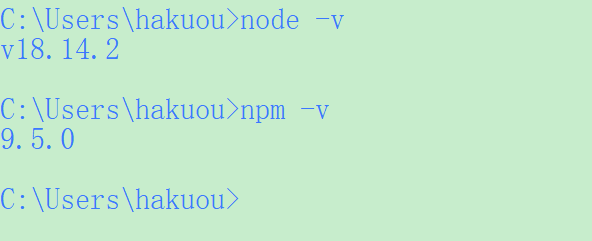

# 1、安装和配置node.js 

下载地址：https://nodejs.org/zh-cn/

Node.js会同步安装npm，安装完成后，启动cmd测试下是否安装成功。

```perl
node -v
npm -v
```



# 2、安装vue.js

-g是全局安装命令，将安装到步骤1.2配置的安装路径【C:\Program Files\nodejs\NodeGlobal】

```perl
npm install vue -g
```

查看是否安装成功

```perl
npm list vue
```

# 3、安装webpack

```perl
#安装webpack
npm install webpack -g
#安装webpack-cli
npm install --global webpack-cli
#查看webpack版本
webpack -v
```

# 4、安装vue-cli

```perl
#安装vue-cli
npm install vue-cli -g
#安装router
npm install -g vue-router
#查看版本命令
vue -V
```

# 5、创建vue工程

创建工程的存放路径，比如E:\Projects\Vue,启动cmd，执行cd命令进入路径【E:\Projects\Vue】（如果不指定路径，会默认创建到【C:\Users\Administrator\】下）

执行命令：vue init webpack myproject，【myproject】是你的工程名称，不能使用中文和大写字母。

```perl
vue init webpack myproject
```

```perl
执行成功后会出来配置选项：
Project name: 回车确认

Project description：项目介绍，可不填写，回车确认

Author：输入作者姓名后回车

Vue build：询问编译打包的方式，有runtime-compiler、 runtime-only两种选择，上下键选择runtime-only后回车；

Install vue-router：询问是否安装 vue-router，输入y后回车；

Use ESLint to lint your code ：询问是否使用ESLint检测代码错误，输入n后回车；

Set up unit tests：询问是否配置单元测试 工具，输入n后回车；

Setup e2e tests with Nightwatch：询问是否需要端到端测试工具Nightwatch，输入n后回车；

Should we run npm install for you after the project has been created? (recommended) (Use arrow keys)：询问 安装依赖npm install，直接回车确认。

  之后开始执行安装依赖包，最后会提示：Project initialization finished!
```

3.2 启动运行vue工程示例

  cmd 在工程路径下，执行命令：

```perl
npm run dev
```

  按照提示打开网页输入【http://localhost:8080】，显示网页如下则创建成功：
