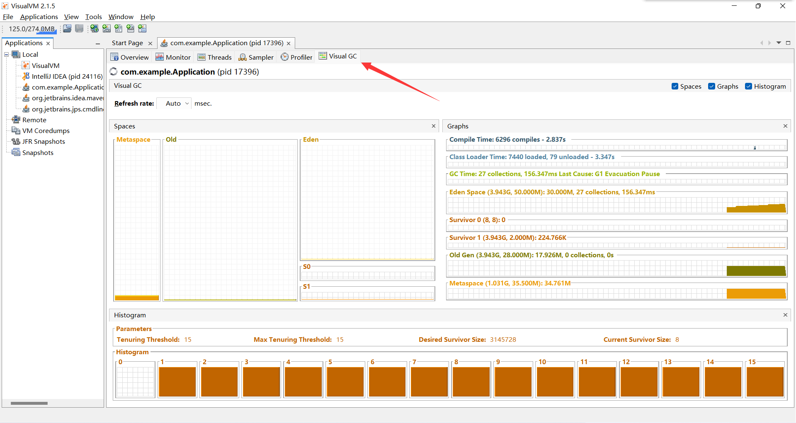

# 1、性能监控

## 1.1 jvm内存模型

* `程序计数器 Program Counter Register：`

  * 记录的是正在执行的虚拟机字节码指令的地址，

  * 此内存区域是*唯一* 一个在JAVA虚拟机规范中*没有规定任何OutOfMemoryError的区域*

* `虚拟机栈：VM Stack`
  * 描述的是 JAVA 方法执行的内存模型，每个方法在执行的时候都会创建一个栈帧，用于存储局部变量表，操作数栈，动态链接，方法接口等信息
  * 局部变量表存储了编译期可知的各种基本数据类型、对象引用
  * 线程请求的栈深度不够会报 **StackOverflowError** 异常
  * 栈动态扩展的容量不够会报 **OutOfMemoryError** 异常
  * 虚拟机栈是线程隔离的，即每个线程都有自己独立的虚拟机栈

* `本地方法栈：Native Stack`
  * 本地方法栈类似于虚拟机栈，只不过本地方法栈使用的是本地方法

* `堆：Heap`
  * 几乎所有的对象实例都在堆上分配内存


> 我们编写的java文件被编译成class文件
>
> class文件会被jvm的类装载器装载到jvm里，所有的数据都在运行时数据区
>
> **优化的大部分都在运行时数据区**
>
> 所有数据装载完毕后，由jvm的执行引擎执行
>
> 大致了解即可：
>
> * 线程隔离数据区：
>   * 在虚拟机栈里执行方法的调用（入栈出栈）
>   * 本地方法栈是操作系统暴露的（本地库接口和本地方法库）
>   * 程序计数器：每个方法执行到哪了，程序走到哪一行了
> * 方法区和堆共享：
>   * 程序运行所需要的对象数据
>
> **==优化的大部分在堆，调优内存都是在调堆==**


堆区：所有实例的创建，数组长度的分配都在堆区，==重点优化==

元数据区：直接操作物理内存

CodeCache：编译期间所有的代码缓存所在，*偶尔会优化此处*

## 1.2 堆

所有的对象实例以及数组都要在堆上分配。堆是垃圾收集器管理的主要区域，也被称为“GC堆”；也是我们优化最多考虑的地方。

堆可以细分为：

* 新生代
  * Eden 空间（伊甸园）
  * From Survivor 空间（幸存者）
  * To Survivor 空间（幸存者）

* 老年代

* 永久代/元空间
  * Java8 以前永久代，受 jvm 管理，java8 以后元空间，直接使用物理内存。因此，默认情况下，元空间的大小仅受本地内存限制。

### 垃圾回收

*垃圾回收是在堆区进行的，将没用的对象及时回收掉，释放空间给新对象*


从 **Java8** 开始，**HotSpot 已经完全将永久代**（Permanent Generation）**移除**，**取而代之的是**一个新的区域—**元空间**（MetaSpace），元空间不占用jvm内存，直接使用物理内存。


上图：左侧Young Generation（新生代），右侧Tenured Generation（老年代）

老年代存放，生命力持久的旧对象和大对象

---

* 新创建的对象，先去新生代的伊甸园区分配内存，
  * 若伊甸园区内存足够，则分配一块内存给对象
  * 若伊甸园区内存不足，则进行一次YGC（Young GC，新生代垃圾回收，小GC）
* `YGC`：将伊甸园区未使用的对象踢出去（清理），仍在使用的对象放入幸存者区
  * 旧对象在每次YGC后都长一岁，年龄超过阈值时，将移入老年代
* YGC后Eden内存足够则分配内存，内存不足则来到老年代
  * 若老年代内存足够，则分配一块内存给对象
  * 若老年代内存不足，则进行一次FGC（FULL GC，全面GC，大GC）
* `FGC`：将新生代和老年代未使用的对象踢出去（清理）
* FGC后，老年代内存足够则分配内存，内存不足则**OOM**（内存溢出异常）

MinorGC比较快，**FULL GC慢（消耗时间是MinorGC的10倍）**，我们的应用应**尽量避免FULL GC的发生**

性能优化期间，关注新生代和老年代的变化，并进行相应的调优

*具体流程如下：*


## 1.3 jconsole 与 jvisualvm

Jdk 的两个小工具 jconsole、jvisualvm（升级版的 jconsole）;通过命令行启动，可监控本地和远程应用。远程应用需要配置

### 1.3.1 jconsole

Win+r，cmd

```powershell
jconsole
```

*选择Java进程*


*连接*


*概览*


*内存*


### **1.3.2 jvisualvm（推荐使用）** 

==用于监控内存泄露，跟踪垃圾回收，执行时内存、cpu 分析，线程分析...==

==注意jdk9及以上版本，不会再自动集成 *VisualVM*，需单独下载。==

***jdk8：***

win+r，cmd

```powershell
jvisualvm
```

***jdk9及以上：***

下载地址：https://visualvm.github.io/index.html

*解压完成后修改配置文件*


*添加jdk路径*

```powershell
C:\Users\hakuou>set|findstr /i "JAVA_HOME"
JAVA_HOME=C:\Program Files\Java\jdk-17.0.5
```


*将bin目录添加到环境变量*


*终端输入visualvm即可启动*


*参数信息*


*监控信息*


*线程状态*

`Running`：运行，正在运行的

`Sleeping`：休眠，调用sleep()方法

`Wait`：等待，调用wait()方法

`Park`：驻留，线程池里面的空闲线程线（等待任务的线程）

`Monitor`：监视，阻塞的线程，线程存在锁竞争，正在等待锁的释放


### 1.3.2 安装插件方便查看gc

* Cmd 启动 jvisualvm
* 工具 $\rightarrow$ 插件

* 如果 503 错误解决：

  * 打开网址 https://visualvm.github.io/pluginscenters.html

  * cmd 查看自己的 jdk 版本，找到对应的

     

  * 复制下面查询出来的链接。并重新设置上即可


* 若无报错


* 安装完成后需退出重新打开




## 1.4 监控指标

### 1.4.1 中间件指标

常用中间件例如Tomcat、Weblogic等指标主要包括JVM，ThreadPool，JDBC，具体如下：

<table>
    <tr>
        <th> 一级指标</th>
        <th> 二级指标</th>
        <th> 单位</th>
        <th>解释</th>
    </tr>
    <tr>
    <td rowspan=5>GC</td>
        <td>GC频率</td>
        <td>每秒多少次</td>
        <td>java虚拟机垃圾部分回收频率</td>
    </tr>
    <tr>
        <td>FULL GC频率</td>
        <td>每小时多少次</td>
        <td>java虚拟机垃圾完全回收频率</td>
    </tr>
    <tr>
        <td>FULL GC平均时长</td>
        <td>秒</td>
        <td>用于垃圾完全回收的平均时长</td>
    </tr>
    <tr>
        <td>FULL GC最大时长</td>
        <td>秒</td>
        <td>用于垃圾完全回收的最大时长</td>
    </tr>
    <tr>
        <td>堆使用率</td>
        <td>百分比</td>
        <td>堆使用率</td>
    </tr>
    <tr>
        <td rowspan=2>ThreadPool</td>
        <td>Active Thread Count</td>
        <td>个</td>
        <td>活动线程数</td>
    </tr>
    <tr>
        <td>Pending User Request</td>
        <td>个</td>
        <td>处于排队的用户请求个数</td>
    </tr>
    <tr>
        <td>JDBC</td>
        <td>JDBC Active Connection</td>
        <td>个</td>
        <td>JDBC活动连接数</td>
    </tr>

* 当前正在运行的线程数不能超过设定的最大值。一般情况下系统性能较好的情况下，线程数最小值设置 50 和最大值设置 200 比较合适。

* 当前运行的 JDBC 连接数不能超过设定的最大值。一般情况下系统性能较好的情况下，JDBC 最小值设置 50 和最大值设置 200 比较合适。

* *GC频率不能频繁，特别是 FULL GC 更不能频繁，一般情况下系统性能较好的情况下，JVM 最小堆大小和最大堆大小分别设置 1024M 比较合适。*

### 1.4.2 数据库指标

常用的数据库例如MySQL指标主要包括SQL、吞吐量、缓存命中率、连接数等，具体如下：

<table>
    <tr>
        <th>一级指标</th>
        <th>二级指标</th>
        <th>单位</th>
        <th>解释</th>
    </tr>
    <tr>
        <td>SQL</td>
        <td>耗时</td>
        <td>微秒</td>
        <td>执行SQL耗时</td>
    </tr>
    <tr>
        <td rowspan=2>GC</td>
        <td>QPS</td>
        <td>个</td>
        <td>每秒查询次数</td>
    </tr>
    <tr>
        <td>TPS</td>
        <td>个</td>
        <td>每秒事务次数</td>
    </tr>
    <tr>
        <td rowspan=5>命中率</td>
        <td>Key Buffer命中率</td>
        <td>百分之</td>
        <td>索引缓冲区命中率</td>
    </tr>
    <tr>
        <td>InnoDB Buffer命中率</td>
        <td>百分之</td>
        <td>InnoDB缓冲区命中率</td>
    </tr>
    <tr>
        <td>Query Cache命中率</td>
        <td>百分之</td>
        <td>查询缓存命中率</td>
    </tr>
    <tr>
        <td>Table Cache命中率</td>
        <td>百分之</td>
        <td>表缓存命中率</td>
    </tr>
    <tr>
        <td>Thread Cache命中率</td>
        <td>百分之</td>
        <td>线程缓存命中率</td>
    </tr>
    <tr>
        <td rowspan=2>锁</td>
        <td>等待次数</td>
        <td>次</td>
        <td>锁等待次数</td>
    </tr>
    <tr>
        <td>等待时间</td>
        <td>微秒</td>
        <td>锁等待时间</td>
    </tr>
</table>

* SQL 耗时越小越好，一般情况下微秒级别。

* 命中率越高越好，一般情况下不能低于 95%。

* 锁等待次数越低越好，等待时间越短越好。

### 1.4.3 测试

**visualvm远程连接时需设置**

```bash
java -Djava.rmi.server.hostname=192.168.10.130 \
-Dcom.sun.management.jmxremote.port=1232 \
-Dcom.sun.management.jmxremote.rmi.port=1240 \
-Dcom.sun.management.jmxremote.ssl=false \
-Dcom.sun.management.jmxremote.authenticate=false \
-jar starter-0.0.1-SNAPSHOT.jar
```


**结果**

| 压测内容                               | 压测线程数 | 吞吐量/s            | 90%响应时间/ms | 99%响应时间/ms |
| -------------------------------------- | ---------- | ------------------- | -------------- | -------------- |
| Nginx                                  | 50         | 5680                | 12             | 19             |
| GateWay                                | 50         | 10367               | 8              | 31             |
| 简单服务（hello）                      | 50         | 15321               | 4              | 12             |
| 首页一级菜单渲染                       | 50         | 270（db,Thymeleaf） | 267            | 365            |
| 首页渲染（开缓存）                     | 50         | 290                 | 251            | 365            |
| 首页渲染（开缓存、优化数据库、关日志） | 50         | 700                 | 105            | 183            |
| 三级分类数据获取                       | 50         | 2（db）/8（加索引） | ...            | ...            |
| 三级分类（优化业务）                   | 50         | 111                 | 571            | 896            |
| 三级分类（使用redis作为缓存）          | 50         | 411                 | 153            | 217            |
| 首页全量数据获取                       | 50         | 7（静态资源）       | ...            | ...            |
| Gateway+简单服务                       | 50         | 3126                | 30             | 125            |
| 全链路                                 | 50         | 800                 | 88             | 310            |

* 中间件越多，性能损失越大，大多都损失在网络交互了；

* 业务：
  * Db（MySQL 优化）
  * 模板的渲染速度（缓存）
  * 静态资源

**Nginx动静分离，静态资源放在nginx主机上**

```perl
location /static/ {
#静态资源存放在nginx主机的/usr/share/nginx/html/static目录下
	root	/usr/share/nginx/html;
}

location / {
#nginx转发时会丢失请求头
	proxy_set_header Host $host;
	proxy_pass http://gulimall;
}
```


## 1.5 JVM 分析&调优

> jvm 调优，调的是稳定，并不能带给你性能的大幅提升。服务稳定的重要性就不用多说了，
>
> 保证服务的稳定，gc 永远会是 Java 程序员需要考虑的不稳定因素之一。
>
> 复杂和高并发下的服务，必须保证每次 gc 不会出现性能下降，各种性能指标不会出现波动，
>
> gc 回收规律而且干净，找到合适的 jvm 设置。Full gc 最会影响性能，根据代码问题，避免 full gc 频率。
>
> 可以适当调大年轻代容量，让大对象可以在年轻代触发 yong gc，调整大对象在年轻代的回收频次，
>
> 尽可能保证大对象在年轻代回收，减小老年代缩短回收时间；

### 1.5.1 几个常用工具

| 名称   | 作用                                                         |
| ------ | ------------------------------------------------------------ |
| jstack | 查看 jvm 线程运行状态，是否有死锁现象等等信息                |
| jinfo  | 可以输出并修改运行时的 java 进程的 opts。                    |
| jps    | 与 unix 上的 ps 类似，用来显示本地的 java 进程，可以查看本地运行着几个 java程序，并显示他们的进程号。 |
| jstat  | 一个极强的监视 VM 内存工具。可以用来监视 VM 内存内的各种堆和非堆的大小及其内存使用量。 |
| jmap   | 打印出某个 java 进程（使用 pid）内存内的所有'对象'的情况（如：产生那些对象，及其数量） |

### 1.5.2 命令示例

jstat 工具特别强大，有众多的可选项，详细查看堆内各个部分的使用量，以及加载类的数量。使用时，需加上查看进程的进程 id，和所选参数。

***在使用这些工具前，先用 JPS 命令获取当前的每个 JVM 进程号，然后选择要查看的 JVM。***

| 命令                       | 作用                                                 |
| -------------------------- | ---------------------------------------------------- |
| `jstat -class pid`         | 显示加载 class 的数量，及所占空间等信息              |
| `jstat -compiler pid`      | 显示 VM 实时编译的数量等信息。                       |
| **`jstat -gc pid`**        | 可以显示 gc 的信息，查看 gc 的次数，及时间           |
| `jstat -gccapacity pid`    | 堆内存统计，三代（young,old,perm）内存使用和占用大小 |
| `jstat -gcnew pid`         | 新生代垃圾回收统计                                   |
| `jstat -gcnewcapacity pid` | 新生代内存统计                                       |
| `jstat -gcold pid`         | 老年代垃圾回收统计                                   |

除了以上一个参数外，还可以同时加上两个数字，

如：`jstat -printcompilation 3024 250 6` 是每 250 毫秒打印一次，一共打印 6 次，

还可以加上`-h3` 每三行显示一下标题。

`jstat -gcutil pid 1000 100 : 1000ms` 统计一次 gc 情况统计 100 次；

---

> jinfo 是 JDK 自带的命令，可以用来查看正在运行的 java 应用程序的扩展参数，
>
> 包括 JavaSystem 属性和 JVM 命令行参数；也可以动态的修改正在运行的 JVM 一些参数。
>
> 当系统崩溃时，jinfo 可以从 core 文件里面知道崩溃的 Java 应用程序的配置信息

| 命令                         | 作用                                                  |
| ---------------------------- | ----------------------------------------------------- |
| `jinfo pid`                  | 输出当前 jvm 进程的全部参数和系统属性                 |
| `jinfo -flag name pid`       | 可以查看指定的 jvm 参数的值；打印结果：-无此参数，+有 |
| `jinfo -flag [+|-]name pid`  | 开启或者关闭对应名称的参数（无需重启虚拟机）          |
| `jinfo -flag name=value pid` | 修改指定参数的值                                      |
| `jinfo -flags pid`           | 输出全部的参数                                        |
| `jinfo -sysprops pid`        | 输出当前 jvm 进行的全部的系统属性                     |

> jmap 可以生成 heap dump 文件，也可以查看堆内对象分析内存信息等，如果不使用这个命令，
>
> 还可以使用-XX:+HeapDumpOnOutOfMemoryError 参数来让虚拟机出现 OOM 的时候自动生成 dump 文件。

| 命令                                           | 作用                                                         |
| ---------------------------------------------- | ------------------------------------------------------------ |
| `jmap -dump:live,format=b,file=dump.hprof pid` | dump 堆到文件，format 指定输出格式，live 指明是活着的对象，file 指定文件名。eclipse 可以打开这个文件 |
| `jmap -heap pid`                               | 打印 heap 的概要信息，GC 使用的算法，heap 的配置和使用情况，可以用此来判断内存目前的使用情况以及垃圾回收情况 |
| `jmap -finalizerinfo pid`                      | 打印等待回收的对象信息                                       |
| `jmap -histo:live pid`                         | 打印堆的对象统计，包括对象数、内存大小等。`jmap -histo:live` 这个命令执行，***JVM 会先触发gc***，然后再统计信息 |
| `jmap -clstats pid`                            | 打印 Java 类加载器的智能统计信息，对于每个类加载器而言，对于每个类加载器而言，它的名称，活跃度，地址，父类加载器，它所加载的类的数量和大小都会被打印。此外，包含的字符串数量和大小也会被打印。 |
| `jmap -F -histo pid`                           | ***-F*** 强制模式。如果指定的 pid 没有响应，请使用 jmap -dump 或 jmap -histo 选项。此模式下，不支持 live 子选项。 |
| `jstack pid`                                   | 输出当前 jvm 进程的全部参数和系统属性                        |

***jstack 是 jdk 自带的线程堆栈分析工具，使用该命令可以查看或导出 Java 应用程序中线程堆栈信息。***

### 1.5.3 调优项

官方文档：https://docs.oracle.com/javase/8/docs/technotes/tools/unix/java.html#BGBCIEFC

# 2、压力测试

* 微服务模块上线前后经过压力测试再投入正常使用

* 压力测试考察*当前软硬件环境*下系统所能承受的最大负荷并帮助找出*系统瓶颈*所在。压测都是为了系统在线上的处理能力和稳定性维持在一个标准范围内，做到心中有数。

* 使用压力测试，我们有希望找到很多种用其他测试方法更难发现的错误。有两种错误类型是:**内存泄漏，并发与同步**。

* 有效的压力测试系统将应用以下这些关键条件:**重复**，**并发**，**量级**，**随机变化**。

## 2.1 性能指标

* `响应时间（Response Time: RT）`：响应时间指用户从客户端发起一个请求开始，到客户端接收到从服务器端返回的响应结束，整个过程所耗费的时间。
*  HPS（Hits Per Second） ：每秒点击次数，单位是次/秒。**一般不关注此项**
*  `TPS（Transaction per Second）`：系统每秒处理交易数（整个业务完成），单位是笔/秒。
*  `QPS（Query per Second）`：系统每秒处理查询次数，单位是次/秒。对于互联网业务中，如果某些业务有且仅有一个请求连接，那么 TPS=QPS=HPS，一般情况下用 TPS 来衡量整个业务流程，用 QPS 来衡量接口查询次数，用 HPS 来表示对服务器单击请求。
*  无论 TPS、QPS、HPS，此指标是衡量系统处理能力非常重要的指标，越大越好，根据经
  验，一般情况下：
  金融行业：1000TPS~50000TPS，不包括互联网化的活动
  保险行业：100TPS~100000TPS，不包括互联网化的活动
  制造行业：10TPS~5000TPS
  互联网电子商务：10000TPS~1000000TPS
  互联网中型网站：1000TPS~50000TPS
  互联网小型网站：500TPS~10000TPS
*  `最大响应时间（Max Response Time）` ：指用户发出请求或者指令到系统做出反应（响应）
  的最大时间。
*  `最少响应时间（Mininum ResponseTime）` ：指用户发出请求或者指令到系统做出反应（响
  应）的最少时间。
*  `90%响应时间（90% Response Time）` ：是指所有用户的响应时间进行排序，第 90%的响
  应时间。（*ps：90%的用户可以在1s内响应*）
*  从外部看，性能测试主要关注如下三个指标
  *吞吐量*：每秒钟系统能够处理的请求数、任务数。
  *响应时间*：服务处理一个请求或一个任务的耗时。
  *错误率*：一批请求中结果出错的请求所占比例。

## 2.2 JMeter

### 2.2.1 Jmeter安装

https://jmeter.apache.org/download_jmeter.cgi

下载对应的压缩包，解压运行 jmeter.bat 即可

### 2.2.2 JMeter 压测示例

*切换语言*


#### 添加线程组

*右键Test Plan*


线程组参数详解：

* `线程数`：虚拟用户数。一个虚拟用户占用一个进程或线程。设置多少虚拟用户数在这里也就是设置多少个线程数。

* `Ramp-Up Period(in seconds)准备时长`：设置的虚拟用户数需要多长时间全部启动。如果线程数为 10，准备时长为 2，那么需要 2 秒钟启动 10 个线程，也就是每秒钟启动 5 个线程。
* `循环次数`：每个线程发送请求的次数。如果线程数为 10，循环次数为 100，那么每个线程发送 100 次请求。总请求数为 10*100=1000 。如果勾选了“永远”，那么所有线程会一直发送请求，一到选择停止运行脚本。
* `Delay Thread creation until needed`：直到需要时延迟线程的创建。

* `调度器`：设置线程组启动的开始时间和结束时间(配置调度器时，需要勾选循环次数为永远)

* `持续时间（秒）`：测试持续时间，会覆盖结束时间

* `启动延迟（秒）`：测试延迟启动时间，会覆盖启动时间

* `启动时间`：测试启动时间，启动延迟会覆盖它。当启动时间已过，手动只需测试时当前时间也会覆盖它。

* `结束时间`：测试结束时间，持续时间会覆盖它。

#### 添加取样器（HTTP请求）


#### 添加监听器

**结果树、汇总报告、聚合报告最常用**


#### 启动压测&查看分析结果

*结果树*


*汇总报告*


*聚合报告*


*汇总图*


#### 结果分析

* 有错误率同开发确认，确定是否允许错误的发生或者错误率允许在多大的范围内；

* Throughput 吞吐量每秒请求的数大于并发数，则可以慢慢的往上面增加；若在压测的机器性能很好的情况下，出现吞吐量小于并发数，说明并发数不能再增加了，可以慢慢的往下减，找到最佳的并发数；

* 压测结束，登陆相应的 web 服务器查看 CPU 等性能指标，进行数据的分析;

* 最大的 tps，不断的增加并发数，加到 tps 达到一定值开始出现下降，那么那个值就是最大的 tps。

* 最大的并发数：最大的并发数和最大的 tps 是不同的概率，一般不断增加并发数，达到一个值后，服务器出现请求超时，则可认为该值为最大的并发数。

* 压测过程出现性能瓶颈，若压力机任务管理器查看到的 cpu、网络和 cpu 都正常，未达到 90%以上，则可以说明服务器有问题，压力机没有问题。

* **影响性能考虑点包括**：
  * 数据库、应用程序、中间件（tomact、Nginx）、网络和操作系统等方面

* 首先考虑自己的应用属于 **CPU** **密集型**还是 **IO** **密集型**

## 2.2.3 JMeter Address Already in use 错误解决

windows 本身提供的端口访问机制的问题。

Windows 提供给 TCP/IP 链接的端口为 *1024-5000*，并且要四分钟来循环回收他们。就导致我们在短时间内跑大量的请求时将端口占满了。

* cmd 中，用 regedit 命令打开注册表

* 在 HKEY_LOCAL_MACHINE\SYSTEM\CurrentControlSet\Services\Tcpip\Parameters 下，
  * 右击 parameters，添加一个新的 DWORD，名字为 MaxUserPort
  * 然后双击 MaxUserPort，输入数值数据为 65534，基数选择十进制（如果是分布式运行的话，控制机器和负载机器都需要这样操作哦）

* 修改配置完毕之后记得重启机器才会生效

https://support.microsoft.com/zh-cn/help/196271/when-you-try-to-connect-from-tcp-ports-greater-than-5000-you-receive-t

TCPTimedWaitDelay：30