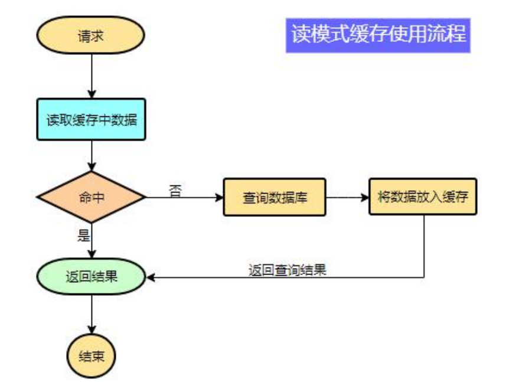
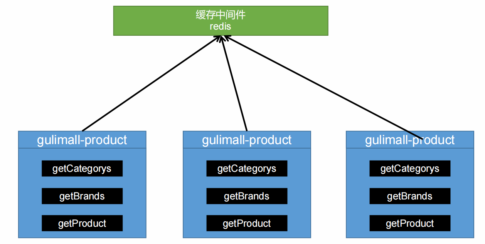

# 一、缓存

# 1、缓存使用

为了系统性能的提升，我们一般都会将部分数据放入缓存中，加速访问。而*数据库*承担数据落盘工作。

**哪些数据适合放入缓存？**

* **即时性、数据一致性要求不高的**

* **访问量大且更新频率不高的数据（读多，写少）**

> 举例：
>
> * 电商类应用，商品分类，商品列表等适合缓存并加一个失效时间(根据数据更新频率来定)，后台如果发布一个商品，买家需要 5 分钟才能看到新的商品一般还是可以接受的。
> * 快递物流信息



```java
data = cache.load(id);//从缓存加载数据
if(data == null){
	data = db.load(id);//从数据库加载数据
	cache.put(id,data);//保存到 cache 中
}
return data;
```

**注意：**==在开发中，凡是放入缓存中的数据我们都应该指定过期时间，使其可以在系统即使没有主动更新数据也能自动触发数据加载进缓存的流程。避免业务崩溃导致的数据永久不一致问题。==

**分布式缓存**



### 注意：

> 1、spring2.0以后默认使用lettuce作为操作redis的客户端。它使用netty进行网络通信。
>
> 2、lettuce的bug导致netty堆外内存溢出 -Xmx300m；netty如果没有指定堆外内存，默认使用-Xmx300m,可以通过-Dio.netty.maxDirectMemory进行设置
>
> 解决方案：不能使用-Dio.netty.maxDirectMemory只去调大堆外内存
>
> 1、*升级lettuce客户端*
>
> 2、*切换使用jedis*

# 2、整合 redis 作为缓存

引入redis-starter

```xml
<dependency>
<groupId>org.springframework.boot</groupId>
<artifactId>spring-boot-starter-data-redis</artifactId>
</dependency>
```

配置redis

使用 RedisTemplate 操作 redis

```java
@Autowired
StringRedisTemplate stringRedisTemplate;
@Test
public void testStringRedisTemplate(){
ValueOperations<String, String> ops = stringRedisTemplate.opsForValue();
ops.set("hello","world_"+ UUID.randomUUID().toString());
String hello = ops.get("hello");
System.out.println(hello);
}
```

切换使用 jedis

```xml
<dependency>
<groupId>org.springframework.boot</groupId>
<artifactId>spring-boot-starter-data-redis</artifactId>
<exclusions>
<exclusion>
<groupId>io.lettuce</groupId>
<artifactId>lettuce-core</artifactId>
</exclusion>
</exclusions>
</dependency>
<dependency>
<groupId>redis.clients</groupId>
<artifactId>jedis</artifactId>
</dependency>
```

