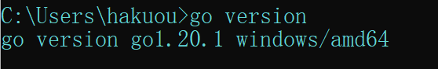
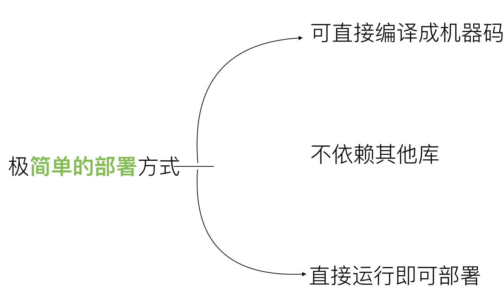
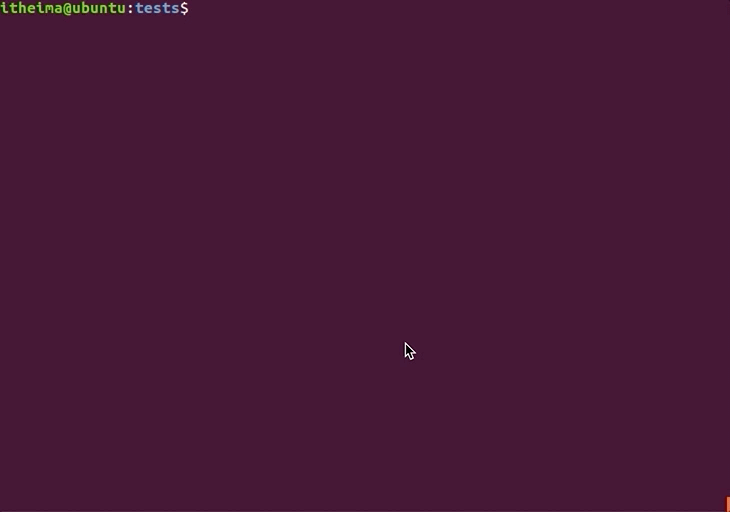
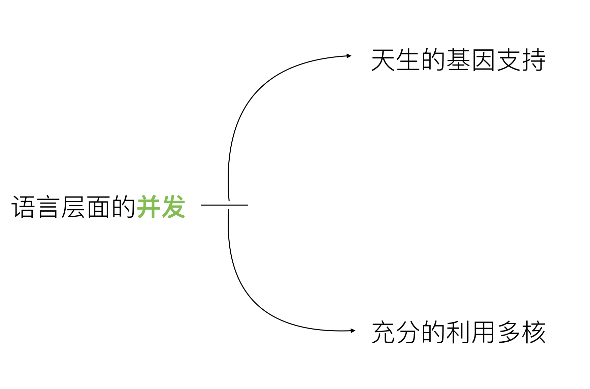
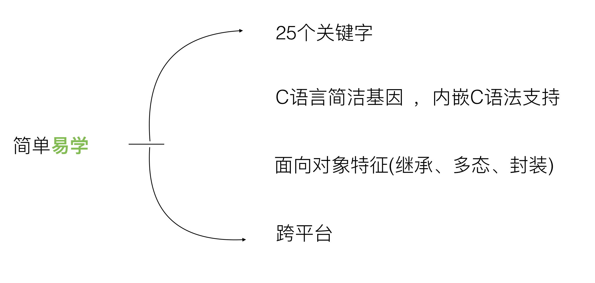

# 1、课程提纲


# 2、Golang开发环境

## 2.1 下载安装包

Go官网下载地址：`https://golang.org/dl/`

Go官方镜像站（推荐）：`https://golang.google.cn/dl/`

Windows选择msi后缀，next到底


## 2.2 配置环境变量

```powershell
GOPATH=I:\Code\GoLang
GOROOT=D:\Go
```



## 2.3 开发工具

* GoLand

注意设置`GOPATH`


* Vscode

需安装插件`Code Runner`和`Go`


# 3、Golang特性

### 3.1 Golang的优势





------




------




```go
package main
  
import (
    "fmt"
    "time"
)

func goFunc(i int) {
    fmt.Println("goroutine ", i, " ...")
}

func main() {
    for i := 0; i < 10000; i++ {
        go goFunc(i) //开启一个并发协程
    }

    time.Sleep(time.Second)
}
```


------


------



------


### 3.2 Golang适合做什么

**(1)云计算基础设施领域**

代表项目：docker、kubernetes、etcd、consul、cloudflare CDN、七牛云存储等。

**(2)基础后端软件**

代表项目：tidb、influxdb、cockroachdb等。

**(3)微服务**

代表项目：go-kit、micro、monzo bank的typhon、bilibili等。

**(4)互联网基础设施**

代表项目：以太坊、hyperledger等。

------

### 3.3 Golang明星作品

Docker、Kubernates、Github

### 3.4 Golang的不足

1、包管理，大部分包都在**github**上

2、无泛化类型

3、所有**Excepiton**都用**Error**来处理(比较有争议)。

4、对**C**的降级处理，并非无缝，没有**C**降级到**asm**那么完美(序列化问题)

# 4、Golang语法

## 4.1 从一个main函数初见golang语法

```go
  package main


  import "fmt"


  func main() {
          /* 简单的程序 万能的hello world */
          fmt.Println("Hello Go")
  }
```

**终端运行**

* 可直接 go run 编译并运行
* 也可go build先编译，生成可执行文件，再运行可执行文件，（*不依赖第三方包，无go环境也可执行*）


> - 第一行代码**package main**定义了包名。你必须在源文件中非注释的第一行指明这个文件属于哪个包，如：package main。package main表示一个可独立执行的程序，每个 Go 应用程序都包含一个名为 main 的包。
> - 下一行**import "fmt"**告诉 Go 编译器这个程序需要使用 fmt 包（的函数，或其他元素），fmt 包实现了格式化 IO（输入/输出）的函数。
> - 下一行func main()是程序开始执行的函数。main 函数是每一个可执行程序所必须包含的，一般来说都是在启动后第一个执行的函数（如果有 init() 函数则会先执行该函数）。

**注意：这里面go语言的语法，定义函数的时候，‘{’ 必须和函数名在同一行，不能另起一行。**

> /*
>
> 多
>
> 行
>
> 注
>
> 释
>
>  */
>
> //单行注释
>
> - 下一行fmt.Println(...)可以将字符串输出到控制台，并在最后自动增加换行字符 \n。 使用 fmt.Print("hello, world\n") 可以得到相同的结果。 Print 和 Println 这两个函数也支持使用变量，如：fmt.Println(arr)。如果没有特别指定，它们会以默认的打印格式将变量 arr 输出到控制台。

## 4.2 变量的声明

声明变量的一般形式是使用 **var** 关键字

### 4.2.1 变量声明

**下划线变量会被废弃掉，可用于iota跳过某行值**

第一种，指定变量类型，声明后若不赋值，使用默认值0。

```go
var v_name v_type
v_name = value
package main

import "fmt"

func main() {
        var a int
        fmt.Printf(" = %d\n", a)
}

$go run test.go
a = 0
```

第二种，根据值自行判定变量类型。

```go
var v_name = value
```

第三种，省略var, 注意 :=左侧的变量不应该是已经声明过的，否则会导致编译错误。

```go
v_name := value

// 例如
var a int = 10
var b = 10
c : = 10
```

例如：

```go
package main

import "fmt"

func main() {
        //第一种 使用默认值
        var a int
        fmt.Printf("a = %d\n", a)

        //第二种
        var b int = 10
        fmt.Printf("b = %d\n", b)

        //第三种 省略后面的数据类型,自动匹配类型
        var c = 20
        fmt.Printf("c = %d\n", c)

        //第四种 省略var关键字
        d := 3.14
        fmt.Printf("d = %f\n", d)
}
```

### 4.2.2 多变量声明

```go
package main

import "fmt"

var x, y int
var ( //这种分解的写法,一般用于声明全局变量
        a int
        b bool
)

var c, d int = 1, 2
var e, f = 123, "liudanbing"

//这种不带声明格式的只能在函数体内声明
//g, h := 123, "需要在func函数体内实现"

func main() {
        g, h := 123, "需要在func函数体内实现"
        fmt.Println(x, y, a, b, c, d, e, f, g, h)

        //不能对g变量再次做初始化声明
        //g := 400

        _, value := 7, 5  //实际上7的赋值被废弃，变量 _  不具备读特性
        //fmt.Println(_) //_变量的是读不出来的
        fmt.Println(value) //5
}
```

### 4.2.3 示例

```go
package main

/*
	四种变量的声明方式
*/

import (
	"fmt"
)

//声明全局变量 方法一、方法二、方法三是可以的
var gA int = 100
var gB = 200

//用方法四来声明全局变量
// := 只能够用在 函数体内来声明
//gC := 200

func main() {
	//方法一：声明一个变量 默认的值是0
	var a int
	fmt.Println("a = ", a)
	fmt.Printf("type of a = %T\n", a)

	//方法二：声明一个变量，初始化一个值
	var b int = 100
	fmt.Println("b = ", b)
	fmt.Printf("type of b = %T\n", b)

	var bb string = "abcd"
	fmt.Printf("bb = %s, type of bb = %T\n", bb, bb)

	//方法三：在初始化的时候，可以省去数据类型，通过值自动匹配当前的变量的数据类型
	var c = 100
	fmt.Println("c = ", c)
	fmt.Printf("type of c = %T\n", c)

	var cc = "abcd"
	fmt.Printf("cc = %s, type of cc = %T\n", cc, cc)

	//方法四：(常用的方法) 省去var关键字，直接自动匹配
	e := 100
	fmt.Println("e = ", e)
	fmt.Printf("type of e = %T\n", e)

	f := "abcd"
	fmt.Println("f = ", f)
	fmt.Printf("type of f = %T\n", f)

	g := 3.14
	fmt.Println("g = ", g)
	fmt.Printf("type of g = %T\n", g)

	// =====
	fmt.Println("gA = ", gA, ", gB = ", gB)
	//fmt.Println("gC = ", gC)

	// 声明多个变量
	var xx, yy int = 100, 200
	fmt.Println("xx = ", xx, ", yy = ", yy)
	var kk, ll = 100, "Aceld"
	fmt.Println("kk = ", kk, ", ll = ", ll)

	//多行的多变量声明
	var (
		vv int  = 100
		jj bool = true
	)
	fmt.Println("vv = ", vv, ", jj = ", jj)
}
```

## 4.3 常量

常量是一个简单值的标识符，在程序运行时，不会被修改的量。

常量中的数据类型只可以是布尔型、数字型（整数型、浮点型和复数）和字符串型。

### 4.3.1 常量的定义

```go
const identifier [type] = value
```

你可以省略类型说明符 [type]，因为编译器可以根据变量的值来推断其类型。

- 显式类型定义：

```go
const b string = "abc"
```

- 隐式类型定义：

```go
const b = "abc"
```

Example:

```go
package main

import "fmt"

func main() {
   const LENGTH int = 10
   const WIDTH int = 5   
   var area int
   const a, b, c = 1, false, "str" //多重赋值

   area = LENGTH * WIDTH
   fmt.Printf("面积为 : %d\n", area)
   println(a, b, c)   
}

============================
面积为 : 50
1 false str
```

### 4.3.2 常量用作枚举

```go
const (
    Unknown = 0
    Female = 1
    Male = 2
)
```

数字 0、1 和 2 分别代表未知性别、女性和男性。

常量可以用len(), cap(), unsafe.Sizeof()常量计算表达式的值。常量表达式中，函数必须是内置函数，否则编译不过：

```go
package main

import "unsafe"
const (
    a = "abc"
    b = len(a)
    c = unsafe.Sizeof(a)
)

func main(){
    println(a, b, c)
}

=======================
输出结果为：abc, 3, 16
```

> unsafe.Sizeof(a)输出的结果是16 。
>
> 字符串类型在 go 里是个结构, 包含指向底层数组的指针和长度,这两部分每部分都是 8 个字节，所以字符串类型大小为 16 个字节。

### 4.3.3 优雅的常量 iota

#### 自增长

在 golang 中，一个方便的习惯就是使用iota标示符，它简化了常量用于增长数字的定义，给以上相同的值以准确的分类。

```go
const (
    CategoryBooks = iota // 0
    CategoryHealth       // 1
    CategoryClothing     // 2
)
```

#### iota和表达式

`iota`可以做更多事情，而不仅仅是 increment。更精确地说，`iota`总是用于 increment，但是它可以用于表达式，在常量中的存储结果值。

**iota 只能够配合const() 一起使用， iota只有在const进行累加效果。**

```go
package main

import "fmt"

//const 来定义枚举类型
const (
	//可以在const() 添加一个关键字 iota， 每行的iota都会累加1, 第一行的iota的默认值是0
	BEIJING = 10*iota	 //iota = 0
	SHANGHAI 		  //iota = 1
	SHENZHEN          //iota = 2
)

const (
	a, b = iota+1, iota+2 // iota = 0, a = iota + 1, b = iota + 2, a = 1, b = 2
	c, d				  // iota = 1, c = iota + 1, d = iota + 2, c = 2, d = 3
	e, f				  // iota = 2, e = iota + 1, f = iota + 2, e = 3, f = 4

	g, h = iota * 2, iota *3  // iota = 3, g = iota * 2, h = iota * 3, g = 6, h = 9 
	i, k					   // iota = 4, i = iota * 2, k = iota * 3 , i = 8, k = 12
)

func main() {
	//常量(只读属性)
	const length int = 10

	fmt.Println("length = ", length)

	//length = 100 //常量是不允许修改的。

	fmt.Println("BEIJIGN = ", BEIJING)
	fmt.Println("SHANGHAI = ", SHANGHAI)
	fmt.Println("SHENZHEN = ", SHENZHEN)

	fmt.Println("a = ", a, "b = ", b)
	fmt.Println("c = ", c, "d = ", d)
	fmt.Println("e = ", e, "f = ", f)

	fmt.Println("g = ", g, "h = ", h)
	fmt.Println("i = ", i, "k = ", k)

	// iota 只能够配合const() 一起使用， iota只有在const进行累加效果。
	//var a int = iota 
}
```

## 4.4 函数

### 4.4.1 多返回值

```go
package main

import "fmt"

func main() {

	println("foo1：", foo1(1, 3))

	foo2a, foo2b := foo2(1, false)
	println("foo2：", foo2a, foo2b)

	foo3ra, foo3rb := foo3("666", "777")
	println("foo3：", foo3ra, foo3rb)

	foo4rx, foo4ry, foo4ra, foo4rb := foo4("hello", "function", 1, 2)
	println("foo4：", foo4rx, foo4ry, foo4ra, foo4rb)
}

func foo1(a int, b int) int {
	return (a + b)
}

// 多个返回值，返回值形参匿名
func foo2(a int, b bool) (bool, int) {
	return !b, a + 1
}

// 多个返回值，返回值形参有名称
func foo3(a string, b string) (ra int, rb int) {
	fmt.Println("---- foo3 ----")
	fmt.Println("a = ", a)
	fmt.Println("b = ", b)

	//ra rb 属于foo3的形参,初始化默认的值为0
	//ra rb 作用域空间 是foo3 整个函数体的{}空间
	fmt.Println("ra = ", ra)
	fmt.Println("rb = ", rb)

	//给有名称的返回值变量赋值
	ra = 2333
	rb = 3332

	return
}

// 形参类型相同时，可在最后声明类型
func foo4(x, y string, a, b int) (r4x, r4y string, r4a, r4b int) {
	r4x, r4y, r4a, r4b = x, y, a, b
	return
}

```

### 4.4.2 init

首先我们看一个例子：init函数：

init 函数可在package main中，可在其他package中，可在同一个package中出现多次。

**main函数**

main 函数只能在package main中。

**执行顺序**

golang里面有两个保留的函数：init函数（能够应用于所有的package）和main函数（只能应用于package main）。这两个函数在定义时不能有任何的参数和返回值。


虽然一个package里面可以写任意多个init函数，但这无论是对于可读性还是以后的可维护性来说，我们都强烈建议用户在一个package中每个文件只写一个init函数。


go程序会自动调用init()和main()，所以你不需要在任何地方调用这两个函数。每个package中的init函数都是可选的，但package main就必须包含一个main函数。


程序的初始化和执行都起始于main包。


如果main包还导入了其它的包，那么就会在编译时将它们依次导入。有时一个包会被多个包同时导入，那么它只会被导入一次（例如很多包可能都会用到fmt包，但它只会被导入一次，因为没有必要导入多次）。


当一个包被导入时，如果该包还导入了其它的包，那么会先将其它包导入进来，然后再对这些包中的包级常量和变量进行初始化，接着执行init函数（如果有的话），依次类推。


等所有被导入的包都加载完毕了，就会开始对main包中的包级常量和变量进行初始化，然后执行main包中的init函数（如果存在的话），最后执行main函数。下图详细地解释了整个执行过程：


**示例**

```go
package lib1

//方法export需首字母大写
func Foolib1() {
	println("lib1...foo")
}

func init() {
	println("lib1...init")
}
```

```go
package lib2

func Foolib2() {
	println("lib2...foo")
}

func init() {
	println("lib2...init")
}
```

```go
package main

import (
	"0-Test/05-Init/lib1"
	//为导入的包取一个别名
	//f2 "0-Test/05-Init/lib2"
	//.表示将导入的包引入当前包下，调用方法时可直接调用，不需要包名.方法名
       //尽量避免使用.若导入多个包有同名方法，会冲突
	. "0-Test/05-Init/lib2"
)

func main() {
    //包名.方法名调用
	lib1.Foolib1()
	Foolib2()
}

======================
lib1...init
lib2...init
lib1...foo
lib2...foo
```

**golang 导入包不使用时编译不通过，若想使用导入包的init方法，可使用下划线**

```go
package main

import (
	_ "0-Test/05-Init/lib1"
	f2 "0-Test/05-Init/lib2"
)

func main() {
	//lib1.Foolib1()
	f2.Foolib2()
}

==========================
lib1...init
lib2...init
lib2...foo
```

### 4.4.3 值传递

### 4.4.4 引用传递


