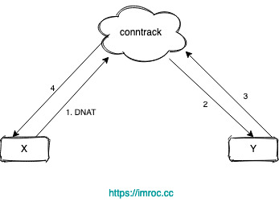
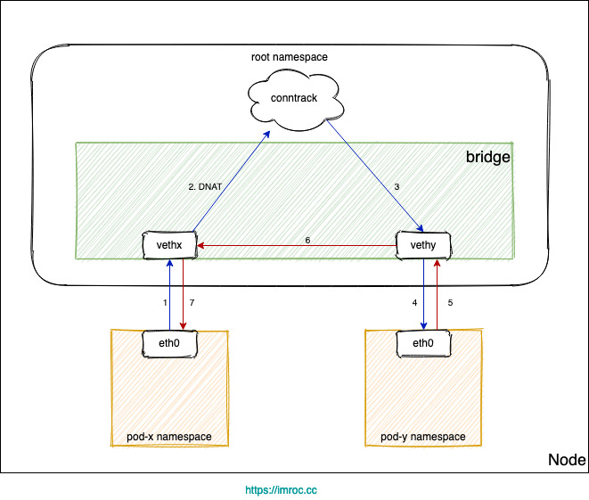

# 环境准备

## 1.防火墙

### 1.1. 设置防火墙端口策略

生产环境设置k8s节点的iptables端口访问规则。

#### 1.1.1. master节点端口配置

| 协议 | 方向 | 端口范围  | 目的                    | 使用者               |
| ---- | ---- | --------- | ----------------------- | -------------------- |
| TCP  | 入站 | 6443      | Kubernetes API server   | 所有                 |
| TCP  | 入站 | 2379-2380 | etcd server client API  | kube-apiserver, etcd |
| TCP  | 入站 | 10250     | Kubelet API             | 自身, 控制面         |
| TCP  | 入站 | 10259     | kube-scheduler          | 自身                 |
| TCP  | 入站 | 10257     | kube-controller-manager | 自身                 |

#### 1.1.2. worker节点端口配置

| 协议 | 方向 | 端口范围    | 目的              | 使用者       |
| ---- | ---- | ----------- | ----------------- | ------------ |
| TCP  | 入站 | 10250       | Kubelet API       | 自身, 控制面 |
| TCP  | 入站 | 30000-32767 | NodePort Services | 所有         |

添加防火墙iptables规则

master节点开放6443、2379、2380端口。

```bash
iptables -A INPUT -p tcp -m multiport --dports 6443,2379,2380,10250 -j ACCEPT
```

## 2、关闭swap分区

`selinux`，这个是用来加强安全性的一个组件，但==非常容易出错且难以定位==，一般上来装完系统就先给禁用了。

`swap`，这个当内存不足时，linux会自动使用swap，将==部分内存数据存放到磁盘==中，这个这样会使性能下降，==为了性能考虑推荐关掉==。

swap【在明确的OOM和 没有报错但是莫名其妙服务就不能用了 之间二选一】，对于集群化的服务（比如etcd）来说是挂掉一个实例和整个集群都出毛病之间二选一，一般正常人都知道该选哪个

`iptables`防火墙，会对所有网络流量进行过滤、转发，如果是==内网机器==一般都会==直接关闭==，省的影响网络性能。k8s的部分网络模式需要使用防火墙做ip转发和修改。

开启设置：允许iptables 检查桥接流量，否则当客户端pod与服务端pod在同一节点时，会出现无法通信的情况

> 正常情况：
>
> 
>
> 异常场景：
>
> * Pod 访问 Service，目的 IP 是 Cluster IP，不是网桥内的地址，走三层转发，会被 DNAT 成 PodIP:Port。
>
> * 如果 DNAT 后是转发到了同节点上的 Pod，目的 Pod 回包时发现目的 IP 在同一网桥上，就直接走二层转发了，没有调用 conntrack，导致回包时没有原路返回 (见下图)。
>
> 
>
> 由于没有原路返回，客户端与服务端的通信就不在一个 "频道" 上，不认为处在同一个连接，也就无法正常通信。
>
> 常见的问题现象就是偶现 DNS 解析失败，当 coredns 所在节点上的 pod 解析 dns 时，dns 请求落到当前节点的 coredns pod 上时，就可能发生这个问题。

```perl
#各个机器设置自己的域名
hostnamectl set-hostname xxxxx

# 将 SELinux 设置为 permissive 模式（相当于将其禁用）
sudo setenforce 0
sudo sed -i 's/^SELINUX=enforcing$/SELINUX=permissive/' /etc/selinux/config

#关闭swap
swapoff -a  
sed -ri 's/.*swap.*/#&/' /etc/fstab

#允许 iptables 检查桥接流量
cat <<EOF | sudo tee /etc/modules-load.d/k8s.conf
br_netfilter
EOF

cat <<EOF | sudo tee /etc/sysctl.d/k8s.conf
net.bridge.bridge-nf-call-ip6tables = 1
net.bridge.bridge-nf-call-iptables = 1
EOF
sudo sysctl --system

#打开IP转发
echo 1 > /proc/sys/net/ipv4/ip_forward 
或
sysctl -w net.ipv4.ip_forward=1
```

## 3、安装kubesphere

```perl
export KKZONE=cn
curl -sfL https://get-kk.kubesphere.io | sh -
sudo chmod +x kk
 ./kk create config --with-kubernetes 1.28.12
```

命令执行完毕后将生成安装配置文件 **config-sample.yaml**。

```yaml
apiVersion: kubekey.kubesphere.io/v1alpha2
kind: Cluster
metadata:
  name: sample
spec:
  hosts:
    - { name: neptune101, address: 192.168.10.101, internalAddress: 192.168.10.101, privateKeyPath: "~/.ssh/id_rsa" }
    - { name: neptune102, address: 192.168.10.102, internalAddress: 192.168.10.102, privateKeyPath: "~/.ssh/id_rsa" }
    - { name: neptune103, address: 192.168.10.103, internalAddress: 192.168.10.103, privateKeyPath: "~/.ssh/id_rsa" }
  roleGroups:
    etcd:
      - neptune101
    control-plane:
      - neptune101
    worker:
      - neptune102
      - neptune103
  controlPlaneEndpoint:
    ## Internal loadbalancer for apiservers 
    # internalLoadbalancer: haproxy

    domain: lb.kubesphere.local
    address: ""
    port: 6443
  kubernetes:
    version: 1.28.12
    clusterName: cluster.local
    autoRenewCerts: true
    containerManager: docker
  etcd:
    type: kubekey
    dataDir: "/data/etcd"
    heartbeatInterval: 250
    electionTimeout: 5000
    snapshotCount: 10000
    autoCompactionRetention: 8
    metrics: basic
    quotaBackendBytes: 2147483648
    maxRequestBytes: 1572864
    maxSnapshots: 5
    maxWals: 5
    logLevel: info
  network:
    plugin: calico
    kubePodsCIDR: 10.233.64.0/18
    kubeServiceCIDR: 10.233.0.0/18
    ## multus support. https://github.com/k8snetworkplumbingwg/multus-cni
    multusCNI:
      enabled: false
  registry:
    privateRegistry: ""
    namespaceOverride: ""
    registryMirrors: [ ]
    insecureRegistries: [ ]
  addons: [ ]
```

安装kubernates

```perl
./kk create cluster -f config-sample.yaml
```

设置代理

```perl
export https_proxy="http://192.168.18.216:1080"
export http_proxy="http://192.168.18.216:1080"
export NO_PROXY="localhost,127.0.0.1,lb.kubesphere.local"
```

安装 KubeSphere

```perl
helm upgrade --install -n kubesphere-system --create-namespace ks-core https://charts.kubesphere.io/main/ks-core-1.1.3.tgz --debug --wait
```

pod pending报错：`pod has unbound immediate PersistentVolumeClaims. preemption: 0/3 nodes are available: 3 Preemption is not helpful for scheduling`

pvc pending报错：`no persistent volumes available for this claim and no storage class is set`

手动创建Prometheus的pv后pvc创建成功

prometheus-pv.yml

```yaml
apiVersion: v1
kind: PersistentVolume
metadata:
  name: prometheus-k8s-db
  annotations:
    kubesphere.io/creator: admin
spec:
  persistentVolumeReclaimPolicy: Retain
  capacity:
    storage: 20Gi
  nfs:
    readOnly: false
    path: /nfs/data/prometheus
    server: 192.168.10.101
  storageClassName: nfs
  accessModes:
    - ReadWriteOnce
```

opensearch-pv.yml

```yaml
apiVersion: v1
kind: PersistentVolume
metadata:
  name: opensearch-pv-0
spec:
  volumeMode: Filesystem
  persistentVolumeReclaimPolicy: Retain
  accessModes:
    - ReadWriteOnce
  capacity:
    storage: 20Gi
  hostPath:
    path: /data/pv/opensearch-0
    type: Directory
---
apiVersion: v1
kind: PersistentVolume
metadata:
  name: opensearch-pv-1
spec:
  volumeMode: Filesystem
  persistentVolumeReclaimPolicy: Retain
  accessModes:
    - ReadWriteOnce
  capacity:
    storage: 20Gi
  hostPath:
    path: /data/pv/opensearch-1
    type: Directory
---
apiVersion: v1
kind: PersistentVolume
metadata:
  name: opensearch-pv-2
spec:
  volumeMode: Filesystem
  persistentVolumeReclaimPolicy: Retain
  accessModes:
    - ReadWriteOnce
  capacity:
    storage: 20Gi
  hostPath:
    path: /data/pv/opensearch-2
    type: Directory
---
apiVersion: v1
kind: PersistentVolume
metadata:
  name: opensearch-pv-master
spec:
  volumeMode: Filesystem
  persistentVolumeReclaimPolicy: Retain
  accessModes:
    - ReadWriteOnce
  capacity:
    storage: 8Gi
  hostPath:
    path: /data/pv/opensearch-master
    type: Directory
```

删除PV：先删除pod、再删除PVC、此时PV为released、可以删除PV

