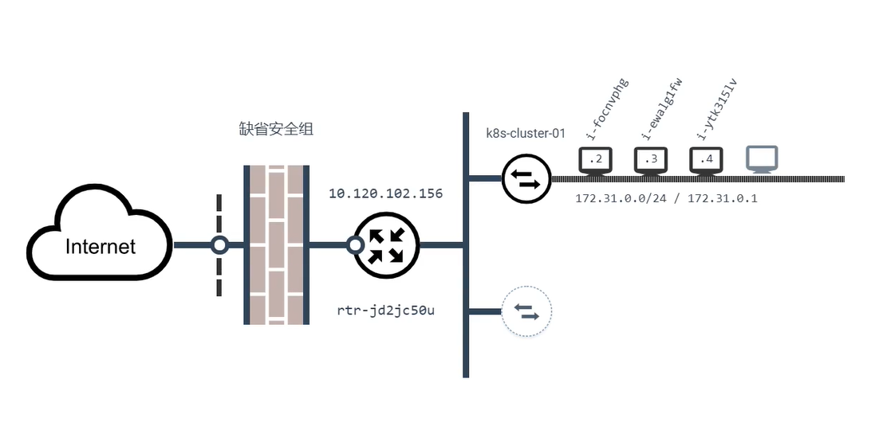
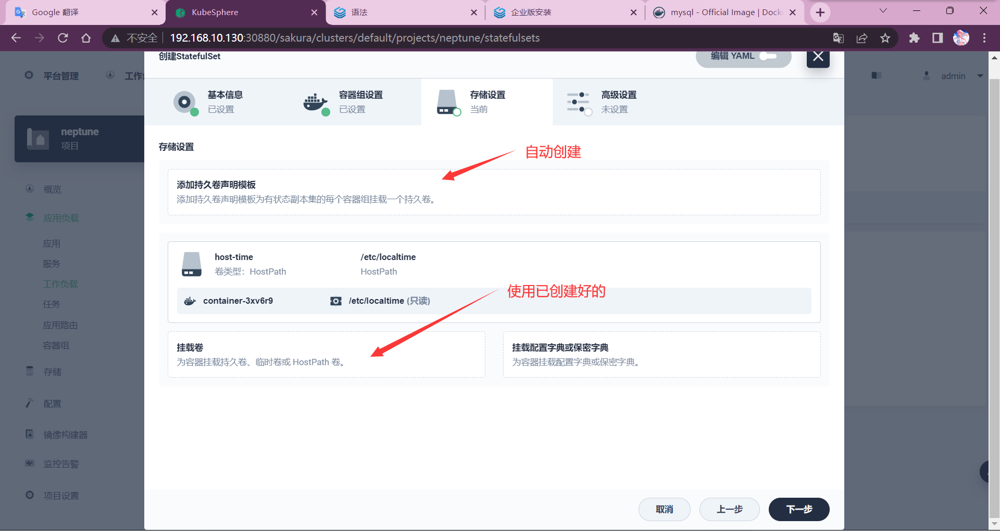
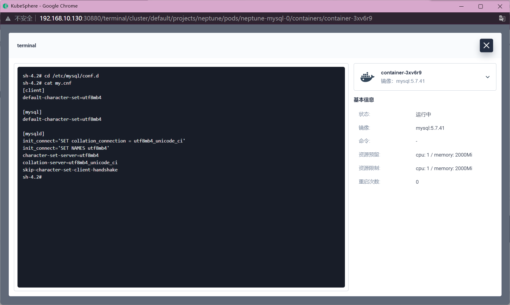
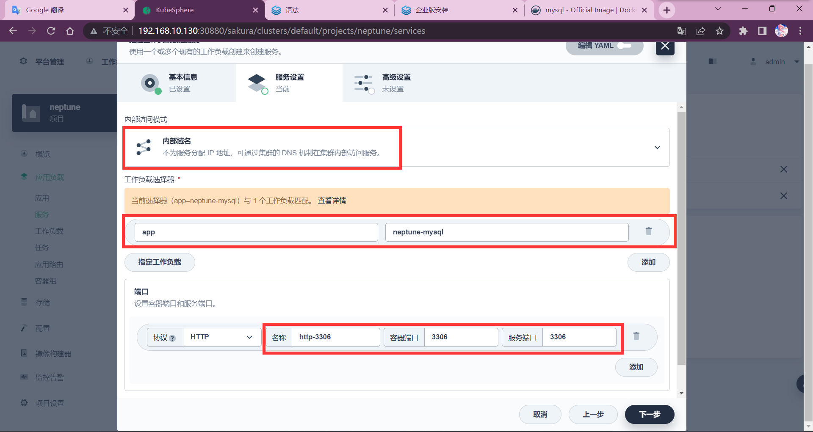
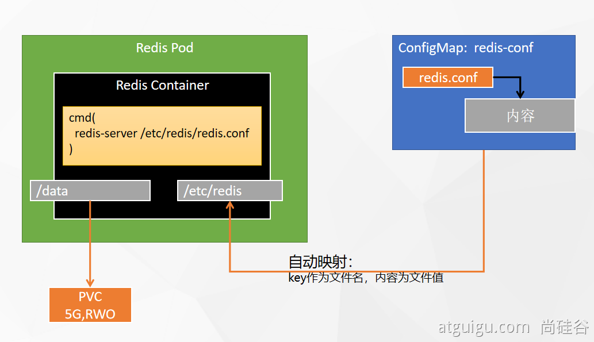

[toc] 

# 云平台核心

# 1 为什么用云平台

- 环境统一
- 按需付费 
- 即开即用 
- 稳定性强
- ......


国内常见云平台：

- [阿里云](https://promotion.aliyun.com/ntms/act/ambassador/sharetouser.html?userCode=50sid5bu&utm_source=50sid5bu)、百度云、[腾讯云](https://curl.qcloud.com/iyFTRSJb)、[华为云](https://activity.huaweicloud.com/discount_area_v5/index.html?fromacct=d1a6f32e-d6d0-4702-9213-eafe022a0708&utm_source=bGVpZmVuZ3lhbmc==&utm_medium=cps&utm_campaign=201905)、青云......

国外常见云平台：

- 亚马逊 AWS、微软 Azure ...

**云原生：云（云服务器）+原生（如java、python开发的原生应用），原生应用部署到云 => 云原生**

*与云对应的为本地服务器，应用开发时在本地，上线时应该上云*

## 1.1 公有云

购买云服务商提供的公共服务器


公有云是最常见的云计算部署类型。公有云资源（例如服务器和存储空间）由第三方云服务提供商拥有和运营，这些资源通过 Internet 提供。在公有云中，所有硬件、软件和其他支持性基础结构均为云提供商所拥有和管理。Microsoft Azure 是公有云的一个示例。

在公有云中，你与其他组织或云“租户”共享相同的硬件、存储和网络设备，并且你可以使用 Web 浏览器访问服务和管理帐户。公有云部署通常用于提供基于 Web 的电子邮件、网上办公应用、存储以及测试和开发环境。

公有云优势：

- **成本更低**：无需购买硬件或软件，仅对使用的服务付费。
- **无需维护**：维护由服务提供商提供。
- **近乎无限制的缩放性**：提供按需资源，可满足业务需求。
- **高可靠性**：具备众多服务器，确保免受故障影响。

- - 可用性： N个9, 6个9（99.9999%）全年的故障时间： 365\*24\*3600*(1-99.9999%)

## 1.2 私有云

自己搭建云平台，或者购买


私有云由专供一个企业或组织使用的云计算资源构成。私有云可在物理上位于组织的现场数据中心，也可由第三方服务提供商托管。但是，在私有云中，服务和基础结构始终在私有网络上进行维护，硬件和软件专供组织使用。

这样，私有云可使组织更加方便地自定义资源，从而满足特定的 IT 需求。私有云的使用对象通常为政府机构、金融机构以及其他具备业务关键性运营且希望对环境拥有更大控制权的中型到大型组织。

私有云优势：

- **灵活性更强**：组织可自定义云环境以满足特定业务需求。
- **控制力更强**：资源不与其他组织共享，因此能获得更高的控制力以及更高的隐私级别。
- **可伸缩性更强**：与本地基础结构相比，私有云通常具有更强的可伸缩性。


**没有一种云计算类型适用于所有人。多种不同的云计算模型、类型和服务已得到发展，可以满足组织快速变化的技术需求。**


**部署云计算资源有三种不同的方法：公共云、私有云和混合云。采用的部署方法取决于业务需求。**

**混合云：公有云+私有云混用**

# 2 核心构架

## 2.1 所需软件

注册云平台：

- [阿里云](https://www.aliyun.com/daily-act/ecs/activity_selection?userCode=50sid5bu)   aliyun.com 
- [腾讯云](https://curl.qcloud.com/iyFTRSJb)   cloud.tencent.com
- [华为云](https://activity.huaweicloud.com/discount_area_v5/index.html?fromacct=d1a6f32e-d6d0-4702-9213-eafe022a0708&utm_source=bGVpZmVuZ3lhbmc==&utm_medium=cps&utm_campaign=201905)   cloud.huawei.com

[青云](https://www.qingcloud.com/promotion2021)       qingcloud.com

[百度云](http://cloud.baidu.com)    cloud.baidu.com

.......

## 2.2 基础概念

- 云服务器作为应用的最终载体
- VPC为所有云服务器提供网络隔离
- 所有云服务器都是绑定某个私有网络
- 安全组控制每个服务器的防火墙规则
- 公网IP使得资源可访问
- 端口转发的方式访问到具体服务器

## 2.3 实战操作

**服务器、VPC、安全组...**

### 2.3.1 安全组

安全组：防火墙相关的端口设置

私有IP：服务器间通过私有IP互相访问（私有IP可访问公网IP但有带宽限制，私有IP走内网更快）

公网IP：提供给外界访问（公网IP不可访问私有IP）


### 2.3.2 VPC

`VPC`：私有网络、专有网络，用于划分网段，不同VPC下的网络无法互相访问，不同VPC下IP可相同

*同一VPC下的服务器可互通，不同vpc下的服务器在物理层做了网络隔离，不可互通。*

`网段`：由IP地址（点分十进制）和掩码构成

`掩码`：将IP地址转换成二进制后，前（掩码）位固定

`192.168.0.0/16`：掩码为16（`255.255.0.0`），IP前16位固定，后16位动态变化，可用IP有65534个

不可用IP：`192.168.0.0（网络）`，`192.168.255.255（广播）`

可用IP：`192.168.0.1~192.168.255.254`

---

**VPC下还可划分子网（交换机）**

*子网IP不要冲突*




# Kubernetes入门

中文官网：https://kubernetes.io/zh-cn/docs

# 1 基础概念


**传统部署时代：**

> 多个应用程序都部署在一个物理服务器上，无法限制应用程序资源的使用，导致其他应用性能下降。
>
> 一个应用内存泄漏后可能会导致整个服务器宕机，其他应用也跟着挂掉。
>
> 维护许多物理服务器的成本很高。

---

**虚拟化部署时代：**

> 虚拟化技术可以在一个物理服务器上运行多台虚拟机（VM），虚拟机之间相互隔离。
>
> 每个 VM 是一台完整的计算机，在虚拟化硬件之上运行所有组件，包括其自己的操作系统。

---

**容器部署时代：**

> 容器类似于 VM，容器之间共享操作系统（OS，比 VM 更轻量。每个容器都具有自己的文件系统、CPU、内存、进程空间等。 
>
> 当容器的数量足够多时，人工运维成本会很高


*我们急需一个大规模容器编排系统*

`编排`：**编**（管理，分组），**排**（排列组合，扩容缩容）


*Kubernetes 为你提供：*

- **服务发现和负载均衡**

  Kubernetes 可以使用 DNS 名称或自己的 IP 地址来暴露容器。 如果进入容器的流量很大，Kubernetes 可以负载均衡并分配网络流量，从而使部署稳定。

  > 获取应用存活状态，动态分配压力到各应用

- **存储编排**

  Kubernetes 允许你自动挂载你选择的存储系统，例如本地存储、公共云提供商等。

  > 存储管理，删除应用时自动清理磁盘释放空间

- **自动部署和回滚**

  你可以使用 Kubernetes 描述已部署容器的所需状态， 它可以以受控的速率将实际状态更改为期望状态。 例如，你可以自动化 Kubernetes 来为你的部署创建新容器， 删除现有容器并将它们的所有资源用于新容器。

  > 一键回滚版本并部署应用

- **自动完成装箱计算**

  你为 Kubernetes 提供许多节点组成的集群，在这个集群上运行容器化的任务。 你告诉 Kubernetes 每个容器需要多少 CPU 和内存 (RAM)。 Kubernetes 可以将这些容器按实际情况调度到你的节点上，以最佳方式利用你的资源。

  > 自定义限制应用占用的资源

- **自我修复**

  Kubernetes 将重新启动失败的容器、替换容器、杀死不响应用户定义的运行状况检查的容器， 并且在准备好服务之前不将其通告给客户端。

  > 应用挂掉后会动态部署，保证服务可用

- **密钥与配置管理**

  Kubernetes 允许你存储和管理敏感信息，例如密码、OAuth 令牌和 ssh 密钥。 你可以在不重建容器镜像的情况下部署和更新密钥和应用程序配置，也无需在堆栈配置中暴露密钥。

  > 类似于springcloud配置中心

***Kubernetes 为你提供了一个可弹性运行分布式系统的框架。 Kubernetes 会满足你的扩展要求、故障转移你的应用、提供部署模式等。 例如，Kubernetes 可以轻松管理系统的 Canary (金丝雀) 部署。***

> k8s：分布式系统管理框架，可通过插件拓展功能
>
> 金丝雀部署（灰度部署）：体验服与正式服

# 2 架构

## 2.1 工作方式

Kubernetes ==**Cluster**== ==**=**== N ==**Master**== Node ==**+**== N ==**Worker**== Node：N主节点+N工作节点； N>=1

> 多个master节点：实现高可用，一个master节点挂掉后，可通过选举产生新master

## 2.2 组件架构


#### **组件角色**


#### **组件关系**


> 应用一般部署在worker节点，master节点也可部署应用（一般不这么做）
>
> 部署应用的节点需要有容器运行时环境（docker或其他容器）

---

> `kublet`负责启停、销毁应用，监测到应用故障后，通知api-server，
>
> `api-server`再通知controller-manager，`controller-manager`决策后将结果发送给api-server，
>
> `api-server`将决策结果存入`etcd`，并通知schedule
>
> `schedule`计算资源后将结果发送给api-server，api-server将计算结果存入`etcd`，并通知kublet启停应用
>
> `kube-proxy`负责所有应用的访问，需要访问应用时应先通过kube-proxy，kube-proxy之间互相通信
>
> *我们通过`kubectl`执行命令，将命令发送给`api-server`，api-server再发送给`controller-manager`决策*

### 2.2.1 控制平面组件（Control Plane Components） 

控制平面的组件对集群做出全局决策(比如调度)，以及检测和响应集群事件（例如，当不满足部署的 `replicas` 字段时，启动新的 [pod](https://kubernetes.io/docs/concepts/workloads/pods/pod-overview/)）。

控制平面组件可以在集群中的任何节点上运行。 然而，为了简单起见，设置脚本通常会在同一个计算机上启动所有控制平面组件， 并且不会在此计算机上运行用户容器。 请参阅[使用 kubeadm 构建高可用性集群](https://kubernetes.io/zh/docs/setup/production-environment/tools/kubeadm/high-availability/) 中关于多 VM 控制平面设置的示例。

#### kube-apiserver

API 服务器是 Kubernetes [控制面](https://kubernetes.io/zh/docs/reference/glossary/?all=true#term-control-plane)的组件， 该组件公开了 Kubernetes API。 API 服务器是 Kubernetes 控制面的前端。

Kubernetes API 服务器的主要实现是 [kube-apiserver](https://kubernetes.io/zh/docs/reference/command-line-tools-reference/kube-apiserver/)。 kube-apiserver 设计上考虑了水平伸缩，也就是说，它可通过部署多个实例进行伸缩。 你可以运行 kube-apiserver 的多个实例，并在这些实例之间平衡流量。

#### etcd

etcd 是兼具一致性和高可用性的键值数据库，可以作为保存 Kubernetes 所有集群数据的后台数据库。

您的 Kubernetes 集群的 etcd 数据库通常需要有个备份计划。

要了解 etcd 更深层次的信息，请参考 [etcd 文档](https://etcd.io/docs/)。

#### kube-scheduler

控制平面组件，负责监视新创建的、未指定运行[节点（node）](https://kubernetes.io/zh/docs/concepts/architecture/nodes/)的 [Pods](https://kubernetes.io/docs/concepts/workloads/pods/pod-overview/)，选择节点让 Pod 在上面运行。

调度决策考虑的因素包括单个 Pod 和 Pod 集合的资源需求、硬件/软件/策略约束、亲和性和反亲和性规范、数据位置、工作负载间的干扰和最后时限。

#### kube-controller-manager

在主节点上运行 [控制器](https://kubernetes.io/zh/docs/concepts/architecture/controller/) 的组件。

从逻辑上讲，每个[控制器](https://kubernetes.io/zh/docs/concepts/architecture/controller/)都是一个单独的进程， 但是为了降低复杂性，它们都被编译到同一个可执行文件，并在一个进程中运行。

这些控制器包括:

- 节点控制器（Node Controller）: 负责在节点出现故障时进行通知和响应
- 任务控制器（Job controller）: 监测代表一次性任务的 Job 对象，然后创建 Pods 来运行这些任务直至完成
- 端点控制器（Endpoints Controller）: 填充端点(Endpoints)对象(即加入 Service 与 Pod)
- 服务帐户和令牌控制器（Service Account & Token Controllers）: 为新的命名空间创建默认帐户和 API 访问令牌

#### cloud-controller-manager

云控制器管理器是指嵌入特定云的控制逻辑的 [控制平面](https://kubernetes.io/zh/docs/reference/glossary/?all=true#term-control-plane)组件。 云控制器管理器允许您链接集群到云提供商的应用编程接口中， 并把和该云平台交互的组件与只和您的集群交互的组件分离开。

`cloud-controller-manager` 仅运行特定于云平台的控制回路。 如果你在自己的环境中运行 Kubernetes，或者在本地计算机中运行学习环境， 所部署的环境中不需要云控制器管理器。

与 `kube-controller-manager` 类似，`cloud-controller-manager` 将若干逻辑上独立的 控制回路组合到同一个可执行文件中，供你以同一进程的方式运行。 你可以对其执行水平扩容（运行不止一个副本）以提升性能或者增强容错能力。

下面的控制器都包含对云平台驱动的依赖：

- 节点控制器（Node Controller）: 用于在节点终止响应后检查云提供商以确定节点是否已被删除
- 路由控制器（Route Controller）: 用于在底层云基础架构中设置路由
- 服务控制器（Service Controller）: 用于创建、更新和删除云提供商负载均衡器

### 2.2.2 Node 组件 

节点组件在每个节点上运行，维护运行的 Pod 并提供 Kubernetes 运行环境。

#### kubelet

一个在集群中每个[节点（node）](https://kubernetes.io/zh/docs/concepts/architecture/nodes/)上运行的代理。 它保证[容器（containers）](https://kubernetes.io/zh/docs/concepts/overview/what-is-kubernetes/#why-containers)都 运行在 [Pod](https://kubernetes.io/docs/concepts/workloads/pods/pod-overview/) 中。

kubelet 接收一组通过各类机制提供给它的 PodSpecs，确保这些 PodSpecs 中描述的容器处于运行状态且健康。 kubelet 不会管理不是由 Kubernetes 创建的容器。

#### kube-proxy

[kube-proxy](https://kubernetes.io/zh/docs/reference/command-line-tools-reference/kube-proxy/) 是集群中每个节点上运行的网络代理， 实现 Kubernetes [服务（Service）](https://kubernetes.io/zh/docs/concepts/services-networking/service/) 概念的一部分。

kube-proxy 维护节点上的网络规则。这些网络规则允许从集群内部或外部的网络会话与 Pod 进行网络通信。

如果操作系统提供了数据包过滤层并可用的话，kube-proxy 会通过它来实现网络规则。否则， kube-proxy 仅转发流量本身。

# 3 kubeadm创建集群

提前为所有机器安装Docker

## 安装步骤


>1. 每台服务器安装`kubelet`
>
>2. 每台服务器安装`kubeadm`和`kubectl`（建议只安装在*master*节点，命令行工具）
>3. 将节点初始化为master，并使用kubelet安装master节点组件
>
>```perl
>kubeadm init
>```
>
>4. worker节点加入集群
>
>```perl
>kubeadm join
>```

## 3.1 安装kubeadm

- 一台兼容的 Linux 主机。Kubernetes 项目为基于 Debian 和 Red Hat 的 Linux 发行版以及一些不提供包管理器的发行版提供通用的指令
- 每台机器 2 GB 或更多的 RAM （如果少于这个数字将会影响你应用的运行内存)
- 2 CPU 核或更多
- 集群中的所有机器的网络彼此均能相互连接(公网和内网都可以)
  * **设置防火墙放行规则**

- 节点之中不可以有重复的主机名、MAC 地址或 product_uuid。请参见[这里](https://kubernetes.io/zh/docs/setup/production-environment/tools/kubeadm/install-kubeadm/#verify-mac-address)了解更多详细信息。
  * **设置不同hostname**

- 开启机器上的某些端口。请参见[这里](https://kubernetes.io/zh/docs/setup/production-environment/tools/kubeadm/install-kubeadm/#check-required-ports) 了解更多详细信息。
  * **内网互信**

- 禁用交换分区。为了保证 kubelet 正常工作，你 **必须** 禁用交换分区。
  * **永久关闭**


### 3.1.1 基础环境

#### 基础环境

**虚拟机克隆注意修改UUID，需UUID和mac地址不同**

*所有机器执行以下操作*

```bash
#各个机器设置自己的域名
hostnamectl set-hostname xxxxx

# 将 SELinux 设置为 permissive 模式（相当于将其禁用）
sudo setenforce 0
sudo sed -i 's/^SELINUX=enforcing$/SELINUX=permissive/' /etc/selinux/config

#关闭swap
swapoff -a  
sed -ri 's/.*swap.*/#&/' /etc/fstab

#允许 iptables 检查桥接流量
cat <<EOF | sudo tee /etc/modules-load.d/k8s.conf
br_netfilter
EOF

cat <<EOF | sudo tee /etc/sysctl.d/k8s.conf
net.bridge.bridge-nf-call-ip6tables = 1
net.bridge.bridge-nf-call-iptables = 1
EOF
sudo sysctl --system

#打开IP转发
echo 1 > /proc/sys/net/ipv4/ip_forward 
或
sysctl -w net.ipv4.ip_forward=1
```

#### docker

*需要有容器环境，此处使用docker*

> 配置yum源
>
> ```bash
> yum install -y yum-utils
> yum-config-manager \
> --add-repo \
> http://mirrors.aliyun.com/docker-ce/linux/centos/docker-ce.repo
> ```
>
> 安装docker
>
> ```bash
> yum install -y docker-ce-20.10.7 docker-ce-cli-20.10.7  containerd.io-1.4.6
> ```
>
> 启动（现在启动且开机自启）
>
> ```bash
> systemctl enable docker --now
> ```
>
> 配置加速
>
> 这里额外添加了docker的生产环境核心配置cgroup（exec-opts）
>
> ```bash
> tee /etc/docker/daemon.json <<-'EOF'
> {
>   "registry-mirrors": ["https://b04dj7er.mirror.aliyuncs.com"],
>   "exec-opts": ["native.cgroupdriver=systemd"],
>   "log-driver": "json-file",
>   "log-opts": {
>     "max-size": "100m"
>   },
>   "storage-driver": "overlay2"
> }
> EOF
> systemctl daemon-reload
> systemctl restart docker
> ```
>
> 检查配置
>
> ```perl
> docker info
> ```

### 3.1.2 安装kubelet、kubeadm、kubectl

```bash
#配置下载源
cat <<EOF | sudo tee /etc/yum.repos.d/kubernetes.repo
[kubernetes]
name=Kubernetes
baseurl=http://mirrors.aliyun.com/kubernetes/yum/repos/kubernetes-el7-x86_64
enabled=1
gpgcheck=0
repo_gpgcheck=0
gpgkey=http://mirrors.aliyun.com/kubernetes/yum/doc/yum-key.gpg
   http://mirrors.aliyun.com/kubernetes/yum/doc/rpm-package-key.gpg
exclude=kubelet kubeadm kubectl
EOF
#安装k8s
sudo yum install -y kubelet-1.20.9 kubeadm-1.20.9 kubectl-1.20.9 --disableexcludes=kubernetes
#开机自启且现在启动
sudo systemctl enable --now kubelet
```

*kubelet 现在每隔几秒就会重启，因为它陷入了一个等待 kubeadm 指令的死循环*

## 3.2 使用kubeadm引导集群

版本兼容性：https://kubernetes.io/zh-cn/releases/version-skew-policy/

阿里云代理仓库地址为：registry.aliyuncs.com/google_containers

### 3.2.1 下载各个机器需要的镜像

*master节点*

```bash
sudo tee ./images.sh <<-'EOF'
#!/bin/bash
images=(
kube-apiserver:v1.20.9
kube-proxy:v1.20.9
kube-controller-manager:v1.20.9
kube-scheduler:v1.20.9
coredns:1.7.0
etcd:3.4.13-0
pause:3.2
)
for imageName in ${images[@]} ; do
docker pull registry.cn-hangzhou.aliyuncs.com/google_containers/$imageName
done
EOF
   
chmod +x ./images.sh && ./images.sh
```


*worker节点*

==pause容器提供container网络模式，pod内给容器提供一个共享IP==


```perl
docker pull registry.cn-hangzhou.aliyuncs.com/google_containers/pause:3.2
```

#### 镜像上传到阿里云备用

> 登录阿里云
>
> ```perl
> docker login --username=aliyun1983826194 registry.cn-shanghai.aliyuncs.com
> ```
>
> 给镜像改名
>
> ```perl
> docker tag 8dbf9a6aa186 registry.cn-shanghai.aliyuncs.com/nep_kisa_collect/kube-proxy:v1.20.9
> docker tag 295014c114b3 registry.cn-shanghai.aliyuncs.com/nep_kisa_collect/kube-scheduler:v1.20.9
> docker tag 0d0d57e4f64c registry.cn-shanghai.aliyuncs.com/nep_kisa_collect/kube-apiserver:v1.20.9
> docker tag eb07fd4ad3b4 registry.cn-shanghai.aliyuncs.com/nep_kisa_collect/kube-controller-manager:v1.20.9
> docker tag 0369cf4303ff registry.cn-shanghai.aliyuncs.com/nep_kisa_collect/etcd:3.4.13-0
> docker tag bfe3a36ebd25 registry.cn-shanghai.aliyuncs.com/nep_kisa_collect/coredns:1.7.0   
> docker tag 80d28bedfe5d registry.cn-shanghai.aliyuncs.com/nep_kisa_collect/pause:3.2     
> ```
>
> 上传镜像
>
> ```perl
> docker push registry.cn-shanghai.aliyuncs.com/nep_kisa_collect/kube-proxy:v1.20.9
> docker push registry.cn-shanghai.aliyuncs.com/nep_kisa_collect/kube-scheduler:v1.20.9
> docker push registry.cn-shanghai.aliyuncs.com/nep_kisa_collect/kube-apiserver:v1.20.9
> docker push registry.cn-shanghai.aliyuncs.com/nep_kisa_collect/kube-controller-manager:v1.20.9
> docker push registry.cn-shanghai.aliyuncs.com/nep_kisa_collect/etcd:3.4.13-0
> docker push registry.cn-shanghai.aliyuncs.com/nep_kisa_collect/coredns:1.7.0   
> docker push registry.cn-shanghai.aliyuncs.com/nep_kisa_collect/pause:3.2     
> ```
>
> 
>
> 上传完成后删除镜像
>
> ```perl
> docker rmi registry.cn-shanghai.aliyuncs.com/nep_kisa_collect/kube-proxy:v1.20.9
> docker rmi registry.cn-shanghai.aliyuncs.com/nep_kisa_collect/kube-scheduler:v1.20.9
> docker rmi registry.cn-shanghai.aliyuncs.com/nep_kisa_collect/kube-apiserver:v1.20.9
> docker rmi registry.cn-shanghai.aliyuncs.com/nep_kisa_collect/kube-controller-manager:v1.20.9
> docker rmi registry.cn-shanghai.aliyuncs.com/nep_kisa_collect/etcd:3.4.13-0
> docker rmi registry.cn-shanghai.aliyuncs.com/nep_kisa_collect/coredns:1.7.0   
> docker rmi registry.cn-shanghai.aliyuncs.com/nep_kisa_collect/pause:3.2     
> ```

### 3.2.2 初始化主节点

```bash
#所有机器添加master域名映射，集群端点入口
echo "192.168.10.200  cluster-endpoint" >> /etc/hosts

#能ping通即配置成功
ping cluster-endpoint

#主节点初始化
#apiserver-advertise-address master节点IP
#control-plane-endpoint 上面配置的域名映射
#service-cidr	指定service网络段
#pod-network-cidr 指定pod网络段，需要与网络组件同步
kubeadm init \
--apiserver-advertise-address=192.168.10.200 \
--control-plane-endpoint=cluster-endpoint \
--kubernetes-version v1.20.9 \
--service-cidr=10.96.0.0/16 \
--image-repository registry.aliyuncs.com/google_containers \
--pod-network-cidr=10.244.0.0/16
# 加上这个会拖慢速度？

#所有网络范围不重叠

#初始化失败可重置
kubeadm reset
```

#### k8s命令

```bash
#查看集群所有节点
kubectl get nodes

#根据配置文件，给集群创建资源
kubectl apply -f xxxx.yaml
kubectl delete -f xxxx.yaml

#查看集群部署了哪些应用？
docker ps   等同于   kubectl get pods -A
# 运行中的应用在docker里面叫容器，在k8s里面叫Pod（可包含多个）
#-w可实时监控变化
kubectl get pods -A -w
```

### 3.3 根据提示继续

*master成功后提示如下：*

```bash
Your Kubernetes control-plane has initialized successfully!

To start using your cluster, you need to run the following as a regular user:

  mkdir -p $HOME/.kube
  sudo cp -i /etc/kubernetes/admin.conf $HOME/.kube/config
  sudo chown $(id -u):$(id -g) $HOME/.kube/config

Alternatively, if you are the root user, you can run:

  export KUBECONFIG=/etc/kubernetes/admin.conf

You should now deploy a pod network to the cluster.
Run "kubectl apply -f [podnetwork].yaml" with one of the options listed at:
  https://kubernetes.io/docs/concepts/cluster-administration/addons/

You can now join any number of control-plane nodes by copying certificate authorities
and service account keys on each node and then running the following as root:

  kubeadm join cluster-endpoint:6443 --token ewmi24.vehw7fk16op1j2z8 \
    --discovery-token-ca-cert-hash sha256:3f747c7d4c4f35bb5649a9dbaeb2ad58a53b142af557091d7472c11de9bf74d8 \
    --control-plane

Then you can join any number of worker nodes by running the following on each as root:

kubeadm join cluster-endpoint:6443 --token ewmi24.vehw7fk16op1j2z8 \
    --discovery-token-ca-cert-hash sha256:3f747c7d4c4f35bb5649a9dbaeb2ad58a53b142af557091d7472c11de9bf74d8
```

#### 3.3.1 设置.kube/config

复制上面命令

```bash
 mkdir -p $HOME/.kube
 sudo cp -i /etc/kubernetes/admin.conf $HOME/.kube/config
 sudo chown $(id -u):$(id -g) $HOME/.kube/config
```

#### 3.3.2 安装网络组件

kubernetes支持多种网络插件，比如flannel、calico、canal等等，任选一种使用即可

> 下载calico网络插件 
>
> ```perl
> curl https://docs.projectcalico.org/v3.20/manifests/calico.yaml -O
> ```
>
> master节点执行
>
> ```perl
>kubectl apply -f calico.yaml
> ```
>
> 执行失败回滚
> 
> ```perl
> kubectl delete -f calico.yaml 
> ```

*master节点初始化成功*


### 3.4 加入node节点

加入节点

```bash
kubeadm join cluster-endpoint:6443 --token ewmi24.vehw7fk16op1j2z8 \
    --discovery-token-ca-cert-hash sha256:3f747c7d4c4f35bb5649a9dbaeb2ad58a53b142af557091d7472c11de9bf74d8
```

若因为网络问题加入失败，需开启转发

```shell
sysctl -w net.ipv4.ip_forward=1
```

令牌24小时有效，过期后可创建新令牌

```bash
kubeadm token create --print-join-command
```

*集群初始化成功*


**高可用部署方式，也是在这一步的时候，使用添加主节点的命令即可**

### 卸载k8s

```bash
# 每个结点上执行
kubectl delete -f kube-flannel.yml
kubeadm reset
rm -rf $HOME/.kube
rm -rf /etc/cni/net.d
```

### 3.5 验证集群

验证集群节点状态

```bash
kubectl get nodes
kubectl get pods -A
```

实时查询

```bash
watch -n1 kubectl get nodes
kubectl get pods -Aw
```

### 3.6 部署dashboard

#### 3.6.1 部署

kubernetes官方提供的可视化界面

https://github.com/kubernetes/dashboard

https://raw.githubusercontent.com/kubernetes/dashboard/v2.3.1/aio/deploy/recommended.yaml

```bash
vi dashboard.yaml
```

*将以下内容写入*

```yaml
# Copyright 2017 The Kubernetes Authors.
#
# Licensed under the Apache License, Version 2.0 (the "License");
# you may not use this file except in compliance with the License.
# You may obtain a copy of the License at
#
#     http://www.apache.org/licenses/LICENSE-2.0
#
# Unless required by applicable law or agreed to in writing, software
# distributed under the License is distributed on an "AS IS" BASIS,
# WITHOUT WARRANTIES OR CONDITIONS OF ANY KIND, either express or implied.
# See the License for the specific language governing permissions and
# limitations under the License.

apiVersion: v1
kind: Namespace
metadata:
  name: kubernetes-dashboard

---

apiVersion: v1
kind: ServiceAccount
metadata:
  labels:
    k8s-app: kubernetes-dashboard
  name: kubernetes-dashboard
  namespace: kubernetes-dashboard

---

kind: Service
apiVersion: v1
metadata:
  labels:
    k8s-app: kubernetes-dashboard
  name: kubernetes-dashboard
  namespace: kubernetes-dashboard
spec:
  ports:
    - port: 443
      targetPort: 8443
  selector:
    k8s-app: kubernetes-dashboard

---

apiVersion: v1
kind: Secret
metadata:
  labels:
    k8s-app: kubernetes-dashboard
  name: kubernetes-dashboard-certs
  namespace: kubernetes-dashboard
type: Opaque

---

apiVersion: v1
kind: Secret
metadata:
  labels:
    k8s-app: kubernetes-dashboard
  name: kubernetes-dashboard-csrf
  namespace: kubernetes-dashboard
type: Opaque
data:
  csrf: ""

---

apiVersion: v1
kind: Secret
metadata:
  labels:
    k8s-app: kubernetes-dashboard
  name: kubernetes-dashboard-key-holder
  namespace: kubernetes-dashboard
type: Opaque

---

kind: ConfigMap
apiVersion: v1
metadata:
  labels:
    k8s-app: kubernetes-dashboard
  name: kubernetes-dashboard-settings
  namespace: kubernetes-dashboard

---

kind: Role
apiVersion: rbac.authorization.k8s.io/v1
metadata:
  labels:
    k8s-app: kubernetes-dashboard
  name: kubernetes-dashboard
  namespace: kubernetes-dashboard
rules:
  # Allow Dashboard to get, update and delete Dashboard exclusive secrets.
  - apiGroups: [""]
    resources: ["secrets"]
    resourceNames: ["kubernetes-dashboard-key-holder", "kubernetes-dashboard-certs", "kubernetes-dashboard-csrf"]
    verbs: ["get", "update", "delete"]
    # Allow Dashboard to get and update 'kubernetes-dashboard-settings' config map.
  - apiGroups: [""]
    resources: ["configmaps"]
    resourceNames: ["kubernetes-dashboard-settings"]
    verbs: ["get", "update"]
    # Allow Dashboard to get metrics.
  - apiGroups: [""]
    resources: ["services"]
    resourceNames: ["heapster", "dashboard-metrics-scraper"]
    verbs: ["proxy"]
  - apiGroups: [""]
    resources: ["services/proxy"]
    resourceNames: ["heapster", "http:heapster:", "https:heapster:", "dashboard-metrics-scraper", "http:dashboard-metrics-scraper"]
    verbs: ["get"]

---

kind: ClusterRole
apiVersion: rbac.authorization.k8s.io/v1
metadata:
  labels:
    k8s-app: kubernetes-dashboard
  name: kubernetes-dashboard
rules:
  # Allow Metrics Scraper to get metrics from the Metrics server
  - apiGroups: ["metrics.k8s.io"]
    resources: ["pods", "nodes"]
    verbs: ["get", "list", "watch"]

---

apiVersion: rbac.authorization.k8s.io/v1
kind: RoleBinding
metadata:
  labels:
    k8s-app: kubernetes-dashboard
  name: kubernetes-dashboard
  namespace: kubernetes-dashboard
roleRef:
  apiGroup: rbac.authorization.k8s.io
  kind: Role
  name: kubernetes-dashboard
subjects:
  - kind: ServiceAccount
    name: kubernetes-dashboard
    namespace: kubernetes-dashboard

---

apiVersion: rbac.authorization.k8s.io/v1
kind: ClusterRoleBinding
metadata:
  name: kubernetes-dashboard
roleRef:
  apiGroup: rbac.authorization.k8s.io
  kind: ClusterRole
  name: kubernetes-dashboard
subjects:
  - kind: ServiceAccount
    name: kubernetes-dashboard
    namespace: kubernetes-dashboard

---

kind: Deployment
apiVersion: apps/v1
metadata:
  labels:
    k8s-app: kubernetes-dashboard
  name: kubernetes-dashboard
  namespace: kubernetes-dashboard
spec:
  replicas: 1
  revisionHistoryLimit: 10
  selector:
    matchLabels:
      k8s-app: kubernetes-dashboard
  template:
    metadata:
      labels:
        k8s-app: kubernetes-dashboard
    spec:
      containers:
        - name: kubernetes-dashboard
          image: kubernetesui/dashboard:v2.3.1
          imagePullPolicy: Always
          ports:
            - containerPort: 8443
              protocol: TCP
          args:
            - --auto-generate-certificates
            - --namespace=kubernetes-dashboard
            # Uncomment the following line to manually specify Kubernetes API server Host
            # If not specified, Dashboard will attempt to auto discover the API server and connect
            # to it. Uncomment only if the default does not work.
            # - --apiserver-host=http://my-address:port
          volumeMounts:
            - name: kubernetes-dashboard-certs
              mountPath: /certs
              # Create on-disk volume to store exec logs
            - mountPath: /tmp
              name: tmp-volume
          livenessProbe:
            httpGet:
              scheme: HTTPS
              path: /
              port: 8443
            initialDelaySeconds: 30
            timeoutSeconds: 30
          securityContext:
            allowPrivilegeEscalation: false
            readOnlyRootFilesystem: true
            runAsUser: 1001
            runAsGroup: 2001
      volumes:
        - name: kubernetes-dashboard-certs
          secret:
            secretName: kubernetes-dashboard-certs
        - name: tmp-volume
          emptyDir: {}
      serviceAccountName: kubernetes-dashboard
      nodeSelector:
        "kubernetes.io/os": linux
      # Comment the following tolerations if Dashboard must not be deployed on master
      tolerations:
        - key: node-role.kubernetes.io/master
          effect: NoSchedule

---

kind: Service
apiVersion: v1
metadata:
  labels:
    k8s-app: dashboard-metrics-scraper
  name: dashboard-metrics-scraper
  namespace: kubernetes-dashboard
spec:
  ports:
    - port: 8000
      targetPort: 8000
  selector:
    k8s-app: dashboard-metrics-scraper

---

kind: Deployment
apiVersion: apps/v1
metadata:
  labels:
    k8s-app: dashboard-metrics-scraper
  name: dashboard-metrics-scraper
  namespace: kubernetes-dashboard
spec:
  replicas: 1
  revisionHistoryLimit: 10
  selector:
    matchLabels:
      k8s-app: dashboard-metrics-scraper
  template:
    metadata:
      labels:
        k8s-app: dashboard-metrics-scraper
      annotations:
        seccomp.security.alpha.kubernetes.io/pod: 'runtime/default'
    spec:
      containers:
        - name: dashboard-metrics-scraper
          image: kubernetesui/metrics-scraper:v1.0.6
          ports:
            - containerPort: 8000
              protocol: TCP
          livenessProbe:
            httpGet:
              scheme: HTTP
              path: /
              port: 8000
            initialDelaySeconds: 30
            timeoutSeconds: 30
          volumeMounts:
          - mountPath: /tmp
            name: tmp-volume
          securityContext:
            allowPrivilegeEscalation: false
            readOnlyRootFilesystem: true
            runAsUser: 1001
            runAsGroup: 2001
      serviceAccountName: kubernetes-dashboard
      nodeSelector:
        "kubernetes.io/os": linux
      # Comment the following tolerations if Dashboard must not be deployed on master
      tolerations:
        - key: node-role.kubernetes.io/master
          effect: NoSchedule
      volumes:
        - name: tmp-volume
          emptyDir: {}
```

*启动应用*

```bash
kubectl apply -f dashboard.yaml
```

#### 3.6.2 设置访问端口

>将type: ClusterIP 改为 type: NodePort
>
>```bash
>kubectl edit svc kubernetes-dashboard -n kubernetes-dashboard
>```
>
>找到NodePort端口，在安全组放行
>
>```bash
>kubectl get svc -A |grep kubernetes-dashboard
>```
>
>访问： https://集群任意IP:端口      https://192.168.10.200:32407
>
>此处使用token登录

#### 3.6.3 创建访问账号

创建访问账号，准备一个yaml文件； 

```bash
vi dash.yaml
```

内容为

```yaml
apiVersion: v1
kind: ServiceAccount
metadata:
  name: admin-user
  namespace: kubernetes-dashboard
---
apiVersion: rbac.authorization.k8s.io/v1
kind: ClusterRoleBinding
metadata:
  name: admin-user
roleRef:
  apiGroup: rbac.authorization.k8s.io
  kind: ClusterRole
  name: cluster-admin
subjects:
- kind: ServiceAccount
  name: admin-user
  namespace: kubernetes-dashboard
```

创建账号

```pe&amp;#39;r&amp;#39;l
kubectl apply -f dash.yaml
```

#### 3.6.4 令牌访问

```bash
#获取访问令牌
kubectl -n kubernetes-dashboard get secret $(kubectl -n kubernetes-dashboard get sa/admin-user -o jsonpath="{.secrets[0].name}") -o go-template="{{.data.token | base64decode}}"
```

令牌

```json
eyJhbGciOiJSUzI1NiIsImtpZCI6IjhkWm9EYUFoQmJvS1NlX2dpcElEZkhKQWhrNXVXVEwtR0RnUU5VMS1HS2MifQ.eyJpc3MiOiJrdWJlcm5ldGVzL3NlcnZpY2VhY2NvdW50Iiwia3ViZXJuZXRlcy5pby9zZXJ2aWNlYWNjb3VudC9uYW1lc3BhY2UiOiJrdWJlcm5ldGVzLWRhc2hib2FyZCIsImt1YmVybmV0ZXMuaW8vc2VydmljZWFjY291bnQvc2VjcmV0Lm5hbWUiOiJhZG1pbi11c2VyLXRva2VuLW12d2trIiwia3ViZXJuZXRlcy5pby9zZXJ2aWNlYWNjb3VudC9zZXJ2aWNlLWFjY291bnQubmFtZSI6ImFkbWluLXVzZXIiLCJrdWJlcm5ldGVzLmlvL3NlcnZpY2VhY2NvdW50L3NlcnZpY2UtYWNjb3VudC51aWQiOiJmYmM2YzNkMy03NDBkLTRhNzEtYjAyMC1hZTVhNTU0NjFjMTIiLCJzdWIiOiJzeXN0ZW06c2VydmljZWFjY291bnQ6a3ViZXJuZXRlcy1kYXNoYm9hcmQ6YWRtaW4tdXNlciJ9.XztbCVNyq5c9tipkeraXIpFYfLWsxKb-g3W-BUyjwE_Y4gCEojRbuIwbkf2qqx2FSHoWNxGZ6JG8tFrt0tYpiVxLG5n_-zWwmrLI6y4WBYtZGBK9TjhxKk2fxbQlV80lduqf9J3_n69RrnY-KZlYF9xss-HIuAmn1azkjYrZbhBfsMRdVxJqzlkDCz4IsTmgyfL99jwtOo6t3MXa6f8VF_0OPEOCYmTe-9YyNw4Un0T8FUYuqM5xWTL4heYZ-3-crIJB2UMPK6JOQOlW2Wyk1IKvm1naSJMk3B4QAw7jYpr_b3tjSR9PqMjPCAsbIARFCEAlNl0XbaCMTYP6qvh4EA
```

#### 3.6.5 界面


# Kubernetes核心实战

# 1 资源创建方式

- 命令行

- YAML

  ```perl
  #创建资源
  kubectl apply -f xxxx.yaml
  #删除资源
  kubectl delete -f xxxx.yaml
  ```

# 2 Namespace

**名称空间用来隔离资源**


## 2.1 查看namespace

```perl
kubectl get ns
或
kubectl get namespace
```

## 2.2 创建namespace

```perl
kubectl create ns hello
或
kubectl apply -f hello.yaml
```

*hello.yaml*

```yaml
apiVersion: v1
kind: Namespace
metadata:
  name: hello
```

## 2.3 删除namespace

```perl
kubectl delete ns hello
或
kubectl delete -f hello.yaml
```

# 3 Pod

**Pod：运行中的一组容器，Pod是kubernetes中应用的最小单位。**


一个pod内多个容器共同完成一项服务（如springboot与vue共同提供一个web）


## 3.1 创建pod

### 3.1.1 单容器pod

命令行创建pod

```perl
kubectl run mynginx --image=nginx
```

yaml文件创建pod

```perl
kubectl apply -f mynginx.yaml
```

*mynginx.yaml*

```yaml
apiVersion: v1
kind: Pod
metadata:
  labels:
    run: mynginx
  name: mynginx
#  namespace: default
spec:
  containers:
  - image: nginx
    name: mynginx
```

### 3.1.2 多容器pod

*myapp.yaml*

```yaml
apiVersion: v1
kind: Pod
metadata:
  labels:
    run: myapp
  name: myapp
spec:
  containers:
  - image: nginx
    name: nginx
  - image: tomcat:8.5.68
    name: tomcat
```

#### 查看容器日志

`kubectl logs [pod名] [容器名] -f --tail 1000`

```perl
kubectl logs myapp nginx
或
kubectl logs myapp -c nginx
```

#### 在容器内执行命令

`kubectl exec [pod名] -c [容器名] -- [command]`

```perl
kubectl exec myapp -c nginx -- ls
```

#### 进入容器

`kubectl exec -it [pod名]-c [容器名] -- /bin/bash`

```perl
kubectl exec -it myapp -c nginx -- /bin/bash
```

## 3.2 查看pod

查看default名称空间的pod

```perl
kubectl get pod
```

查看全部名称空间的pod ，`-A`参数

```perl
kubectl get pod -A 
#w参数可以查看更新动作
kubectl get pod -Aw
```

查看pod详细信息（如IP、Port），`-owide`或`-o wide`参数，==每个Pod，k8s都会分配一个IP==

集群中的任意一个机器以及任意的应用都能通过Pod分配的IP来访问这个Pod

```perl
kubectl get pod -owide -A
或
kubectl get pod -o wide -A

# 使用Pod的ip+pod里面运行容器的端口
curl 192.168.169.136:[port]#port默认80
```

查看其他名称空间的pod，`-n`或`-namespace`参数

```perl
kubectl get pod -n [名称空间]
kubectl get pod --namespace [名称空间]
```

查看pod标签，`--show-labels`参数

```perl
kubectl get pod --show-labels
```

## 3.3 描述pod

描述default名称空间的pod

```perl
kubectl describe pod [Pod名字]
```

描述其他名称空间的pod

```perl
kubectl describe pod [Pod名字] -n [名称空间]
```

## 3.4 查看pod日志

```perl
kubectl logs [Pod名字]
```

## 3.5 删除pod

命令行删除pod

```perl
kubectl delete pod [Pod名字]
```

yaml文件删除pod

```perl
kubectl delete -f xxxx.yaml
```

## 3.6 注意事项

***每个Pod，k8s都会分配一个IP***

*pod内容器互相访问用127.0.0.0*


**此时的应用还不能外部访问**

# 4 Deployment

**Deployment：代表一次部署，产生1个或多个Pod**


控制Pod，使Pod拥有多副本，自愈，扩缩容等能力

```bash
# 清除所有Pod，比较下面两个命令有何不同效果？

#创建pod，delete pod可删除
kubectl run mynginx --image=nginx

# 创建deploy，拥有自愈能力，delete pod无法删除
kubectl create deployment mytomcat --image=tomcat:8.5.68
#查询deploy
kubectl get deploy -owide
#删除deploy
kubectl delete deploy [deploy名]
```

## 4.1 多副本

查看deploy

```perl
kubectl get deploy/my-dep -oyaml
或
kubectl get deploy my-dep -oyaml
```

命令行创建

```perl
kubectl create deployment my-dep --image=nginx --replicas=3
```

yaml文件创建

```perl
kubectl apply -f my-dep.yaml
```

*my-dep.yaml*

```yaml
apiVersion: apps/v1
kind: Deployment
metadata:
  labels:
    app: my-dep
  name: my-dep
spec:
  replicas: 3
  selector:
    matchLabels:
      app: my-dep
  template:
    metadata:
      labels:
        app: my-dep
    spec:
      containers:
      - image: nginx
        name: nginx
```

## 4.2 扩缩容


命令行扩缩容

```perl
kubectl scale --replicas=5 deployment/my-dep
```

修改配置文件扩缩容

```perl
kubectl edit deployment my-dep
#修改 replicas
```

## 4.3 自愈&故障转移

*以下场景可自愈&故障转移*

- 停机
- 删除Pod
- 容器崩溃
- ....

## 4.4 滚动更新

*滚动更新：不停止服务的情况下，实现版本更新*

*三副本，启动一个pod，删除一个pod，保证集群中始终有三个*

命令行方式

```bash
kubectl set image deployment/my-dep nginx=nginx:1.22 --record
kubectl rollout status deployment/my-dep
```

修改配置文件方式

```perl
kubectl edit deployment/my-dep
```

## 4.5 版本回退

```perl
#历史记录
kubectl rollout history deployment/my-dep

#查看某个历史详情
kubectl rollout history deployment/my-dep --revision=2

#回滚(回到上次)
kubectl rollout undo deployment/my-dep

#回滚(回到指定版本)
kubectl rollout undo deployment/my-dep --to-revision=2
```

## 4.6 工作负载

官网：https://kubernetes.io/zh/docs/concepts/workloads/controllers/

除了Deployment，k8s还有 `StatefulSet` 、`DaemonSet` 、`Job`  等类型资源。这些都称为 `工作负载`。

有状态应用使用  `StatefulSet`  部署，无状态应用使用 `Deployment` 部署


`Deployment`：无状态应用部署，比如微服务，提供**多副本**等功能

`StatefulSet`：有状态应用部署，比如redis，提供**稳定的存储、网络**等功能

`DaemonSet`：守护型应用部署，比如日志收集组件，在**每个机器都运行一份（有且仅有一份）**

`Job/CronJob`：定时任务部署，比如垃圾清理组件，可以在**指定时间运行**

# 5 Service

Service：将一组 [Pods](https://kubernetes.io/docs/concepts/workloads/pods/pod-overview/) 公开为网络服务的抽象方法，给相同标签的pod提供一个公共IP，具有服务发现和负载均衡

```perl
#暴露Deploy
kubectl expose deployment my-dep --port=8000 --target-port=80
#使用标签检索Pod
kubectl get pod -l app=my-dep
#查看标签
kubectl get pod --show-labels
```

## 5.1 ClusterIP

*ClusterIP：暴露的地址只能在集群内部访问*

IP+端口访问：集群内部可用

域名+端口访问：只能在**Pod内部**访问，如容器内，服务器上无法访问

域名：`服务名.名称空间.svc`


暴露Deploy，等同于没有--type的

```perl
kubectl expose deployment my-dep --port=8000 --target-port=80 --type=ClusterIP
```

*对应yaml文件*

```yaml
apiVersion: v1
kind: Service
metadata:
  labels:
    app: my-dep
  name: my-dep
spec:
  ports:
  - port: 8000
    protocol: TCP
    targetPort: 80
  selector:
    app: my-dep
  type: ClusterIP
```

查看service

```perl
kubectl get service
```

## 5.2 NodePort

NodePort：集群外可访问，为**每个机器**新开一个端口用于访问此service。范围在 **30000~32767** 之间随机，用于集群外部访问（IP+NodePort）。


暴露Deploy，使用NodePort方式

```perl
kubectl expose deployment my-dep --port=8000 --target-port=80 --type=NodePort
```

*对应yaml文件*

```yaml
apiVersion: v1
kind: Service
metadata:
  labels:
    app: my-dep
  name: my-dep
spec:
  ports:
  - port: 8000
    protocol: TCP
    targetPort: 80
  selector:
    app: my-dep
  type: NodePort
```

# 6 Ingress

**Ingress：底层是nginx，Service的统一网关入口**


## 6.1 安装

```bash
wget https://raw.githubusercontent.com/kubernetes/ingress-nginx/controller-v0.47.0/deploy/static/provider/baremetal/deploy.yaml

#修改镜像
vi deploy.yaml
#将image的值改为如下值：
registry.cn-hangzhou.aliyuncs.com/google_containers/ingress-nginx-controller:v0.46.0

# 检查安装的结果
kubectl get pod,svc -n ingress-nginx

# 最后别忘记把svc暴露的端口要放行
80是http默认端口
443是https默认端口
```

如果下载不到，用以下yaml文件

```yaml
apiVersion: v1
kind: Namespace
metadata:
  name: ingress-nginx
  labels:
    app.kubernetes.io/name: ingress-nginx
    app.kubernetes.io/instance: ingress-nginx

---
# Source: ingress-nginx/templates/controller-serviceaccount.yaml
apiVersion: v1
kind: ServiceAccount
metadata:
  labels:
    helm.sh/chart: ingress-nginx-3.33.0
    app.kubernetes.io/name: ingress-nginx
    app.kubernetes.io/instance: ingress-nginx
    app.kubernetes.io/version: 0.47.0
    app.kubernetes.io/managed-by: Helm
    app.kubernetes.io/component: controller
  name: ingress-nginx
  namespace: ingress-nginx
automountServiceAccountToken: true
---
# Source: ingress-nginx/templates/controller-configmap.yaml
apiVersion: v1
kind: ConfigMap
metadata:
  labels:
    helm.sh/chart: ingress-nginx-3.33.0
    app.kubernetes.io/name: ingress-nginx
    app.kubernetes.io/instance: ingress-nginx
    app.kubernetes.io/version: 0.47.0
    app.kubernetes.io/managed-by: Helm
    app.kubernetes.io/component: controller
  name: ingress-nginx-controller
  namespace: ingress-nginx
data:
---
# Source: ingress-nginx/templates/clusterrole.yaml
apiVersion: rbac.authorization.k8s.io/v1
kind: ClusterRole
metadata:
  labels:
    helm.sh/chart: ingress-nginx-3.33.0
    app.kubernetes.io/name: ingress-nginx
    app.kubernetes.io/instance: ingress-nginx
    app.kubernetes.io/version: 0.47.0
    app.kubernetes.io/managed-by: Helm
  name: ingress-nginx
rules:
  - apiGroups:
      - ''
    resources:
      - configmaps
      - endpoints
      - nodes
      - pods
      - secrets
    verbs:
      - list
      - watch
  - apiGroups:
      - ''
    resources:
      - nodes
    verbs:
      - get
  - apiGroups:
      - ''
    resources:
      - services
    verbs:
      - get
      - list
      - watch
  - apiGroups:
      - extensions
      - networking.k8s.io   # k8s 1.14+
    resources:
      - ingresses
    verbs:
      - get
      - list
      - watch
  - apiGroups:
      - ''
    resources:
      - events
    verbs:
      - create
      - patch
  - apiGroups:
      - extensions
      - networking.k8s.io   # k8s 1.14+
    resources:
      - ingresses/status
    verbs:
      - update
  - apiGroups:
      - networking.k8s.io   # k8s 1.14+
    resources:
      - ingressclasses
    verbs:
      - get
      - list
      - watch
---
# Source: ingress-nginx/templates/clusterrolebinding.yaml
apiVersion: rbac.authorization.k8s.io/v1
kind: ClusterRoleBinding
metadata:
  labels:
    helm.sh/chart: ingress-nginx-3.33.0
    app.kubernetes.io/name: ingress-nginx
    app.kubernetes.io/instance: ingress-nginx
    app.kubernetes.io/version: 0.47.0
    app.kubernetes.io/managed-by: Helm
  name: ingress-nginx
roleRef:
  apiGroup: rbac.authorization.k8s.io
  kind: ClusterRole
  name: ingress-nginx
subjects:
  - kind: ServiceAccount
    name: ingress-nginx
    namespace: ingress-nginx
---
# Source: ingress-nginx/templates/controller-role.yaml
apiVersion: rbac.authorization.k8s.io/v1
kind: Role
metadata:
  labels:
    helm.sh/chart: ingress-nginx-3.33.0
    app.kubernetes.io/name: ingress-nginx
    app.kubernetes.io/instance: ingress-nginx
    app.kubernetes.io/version: 0.47.0
    app.kubernetes.io/managed-by: Helm
    app.kubernetes.io/component: controller
  name: ingress-nginx
  namespace: ingress-nginx
rules:
  - apiGroups:
      - ''
    resources:
      - namespaces
    verbs:
      - get
  - apiGroups:
      - ''
    resources:
      - configmaps
      - pods
      - secrets
      - endpoints
    verbs:
      - get
      - list
      - watch
  - apiGroups:
      - ''
    resources:
      - services
    verbs:
      - get
      - list
      - watch
  - apiGroups:
      - extensions
      - networking.k8s.io   # k8s 1.14+
    resources:
      - ingresses
    verbs:
      - get
      - list
      - watch
  - apiGroups:
      - extensions
      - networking.k8s.io   # k8s 1.14+
    resources:
      - ingresses/status
    verbs:
      - update
  - apiGroups:
      - networking.k8s.io   # k8s 1.14+
    resources:
      - ingressclasses
    verbs:
      - get
      - list
      - watch
  - apiGroups:
      - ''
    resources:
      - configmaps
    resourceNames:
      - ingress-controller-leader-nginx
    verbs:
      - get
      - update
  - apiGroups:
      - ''
    resources:
      - configmaps
    verbs:
      - create
  - apiGroups:
      - ''
    resources:
      - events
    verbs:
      - create
      - patch
---
# Source: ingress-nginx/templates/controller-rolebinding.yaml
apiVersion: rbac.authorization.k8s.io/v1
kind: RoleBinding
metadata:
  labels:
    helm.sh/chart: ingress-nginx-3.33.0
    app.kubernetes.io/name: ingress-nginx
    app.kubernetes.io/instance: ingress-nginx
    app.kubernetes.io/version: 0.47.0
    app.kubernetes.io/managed-by: Helm
    app.kubernetes.io/component: controller
  name: ingress-nginx
  namespace: ingress-nginx
roleRef:
  apiGroup: rbac.authorization.k8s.io
  kind: Role
  name: ingress-nginx
subjects:
  - kind: ServiceAccount
    name: ingress-nginx
    namespace: ingress-nginx
---
# Source: ingress-nginx/templates/controller-service-webhook.yaml
apiVersion: v1
kind: Service
metadata:
  labels:
    helm.sh/chart: ingress-nginx-3.33.0
    app.kubernetes.io/name: ingress-nginx
    app.kubernetes.io/instance: ingress-nginx
    app.kubernetes.io/version: 0.47.0
    app.kubernetes.io/managed-by: Helm
    app.kubernetes.io/component: controller
  name: ingress-nginx-controller-admission
  namespace: ingress-nginx
spec:
  type: ClusterIP
  ports:
    - name: https-webhook
      port: 443
      targetPort: webhook
  selector:
    app.kubernetes.io/name: ingress-nginx
    app.kubernetes.io/instance: ingress-nginx
    app.kubernetes.io/component: controller
---
# Source: ingress-nginx/templates/controller-service.yaml
apiVersion: v1
kind: Service
metadata:
  annotations:
  labels:
    helm.sh/chart: ingress-nginx-3.33.0
    app.kubernetes.io/name: ingress-nginx
    app.kubernetes.io/instance: ingress-nginx
    app.kubernetes.io/version: 0.47.0
    app.kubernetes.io/managed-by: Helm
    app.kubernetes.io/component: controller
  name: ingress-nginx-controller
  namespace: ingress-nginx
spec:
  type: NodePort
  ports:
    - name: http
      port: 80
      protocol: TCP
      targetPort: http
    - name: https
      port: 443
      protocol: TCP
      targetPort: https
  selector:
    app.kubernetes.io/name: ingress-nginx
    app.kubernetes.io/instance: ingress-nginx
    app.kubernetes.io/component: controller
---
# Source: ingress-nginx/templates/controller-deployment.yaml
apiVersion: apps/v1
kind: Deployment
metadata:
  labels:
    helm.sh/chart: ingress-nginx-3.33.0
    app.kubernetes.io/name: ingress-nginx
    app.kubernetes.io/instance: ingress-nginx
    app.kubernetes.io/version: 0.47.0
    app.kubernetes.io/managed-by: Helm
    app.kubernetes.io/component: controller
  name: ingress-nginx-controller
  namespace: ingress-nginx
spec:
  selector:
    matchLabels:
      app.kubernetes.io/name: ingress-nginx
      app.kubernetes.io/instance: ingress-nginx
      app.kubernetes.io/component: controller
  revisionHistoryLimit: 10
  minReadySeconds: 0
  template:
    metadata:
      labels:
        app.kubernetes.io/name: ingress-nginx
        app.kubernetes.io/instance: ingress-nginx
        app.kubernetes.io/component: controller
    spec:
      dnsPolicy: ClusterFirst
      containers:
        - name: controller
          image: registry.cn-hangzhou.aliyuncs.com/lfy_k8s_images/ingress-nginx-controller:v0.46.0
          imagePullPolicy: IfNotPresent
          lifecycle:
            preStop:
              exec:
                command:
                  - /wait-shutdown
          args:
            - /nginx-ingress-controller
            - --election-id=ingress-controller-leader
            - --ingress-class=nginx
            - --configmap=$(POD_NAMESPACE)/ingress-nginx-controller
            - --validating-webhook=:8443
            - --validating-webhook-certificate=/usr/local/certificates/cert
            - --validating-webhook-key=/usr/local/certificates/key
          securityContext:
            capabilities:
              drop:
                - ALL
              add:
                - NET_BIND_SERVICE
            runAsUser: 101
            allowPrivilegeEscalation: true
          env:
            - name: POD_NAME
              valueFrom:
                fieldRef:
                  fieldPath: metadata.name
            - name: POD_NAMESPACE
              valueFrom:
                fieldRef:
                  fieldPath: metadata.namespace
            - name: LD_PRELOAD
              value: /usr/local/lib/libmimalloc.so
          livenessProbe:
            failureThreshold: 5
            httpGet:
              path: /healthz
              port: 10254
              scheme: HTTP
            initialDelaySeconds: 10
            periodSeconds: 10
            successThreshold: 1
            timeoutSeconds: 1
          readinessProbe:
            failureThreshold: 3
            httpGet:
              path: /healthz
              port: 10254
              scheme: HTTP
            initialDelaySeconds: 10
            periodSeconds: 10
            successThreshold: 1
            timeoutSeconds: 1
          ports:
            - name: http
              containerPort: 80
              protocol: TCP
            - name: https
              containerPort: 443
              protocol: TCP
            - name: webhook
              containerPort: 8443
              protocol: TCP
          volumeMounts:
            - name: webhook-cert
              mountPath: /usr/local/certificates/
              readOnly: true
          resources:
            requests:
              cpu: 100m
              memory: 90Mi
      nodeSelector:
        kubernetes.io/os: linux
      serviceAccountName: ingress-nginx
      terminationGracePeriodSeconds: 300
      volumes:
        - name: webhook-cert
          secret:
            secretName: ingress-nginx-admission
---
# Source: ingress-nginx/templates/admission-webhooks/validating-webhook.yaml
# before changing this value, check the required kubernetes version
# https://kubernetes.io/docs/reference/access-authn-authz/extensible-admission-controllers/#prerequisites
apiVersion: admissionregistration.k8s.io/v1
kind: ValidatingWebhookConfiguration
metadata:
  labels:
    helm.sh/chart: ingress-nginx-3.33.0
    app.kubernetes.io/name: ingress-nginx
    app.kubernetes.io/instance: ingress-nginx
    app.kubernetes.io/version: 0.47.0
    app.kubernetes.io/managed-by: Helm
    app.kubernetes.io/component: admission-webhook
  name: ingress-nginx-admission
webhooks:
  - name: validate.nginx.ingress.kubernetes.io
    matchPolicy: Equivalent
    rules:
      - apiGroups:
          - networking.k8s.io
        apiVersions:
          - v1beta1
        operations:
          - CREATE
          - UPDATE
        resources:
          - ingresses
    failurePolicy: Fail
    sideEffects: None
    admissionReviewVersions:
      - v1
      - v1beta1
    clientConfig:
      service:
        namespace: ingress-nginx
        name: ingress-nginx-controller-admission
        path: /networking/v1beta1/ingresses
---
# Source: ingress-nginx/templates/admission-webhooks/job-patch/serviceaccount.yaml
apiVersion: v1
kind: ServiceAccount
metadata:
  name: ingress-nginx-admission
  annotations:
    helm.sh/hook: pre-install,pre-upgrade,post-install,post-upgrade
    helm.sh/hook-delete-policy: before-hook-creation,hook-succeeded
  labels:
    helm.sh/chart: ingress-nginx-3.33.0
    app.kubernetes.io/name: ingress-nginx
    app.kubernetes.io/instance: ingress-nginx
    app.kubernetes.io/version: 0.47.0
    app.kubernetes.io/managed-by: Helm
    app.kubernetes.io/component: admission-webhook
  namespace: ingress-nginx
---
# Source: ingress-nginx/templates/admission-webhooks/job-patch/clusterrole.yaml
apiVersion: rbac.authorization.k8s.io/v1
kind: ClusterRole
metadata:
  name: ingress-nginx-admission
  annotations:
    helm.sh/hook: pre-install,pre-upgrade,post-install,post-upgrade
    helm.sh/hook-delete-policy: before-hook-creation,hook-succeeded
  labels:
    helm.sh/chart: ingress-nginx-3.33.0
    app.kubernetes.io/name: ingress-nginx
    app.kubernetes.io/instance: ingress-nginx
    app.kubernetes.io/version: 0.47.0
    app.kubernetes.io/managed-by: Helm
    app.kubernetes.io/component: admission-webhook
rules:
  - apiGroups:
      - admissionregistration.k8s.io
    resources:
      - validatingwebhookconfigurations
    verbs:
      - get
      - update
---
# Source: ingress-nginx/templates/admission-webhooks/job-patch/clusterrolebinding.yaml
apiVersion: rbac.authorization.k8s.io/v1
kind: ClusterRoleBinding
metadata:
  name: ingress-nginx-admission
  annotations:
    helm.sh/hook: pre-install,pre-upgrade,post-install,post-upgrade
    helm.sh/hook-delete-policy: before-hook-creation,hook-succeeded
  labels:
    helm.sh/chart: ingress-nginx-3.33.0
    app.kubernetes.io/name: ingress-nginx
    app.kubernetes.io/instance: ingress-nginx
    app.kubernetes.io/version: 0.47.0
    app.kubernetes.io/managed-by: Helm
    app.kubernetes.io/component: admission-webhook
roleRef:
  apiGroup: rbac.authorization.k8s.io
  kind: ClusterRole
  name: ingress-nginx-admission
subjects:
  - kind: ServiceAccount
    name: ingress-nginx-admission
    namespace: ingress-nginx
---
# Source: ingress-nginx/templates/admission-webhooks/job-patch/role.yaml
apiVersion: rbac.authorization.k8s.io/v1
kind: Role
metadata:
  name: ingress-nginx-admission
  annotations:
    helm.sh/hook: pre-install,pre-upgrade,post-install,post-upgrade
    helm.sh/hook-delete-policy: before-hook-creation,hook-succeeded
  labels:
    helm.sh/chart: ingress-nginx-3.33.0
    app.kubernetes.io/name: ingress-nginx
    app.kubernetes.io/instance: ingress-nginx
    app.kubernetes.io/version: 0.47.0
    app.kubernetes.io/managed-by: Helm
    app.kubernetes.io/component: admission-webhook
  namespace: ingress-nginx
rules:
  - apiGroups:
      - ''
    resources:
      - secrets
    verbs:
      - get
      - create
---
# Source: ingress-nginx/templates/admission-webhooks/job-patch/rolebinding.yaml
apiVersion: rbac.authorization.k8s.io/v1
kind: RoleBinding
metadata:
  name: ingress-nginx-admission
  annotations:
    helm.sh/hook: pre-install,pre-upgrade,post-install,post-upgrade
    helm.sh/hook-delete-policy: before-hook-creation,hook-succeeded
  labels:
    helm.sh/chart: ingress-nginx-3.33.0
    app.kubernetes.io/name: ingress-nginx
    app.kubernetes.io/instance: ingress-nginx
    app.kubernetes.io/version: 0.47.0
    app.kubernetes.io/managed-by: Helm
    app.kubernetes.io/component: admission-webhook
  namespace: ingress-nginx
roleRef:
  apiGroup: rbac.authorization.k8s.io
  kind: Role
  name: ingress-nginx-admission
subjects:
  - kind: ServiceAccount
    name: ingress-nginx-admission
    namespace: ingress-nginx
---
# Source: ingress-nginx/templates/admission-webhooks/job-patch/job-createSecret.yaml
apiVersion: batch/v1
kind: Job
metadata:
  name: ingress-nginx-admission-create
  annotations:
    helm.sh/hook: pre-install,pre-upgrade
    helm.sh/hook-delete-policy: before-hook-creation,hook-succeeded
  labels:
    helm.sh/chart: ingress-nginx-3.33.0
    app.kubernetes.io/name: ingress-nginx
    app.kubernetes.io/instance: ingress-nginx
    app.kubernetes.io/version: 0.47.0
    app.kubernetes.io/managed-by: Helm
    app.kubernetes.io/component: admission-webhook
  namespace: ingress-nginx
spec:
  template:
    metadata:
      name: ingress-nginx-admission-create
      labels:
        helm.sh/chart: ingress-nginx-3.33.0
        app.kubernetes.io/name: ingress-nginx
        app.kubernetes.io/instance: ingress-nginx
        app.kubernetes.io/version: 0.47.0
        app.kubernetes.io/managed-by: Helm
        app.kubernetes.io/component: admission-webhook
    spec:
      containers:
        - name: create
          image: docker.io/jettech/kube-webhook-certgen:v1.5.1
          imagePullPolicy: IfNotPresent
          args:
            - create
            - --host=ingress-nginx-controller-admission,ingress-nginx-controller-admission.$(POD_NAMESPACE).svc
            - --namespace=$(POD_NAMESPACE)
            - --secret-name=ingress-nginx-admission
          env:
            - name: POD_NAMESPACE
              valueFrom:
                fieldRef:
                  fieldPath: metadata.namespace
      restartPolicy: OnFailure
      serviceAccountName: ingress-nginx-admission
      securityContext:
        runAsNonRoot: true
        runAsUser: 2000
---
# Source: ingress-nginx/templates/admission-webhooks/job-patch/job-patchWebhook.yaml
apiVersion: batch/v1
kind: Job
metadata:
  name: ingress-nginx-admission-patch
  annotations:
    helm.sh/hook: post-install,post-upgrade
    helm.sh/hook-delete-policy: before-hook-creation,hook-succeeded
  labels:
    helm.sh/chart: ingress-nginx-3.33.0
    app.kubernetes.io/name: ingress-nginx
    app.kubernetes.io/instance: ingress-nginx
    app.kubernetes.io/version: 0.47.0
    app.kubernetes.io/managed-by: Helm
    app.kubernetes.io/component: admission-webhook
  namespace: ingress-nginx
spec:
  template:
    metadata:
      name: ingress-nginx-admission-patch
      labels:
        helm.sh/chart: ingress-nginx-3.33.0
        app.kubernetes.io/name: ingress-nginx
        app.kubernetes.io/instance: ingress-nginx
        app.kubernetes.io/version: 0.47.0
        app.kubernetes.io/managed-by: Helm
        app.kubernetes.io/component: admission-webhook
    spec:
      containers:
        - name: patch
          image: docker.io/jettech/kube-webhook-certgen:v1.5.1
          imagePullPolicy: IfNotPresent
          args:
            - patch
            - --webhook-name=ingress-nginx-admission
            - --namespace=$(POD_NAMESPACE)
            - --patch-mutating=false
            - --secret-name=ingress-nginx-admission
            - --patch-failure-policy=Fail
          env:
            - name: POD_NAMESPACE
              valueFrom:
                fieldRef:
                  fieldPath: metadata.namespace
      restartPolicy: OnFailure
      serviceAccountName: ingress-nginx-admission
      securityContext:
        runAsNonRoot: true
        runAsUser: 2000
```

## 6.2 使用

官网地址：https://kubernetes.github.io/ingress-nginx/

就是nginx做的

https://139.198.163.211:32401/

[http://139.198.163.211:31405/](https://139.198.163.211:32401/)

### 6.2.1 测试环境

应用如下yaml，准备好测试环境

```yaml
apiVersion: apps/v1
kind: Deployment
metadata:
  name: hello-server
spec:
  replicas: 2
  selector:
    matchLabels:
      app: hello-server
  template:
    metadata:
      labels:
        app: hello-server
    spec:
      containers:
      - name: hello-server
        image: registry.cn-hangzhou.aliyuncs.com/lfy_k8s_images/hello-server
        ports:
        - containerPort: 9000
---
apiVersion: apps/v1
kind: Deployment
metadata:
  labels:
    app: nginx-demo
  name: nginx-demo
spec:
  replicas: 2
  selector:
    matchLabels:
      app: nginx-demo
  template:
    metadata:
      labels:
        app: nginx-demo
    spec:
      containers:
      - image: nginx
        name: nginx
---
apiVersion: v1
kind: Service
metadata:
  labels:
    app: nginx-demo
  name: nginx-demo
spec:
  selector:
    app: nginx-demo
  ports:
  - port: 8000
    protocol: TCP
    targetPort: 80
---
apiVersion: v1
kind: Service
metadata:
  labels:
    app: hello-server
  name: hello-server
spec:
  selector:
    app: hello-server
  ports:
  - port: 8000
    protocol: TCP
    targetPort: 9000
```

### 6.2.2 域名访问


```yaml
apiVersion: networking.k8s.io/v1
kind: Ingress  
metadata:
  name: ingress-host-bar
spec:
  ingressClassName: nginx
  rules:
  - host: "hello.atguigu.com"
    http:
      paths:
      - pathType: Prefix
        path: "/"
        backend:
          service:
            name: hello-server
            port:
              number: 8000
  - host: "demo.atguigu.com"
    http:
      paths:
      - pathType: Prefix
        path: "/nginx"  # 把请求会转给下面的服务，下面的服务一定要能处理这个路径，不能处理就是404
        backend:
          service:
            name: nginx-demo  ## java，比如使用路径重写，去掉前缀nginx
            port:
              number: 8000
```

问题： path: "/nginx" 与  path: "/" 为什么会有不同的效果？

/nginx需要在/usr/share/nginx/html/目录下有nginx资源才能访问

/默认访问/usr/share/nginx/html/目录下的index.html资源

### 6.2.3 路径重写

详细说明


去掉前缀，`demo.atguigu.com/nginx`变成`demo.atguigu.com/`

需添加

```yaml
metadata:
  annotations:
    nginx.ingress.kubernetes.io/rewrite-target: /$2
```

最终yaml文件

```yaml
apiVersion: networking.k8s.io/v1
kind: Ingress  
metadata:
  annotations:
    nginx.ingress.kubernetes.io/rewrite-target: /$2
  name: ingress-host-bar
spec:
  ingressClassName: nginx
  rules:
  - host: "hello.atguigu.com"
    http:
      paths:
      - pathType: Prefix
        path: "/"
        backend:
          service:
            name: hello-server
            port:
              number: 8000
  - host: "demo.atguigu.com"
    http:
      paths:
      - pathType: Prefix
        path: "/nginx(/|$)(.*)"  # 把请求会转给下面的服务，下面的服务一定要能处理这个路径，不能处理就是404
        backend:
          service:
            name: nginx-demo  ## java，比如使用路径重写，去掉前缀nginx
            port:
              number: 8000
```

### 6.2.4 流量限制

流量过大显示503

```yaml
apiVersion: networking.k8s.io/v1
kind: Ingress
metadata:
  name: ingress-limit-rate
  annotations:
    nginx.ingress.kubernetes.io/limit-rps: "1"
spec:
  ingressClassName: nginx
  rules:
  - host: "haha.atguigu.com"
    http:
      paths:
      - pathType: Exact
        path: "/"
        backend:
          service:
            name: nginx-demo
            port:
              number: 8000
```


# 7 存储抽象


## 7.1 环境准备


### 7.1.1 所有节点

```bash
#所有机器安装
yum install -y nfs-utils
```

### 7.1.2 主节点

```bash
#nfs主节点
echo "/nfs/data/ *(insecure,rw,sync,no_root_squash)" > /etc/exports

mkdir -p /nfs/data
systemctl enable rpcbind --now
systemctl enable nfs-server --now
#配置生效
exportfs -r
#检查配置是否生效
exportfs
```

### 7.1.3 从节点

```bash
#检查有哪些目录可同步挂载
showmount -e 192.168.10.200

#执行以下命令挂载 nfs 服务器上的共享目录到本机路径
mkdir -p /nfs/data

mount -t nfs 192.168.10.200:/nfs/data /nfs/data
# 写入一个测试文件
echo "hello nfs server" > /nfs/data/test.txt
```

### 7.1.4 原生方式数据挂载


```yaml
apiVersion: apps/v1
kind: Deployment
metadata:
  labels:
    app: nginx-pv-demo
  name: nginx-pv-demo
spec:
  replicas: 2
  selector:
    matchLabels:
      app: nginx-pv-demo
  template:
    metadata:
      labels:
        app: nginx-pv-demo
    spec:
      containers:
      - image: nginx
        name: nginx
        volumeMounts:
        - name: html
          mountPath: /usr/share/nginx/html
      volumes:
        - name: html
          nfs:
            server: 172.31.0.4
            path: /nfs/data/nginx-pv
```

## 7.2 PV&PVC

原生方式挂载问题：

1. 容器所挂载的目录需要提前手动创建
2. 容器删除后，挂在的磁盘目录不会自动删除
3. 没有限制每个容器可使用的磁盘空间

为解决以上问题，可使用PVC方式挂载

*PV：持久卷（Persistent Volume），将应用需要持久化的数据保存到指定位置*

*PVC：持久卷申明（**Persistent Volume Claim**），申明需要使用的持久卷规格*


### 7.2.1 创建pv池

静态供应：先创建PV（指定好空间大小），再创建PVC

动态供应：创建PVC时，指定空间大小

静态供应

```bash
#nfs主节点
mkdir -p /nfs/data/01
mkdir -p /nfs/data/02
mkdir -p /nfs/data/03
```

创建PV

```yaml
apiVersion: v1
kind: PersistentVolume
metadata:
  name: pv01-10m
spec:
  capacity:
    storage: 10M
  accessModes:
    - ReadWriteMany
  storageClassName: nfs
  nfs:
    path: /nfs/data/01
    server: 172.31.0.4
---
apiVersion: v1
kind: PersistentVolume
metadata:
  name: pv02-1gi
spec:
  capacity:
    storage: 1Gi
  accessModes:
    - ReadWriteMany
  storageClassName: nfs
  nfs:
    path: /nfs/data/02
    server: 172.31.0.4
---
apiVersion: v1
kind: PersistentVolume
metadata:
  name: pv03-3gi
spec:
  capacity:
    storage: 3Gi
  accessModes:
    - ReadWriteMany
  storageClassName: nfs
  nfs:
    path: /nfs/data/03
    server: 172.31.0.4
```

### 7.2.2 PVC创建与绑定

创建PVC

```yaml
kind: PersistentVolumeClaim
apiVersion: v1
metadata:
  name: nginx-pvc
spec:
  accessModes:
    - ReadWriteMany
  resources:
    requests:
      storage: 200Mi
  storageClassName: nfs    #指定存储名字，不指定则使用系统默认的
```

创建Pod绑定PVC

```yaml
apiVersion: apps/v1
kind: Deployment
metadata:
  labels:
    app: nginx-deploy-pvc
  name: nginx-deploy-pvc
spec:
  replicas: 2
  selector:
    matchLabels:
      app: nginx-deploy-pvc
  template:
    metadata:
      labels:
        app: nginx-deploy-pvc
    spec:
      containers:
      - image: nginx
        name: nginx
        volumeMounts:
        - name: html
          mountPath: /usr/share/nginx/html    #容器内需要挂载的目录
      volumes:
        - name: html
          persistentVolumeClaim:
            claimName: nginx-pvc                  #申请书PVC名字
```

## 7.3 ConfigMap

ConfigMap：抽取应用配置，并且可以自动更新

挂载目录使用PV和PVC，挂载配置文件可使用ConfigMap

### 7.3.1 redis示例


#### 1、把之前的配置文件创建为配置集

```bash
# 创建配置，redis保存到k8s的etcd；
kubectl create cm redis-conf --from-file=redis.conf

#查看yaml配置
kubectl get cm redis-conf -oyaml
```

*yaml配置文件*

```yaml
apiVersion: v1
data:    #data是所有真正的数据，key：默认是文件名   value：配置文件的内容
  redis.conf: | #竖线表示接下来是个大文本
    appendonly yes
kind: ConfigMap
metadata:
  name: redis-conf
  namespace: default
```

#### 2、创建Pod

```yaml
apiVersion: v1
kind: Pod
metadata:
  name: redis
spec:
  containers:
  - name: redis
    image: redis
    command:
      - redis-server
      - "/redis-master/redis.conf"  #指的是redis容器内部的位置
    ports:
    - containerPort: 6379
    volumeMounts:
    - mountPath: /data
      name: data
    - mountPath: /redis-master
      name: config
  volumes:
    - name: data
      emptyDir: {}
    - name: config
      configMap:
        name: redis-conf
        items:
        - key: redis.conf
          path: redis.conf
```

#### 3、检查默认配置

```bash
kubectl exec -it redis -- redis-cli

127.0.0.1:6379> CONFIG GET appendonly
127.0.0.1:6379> CONFIG GET requirepass
```

#### 4、修改ConfigMap

```yaml
apiVersion: v1
kind: ConfigMap
metadata:
  name: example-redis-config
data:
  redis-config: |
    maxmemory 2mb
    maxmemory-policy allkeys-lru 
```

#### 5、检查配置是否更新

```bash
kubectl exec -it redis -- redis-cli

127.0.0.1:6379> CONFIG GET maxmemory
127.0.0.1:6379> CONFIG GET maxmemory-policy
```

检查指定文件内容是否已经更新

修改了CM。Pod里面的配置文件会跟着变


**配置值未更改，因为需要重新启动 Pod 才能从关联的 ConfigMap 中获取更新的值。** 

**原因：我们的Pod部署的中间件自己本身没有热更新能力**

## 7.4 Secret

Secret 对象类型用来保存敏感信息，例如密码、OAuth 令牌和 SSH 密钥。 将这些信息放在 secret 中比放在 [Pod](https://kubernetes.io/docs/concepts/workloads/pods/pod-overview/) 的定义或者 [容器镜像](https://kubernetes.io/zh/docs/reference/glossary/?all=true#term-image) 中来说更加安全和灵活。

```perl
#退出docker登录状态
docker logout
```


```bash
kubectl create secret docker-registry leifengyang-docker \
--docker-username=leifengyang \
--docker-password=Lfy123456 \
--docker-email=534096094@qq.com

##命令格式
kubectl create secret docker-registry regcred \
  --docker-server=<你的镜像仓库服务器> \
  --docker-username=<你的用户名> \
  --docker-password=<你的密码> \
  --docker-email=<你的邮箱地址>
```

```yaml
apiVersion: v1
kind: Pod
metadata:
  name: private-nginx
spec:
  containers:
  - name: private-nginx
    image: leifengyang/guignginx:v1.0
  imagePullSecrets:
  - name: leifengyang-docker
```

# KubeSphere平台安装

https://kubesphere.io/zh/

# Kubernetes上安装KubeSphere

## 安装步骤

==最低配置需32G==

- 选择==4核8G==（master）、==8核16G==（node1）、==8核16G==（node2） 三台机器，按量付费进行实验，CentOS7.9

- 安装Docker
- 安装Kubernetes
- 安装KubeSphere前置环境
- 安装KubeSphere

# 1、安装KubeSphere前置环境

## 1.1 nfs文件系统

### 1.1.1 安装nfs-server

```bash
# 在每个机器。
yum install -y nfs-utils


# 在master 执行以下命令 
echo "/nfs/data/ *(insecure,rw,sync,no_root_squash)" > /etc/exports


# 执行以下命令，启动 nfs 服务;创建共享目录
mkdir -p /nfs/data


# 在master执行
systemctl enable rpcbind
systemctl enable nfs-server
systemctl start rpcbind
systemctl start nfs-server

# 使配置生效
exportfs -r


#检查配置是否生效
exportfs
```

### 1.1.2 配置nfs-client（选做）

```bash
showmount -e 192.168.10.200

mkdir -p /nfs/data

mount -t nfs 192.168.10.200:/nfs/data /nfs/data
```

### 1.1.3 配置默认存储

> 配置动态供应的默认存储类

```yaml
## 创建了一个存储类
apiVersion: storage.k8s.io/v1
kind: StorageClass
metadata:
  name: nfs-storage
  annotations:
    storageclass.kubernetes.io/is-default-class: "true"
provisioner: k8s-sigs.io/nfs-subdir-external-provisioner
parameters:
  archiveOnDelete: "true"  ## 删除pv的时候，pv的内容是否要备份

---
apiVersion: apps/v1
kind: Deployment
metadata:
  name: nfs-client-provisioner
  labels:
    app: nfs-client-provisioner
  # replace with namespace where provisioner is deployed
  namespace: default
spec:
  replicas: 1
  strategy:
    type: Recreate
  selector:
    matchLabels:
      app: nfs-client-provisioner
  template:
    metadata:
      labels:
        app: nfs-client-provisioner
    spec:
      serviceAccountName: nfs-client-provisioner
      containers:
        - name: nfs-client-provisioner
          image: eipwork/nfs-subdir-external-provisioner:v4.0.2
          # resources:
          #    limits:
          #      cpu: 10m
          #    requests:
          #      cpu: 10m
          volumeMounts:
            - name: nfs-client-root
              mountPath: /persistentvolumes
          env:
            - name: PROVISIONER_NAME
              value: k8s-sigs.io/nfs-subdir-external-provisioner
            - name: NFS_SERVER
              value: 192.168.10.200 ## 指定自己nfs服务器地址
            - name: NFS_PATH  
              value: /nfs/data  ## nfs服务器共享的目录
      volumes:
        - name: nfs-client-root
          nfs:
            server: 192.168.10.200
            path: /nfs/data
---
apiVersion: v1
kind: ServiceAccount
metadata:
  name: nfs-client-provisioner
  # replace with namespace where provisioner is deployed
  namespace: default
---
kind: ClusterRole
apiVersion: rbac.authorization.k8s.io/v1
metadata:
  name: nfs-client-provisioner-runner
rules:
  - apiGroups: [""]
    resources: ["nodes"]
    verbs: ["get", "list", "watch"]
  - apiGroups: [""]
    resources: ["persistentvolumes"]
    verbs: ["get", "list", "watch", "create", "delete"]
  - apiGroups: [""]
    resources: ["persistentvolumeclaims"]
    verbs: ["get", "list", "watch", "update"]
  - apiGroups: ["storage.k8s.io"]
    resources: ["storageclasses"]
    verbs: ["get", "list", "watch"]
  - apiGroups: [""]
    resources: ["events"]
    verbs: ["create", "update", "patch"]
---
kind: ClusterRoleBinding
apiVersion: rbac.authorization.k8s.io/v1
metadata:
  name: run-nfs-client-provisioner
subjects:
  - kind: ServiceAccount
    name: nfs-client-provisioner
    # replace with namespace where provisioner is deployed
    namespace: default
roleRef:
  kind: ClusterRole
  name: nfs-client-provisioner-runner
  apiGroup: rbac.authorization.k8s.io
---
kind: Role
apiVersion: rbac.authorization.k8s.io/v1
metadata:
  name: leader-locking-nfs-client-provisioner
  # replace with namespace where provisioner is deployed
  namespace: default
rules:
  - apiGroups: [""]
    resources: ["endpoints"]
    verbs: ["get", "list", "watch", "create", "update", "patch"]
---
kind: RoleBinding
apiVersion: rbac.authorization.k8s.io/v1
metadata:
  name: leader-locking-nfs-client-provisioner
  # replace with namespace where provisioner is deployed
  namespace: default
subjects:
  - kind: ServiceAccount
    name: nfs-client-provisioner
    # replace with namespace where provisioner is deployed
    namespace: default
roleRef:
  kind: Role
  name: leader-locking-nfs-client-provisioner
  apiGroup: rbac.authorization.k8s.io
```


```perl
#确认配置是否生效
kubectl get sc
```

 ## 1.2 metrics-server

> 集群指标监控组件

```yaml
apiVersion: v1
kind: ServiceAccount
metadata:
  labels:
    k8s-app: metrics-server
  name: metrics-server
  namespace: kube-system
---
apiVersion: rbac.authorization.k8s.io/v1
kind: ClusterRole
metadata:
  labels:
    k8s-app: metrics-server
    rbac.authorization.k8s.io/aggregate-to-admin: "true"
    rbac.authorization.k8s.io/aggregate-to-edit: "true"
    rbac.authorization.k8s.io/aggregate-to-view: "true"
  name: system:aggregated-metrics-reader
rules:
- apiGroups:
  - metrics.k8s.io
  resources:
  - pods
  - nodes
  verbs:
  - get
  - list
  - watch
---
apiVersion: rbac.authorization.k8s.io/v1
kind: ClusterRole
metadata:
  labels:
    k8s-app: metrics-server
  name: system:metrics-server
rules:
- apiGroups:
  - ""
  resources:
  - pods
  - nodes
  - nodes/stats
  - namespaces
  - configmaps
  verbs:
  - get
  - list
  - watch
---
apiVersion: rbac.authorization.k8s.io/v1
kind: RoleBinding
metadata:
  labels:
    k8s-app: metrics-server
  name: metrics-server-auth-reader
  namespace: kube-system
roleRef:
  apiGroup: rbac.authorization.k8s.io
  kind: Role
  name: extension-apiserver-authentication-reader
subjects:
- kind: ServiceAccount
  name: metrics-server
  namespace: kube-system
---
apiVersion: rbac.authorization.k8s.io/v1
kind: ClusterRoleBinding
metadata:
  labels:
    k8s-app: metrics-server
  name: metrics-server:system:auth-delegator
roleRef:
  apiGroup: rbac.authorization.k8s.io
  kind: ClusterRole
  name: system:auth-delegator
subjects:
- kind: ServiceAccount
  name: metrics-server
  namespace: kube-system
---
apiVersion: rbac.authorization.k8s.io/v1
kind: ClusterRoleBinding
metadata:
  labels:
    k8s-app: metrics-server
  name: system:metrics-server
roleRef:
  apiGroup: rbac.authorization.k8s.io
  kind: ClusterRole
  name: system:metrics-server
subjects:
- kind: ServiceAccount
  name: metrics-server
  namespace: kube-system
---
apiVersion: v1
kind: Service
metadata:
  labels:
    k8s-app: metrics-server
  name: metrics-server
  namespace: kube-system
spec:
  ports:
  - name: https
    port: 443
    protocol: TCP
    targetPort: https
  selector:
    k8s-app: metrics-server
---
apiVersion: apps/v1
kind: Deployment
metadata:
  labels:
    k8s-app: metrics-server
  name: metrics-server
  namespace: kube-system
spec:
  selector:
    matchLabels:
      k8s-app: metrics-server
  strategy:
    rollingUpdate:
      maxUnavailable: 0
  template:
    metadata:
      labels:
        k8s-app: metrics-server
    spec:
      containers:
      - args:
        - --cert-dir=/tmp
        - --kubelet-insecure-tls
        - --secure-port=4443
        - --kubelet-preferred-address-types=InternalIP,ExternalIP,Hostname
        - --kubelet-use-node-status-port
        image: vavikast/metrics-server:v0.4.3
        imagePullPolicy: IfNotPresent
        livenessProbe:
          failureThreshold: 3
          httpGet:
            path: /livez
            port: https
            scheme: HTTPS
          periodSeconds: 10
        name: metrics-server
        ports:
        - containerPort: 4443
          name: https
          protocol: TCP
        readinessProbe:
          failureThreshold: 3
          httpGet:
            path: /readyz
            port: https
            scheme: HTTPS
          periodSeconds: 10
        securityContext:
          readOnlyRootFilesystem: true
          runAsNonRoot: true
          runAsUser: 1000
        volumeMounts:
        - mountPath: /tmp
          name: tmp-dir
      nodeSelector:
        kubernetes.io/os: linux
      priorityClassName: system-cluster-critical
      serviceAccountName: metrics-server
      volumes:
      - emptyDir: {}
        name: tmp-dir
---
apiVersion: apiregistration.k8s.io/v1
kind: APIService
metadata:
  labels:
    k8s-app: metrics-server
  name: v1beta1.metrics.k8s.io
spec:
  group: metrics.k8s.io
  groupPriorityMinimum: 100
  insecureSkipTLSVerify: true
  service:
    name: metrics-server
    namespace: kube-system
  version: v1beta1
  versionPriority: 100
```

# 2、安装KubeSphere

https://kubesphere.com.cn/

## 2.1 下载核心文件

```perl
wget https://github.com/kubesphere/ks-installer/releases/download/v3.1.1/kubesphere-installer.yaml

wget https://github.com/kubesphere/ks-installer/releases/download/v3.1.1/cluster-configuration.yaml
```

### kubesphere-installer.yaml

```yaml
---
apiVersion: apiextensions.k8s.io/v1beta1
kind: CustomResourceDefinition
metadata:
  name: clusterconfigurations.installer.kubesphere.io
spec:
  group: installer.kubesphere.io
  versions:
  - name: v1alpha1
    served: true
    storage: true
  scope: Namespaced
  names:
    plural: clusterconfigurations
    singular: clusterconfiguration
    kind: ClusterConfiguration
    shortNames:
    - cc

---
apiVersion: v1
kind: Namespace
metadata:
  name: kubesphere-system

---
apiVersion: v1
kind: ServiceAccount
metadata:
  name: ks-installer
  namespace: kubesphere-system

---
apiVersion: rbac.authorization.k8s.io/v1
kind: ClusterRole
metadata:
  name: ks-installer
rules:
- apiGroups:
  - ""
  resources:
  - '*'
  verbs:
  - '*'
- apiGroups:
  - apps
  resources:
  - '*'
  verbs:
  - '*'
- apiGroups:
  - extensions
  resources:
  - '*'
  verbs:
  - '*'
- apiGroups:
  - batch
  resources:
  - '*'
  verbs:
  - '*'
- apiGroups:
  - rbac.authorization.k8s.io
  resources:
  - '*'
  verbs:
  - '*'
- apiGroups:
  - apiregistration.k8s.io
  resources:
  - '*'
  verbs:
  - '*'
- apiGroups:
  - apiextensions.k8s.io
  resources:
  - '*'
  verbs:
  - '*'
- apiGroups:
  - tenant.kubesphere.io
  resources:
  - '*'
  verbs:
  - '*'
- apiGroups:
  - certificates.k8s.io
  resources:
  - '*'
  verbs:
  - '*'
- apiGroups:
  - devops.kubesphere.io
  resources:
  - '*'
  verbs:
  - '*'
- apiGroups:
  - monitoring.coreos.com
  resources:
  - '*'
  verbs:
  - '*'
- apiGroups:
  - logging.kubesphere.io
  resources:
  - '*'
  verbs:
  - '*'
- apiGroups:
  - jaegertracing.io
  resources:
  - '*'
  verbs:
  - '*'
- apiGroups:
  - storage.k8s.io
  resources:
  - '*'
  verbs:
  - '*'
- apiGroups:
  - admissionregistration.k8s.io
  resources:
  - '*'
  verbs:
  - '*'
- apiGroups:
  - policy
  resources:
  - '*'
  verbs:
  - '*'
- apiGroups:
  - autoscaling
  resources:
  - '*'
  verbs:
  - '*'
- apiGroups:
  - networking.istio.io
  resources:
  - '*'
  verbs:
  - '*'
- apiGroups:
  - config.istio.io
  resources:
  - '*'
  verbs:
  - '*'
- apiGroups:
  - iam.kubesphere.io
  resources:
  - '*'
  verbs:
  - '*'
- apiGroups:
  - notification.kubesphere.io
  resources:
  - '*'
  verbs:
  - '*'
- apiGroups:
  - auditing.kubesphere.io
  resources:
  - '*'
  verbs:
  - '*'
- apiGroups:
  - events.kubesphere.io
  resources:
  - '*'
  verbs:
  - '*'
- apiGroups:
  - core.kubefed.io
  resources:
  - '*'
  verbs:
  - '*'
- apiGroups:
  - installer.kubesphere.io
  resources:
  - '*'
  verbs:
  - '*'
- apiGroups:
  - storage.kubesphere.io
  resources:
  - '*'
  verbs:
  - '*'
- apiGroups:
  - security.istio.io
  resources:
  - '*'
  verbs:
  - '*'
- apiGroups:
  - monitoring.kiali.io
  resources:
  - '*'
  verbs:
  - '*'
- apiGroups:
  - kiali.io
  resources:
  - '*'
  verbs:
  - '*'
- apiGroups:
  - networking.k8s.io
  resources:
  - '*'
  verbs:
  - '*'
- apiGroups:
  - kubeedge.kubesphere.io
  resources:
  - '*'
  verbs:
  - '*'
- apiGroups:
  - types.kubefed.io
  resources:
  - '*'
  verbs:
  - '*'

---
kind: ClusterRoleBinding
apiVersion: rbac.authorization.k8s.io/v1
metadata:
  name: ks-installer
subjects:
- kind: ServiceAccount
  name: ks-installer
  namespace: kubesphere-system
roleRef:
  kind: ClusterRole
  name: ks-installer
  apiGroup: rbac.authorization.k8s.io

---
apiVersion: apps/v1
kind: Deployment
metadata:
  name: ks-installer
  namespace: kubesphere-system
  labels:
    app: ks-install
spec:
  replicas: 1
  selector:
    matchLabels:
      app: ks-install
  template:
    metadata:
      labels:
        app: ks-install
    spec:
      serviceAccountName: ks-installer
      containers:
      - name: installer
        image: kubesphere/ks-installer:v3.1.1
        imagePullPolicy: "Always"
        resources:
          limits:
            cpu: "1"
            memory: 1Gi
          requests:
            cpu: 20m
            memory: 100Mi
        volumeMounts:
        - mountPath: /etc/localtime
          name: host-time
      volumes:
      - hostPath:
          path: /etc/localtime
          type: ""
        name: host-time
```

### cluster-configuration.yaml

```yaml
---
apiVersion: installer.kubesphere.io/v1alpha1
kind: ClusterConfiguration
metadata:
  name: ks-installer
  namespace: kubesphere-system
  labels:
    version: v3.1.1
spec:
  persistence:
    storageClass: ""        # If there is no default StorageClass in your cluster, you need to specify an existing StorageClass here.
  authentication:
    jwtSecret: ""           # Keep the jwtSecret consistent with the Host Cluster. Retrieve the jwtSecret by executing "kubectl -n kubesphere-system get cm kubesphere-config -o yaml | grep -v "apiVersion" | grep jwtSecret" on the Host Cluster.
  local_registry: ""        # Add your private registry address if it is needed.
  etcd:
    monitoring: true       # Enable or disable etcd monitoring dashboard installation. You have to create a Secret for etcd before you enable it.
    endpointIps: 192.168.10.200  # etcd cluster EndpointIps. It can be a bunch of IPs here.
    port: 2379              # etcd port.
    tlsEnable: true
  common:
    redis:
      enabled: true
    openldap:
      enabled: true
    minioVolumeSize: 20Gi # Minio PVC size.
    openldapVolumeSize: 2Gi   # openldap PVC size.
    redisVolumSize: 2Gi # Redis PVC size.
    monitoring:
      # type: external   # Whether to specify the external prometheus stack, and need to modify the endpoint at the next line.
      endpoint: http://prometheus-operated.kubesphere-monitoring-system.svc:9090 # Prometheus endpoint to get metrics data.
    es:   # Storage backend for logging, events and auditing.
      # elasticsearchMasterReplicas: 1   # The total number of master nodes. Even numbers are not allowed.
      # elasticsearchDataReplicas: 1     # The total number of data nodes.
      elasticsearchMasterVolumeSize: 4Gi   # The volume size of Elasticsearch master nodes.
      elasticsearchDataVolumeSize: 20Gi    # The volume size of Elasticsearch data nodes.
      logMaxAge: 7                     # Log retention time in built-in Elasticsearch. It is 7 days by default.
      elkPrefix: logstash              # The string making up index names. The index name will be formatted as ks-<elk_prefix>-log.
      basicAuth:
        enabled: false
        username: ""
        password: ""
      externalElasticsearchUrl: ""
      externalElasticsearchPort: ""
  console:
    enableMultiLogin: true  # Enable or disable simultaneous logins. It allows different users to log in with the same account at the same time.
    port: 30880
  alerting:                # (CPU: 0.1 Core, Memory: 100 MiB) It enables users to customize alerting policies to send messages to receivers in time with different time intervals and alerting levels to choose from.
    enabled: true         # Enable or disable the KubeSphere Alerting System.
    # thanosruler:
    #   replicas: 1
    #   resources: {}
  auditing:                # Provide a security-relevant chronological set of records，recording the sequence of activities happening on the platform, initiated by different tenants.
    enabled: true         # Enable or disable the KubeSphere Auditing Log System. 
  devops:                  # (CPU: 0.47 Core, Memory: 8.6 G) Provide an out-of-the-box CI/CD system based on Jenkins, and automated workflow tools including Source-to-Image & Binary-to-Image.
    enabled: true             # Enable or disable the KubeSphere DevOps System.
    jenkinsMemoryLim: 2Gi      # Jenkins memory limit.
    jenkinsMemoryReq: 1500Mi   # Jenkins memory request.
    jenkinsVolumeSize: 8Gi     # Jenkins volume size.
    jenkinsJavaOpts_Xms: 512m  # The following three fields are JVM parameters.
    jenkinsJavaOpts_Xmx: 512m
    jenkinsJavaOpts_MaxRAM: 2g
  events:                  # Provide a graphical web console for Kubernetes Events exporting, filtering and alerting in multi-tenant Kubernetes clusters.
    enabled: true         # Enable or disable the KubeSphere Events System.
    ruler:
      enabled: true
      replicas: 2
  logging:                 # (CPU: 57 m, Memory: 2.76 G) Flexible logging functions are provided for log query, collection and management in a unified console. Additional log collectors can be added, such as Elasticsearch, Kafka and Fluentd.
    enabled: true         # Enable or disable the KubeSphere Logging System.
    logsidecar:
      enabled: true
      replicas: 2
  metrics_server:                    # (CPU: 56 m, Memory: 44.35 MiB) It enables HPA (Horizontal Pod Autoscaler).
    enabled: false                   # Enable or disable metrics-server.
  monitoring:
    storageClass: ""                 # If there is an independent StorageClass you need for Prometheus, you can specify it here. The default StorageClass is used by default.
    # prometheusReplicas: 1          # Prometheus replicas are responsible for monitoring different segments of data source and providing high availability.
    prometheusMemoryRequest: 400Mi   # Prometheus request memory.
    prometheusVolumeSize: 20Gi       # Prometheus PVC size.
    # alertmanagerReplicas: 1          # AlertManager Replicas.
  multicluster:
    clusterRole: none  # host | member | none  # You can install a solo cluster, or specify it as the Host or Member Cluster.
  network:
    networkpolicy: # Network policies allow network isolation within the same cluster, which means firewalls can be set up between certain instances (Pods).
      # Make sure that the CNI network plugin used by the cluster supports NetworkPolicy. There are a number of CNI network plugins that support NetworkPolicy, including Calico, Cilium, Kube-router, Romana and Weave Net.
      enabled: true # Enable or disable network policies.
    ippool: # Use Pod IP Pools to manage the Pod network address space. Pods to be created can be assigned IP addresses from a Pod IP Pool.
      type: calico # Specify "calico" for this field if Calico is used as your CNI plugin. "none" means that Pod IP Pools are disabled.
    topology: # Use Service Topology to view Service-to-Service communication based on Weave Scope.
      type: none # Specify "weave-scope" for this field to enable Service Topology. "none" means that Service Topology is disabled.
  openpitrix: # An App Store that is accessible to all platform tenants. You can use it to manage apps across their entire lifecycle.
    store:
      enabled: true # Enable or disable the KubeSphere App Store.
  servicemesh:         # (0.3 Core, 300 MiB) Provide fine-grained traffic management, observability and tracing, and visualized traffic topology.
    enabled: true     # Base component (pilot). Enable or disable KubeSphere Service Mesh (Istio-based).
  kubeedge:          # Add edge nodes to your cluster and deploy workloads on edge nodes.
    enabled: true   # Enable or disable KubeEdge.
    cloudCore:
      nodeSelector: {"node-role.kubernetes.io/worker": ""}
      tolerations: []
      cloudhubPort: "10000"
      cloudhubQuicPort: "10001"
      cloudhubHttpsPort: "10002"
      cloudstreamPort: "10003"
      tunnelPort: "10004"
      cloudHub:
        advertiseAddress: # At least a public IP address or an IP address which can be accessed by edge nodes must be provided.
          - ""            # Note that once KubeEdge is enabled, CloudCore will malfunction if the address is not provided.
        nodeLimit: "100"
      service:
        cloudhubNodePort: "30000"
        cloudhubQuicNodePort: "30001"
        cloudhubHttpsNodePort: "30002"
        cloudstreamNodePort: "30003"
        tunnelNodePort: "30004"
    edgeWatcher:
      nodeSelector: {"node-role.kubernetes.io/worker": ""}
      tolerations: []
      edgeWatcherAgent:
        nodeSelector: {"node-role.kubernetes.io/worker": ""}
        tolerations: []
```

## 2.2 修改cluster-configuration

在 cluster-configuration.yaml中指定我们需要开启的功能

参照官网“启用可插拔组件” 

https://kubesphere.com.cn/docs/pluggable-components/overview/

## 2.3 执行安装

```perl
kubectl apply -f kubesphere-installer.yaml

kubectl apply -f cluster-configuration.yaml
```

## 2.4 查看安装进度

```bash
kubectl logs -n kubesphere-system $(kubectl get pod -n kubesphere-system -l app=ks-install -o jsonpath='{.items[0].metadata.name}') -f
```

访问任意机器的 30880端口

账号 ： admin

密码 ： P@88w0rd

> 解决etcd监控证书找不到问题

```bash
kubectl -n kubesphere-monitoring-system create secret generic kube-etcd-client-certs  --from-file=etcd-client-ca.crt=/etc/kubernetes/pki/etcd/ca.crt  --from-file=etcd-client.crt=/etc/kubernetes/pki/apiserver-etcd-client.crt  --from-file=etcd-client.key=/etc/kubernetes/pki/apiserver-etcd-client.key
```


# Linux单节点部署KubeSphere

## 1、开通服务器

4c8g；centos7.9；防火墙放行  30000~32767；指定hostname

```perl
hostnamectl set-hostname node1
```

## 2、安装

### 2.1 准备KubeKey

```bash
export KKZONE=cn

mkdir kubesphere
cd kubesphere
curl -sfL https://get-kk.kubesphere.io | VERSION=v3.0.2 sh -

chmod +x kk
```

### 2.2 使用KubeKey引导安装集群

```bash
#可能需要下面命令
yum install -y conntrack socat

./kk create cluster --with-kubernetes v1.22.12 --with-kubesphere v3.3.1
```


```perl
Console: http://192.168.10.130:30880
Account: admin
Password: P@88w0rd
```

登陆后修改密码

http://192.168.10.130:30880

```perl
用户名：admin
密码：1qaz@WSX
```

## 3、安装后开启功能


## 4、查看安装过程

```perl
kubectl logs -n kubesphere-system $(kubectl get pod -n kubesphere-system -l 'app in (ks-install, ks-installer)' -o jsonpath='{.items[0].metadata.name}') -f
```

# Linux多节点部署KubeSphere

# 1、准备三台服务器

- 4c8g （master）
- 8c16g * 2（worker）
- centos7.9
- 内网互通
- 每个机器有自己域名
- 防火墙开放30000~32767端口

# 2、使用KubeKey创建集群

## 2.1 下载KubeKey

```bash
export KKZONE=cn


curl -sfL https://get-kk.kubesphere.io | VERSION=v1.1.1 sh -

chmod +x kk
```

## 2.2 创建集群配置文件

```bash
./kk create config --with-kubernetes v1.20.4 --with-kubesphere v3.1.1
```

## 2.3 创建集群

```bash
./kk create cluster -f config-sample.yaml
```

***config-sample.yaml***

```yaml
apiVersion: kubekey.kubesphere.io/v1alpha1
kind: Cluster
metadata:
  name: sample
spec:
  hosts:
  - {name: master, address: 10.140.126.6, internalAddress: 10.140.126.6, user: root, password: Hello777}
  - {name: node1, address: 10.140.122.56, internalAddress: 10.140.122.56, user: root, password: Hello777}
  - {name: node2, address: 10.140.122.39, internalAddress: 10.140.122.39, user: root, password: Hello777}
  roleGroups:
    etcd:
    - master
    master: 
    - master
    worker:
    - node1
    - node2
  controlPlaneEndpoint:
    domain: lb.kubesphere.local
    address: ""
    port: 6443
  kubernetes:
    version: v1.20.4
    imageRepo: kubesphere
    clusterName: cluster.local
  network:
    plugin: calico
    kubePodsCIDR: 10.233.64.0/18
    kubeServiceCIDR: 10.233.0.0/18
  registry:
    registryMirrors: []
    insecureRegistries: []
  addons: []


---
apiVersion: installer.kubesphere.io/v1alpha1
kind: ClusterConfiguration
metadata:
  name: ks-installer
  namespace: kubesphere-system
  labels:
    version: v3.1.1
spec:
  persistence:
    storageClass: ""       
  authentication:
    jwtSecret: ""
  zone: ""
  local_registry: ""        
  etcd:
    monitoring: false      
    endpointIps: localhost  
    port: 2379             
    tlsEnable: true
  common:
    redis:
      enabled: false
    redisVolumSize: 2Gi 
    openldap:
      enabled: false
    openldapVolumeSize: 2Gi  
    minioVolumeSize: 20Gi
    monitoring:
      endpoint: http://prometheus-operated.kubesphere-monitoring-system.svc:9090
    es:  
      elasticsearchMasterVolumeSize: 4Gi   
      elasticsearchDataVolumeSize: 20Gi   
      logMaxAge: 7          
      elkPrefix: logstash
      basicAuth:
        enabled: false
        username: ""
        password: ""
      externalElasticsearchUrl: ""
      externalElasticsearchPort: ""  
  console:
    enableMultiLogin: true 
    port: 30880
  alerting:       
    enabled: false
    # thanosruler:
    #   replicas: 1
    #   resources: {}
  auditing:    
    enabled: false
  devops:           
    enabled: false
    jenkinsMemoryLim: 2Gi     
    jenkinsMemoryReq: 1500Mi 
    jenkinsVolumeSize: 8Gi   
    jenkinsJavaOpts_Xms: 512m  
    jenkinsJavaOpts_Xmx: 512m
    jenkinsJavaOpts_MaxRAM: 2g
  events:          
    enabled: false
    ruler:
      enabled: true
      replicas: 2
  logging:         
    enabled: false
    logsidecar:
      enabled: true
      replicas: 2
  metrics_server:             
    enabled: false
  monitoring:
    storageClass: ""
    prometheusMemoryRequest: 400Mi  
    prometheusVolumeSize: 20Gi  
  multicluster:
    clusterRole: none 
  network:
    networkpolicy:
      enabled: false
    ippool:
      type: none
    topology:
      type: none
  openpitrix:
    store:
      enabled: false
  servicemesh:    
    enabled: false  
  kubeedge:
    enabled: false
    cloudCore:
      nodeSelector: {"node-role.kubernetes.io/worker": ""}
      tolerations: []
      cloudhubPort: "10000"
      cloudhubQuicPort: "10001"
      cloudhubHttpsPort: "10002"
      cloudstreamPort: "10003"
      tunnelPort: "10004"
      cloudHub:
        advertiseAddress: 
          - ""           
        nodeLimit: "100"
      service:
        cloudhubNodePort: "30000"
        cloudhubQuicNodePort: "30001"
        cloudhubHttpsNodePort: "30002"
        cloudstreamNodePort: "30003"
        tunnelNodePort: "30004"
    edgeWatcher:
      nodeSelector: {"node-role.kubernetes.io/worker": ""}
      tolerations: []
      edgeWatcherAgent:
        nodeSelector: {"node-role.kubernetes.io/worker": ""}
        tolerations: []
```

## 2.4 查看进度

```bash
kubectl logs -n kubesphere-system $(kubectl get pod -n kubesphere-system -l app=ks-install -o jsonpath='{.items[0].metadata.name}') -f
```

# KubeSphere实战

# 1、多租户系统实战

- 集群
- 企业空间
- 项目  


# 2、中间件部署实战

使用dev用户登录部署

> 应用部署需要关注的信息【应用部署三要素】
>
> 1、应用的部署方式
>
> 2、应用的数据挂载（数据，配置文件）
>
> 3、应用的可访问性


## 2.1 部署MySQL

最终资源文件

```perl
kubectl get StatefulSet -n neptune -oyaml
```

```yaml
apiVersion: v1
items:
- apiVersion: apps/v1
  kind: StatefulSet
  metadata:
    annotations:
      kubesphere.io/creator: admin
      kubesphere.io/description: mysql应用
    creationTimestamp: "2023-03-06T15:17:45Z"
    generation: 2
    labels:
      app: neptune-mysql
    name: neptune-mysql
    namespace: neptune
    resourceVersion: "51120"
    uid: 707b4942-eae6-4453-9e87-b7a21015d21c
  spec:
    podManagementPolicy: OrderedReady
    replicas: 1
    revisionHistoryLimit: 10
    selector:
      matchLabels:
        app: neptune-mysql
    serviceName: neptune-mysql-5a6g
    template:
      metadata:
        annotations:
          kubesphere.io/creator: admin
          kubesphere.io/restartedAt: "2023-03-19T06:19:29.187Z"
          logging.kubesphere.io/logsidecar-config: '{}'
        creationTimestamp: null
        labels:
          app: neptune-mysql
      spec:
        containers:
        - env:
          - name: MYSQL_ROOT_PASSWORD
            value: "123456"
          image: mysql:5.7.41
          imagePullPolicy: IfNotPresent
          name: container-3xv6r9
          ports:
          - containerPort: 3306
            name: tcp-3306
            protocol: TCP
          - containerPort: 33060
            name: tcp-33060
            protocol: TCP
          resources:
            limits:
              cpu: "1"
              memory: 2000Mi
          terminationMessagePath: /dev/termination-log
          terminationMessagePolicy: File
          volumeMounts:
          - mountPath: /etc/localtime
            name: host-time
            readOnly: true
          - mountPath: /var/lib/mysql
            name: volume-g3av24
          - mountPath: /etc/mysql/conf.d
            name: volume-z0e3tg
            readOnly: true
        dnsPolicy: ClusterFirst
        restartPolicy: Always
        schedulerName: default-scheduler
        securityContext: {}
        serviceAccount: default
        serviceAccountName: default
        terminationGracePeriodSeconds: 30
        volumes:
        - hostPath:
            path: /etc/localtime
            type: ""
          name: host-time
        - name: volume-g3av24
          persistentVolumeClaim:
            claimName: mysq-pvc
        - configMap:
            defaultMode: 420
            name: mysql-conf
          name: volume-z0e3tg
    updateStrategy:
      rollingUpdate:
        partition: 0
      type: RollingUpdate
  status:
    availableReplicas: 1
    collisionCount: 0
    currentReplicas: 1
    currentRevision: neptune-mysql-7d8cb544d
    observedGeneration: 2
    readyReplicas: 1
    replicas: 1
    updateRevision: neptune-mysql-7d8cb544d
    updatedReplicas: 1
kind: List
metadata:
  resourceVersion: ""
  selfLink: ""
```


### 2.1.1 mysql容器启动

```bash
docker run -p 3306:3306 --name mysql-01 \
-v /mydata/mysql/log:/var/log/mysql \
-v /mydata/mysql/data:/var/lib/mysql \
-v /mydata/mysql/conf:/etc/mysql/conf.d \
-e MYSQL_ROOT_PASSWORD=root \
--restart=always \
-d mysql:5.7 
```

### 2.1.2 mysql配置示例

```properties
[client]
default-character-set=utf8mb4
 
[mysql]
default-character-set=utf8mb4
 
[mysqld]
init_connect='SET collation_connection = utf8mb4_unicode_ci'
init_connect='SET NAMES utf8mb4'
character-set-server=utf8mb4
collation-server=utf8mb4_unicode_ci
skip-character-set-client-handshake
skip-name-resolve
```

### 2.1.3 mysql部署分析


### 2.1.4 kubesphere部署MySQL

#### 添加MySQL配置

配置--->配置字典--->创建


添加数据


***键写原始配置文件名，值写文件内容***


#### 添加存储卷

==实际不建议提前创建存储卷，在创建应用时创建存储卷（扩容缩容时，会自动创建多个存储卷），此处只是演示==


存储--->持久卷声明--->创建


选择存储类--->单节点读写--->分配5G空间--->下一步

==有状态应用使用单节点读写，无状态应用使用多节点读写==


创建


#### 添加应用

应用负载--->工作负载--->有状态副本集--->创建


添加容器


*dockerhub选择MySQL镜像版本*


##### 添加环境变量


##### 设置挂载卷



数据挂载卷设置读写


配可读置挂载卷设置可读


创建


##### 查看容器日志


##### 进入容器


##### 修改配置


==外部更新配置文件，容器内会同步更新，容器本身没有热更新功能时，修改后的配置并不会生效，需手动重启==




#### 访问MySQL


##### 集群内部

直接通过应用的  【服务名.项目名】 直接访问  

```perl
mysql -uroot -hneptune-mysql-5a6g.neptune -p
```


##### 集群外部

###### 删除服务


###### 创建内部服务


选择指定工作负载





###### 创建外部服务

自定义服务--->指定工作负载


选择虚拟IP地址--->选择工作负载--->指定访问端口3306


外部访问--->NodePort方式--->创建


###### 外部测试连接

**ip为k8s集群ip**


###### 内部测试连接


## 2.2 部署Redis

### 2.2.1 redis容器启动

```bash
#创建配置文件
## 1、准备redis配置文件内容
mkdir -p /mydata/redis/conf && vim /mydata/redis/conf/redis.conf


##配置示例
appendonly yes
port 6379
bind 0.0.0.0


#docker启动redis
docker run -d -p 6379:6379 --restart=always \
-v /mydata/redis/conf/redis.conf:/etc/redis/redis.conf \
-v  /mydata/redis-01/data:/data \
 --name redis-01 redis:6.2.5 \
 redis-server /etc/redis/redis.conf
```

### 2.2.2 redis部署分析



注意修改redis启动命令


再次创建容器时数据不丢失，有状态副本集

## 2.3 部署ElasticSearch

### 2.3.1 es容器启动

```bash
# 创建数据目录
mkdir -p /mydata/es-01 && chmod 777 -R /mydata/es-01

# 容器启动
docker run --restart=always -d -p 9200:9200 -p 9300:9300 \
-e "discovery.type=single-node" \
-e ES_JAVA_OPTS="-Xms512m -Xmx512m" \
-v es-config:/usr/share/elasticsearch/config \
-v /mydata/es-01/data:/usr/share/elasticsearch/data \
--name es-01 \
elasticsearch:7.13.4
```

### 2.3.2 es部署分析


注意： 子路径挂载，配置修改后，k8s不会对其Pod内的相关配置文件进行热更新，需要自己重启Pod


## 2.4 应用商店

可以使用 dev-zhao 登录，从应用商店部署

## 2.5 应用仓库

使用企业空间管理员（wuhan-boss）登录，设置应用仓库

学习Helm即可，去helm的应用市场添加一个仓库地址，比如：bitnami

# 3、RuoYi-Cloud部署实战

## 3.1 项目

https://gitee.com/y_project/RuoYi-Cloud

## 3.2 架构 

https://gitee.com/zhangmrit/ruoyi-cloud/blob/nacos/doc/ruoyi-cloud.png


## 3.3 上云优化

- 1、每个微服务准备 `bootstrap.properties`，配置 nacos地址信息。默认使用本地
- 2、每个微服务准备Dockerfile，启动命令，指定线上nacos配置等。
- 3、每个微服务制作自己镜像。

## 附录

### 1、Dockerfile

```dockerfile
FROM openjdk:8-jdk
LABEL maintainer=leifengyang


#docker run -e PARAMS="--server.port 9090"
ENV PARAMS="--server.port=8080 --spring.profiles.active=prod --spring.cloud.nacos.discovery.server-addr=his-nacos.his:8848 --spring.cloud.nacos.config.server-addr=his-nacos.his:8848 --spring.cloud.nacos.config.namespace=prod --spring.cloud.nacos.config.file-extension=yml"
RUN /bin/cp /usr/share/zoneinfo/Asia/Shanghai /etc/localtime && echo 'Asia/Shanghai' >/etc/timezone

COPY target/*.jar /app.jar
EXPOSE 8080

#
ENTRYPOINT ["/bin/sh","-c","java -Dfile.encoding=utf8 -Djava.security.egd=file:/dev/./urandom -jar app.jar ${PARAMS}"]
```

规则：

1、容器默认以8080端口启动

2、时间为CST

3、环境变量 PARAMS 可以动态指定配置文件中任意的值

4、nacos集群内地址为 ` his-nacos.his:8848 `

5、微服务默认启动加载 nacos中  ` 服务名-激活的环境.yml ` 文件，所以线上的配置可以全部写在nacos中。

### 2、部署nacos

#### 2.1、nacos.sql文件

1、下载nacos数据库文件 

https://github.com/alibaba/nacos/blob/develop/distribution/conf/nacos-mysql.sql

```sql
#2、要执行以下文件，按照要求先创库
CREATE DATABASE `nacos`;

USE  nacos;
####################################################

/*
 * Copyright 1999-2018 Alibaba Group Holding Ltd.
 *
 * Licensed under the Apache License, Version 2.0 (the "License");
 * you may not use this file except in compliance with the License.
 * You may obtain a copy of the License at
 *
 *      http://www.apache.org/licenses/LICENSE-2.0
 *
 * Unless required by applicable law or agreed to in writing, software
 * distributed under the License is distributed on an "AS IS" BASIS,
 * WITHOUT WARRANTIES OR CONDITIONS OF ANY KIND, either express or implied.
 * See the License for the specific language governing permissions and
 * limitations under the License.
 */
/******************************************/
/*   数据库全名 = nacos_config   */
/*   表名称 = config_info   */
/******************************************/
CREATE TABLE `config_info` (
  `id` bigint(20) NOT NULL AUTO_INCREMENT COMMENT 'id',
  `data_id` varchar(255) NOT NULL COMMENT 'data_id',
  `group_id` varchar(255) DEFAULT NULL,
  `content` longtext NOT NULL COMMENT 'content',
  `md5` varchar(32) DEFAULT NULL COMMENT 'md5',
  `gmt_create` datetime NOT NULL DEFAULT CURRENT_TIMESTAMP COMMENT '创建时间',
  `gmt_modified` datetime NOT NULL DEFAULT CURRENT_TIMESTAMP COMMENT '修改时间',
  `src_user` text COMMENT 'source user',
  `src_ip` varchar(50) DEFAULT NULL COMMENT 'source ip',
  `app_name` varchar(128) DEFAULT NULL,
  `tenant_id` varchar(128) DEFAULT '' COMMENT '租户字段',
  `c_desc` varchar(256) DEFAULT NULL,
  `c_use` varchar(64) DEFAULT NULL,
  `effect` varchar(64) DEFAULT NULL,
  `type` varchar(64) DEFAULT NULL,
  `c_schema` text,
  PRIMARY KEY (`id`),
  UNIQUE KEY `uk_configinfo_datagrouptenant` (`data_id`,`group_id`,`tenant_id`)
) ENGINE=InnoDB DEFAULT CHARSET=utf8 COLLATE=utf8_bin COMMENT='config_info';

/******************************************/
/*   数据库全名 = nacos_config   */
/*   表名称 = config_info_aggr   */
/******************************************/
CREATE TABLE `config_info_aggr` (
  `id` bigint(20) NOT NULL AUTO_INCREMENT COMMENT 'id',
  `data_id` varchar(255) NOT NULL COMMENT 'data_id',
  `group_id` varchar(255) NOT NULL COMMENT 'group_id',
  `datum_id` varchar(255) NOT NULL COMMENT 'datum_id',
  `content` longtext NOT NULL COMMENT '内容',
  `gmt_modified` datetime NOT NULL COMMENT '修改时间',
  `app_name` varchar(128) DEFAULT NULL,
  `tenant_id` varchar(128) DEFAULT '' COMMENT '租户字段',
  PRIMARY KEY (`id`),
  UNIQUE KEY `uk_configinfoaggr_datagrouptenantdatum` (`data_id`,`group_id`,`tenant_id`,`datum_id`)
) ENGINE=InnoDB DEFAULT CHARSET=utf8 COLLATE=utf8_bin COMMENT='增加租户字段';


/******************************************/
/*   数据库全名 = nacos_config   */
/*   表名称 = config_info_beta   */
/******************************************/
CREATE TABLE `config_info_beta` (
  `id` bigint(20) NOT NULL AUTO_INCREMENT COMMENT 'id',
  `data_id` varchar(255) NOT NULL COMMENT 'data_id',
  `group_id` varchar(128) NOT NULL COMMENT 'group_id',
  `app_name` varchar(128) DEFAULT NULL COMMENT 'app_name',
  `content` longtext NOT NULL COMMENT 'content',
  `beta_ips` varchar(1024) DEFAULT NULL COMMENT 'betaIps',
  `md5` varchar(32) DEFAULT NULL COMMENT 'md5',
  `gmt_create` datetime NOT NULL DEFAULT CURRENT_TIMESTAMP COMMENT '创建时间',
  `gmt_modified` datetime NOT NULL DEFAULT CURRENT_TIMESTAMP COMMENT '修改时间',
  `src_user` text COMMENT 'source user',
  `src_ip` varchar(50) DEFAULT NULL COMMENT 'source ip',
  `tenant_id` varchar(128) DEFAULT '' COMMENT '租户字段',
  PRIMARY KEY (`id`),
  UNIQUE KEY `uk_configinfobeta_datagrouptenant` (`data_id`,`group_id`,`tenant_id`)
) ENGINE=InnoDB DEFAULT CHARSET=utf8 COLLATE=utf8_bin COMMENT='config_info_beta';

/******************************************/
/*   数据库全名 = nacos_config   */
/*   表名称 = config_info_tag   */
/******************************************/
CREATE TABLE `config_info_tag` (
  `id` bigint(20) NOT NULL AUTO_INCREMENT COMMENT 'id',
  `data_id` varchar(255) NOT NULL COMMENT 'data_id',
  `group_id` varchar(128) NOT NULL COMMENT 'group_id',
  `tenant_id` varchar(128) DEFAULT '' COMMENT 'tenant_id',
  `tag_id` varchar(128) NOT NULL COMMENT 'tag_id',
  `app_name` varchar(128) DEFAULT NULL COMMENT 'app_name',
  `content` longtext NOT NULL COMMENT 'content',
  `md5` varchar(32) DEFAULT NULL COMMENT 'md5',
  `gmt_create` datetime NOT NULL DEFAULT CURRENT_TIMESTAMP COMMENT '创建时间',
  `gmt_modified` datetime NOT NULL DEFAULT CURRENT_TIMESTAMP COMMENT '修改时间',
  `src_user` text COMMENT 'source user',
  `src_ip` varchar(50) DEFAULT NULL COMMENT 'source ip',
  PRIMARY KEY (`id`),
  UNIQUE KEY `uk_configinfotag_datagrouptenanttag` (`data_id`,`group_id`,`tenant_id`,`tag_id`)
) ENGINE=InnoDB DEFAULT CHARSET=utf8 COLLATE=utf8_bin COMMENT='config_info_tag';

/******************************************/
/*   数据库全名 = nacos_config   */
/*   表名称 = config_tags_relation   */
/******************************************/
CREATE TABLE `config_tags_relation` (
  `id` bigint(20) NOT NULL COMMENT 'id',
  `tag_name` varchar(128) NOT NULL COMMENT 'tag_name',
  `tag_type` varchar(64) DEFAULT NULL COMMENT 'tag_type',
  `data_id` varchar(255) NOT NULL COMMENT 'data_id',
  `group_id` varchar(128) NOT NULL COMMENT 'group_id',
  `tenant_id` varchar(128) DEFAULT '' COMMENT 'tenant_id',
  `nid` bigint(20) NOT NULL AUTO_INCREMENT,
  PRIMARY KEY (`nid`),
  UNIQUE KEY `uk_configtagrelation_configidtag` (`id`,`tag_name`,`tag_type`),
  KEY `idx_tenant_id` (`tenant_id`)
) ENGINE=InnoDB DEFAULT CHARSET=utf8 COLLATE=utf8_bin COMMENT='config_tag_relation';

/******************************************/
/*   数据库全名 = nacos_config   */
/*   表名称 = group_capacity   */
/******************************************/
CREATE TABLE `group_capacity` (
  `id` bigint(20) unsigned NOT NULL AUTO_INCREMENT COMMENT '主键ID',
  `group_id` varchar(128) NOT NULL DEFAULT '' COMMENT 'Group ID，空字符表示整个集群',
  `quota` int(10) unsigned NOT NULL DEFAULT '0' COMMENT '配额，0表示使用默认值',
  `usage` int(10) unsigned NOT NULL DEFAULT '0' COMMENT '使用量',
  `max_size` int(10) unsigned NOT NULL DEFAULT '0' COMMENT '单个配置大小上限，单位为字节，0表示使用默认值',
  `max_aggr_count` int(10) unsigned NOT NULL DEFAULT '0' COMMENT '聚合子配置最大个数，，0表示使用默认值',
  `max_aggr_size` int(10) unsigned NOT NULL DEFAULT '0' COMMENT '单个聚合数据的子配置大小上限，单位为字节，0表示使用默认值',
  `max_history_count` int(10) unsigned NOT NULL DEFAULT '0' COMMENT '最大变更历史数量',
  `gmt_create` datetime NOT NULL DEFAULT CURRENT_TIMESTAMP COMMENT '创建时间',
  `gmt_modified` datetime NOT NULL DEFAULT CURRENT_TIMESTAMP COMMENT '修改时间',
  PRIMARY KEY (`id`),
  UNIQUE KEY `uk_group_id` (`group_id`)
) ENGINE=InnoDB DEFAULT CHARSET=utf8 COLLATE=utf8_bin COMMENT='集群、各Group容量信息表';

/******************************************/
/*   数据库全名 = nacos_config   */
/*   表名称 = his_config_info   */
/******************************************/
CREATE TABLE `his_config_info` (
  `id` bigint(64) unsigned NOT NULL,
  `nid` bigint(20) unsigned NOT NULL AUTO_INCREMENT,
  `data_id` varchar(255) NOT NULL,
  `group_id` varchar(128) NOT NULL,
  `app_name` varchar(128) DEFAULT NULL COMMENT 'app_name',
  `content` longtext NOT NULL,
  `md5` varchar(32) DEFAULT NULL,
  `gmt_create` datetime NOT NULL DEFAULT CURRENT_TIMESTAMP,
  `gmt_modified` datetime NOT NULL DEFAULT CURRENT_TIMESTAMP,
  `src_user` text,
  `src_ip` varchar(50) DEFAULT NULL,
  `op_type` char(10) DEFAULT NULL,
  `tenant_id` varchar(128) DEFAULT '' COMMENT '租户字段',
  PRIMARY KEY (`nid`),
  KEY `idx_gmt_create` (`gmt_create`),
  KEY `idx_gmt_modified` (`gmt_modified`),
  KEY `idx_did` (`data_id`)
) ENGINE=InnoDB DEFAULT CHARSET=utf8 COLLATE=utf8_bin COMMENT='多租户改造';


/******************************************/
/*   数据库全名 = nacos_config   */
/*   表名称 = tenant_capacity   */
/******************************************/
CREATE TABLE `tenant_capacity` (
  `id` bigint(20) unsigned NOT NULL AUTO_INCREMENT COMMENT '主键ID',
  `tenant_id` varchar(128) NOT NULL DEFAULT '' COMMENT 'Tenant ID',
  `quota` int(10) unsigned NOT NULL DEFAULT '0' COMMENT '配额，0表示使用默认值',
  `usage` int(10) unsigned NOT NULL DEFAULT '0' COMMENT '使用量',
  `max_size` int(10) unsigned NOT NULL DEFAULT '0' COMMENT '单个配置大小上限，单位为字节，0表示使用默认值',
  `max_aggr_count` int(10) unsigned NOT NULL DEFAULT '0' COMMENT '聚合子配置最大个数',
  `max_aggr_size` int(10) unsigned NOT NULL DEFAULT '0' COMMENT '单个聚合数据的子配置大小上限，单位为字节，0表示使用默认值',
  `max_history_count` int(10) unsigned NOT NULL DEFAULT '0' COMMENT '最大变更历史数量',
  `gmt_create` datetime NOT NULL DEFAULT CURRENT_TIMESTAMP COMMENT '创建时间',
  `gmt_modified` datetime NOT NULL DEFAULT CURRENT_TIMESTAMP COMMENT '修改时间',
  PRIMARY KEY (`id`),
  UNIQUE KEY `uk_tenant_id` (`tenant_id`)
) ENGINE=InnoDB DEFAULT CHARSET=utf8 COLLATE=utf8_bin COMMENT='租户容量信息表';


CREATE TABLE `tenant_info` (
  `id` bigint(20) NOT NULL AUTO_INCREMENT COMMENT 'id',
  `kp` varchar(128) NOT NULL COMMENT 'kp',
  `tenant_id` varchar(128) default '' COMMENT 'tenant_id',
  `tenant_name` varchar(128) default '' COMMENT 'tenant_name',
  `tenant_desc` varchar(256) DEFAULT NULL COMMENT 'tenant_desc',
  `create_source` varchar(32) DEFAULT NULL COMMENT 'create_source',
  `gmt_create` bigint(20) NOT NULL COMMENT '创建时间',
  `gmt_modified` bigint(20) NOT NULL COMMENT '修改时间',
  PRIMARY KEY (`id`),
  UNIQUE KEY `uk_tenant_info_kptenantid` (`kp`,`tenant_id`),
  KEY `idx_tenant_id` (`tenant_id`)
) ENGINE=InnoDB DEFAULT CHARSET=utf8 COLLATE=utf8_bin COMMENT='tenant_info';

CREATE TABLE `users` (
	`username` varchar(50) NOT NULL PRIMARY KEY,
	`password` varchar(500) NOT NULL,
	`enabled` boolean NOT NULL
);

CREATE TABLE `roles` (
	`username` varchar(50) NOT NULL,
	`role` varchar(50) NOT NULL,
	UNIQUE INDEX `idx_user_role` (`username` ASC, `role` ASC) USING BTREE
);

CREATE TABLE `permissions` (
    `role` varchar(50) NOT NULL,
    `resource` varchar(255) NOT NULL,
    `action` varchar(8) NOT NULL,
    UNIQUE INDEX `uk_role_permission` (`role`,`resource`,`action`) USING BTREE
);

INSERT INTO users (username, password, enabled) VALUES ('nacos', '$2a$10$EuWPZHzz32dJN7jexM34MOeYirDdFAZm2kuWj7VEOJhhZkDrxfvUu', TRUE);

INSERT INTO roles (username, role) VALUES ('nacos', 'ROLE_ADMIN');
```

#### 2.2、application.properties 文件

```properties
spring.datasource.platform=mysql

db.num=1
db.url.0=jdbc:mysql://11.162.196.16:3306/nacos?characterEncoding=utf8&connectTimeout=1000&socketTimeout=3000&autoReconnect=true
db.user=nacos_devtest
db.password=youdontknow
```


### 3、推送镜像给阿里云

- 开通阿里云“容器镜像服务（个人版）”

- - 创建一个名称空间（lfy_ruoyi）。（存储镜像）
  - 推送镜像到阿里云镜像仓库

```bash
$ docker login --username=forsum**** registry.cn-hangzhou.aliyuncs.com

#把本地镜像，改名，成符合阿里云名字规范的镜像。
$ docker tag [ImageId] registry.cn-hangzhou.aliyuncs.com/lfy_ruoyi/镜像名:[镜像版本号]
## docker tag 461955fe1e57 registry.cn-hangzhou.aliyuncs.com/lfy_ruoyi/ruoyi-visual-monitor:v1

$ docker push registry.cn-hangzhou.aliyuncs.com/lfy_ruoyi/镜像名:[镜像版本号]
## docker push registry.cn-hangzhou.aliyuncs.com/lfy_ruoyi/ruoyi-visual-monitor:v1
```


### 4、ruoyi所有镜像

```bash
docker pull registry.cn-hangzhou.aliyuncs.com/lfy_ruoyi/ruoyi-auth:v2
docker pull registry.cn-hangzhou.aliyuncs.com/lfy_ruoyi/ruoyi-file:v2
docker pull registry.cn-hangzhou.aliyuncs.com/lfy_ruoyi/ruoyi-gateway:v2
docker pull registry.cn-hangzhou.aliyuncs.com/lfy_ruoyi/ruoyi-job:v2
docker pull registry.cn-hangzhou.aliyuncs.com/lfy_ruoyi/ruoyi-system:v2
docker pull registry.cn-hangzhou.aliyuncs.com/lfy_ruoyi/ruoyi-visual-monitor:v2
docker pull registry.cn-hangzhou.aliyuncs.com/lfy_ruoyi/ruoyi-ui:v2
```


### 5、部署规则

- 应用一启动会获取到 "应用名-激活的环境标识.yml"
- 每次部署应用的时候，需要提前修改nacos线上配置，确认好每个中间件的连接地址是否正确


redis:    his-redis.his

mysql:  

# 云原生DevOps基础与实战

# 1、云原生DevOps基础与实战

## 1.1、DevOps简介

DevOps **是一系列做法和工具**，可以使 IT 和软件开发团队之间的**流程实现自动化**。其中，随着敏捷软件开发日趋流行，**持续集成 (CI)** 和**持续交付 (CD)** 已经成为该领域一个理想的解决方案。在 CI/CD 工作流中，每次集成都通过自动化构建来验证，包括编码、发布和测试，从而帮助开发者提前发现集成错误，团队也可以快速、安全、可靠地将内部软件交付到生产环境。

 


## 1.2、DevOps落地

https://kubesphere.com.cn/docs/devops-user-guide/understand-and-manage-devops-projects/overview/


### 1.2.1、内置的Agent

[https://kubesphere.com.cn/docs/devops-user-guide/how-to-use/choose-jenkins-agen](https://kubesphere.com.cn/docs/devops-user-guide/how-to-use/choose-jenkins-agent/)

# 2、尚医通项目上云

## 2.1、项目架构

  


```plain
yygh-parent
|---common                                  //通用模块
|---hospital-manage                         //医院后台				[9999]   
|---model																		//数据模型
|---server-gateway													//网关    				[80]
|---service																	//微服务层
|-------service-cmn													//公共服务				[8202]
|-------service-hosp												//医院数据服务		[8201]
|-------service-order												//预约下单服务		[8206]
|-------service-oss													//对象存储服务		[8205]
|-------service-sms													//短信服务				[8204]
|-------service-statistics									//统计服务				[8208]
|-------service-task												//定时服务				[8207]
|-------service-user												//会员服务				[8203]


====================================================================

yygh-admin																	//医院管理后台		[9528]
yygh-site																		//挂号平台				[3000]
```


## 2.2、中间件

| 中间件        | 集群内地址                       | 外部访问地址                                                 |
| ------------- | -------------------------------- | ------------------------------------------------------------ |
| Nacos         | his-nacos.his:8848               | [http://139.198.165.238:30349/](http://139.198.165.238/)nacos |
| MySQL         | his-mysql.his:3306               | [139.198.165.238](http://139.198.165.238):31840              |
| Redis         | his-redis.his:6379               | [139.198.165.238](http://139.198.165.238):31968              |
| Sentinel      | his-sentinel.his:8080            | http://139.198.165.238:31523/                                |
| MongoDB       | mongodb.his:**27017**            | [139.198.165.238](http://139.198.165.238)**:32693**          |
| RabbitMQ      | rabbitm-yp1tx4-rabbitmq.his:5672 | [139.198.165.238](http://139.198.165.238):30375              |
| ElasticSearch | his-es.his:9200                  | [139.198.165.238](http://139.198.165.238):31300              |

## 2.3、流水线

### 2.3.1、项目地址

https://gitee.com/leifengyang/yygh-parent

https://gitee.com/leifengyang/yygh-admin

https://gitee.com/leifengyang/yygh-site


### 2.3.2、项目默认规则

- 每个微服务项目，在生产环境时，会自动获取   ` 微服务名-prod.yml ` 作为自己的核心配置文件
- 每个微服务项目，在生产环境时，默认都是使用 `8080` 端口


### 2.3.3、生产与开发配置隔离


### 2.3.4、deploy.yaml

```yaml
apiVersion: apps/v1
kind: Deployment
metadata:
  labels:
    app: service-cart
  name: service-cart
  namespace: his   #一定要写名称空间
spec:
  progressDeadlineSeconds: 600
  replicas: 1
  selector:
    matchLabels:
      app: service-cart
  strategy:
    rollingUpdate:
      maxSurge: 50%
      maxUnavailable: 50%
    type: RollingUpdate
  template:
    metadata:
      labels:
        app: service-cart
    spec:
      imagePullSecrets:
        - name: aliyun-docker-hub  #提前在项目下配置访问阿里云的账号密码
      containers:
        - image: $REGISTRY/$ALIYUNHUB_NAMESPACE/service-cart
          readinessProbe:
            httpGet:
              path: /actuator/health
              port: 8080
            timeoutSeconds: 10
            failureThreshold: 30
            periodSeconds: 5
          imagePullPolicy: Always
          name: app
          ports:
            - containerPort: 8080
              protocol: TCP
          resources:
            limits:
              cpu: 300m
              memory: 600Mi
          terminationMessagePath: /dev/termination-log
          terminationMessagePolicy: File
      dnsPolicy: ClusterFirst
      restartPolicy: Always
      terminationGracePeriodSeconds: 30
---
apiVersion: v1
kind: Service
metadata:
  labels:
    app: service-cart
  name: service-cart
  namespace: his
spec:
  ports:
    - name: http
      port: 8080
      protocol: TCP
      targetPort: 8080
  selector:
    app: service-cart
  sessionAffinity: None
  type: ClusterIP
```


## 2.4、devops实战

### 2.4.1、修改maven让他从阿里云下载镜像

- 使用admin登陆ks
- 进入集群管理
- 进入配置中心
- 找到配置

- - [ks-devops-agent](http://139.198.165.238:30880/clusters/default/projects/kubesphere-devops-system/configmaps/ks-devops-agent)
  - 修改这个配置。加入maven阿里云镜像加速地址


### 2.4.2、缓存机制

已经下载过的jar包，下一次流水线的启动，不会重复下载


### 2.4.3、部署到k8s集群

- 给每一个微服务准备一个 deploy.yaml（k8s的部署配置文件）
- 执行以下步骤

- - 


- 传入 deploy.yaml 的位置就能部署

- - kubectl apply -f xxxx

- 一定在项目里面（his，不是流水线项目），找到配置--密钥，配置一个阿里云的访问账号密码

- - 


### 2.4.4、前端项目

#### 1、yygh-admin

- `npm run build` 会生成`dist`目录，放到nginx的html下，即可运行

#### 2、yygh-site

- `npm install --registry=https://registry.npm.taobao.org ` 安装项目依赖
- `npm run build` 对项目打包，

- 打包完成后把 `.nuxt ,static, nuxt.config.js, package.json ` 这四个关键文件复制到 `node `环境。先`npm install`再使用`npm run start` 即可运行

#### 3、思考

- admin的镜像和site的镜像大小为何差距那么大？

- - 如何对镜像进行瘦身？

### 2.4.5、webhook

- 1、每个项目，都有流水线文件
- 2、每次修改完项目，手动点击运行
- 3、希望，每次修改完项目，代码推送，流水线能自动运行

- - 写代码并提交------> gitee ---------> 给指定的地方发请求（webhook）------> kubesphere平台感知到 -----> 自动启动流水线继续运行
  - http://139.198.165.238:30880/devops_webhook/git/?url=https://gitee.com/leifengyang/yygh-admin.git