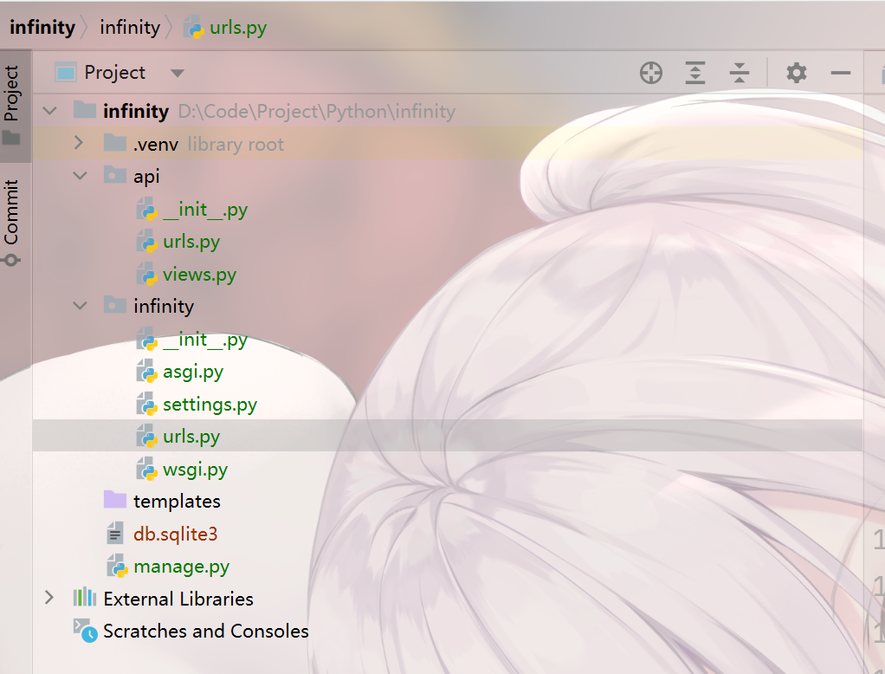
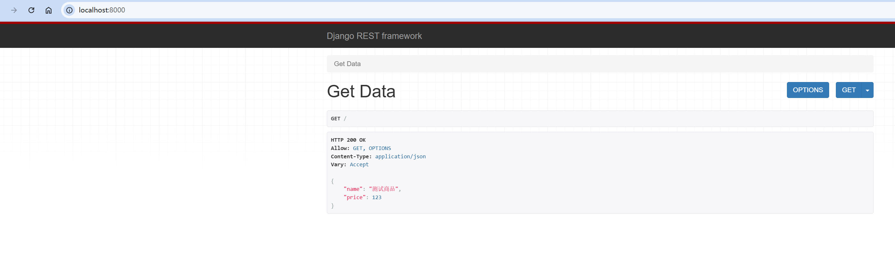
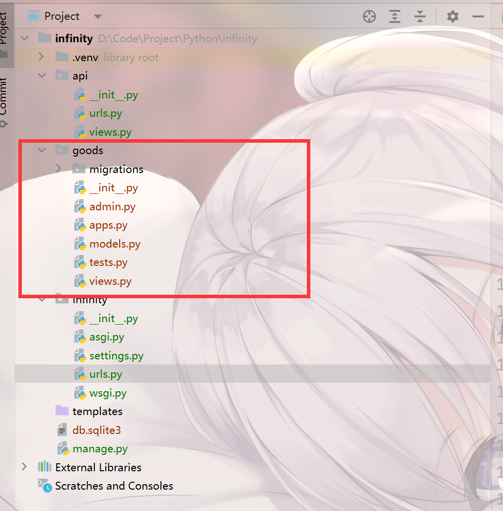
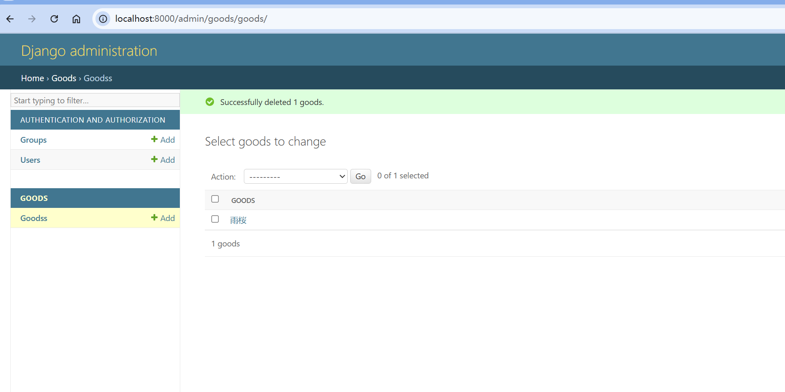
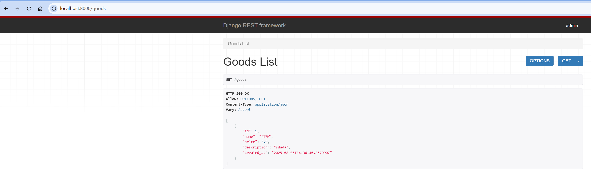
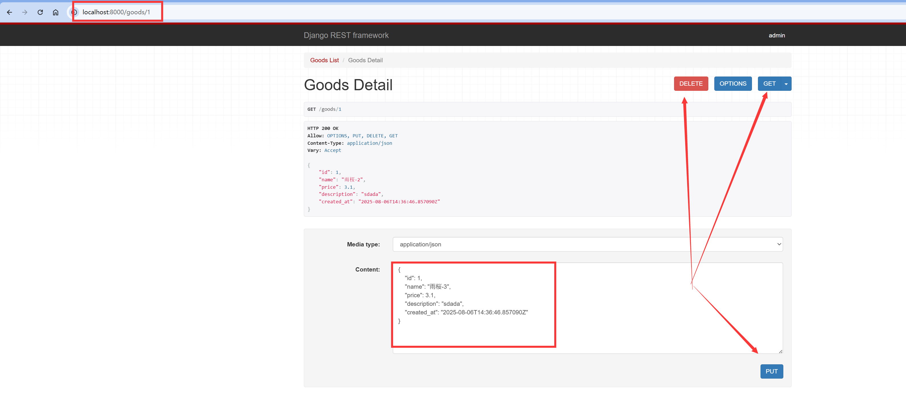

创建一个django项目

```perl
pip install djangorestframework
```

infinity/settings.py 加入依赖

```python
INSTALLED_APPS = [
    'rest_framework',
    ...
]
```

manage.py同级目录下创建api文件夹

api目录下创建

views.py

```python
#处理HTTP响应，并格式化成json
from rest_framework.response import Response
#提供一个装饰器，将基于函数的视图转化成支持restful请求的视图
#简化api端点编写，支持场景的restful方法get、post、delete、put
from rest_framework.decorators import api_view


@api_view(['GET'])
def get_data(request):
    goods={"name":"测试商品","price":123}
    return Response(goods)
```

urls.py 配置路径映射

```python
from django.urls import path
from . import views

urlpatterns = [
    path('', views.get_data)
]
```

infinity/urls.py

```python
from django.contrib import admin
from django.urls import path,include

urlpatterns = [
    path('admin/', admin.site.urls),
    path('', include('api.urls'))
]
```

整体目录结构



此时启动服务，请求localhost:800即可显示数据




终端执行，会自动创建文件

```perl
python manage.py startapp goods
```



注册到infinity/settings.py中

```perl
INSTALLED_APPS = [
    'goods',
    'rest_framework',
    'django.contrib.admin',
    'django.contrib.auth',
    'django.contrib.contenttypes',
    'django.contrib.sessions',
    'django.contrib.messages',
    'django.contrib.staticfiles',
]
```

goods/models.py 创建模型

```python
from django.db import models

# Create your models here.
class Goods(models.Model):
    name = models.CharField(max_length=100)
    price = models.FloatField()
    description = models.TextField()
    created_at = models.DateTimeField(auto_now_add=True)

    def __str__(self):
        return self.name
```

创建完成后终端执行数据迁移

```perl
python manage.py makemigrations

python manage.py migrate
```

创建管理员会自动生成goods/admin.py

```perl
python manage.py createsuperuser
```

```python
from django.contrib import admin
from  . import models
# Register your models here.
admin.site.register(models.Goods)
```

重新启动项目，访问localhost:8000/admin

登陆后即可增删改查



创建api/serializer.py

```python
from rest_framework import serializers
from goods.models import Goods

class GoodsSerializer(serializers.ModelSerializer):
    class Meta:
        model = Goods
        fields = '__all__'
        
```

修改api/views.py

```python
#处理HTTP响应，并格式化成json
from rest_framework.response import Response
#提供一个装饰器，将基于函数的视图转化成支持restful请求的视图
#简化api端点编写，支持场景的restful方法get、post、delete、put
from rest_framework.decorators import api_view

from api.serializers import GoodsSerializer
from goods.models import Goods


@api_view(['GET'])
def goods_list(request):
    goods=Goods.objects.all()
    serializer=GoodsSerializer(goods,many=True)
    return Response(serializer.data)
```

修改api/urls.py

```python
from django.urls import path
from . import views

urlpatterns = [
    path('goods', views.goods_list)
]
```

重启应用，访问localhost:8000/goods 可以查询到刚才的数据




修改api/views.py 支持其他请求

```python
#处理HTTP响应，并格式化成json
from rest_framework import status
from rest_framework.response import Response
#提供一个装饰器，将基于函数的视图转化成支持restful请求的视图
#简化api端点编写，支持场景的restful方法get、post、delete、put
from rest_framework.decorators import api_view

from api.serializers import GoodsSerializer
from goods.models import Goods


@api_view(['GET','POST'])
def goods_list(request):
    if request.method == 'GET':
        goods=Goods.objects.all()
        serializer=GoodsSerializer(goods,many=True)
        return Response(serializer.data)
    if request.method == 'POST':
        serializer=GoodsSerializer(data=request.data)
        if serializer.is_valid():
            serializer.save()
            return Response(serializer.data,status=status.HTTP_201_CREATED)

@api_view(['GET','PUT','DELETE'])
def goods_detail(request,id):
    try:
        goods=Goods.objects.get(id=id)
    except Goods.DoesNotExist:
        return Response(status=status.HTTP_404_NOT_FOUND)
    if request.method == 'GET':
        serializer=GoodsSerializer(goods)
        return Response(serializer.data)
    if request.method == 'PUT':
        serializer=GoodsSerializer(goods,data=request.data)
        if serializer.is_valid():
            serializer.save()
            return Response(serializer.data)
        return Response(serializer.errors,status=status.HTTP_400_BAD_REQUEST)
    if request.method == 'DELETE':
        goods.delete()
        return Response(status=status.HTTP_204_NO_CONTENT)
```

修改api/urls.py

```python
from django.urls import path
from . import views

urlpatterns = [
    path('goods', views.goods_list),
    path('goods/<int:id>', views.goods_detail)
]
```

重启后访问http://localhost:8000/goods/1 即可增删改查

