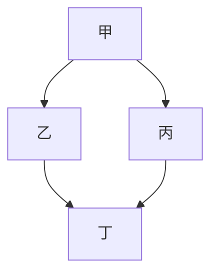
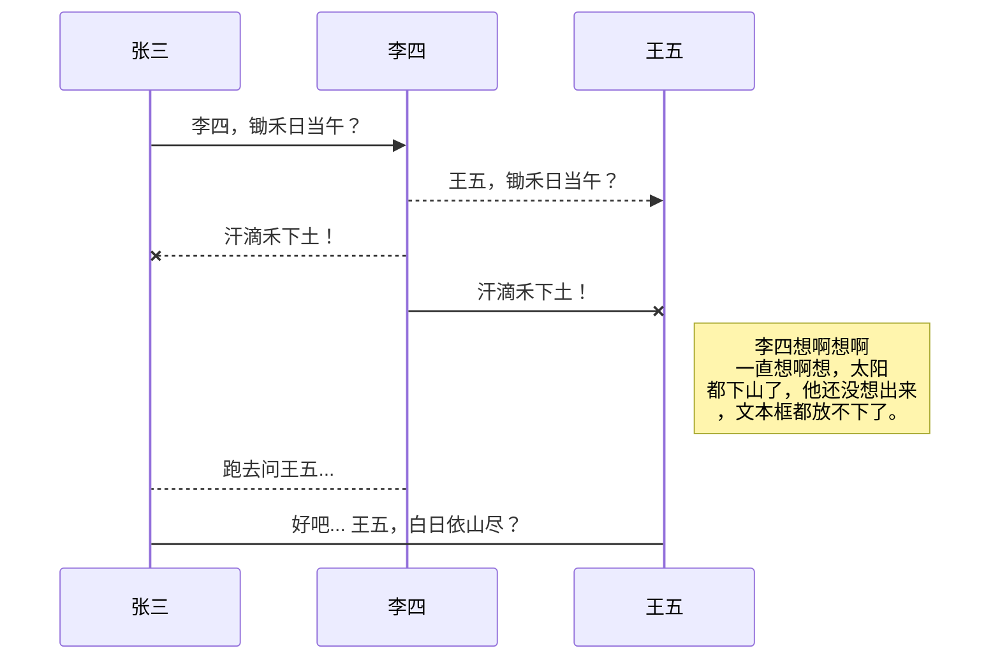

[toc]

# 测试页面（中文版）

本页面服务于两个目的：

- 展示 Kubernetes 中文版文档中应如何使用 Markdown
- 提供一个测试用文档，用来测试可能影响所有文档的 HTML、CSS 和模板变更

## 标题级别

上面的标题是 H2 级别。页面标题（Title）会渲染为 H1。以下各节分别展示 H3-H6 的渲染结果。

### H3

此处为 H3 节内容。

#### H4

此处为 H4 节内容。

##### H5

此处为 H5 节内容。

###### H6

此处为 H6 节内容。

## 内联元素（Inline elements）

内联元素显示在段落文字、列表条目、提醒信息或者块级别元素之内。

> Lorem ipsum dolor sit amet, consectetur adipisicing elit, sed do eiusmod tempor incididunt ut labore et dolore magna aliqua. Ut enim ad minim veniam, quis nostrud exercitation ullamco laboris nisi ut aliquip ex ea commodo consequat. Duis aute irure dolor in reprehenderit in voluptate velit esse cillum dolore eu fugiat nulla pariatur. Excepteur sint occaecat cupidatat non proident, sunt in culpa qui officia deserunt mollit anim id est laborum.

### 内联文本风格

- **粗体字**
- *斜体字*
- ***粗斜体字***
- ~~删除线~~
- 下划线
- *带下划线的斜体*
- ***带下划线的粗斜体***
- `monospace text` <- 等宽字体
- **`monospace bold`** <- 粗等宽字体

## 列表

Markdown 在如何处理列表方面没有严格的规则。在我们从 Jekyll 迁移到 Hugo 时， 我们遇到了一些问题。为了处理这些问题，请注意以下几点：

- 确保你将子列表的条目缩进**两个空格**
- 要结束一个列表并开始一个新的列表，你需要在两个列表之间添加加一个 HTML 注释块， 并将其置于独立的一行，左边顶边对齐。否则前一个列表不会结束，无论你在它与 第二个列表之间放多少个空行。

### 项目符号列表

- 此为列表条目

- 此为另一列表条目，位于同一列表中

- 你可以将

   

  ```
  -
  ```

   

  和

   

  ```
  *
  ```

   

  混合使用

  - 要开始子列表，缩进两个空格。
    - 这是另一个子子条目。进一步多缩进两个空格。
  - 另一个子条目

- 这是一个新的列表。使用 Hugo 时，你需要用一行 HTML 注释将两个紧挨着的列表分开。 **这里的 HTML 注释需要按左侧顶边对齐。**

- 项目符号列表可以中包含文字段落或块元素。

  段落内容与第一行文字左侧对齐。 **此段文字和下面的代码段都与前一行中的“项”字对齐。**

  ```bash
  ls -l
  ```

  - 在块级内容之后还可以有子列表内容。

- 项目符号列表条目中还可以包含编号列表。
  1. 编号子列表条目一
  2. 编号子列表条目二
- 项目符号列表条目中包含编号列表的另一种形式（推荐形式）。让子列表的编号数字 与项目符号列表文字左对齐。
  1. 编号子列表条目一，左侧编号与前一行的“项”字左对齐。
  2. 编号子列表条目二，条目文字与数字之间多了一个空格。

### 编号列表

1. 此为列表条目
2. 此为列表中的第二个条目。在 Markdown 源码中所给的编号数字与最终输出的数字 可能不同。建议在紧凑列表中编号都使用 1。如果条目之间有其他内容（比如注释 掉的英文）存在，则需要显式给出编号。
3. **说明：** 对于单个数字的编号列表，在句点（`.`）后面加两个空格。这样有助于将列表的 内容更好地对齐。

1. 这是一个新的列表。 使用 Hugo 时，你需要用 HTML 注释将两个紧挨着的列表分开。 **HTML 注释需要按左边顶边对齐。**

2. 编号列表条目中也可以包含额外的段落或者块元素。

   后续段落应该按编号列表文字的第一行左侧对齐。 **此段落及下面的代码段都与本条目中的第一个字“编”对齐。**

   ```bash
   ls -l
   ```

   - 编号列表条目中可以在块级内容之后有子列表。子列表的符号项要与上层列表条目 文字左侧对齐。

### 中文译文的编号列表格式 1

1. 译文条目一

1. 译文条目二，由于前述原因，条目 2 与 1 之间存在注释行，如果此条目不显式给出 起始编号，会被 Hugo 当做两个独立的列表。

### 中文译文的编号列表格式 2

1. 译文条目一

   中文译文段落。

   带注释的代码段（**注意以上英文注释 ` 和 `-->` 的缩进空格数**）。

   ```shell
   # 列举服务
   kubectl get svc
   ```

1. 译文条目二，由于前述原因，条目 2 与 1 之间存在注释行，如果此条目不显式给出 起始编号，会被 Hugo 当做两个独立的列表。

### 标签列表

标签列表可以用来有条件地显式内容，例如，当有多种选项可供选择时，每个选项 可能需要完全不同的指令或者上下文。

- [请选择...](https://kubernetes.io/zh-cn/docs/test/#tab-lists-example-0)
- [在标签页中格式化列表](https://kubernetes.io/zh-cn/docs/test/#tab-lists-example-1)
- [嵌套的子标题](https://kubernetes.io/zh-cn/docs/test/#tab-lists-example-2)


请选择一个选项。

### 检查项列表 （Checklists）

检查项列表本质上也是一种项目符号列表，只是这里的项目符号部分被 CSS 压制了。

-  此为第一个检查项
-  此为被选中的检查项

## 代码段

你可以用两种方式来创建代码块。一种方式是将在代码块之前和之后分别加上包含三个 反引号的独立行。**反引号应该仅用于代码段。** 用这种方式标记代码段时，你还可以指定所包含的代码的编程语言，从而启用语法加亮。 这种方式也比使用空格缩进的方式可预测性更好。

```
这是用反引号创建的代码段
```

反引号标记代码段的方式有以下优点：

- 这种方式几乎总是能正确工作
- 在查看源代码时，内容相对紧凑
- 允许你指定代码块的编程语言，以便启用语法加亮
- 代码段的结束位置有明确标记。有时候，采用缩进空格的方式会使得一些对空格 很敏感的语言（如 Python、YAML）很难处理。

要为代码段指定编程语言，可以在第一组反引号之后加上编程语言名称：

```bash
ls -l
```

Kubernetes 文档中代码块常用语言包括：

- `bash` / `shell` （二者几乎完全相同）
- `go`
- `json`
- `yaml`
- `xml`
- `none` （禁止对代码块执行语法加亮）

### 包含 Hugo 短代码的代码块

如果要像上面的例子一样显示 Hugo 短代码（Shortcode），不希望 Hugo 将其当做短代码来处理， 可以在 `<` 和 `>` 之间使用 C 语言风格的注释。 下面的示例展示如何实现这点（查看本页的 Markdown 源码）：

```none

```

## 链接

要格式化链接，将链接显示文本放在方括号中，后接用圆括号括起来的链接目标。 [指向 Kubernetes.io 的连接](https://kubernetes.io/) 或 [到 Kubernetes.io 的相对链接](https://kubernetes.io/)。

你也可以使用 HTML，但这种方式不是推荐的方式。 [到 Kubernetes.io 的链接](https://kubernetes.io/)。

### 中文链接

中文版本文档中的链接要注意以下两点：

- 指向 Kubernetes 文档的站内链接，需要在英文链接之前添加前缀 `/zh`。 例如，原链接目标为 `/docs/foo/bar` 时，译文中的链接目标应为 `/zh-cn/docs/foo/bar`。例如：

  - 英文版本链接 [Kubernetes Components](https://kubernetes.io/docs/concepts/overview/components/)
  - 对应中文链接 [Kubernetes 组件](https://kubernetes.io/zh-cn/docs/concepts/overview/components/)

- 英文页面子标题会生成对应锚点（Anchor），例如子标题 `## Using object` 会生成 对应标签 `#using-objects`。在翻译为中文之后，对应锚点可能会失效。对此，有 两种方法处理。假定译文中存在以下子标题：

  ```
  <!--
  ## Clean up
  
  You can do this ...
  -->
  ## 清理现场
  
  你可以这样 ...
  ```

  并且在本页或其他页面有指向 `#clean-up` 的链接如下：

  ```
  ..., please refer to the [clean up](#clean-up) section.
  ```

  第一种处理方法是将链接改为中文锚点，即将引用该子标题的文字全部改为中文锚点。 例如：

  ```
  ..., 请参考[清理工作](#清理现场)一节。
  ```

  第二种方式（也是推荐的方式）是将原来可能生成的锚点（尽管在英文原文中未明确 给出）显式标记在译文的子标题上。

  ```
  <!--
  ## Clean up
  
  You can do this ...
  -->
  ## 清理现场  {#clean-up}
  
  你可以这样 ...
  ```

  之所以优选第二种方式是因为可以避免文档站点中其他引用此子标题的链接失效。

## 图片

要显示图片，可以使用与链接类似的语法（`[links](#links)`），不过要在整个链接 之前添加一个感叹号（`!`）。方括号中给出的是图片的替代文本。 请坚持为图片设定替代文本，这样使用屏幕阅读器的人也能够了解图片中包含的是什么。


要设置扩展的属性，例如 width、title、caption 等等，可以使用 [figure](https://gohugo.io/content-management/shortcodes/#figure) 短代码，而不是使用 HTML 的 `` 标签。 此外，如果你需要让图片本身变成超链接，可以使用短代码的 `link` 属性，而不是 将整个图片放到 Markdown 的链接语法之内。下面是一个例子：


#### 铅笔图标

用来展示 figure 短代码的图片

即使你不想使用 figure 短代码，图片也可以展示为链接。这里，铅笔图标指向 Kubernetes 网站。外层的方括号将整个 image 标签封装起来，链接目标在 末尾的圆括号之间给出。

[](https://kubernetes.io/)

你也可以使用 HTML 来嵌入图片，不过这种方式是不推荐的。


## 表格

简单的表格可能每行只有一个独立的数据行，各个列之间用 `|` 隔开。 表格的标题行与表格内容之间用独立的一行隔开，在这一行中每个单元格的内容 只有 `-` 字符，且至少三个。出于方便维护考虑，请尝试将各个单元格间的 分割线对齐，尽管这样意味着你需要多输入几个空格。

| 标题单元格 1 | 标题单元格 2 |
| ------------ | ------------ |
| 内容单元格 1 | 内容单元格 2 |

标题行是可选的。所有用 `|` 隔开的内容都会被渲染成表格。

Markdown 表格在处理块级元素方面还很笨拙。例如在单元格中嵌入列表条目、代码段、 或者在其中划分多个段落方面的能力都比较差。对于复杂的或者很宽的表格，可以使用 HTML。

| 标题单元格 1 | 标题单元格 2 |
| ------------ | ------------ |
| 内容单元格 1 | 内容单元格 2 |

## 使用 Mermaid 来可视化

你可以使用 [Mermaid JS](https://mermaidjs.github.io/) 来进行可视化展示。 Mermaid JS 版本在 [/layouts/partials/head.html](https://github.com/kubernetes/website/blob/main/layouts/partials/head.html) 中设置。

~~~javascript
```mermain
graph TD;
  甲-->乙;
  甲-->丙;
  乙-->丁;
  丙-->丁;
```
~~~

会产生：



```
​```mermaid
sequenceDiagram
    张三 ->> 李四: 李四，锄禾日当午？
    李四-->>王五: 王五，锄禾日当午？
    李四--x 张三: 汗滴禾下土！
    李四-x 王五: 汗滴禾下土！
    Note right of 王五: 李四想啊想啊<br/>一直想啊想，太阳<br/>都下山了，他还没想出来<br/>，文本框都放不下了。

    李四-->张三: 跑去问王五...
    张三->王五: 好吧... 王五，白日依山尽？
​```
```

产生：




在官方网站上有更多的[示例](https://mermaid-js.github.io/mermaid/#/examples)。

## 侧边栏和提醒框

侧边栏和提醒框可以为文本提供直观的重要性强调效果，可以偶尔一用。

### 侧边栏（Sidebar）

侧边栏可以将文字横向平移，只是其显示效果可能不像[提醒](https://kubernetes.io/zh-cn/docs/test/#admonitions)那么明显。

> 此为侧边栏。
>
> 你可以在侧边栏内排版段落和块级元素。
>
> 你甚至可以在其中包含代码块。
>
> ```bash
> sudo dmesg
> ```

### 提醒框

提醒框（说明、警告等等）都是用 Hugo 短代码的形式展现。

**说明：**

说明信息用来引起读者的注意，但不过分强调其紧迫性。

你可以在提醒框内包含多个段落和块级元素。

| 甚至 | 包含 | 表格 |

**注意：** 读者继续此操作时要格外小心。

**警告：** 警告信息试图为读者指出一些不应忽略的、可能引发问题的事情。

注意，在较老的 Hugo 版本中，直接将 `note`、`warning` 或 `caution` 短代码 括入 HTML 注释当中是有问题的。这些短代码仍然会起作用。目前，在 0.70.0 以上版本中似乎已经修复了这一问题。

## 包含其他页面

要包含其他页面，可使用短代码。

**说明：**

你必须拥有一个 Kubernetes 的集群，同时你的 Kubernetes 集群必须带有 kubectl 命令行工具。 建议在至少有两个节点的集群上运行本教程，且这些节点不作为控制平面主机。 如果你还没有集群，你可以通过 [Minikube](https://minikube.sigs.k8s.io/docs/tutorials/multi_node/) 构建一个你自己的集群，或者你可以使用下面任意一个 Kubernetes 工具构建：

- [Killercoda](https://killercoda.com/playgrounds/scenario/kubernetes)
- [玩转 Kubernetes](http://labs.play-with-k8s.com/)