开局==```mermaid==启动流程图代码块

# graph（流程图）

## 基本使用

* 节点名不能与关键字同名
* 使用引号可以避免一些不必要的麻烦，如避免与关键字同名

* 关键字graph表示一个流程图的开始，同时需要指定该图的方向

图方向

- TB，从上到下
- TD，从上到下
- BT，从下到上
- RL，从右到左
- LR，从左到右

> T = TOP，B = BOTTOM，L = LEFT，R = RIGHT，D = DOWN

```perl
graph LR;
  A-->B
  B-->C
  C-->D
  D-->A
```

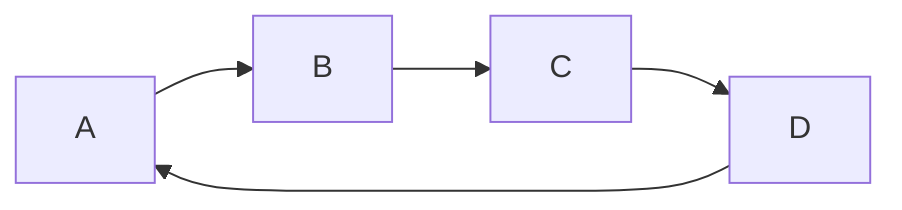

## 节点形状

- 默认节点 A
- 文本节点 B[bname]
- 圆角节点 C(cname)
- 圆形节点 D((dname))
- 非对称节点 E>ename]
- 菱形节点 F{fname}

> A~F 是当前节点名字，类似于变量名，画图时便于引用

[b~f]name是节点中显示的文字，默认节点的名字和显示的文字都为A

```scss
graph TB
  A
  B[bname]
  C(cname)
  D((dname))
  E>ename]
  F{fname}
```

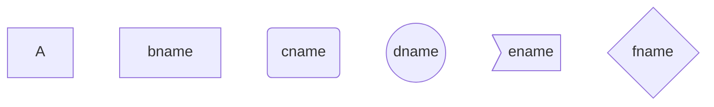

## 连线

节点间的连接线有多种形状，可以在连接线中加入标签：

- 箭头连接 A1–->B1
- 开放连接 A2—B2
- 标签连接 A3–text—B3
- 箭头标签连接 A4–text–>B4
- 虚线开放连接 A5.-B5
- 虚线箭头连接 A6-.->B6
- 标签虚线连接 A7-.text.-B7
- 标签虚线箭头连接 A8-.text.->B8
- 粗线开放连接 A9===B9
- 粗线箭头连接 A10==>B10
- 标签粗线开放连接 A11\==text===B11
- 标签粗线箭头连接 A12\==text==>B12

```perl
graph TB
  A1-->B1
  A2---B2
  A3--text---B3
  A4--text-->B4
  A5-.-B5
  A6-.->B6
  A7-.text.-B7
  A8-.text.->B8
  A9===B9
  A10==>B10
  A11==text===B11
  A12==text==>B12
```

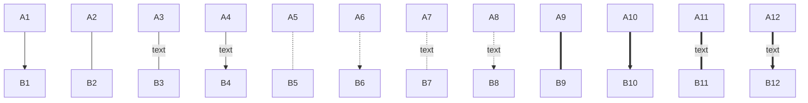

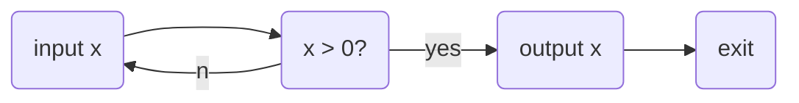

# subgraph（子图）

## 基本使用

```perl
# 外面的那层, 可以使用子图中的节点，子图中的节点名不是隔离的，可以认为是全局变量-.-
graph LR
  subgraph title1
    graph definition 
  end
  subgraph title2
    graph definition 
  end
```

**实例：**

```perl
graph LR
  subgraph g1
    a1-->b1
  end
  subgraph g2
    a2-->b2
  end
  subgraph g3
    a3-->b3
  end
  a3-->a2
```

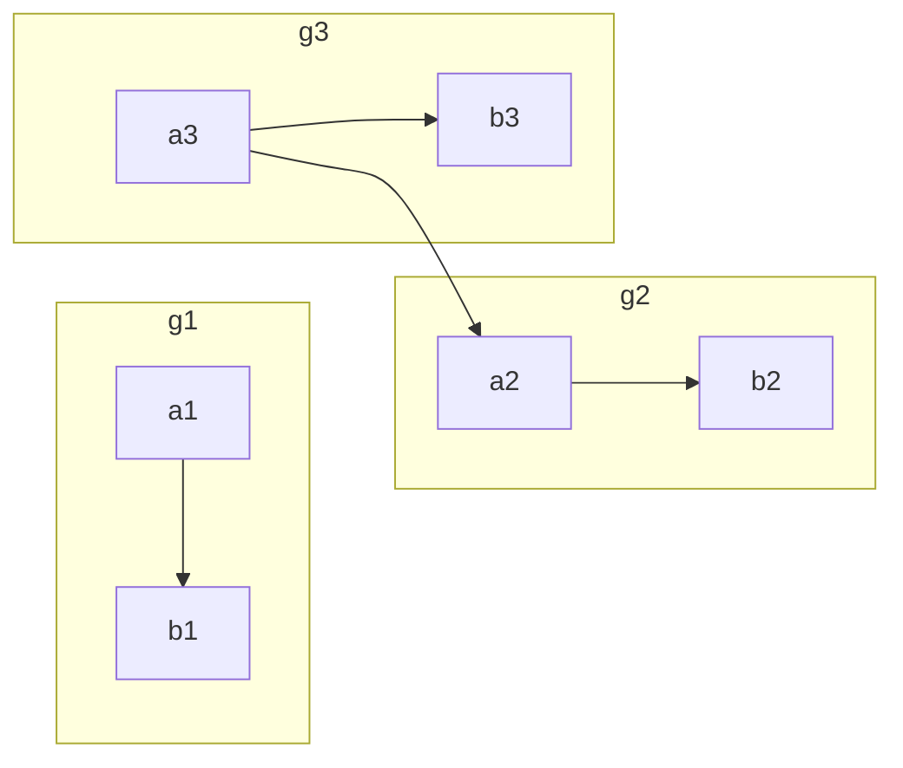

# sequence diagram （序列图）

## 基本使用

- participant，参与者，相当先定义模块，可通过设定参与者(participant)的顺序控制展示顺序
- note， 便签，格式如下

```perl
note [right of | left of][Actor]:Text
# 给多个模块做标签, 通过逗号分割
note over [Actor1, Actor2...]:Text
```

- 循环

```perl
loop Loop_text
... statements...
end
```

* 选择

```perl
alt Describing_text
...statements...
else
...statements...
end
 
# 推荐在没有else的情况下使用 opt(option,选择)
 
opt Describing_text
...statements...
end
```

**实例：**

```perl
sequenceDiagram
　　Alice->>Bob: Hello Bob, how are you?
　　alt is sick
　　　　Bob->>Alice:not so good :(
　　else is well
　　　　Bob->>Alice:good
　　end
　　opt Extra response
　　　　Bob->>Alice:Thanks for asking
　　end
```

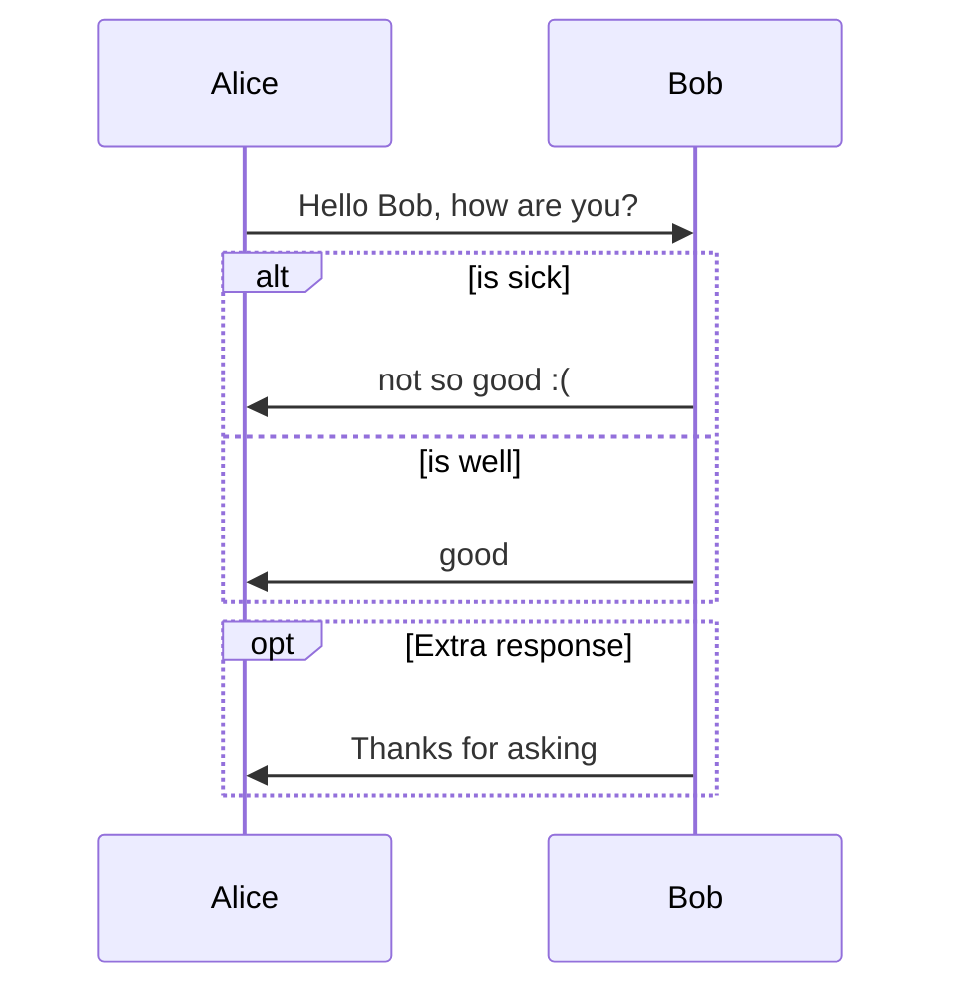

## 连线

- 无箭头实线 ->
- 有箭头实线 ->>
- 无箭头虚线 –>
- 有箭头虚线 –>>
- 带x实线 -x
- 带x虚线 –x

```perl
sequenceDiagram
  Note right of A: 倒霉, 碰到B了
  A->B:   Hello B, how are you ?
  note left of B: 倒霉,碰到A了
  B-->A:  Fine, thx, and you?
  note over A,B: 快点溜，太麻烦了
  A->>B:  I'm fine too.
  note left of B: 快点打发了A
  B-->>A: Great!
  note right of A: 溜之大吉
  A-xB:   Wait a moment
  loop Look B every minute
　  A->>B: look B, go?
　　B->>A: let me go?
　end
　B--xA: I'm off, byte 　
  note right of A: 太好了, 他走了
```

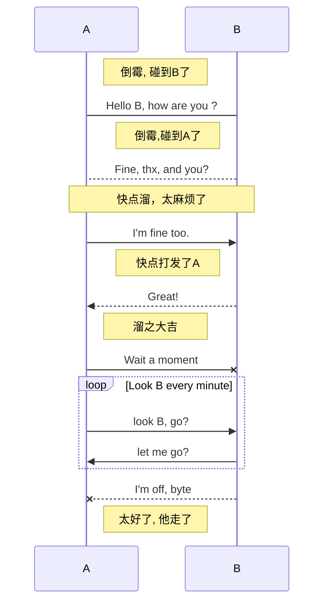

想改变AB的顺序怎么办呢？

```perl
sequenceDiagram
  # 通过设定参与者(participant)的顺序控制展示顺序
  participant B
  participant A
   Note right of A: 倒霉, 碰到B了
  A->B:   Hello B, how are you ?
  note left of B: 倒霉,碰到A了
  B-->A:  Fine, thx, and you?
  note over A,B:快点溜，太麻烦了。。。
  A->>B:  I'm fine too.
  note left of B: 快点打发了A
  B-->>A: Great!
  note right of A: 溜之大吉
  A-xB:   Wait a moment
  loop Look B every minute
　  A->>B: look B, go?
　　B->>A: let me go?
　end
　B--xA: I'm off, byte 　
  note right of A: 太好了, 他走了
```

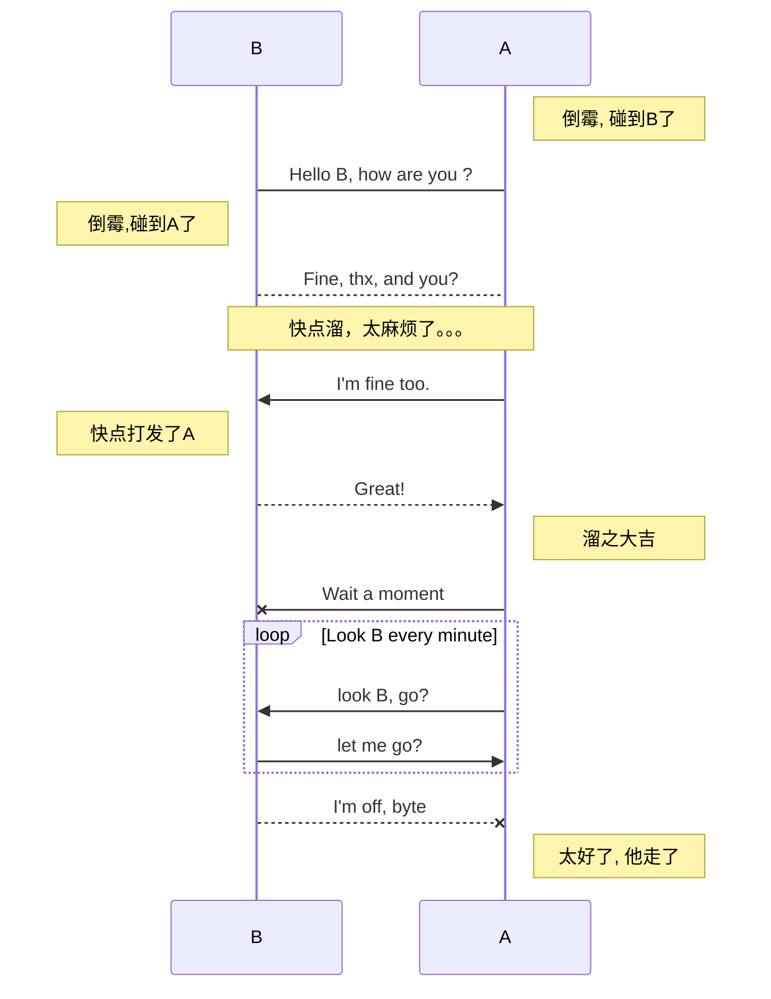

```perl
sequenceDiagram
  # 通过设定参与者(participants)的顺序控制展示模块顺序
  participant Alice
　participant Bob
　participant John
　Alice->John:Hello John, how are you?
　loop Healthcheck
　  John->John:Fight against hypochondria
　end
　Note right of John:Rational thoughts <br/>prevail...
　John-->Alice:Great!
　John->Bob: How about you?
　Bob-->John: good!
```

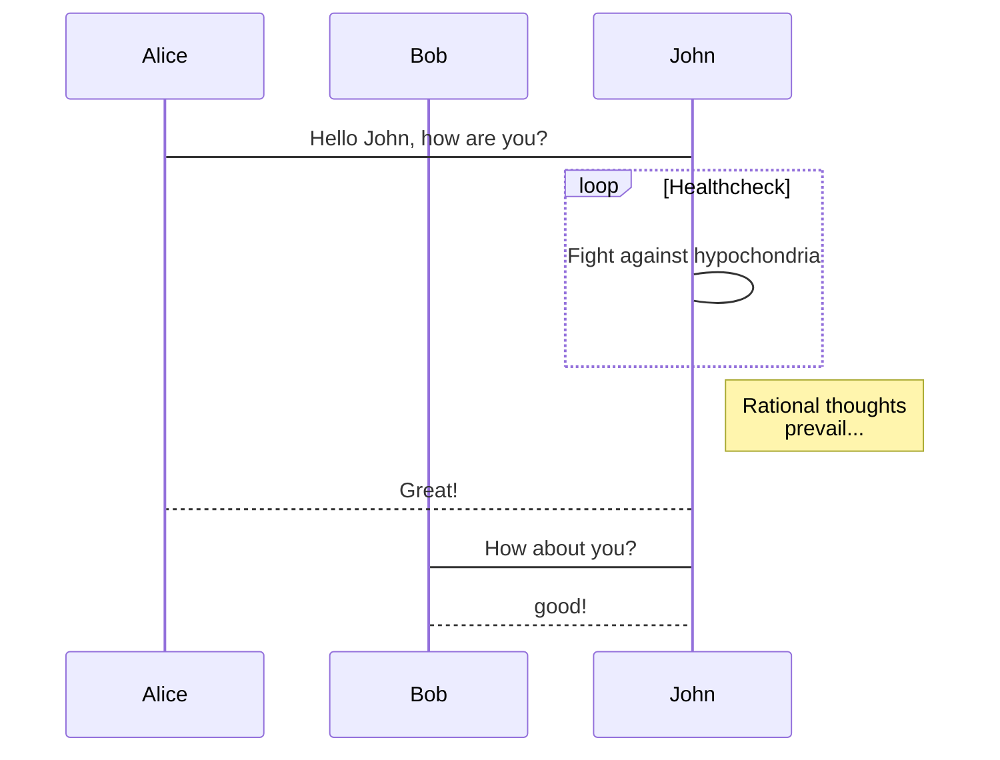

# gantt diagram(甘特图)

甘特图是一类条形图，由Karol Adamiechi在1896年提出, 而在1910年Henry Gantt也独立的提出了此种图形表示。通常用在对项目终端元素和总结元素的开始及完成时间进行的描述

## 基本使用

| title      | 标题                                                         |
| :--------- | :----------------------------------------------------------- |
| dateFormat | [日期格式](http://momentjs.com/docs/#/parsing/string-format/) |
| section    | 模块                                                         |
| Completed  | 已经完成                                                     |
| Active     | 当前正在进行                                                 |
| Future     | 后续待处理                                                   |
| crit       | 关键阶段                                                     |
| 日期缺失   | 默认从上一项完成后                                           |

```less
gantt
dateFormat YYYY-MM-DD
section S1
T1: 2014-01-01, 9d
section S2
T2: 2014-01-11, 9d
section S3
T3: 2014-01-02, 9d
```

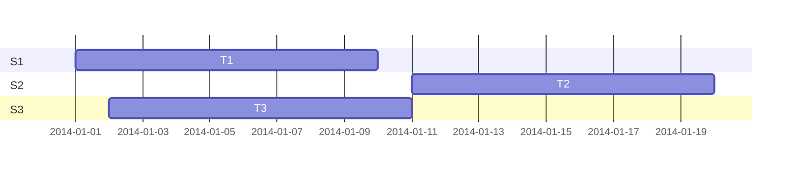

```perl
gantt
    dateFormat  YYYY-MM-DD
    title Adding GANTT diagram functionality to mermaid
 
    section A section
    Completed task            :done,    des1, 2014-01-06,2014-01-08
    Active task               :active,  des2, 2014-01-09, 3d
    Future task               :         des3, after des2, 5d
    Future task2               :         des4, after des3, 5d
 
    section Critical tasks
    Completed task in the critical line :crit, done, 2014-01-06,24h
    Implement parser and jison          :crit, done, after des1, 2d
    Create tests for parser             :crit, active, 3d
    Future task in critical line        :crit, 5d
    Create tests for renderer           :2d
    Add to mermaid                      :1d
 
    section Documentation
    Describe gantt syntax               :active, a1, after des1, 3d
    Add gantt diagram to demo page      :after a1  , 20h
    Add another diagram to demo page    :doc1, after a1  , 48h
 
    section Last section
    Describe gantt syntax               :after doc1, 3d
    Add gantt diagram to demo page      : 20h
    Add another diagram to demo page    : 48h
```

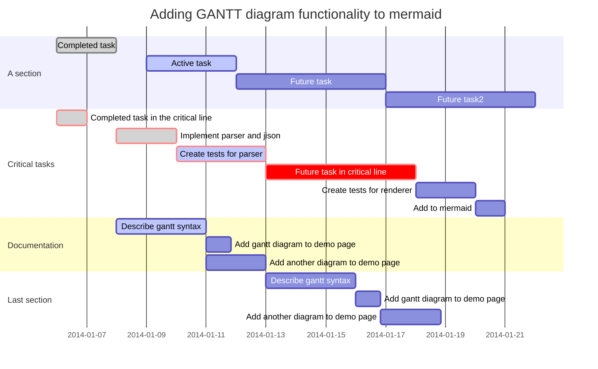

