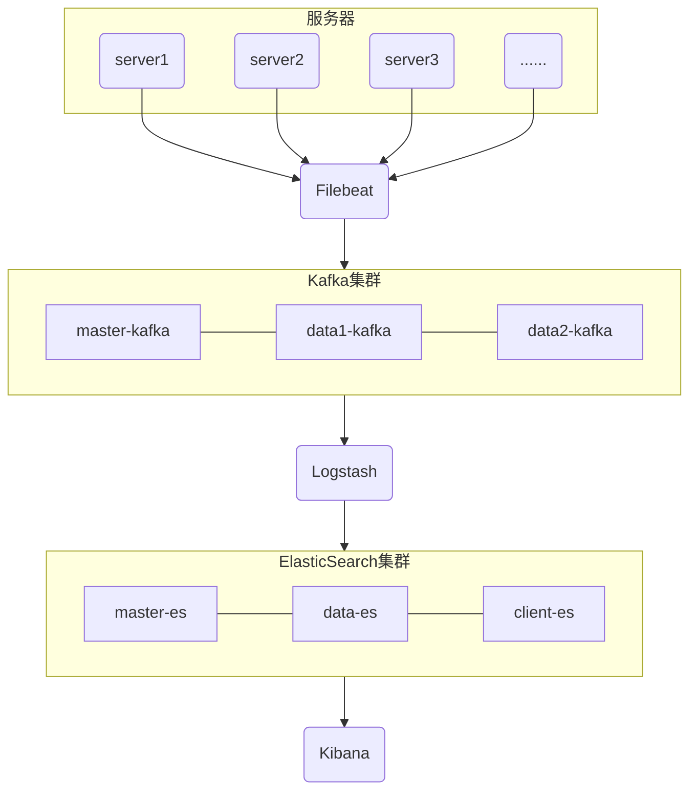
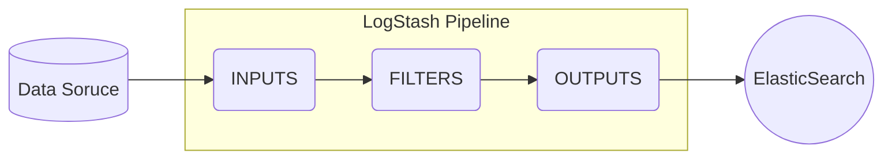
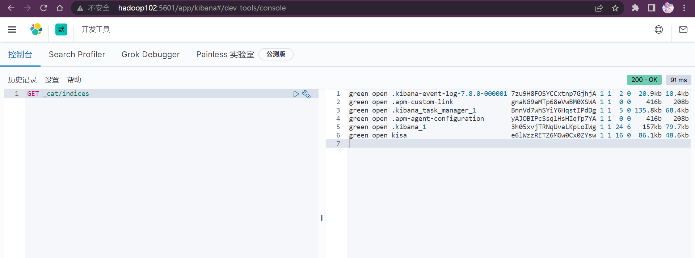
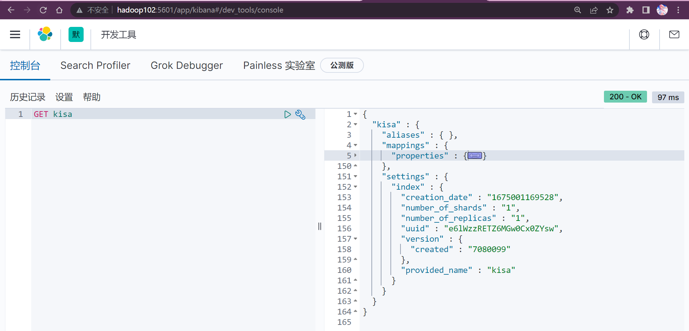
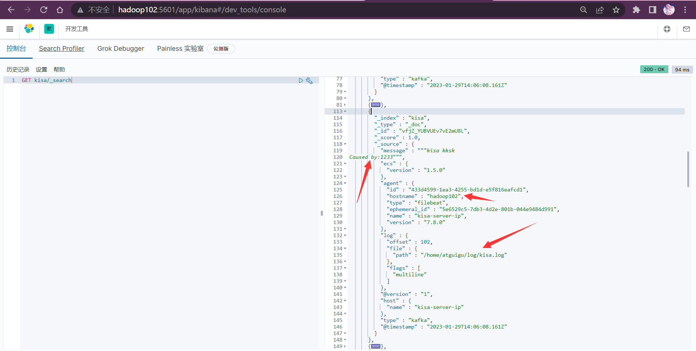
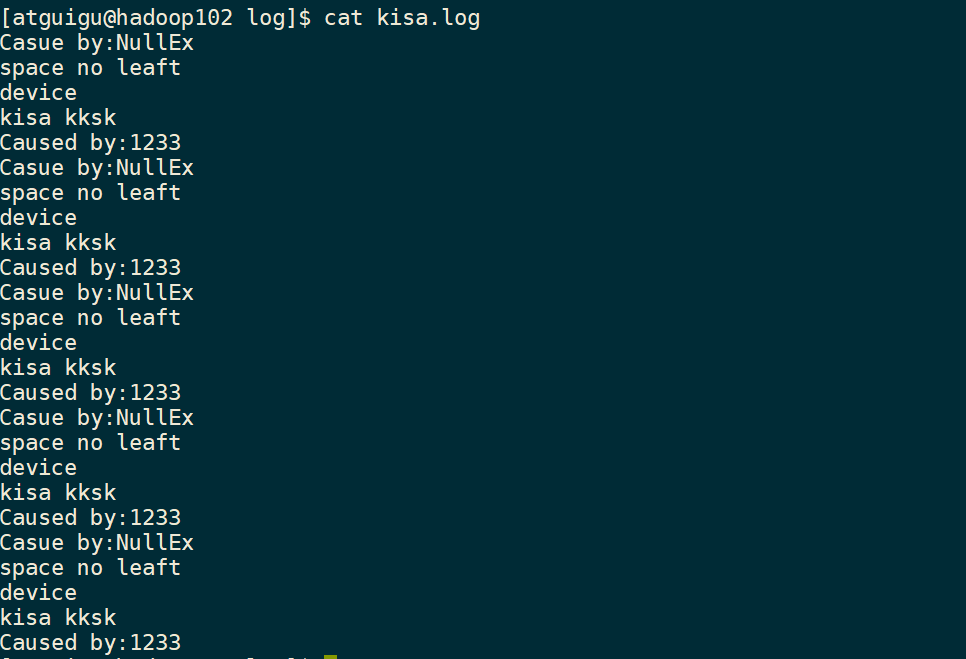
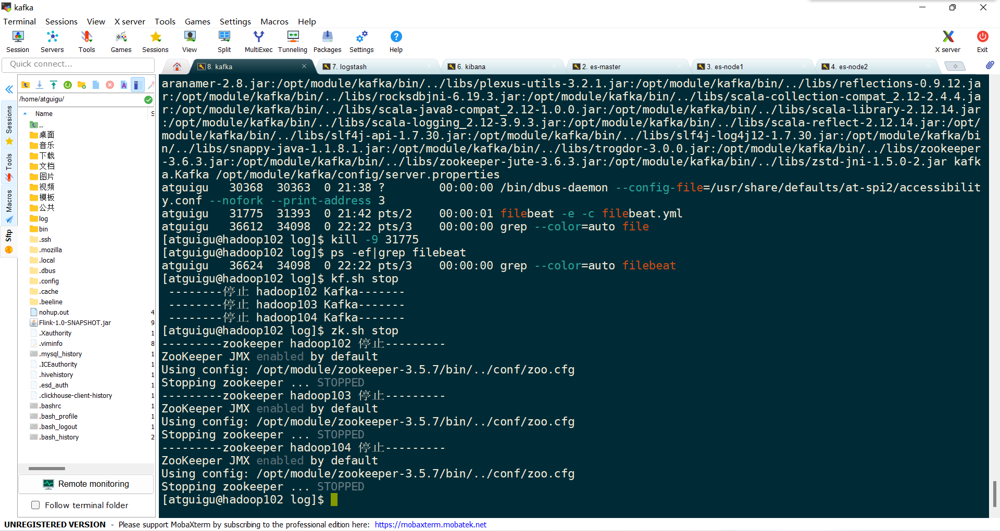

# ELK介绍

由于logstash是Java开发，运行时候会占用较大的资源（内存、CPU等），假如每台服务器都安装运行一个logstash，对业务影响太大，实际应用中，logstash仅发挥它的日志过滤功能，日志收集将交给filebeat。

企业级别的ELK日志分析平台，考虑到安全性、稳定性，为提升Elasticsearch消息处理效率、存储容量与防止Elasticsearch宕机日志丢失，所以引入Elasticsearch分布式集群架构。随着业务量增大，由filebeat直接传递logstash可能业务量过大导致数据丢失或宕机，所以引入kafka，达到削峰、异步作用。同时kafka也有保存日志数据，增加一层保险的作用。为了解决kafka宕机可能造成损失，kafka也需要做成集群。

filebeat是什么？filebeat是一个轻量级日志传输工具(Golang开发)，只占用些许的资源，就能做到收集海量的日志。因此，ELK组合中将加入filebeat。

分布式集群架构是什么？其实就是加多几台机子，几台机子组成一个集群，几台机子一起工作，肯定比单独一台效率高。而且当其中一台机子坏掉，也有其余的机子顶上去，不会影响业务。

kafka是什么？kafka是一种高吞吐量的分布式发布订阅消息系统，在ELK中扮演日志存储、备份、中转的角色，起到数据备份、削峰的作用。因此，ELK组合将做成ELK集群，同时加入kafka角色。

## **整体架构**



# ELK版本对应关系

https://www.elastic.co/cn/support/matrix#matrix_compatibility

## ELK兼容性

Last updated: 2023-01-10

| Elasticsearch | Kibana |   Logstash^*   |
| :-----------: | :----: | :------------: |
|     5.0.x     | 5.0.x  |  2.4.x-5.6.x   |
|     5.1.x     | 5.1.x  |  2.4.x-5.6.x   |
|     5.2.x     | 5.2.x  |  2.4.x-5.6.x   |
|     5.3.x     | 5.3.x  |  2.4.x-5.6.x   |
|     5.4.x     | 5.4.x  |  2.4.x-5.6.x   |
|     5.5.x     | 5.5.x  |  2.4.x-5.6.x   |
|     5.6.x     | 5.6.x  |  2.4.x-6.0.x   |
|     6.0.x     | 6.0.x  |  5.6.x-6.8.x   |
|     6.1.x     | 6.1.x  |  5.6.x-6.8.x   |
|     6.2.x     | 6.2.x  |  5.6.x-6.8.x   |
|     6.3.x     | 6.3.x  |  5.6.x-6.8.x   |
|     6.4.x     | 6.4.x  |  5.6.x-6.8.x   |
|     6.5.x     | 6.5.x  |  5.6.x-6.8.x   |
|     6.6.x     | 6.6.x  |  5.6.x-6.8.x   |
|     6.7.x     | 6.7.x  |  5.6.x-6.8.x   |
|     6.8.x     | 6.8.x  |  5.6.x-6.8.x   |
|     7.0.x     | 7.0.x  |  6.8.x-7.17.x  |
|     7.1.x     | 7.1.x  |  6.8.x-7.17.x  |
|     7.2.x     | 7.2.x  |  6.8.x-7.17.x  |
|     7.3.x     | 7.3.x  |  6.8.x-7.17.x  |
|     7.4.x     | 7.4.x  |  6.8.x-7.17.x  |
|     7.5.x     | 7.5.x  |  6.8.x-7.17.x  |
|     7.6.x     | 7.6.x  |  6.8.x-7.17.x  |
|     7.7.x     | 7.7.x  |  6.8.x-7.17.x  |
|     7.8.x     | 7.8.x  |  6.8.x-7.17.x  |
|     7.9.x     | 7.9.x  |  6.8.x-7.17.x  |
|    7.10.x     | 7.10.x |  6.8.x-7.17.x  |
|    7.11.x     | 7.11.x |  6.8.x-7.17.x  |
|    7.12.x     | 7.12.x |  6.8.x-7.17.x  |
|    7.13.x     | 7.13.x |  6.8.x-7.17.x  |
|    7.14.x     | 7.14.x |  6.8.x-7.17.x  |
|    7.15.x     | 7.15.x |  6.8.x-7.17.x  |
|    7.16.x     | 7.16.x |  6.8.x-7.17.x  |
|    7.17.x     | 7.17.x |  6.8.x-7.17.x  |
|     8.0.x     | 8.0.x  | 7.17.x - 8.5.x |
|     8.1.x     | 8.1.x  | 7.17.x - 8.5.x |
|     8.2.x     | 8.2.x  | 7.17.x - 8.5.x |
|     8.3.x     | 8.3.x  | 7.17.x - 8.5.x |
|     8.4.x     | 8.4.x  | 7.17.x - 8.5.x |
|     8.5.x     | 8.5.x  | 7.17.x - 8.5.x |
|     8.6.x     | 8.6.x  |                |

## Filebeat与Logstash 的兼容性

Last updated: 2023-01-10

| Logstash |   Beats**    |    APM Server    | Monitoring & Management Elasticsearch Cluster* |
| :------: | :----------: | :--------------: | :--------------------------------------------: |
|  2.4.x   | 1.0.x-5.6.x  |       N/A        |                      N/A                       |
|  5.0.x   | 1.3.x-5.6.x  |       N/A        |                      N/A                       |
|  5.1.x   | 5.0.x-5.6.x  |       N/A        |                      N/A                       |
|  5.2.x   | 5.0.x-5.6.x  |       N/A        |                 5.2.x - 5.6.x                  |
|  5.3.x   | 5.0.x-5.6.x  |       N/A        |                 5.3.x - 5.6.x                  |
|  5.4.x   | 5.0.x-5.6.x  |       N/A        |                 5.4.x - 5.6.x                  |
|  5.5.x   | 5.0.x-5.6.x  |       N/A        |                 5.5.x - 5.6.x                  |
|  5.6.x   | 5.6.x-6.8.x  |       N/A        |                 5.6.x - 6.0.x                  |
|  6.0.x   | 5.6.x-6.8.x  |       N/A        |                 6.0.x - 6.8.x                  |
|  6.1.x   | 5.6.x-6.8.x  |       N/A        |                 6.1.x - 6.8.x                  |
|  6.2.x   | 5.6.x-6.8.x  |       N/A        |                 6.2.x - 6.8.x                  |
|  6.3.x   | 5.6.x-6.8.x  |       N/A        |                 6.3.x - 6.8.x                  |
|  6.4.x   | 5.6.x-6.8.x  |       N/A        |                 6.4.x - 6.8.x                  |
|  6.5.x   | 5.6.x-6.8.x  |       N/A        |                 6.5.x - 6.8.x                  |
|  6.6.x   | 5.6.x-6.8.x  |       N/A        |                 6.6.x - 6.8.x                  |
|  6.7.x   | 5.6.x-6.8.x  |  6.7.x - 6.8.x   |                 6.7.x - 6.8.x                  |
|  6.8.x   | 5.6.x-6.8.x  |      6.8.x       |                     6.8.x                      |
|  7.0.x   | 6.8.x-7.17.x |   7.0.x-7.17.x   |                  7.0.x-7.17.x                  |
|  7.1.x   | 6.8.x-7.17.x |   7.1.x-7.17.x   |                  7.1.x-7.17.x                  |
|  7.2.x   | 6.8.x-7.17.x |   7.2.x-7.17.x   |                  7.2.x-7.17.x                  |
|  7.3.x   | 6.8.x-7.17.x |   7.3.x-7.17.x   |                  7.3.x-7.17.x                  |
|  7.4.x   | 6.8.x-7.17.x |   7.4.x-7.17.x   |                  7.4.x-7.17.x                  |
|  7.5.x   | 6.8.x-7.17.x |   7.5.x-7.17.x   |                  7.5.x-7.17.x                  |
|  7.6.x   | 6.8.x-7.17.x |   7.6.x-7.17.x   |                  7.6.x-7.17.x                  |
|  7.7.x   | 6.8.x-7.17.x |   7.7.x-7.17.x   |                  7.7.x-7.17.x                  |
|  7.8.x   | 6.8.x-7.17.x |   7.8.x-7.17.x   |                  7.8.x-7.17.x                  |
|  7.9.x   | 6.8.x-7.17.x |   7.9.x-7.17.x   |                  7.9.x-7.17.x                  |
|  7.10.x  | 6.8.x-7.17.x |  7.10.x-7.17.x   |                 7.10.x-7.17.x                  |
|  7.11.x  | 6.8.x-7.17.x |  7.11.x-7.17.x   |                 7.11.x-7.17.x                  |
|  7.12.x  | 6.8.x-7.17.x |  7.12.x-7.17.x   |                 7.12.x-7.17.x                  |
|  7.13.x  | 6.8.x-7.17.x |  7.13.x-7.17.x   |                 7.13.x-7.17.x                  |
|  7.14.x  | 6.8.x-7.17.x |  7.14.x-7.17.x   |                 7.14.x-7.17.x                  |
|  7.15.x  | 6.8.x-7.17.x |  7.15.x-7.17.x   |                 7.15.x-7.17.x                  |
|  7.16.x  | 6.8.x-7.17.x | 7.16.x-7.17.x*** |                 7.16.x-7.17.x                  |
|  7.17.x  | 6.8.x-7.17.x |    7.17.x***     |                     7.17.x                     |
|  8.0.x   | 7.17.x-8.6.x |  8.0.x-8.5.x***  |                  8.0.x-8.6.x                   |
|  8.1.x   | 7.17.x-8.6.x |  8.1.x-8.5.x***  |                  8.1.x-8.6.x                   |
|  8.2.x   | 7.17.x-8.6.x |  8.2.x-8.5.x***  |                  8.2.x-8.6.x                   |
|  8.3.x   | 7.17.x-8.6.x |  8.3.x-8.5.x***  |                  8.3.x-8.6.x                   |
|  8.4.x   | 7.17.x-8.6.x |  8.4.x-8.5.x***  |                  8.4.x-8.6.x                   |
|  8.5.x   | 7.17.x-8.6.x |  8.5.x-8.6.x***  |                     8.5.x                      |
|  8.6.x   | 7.17.x-8.6.x |     8.6.x***     |                                                |

# ELK下载

elasticsearch国内华为镜像：https://mirrors.huaweicloud.com/elasticsearch/

logstash国内华为镜像：https://mirrors.huaweicloud.com/logstash/

kibana国内华为镜像：https://mirrors.huaweicloud.com/kibana/

filebeat国内华为镜像：https://repo.huaweicloud.com/filebeat/

jdk国内华为镜像：https://repo.huaweicloud.com/java/jdk/

# ELK 部署

## 环境规划

**版本**

| ElasticSearch | LogStash | Kibana | Filebeat | Kafka | zookeeper | jdk  |
| ------------- | -------- | ------ | -------- | ----- | --------- | ---- |
| 7.8.0         | 7.8.0    | 7.8.0  | 7.8.0    | 3.0.0 | 3.5.7     | 8    |

**服务器**

| IP             | software           | role                                                         |
| -------------- | ------------------ | ------------------------------------------------------------ |
| 192.168.10.102 | ELKF+kafka         | elasticsearch主节点，kafka主节点，logstash，kibana，filebeat |
| 192.168.10.103 | elasticserch+kafka | elasticsearch数据节点，kafka集群节点1                        |
| 192.168.10.104 | elasticserch+kafka | elasticsearch客户端节点，kafka集群节点2                      |

## Filebeat

### 1.filebeat.yml配置

`paths`：日志文件路径

`fileds`：日志主题

`hosts`：kafka主机ip和端口

`topic`：kafka主题

`version`：kafka的版本

`drop_fields`：舍弃不必要的字段

`name`：本机IP

```yaml
filebeat.inputs:
  - type: log
    enabled: true
    paths:
      - /home/atguigu/log/*.log
    log_topic: kisa
    multiline:
      pattern: '^[[:space:]]+(at|\.{3})\b|^Caused by:'
      negate: false
      match: after
filebeat.config.modules:
  path: ${path.config}/modules.d/*.yml
  reload.enabled: false
output.kafka:
  enabled: true
  hosts: [ "hadoop102:9092","hadoop103:9092","hadoop104:9092" ]
  topic: kisa-log
  version: "2.0.0"
  compression: gzip

processors:
  - drop_fields:
      fields: [ "beat", "input", "source", "offset" ]

logging.level: error
name: kisa-server-ip
```

*验证配置文件是否有效*

```perl
filebeat test config -c filebeat.yml
```

### 2.常用命令

- 终端启动（退出终端或ctrl+c会退出运行）

```perl
filebeat -e -c filebeat.yml
```

- 以后台守护进程启动启动filebeats

```perl
nohup filebeat -e -c filebeat.yml &
```

- 确认配置不再修改，可用如下命令

```perl
#可以防止日志爆盘，将所有标准输出及标准错误输出到/dev/null空设备，即没有任何输出信息。
nohup filebeat -e -c filebeat.yml >/dev/null 2>&1 &
```

- 停止运行FileBeat进程

```perl
ps -ef | grep filebeat
Kill -9 [pid]
```

### 3.测试

当FileBeat在服务主机采集应用日志并向Kafka输出日志时可以通过两个步骤验证Filebeat的采集输送是否正常：

- 采集验证：启动filebeat服务，查看控制台输出，如果服务有异常会直接打印出来并自动停止服务。

```perl
filebeat -e -c filebeat.yml
```

- 接收验证：Kafka集群控制台直接消费消息，验证接收到的日志信息。

```perl
kafka-topics.sh --bootstarp-server hadoop102:9092 --list|grep kisa
```

```shell
[atguigu@hadoop102 module]$ kafka 2 kisa-log
{"@timestamp":"2023-01-29T13:22:55.828Z","@metadata":{"beat":"filebeat","type":"_doc","version":"7.8.0"},"message":"Casue by:NullEx","log":{"file":{"path":"/home/atguigu/log/kisa.log"},"offset":0},"ecs":{"version":"1.5.0"},"host":{"name":"kisa-server-ip"},"agent":{"version":"7.8.0","hostname":"hadoop102","ephemeral_id":"78c638ee-a201-4aae-a093-0999e7faf1e5","id":"433d4599-1ea3-4255-bd1d-e5f816eafcd1","name":"kisa-server-ip","type":"filebeat"}}
{"@timestamp":"2023-01-29T13:22:55.828Z","@metadata":{"beat":"filebeat","type":"_doc","version":"7.8.0"},"log":{"offset":16,"file":{"path":"/home/atguigu/log/kisa.log"}},"message":"space no leaft","ecs":{"version":"1.5.0"},"host":{"name":"kisa-server-ip"},"agent":{"hostname":"hadoop102","ephemeral_id":"78c638ee-a201-4aae-a093-0999e7faf1e5","id":"433d4599-1ea3-4255-bd1d-e5f816eafcd1","name":"kisa-server-ip","type":"filebeat","version":"7.8.0"}}
{"@timestamp":"2023-01-29T13:22:55.828Z","@metadata":{"beat":"filebeat","type":"_doc","version":"7.8.0"},"log":{"offset":31,"file":{"path":"/home/atguigu/log/kisa.log"}},"message":"device ","host":{"name":"kisa-server-ip"},"agent":{"hostname":"hadoop102","ephemeral_id":"78c638ee-a201-4aae-a093-0999e7faf1e5","id":"433d4599-1ea3-4255-bd1d-e5f816eafcd1","name":"kisa-server-ip","type":"filebeat","version":"7.8.0"},"ecs":{"version":"1.5.0"}}
{"@timestamp":"2023-01-29T13:22:55.828Z","@metadata":{"beat":"filebeat","type":"_doc","version":"7.8.0"},"agent":{"ephemeral_id":"78c638ee-a201-4aae-a093-0999e7faf1e5","id":"433d4599-1ea3-4255-bd1d-e5f816eafcd1","name":"kisa-server-ip","type":"filebeat","version":"7.8.0","hostname":"hadoop102"},"ecs":{"version":"1.5.0"},"host":{"name":"kisa-server-ip"},"log":{"offset":39,"file":{"path":"/home/atguigu/log/kisa.log"},"flags":["multiline"]},"message":"kisa kksk\nCaused by:1233"}
```

## Kafka

### 1.Kafka配置

生产环境中 Kafka 集群中节点数量建议为（2N + 1 ）个，Zookeeper集群同样建议为（2N+1）个，这边就都以 3 个节点举例，修改kafka集群的配置文件，以broker0为例进行配置：

```javascript
$ cat /opt/module/kafka/config/server.properties|grep -v \#|grep -v ^$
broker.id=0
num.network.threads=3
num.io.threads=8
socket.send.buffer.bytes=102400
socket.receive.buffer.bytes=102400
socket.request.max.bytes=104857600
log.dirs=/opt/module/kafka/datas
num.partitions=1
num.recovery.threads.per.data.dir=1
offsets.topic.replication.factor=1
transaction.state.log.replication.factor=1
transaction.state.log.min.isr=1
log.retention.hours=168
log.segment.bytes=1073741824
log.retention.check.interval.ms=300000
zookeeper.connect=hadoop102:2181,hadoop103:2181,hadoop104:2181/kafka
zookeeper.connection.timeout.ms=18000
group.initial.rebalance.delay.ms=0
```

这里比较重要的一个参数配置就是：**num.partitions** Kafka中的topic是以partition的形式存放的，每一个topic都可以设置它的partition数量，Partition的数量决定了组成topic的log的数量。推荐partition的数量一定要大于同时运行的consumer的数量。另外，建议partition的数量大于集群broker的数量，这样消息数据就可以均匀的分布在各个broker中。

### 2.Kafka命令

* 查看kafka版本

  ```perl
  kafka-topics.sh --version
  ```

- 查看topic状态 

  ```perl
  kafka-topics.sh --describe --bootstarp-server hadoop102:9092 --topic kisa-log
  ```

- 查看所有topic列表

  ```perl
  kafka-topics.sh --bootstarp-server hadoop102:9092 --list
  ```

- 创建topic 

  ```perl
  kafka-topics.sh --bootstarp-server hadoop102:9092 --create --topic kisa-log --partitions 5 --replication-factor 2
  ```

- 删除主题数据 

  ```perl
  kafka-topics.sh --delete --bootstarp-server hadoop102:9092 --topic kisa-log
  ```

- 生产topic的消息

  ```perl
  kafka-console-producer.sh --broker-list 192.168.10.130:9092 --topic kisa-log
  ```

- 消费topic的消息 

  ```perl
  kafka-console-consumer.sh --bootstarp-server hadoop102:9092 --topic kisa-log
  ```

### 3.kafka脚本

```bash
#!/bin/bash
topic=$2
case $1 in
        1)kafka-topics.sh --bootstrap-server hadoop102:9092,hadoop103:9092,hadoop104:9092 --list;;
        2)kafka-console-consumer.sh --bootstrap-server hadoop102:9092,hadoop103:9092,hadoop104:9092 --topic $topic --from-beginning;;
        3)kafka-topics.sh --bootstrap-server hadoop102:9092,hadoop103:9092,hadoop104:9092 --delete --topic $topic;;
        4)kafka-run-class.sh  kafka.tools.GetOffsetShell --broker-list hadoop102:9092,hadoop103:9092,hadoop104:9092 --topic $topic --time -1;;
        5)kafka-console-producer.sh --broker-list hadoop102:9092,hadoop103:9092,hadoop104:9092 --topic $topic;;
        6)kafka-console-consumer.sh --bootstrap-server hadoop102:9092,hadoop103:9092,hadoop104:9092 --topic $topic --from-beginning --max-messages 1 --property print.timestamp=true;;
        7)result=$(kafka-run-class.sh  kafka.tools.GetOffsetShell --broker-list hadoop102:9092,hadoop103:9092,hadoop104:9092 --topic $topic --time -1)
          count=${result:$((${#topic}+3))}
          kafka-console-consumer.sh --bootstrap-server hadoop102:9092,hadoop103:9092,hadoop104:9092 --topic $topic --offset $(($count-1)) --max-messages 1 --property print.timestamp=true --partition 0;;
        8)kafka-topics.sh --bootstrap-server hadoop102:9092,hadoop103:9092,hadoop104:9092 --create --topic $topic --partitions 1 --replication-factor 1;;
esac
```

## LogStash

### 1.简介

Logstash是一个开源的、服务端的数据处理pipeline（管道），它可以接收多个源的数据、然后对它们进行转换、最终将它们发送到指定类型的目的地。Logstash是通过插件机制实现各种功能的，可以在https://github.com/logstash-plugins 下载各种功能的插件，也可以自行编写插件。




LogStash处理流程

Logstash的数据处理过程主要包括：**Inputs**, **Filters**, **Outputs** 三部分， 另外在Inputs和Outputs中可以使用**Codecs**对数据格式进行处理。这四个部分均以插件形式存在，在logstash.conf配置文件中设置需要使用的input，filter，output, codec插件，以实现特定的数据采集，数据处理，数据输出等功能

- **Inputs**：用于从数据源获取数据，常见的插件如file, syslog, redis, beats 等
- **Filters**：用于处理数据如格式转换，数据派生等，常见的插件如grok, mutate, drop, clone, geoip等
- **Outputs**：用于数据输出，常见的插件如elastcisearch，file, graphite, statsd等
- **Codecs**：Codecs不是一个单独的流程，而是在输入和输出等插件中用于数据转换的模块，用于对数据进行编码处理，常见的插件如json，multiline

本实例中input从kafka中获取日志数据，filter主要采用grok、date插件，outputs则直接输出到elastic集群中。logstash的配置文件是可以自定义的，在启动应用时需要制定相应的配置文件。

```javascript
input {
  kafka {
    type => "kafka"
    bootstrap_servers => "hadoop102:9092,hadoop103:9092,hadoop104:9092"
    topics => "kisa-log"
    consumer_threads => 1
    codec => "json"
  }
}

filter {
    grok {
        match => [
#涉及多个正则匹配的写法
"message","%{HTTPDATE:timestamp}",
"message","%{COMBINEDAPACHELOG}"
        ]
    }
    date {
        match => ["timestamp", "dd/MMM/yyyy:HH:mm:ss Z"]
    }
}

output {
  elasticsearch {
    host => ["hadoop102:9200","hadoop103:9200","hadoop104:9200"]
    index => "kisa-%{+YYYY.MM.dd}"
  }
}
```

对上述参数进行说明： **input**，需要指明是kafka来源，broker的ip和端口，主题，codec模式为json（因为经过filebeat采集而来的数据都json化了） **filter**，grok是一个十分强大的logstash filter插件，通过正则解析任意文本，将非结构化日志数据弄成结构化和方便查询的结构。 **output**，指定了输出到ES集群，host这里写ES集群的客户端节点即可，index则是对应ES里的检索，一般以【topic+日期】即可。

但是往往复杂的日志系统这些还是不够，需要加一些特殊处理如：异常堆栈需要合并行、控制台调试等。

- 搜集日志时涉及异常堆栈的合并行处理时，可以加上；如果Filebeat已作合并处理此处则不需要了：

```javascript
input {
    stdin {
codec => multiline {
pattern => "^\["
            negate => true
            what => "previous"
        }
    }
}
```

- 控制台调试过滤器。 很多时候我们需要调试自己的正则表达式是否可用，官方的在线调试并不好用，那么可以通过自己生成的json数据来校验正则的效果，count指定重复生成的次数，message则是待调试的内容：

```javascript
input {
    generator {
count => 1
        message => '{"key1":"value1","key2":[1,2],"key3":{"subkey1":"subvalue1"}}'
        codec => json
    }
}
```

rubydebug指明了输出内容到控制台：

```javascript
output {
stdout {
codec => rubydebug
}
}
```

filter插件由用户自定义填写，启动测试并检查接口，每次调试都要启动一次服务可能会需要等待几秒钟才输出内容到控制台。

```javascript
 ./logstash -f /logstash/config/logstash-test.conf
```

### 2. LogStash配置

*logstash.conf*

```javascript
input {
  kafka {
    type => "kafka"
    bootstrap_servers => "hadoop102:9092,hadoop103:9092,hadoop104:9092"
    topics => "kisa-log"
    consumer_threads => 1
    codec => "json"
  }
}

output {
    elasticsearch {
        hosts => ["hadoop103:9200"]
        index => "kisa"
    }
}

```

### 3. 服务启停

```perl
 #启动服务
 logstash -f config/logstash.conf
 #停止服务
 ps -ef|grep logstash
 kill -9 [pid]
```

## ElasticSearch

ES集群架构

**Master Node**：主要用于元数据(metadata)的处理，比如索引的新增、删除、分片分配等，以及管理集群各个节点的状态。由于数据的存储和查询都不会走主节点，所以主节点的压力相对较小，因此主节点的内存分配也可以相对少些，但是主节点却是最重要的，因为一旦主节点宕机，整个elasticsearch集群将不可用。所以一定要保证主节点的稳定性。

**Data Node**：数据节点，这些节点上保存了数据分片。它负责数据相关操作，比如分片的CRUD、搜索和整合等操作。数据节点上面执行的操作都比较消耗CPU、内存和I/O资源，数据节点服务器要选择较好的硬件配置。

**Client Node**：客户端节点。client node存在的好处是可以分担data node的一部分压力，因为elasticsearch的查询是两层汇聚的结果，第一层是在data node上做查询结果汇聚，然后把结果发给client node，client node接收到data node发来的结果后再做第二次的汇聚，然后把最终的查询结果返回给用户。这样，client node就替data node分担了部分压力。

### 1.集群配置

*elasticsearch.yml*

```perl
$ vim config/elasticsearch.yml

#集群名称
cluster.name: cluster-es
#节点名称，每个节点的名称不能重复
node.name: node-1
#ip 地址，每个节点的地址不能重复
network.host: hadoop102
#是不是有资格主节点
node.master: true
node.data: true
http.port: 9200
# head 插件需要这打开这两个配置
http.cors.allow-origin: "*"
http.cors.enabled: true
http.max_content_length: 200mb
#es7.x 之后新增的配置，初始化一个新的集群时需要此配置来选举 master
cluster.initial_master_nodes: ["node-1"]
#es7.x 之后新增的配置，节点发现
discovery.seed_hosts: ["hadoop102:9300","hadoop103:9300","hadoop104:9300"]
gateway.recover_after_nodes: 2
network.tcp.keep_alive: true
network.tcp.no_delay: true
transport.tcp.compress: true
#集群内同时启动的数据任务个数，默认是 2 个
cluster.routing.allocation.cluster_concurrent_rebalance: 16
#添加或删除节点及负载均衡时并发恢复的线程个数，默认 4 个
cluster.routing.allocation.node_concurrent_recoveries: 16
#初始化数据恢复时，并发恢复线程的个数，默认 4 个
cluster.routing.allocation.node_initial_primaries_recoveries: 16
```

集群重要配置项

- **node.name** 可以配置每个节点的名称
- **node.master** 可以配置该节点是否有资格成为主节点。如果配置为 true，则主机有资格成为主节点，配置为 false 则主机就不会成为主节点，可以去当数据节点或负载均衡节点
- **node.data** 可以配置该节点是否为数据节点，如果配置为 true，则主机就会作为数据节点，注意主节点也可以作为数据节点
- **discovery.zen.ping.unicast.hosts** 可以配置集群的主机地址，配置之后集群的主机之间可以自动发现，需要剔除自己。
- **discovery.zen.minimum_master_nodes**: 为了防止集群发生“脑裂”，通常需要配置集群最少主节点数目，通常为 (主节点数目 / 2) + 1

### 2.服务启停

通过 -d 来后台启动（各节点分别执行）

```javascript
$ ./bin/elasticsearch -d
```

打开网页 http://hadoop102:9200/, 如果出现下面信息说明配置成功

```javascript
{
name: "es-node1",
    cluster_name: "es",
    cluster_uuid: "XvoyA_NYTSSV8pJg0Xb23A",
    version: {
        number: "6.2.4",
        build_hash: "ccec39f",
        build_date: "2018-04-12T20:37:28.497551Z",
        build_snapshot: false,
        lucene_version: "7.2.1",
        minimum_wire_compatibility_version: "5.6.0",
        minimum_index_compatibility_version: "5.0.0"
    },
tagline: "You Know, for Search"
}
```

集群服务健康状况检查，可以再任意节点通过执行如下命令，如果能发现列表展示的主节点、客户端和数据节点都是一一对应的，那么说明集群服务都已经正常启动了。

```shell
[atguigu@hadoop102 module]$ curl hadoop102:9200/_cat/nodes
192.168.10.104 14 72 13 0.60 0.31 0.15 dilmrt - node-3
192.168.10.103 15 72 14 0.43 0.29 0.15 dilmrt - node-2
192.168.10.102 16 96  9 0.58 0.41 0.20 dilmrt * node-1
```

## Kibana

Kibana是一个开源的分析和可视化平台，设计用于和Elasticsearch一起工作，可以通过Kibana来搜索，查看，并和存储在Elasticsearch索引中的数据进行交互。kibana使用JavaScript语言编写，安装部署十分简单，可以从elastic官网下载所需的版本，这里需要注意的是**Kibana与Elasticsearch的版本必须一致**，另外，在安装Kibana时，要确保Elasticsearch、Logstash和kafka已经安装完毕。

### 1.Kibana的配置

*kibana.yml*

```javascript
$ vim config/kibana.yml

server.port: 5601
#不配置默认为localhost,外界无法访问
server.host: hadoop102
elasticsearch.hosts: ["http://hadoop104:9200"]
# 索引名
kibana.index: ".kibana"
# 支持中文
i18n.locale: "zh-CN"
```

涉及到三个关键参数配置： **server.port**: kibana绑定的监听端口，默认是5601 **server.host**: kibana绑定的IP地址 **elasticsearch.hosts**: 如果是ES集群，则推荐绑定集群中任意一台`ClientNode`即可。

通过Nginx配置域名来访问Kibana，可添加配置（未验证）：

```javascript
server.basePath: "/kibana"
server.rewriteBasePath: true
```

### 2.Kibana命令

启动服务：

```javascript
$ nohup ./bin/kibana &
```

停止服务

```javascript
ps -ef | grep node
kill -9 线程号
```

服务启动以后可以通过访问：http://hadoop102:5601/

### 3.查询数据

打开discover菜单，这也是kibanan最常用的功能，选择好时间维度来过滤数据范围：

**设置查询时间**

Kibana语法查询，可以直接在搜索框内输入过滤条件进行查询：

- `response:200`，将匹配response字段的值是200的文档
- `message:"Quick brown fox"`，将在message字段中搜索"quick brown fox"这个短语。如果没有引号，将会匹配到包含这些词的所有文档，而不管它们的顺序如何。
- `response:200 and extension:php or extension:css` 将匹配response是200并且extension是php，或者匹配extension是css而response任意，括号可以改变这种优先级
- `>, >=, <, <=` 都是有效的操作符
- `response:*`  将匹配所有存在response字段的文档

点开数据行即可查看具体数据，支持table视图和Json文本两种方式，日志数据都存储在message属性中，而前面定义的name可以查看具体的主句，log_topic则指明是来源哪个应用：

日志数据展示

## 总结

------

综上，通过上面部署命令来实现 ELK 的整套组件，包含了日志收集、过滤、索引和可视化的全部流程，基于这套系统实现分析日志功能。同时，通过水平扩展 Kafka、Elasticsearch 集群，可以实现日均亿级的日志实时存储与处理，但是从细节方面来看，这套系统还存着许多可以继续优化和改进的点：

- 日志格式需优化，每个系统收集的日志格式需要约定一个标准，比如各个业务系统在定义log4j或logback日志partern时可以按照【时间】【级别】【全局Traceid】【线程号】【方法名】【日志信息】统一输出。
- Logstash的正则优化，一旦约定了日志模式，编写Logstash的自定义grok正则就能过滤出关键属性存放于ES，那么基于时间、traceId以及方法名的查询则不在堆积于message，大大优化查询效率。
- TraceId埋点优化，分布式与微服务架构中，一个Restful请求的发起可能会经过多达十几个系统的处理流程，任何一个环节都有error可能，需要有一个全局ID进行全链路追踪，这里需要结合Java探针把tiraceId埋入日志模板里，现有PinPoint、SkyWalking与ZipKin都能为全局ID提供成熟的解决方案。
- ES存储优化，按照线上机器的业务量来看，每天TB级的日志数据都写入ES会造成较大的存储压力，时间越久的日志利用价值则越低，可以按照7天有效期来自动清理ES索引优化存储空间，参考【ES清理脚本】（https://www.cnblogs.com/richardzgt/articles/9685112.html）。
- 运维优化，一个复杂日志平台在运维方面有着巨大的成本，这里涉及到了Kafka、ZooKeeper、ELK等多个集群环境的维护，除了提供统一的集群操作指令以外，也需要形成对整套日志平台环境的监控视图。
- 性能优化，多组件、混合语言、分布式环境与集群林立的复杂系统，性能问题老生常谈，实践出真知，遇到了再补充！

## 最终测试









