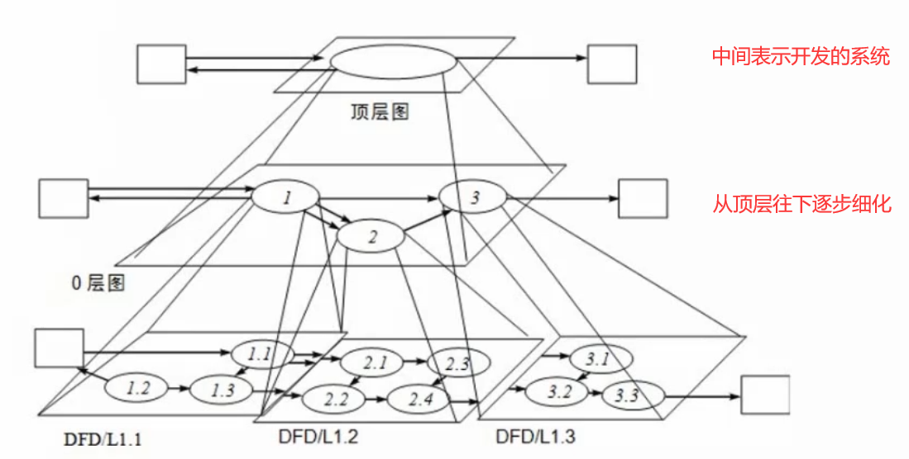

# 数据流图（DFD）（15分）

## 数据流图基本概念

数据流图无联系、ER图有联系

下图中数据流（箭头）上的字（用户信息、非法用户信息、格式错误信息）为数据【数据的具体含义记录在数据字典中】

用户验证、用户管理、操作管理、权限验证、格式检查、连接管理为加工操作

D1、D2、D3为数据存储【如数据库】

E2、E3为外部实体【如操作人员】

## 数据流图的分层

分层方法与结构化开发完全一直、数据流图是结构化开发方法主流工具

注意上一层图和下一层图要保持平衡

## 数据字典

## 数据流图的平衡原则

**子图内平衡：**

* 数据守恒原则
* 守恒加工原则
* 对于每个加工，必须既有输入数据流,又有输出数据流
* 外部实体与外部实体之间不存在数据流
* 外部实体与外部存储之间不存在数据流
* 数据存储与数据存储之间不存在数据流
* 父图与子图的平衡原则
* 数据流与加工有关，目必须经过加工

## ==答题技巧==

### 做题前先简要的看一下题目要求

* ***给出实体的名称***
* ***给出数据存储的名称***
* ***给出缺失的数据流（流向及名称）***
* ***纯概念类型的问答题***

### 详细阅读体感的说明部分、加工、存储、数据流

### 巧妙利用平衡原则找出图的错漏之处

## 相关问题

### 试题 1（数据管理中间件）

#### Q

#### A

**问题1**

* E2：数据管理员
* E3：后台数据库
* E1：前端应用

**问题2**

* D1：用户表
* D2：操作表
* D3：权限表

**问题3**

根据平衡原则可以发现*处理后的操作结果*与*操作结果*在0层图中确实

**问题4**

黑洞、奇迹、输入流和输出流同名

### 试题 2（信用卡管理系统）

#### Q

#### A

**问题1**
E1：非信用卡客户
E2：信用卡客户
E3：银行

**问题2**
名称			起点	终点
交易信息		P0		E2
信用卡申请表	E1		P0
激活请求		E2		P0

**问题3**
信用卡申请表	E1--->P4
激活请求		E2--->P3

**问题4**
P1 交易信息查询
P2 信用卡客户信息管理
P3 信用卡激活
P4 信用卡申请

# 数据库设计（15分）

## 数据库设计过程

## ER模型

## ==答题技巧==

### 做题之前先简要看一下题目的要求

* ER 模型的补充
* ER 模型转关系模式
* 关系模式的补充
* 概念方面的问题

### 仔细阅读题干的说明部分，结合题干说明补充 ER 模型

### 利用 ER 模型

## 相关题目(保留项)

# UML 建模（15 分）

## 基本分类

### 结构图（静态图）

* 类图
* 对象图
* 包图
* 组合结构图
* 构件图
* 部署图
* 制品图

### 行为图（动态图）

* 用例图（用例）
* 顺序图（序列图）
* 通信图（协作图）
* 定时图
* 状态图
* 活动图
* 交互概览图

## 用例图

==判断包含还是拓展看是否必须==

### 通常考点

* 根据题目中的说明给出用例的名称
* 给出两个用例之间的关系（包含、扩展、泛化）
  * ==《extend》==
  * ==《include》==

## ==类图与对象图[重点]==

菱形靠近的一边是书籍：书籍聚合成或组合成书籍列表

泛化关系 空心箭头是继承

### 多重度

多个：1..*

### 关系

### 通常考点

* 填类名、方法名、属性名
* 填多重复
* 填关系

## 顺序图（时序图）

**时间顺序**

对象写在顶端，上面一排对象 下面引出生命线，执行顺序是从上往下

消息的箭头是从谁到谁发送的消息

### 通常考点

* 根据题意填消息
* 填对象名

## 活动图

粗线表示并行的线程

### 带泳道的活动图

可以看到顶端对象

### 通常考点

* 根据流程和图的对应填空

## 状态图

优先确定状态 然后确定状态变迁的条件【监护条件】

### 通常考点

* 填状态以及状态变迁的条件

## 通信图（协作图）

**顺序图的另一种表达方式**

对象是节点

### 通常考点

* 填对象
* 填消息

### 答题技巧

* 答题前先简要看下问题描述
* 把题目给出的类名过一下，然后读题的时候圈出所用的类。
* 根据给出的 UML 图中类的关系（实现、泛化、聚合、组合），结合题意确定类名
* 算多重度的时候，以相对的方法去算，要分两次算一对多重度。

## 相关题目（保留项）

问题3：音轨 1..2 音轨 1..2

问题4：按任意键-->选择歌曲

# 数据结构与算法应用（15 分）

## 分治法（分解、解决、合并）

### 递归技术

### 二分查找

## 回溯法

**深度优先搜索**

## 贪心法

## 动态规划法

## 相关题目

