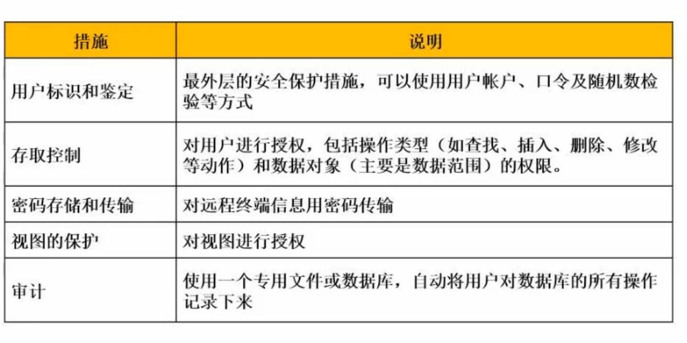
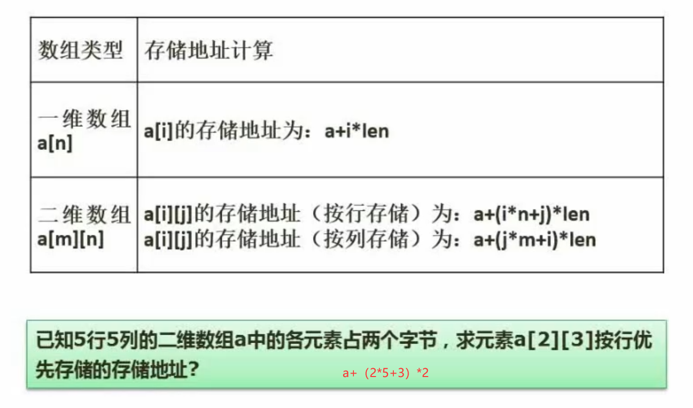
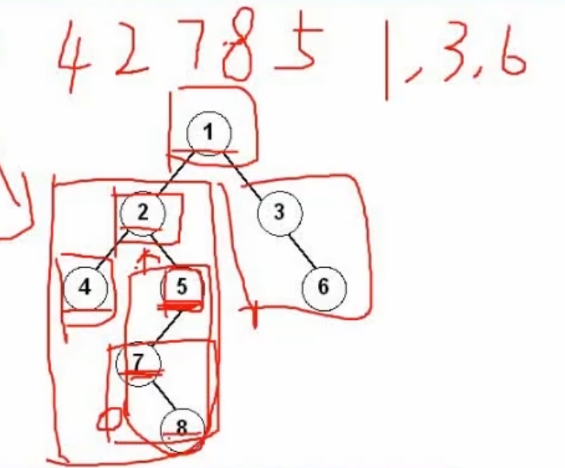
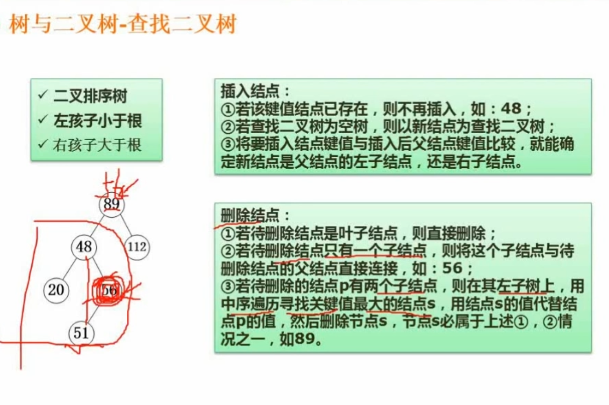
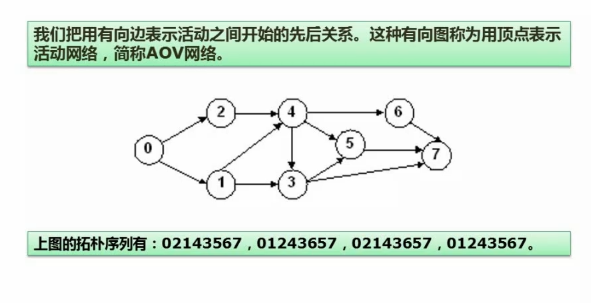
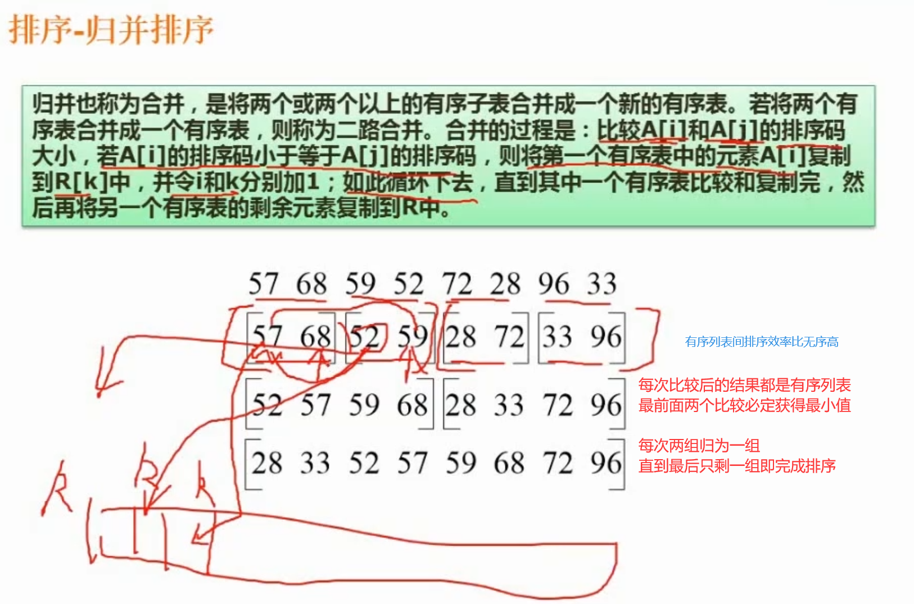
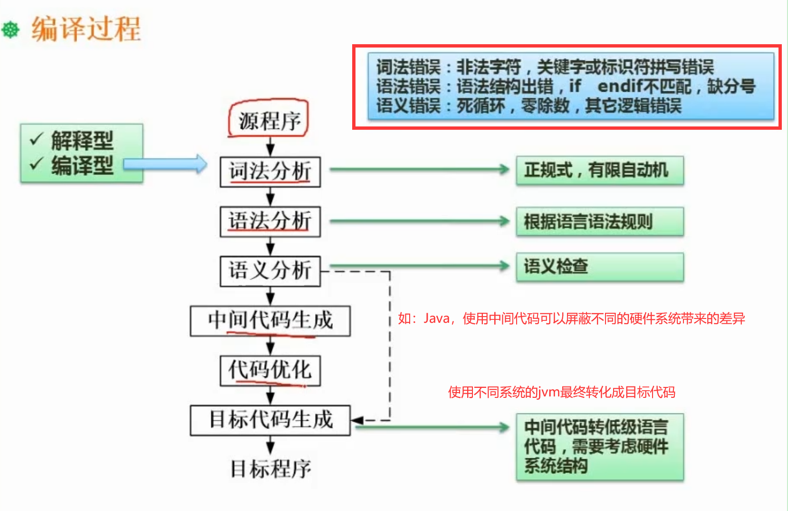
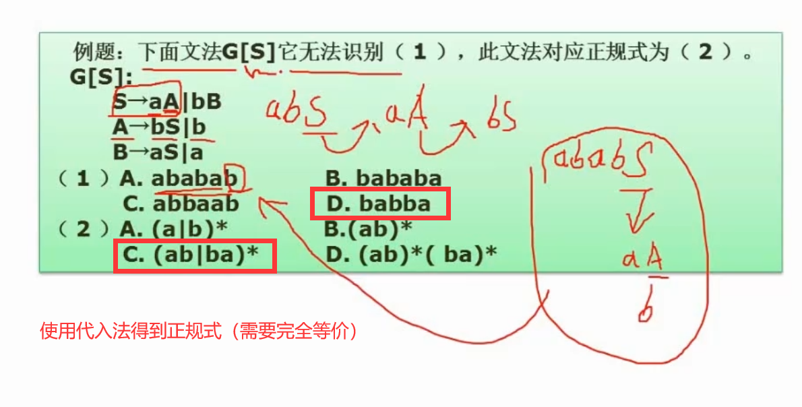
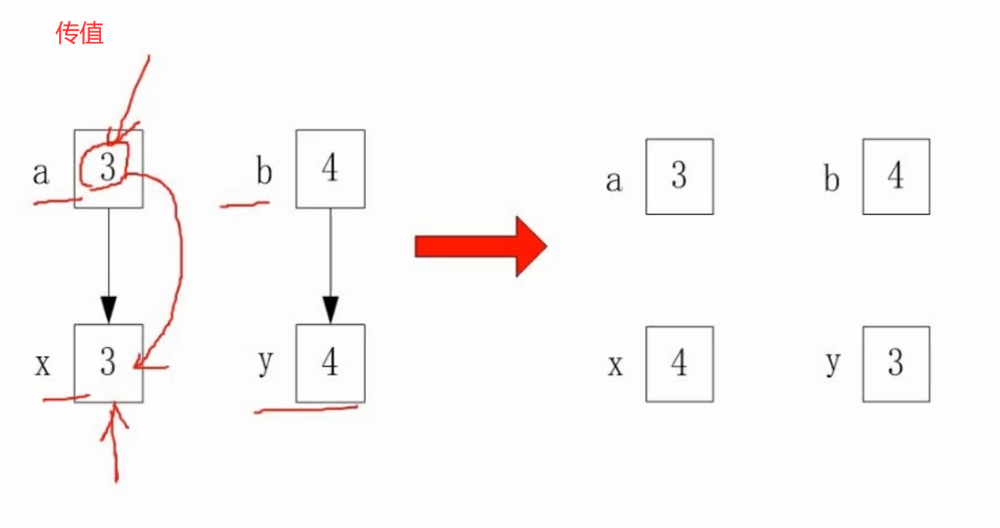

# 计算机结构（6分）

外设：

* 输入设备
* 输出设备
* 辅助存储器（辅存/外存）

主机：

* 主存储器（主存/内存）
* CPU
  * 运算器
  * 控制器

## CPU结构

### 运算器

1、算术逻辑单元ALU：数据的算数运算和逻辑运算

2、累加寄存器AC：通用寄存器。为ALU提供一个工作区，用在暂存数据

3、数据缓冲寄存器DR：写内存时，暂存指令或数据

4、状态条件寄存器PSW：存状态标志与控制标志（争议：也有将其归为控制器的）

### 控制器

1、程序计数器PC：存储下一条要执行的指令的地址

2、指令寄存器IR：存储即将执行的指令

3、指令译码器ID：对指令中的操作码字段进行分析解释

4、时序部件：提供时序信号

## 码值转换

**原码：最高位是符号位，其余低位表示数值的绝对值**

**反码：正数的反码与原码相同，负数的反码是绝对值按位取反（符号位不变）**

**补码：正数的补码与原码相同，负数的补码是反码末位+1（符号位不变）**

**移码：补码的符号位按位取反**

1、采用n位补码（包含一个符号位）表示数据，可以直接表示数值（D）

A、2^n^

B、-2^n^

C、2^n-1^

D、-2^n-1^

```perl
n=3时，四个选项为8、-8、4、-4
可表示的值为
000 100
001 101
010 110
011 111
100 补码人为定义-4，不需要-0
```

2、如果“2X”的补码是“90H"，X的真值是（B）

A、72

B、-56

C、56

D、111

```perl
90=10010000 
8421
补码10010000
反码10001111
原码11110000=-70H=-112
```

## 校验码

### 奇偶校验

校验码位数：1

校验码位置：一般拼接再头部

检错：**可检奇数位错**

纠错：**不可纠错**

检验方式：奇校验，最终1的个数是奇数个；偶校验，最终1的个数是偶数个；

### CRC循环冗余校验

校验码位数：生成多项式最高次幂决定

校验码位置：拼接再信息尾部

检错：**可检错**

纠错：**不可纠错**

检验方式：==模二除法==求余数，拼接作为校验位

### 海明校验

校验码位数：==**2^r^ ≥ m+r+1**==

校验码位置：插入再信息位中间

检错：**可检错**

纠错：**可纠错**

校验方式：==分组奇偶校验==

## 存储系统

快 $\Rightarrow$ 慢

CPU（**寄存器** ）$\Rightarrow$ **Cache**（按内容存取）【==单位k，速度1ns==】 $\Rightarrow$ **内存**（主存）【==单位G，速度1ms==】$\Rightarrow$ **外存**（辅存）【磁盘、光盘、U盘】

## 局部性原理

* 时间局部性：一段时间内频繁访问同一内容【如循环语句的循环体】
* 空间局部性：每次访问的内容其地址相邻【如数组】
* 工作集理论：工作集是进程运行时被频繁访问的页面集合

## 磁盘结构与参数

**==存取时间=寻道时间+等待时间（平均定位时间+转动延迟）==**

注意：寻道时间是指磁头移动到磁道所需的时间；等待时间为等待读写的扇区转到磁头下方所用的时间。

## 总线

* 内部总线
* **系统总线**
  * 数据总线：传输数据（32位、64位）
  * 地址总线：32位操作系统，内存地址4G
  * 控制总线：发送控制信号
* 外部总线

## 寻址方式

* 立即寻址方式：操作数直接在指令中，速度快，灵活性差
* 直接寻址方式：指令中存放的是操作数的地址
* 间接寻址方式：指令中存放了一个地址，这个地址对应的内容是操作数的地址
* 寄存器寻址方式：寄存器存放操作数
* 寄存器间接寻址方式：寄存器内存放的是操作数的地址

### CISC

复杂、操作数量多、频率差别大、多寻址

### RISC

精简、指令数量少、操作寄存器、单周期、少寻址、多通用寄存器、流水线

## 流水线

==**准并行**==

### 流水线计算

* **流水线周期**为执行时间最长的一段

* 流水线计算公式为：1条指令完整执行时间+(指令条数-1)*流水线周期
  * **==理论公式==**：(t~1~+t~2~+...+t~k~)+(n-1)*t  **默认理论公式，无答案时选实践公式**
  * **实践公式**：k*t+(n-1)\*t

* k为指令分成的段数

* t为流水线周期

* n为指令的条数

一条指令的执行过程可以分解为取指、分析、执行三步，在取指时间t~取值~=3Δt、分析时间t~分析~=2Δt、执行时间T~执行~=4Δt的情况下

若按串行方式执行，则10条指令全部执行完需要(*100*)Δt；

若按流水线的方式执行，流水线周期为（*4*）Δt。则10条指令全部执行完需要（*45*）Δt。

```perl
理论公式：3+2+4+(10-1)*4=45
实践公式：3*4+(10-1)*4=48
```

### 流水线吞吐率（Through Put rate，TP）

流水线吞吐率是指在**单位时间内流水线所完成的任务数量或输出的结果数量**。计算流水线吞吐率的基本公式为：
$$
TP=\frac{指令条数}{流水线执行时间}
$$


流水线最大吞吐率（**流水线周期的倒数**）：
$$
TP~max~=\lim_{n\rightarrow+\infty}\frac{n}{(k+n-1)*t}=\frac{1}{t}
$$

## 系统可靠性分析与设计

### 串联系统


**可靠度**：总的可靠度需要在R~1~~R~n-1~可靠的情况下计算
$$
R=R_{1}* R_{2} *...* R_{n}
$$
**失效率=1-可靠度**

### 并联系统


**可靠度：**
$$
R=1-(1-R_{1})*(1-R_{2})*...*(1-R_{n})
$$
**失效率=1-可靠度**

### 混合系统

**==先计算并联再计算串联，将每个并联（R1、R2、R3）（R5、R6）看成一个串联==**


# 操作系统原理（6分）

## 进程管理

### 进程的状态

**三态图**


**五态图**


### 前趋图

**表达事件的先后制约关系**

ABC需要全部完成才能开始D，ABC可并行完成


### PV操作

**前置**

**互斥：**同一时刻只允许一个进程使用资源，如千军万马过独木桥

**同步：**速度有差异，在一定情况停下等待

生产者与消费者（同步与互斥）

单缓冲区，只能存放一个资源

多缓冲区，可存放多个资源

**PV操作**

**==P操作为阻塞操作，V操作为唤醒操作，箭头开始为V，箭头结束为P==**

临界资源：诸进程间需要互斥方式对其进行共享的资源，如打印机、磁带机等

临界区：每个进程中访问临界资源的那段代码称为临界区

信号量：是一种特殊的变量


```mermaid
graph TB
P操作S=S-1 --> S小于0? --False--> 下一步
P操作S=S-1--> S小于0? --True--> 阻塞进程并放入等待队列
V操作S=S+1 --> S小于等于0? --False--> 下一步
V操作S=S+1 --> S小于等于0? --True--> 从等待队列唤醒进程执行
```


单缓冲区生产者、消费者问题PV原语描述：

**生产者**：

生产一个产品；

P(S1)；

送产品到缓冲区；

V(S2)；


**消费者**：

P（S2）；

从缓冲区取产品；

V（S1）；

消费产品；


**S1初值为1；S2初值为0**

### 死锁问题


不发生死锁的最小资源为：**k*(n-1)+1**

k为进程数

n为每个进程所需要的总的资源数量

**银行家算法：分配资源的原则**

* 当一个进程对资源的最大需求量不超过系统中的资源数时，可以接纳该进程
* 进程可以分期请求资源，但请求的总数不能超过最大需求量
* 当系统现有的资源不能满足进程尚需资源数是，对进程的请求可以推迟分配，但总能使进程在有限的时间里得到资源

## 存储管理

### 页式存储

用户程序记录**页**

页表记录**页**和对应的**物理块号**（**页帧号**）

内存划分成等量大小的**物理块**

**优点：**利用率高，碎片小，分配及管理简单

**缺点：**增加了系统开销，可能产生抖动现象

高级程序语言使用逻辑地址；运行状态，内存中使用物理地址。

逻辑地址=页号+页内地址【物理地址后半段】，可以在页表内根据页号找到页帧，页帧+页内地址=物理地址

若页面大小为4k，一个页的页内地址为2^12^，12位，高于12位的为页号

逻辑地址为5A29H，每个16进制对应4位2进制，A29为页内地址，5为页号，根据页号5找到页帧6，物理地址为6A29H

淘汰页面时，应该淘汰访问位为0的页面，刚被访问的访问位为1，不能淘汰

### 段式存储

段氏存储按逻辑方式划分，便于共享

段表存放段号，段长，基址（起始地址）

与页式存储不同，段长可以不同，但页大小必须相同

**优点：**多道程序共享内存，各段程序修改互不影响

**缺点：**内存利用率低，内存碎片浪费大

### 段页式存储

结合段氏、页式存储，先分段、再分页，先查段表再查页表增加开销

**优点：**空间浪费小，存储共享容易，存储保护容易，能动态连接

**缺点：**由于管理软件的增加，复杂性和开销也随之增加，需要的硬件以及占用的内容也有所增加，使得执行速度大大下降

### 快表

> 快表是一块小容量的相联存储器（Associative Memory），由高速缓存器组成，速度快，并且可以从硬件上保证按内容并行查找，一般用来存放当前访问最频繁的少数活动页面的页号

### 页面置换算法

* 最优（Optimal,OPT）算法：优先淘汰最长时间不被访问的页面，实际无法实现
* 随机（RAND）算
* **==先进先出（FIFO）算法==**：有可能产生“抖动”。优先淘汰最先进入内存的页面。例如，432143543215序列，内存用3个页面，比4个页面缺页要少。
* **==最近最少使用（LRU）算法==**：不会“抖动”。优先淘汰最近最久没有访问的页面。资源分配越多表现越好。

**抖动：**使用更多的资源（4个页面的内存空间）存放，缺产生了更多的缺页，刚被淘汰的页面立即又要访问，而调入不久即被淘汰，淘汰不久再被调入，如此反复，大部分时间消耗在页面调度上，而不是执行计算任务上

==**指令只会存在一次缺页、操作数会存在两次缺页。**==

## 文件管理

### 索引文件结构

索引存放地址占用4B

13个索引节点（0~12）

0~9为直接索引

10为一级索引，存放一级索引表，一级索引对应具体的物理盘块

11为二级索引，存放二级索引表，二级索引表存放一级索引表

12为三级索引，存放三级索引表，三级索引表存放二级索引表

每个索引都对应物理盘块

### 文件和树型目录结构

* **主要考查绝对路径和相对路径**
  * 绝对路径：从盘符开始的路径
  * 相对路径：从当前路径开始的路径

* 文件属性
  * R：只读文件类型
  * A：存档属性
  * S：系统文件
  * H：隐藏文件

* 文件名的组成
  * 驱动器号
  * 路径
  * 主文件名
  * 拓展名

### 位示图

位置表格，1代表已占用，0表示空间区域（如电影院买票空位）


## 作业管理

## 设备管理

### 数据传输控制方式


* **程序控制（查询）方式： **CPU介入最多的方式，CPU与外设交互效果差（每次需要主动查询外设应用程序是否完成）

* **程序中断方式：**应用程序完成时会发送中断信号，CPU接收到该信号以执行下一步操作，效率比程序控制方式高

* **DMA方式（直接程序控制方式）：**整个过程有DMA控制器接管，CPU只在开始和结束时介入

* 通道和输入输出处理机由专用的计算机解决（非重点）

### 虚设备与SPOOLING技术

开辟一块缓冲区，将未执行的任务放入队列中，平衡外部程序的低速与内部程序的高效。


### 微内核操作系统

**==需要掌握用户态与核心态的组成部分、请求==**

* 微内核相比单体内核更加高效，将功能分开，如文件系统崩溃时重启文件系统即可，而单体内核需要整个重启

* 微内核的用户态出现故障影响较小，核心态出现故障影响较为严重
* 用户态与核心态有交互、一般都由用户态处理，只有关键部分会在核心态处理


# 数据库系统（6分）

## 数据库模式ER模型

### 三级模式-两级映射

**三模式：**

* 内模式对应存储文件

* 概念模式对应基本表

* 外模式对应视图

**两映射：**

* 外模式-概念模式映射：视图和表之间的映射关系

* 概念模式-内模式映射：表和存储之间的映射关系


### 数据库设计过程

* 需求分析（数据流图、数据字典、需求说明书）
* 概念结构设计（ER 模型）
* 逻辑结构设计（关系模式，表），涉及规范化理论
* 物理设计（DBMS 特性、硬件、OS 特性）

> 数据库设计可以分为概念结构设计、逻辑结构设计和物理结构设计三个阶段。
>
> 1、概念结构设计。这是数据库设计的第一个阶段，在管理信息系统的分析阶段，已经得到了系统的数据流程图和数据字典，现在要结合数据规范化的理论，用一种数据模型将用户的数据需求明确地表示出来。
>
> ​	  概念数据模型是面向问题的模型，反映了用户的现实工作环境，是与数据库的具体实现技术无关的。建立系统概念数据模型的过程叫做概念结构设计。
>
> 2、逻辑结构设计。根据已经建立的概念数据模型，以及所采用的某个数据库管理系统软件的数据模型特性，按照一定的转换规则，把概念模型转换为这个数据库管理系统所能够接受的逻辑数据模型。不同的数据库管理系统提供了不同的逻辑数据模型，如层次模型、网状模型、关系模型等。
>
> 3、物理结构设计,为一个确定的逻辑数据模型选择一个最适合应用要求的物理结构的过程，就叫做数据库的物理结构设计。数据库在物理设备上的存储结构和存取方法称为数据库的物理数据模型。


### ER模型

#### 基本概念（实体、属性、联系）

ER即实体关系，entity relationship


#### ER模型的集成

**集成的方法:**

* 多个局部E-R图一次集成。
* 逐步集成,用累加的方式一次集成两个局部E-R。（简单不易出错但耗时）

**集成产生的冲突及解决办法:**

* 属性冲突：包括属性域冲突和属性取值冲突。（如：不同属性域相同属性的取值不同，性别使用男女和A、B表示）
* 命名冲突：包括同名异义和异名同义。
* 结构冲突：包括同一对象在不同应用中具有不同的抽象，以及同一实体在同局部E-R图中所包含的属性个数和属性排列次序不完全相同。（如：老师在一个系统里是一张表，另一个系统里是一个字段）

**一个实体型转换为一个关系模式**

* 1:1联系


* 1:n联系 $\Longrightarrow$ n可以变成一个关系模式 $\Longrightarrow$ 1:1 $\Longrightarrow$ 最少可以转化成两个关系模式

* m: n联系 $\Longrightarrow$ m和n都可以转化成一个关系模式 $\Longrightarrow$ 中间的关系模式无法合并 $\Longrightarrow$ 最少可以转化成三个关系模式

**三个以上实体间的一个多元联系**


## 关系代数

**交、并、差、笛卡尔积、投影、选择、关联**

### 交、并、差


### 笛卡尔积、投影、选择

列属性也可以用1、2、3表示第一列、第二列、第三列

投影相当于select 关键字后面的字段，如

```sql
select name,age from student
```

选择相当于where 关键字后面的条件，如

```sql
where id=1
```


### 联结


##  规范化理论

### 函数依赖

> 设R(U)是属性U上的一个关系模式,X和Y是U的子集，r为R的任一关系，
>
> 如果对于r中的任意两个元组u，v，只要有u[X]-v[X]，就有u[Y]=v[Y]，
>
> 则称X函数决定Y，或称Y函数依赖于X，记为X→Y。

**部分函数依赖：**复合主键中的一部分可以确定某一个属性。 

A为学号、B为课程号、C为姓名

A和B的组合为主键


**传递函数依赖：**A 可以确定 B，B 不可以确定 A，B 可以确定 C，那么 A 可以确定 C


### 键

* 超键（学号+姓名），可以确定性别，**超键和候选键都可以唯一标识元组**

* 候选键（学号），姓名为多余属性，**候选键可以有多个**

* 主键（学号和身份证号任选其一），**主键只有一个**


### 求候选键

* **将关系模式的函数依赖关系用“有向图”的方式表示**
* ==找入度为0的属性，并以该属性集合为起点，尝试遍历有向图，若能正常遍历图中所有结点，则该属性集即为关系模式的候选键==
* ==若入度为0的属性集不能遍历图中所有结点，则需要尝试性的将一些中间结点（既有入度，也有出度的结点）并入入度为0的属性集中直至该集合能遍历所有结点，集合为候选键==

 例题：


### 范式

非规范化的关系模式，可能存在的问题包括：==数据冗余、更新异常、插入异常、删除异常==

**一般做到第三范式、要做到第三范式必先达到第二范式、要做到第二范式必先达到第一范式**


#### 第一范式（原子性)

>  1NF，在关系模式R中，当且仅当所有域只包含原子值，即每个分量都是不可再分的数据项,则称R是第一范式。


#### 第二范式（完全依赖）

> 2NF，当且仅当R是1NF,且每一个非主属性完全依赖主键（不存在部分依赖)时，则称R是第二范式。


#### 第三范式（直接依赖，即无传递依赖）

> 3NF，当且仅当R是1NF，且E中没有非主属性传递依赖于码时，则称R是第三范式。


#### BC范式（所有关系左边必须是候选码）

> BC范式(BCNF):设R是一个关系模式,F是它的依赖集,R属于BCNF当且仅当其F中每个依赖的决定因素必定包含R的某个候选码。


### 模式分解（保持函数依赖分解、无损联接分解）


#### 无损分解


#### 判断无损分解的方法（画表法）

**关系模式用表表示，若有一行全部为a，则为无损分解**


#### 判断无损分解的方法（适用于一分为二）


## 并发控制

#### 基本概念


#### 并发产生的问题（丢失更新、不可重复读、读脏数据）


#### 封锁协议（S 锁、X 锁）

**S锁是读锁、X锁是写锁**

* 一级封锁协议。事务T在修改数据R之前必须先对其加X锁,直到事务结束才释放。==可防止丢失修改==
* 二级封锁协议。一级封锁协议加上事务T在读取数据R之前先对其加S锁，读完后即可释放S锁。==可防止丢失修改,还可防止读“脏”数据==
* 三级封锁协议。一级封锁协议加上事务T在读取数据R之前先对其加S锁，直到事务结束才释放。可==防止丢失修改、防止读“脏”数据与防止数据重复读==
* 两段锁协议。**可串行化的**。可能发生死锁

#### 死锁（预防法、死锁解除法）

## 数据库完整性约束

* 实体完整性约束（主键）
* 参照完整性约束（外键）
* 用户自定义完整性（自定义约束）
* 触发器（复杂的约束，可以写脚本约束）

## 数据库安全



## 数据库备份与恢复

### 冷备份、热备份

> 冷备份也称为静态备份，是将数据库正常关闭，在停止状态下，将数据库的文件全部备份(复制)下来。

> 热备份也称为动态备份，是利用备份软件，在数据库正常运行的状态下，将数据库中的数据文件备份出来。


### 完全备份、差量备份、增量备份

> *完全备份:备份所有数据*
>
> ==差量备份:仅备份上一次完全备份之后变化的数据==
>
> *增量备份:备份上一次备份之后变化的数据*

> 静态海量转储:在系统中无运行事务时进行，每次转储全部数据库。
>
> 静态增量转储:在系统中无运行事务时进行，每次只转储上一次转储后更新过的数据。
>
> 动态海量转储:转储期间允许对数据库进行存取或修改，每次转储全部数据库。
>
> 动态增量转储:转储期间允许对数据库进行存取或修改，每次只转储上一次转储后更新过的数据。

**日志文件:事务日志是针对数据库改变所做的记录，它可以记录针对数据库的任何操作，并将记录结果保存在独立的文件中**==（做增量备份之前丢失的数据可以使用此方式找回）==


### 故障与恢复


## 数据仓库与数据挖掘

### 基本概念

OLAP：数据联机分析处理服务器

数据集市：部门级数据仓库

数据仓库：企业级数据仓库

数据挖掘：使用算法对数据总结出规律，应用在商业领域


### 数据挖掘方法分类

* 方法
    * 决策树
    * 神经网络
    * 遗传算法
    * 关联规则挖掘算法
* 分类
    * 关联分析:挖掘出隐藏在数据间的相互关系。
    * 序列模式分析:侧重点是分析数据间的前后关系(因果关系)
    * 分类分析:为每一个记录赋予一个标记再按标记分类。
    * 聚类分析:分类分析法的逆过程。


## 反规范化技术（增加冗余列、重新组表、分割表）

由于规范化会使表不断的拆分,从而导数数据表过多。这样虽然减少了数据冗余，提高了增、删、改的速度，但会增加查询的工作量,系统需要进行多次连接，才能进行查询操作，使得系统效率大大下降

技术手段：

* 增加派生性冗余列
* 增加冗余列
* 重新组表
* 分割表

## 大数据


# 计算机网络（分）

## 七层模型


## 网络技术标准与协议（TCP/IP 协议簇）

* 网络层
    * ICMP：因特尔控制协议，**ping命令**
    * ARP：地址解析协议，*IP转mac地址*
    * RARP：反向地址解析协议，*mac地址转IP*
* 传输层
    * TCP：==可靠==协议，通信时建立连接，有反馈信息
    * UDP：==不可靠==协议，通信时不建立连接，直接发送数据包
* 应用层： 
    * 基于TCP，都是可靠的
        * HTTP： 超文本传输协议，传输网页数据
        * FTP： 文件传输协议
        * Telnet： 远程登录
        * *POP3* & *SMTP*：邮件传输协议
    * 基于UDP
        * DHCP：动态主机配置协议，在局域网内使用DHCP服务器做动态IP地址分配
        * TFTP：小文件传输协议
        * SNMP：简单网络管理协议
        * DNS：域名解析
    * samba、CIFS、NFS：文件共享协议，既可通过TCP实现又可通过UDP实现，其中*samba*可以*跨平台*


### TCP 协议（Transmission Control Protocol 传输控制协议）


### DHCP 协议（Dynamic Host Configuration Protocol，动态主机配置协议）

**续约机制：租约过半可续约，继续使用原来的IP**

当分配到的地址是***169.254.X.X***（Windows服务器）或***0.0.0.0***（Linux服务器）时，说明未和DHCP服务器连接上，导致IP分配失败（局域网或DHCP服务器故障/服务器问题）


### DNS 协议（递归查询、迭代查询）

> 递归查询:服务器必需回答目标IP与域名的映射关系。

> 迭代查询:服务器收到一次迭代查询回复一次结果，这个结果不一定是目标IP与域名的映射关系，也可以是其它DNS服务器的地址。

* ==主机向本地域名服务器==的查询采用==递归查询==。

* **本地域名服务器向根域名服务器**的查询通常采用**迭代查询**。


## 网络类型与拓扑结构

**按分布范围分：**

* 局域网（LAN）
* 城域网（MAN）
* 广域网（WAN）
* 因特网

**按拓扑结构分：**

* 总线型：使用一条总线将各个终端连接起来，传输信息都靠这条总线
* **星型**：中心节点连接其它节点，存在*单点故障*问题（一旦中心节点被破坏，整个网络都会瘫痪）
* 环型：可靠性优于星型，一个节点故障可以从另一个方向绕过

***办公室常用的是星型，中心节点是交换机***


## 网络规划与设计

* **网络规划原则**
    * 实用性原则
    * 开放性原则：用通用的标准
    * 先进性原则：强调不能用太过时的东西
* **网络设计任务**
    * 确定网络总体目标
    * 确定总体设计原则
    * 通信子网设计
    * 资源子网设计
    * 设备选型
    * 网络操作系统与服务器资源设备
    * 网络安全设计
* **网络设计原则**
    * 可用性：指网络或网络设备可用于执行预期任务时间所占总量的百分比。
    * 可靠性：网络设备或计算机持续执行预定功能的可能性。
    * 可恢复性：指网络从故障中恢复的难易程度和时间。
    * 适应性：指在用户改变应用要求时网络的应变能力。
    * 可伸缩性：指网络技术或设备随着用户需求的增长而扩充的能力（前期考虑拓展问题）。
* **网络实施原则**
    * 可靠性原则
    * 安全性原则
    * 高效性原则
    * 可扩展性原则
* 网络实施步骤
    * 工程实施计划
    * 网络设备到货验收
    * 设备安装
        系统测试
    * 系统试运行
    * 用户培训
    * 系统转换

### 逻辑网络设计

利用需求分析和现有网络体系分析的结果来设计逻辑网络结构，最后得到一份逻辑网络设计文档，输出内容包括以下几点：

* 逻辑网络设计图
* **IP地址方案**
* **安全方案**
* 具体的软硬件、广域网连接设备和基本服务
* 招聘和培训网络员工的具体说明
* 对软硬件、服务、员工和培训的费用初步估计

### 物理网络设计

物理网络设计是对逻辑网络设计的物理实现，通过对设备的具体物理分布、运行环境等确定，确保网络的物理连接符合逻辑连接的要求。输出如下内容：

* 网络物理结构图和布线方案
* 设备和部件的详细列表清单
* 软硬件和安装费用的估算
* 安装日程表，详细说明服务的时间以及期限
* 安装后的测试计划
* 用户的培训计划

### 分层设计（接入层、汇聚层、核心层）

* 接入层：向本地网段提供用户接入
* 汇聚层：网络访问策略控制、数据包处理、过滤、寻址
* 核心层：数据交换


## IP地址与子网划分

### IP地址

A类地址：前8位是网络号，后24位是主机号

==*172.18.129.0*/24：24表示网络号有24位，主机号只有8位==

==/20：表示网络号20位，主机号12位==


### 子网划分

* 子网掩码

* 将一个网络划分成多个子网（取部分主机号当子网号）

* 将多个网络合并成一个大的网络（取部分网络号当主机号）

==使用若干个主机位充当子网号，k个主机位可以划分2^k^个子网==（*以前全0和全1的不能使用，现在可以使用了，不需要减2*）


### 无分类编码


### 特殊含义的 IP 地址


### HTML


### 无线网


### 网络接入技术

* 有线接入
    * 公用交换电话网络（PSTN）
    * 数字数据网（DDN）
    * 综合业务数字网（ISDN）
    * 非对称数字用户线路（ADSL）
    * 同轴光纤技术（HFC）
* 无线接入
    * IEEE802.11（WiFi）
    * IEEE 802.15（蓝牙Bluetooth）
    * 红外（IrDA）
    * WAPI
* 3G/4G
    * 3G
        * **WCDMA**（使用最广泛）
        * CDMA2000（中国电信，小众）
        * TD-SCDMA（中国移动，小众）
    * 4G
        * LTE-Advanced
            * TDD：TD-SCDMA发展而来
            * FDD：WCDMA发展而来
        * WirelessMAN-Advanced（802.16m）(WiMAX)

### IPv6（单播地址，任播地址，组播地址）

IPV4使用32位，IPV6使用128位

IPv6是设计用于替代现行版本IP协议(IPv4)的下一代IP协议。

* IPv6地址长度为128位，**地址空间增大了2^96^倍**;
* 灵活的IP报文头部格式。使用一系列固定格式的扩展头部取代了IPv4中可变长度的选项字段。IPv6中选项部分的出现方式也有所变化，使路由器可以简单路过选项而不做任何处理，加快了报文处理速度;
* IPv6简化了报文头部格式，字段只有8个，加快报文转发，提高了吞吐量;
* 提高安全性。身份认证和隐私权是IPv6的关键特性;
* 支持更多的服务类型;
* 允许协议继续演变，增加新的功能，使之适应未来技术的发展;

> 单播地址(Unicast)：用于单个接口的标识符。

> 任播地址(Anycast)：泛播地址。一组接口的标识符，IPV4广播地址。

> 组播地址(Multicast)：IPv6中的组播在功能上与IPv4中的组播类似。

# 信息安全（3分）

## 信息系统安全属性

* 保密性：最小授权原则、防暴露、信息加密、物理保密
* 完整性：安全协议、校验码、密码校验、数字签名、公证
* 可用性：综合保障（IP过滤、业务流控制、路由选择控制、审计跟踪）【合法用户可以用合法方式访问相应的资源】
* 不可抵赖性：数字签名

## 加密技术

### 对称加密

**加密和解密使用同一个密钥**

如：日常压缩包使用的密码


### 非对称加密

公钥加密私钥解密 or 私钥加密公钥解密


### 信息摘要（MD5/SHA、密码保存、数据完整性的校验）


### 数字签名（签名=私钥加密、验证=公钥解密）

1、传输信息时会使用自己的私钥对摘要进行加密（被截获时，会使用截获摘要的主机私钥加密）

2、接收方使用发送方的公钥解密出摘要

3、将原文内容产生出的摘要与解密出的摘要对比，相同则完整


### 数字信封与 PGP

* 数字信封
    * 发送方将原文用对称密钥加密传输，而将对称密钥用接收方公钥加密发送给对方。
    * 接收方收到电子信封，用自己的私钥解密信封，取出对称密钥解密得原文。
* PGP协议
    *　PGP可用于电子邮件，也可以用于文件存储。采用了杂合算法，包括IDEA、RSA、MD5、ZIP数据压缩算法。
    *　PGP承认两种不同的证书格式：PGP证书和X.509证书。
    *　PGP证书包含PGP版本号、证书持有者的公钥、证书持有者的信息、证书拥有者的数字签名、证书的有效期、密钥首选的对称加密算法。
    *　X.509证书包含证书版本、证书的序列号、签名算法标识、证书有效期、以下数据:证书发行商名字、证书主体名、**主体公钥信息**、发布者的数字签名。

### 设计邮件加密系统（实例）


## 网络安全协议

### 各个网路层次的安全保障（==知道不同的安全协议属于哪一层==）


TLS是安全传输层协议的简称，用于在两个通信应用程序之间提供保密性和数据完整性。

SSL是安全套接层协议的简称，它也是一种为网络通信提供安全和数据完整性的协议，它与TLS非常接近，它们都是在传输层对网络连接进行加密。

PGP是一个基于RSA公匙加密体系的邮件加密软件。;用它可以对邮件保密以防止非授权者阅读。

HTTPS即安全版的HTTP (超文本传输协议)的,它是在HTTP下加入SSL层,HTTPS的安全基础就是SSL。

IPSec是网络层的安全协议，它通过使用加密的安全服务来确保在网络上进行保密而安全的通讯。

### 网络威胁与攻击

**威胁种类说明**


### 防火墙技术

**防火墙介绍（网络级—网络层、应用级—传输层）**

==屏蔽子网安全度最高==


# 数据结构与算法基础（10分）

## 数组与矩阵

### 数组（按行存储、按列存储）



### 稀疏矩阵（代入验证排除法）

大量元素为0，存上三角或下三角可以节约很多空间


## 线性结构（线性表、栈、队列、串）


### 线性表与链表


### 顺序存储与链式存储（对比）

* 链式存储需要一部分空间存指针，利用率下降
* 读取数据
    * 顺序存储可以直接读
    * 链式存储需要从头节点开始一个一个往下读
* 插入和删除
    * 顺序存储插入元素时需要将插入节点后的所有数据全部后移，删除同理
    * 链式存储只需要改变next指针的指向的地址即可


### 队列与栈


### 广义表（长度、深度、head/tail）


## 树

### 树与二叉树的基本概念

* 结点的度：一个结点拥有的孩子节点数

* 树的度：所有结点度数最高的
* 叶子结点：没有孩子结点的结点
* 分支结点：有孩子结点的结点
* 内部结点：非根结点也非叶子结点
* 父结点：相对而言
* 子结点：相对而言
* 兄弟结点：属于同一个父结点下的子结点
* 层次：树的层


***树的性质：节点个数为 n 的二叉树的最小高度⌈ ㏒ 2(n+1)⌉ ，最大高度 n***

***小根堆/大根堆***

* 父级节点小于两个子节点，称为小根堆
* 两个孩子节点小于父节点，反之称为大根堆

### 满二叉树和完全二叉树


### 二叉树的遍历

#### 前序遍历：根左右，12457836


#### 中序遍历：左根右，42785136



#### 后序遍历：左右根，4852631


==以上三种遍历（左or右）需要按照规则继续分割成（根、左、右）三部分直到无法再分==

#### 层次遍历：按层次从左到右遍历，12345678

### 反向构造二叉树

需要有**前序+中序**或**中序+后序**才可反向构造，==必须要有中序==


### 树转二叉树（孩子-兄弟表示法）


### 查找二叉树（排序二叉树）==左小于根，右大于根==

==特性：所有左子树结点都小于根、所有右子树结点都大于根==



### 最优二叉树（哈夫曼树、哈夫曼编码）

**最优二叉树：最短带权路径长度的树**

* 每个节点的度只能为 2 或者 0；
* 叶子结点数是 N 时，中间节点数为 N-1，总结点树为 2*N-1
* 哈夫曼编码：任意一个叶节点的编码都不是其他叶节点编码的前缀。
* 哈夫曼树应用于编码（左小右大）


### 线索二叉树（基于前序、中序、后序不同的线索）


### 平衡二叉树

使用平衡二叉树可以大幅提高查找效率

==某个节点：|左子树深度-右子树深度|<=1==

平衡度=左子树深度-右子树深度


### M 阶 B-树

一棵m阶的B-树,或者为空树,或为满足下列特性的m叉树：

* 树中每个结点至多有m棵子树;
* 若根结点不是终端结点,则至少有2棵子树;
* ***除根结点之外的所有非终端结点至少有[m/2]棵子树;***
* 所有的非终端结点中包含信息数据(n,P~0~ , K~1~, P~1~, K~2~,  P~2~,  ...K~n~, P~n~），其中:
    * K~i~(1≤i≤n)是关键字,并且K~i~<k~i+1~(1≤i≤n-1);
    * P~i~(0≤i≤n)是指向子树根结点的指针，而且指针P~i-1~所指子树中所有结点的关键字均小于关键字K~i~(1≤i≤n)，并且均大于关键字K~i-1~(2≤i≤n) ;第一个指针P~0~所指子树中所有结点的关键字均小于K~1~，最后一个指针P~n~,所指子树中所有结点的关键字均大于K~n~;
    * n是结点中关键字的个数，有[m/2]-1≤n≤m-1。
* 所有的叶子结点都出现在同一层次上，并且不带信息。这些结点实际上并不存在，如果查找进入叶子结点，则说明查找失败。

## 图（考查深度低于二叉树）

树和图的区别是：树没有环路、图有环路

### 图的概念及存储

#### 概念（有向图、无向图）


#### 存储（邻接矩阵、邻接表）

##### 邻接矩阵


##### 邻接表


### 图的遍历


### 图的最小生成树（普里姆算法、克鲁斯卡尔算法）

#### 普里姆算法：从一个顶点出发，依次寻找最近的点，并且不能形成环路

**将第一个顶点作为红点、其余都是蓝点、将红点到最近的蓝点连起来，连线的点也将变成红点，且不能成环，如此反复**


#### 克鲁斯卡尔算法：从最短的边开始选取，依次选取权重小的边，但不能组成环路。


### 拓扑排序 AOV/AOE（依次去掉没有流入的节点）

一般情况下，假设AOV图代表一个工程计划，则AOV网的一个拓扑排序就是一个工程顺利完成的可行方案。对AOV 网进行拓扑排序的方法如下。

* **在AOV网中选择一个入度为0（没有前驱）的顶点且输出它。**
* **从网中删除该顶点及其与该顶点有关的所有弧。**
* **重复上述两步,直到网中不存在入度为0的顶点为止。**



## 算法的特性

* 有穷性：**执行有穷步之后结束**。
* 确定性：**算法中每一条指令都必须有确切的含义，不能糊不清**。
* 输入（>=0)
* 输出（>=1)
* 有效性：算法的每个步骤都能有效执行并能得到确定的结果。**例如a=0 , b/a就无效**

## 时间复杂度与空间复杂度

整个算法的时间复杂度为最高值

O(1)表示时间复杂度是常数

O(n)表示循环n次（循环体执行n次）

O(n^2^)表示双重循环

O(n^3^)表示三重循环

O(log~2~n)：例如二叉树比较的次数 ，n为数据的个数


顺序查找与二分查找

### 顺序查找


### 二分查找

**折半查找在查找成功时关键字的比较次数最多为：**
$$
\lfloor log~2~n \rfloor+1
$$
**折半查找的时间复杂度为O(log~2~n)。**

**二分查找需要数据有序排列（从大到小or从小到大）**


**数组下标向下取整，比较过的无需再次放入比较区间**


## 散列表查找（Hash 表）

### 基本概念


### 散列表冲突的解决方法（线性探测法、伪随机数法）

线性探测法：将冲突的单元顺次移到后面一个单元

伪随机法：使用不同的散列函数再次进行计算，得到一个不冲突的单元空间（有可能得出同一个）

## ==排序==

### 基本概念


### 直接插入排序


### 希尔排序（先分组排序、再直接插入排序）


### 直接选择排序


### 堆排序

#### 堆的概念（大根堆、小根堆）


#### 堆排序（==适合得到前 K 个最大/小的数==）


##### 完全二叉树初建堆


##### 循环得到根，然后重建堆


### 冒泡排序


### 快速排序（分冶法）


### 归并排序（二路合并）



### 基数排序（从最小位到最大位依次排序）


## ==排序算法的时间复杂度和空间复杂度及稳定性==

**数值相同，排序后会不会改变原有的顺序决定了算法的稳定性**

*如：A[1]=10,A[7]=10,排序后A[1]与A[10]交换了位置则不稳定*


# 程序设计语言（6分）

## 重点模块说明


## 编译与解释

*解释型：一行一行读取并执行，执行到错误会终止*

*编译型：先编译后执行，编译过程中有错误，则一行都不会执行*

### 编译过程



## 文法的定义以及语法推导树

### 文法定义


### 文法的类型


### 语法推导树


## ==有限自动机与正规式（非确定有限自动机（NFA）、确定有限自动机（DFA））==

### 有限自动机


### 正规式（对有限自动机的另一种表达形式）

***代表循环多次[0,+∞]**





### 非确定有限自动机和确定有限自动机

* 确定有限自动机对每一个可能的输入只有一个状态的转移。

* 非确定有限自动机对每一个可能的输入可以有多个状态转移，接受到输入时从这多个状态转移中非确定地选择一个。


## ==表达式（逆波兰式/后序式）。解析逆波兰式的时候仅需要从左到右依次解析即可，但要考虑括号的优先级。==

### 表达式

==前缀表达式：根左右==

中缀表达式：左根右

==后缀表达式：左右根==

**括号表示运算的先后顺序不是要构造的元素，运算顺序乘除先加减后**


## ==函数调用（传值与传址）==





## 多种程序语言的特点


# 法律法规与标准化（2分)

## 知识产权概况


## 保护期限问题


## 知识产权人确定

**工作期间创作的物品属于职务作品、著作权专利权归属单位，单位有支付工资，提供场地**


## 侵权判定


## 标准化基础知识

### 标准化的分类


### 标准的编码


# 软件工程+结构化开发方法（11 分）

## 开发过程模型（瀑布、增量、原型、螺旋、喷泉、基于构件的开发模型、形式化方法模型、统一过程 UP、敏捷方法）


### 瀑布模型（需求明确/二次开发）

* 瀑布模型是结构化方法中的模型、一般用于结构化开发
* **只适用于需求明确的项目或是二次开发**

存在缺陷：延期、成本超支、无法继续完成下去，因为项目前期无法拥有明确的需求


### 原型模型、演化模型、增量模型

原型模型：先开发出一个简易系统，与用户交流，根据用户提出的意见进行改进，以了解用户的需求，用于需求分析阶段

演化模型：由原型演化而来

增量模型：先做好核心模块，在核心模块的基础上加其它功能模块


### 螺旋模型（多个原型-需求可以不明确）

***选择题出现需求不明确所选择的模型时，优先选择原型模型，其次选择螺旋模型***

螺旋模型包含原型模型和瀑布模型的特征


### V 模型（尽早的进行测试，并贯穿始终）

强调测试要贯穿始终


### 喷泉模型（面向对象模型：迭代、无间隙）

面向对象模型，瀑布、增量、V、螺旋都是结构化方法模型


### 快速开发模型（RAD）


### 构建组装模型（CBSD）

### 敏捷开发方法

* 极限编程（XP）
* 水晶法（Crystal）
* 并列争求法（Scrum）
* 自适应软件开发（ASD）
* 敏捷统一过程（AUP）

### 统一过程UP

* 起始阶段
* 精化阶段
* 构建阶段
* 移交阶段

## 信息系统的开发方法（结构化法、原型法、面向对象法、面向服务法）

### 开发方法分类

## 需求的分类与需求获取

## 需求分析

## 结构化设计

## ==数据流图==

## 测试原则与类型

## 测试用例设计

### 黑盒测试

### 白盒测试

## 测试阶段

### 单元测试

### 集成测试

### 系统测试（性能、压力、可靠性）

### 确认测试

## **McCabe 度量法的环路复杂性（V=m-n+2）以节点开头和结尾**