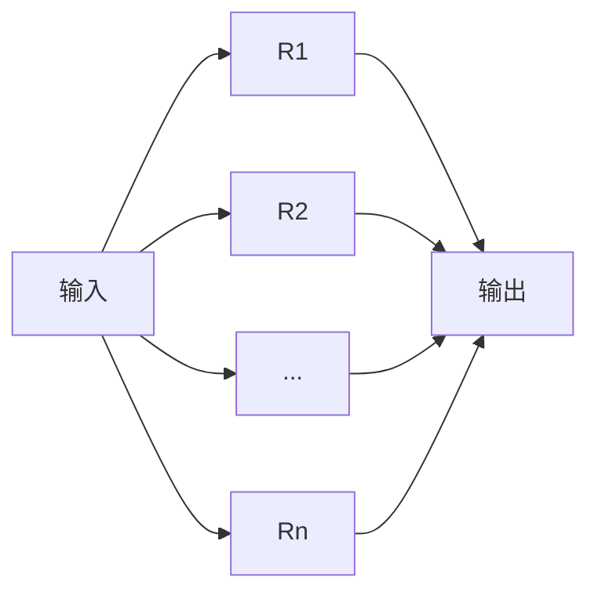
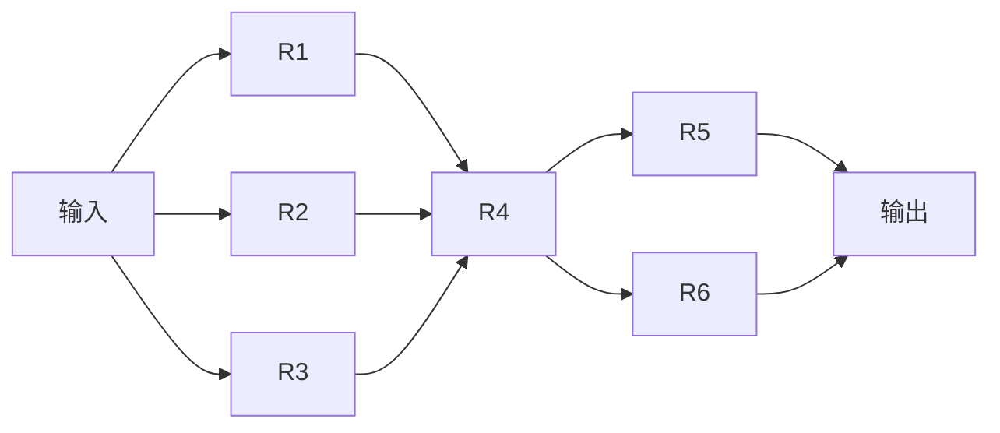
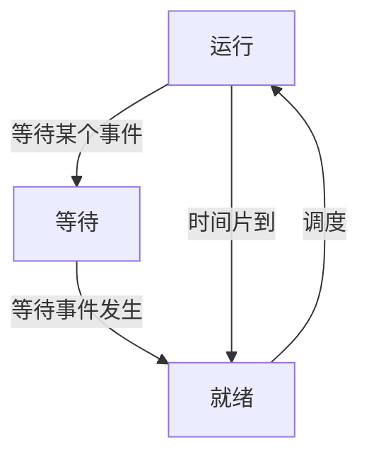
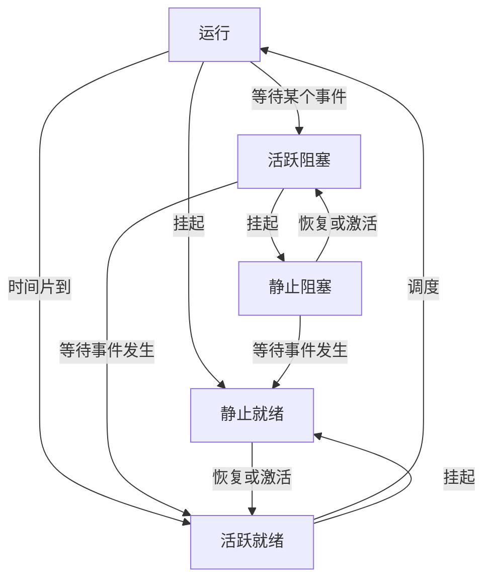
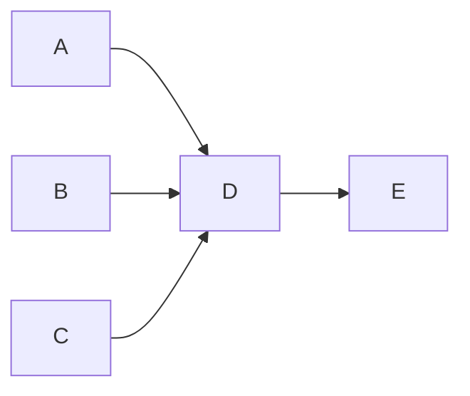
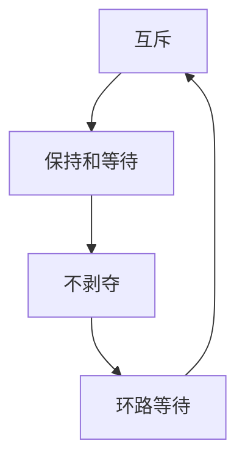

## 码值转换

**原码：最高位是符号位，其余低位表示数值的绝对值**

**反码：正数的反码与原码相同，负数的反码是绝对值按位取反（符号位不变）**

**补码：正数的补码与原码相同，负数的补码是反码末位+1（符号位不变）**

**移码：补码的符号位按位取反**

1、采用n位补码（包含一个符号位）表示数据，可以直接表示数值（D）

A、2^n^

B、-2^n^

C、2^n-1^

D、-2^n-1^

```perl
n=3时，四个选项为8、-8、4、-4
可表示的值为
000 100
001 101
010 110
011 111
100 补码人为定义-4，不需要-0
```

2、如果“2X”的补码是“90H"，X的真值是（B）

A、72

B、-56

C、56

D、111

```perl
90=10010000 
8421
补码10010000
反码10001111
原码11110000=-70H=-112
```

## 校验码

### 奇偶校验

校验码位数：1

校验码位置：一般拼接再头部

检错：**可检奇数位错**

纠错：**不可纠错**

检验方式：奇校验，最终1的个数是奇数个；偶校验，最终1的个数是偶数个；

### CRC循环冗余校验

校验码位数：生成多项式最高次幂决定

校验码位置：拼接再信息尾部

检错：**可检错**

纠错：**不可纠错**

检验方式：==模二除法==求余数，拼接作为校验位

### 海明校验

校验码位数：==**2^r^ ≥ m+r+1**==

校验码位置：插入再信息位中间

检错：**可检错**

纠错：**可纠错**

校验方式：==分组奇偶校验==

## 计算机结构

外设：

* 输入设备
* 输出设备
* 辅助存储器（辅存/外存）

主机：

* 主存储器（主存/内存）
* CPU
  * 运算器
  * 控制器

### CPU结构

#### 运算器

1、算术逻辑单元ALU：数据的算数运算和逻辑运算

2、累加寄存器AC：通用寄存器。为ALU提供一个工作区，用在暂存数据

3、数据缓冲寄存器DR：写内存时，暂存指令或数据

4、状态条件寄存器PSW：存状态标志与控制标志（争议：也有将其归为控制器的）

#### 控制器

1、程序计数器PC：存储下一条要执行的指令的地址

2、指令寄存器IR：存储即将执行的指令

3、指令译码器ID：对指令中的操作码字段进行分析解释

4、时序部件：提供时序信号

### 存储系统

快 $\Rightarrow$ 慢

CPU（**寄存器** ）$\Rightarrow$ **Cache**（按内容存取）【==单位k，速度1ns==】 $\Rightarrow$ **内存**（主存）【==单位G，速度1ms==】$\Rightarrow$ **外存**（辅存）【磁盘、光盘、U盘】

### 局部性原理

* 时间局部性：一段时间内频繁访问同一内容【如循环语句的循环体】
* 空间局部性：每次访问的内容其地址相邻【如数组】
* 工作集理论：工作集是进程运行时被频繁访问的页面集合

### 磁盘结构与参数

**==存取时间=寻道时间+等待时间（平均定位时间+转动延迟）==**

注意：寻道时间是指磁头移动到磁道所需的时间；等待时间为等待读写的扇区转到磁头下方所用的时间。

### 总线

* 内部总线
* **系统总线**
  * 数据总线：传输数据（32位、64位）
  * 地址总线：32位操作系统，内存地址4G
  * 控制总线：发送控制信号
* 外部总线

## 寻址方式

* 立即寻址方式：操作数直接在指令中，速度快，灵活性差
* 直接寻址方式：指令中存放的是操作数的地址
* 间接寻址方式：指令中存放了一个地址，这个地址对应的内容是操作数的地址
* 寄存器寻址方式：寄存器存放操作数
* 寄存器间接寻址方式：寄存器内存放的是操作数的地址

### CISC

复杂、操作数量多、频率差别大、多寻址

### RISC

精简、指令数量少、操作寄存器、单周期、少寻址、多通用寄存器、流水线

## 流水线

==**准并行**==

### 流水线计算

* **流水线周期**为执行时间最长的一段

* 流水线计算公式为：1条指令完整执行时间+(指令条数-1)*流水线周期
  * **==理论公式==**：(t~1~+t~2~+...+t~k~)+(n-1)*t  **默认理论公式，无答案时选实践公式**
  * **实践公式**：k*t+(n-1)\*t

* k为指令分成的段数

* t为流水线周期

* n为指令的条数

一条指令的执行过程可以分解为取指、分析、执行三步，在取指时间t~取值~=3Δt、分析时间t~分析~=2Δt、执行时间T~执行~=4Δt的情况下

若按串行方式执行，则10条指令全部执行完需要(*100*)Δt；

若按流水线的方式执行，流水线周期为（*4*）Δt。则10条指令全部执行完需要（*45*）Δt。

```perl
理论公式：3+2+4+(10-1)*4=45
实践公式：3*4+(10-1)*4=48
```

### 流水线吞吐率（Through Put rate，TP）

流水线吞吐率是指在**单位时间内流水线所完成的任务数量或输出的结果数量**。计算流水线吞吐率的基本公式为：
$$
TP=\frac{指令条数}{流水线执行时间}
$$


流水线最大吞吐率（**流水线周期的倒数**）：
$$
TP~max~=\lim_{n\rightarrow+\infty}\frac{n}{(k+n-1)*t}=\frac{1}{t}
$$

## 系统可靠性分析与设计

### 串联系统


**可靠度**：总的可靠度需要在R~1~~R~n-1~可靠的情况下计算
$$
R=R_{1}* R_{2} *...* R_{n}
$$
**失效率=1-可靠度**

### 并联系统



**可靠度：**
$$
R=1-(1-R_{1})*(1-R_{2})*...*(1-R_{n})
$$
**失效率=1-可靠度**

### 混合系统

**==先计算并联再计算串联，将每个并联（R1、R2、R3）（R5、R6）看成一个串联==**



## 操作系统原理

### 进程管理

#### 进程的状态

**三态图**



**五态图**




#### 前趋图

**表达事件的先后制约关系**

ABC需要全部完成才能开始D，ABC可并行完成



#### PV操作

**前置**

**互斥：**同一时刻只允许一个进程使用资源，如千军万马过独木桥

**同步：**速度有差异，在一定情况停下等待

生产者与消费者（同步与互斥）

单缓冲区，只能存放一个资源

多缓冲区，可存放多个资源

**PV操作**

**==P操作为阻塞操作，V操作为唤醒操作，箭头开始为V，箭头结束为P==**

临界资源：诸进程间需要互斥方式对其进行共享的资源，如打印机、磁带机等

临界区：每个进程中访问临界资源的那段代码称为临界区

信号量：是一种特殊的变量


```mermaid
graph TB
P操作S=S-1 --> S小于0? --False--> 下一步
P操作S=S-1--> S小于0? --True--> 阻塞进程并放入等待队列
V操作S=S+1 --> S小于等于0? --False--> 下一步
V操作S=S+1 --> S小于等于0? --True--> 从等待队列唤醒进程执行
```


单缓冲区生产者、消费者问题PV原语描述：

**生产者**：

生产一个产品；

P(S1)；

送产品到缓冲区；

V(S2)；


**消费者**：

P（S2）；

从缓冲区取产品；

V（S1）；

消费产品；


**S1初值为1；S2初值为0**

#### 死锁问题




不发生死锁的最小资源为：**k*(n-1)+1**

k为进程数

n为每个进程所需要的总的资源数量

**银行家算法：分配资源的原则**

* 当一个进程对资源的最大需求量不超过系统中的资源数时，可以接纳该进程
* 进程可以分期请求资源，但请求的总数不能超过最大需求量
* 当系统现有的资源不能满足进程尚需资源数是，对进程的请求可以推迟分配，但总能使进程在有限的时间里得到资源

### 存储管理

#### 页式存储

用户程序记录**页**

页表记录**页**和对应的**物理块号**（**页帧号**）

内存划分成等量大小的**物理块**

**优点：**利用率高，碎片小，分配及管理简单

**缺点：**增加了系统开销，可能产生抖动现象

高级程序语言使用逻辑地址；运行状态，内存中使用物理地址。

逻辑地址=页号+页内地址【物理地址后半段】，可以在页表内根据页号找到页帧，页帧+页内地址=物理地址

若页面大小为4k，一个页的页内地址为2^12^，12位，高于12位的为页号

逻辑地址为5A29H，每个16进制对应4位2进制，A29为页内地址，5为页号，根据页号5找到页帧6，物理地址为6A29H

淘汰页面时，应该淘汰访问位为0的页面，刚被访问的访问位为1，不能淘汰

#### 段式存储

段氏存储按逻辑方式划分，便于共享

段表存放段号，段长，基址（起始地址）

与页式存储不同，段长可以不同，但页大小必须相同

**优点：**多道程序共享内存，各段程序修改互不影响

**缺点：**内存利用率低，内存碎片浪费大

#### 段页式存储

结合段氏、页式存储，先分段、再分页，先查段表再查页表增加开销

**优点：**空间浪费小，存储共享容易，存储保护容易，能动态连接

**缺点：**由于管理软件的增加，复杂性和开销也随之增加，需要的硬件以及占用的内容也有所增加，使得执行速度大大下降

#### 快表

> 快表是一块小容量的相联存储器（Associative Memory），由高速缓存器组成，速度快，并且可以从硬件上保证按内容并行查找，一般用来存放当前访问最频繁的少数活动页面的页号

#### 页面置换算法

* 最优（Optimal,OPT）算法：优先淘汰最长时间不被访问的页面，实际无法实现
* 随机（RAND）算
* **==先进先出（FIFO）算法==**：有可能产生“抖动”。优先淘汰最先进入内存的页面。例如，432143543215序列，内存用3个页面，比4个页面缺页要少。
* **==最近最少使用（LRU）算法==**：不会“抖动”。优先淘汰最近最久没有访问的页面。资源分配越多表现越好。

**抖动：**使用更多的资源（4个页面的内存空间）存放，缺产生了更多的缺页，刚被淘汰的页面立即又要访问，而调入不久即被淘汰，淘汰不久再被调入，如此反复，大部分时间消耗在页面调度上，而不是执行计算任务上

==**指令只会存在一次缺页、操作数会存在两次缺页。**==

### 文件管理

#### 索引文件结构

索引存放地址占用4B

13个索引节点（0~12）

0~9为直接索引

10为一级索引，存放一级索引表，一级索引对应具体的物理盘块

11为二级索引，存放二级索引表，二级索引表存放一级索引表

12为三级索引，存放三级索引表，三级索引表存放二级索引表

每个索引都对应物理盘块

#### 文件和树型目录结构

* **主要考查绝对路径和相对路径**
  * 绝对路径：从盘符开始的路径
  * 相对路径：从当前路径开始的路径

* 文件属性
  * R：只读文件类型
  * A：存档属性
  * S：系统文件
  * H：隐藏文件

* 文件名的组成
  * 驱动器号
  * 路径
  * 主文件名
  * 拓展名

#### 位示图

位置表格，1代表已占用，0表示空间区域（如电影院买票空位）

### 作业管理

### 设备管理

### 微内核操作系统

虚设备与SPOOLING技术