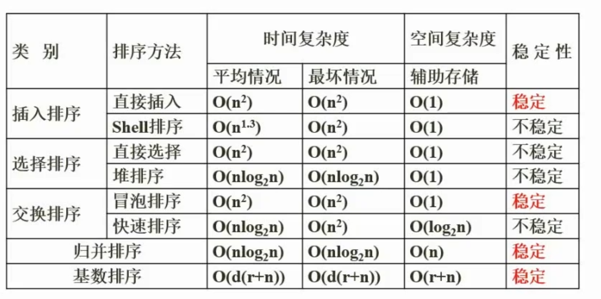

# 设计模式

## 设计原则

单一职责原则：设计目的单一的类

开放封闭原则：对拓展开放，对修改封闭

李氏替换原则：子类可以替换父类

依赖倒置原则：要依赖于抽象，而不是具体实现；针对接口编程，不要针对实现编程

接口隔离原则：使用多个专门的接口比使用单一的总接口要好

组合重用原则：要尽量使用组合，而不是继承关系达到重用目的【修改父类子类要跟着变，】

迪米特原则：一个对象应当对其他对象有尽可能少的了解

共同重用原则：一个包的所有类都是共同重用的，如果重用了包中的一个类、就要重用包中的所有类

## 设计模式

### 创建型模式

抽象工厂模式：提供一个接口，可以创建一系列相关或相互依赖的对象，无需指定它们具体的类

构建器模式：将一个复杂类的表示与构造相分离，使得相同的构建过程能够得出不同的表示

工厂方法模式：定义一个创建对象的接口，但由子类决定需要实例化哪一个类，工厂方法使得子类实例化的过程推迟

原型模式（克隆模式）：用原型实例指定创建对象的类型，并且通过拷贝这个原型来创建新的对象

单例模式：保证一个类只有一个实例，并提供一个访问它的全局访问点

### 结构型模式

适配器模式【==转换接口==】：将一个类的接口转换成用户希望得到的另一种接口，使得不相容的接口得以协同工作

桥接模式【==继承树拆分==】：将类的抽象部分和它的实现部分分离开，使它们可以独立地变化

组合模式【==树形目录结构==】：将对象组合成树型结构以表示【整体-部分】的层次结构，使用户对单个对象和组合对象的使用具有一致性

装饰模式【==附加职责==】：动态地给一个对象添加一些额外的职责，它提供了用子类拓展功能的一个灵活的替代，比派生一个子类更加灵活

外观模式【对外统一接口】：定义一个高层接口，为子系统中的一组接口提供一个一致的外观，简化子系统的使用

享元模式【共享方法】：提供支持大量细粒度对象共享的有效方法

代理模式：为其他对象提供一种代理以控制这个对象的访问

### 行为型模式

责任链模式【==传递职责==】：通过给多个对象处理请求的机会，减少请求的发送者与接收者之间的耦合，将接收对象链接起来，在链中传递请求，直到有一个对象处理这个请求

命令模式【==日志记录，可撤销==】：将一个请求封装为一个对象，从而可用不同的请求对客户进行参数化，将请求排队或记录请求日志，支持可撤销的操作

策略模式【==多方案切换==】：定义一系列算法，把它们一个个封装起来，并且使它们之间可相互替换，从而让算法可以独立于使用它的用户而变化

中介者模式：用一个中介对象来封装一系列的对象交互，它使各个对象不需要显式的相互调用，从而达到低耦合，还可以独立地改变对象间的交互

备忘录模式：在不破坏封装性的前提下，捕获一个对象内部状态，并在该对象之外保存这个状态，从而可以在以后该对象恢复到原先保存的状态

观察者模式：定义对象间的一种一对多的依赖关系，但一个对象的状态发生改变时，所有的依赖于它的对象都得到通知并自动更新

状态模式【==VIP等级==】：允许一个对象在其内部状态改变时改变它的行为

解释器模式：给定一种语言，定义它的文法表示，并定义一个解释器，该解释器用来根据文法表示来解释语言中的句子

迭代器模式【iterater.next()】：提供一种方法来顺序访问一个聚合对象中的各个元素而不需要暴露该对象的内部表示

模板方法模式：定义一个操作中的算法骨架，而将一些步骤延迟到子类中，使得子类可以不改变一个算法的结构即可重新定义算法的某些特定步骤

访问者模式：表示一个作用域某对象结构中的各元素的操作，使得在不改变各元素的类的前提下定义作用于这些元素的新操作

# 算法时间空间复杂度

稳定排序

* 直接插入
* 冒泡排序
* 归并排序
* 基数排序

每次排序都能确定一个元素最终位置的排序：

* 快速排序
* 冒泡排序
* 堆排序
* 简单选择排序

# 二叉树

构建二叉树大顶堆：

* 先按照元素顺序构造二叉树
* 选择第一个最大的非叶子结点，与其两个孩子比较，如果比最大的那个孩子小，则与孩子交换位置
* 重复上述过程直到父结点比孩子结点都大为止

M阶B树：

* 根节点最多有m棵子树
* 所有叶子节点在同一层次上
* 节点中的关键字有序排列

哈夫曼编码树：==左子树上的为0，右子树上的为1==，每个节点的度【==叶子==数量】只能为 ==2 或者 0==，最优二叉树，==（左小右大）==，==最小的值作为叶子节点== ，

==构造哈夫曼树核心思想：最小合并，每次都是选最小的两个数合并==

对于五个字符用二进制表示 需要三位 用霍夫曼编码表示可以压缩

# 耦合

内容耦合：一个模块直接使用另一个模块的内部数据，或通过非正常入口而转入另一个模块内部

公共耦合：多个模块访问同一个公共数据环境，如两个模块通过外部变量来交换信息

数据耦合：两个模块之间有调用关系，传递的是简单的数据值，相当于值传递

标记耦合：两个模块之间传递的是数据结构

控制耦合：一个模块调用另一个模块时，传递的是控制变量，被调用模块通过控制变量的值执行模块内某一功能，被调用模块内有多个功能，哪个功能起作用受调用模块控制

# 其他

哈希表中查找关键字e是成功的且与多个关键字进行了比较，则关键字的第一个可以不是e的同义词

对稀疏矩阵的压缩方法：

* 三元组顺序链表
* 十字链表行逻辑连接的顺序表
* 行逻辑连接的顺序表

面向对象分析的执行活动顺序：

* 认定对象
* 组织对象
* 描述对象间的相互作用
* 确定对象的操作
* 定义对象的内部信息

面向对象设计的主要活动：

* 识别类及对象
* 定义属性
* 定义服务
* 识别关系
* 识别包

模块之间的接口设置在概要设计阶段

淘汰页面时：

* 应该淘汰访问位为0的页面，刚被访问的访问位为1，不能淘汰
* 状态位为0的页面无法被淘汰，不在内存中
* 修改位为0的页面可以淘汰

Java是即时编译程序栈空间

编译过程：

* 词法分析：非法字符、关键字或标识符单词拼写错误
* 语法分析：语法结构、标点符号、表达式缺少操作数、 缺少括号
* ==语义==分析：运算符、运算对象类型不合法、==死循环==

==闪存==用来代替==ROM==、掉电后信息不丢失，RAM是随机存取存储器，无法用闪存替代

DMA方式传送数据时、每传送一个数据都需要占用一个存储周期

RISC与CISC

* RISC采用流水线技术、CISC不采用流水线技术
* RISC采用组合逻辑控制器硬布线控制、CISC采用==微程序控制器==
* RISC多采用通用寄存器、CISC少采用通用寄存器

网上银行支付时是通过==支付网关==在Internet与银行专用网直接进行数据交换

数据库给表加==索引==改变的是==内模式==

中缀表达式时需要加括号，==右子树是整体的 加括号==，后缀表达式不需要考虑顺序无需括号

《==中华人民共和国著作权法==》和《==计算机软件保护条例==》是构成我国保护计算机软件著作权的两个基本法律文件

防火墙认为==内部网络==是==安全==和可信赖的，外部网络是不可靠的，受保护程度内网最高

==包过滤防火墙==是对==网络层==的数据报文进行检查

==AES==是==分组对称加密==

如果==X→Y可以由F关系推出==，则称==F蕴涵X→Y==

==条件（布尔）表达式==一般作为==监护条件==

购物车与商品是聚合关系、网店与商品是组合关系

McCabe复杂度：闭合环路数量+1

==浏览器==输入ftp://ftp.tsinghua.edu.cn执行访问时执行的是==域名解析==

数据链路层在物理线路上提供可靠的数据传输

Prim算法采用的是贪心算法

==邻接表==有==奇数个==表示边的表结点，图G为==有向图==，无向图的结点个数为偶数

==面向对象==程序==设计语言==为面向对象==实现==

运行时将==调用和响应调用==所需执行==的代码加以结合==的机制是==动态绑定==

在多态的集合不同方式中，==过载==多态是一种特定的多态，指同一个名字在==不同上下文中可代表不同的含义==

==风险无法消除== ，无法通过消除风险降低风险危害

关键路径问题：

* 项目的最少完成时间 是最长的路径
* ==结点的最早开始时间，正推最大；最晚开始时间，反推最小==
* 边的最早开始时间，起点的最早，最晚开始时间为 结束点-边值

划分模块是，一个模块的作用范围应该在其控制范围之内，若发现其作用范围不在控制范围内，可以将判定的模块合并到父模块中，==不可以将父模块下移== 使判断处于较高的层次

==独家==许可证：除授权方外，==软件著作人==不可以授权第三方 但自己==可以用==

==独占==许可证：==软件著作人==自己也==不可以用==，仅授权方使用

部署==入侵检测==系统阻断攻击==无法阻止SQL注入==

出口防火墙配置==ACL==功能可以组织外部未授权用户访问内部网络

SFTP是SSH加密FTP的文件传输

==I/O接口与打印设备==间交换信息是采用==异步传输==的方式

==保存现场==最有效的办法是==堆栈==

多对多联系转换为一个独立的关系模式R时，R的关键字为==各实体关键字的集合==

快速原型模式不适合大型系统的开发

段号为31\~22，页号为21\~12，页内地址为11~0，则系统最多可有1024个段，每个段最大允许有1024个页，页的大小为4k

==递归==是==自上而下==的分析法

==编译型语言==是先编译后执行，运行效率高==可移植性差==

全局变量存储在静态存储区，不会在栈帧中

公司对某产品保密约束的情况下 不享有专利权

==翻译权==是指将一种==自然语言==文字转化成另一种自然语言文字

委托软件开发的情况下，若无书面合同则软件==著作权==由==受托人==享有

==X.509==采用的是==RSA==算法，==SM2==国密是用的==ECC==，ECC的加密强度更高 计算速度更快

流水线采用异步控制会增加阻塞概率，并不会提高性能

Apache==默认Web的目==录为==/home/httpd==

python创建==一个元素的元组==需要==(1,)==不能(1)，==要逗号==

测试层次，定义的==方法==属于==算法层==

敏捷开发中，==并列争球法==是使用==迭代==的方法 把一段时间的迭代作为冲刺

沟通公式：n*(n-1)/2

Web防火墙无法防止流氓软件

OSI模型中，==压缩、加密==功能是==表示层==

==漏洞扫描不属于入侵检测==

==POP3==服务器与客户端软件建立==TCP==连接

==著作权产生==的时间是自作品==创作完成之日==

==概要设计==时就要确定==模块的划分==

模块内==所有处理元素都在同一个数据结构==上操作，模块的内聚类型为==通信内聚==

构造二叉树的关键码序列，==父节点必定先于子节点==

三总线结构计算机总线系统由==数据总线、地址总线、控制总线==组成

汇编程序==不会将伪指令==翻译成机器代码

属于==同一网关==下的服务器才可以==通信==

编译过程中 对声明语句是记录所遇到的符号信息，进行符号表填查工作，对==可执行语句==是==翻译成中间代码或目标代码==

对于线性表，相对于顺序存储 采用==链表存储的缺点==是数据元素之间的关系需要占用存储空间，导致==存储密度低==

==多对多联系==需要单独转换成一个关系模式，==重建类==

==主域名服务器==收到域名请求后 首先查询==本地缓存==

对系统提出==新需求==，属于==适应性==维护

==修改权、署名权、保护作品完整权==是永久保护的

ARP属于网络层协议

# 数据结构与算法

广度优先探索问题是采用的==分支限界算法==

循环队列是将顺序队列形成有个环状结构、元素入队时修改尾指针、元素出队时修改头指针，==入队和出队都不需要移动队列中其他元素==

嵌入式操作系统的==可定制性==是指==减少成本==和==缩短研发周期==考虑要求操作系统能针对硬件变化改变进行结构与功能上的配置，以满足不同微处理器平台的要求

# 操作系统

==程序计数器==PC是存储==下一条要执行的指令的地址==，==程序员可以访问==，跟踪指令地址

==DRMA== 是一种需要通过==周期性刷新==来保存数据的存储器件，SRAM集成率低，功耗大

==PCI==总线是==并行内==总线、==SCSI==总线是==并行外==总线

补码：将减法转换为加法运算，可以简化计算机运算部件的设计

==中断==向量提供的是中断服务程序的==入口地址==

流水线的吞吐率是最长流水段操作时间

==直接存储器存取（DMA）==，无需CPU干预

CPU是在一个==总线周期==结束时响应==DMA==请求

获取==键盘鼠标输入==的是==中断==程序

==BIOS==保存在主板上的==ROM==中

==字长==为32位代表要求==数据总线==的宽度为32位，内存容量决定地址长度

==SCSI不属于系统总线==，它是打印机扫描仪接口的独立处理器标准

==单总线==只能分时工作 ==效率低==

Cache是在合理的成本下提高命中率

==相联存储器==按==内容访问==，不是寻址

虚拟存储体系是由主存-辅存构成

全相联地址映射可以实现主存的任意一块装映射到Cache中的任意一块

海明码利用多组数位的奇偶性来检错和纠错，CRC码的格式位k个数据位之后跟r个校验位

==指令寄存器==对用户==完全透明==

定点表示法中，小数点不占用存储位

程序的三种基本控制结构是顺序、选择、重复

# UML图

==序列图==描述了以==时间==顺序组织的对象之间的交互活动

==构件图==展现一组构建之间的组织和依赖，专注于系统的==静态实现==图

# 英语

recurring：经常

overwhelmed：淹没，不堪重负

reusable：复用

pertinent：相关

regarded：认为

# 下午题目

## 数据库设计

如何判断关系模式，看哪边就把哪边作为select条件，另一边作为where条件

使用where条件

如 部门和员工

select 员工 from 表 where 部门=‘’开发部”，此结果查询出的结果 员工为多个

select 部门 from 表 where 员工=”张三“，此结果查询出的结果 部门只有一个

所以关系模式为 1个部门对应多个员工 

